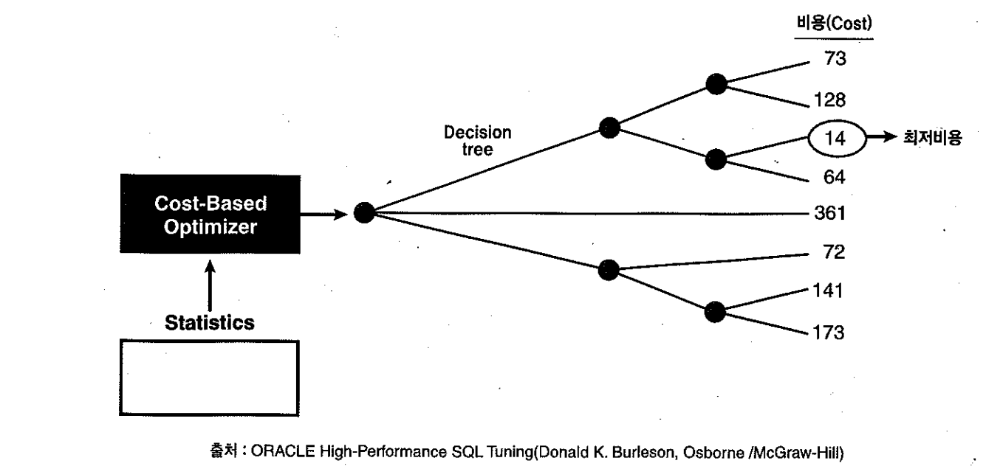
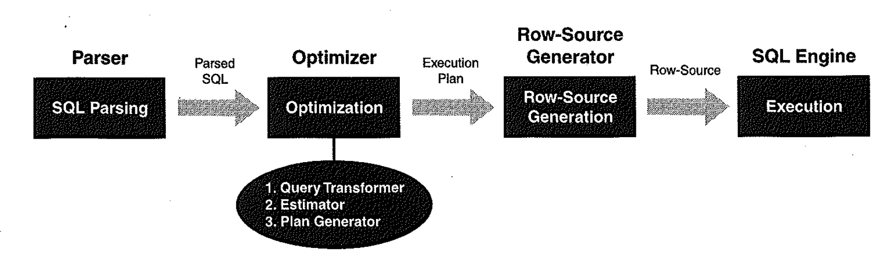

# 01. 옵티마이저


## 1) 옵티마이저란?

- 사용자가 요청한 SQL을 가장 효율적이고 빠르게 수행할 수 있는 최적의 처리경로를 선택해주는 DBMS의 핵심엔진이다. 사람으로 치자면 두뇌!!


- 규칙기반 옵티마이저(Rule-Based Optimazerm, RBO) : 10g부터는 RBO에대한 기술지원 X
- 비용기반 옵티마이저Cose-Based Optimazerm, CBO)


## 2) 규칙기반 옵티마이저

- 휴리스틱 옵티마이저라고 불리우며, 미리 정해 놓은 우선 순위에 따라 액세스 경로를 평가하고 실행계획을 수립한다.


| 순위 | 액세스경로                                                | 설명                                                  |
| :--- | :-------------------------------------------------------- | :---------------------------------------------------- |
| 1    | Single Row By Rowid                                       | ROWID에 의한 단일 로우                                |
| 2    | Single Row By Cluster Join                                | 클러스터 조인에 의한 단일 로우                        |
| 3    | Single Row By Hash Cluster Key whit Unique or Primary Key | 유일하거나 PK를 가진 해시 클러스터키에 의한 단일 로우 |
| 4    | Single Row By Unique or Primary Key                       | 유일하거나 PK에 의한 단일 로우                        |
| 5    | Clustered Join                                            | 클러스터 조인                                         |
| 6    | Hash Cluster Key                                          | 해시 클러스터 키                                      |
| 7    | Indexed Cluster Key                                       | 인덱스 클러스터 키                                    |
| 8    | Composite Index                                           | 복합 컬럼 인덱스                                      |
| 9    | Single-Column Indexes                                     | 단일 컬럼 인덱스                                      |
| 10   | Bounded Range Search on Indexed Columns                   | 인덱스기 구성된 컬럼에서 제한된 범위 검색             |
| 11   | Unbounded Range Search on Indexed Columns                 | 인덱스가 구성된 컬럼에서 무제한 범위 검색             |
| 12   | Sort Merge Join                                           | 정렬-병합 조인                                        |
| 13   | MAX or MIN of Indexed Column                              | 인덱스가 구성된 열에서 MAX 또는 MIN                   |
| 14   | ORDER BY on Indexed Column                                | 인덱스가 구성된 열에서 ORDER BY                       |
| 15   | Full Tabel Scan                                           | 풀 테이블 스캔                                        |


#### 규칙기반 옵티마이저가 사용하는 규칙 테스트

- empno 컬럼에 인덱스가 있으면 무조건 sort order by 연산을 대체한다
- 그러한이유로 full table scan하고 정렬하는 편이 나은데 위의 표< 규칙기반 옵티마이저가 사용하는 규칙> 으로인하여 order by (14)가 높아서 선택함.

```sql
explain plan for 
select /*+ rule */ * from scott.emp order by empno; 

select * from table(dbms_xplan.display);

----------------------------------------------
| Id  | Operation                   | Name   |
----------------------------------------------
|   0 | SELECT STATEMENT            |        |
|   1 |  TABLE ACCESS BY INDEX ROWID| EMP    |
|   2 |   INDEX FULL SCAN           | PK_EMP |
----------------------------------------------
```


## 3) 비용기반 옵티마이저

- 비용을 기반으로 최적화를 수행
- 비용이란, 쿼리를 수행하는 소요되는 일량 도는 시간을 뜻합니다.
- 테이블과 인덱스에 대한 여러 통계정보를 기초로 각 오퍼레이션 단계별 예상 비용을 산정
- 이를 합산한 총비용이 가장 낮은 실행계획 하나를 선택
- 비용산정시 사용되는 오브젝트 통계항목에는 레코드 개수, 블록 개수, 평균 행 길이, 컬럼 값의 수,
- 컬럼 값 분포, 인덱스 높이, 클러스터링 팩터등이 있다.
- 최근 시스템통계정보(cpu속도, 디스크I/O속도)까지 이용한다.


| 최적의 수행단계는 아래와 같다                          |
| ------------------------------------------------------ |
|  |

1. 사용자가 던진 쿼리를 수행을 위해, 후보군이 될만한 실행계획을 찾는다.
2. 데이터 딕셔너리에 미리 수집해 놓은 오브젝트 통계 및 시스템 통계정보를 이용해 각 실행계획의 예상비용을 산정한다.
3. 각 실행계획의 비용을 비교해서 최저비용을 갖는 하나를 선택한다.


#### 동적 샘플링

- 쿼리를 최적화할 때 미리 구해놓은 통계정보를 이용한다고 했는데, 만약 테이블과 인덱스에 대한 통계정보가 없거나 너무 오래되어 신뢰할수없을 때 옵티마이저가 동적으로 샘플링을 수행하도록 할 수 있다.
- `optimizer_dynamic_sampling` 파라미터로 동적 샘플링 레벨을 조정하며, 9i에서 기본 레벨이 1이던 것이 10g에서 2로 상향 조정되었다.
  따라서 10g에서는 쿼리 최적화 시 통계정보 없는 테이블을 발견하면 무조건 동적 샘플링을 수행한다.
- 레벨을 0으로 설정해 동적 샘플링이 일어나지 않게 할 수 있으며, 9i 기본 값인 1로 설정할 때는 아래 조건을 모두 만족할 때만 동적 샘플링이 일어난다. 
  - (1) 통계정보가 수집되지 않은 테이블이 적어도 하나 이상 있고,
  - (2) 그 테이블이 다른 테이블과 조인되거나 서브쿼리 또는 Non-mergeable View에 포함되고,
  - (3) 그 테이블에 인덱스가 하나도 없고,
  - (4) 그 테이블에 할당된 블록 수가 32개(동적 샘플링을 위한 표본 블록 수의 기본 값)보다 많을때

- 레벨 설정은 최대 10까지 가능하다. 레벨이 높을수록 옵티마이저는 더 적극적인 동적 샘플링을 수행하며 샘플링에 사용되는 표본 블록 개수도 증가한다.

```sql
create table bshman_test
( col1 number,
  col2 number,
  col3 number
)  

create index bshman_test_idx on bshman_test(col3);

insert into bshman_test
select rownum,
       dbms_random.value(1,100000),
       ceil(dbms_random.value(1,100))
from dual
connect  by level < 10000000

- 실행sql
select *
from bshman_test
where col3 < 10

- alter session set optimizer_dynamic_sampling  =0;

call         count         cpu    elapsed        disk       query    current        rows
------- ----------  ---------- ---------- ----------- ----------- ----------  ----------
Parse            1        0.00       0.00           0           0          0           0
Execute          1        0.00       0.00           0           0          0           0
Fetch         3222        0.33       0.35           0       25269          0       80510
------- ----------  ---------- ---------- ----------- ----------- ----------  ----------
Total         3224        0.33       0.35           0       25269          0       80510

Misses in library cache during parse: 0
Optimizer goal: All_Rows
Parsing user id: 66  (BSHMAN)

Rows     Row Source Operation
-------  ---------------------------------------------------
  80510  TABLE ACCESS BY INDEX ROWID BSHMAN_TEST (cr=25269 pr=0 pw=0 time=1368864 us)
  80510   INDEX RANGE SCAN BSHMAN_TEST_IDX (cr=3373 pr=0 pw=0 time=324344 us)(object id 55109)
 
- alter session set optimizer_dynamic_sampling  =10;

call         count         cpu    elapsed        disk       query    current        rows
------- ----------  ---------- ---------- ----------- ----------- ----------  ----------
Parse            1        0.00       0.00           0           0          0           0
Execute          1        0.00       0.00           0           0          0           0
Fetch         3222        0.16       0.10           0        5740          0       80510
------- ----------  ---------- ---------- ----------- ----------- ----------  ----------
Total         3224        0.16       0.10           0        5740          0       80510

Misses in library cache during parse: 0
Optimizer goal: All_Rows
Parsing user id: 66  (BSHMAN)

Rows     Row Source Operation
-------  ---------------------------------------------------
  80510  TABLE ACCESS FULL BSHMAN_TEST (cr=5740 pr=0 pw=0 time=241631 us)
```





#### CBO 기준으로 SQL처리 절차

1. Query Transformer : 사용자가 던진 SQL을 그대로 최적화하는 것이 아니라 우선 최적화하기 쉬운 형태로 변환을 시도한다.
   - 물론 쿼리 변환 전후 결과가 동일함이 보장될 때만 그렇게 한다.

2. Estimator : 쿼리 오퍼레이션 각 단계의 선택도(Selectivity), 카디널리티(Cardinality), 비용(Cost)을 계산하고, 궁극적으로는 실행계획 전체에 대한 총 비용을 계산한다.
3. Plan Generator : 하나의 쿼리를 수행하는 데 있어, 후보군이 될만한 실행계획들을 생성해내는 역할을 한다.


#### 스스로 학습하는 옵티마이저란?

- 생략------


## 4) 옵티마이저 모드

- 옵티마이저 모드를 선택할 수 있는 값으로는 5개가 존재하고, 시스템 레벨 , 세션 레벨, 쿼리 레벨등으로 변경 할 수있다.
- rule, all_rows, first_rows, first_row_n, choose

```sql
alter system set optimizer_mode = all_rows;    -- SYSTEM LEVEL
alter session set optimizer_mode = all_rows;   -- SESSION LEVEL
select /*+ all_rows */ from t where...         -- QUERY LEVEL
```


#### RULE 모드

- RBO 모드


#### ALL_ROWS 모드

- 쿼리를 결과집합을 처음부터 끝까지 fetch 하는것을 전제로 시스템 리소스를 가장 적게 사용하는 실행계획을 선택한다.
- DML의 경우 first_rows 형식으로 일부집합만 fetch하고 멈추는 경우가 존재히지 않으므로, 무조건 all_rows를 선택한다.
- 또한, select 절의 union all, minus, for_update, pl/sql(단 흰트를 사용하거나 기본모드가 rule경우제외)


#### FIRST_ROW 모드

```sql
CREATE TABLE T_EMP
AS
SELECT * FROM EMP,
( SELECT ROWNUM NO FROM DUAL CONNECT BY LEVEL <= 1000)
ORDER BY DBMS_RANDOM.VALUE

ALTER TABLE T_EMP ADD CONSTRAINT T_EMP_PK PRIMARY KEY(EMPNO,NO)

BEGIN
  DBMS_STATS.GATHER_TABLE_STATS
(
  OWNNAME => USER,
  TABNAME => 'T_EMP',
  METHOD_OPT => 'FOR COLUMNS SAL'
);
END;

SET AUTOTRACE TRACEONLY EXP

SELECT /*+ ALL_ROWS */ * 
FROM T_EMP
WHERE SAL >= 5000
ORDER BY EMPNO,NO;   

Execution Plan
----------------------------------------------------------
Plan hash value: 1175086354

----------------------------------------------------------------------------
| Id  | Operation          | Name  | Rows  | Bytes | Cost (%CPU)| Time     |
----------------------------------------------------------------------------
|   0 | SELECT STATEMENT   |       |  1000 | 41000 |    24   (9)| 00:00:01 |
|   1 |  SORT ORDER BY     |       |  1000 | 41000 |    24   (9)| 00:00:01 |
|*  2 |   TABLE ACCESS FULL| T_EMP |  1000 | 41000 |    23   (5)| 00:00:01 |
----------------------------------------------------------------------------

Predicate Information (identified by operation id):
---------------------------------------------------

   2 - filter("SAL">=5000)
```

#####  FIRST_ROW로 변경

- FIRST_ROW 모드로 바꾸자 ORDER BY 컬럼 순으로 정렬된 PK인덱스를사용 하여 실행계획을 수립
- TABLE FULL SCAN의 비용은 26, INDEX FULL SCAN의 비용은 13900 이지만, 사용자가 FETCH 도중에 멈출 것이라는 가정 하에 이런 계획이 수립

~~~sql
SELECT /*+ FIRST_ROWS */ * 
FROM T_EMP
WHERE SAL >= 5000
ORDER BY EMPNO,NO;   


Plan hash value: 1185322641
 
----------------------------------------------------------------------------------------
| Id  | Operation                   | Name     | Rows  | Bytes | Cost (%CPU)| Time     |
----------------------------------------------------------------------------------------
|   0 | SELECT STATEMENT            |          |       |       | 13899 (100)|          |
|*  1 |  TABLE ACCESS BY INDEX ROWID| T_EMP    |  1000 | 41000 | 13899   (1)| 00:02:47 |
|   2 |   INDEX FULL SCAN           | T_EMP_PK | 14000 |       |    37   (3)| 00:00:01 |
----------------------------------------------------------------------------------------
 
Predicate Information (identified by operation id):
---------------------------------------------------
 
   1 - filter("SAL">=5000)
~~~

- 최종결과 집합에 해당하는 레코드 비율은 7%밖에 되지않는다.
- 따라서 첫 번째 FETCH 분량을 얻기까지 많은 인덱스 스캔과 테이블 액세스를 수반하므로 FIRST_ROWS가 지향하는 최초 응답속도도 생각만큼 좋지 않을 수 있다.
- ARRAYSIZE 가 작을 때만 이점이있음에도 불구하고, 옵티마이저는 무조건 INDEX FULL SCAN을 선택했다.

~~~sql
SET AUTOTRACE OFF
SELECT COUNT(*) ALL_EMP,
       COUNT(CASE WHEN SAL >= 5000 THEN 1 END) OVER_5000,
       ROUND(COUNT(CASE WHEN SAL >= 5000 THEN 1 END) / COUNT(*) * 100) RATIO
FROM T_EMP;

   ALL_EMP  OVER_5000      RATIO
---------- ---------- ----------
     14000       1000          7
~~~

##### FIRST_ROWS (CBO)

- 규칙의 영향을 받긴했지만 FIRST_ROWS 도 CBO모드이므로 통계정보를 활용한다.
- 그러므로, 컬럼 히스토그램을 생성했을때 SAL >= 5001 인 사원이 없다는 사실을 알고있는 옵티마이저도 알수있다.
- 따라서, 조건절을 SAL >= 5001로 변경하면 실행계획도 바뀐다.

~~~sql
SELECT /*+ FIRST_ROWS */ * 
FROM T_EMP
WHERE SAL >= 5001
ORDER BY EMPNO,NO; 

Plan hash value: 1175086354
 
----------------------------------------------------------------------------
| Id  | Operation          | Name  | Rows  | Bytes | Cost (%CPU)| Time     |
----------------------------------------------------------------------------
|   0 | SELECT STATEMENT   |       |       |       |    24 (100)|          |
|   1 |  SORT ORDER BY     |       |     1 |    41 |    24   (9)| 00:00:01 |
|*  2 |   TABLE ACCESS FULL| T_EMP |     1 |    41 |    23   (5)| 00:00:01 |
----------------------------------------------------------------------------
 
Predicate Information (identified by operation id):
---------------------------------------------------
 
   2 - filter("SAL">=5001)
~~~

##### RULE 힌트

- 같은 조건을 주고 RBO로 실행하면 INDEX FULL SCAN을 선택한다.

~~~sql
SELECT /*+ RULE */ * 
FROM T_EMP
WHERE SAL >= 5001
ORDER BY EMPNO,NO;   

Plan hash value: 1185322641
 
------------------------------------------------
| Id  | Operation                   | Name     |
------------------------------------------------
|   0 | SELECT STATEMENT            |          |
|*  1 |  TABLE ACCESS BY INDEX ROWID| T_EMP    |
|   2 |   INDEX FULL SCAN           | T_EMP_PK |
------------------------------------------------
 
Predicate Information (identified by operation id):
---------------------------------------------------
 
   1 - filter("SAL">=5001)

Note
-----
   - rule based optimizer used (consider using cbo)
~~~

##### 요약

- FIRST_ROWS 가 RBO보다 낫긴 해도 완벽한 비용에 근거하지 않기 때문에 불합리한 결정을 할 때 가 종종있다.
- 이를 보완하기위해 9i 에서 first_rows_n 이 나왔다.
- first_rows 는 이제는 과거와의 호환성을 위해서 남게되었다.


#### FIRST_ROWS_N

- 사용자가 처음 n개 로우만 fetch 하는 것을 전제로, 가장 빠른 응답속도를 낼수있는 실행계획을 선택한다.
- n개로 지정 할 수 있는 값은 1,10,100,1000 네 가지며, 사용자가 지정한 n개 로우이상으로 fetch 한다면
- 오히려 리소스를 많이 사용하여 전체 수행속도를 늦출수가있다.

```sql
alter session set optimizer_mode = first_row_100; -- 1,10,100,1000 으로 한정, 그 외 경우 에러발생
select /*+ first_rows(100) */ *
from t_emp...

SET AUTOTRACE OFF

 SELECT COUNT(*) ALL_EMP,
        COUNT(CASE WHEN SAL >= 2000 THEN 1 END) OVER_2000,
        ROUND(COUNT(CASE WHEN SAL >= 2000 THEN 1 END) / COUNT(*) * 100) RATIO
 FROM T_EMP;


   ALL_EMP  OVER_2000      RATIO
---------- ---------- ----------
     14000       6000         43

SET AUTOTRACE TRACEONLY EXP  

-- SAL >= 2000 사원은 6000명 이고 , 전체 43%를 자치하므로 일정량을 FETCH 할경우 TABLE FULL SCAN보다 비용이 커진다.

SELECT /*+ FIRST_ROWS(10) */ * 
FROM T_EMP
WHERE SAL >= 2000
ORDER BY EMPNO,NO;   

Plan hash value: 1185322641
 
----------------------------------------------------------------------------------------
| Id  | Operation                   | Name     | Rows  | Bytes | Cost (%CPU)| Time     |
----------------------------------------------------------------------------------------
|   0 | SELECT STATEMENT            |          |       |       |    28 (100)|          |
|*  1 |  TABLE ACCESS BY INDEX ROWID| T_EMP    |  5999 |   240K|    28   (0)| 00:00:01 |
|   2 |   INDEX FULL SCAN           | T_EMP_PK |    26 |       |     2   (0)| 00:00:01 |
----------------------------------------------------------------------------------------
 
Predicate Information (identified by operation id):
---------------------------------------------------
 
   1 - filter("SAL">=2000)

-- 추가시작 

----------------------------------------------------------------------------------------------------------------------------------
| Id  | Operation                   | Name     | Starts | E-Rows |E-Bytes| Cost (%CPU)| E-Time   | A-Rows |   A-Time   | Buffers |
----------------------------------------------------------------------------------------------------------------------------------
|*  1 |  TABLE ACCESS BY INDEX ROWID| T_EMP    |      1 |   5999 |   240K|    28   (0)| 00:00:01 |   6000 |00:00:00.08 |   14123 |
|   2 |   INDEX FULL SCAN           | T_EMP_PK |      1 |     26 |       |     2   (0)| 00:00:01 |  14000 |00:00:00.03 |     276 |
----------------------------------------------------------------------------------------------------------------------------------

-- 추가끝
 
SELECT /*+ FIRST_ROWS(100) */ * 
FROM T_EMP
WHERE SAL >= 2000
ORDER BY EMPNO,NO;   

Plan hash value: 1175086354
 
------------------------------------------------------------------------------------
| Id  | Operation          | Name  | Rows  | Bytes |TempSpc| Cost (%CPU)| Time     |
------------------------------------------------------------------------------------
|   0 | SELECT STATEMENT   |       |       |       |       |    91 (100)|          |
|   1 |  SORT ORDER BY     |       |  5999 |   240K|   776K|    91   (4)| 00:00:02 |
|*  2 |   TABLE ACCESS FULL| T_EMP |  5999 |   240K|       |    23   (5)| 00:00:01 |
------------------------------------------------------------------------------------
 
Predicate Information (identified by operation id):
---------------------------------------------------
 
   2 - filter("SAL">=2000)

-- 추가시작

---------------------------------------------------------------------------------------------------------------------------------------------------------
| Id  | Operation          | Name  | Starts | E-Rows |E-Bytes|E-Temp | Cost (%CPU)| E-Time   | A-Rows |   A-Time   | Buffers |  OMem |  1Mem | Used-Mem |
---------------------------------------------------------------------------------------------------------------------------------------------------------
|   1 |  SORT ORDER BY     |       |      1 |   5999 |   240K|   776K|    91   (4)| 00:00:02 |   6000 |00:00:00.03 |      93 |   478K|   448K|  424K (0)|
|*  2 |   TABLE ACCESS FULL| T_EMP |      1 |   5999 |   240K|       |    23   (5)| 00:00:01 |   6000 |00:00:00.01 |      93 |       |       |          |
---------------------------------------------------------------------------------------------------------------------------------------------------------

-- 추가끝

-- FIRST_ROWS(10) 일때는 INDEX FULL SCAN, FIRST_ROWS(100) 일때는 TABLE FULL SCAN으로 바뀐걸 확인할수있다.
T_EMP 의 SAL >= 2000은 43%에 해당하는 6천건의 데이터를 가지고 있다.
그중 로우를 10개를 먼저 읽었을때와, 100개를 읽었을때의 옵티마이저의 선택은 위와같은것이다.

보너스로 해당 쿼리의 로우가 37개까지는 INDEX_FULL 스캔을 타고 , 38이상은 TABLE FULL SCAN을 타는걸 확인하였다.

-- row(37)
-------------------------------------------------------------------------------------------------------------------------------------------
| Id  | Operation                   | Name     | Starts | E-Rows |E-Bytes| Cost (%CPU)| E-Time   | A-Rows |   A-Time   | Buffers | Reads  |
-------------------------------------------------------------------------------------------------------------------------------------------
|*  1 |  TABLE ACCESS BY INDEX ROWID| T_EMP    |      1 |   5999 |   240K|    90   (0)| 00:00:02 |   6000 |00:00:00.19 |   14123 |    131 |
|   2 |   INDEX FULL SCAN           | T_EMP_PK |      1 |     89 |       |     2   (0)| 00:00:01 |  14000 |00:00:00.06 |     276 |     36 |
-------------------------------------------------------------------------------------------------------------------------------------------

-- row(38)
------------------------------------------------------------------------------------------------------------------------------------------------------------------
| Id  | Operation          | Name  | Starts | E-Rows |E-Bytes|E-Temp | Cost (%CPU)| E-Time   | A-Rows |   A-Time   | Buffers | Reads  |  OMem |  1Mem | Used-Mem |
------------------------------------------------------------------------------------------------------------------------------------------------------------------
|   1 |  SORT ORDER BY     |       |      1 |   5999 |   240K|   776K|    91   (4)| 00:00:02 |   6000 |00:00:00.17 |      93 |      1 |   478K|   448K|  424K (0)|
|*  2 |   TABLE ACCESS FULL| T_EMP |      1 |   5999 |   240K|       |    23   (5)| 00:00:01 |   6000 |00:00:00.15 |      93 |      1 |       |       |          |
------------------------------------------------------------------------------------------------------------------------------------------------------------------
```


### CHOOSE

```
-- 액세스 되는 테이블중 통계정보가 존재한다면 CBO를 선택 그중 옵티마이저모드는 FIRST_ROWS 선택
-- 통계정보가 존재하지않는다면 RBO를 선택한다.

9i -> 기본설정
10g -> all_rows
```


### 옵티마이저 선택

- FIRST_ROWS는 OLTP,ALL_ROWS는 DW나 배치 프로그램 등에서 사용한다고 알려져있다.
- 웹 어플리케이션에서도 ALL_ROWS 를선택하여서 사용한다.
- 이유는, 전체범위처리를 요구하기 때문이다. 또한, 아키텍쳐 영향을 받기 때문이다.


- 애플리케이션단에서 사용용도와 각각 잘맞게 FIRST_ROWS를 사용할 것인지,
- ALL_ROWS를 사용 할 것인지는 업무에 따라 판단하고 SYSTEM, SESSION , QUERY LEVEL 로 적당히 환경을 맞쳐서 사용하자.