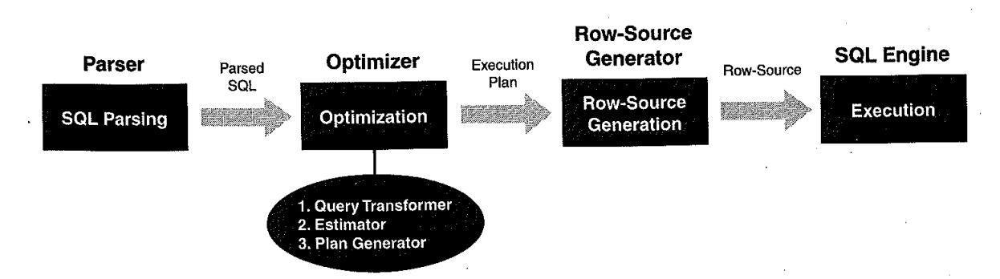

# 01. 쿼리변환이란


```sql
SELECT DISTINCT S.SNAME FROM S, SP WHERE S.S# = SP.S# AND SP.P# = 'P2'
```

- 위와 같은 간단한 sql문 하나를 가지고도 52개의 다른 sql문으로 표현이 가능하다.

```sql
SELECT DISTINCT S.SNAME FROM S WHERE S.S# IN (SELECT SP.S# FROM SP WHERE SP.P# = 'P2'); SELECT DISTINCT S.SNAME FROM S WHERE EXISTS (SELECT * FROM SP WHERE SP.S# = S.S# AND SP.P# = 'P2'); .......
```

- 결과가 동일하더라도 sql문을 어떤 형태로 작성하느냐에 따라 성능 차이가 생길 수 있다.
- 애초에 가장 좋은 성능을 낼 수 있는 형태로 쿼리를 작성하면 좋겠지만 쿼리 최적화 원리를 그만큼 잘 아는 개발자는 흔치 않다.
- 최근의 비용기반 옵티마이저는 사용자 SQL을 최적화에 유리한 형태로 재작성하는 작업을 먼저 한다.




- 쿼리 변환(Query Transformation)은, 쿼리 옵티마이저가 SQL을 분석해 의미적으로 동일하면서도 더 나은 성능이 기대되는 형태로 재작성 하는 것을 말한다.

- DBMS 버전이 올라갈수록 쿼리 변환의 종류가 다양해짐은 물론 더 적극적인 시도가 이루어지고 있다.
  ex) 복합 뷰(Complex View) Merging
  8i - 사용자 힌트에 의해서만 소극적으로 수행
  9i - 결과가 보장될 수 있는 형태라면 무조건 변환 시도
  10g - 더 나은 성능을 낼 것으로 판단될 때만 사용

  
  
  

#### 쿼리 변환의 종류

- 1. 서브쿼리 Unnesting
- 2. 뷰 Merging
- 3. 조건절 Pushing
- 4. 조건절 이행
- 5. 공통 표현식 제거
- 6. Outer 조인을 Inner 조인으로 변환
- 7. 실체화 뷰 쿼리로 재작성
- 8. Star 변환
- 9. Outer 조인 뷰에 대한 조인 조건 Pushdown
- 10.OR-expansion


#### 쿼리 변환은 크게 다음 두 가지 방식으로 작동한다.

- 휴리스틱(Heuristic) 쿼리 변환 : 결과만 보장된다면 무조건 쿼리 변환을 수행한다.
  일종의 규칙 기반(Rule-based) 최적화 기법이라고 할 수 있으며, 경험적으로 (최소한 동일하거나) 항상 더 나은 성능을 보일 것이라는 옵티마이저 개발팀의 판단이 반영된 것이다.
- 비용기반(Cost-based) 쿼리 변환 : 변환된 쿼리의 비용이 더 낮을 때만 그것을 사용하고, 그렇지 않을 때는 원본 쿼리 그대로 두고 최적화를 수행한다.
