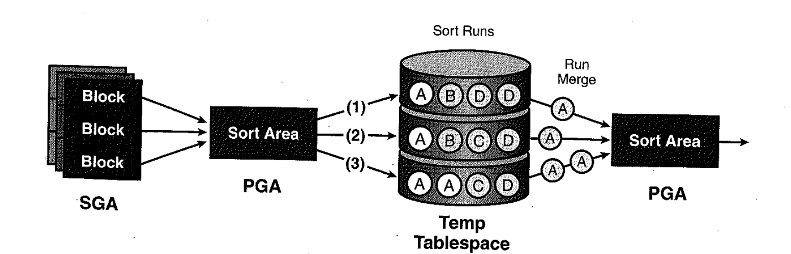
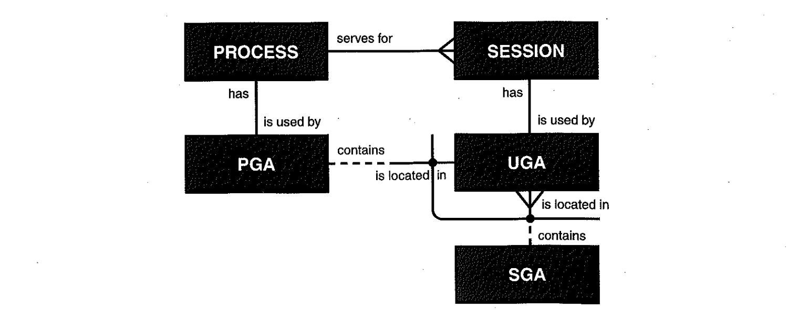

# 01. 소트수행원리


## 1) 소트 수행 과정

- 오라클에서 정렬이 필요하면 PGA 메모리에 Sort Area를 할당한다. 이때 메모리 크기 안에서 소트가 가능한지 여부에 따라 두 가지 유형으로 나눈다.
  - 메모리 소트(in-memory sort) : 전체 데이터의 정렬 작업을 메모리 내에서 완료하는 것(Internal Sort)
  - 디스크 소트(to-disk sort) : 할당받은 Sort Area 내에서 정렬을 완료하지 못해 디스크 공간까지 사용하는 경우(External Sort)





- Sort Area 내에서 데이터 정렬을 마무리하는 것이 최적이지만 양이 많을 때는 정렬된 중간 결과 집합을 Temp 테이블스페이스의 Temp 세그먼트에 임시 저장한다.
- Sort Area가 찰 때마다 Temp 영역에 저장해 둔 중간 단계의 집합을 'Sort Run'이라고 부른다.
- Sort Run 생성을 마쳤으면, 이를 다시 Merge해야 정렬된 최종 결과집합을 얻게 된다.
- 정렬된 결과를 Temp 영역에 임시 저장했다가 다시 읽어들이는 디스크 소트가 발생하는 순간 SQL 수행 성능은 크게 나빠진다.
- Sort Area가 각 Sort Run으로부터 하나의 청크(Chunk)씩 읽어 들일 정도의 크기가 된다면 추가적인 디스크 I/O가 발생하지 않는다.(onepass 소트)
- 만약 그 정도의 크기도 못 된다면 Sort Run으로부터 읽은 데이터를 다시 디스크에 썼다가 읽어 들이는 과정을 여러 번 반복하게 되므로 성능은 극도로 나빠진다.(multipass 소트)

- 정리

| SORT 종류      | 의미                                       |
| :------------- | :----------------------------------------- |
| Optimal 소트   | 소트 오퍼레이션이 메모리 내에서만 이루어짐 |
| Onepass 소트   | 정렬 대상 집합이 디스크에 한 번만 쓰임     |
| Multipass 소트 | 정렬 대상 집합이 디스크에 여러 번 쓰임     |


## 2) 소트 오퍼레이션 측정

**소트 오퍼레이션 측정**

```sql
create table t_emp
as
select *
from emp, (select rownum no from dual connect by level <= 100000);

-- 수동으로 workarea 조정
alter session set workarea_size_policy = manual;

alter session set sort_area_size = 1048576;

select *
from
  (
  select no, empno, ename, job, mgr, sal
        ,avg(sal) over (partition by to_char(no), deptno) avg_sal
    from t_emp
  )
 where no = 1
 order by sal desc;

Auto Trace 내용
--------------------------------------------------------------------------------------
| Id  | Operation            | Name  | Rows  | Bytes |TempSpc| Cost (%CPU)| Time     |
--------------------------------------------------------------------------------------
|   0 | SELECT STATEMENT     |       |    12M|   915M|       |   782K  (1)| 02:36:29 |
|   1 |  SORT ORDER BY       |       |    12M|   915M|  1131M|   782K  (1)| 02:36:29 |
|*  2 |   VIEW               |       |    12M|   915M|       |   401K  (1)| 01:20:13 |
|   3 |    WINDOW SORT       |       |    12M|   915M|  1131M|   401K  (1)| 01:20:13 |
|   4 |     TABLE ACCESS FULL| T_EMP |    12M|   915M|       | 19664   (2)| 00:03:56 |
--------------------------------------------------------------------------------------

Predicate Information (identified by operation id):
---------------------------------------------------

   2 - filter("NO"=1)

Statistics
----------------------------------------------------------
        575  recursive calls
          8  db block gets
      71367  consistent gets
     216723  physical reads
          0  redo size
       2047  bytes sent via SQL*Net to client
        302  bytes received via SQL*Net from client
          9  SQL*Net roundtrips to/from client
          1  sorts (memory) => 메모리 소트 발생
          1  sorts (disk)   => 디스크 소트 발생
        114  rows processed

DBMS_XPLAN.DISPLAY_CURSOR 내용
------------------------------------------------------------------------------------
| Id  | Operation            | Name  | E-Rows |  OMem |  1Mem | Used-Mem | Used-Tmp|
------------------------------------------------------------------------------------
|   0 | SELECT STATEMENT     |       |        |       |       |          |         |
|   1 |  SORT ORDER BY       |       |     12M| 16384 | 16384 |14336  (0)|         |
|*  2 |   VIEW               |       |     12M|       |       |          |         |
|   3 |    WINDOW SORT       |       |     12M|   640M|  8307K| 1057K (1)|     571K| => DISK SORT가 일어난 것을 알 수 있다.
|   4 |     TABLE ACCESS FULL| T_EMP |     12M|       |       |          |         |
------------------------------------------------------------------------------------
```

- OMem : Optimal 소트에 필요한 예상 메모리
- 1Mem : One Pass 소트에 필요한 예상 메모리

~~~
두 번의 소트 오퍼레이션(실행계획에 나타난 sort order by, window sort)이 발생했는데 그 중 한 번은 메모리내에서 처리를 완료했고,
다른 한 번은 디스크 소트가 발생했다.
소트할 데이터량을 감안할 때, 전자는 1번 오퍼레이션 단계(ID=1)에 해당하고 (no = 1 조건으로 필터링된 결과집합만 정렬하므로),
후자는 3번 오퍼레이션 단계(ID=3)에 해당한다.
디스크 I/O시 버퍼캐시를 경유하므로 일반적으로 디스크 블록 I/O 개수가 메모리 블록 I/O 개수를 초과할 수 없다.
그런데 여기서는 physical reads 값(216723)이 consistent gets와 db block gets를 합한 값(71375)보다 훨씬 크다.
디스크 소트 과정에서 발생한 디스크 I/O까지 physical reads에 포함됐기 때문이다.
~~~


## 3) Sort Area

- 데이터 정렬을 위해 사용되는 Sort Area는 소트 오퍼레이션이 진행되는 동안 공간이 부족해질 때마다 청크(Chunk) 단위(db_block_size 파라미터로 결정)로 조금씩 할당된다.
- 9i 이전 sort_area_size 파라미터로 크기 설정
- 9i 부터 workarea_size_policy 파라미터를 auto로 설정하면 오라클이 내부적으로 결정

- Sort Area가 할당되는 메모리 영역

  - **PGA**
    각 오라클 서버 프로세스는 자신만의 PGA(Process/Program/Private Global Area) 메모리 영역을 할당받고,
    이를 프로세스에 종속적인 고유 데이터를 저장하는 용도로 사용한다. PGA는 다른 프로세스와 공유되지 않는 독립적인 메모리 공간으로서,
    래치 메커니즘이 필요 없어 똑같은 개수의 블록을 읽더라도 SGA 버퍼 캐시에서 읽은 것보다 훨씬 빠르다.

  - **UGA**
    전용 서버 방식으로 연결할 때는 프로세스와 세션이 1:1관계를 갖지만, 공유 서버 방식으로 연결할 때는 1:M 관계를 갖는다.
    즉 세션이 프로세스 개수보다 많아질 수 있는 구조로서, 하나의 프로세스가 여러 개 세션을 위해 일한다.
    따라서 각 세션을 위한 독립적인 메모리 공간이 필요해지는데, 이를 'UGA(user Global Area)'라고 한다.
    전용 서버 방식에서 UGA를 사용하지 않는 것은 아니다. UGA는 서버 프로세스와의 연결 방식에 따라 그 위치가 달라지는데
    전용 서버 방식으로 연결할 때는 PGA에, 공유 서버 방식으로 연결할 때는 SGA에 할당된다.
    후자 방식에서는 구체적으로 Large Pool이 설정됐을 때는 Large Pool에, 그렇지 않을 때는 Shared Pool에 할당 된다.

  - **CGA**

    PGA에 할당되는 메모리 공간으로는 CGA(Call Global Area)도 있다. 오라클은 하나의 데이터베이스 Call을 넘어서 다음 Call까지 계속 참조되어야

    하는 정보는 UGA에 담고, Call이 진행되는 동안에만 필요한 데이터는 CGA에 담는다.

    CGA는 Parse Call, Execute Call, Fetch Call마다 매번 할당받는다.

    Call이 진행되는 동안 Recursive Call이 발생하면 그 안에서도 Parse, Execute, Fetch 단계별로 CGA가 추가로 할당된다.

    CGA에 할당된 공간은 하나의 Call이 끝나자마자 해제돼 PGA로 반환된다.

    - CGA : Call이 진행되는 동안만 필요한 정보 저장
    - UGA : Call을 넘어서 다음 Call까지 참조되는 정보 저장

  - 프로세스, 세션, PGA, UGA, SGA의 관계도

  

  - 요약
    - 하나의 프로세스는 하나의 PGA를 갖는다.
    - 하나의 세션은 하나의 UGA를 갖는다.
    - PGA에는 세션과 독립적인 프로세스만의 정보를 관리한다.
    - UGA에는 프로세스와 독립적인 세션만의 정보를 관리한다.
    - 거의 대부분 전용 서버 방식을 사용하므로 세션과 프로세스는 1:1 관계고, 따라서 UGA도 PGA내에 할당된다고 이해하면 쉽다.


### 전용서버, 공유서버

- 전용서버

  Oracle Database는 각 사용자 프로세스에 대해 전용 서버 프로세스를 필요로 함. 클라이언트당 하나의 서버 프로세스가 있음. Oracle Net은 기존의 서버 프로세스 주소를 클라이언트로 다시 전송함. 클라이언트는 제공된 서버 주소로 접속 요청을 다시 전송함. 전용 서버는 공유 서버와 반대 개념.

  - 전용 서버를 사용하는 경우
    - 데이터 웨어하우징 환경에서 데이터베이스를 사용하는 경우
    - 총 클라이언트 접속 수가 적을 것으로 예상되는 경우
    - 데이터베이스 클라이언트가 데이터베이스에 지속적으로 장기간 실행 요청을 하는 경우

- 공유서버

  공유 서버 모드(다중 스레드 서버 모드라고도 함)의 Oracle Database는 많은 사용자 프로세스가 매우 적은 서버 프로세스를 공유할 수 있도록 구성.

  많은 사용자 프로세스가 작업 할당자에 접속함. 작업 할당자는 여러 개의 수신 네트워크 세션 요청을 공통 대기열로 보냄. 공유 풀의 서버 프로세스 중 유휴 공유 서버 프로세스가 대기열에서 요청을 가져옴. 이것은 서버 프로세스의 작은 풀이 많은 클라이언트에게 서비스를 제공할 수 있음을 의미.

  - 공유 서버를 사용하는 경우
    - OLTP(온라인 트랜잭션 프로세싱) 환경에서 데이터베이스를 사용하는 경우. 응용 프로그램을 사용하는 온라인 트랜잭션 프로세스는 공유 서버를 사용하여 많은 이점을 얻음
    - 많은 사용자가 데이터베이스에 접속하고 사용 가능한 시스템 자원을 효율적으로 사용해야 하는 경우
    - 메모리 제약 조건을 가지는 경우. 공유 서버는 전용 서버에 비해 사용자 수가 증가할수록 사용할 수 있는 총 메모리 양이 줄어듦. 이후 모드에서는 사용자 수의 증가에 비례하여 메모리 소모가 증가함. 공유 서버를 사용하여 전체 시스템 성능을 튜닝하고 최적화할 수 있으므로 데이터베이스 튜닝 제어가 중요한 기준인 경우 공유 서버를 사용하고자 할 수 있음.
    - 접속 풀, 접속 집중 및 로드 밸런싱과 같은 Oracle Net 기능을 사용하려는 경우
    - 시스템 자원 관리 및 활용이 중요한 기준인 경우
    - 웹 응용 프로그램과 같이 예측 가능하고 빠른 접속 시간이 매우 중요한 경우

- Sort Area 할당 위치
  - Sort Area가 할당 되는 위치는 SQL문 종류와 소트 수행 단계에 따라 다르다.
  - DML 문장은 하나의 Execute Call 내에서 모든 데이터 처리를 완료하며, Execute Call이 끝나는 순간 자동으로 커서가 닫힌다.
    따라서 DML 수행 도중 정렬한 데이터를 Call을 넘어서 참조할 필요가 없으므로 Sort Area를 CGA에 할당한다.
  - SELECT문에서 데이터 정렬은 상황에 따라 다르다.
    SELECT문장이 수행되는 가장 마지막 단계에서 정렬된 데이터는 계속 이어지는 Fetch Call에서 사용되어야 한다.
    따라서 sort_area_retained_size 제약이 없다면 그 마지막 소트를 위한 Sort Area는 UGA에 할당한다.
    반면 마지막보다 앞선 단계에서 정렬된 데이터는 첫 번째 Fetch Call내에서만 사용되므로 Sort Area를 CGA에 할당한다.
    예를 들어, 아래 실행계획에서 세 번의 소트 오퍼레이션이 수행되는데, 맨 위 쪽에 있는 sort order by만 UGA에서 수행되고
    나머지는 CGA에서 수행될 것이다.

**Sort Area 할당 위치**

```sql
select /*+ordered use_merge(e) */
     d.deptno, d.dname, e.ename, e.sal, e.job
   , rank() over (partition by d.deptno order by e.sal) sal_rank
from dept d, emp e
where d.deptno = e.deptno
order by e.sal desc

--------------------------------------------------------------------------------------
| Id  | Operation                      | Name    | E-Rows |  OMem |  1Mem | Used-Mem |
--------------------------------------------------------------------------------------
|   0 | SELECT STATEMENT               |         |        |       |       |          |
|   1 |  SORT ORDER BY                 |         |   7013 | 14336 | 14336 |12288  (0)| -> UGA
|   2 |   WINDOW SORT                  |         |   7013 | 14336 | 14336 |12288  (0)| -> CGA
|   3 |    MERGE JOIN                  |         |   7013 |       |       |          |
|   4 |     TABLE ACCESS BY INDEX ROWID| DEPT    |      4 |       |       |          |
|   5 |      INDEX FULL SCAN           | DEPT_PK |      4 |       |       |          |
|*  6 |     SORT JOIN                  |         |   7013 | 12288 | 12288 |10240  (0)| -> CGA
|   7 |      TABLE ACCESS FULL         | EMP     |   7013 |       |       |          |
--------------------------------------------------------------------------------------
```

~~~
SELECT문 마지막 단계더라도 sort_area_retained_size 제약이 있으면, 소트 작업은 CGA에서 수행하고
이 제약만큼 공간을 UGA에 할당해 소트 결과를 그곳에 옮겨 담는다.
그럼으로써 이후 발생하는 Fetch Call을 통해 조금씩 결과 집합을 전송할 수 있도록 한다.
물론 마지막 단계에서 실제 사용한 CGA 공간이 sort_area_retained_size로 지정한 값보다 크다면
모두 옮겨 담을 수 없으므로 일부 Temp 세그먼트에 저장한다.

마지막보다 앞선 단계에서 정렬을 수행할 때도 sort_area_retained_size 제약이 있다면 다음 단게로 넘어가기 전에
이 값을 초과한 분량을 Temp 세그먼트에 저장하고, 초과한 만큼의 CGA메모리는 반환한다.
~~~


- 요약
  - DML 문장 수행 시 발생하는 소트는 CGA에서 수행
  - SELECT 문장 수행시
    - 쿼리 중간 단계의 소트 : CGA에서 수행. sort_area_retained_size 제약이 있다면 다음 단계로 넘어가기 전에 이 값을 초과하는 CGA영역을 반환
    - 결과집합을 출력하기 직전 단계에서 수행하는 소트
      - `sort_area_retained_size` 제약이 있다면, CGA에서 소트 수행. 이 제약만큼의 UGA를 할당해 정렬된 결과를 담았다가 이후 Fetch Call에서 Array 단위로 전송
      - `sort_area_retained_size` 제약이 없다면, 곧바로 UGA에서 소트 수행
  - CGA에 할당된 Sort Area는 하나의 Call이 끝나자마자 PGA에 반환된다.
  - UGA에 할당된 Sort Area는 마지막 로우라 Fetch 될 때 비로소 UGA Heap에 반환되고, 거의 대부분 그 부모 Heap에도 즉각 반환된다.


## 4) 소트 튜닝 요약

- 소트 오퍼레이션은 메모리 집약적일 뿐만 아니라 CPU 집약적이기도 하며, 데이터량이 많을 때는 디스크 I/O까지 발생시키므로 쿼리 성능을 좌우하는
  가장 중요한 요소이다. 특히 부분범위처리를 할 수 없게 만들어 OLTP 환경에서 성능을 떨어뜨리는 주요인으로 작용한다.
  따라서 될 수 있으면 소트가 발생하지 않도록 SQL을 작성해야 하고, 소트가 불가피하다면 메모리 내에서 수행을 완료할 수 있도록 해야 한다.

- 소트 튜닝 방안 요약
  - 데이터 모델 측면에서 검토
  - 소트가 발생하지 않도록 SQL 작성
  - 인덱스를 이용한 소트 연산 대체
  - Sort Area를 적게 사용하다록 SQL 작성
  - Sort Area 크기 조정


