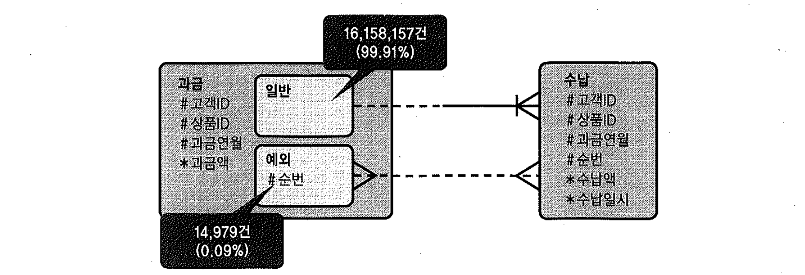
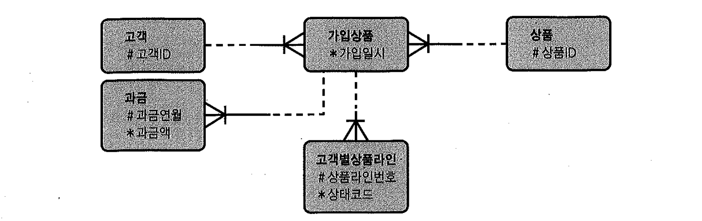
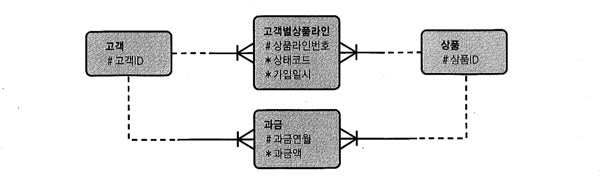

# 03. 데이터모델측면에서의검토


- 불합리한 데이터 모델이 소트 오퍼레이션을 유발하는 경우를 흔히 접할 수 있다.
- 튜닝 과정에서 조사된 SQL에 group by, union, distinct 같은 연산자가 불필요하게 많이 사용되는 패턴을 보인다면
  데이터 모델이 잘 정규화되지 않았음을 암시한다.


## 사례1

- M:M 관계를 갖도록 테이블을 설계한 경우가 대표적이다.
  

- 과금은 매달 한 번씩 발생하고, 하나의 과금에 대해 고객이 여러 번에 걸쳐 입금할 수 있기 때문에 수납과는 1:M 관계에 놓인다.
  이 때문에 위 그림과 같이 수납 테이블 PK 속성 그룹에는 순번 컬럼이 필요하다.
  고객ID, 상품ID, 과금연월은 과금 테이블로부터 상속받는다.
  

- 문제가 발생했던 테이블 설계는 위 그림과 같이 M:M 관계로 설계돼 있었다.
  과금 테이블에 있는 순번은 수납 쪽 순법과 독립적으로 부여되는 속성이다.
  따라서 과금과 수납 내역을 조회하려면, 매번 아래처럼 과금 테이블을 먼저 group by 해야만 한다.

```sql
select a.상품id, a.과금액, b.수납액, b.수납일시
from (select 고객id, 상품id, 과금연월, sum(과금액) 과금액
      from   과금
      where  과금연열 = :과금연월
      and    고객id = :고객id
      group by 고객id, 상품id, 과금연월) a
    , 수납 b
where b.고객id(+) = a.고객id
and   b.상품id(+) = a.상품id
and   b.과금연월(+) = a.과금연월
order by a.상품id, b.순번
```

- 위 모델에 대해 실제적으로 아래 상황을 확인 했다고 해보자
  정상적으로는 1:M관계가 맞지만 과거 데이터 이관시 발생한 예외 케이스 때문에 M:M 모델이 된 케이스이다.
  실제 데이터를 조회해 본 결과 그림 5-5에 표현한 것처럼 불과 0.09%에 해당하는 14,979건만 M:M 관계에 놓여있었다.
  

- 데이터를 정제하고 정상적인 1:M 관계를 갖도록 모델을 수정하였다.
  그 결과, 불필요한 group by 연산을 제거할 수 있어 쿼리가 아래와 같이 간단해졌음은 물론 성능도 전반적으로 향상되었다.

```sql
select a.상품id, a.과금액, b.수납액, b.수납일시
from   과금 a, 수납 b
where  a.과금연월 = :과금연월
and    a.고객id = :고객id
and    b.고객id(+) = a.고객id
and    b.상품id(+) = a.상품id
and    b.과금연월(+) = a.과금연월
order by a.상품id, b.순번
```


## 사례2

- 정상적인 데이터 모델은 아래 그림과 같다.
  

- PK외에 관리할 속성이 아예 없거나 위 그림의 '가입상품'처럼 소수(여기서는 가입일시 하나뿐임)일 때,
  테이블 개수를 줄인다는 이유로 자식 테이블을 통합시키는 경우를 종종 볼 수 있다.
  `가입상품` 테이블을 없애고 아래 그림처럼 `고객별상품라인`에 통합하는 식이다.
  

- 정보 누락이 없고, 가입일시는 최초 입력 후 변경되지 않는 속성이므로 정합성에도 문제가 안 생기겠지만
  이 회사는 고객별 가입상품 레벨의 데이터 조회가 매우 빈번하게 발생한다.
  그때마다 아래처럼 '고객별상품라인' 테이블을 group by 해야 한다면 성능이 좋을 리 없다.

```sql
select 과금.고객id, 과금.상품id, 과금.과금액, 가입상품.가입일시
from   과금,
      (select 고객id, 상품id, min(가입일시) 가입일시
       from   고객별상품라인
       group by 고객id, 상품id) 가입상품
where  과금.고객id(+) = 가입상품.고객id
and    과금.상품id(+) = 가입상품.상품id
and    과금.과금연월(+) = :yyyymm
```

- 만약 정상적인 잘 정규화된 데이터 모델을 사용했다면 쿼리도 아래처럼 간단해지고 시스템 전반의 성능 향상에도 도움이 된다.

```sql
select 과금.고객id, 과금.상품id, 과금.과금액, 가입상품.가입일시
from   과금, 가입상품
where  과금.고객id(+) = 가입상품.고객id
and    과금.상품id(+) = 가입상품.상품id
and    과금.과금연월(+) = :yyyymm
```


## 사례3

- 순번 컬럼을 증가시키면서 순서대로 데이터를 적재하는 점이력 모델은 선분이력에 비해 DML 부하를 최소화할 수 있는 장점이 있지만,
  대량 집합의 이력을 조회할 때 소트를 많이 발생시키는 단점이 있다.
  특히, 마지막 이력만 조회하는 업무가 대부분일 때 비효율이 크다. 여러 이력테이블로부터 최근 데이터만을 읽어 조인하는 아래 쿼리를 보자.

```sql
select ...
from (
  select ...
  from 소송심급피해대상 a
     , 소송대상청구 b
     , 소송심급 c
     , 소송 d
     , 소송결재 e
     , 민원마스터 f
     , VOC유형코드 g
     ,(select ...
       from (select ..., rank() over (partition by ... order by 종결년도 desc, 종결순번 desc) rank
             from 소송심급대상종결 a )
       where rank = 1)  h
     ,(select ...
       from (select ..., rank() over (partition by ... order by 마감일자 desc) rank
             from 피해청구 a )
       where rank = 1)  i
     ,(select ...
       from (select ..., rank() over (partition by ... order by a.판결년도 desc, a.순번 desc) rank
             from 판결 a, 소송피해내용 b, 소송금 c, 소송소득내용 d,
                 (select ...
                  from (select..., rank() over (partition by ... order by 순번 desc) rank
                        from 소송결재
                        where ...)
                  where rank = 1) e
             where a.판결년도 = b.판결년도
             and   a.판결순번 = b.판결순번
             and   ...)
        where rank = 1 ) j
     ,(select ...
       from (select ..., rank() over (partition by ... order by. a.특인차수 desc, b.순번 desc) rank
             from 특인 a, 특인결재 b
             where a.특인년도 = b.특인년도
             and   a.특인순번 = b.특인순번
             and   ...)
       where rnak = 1)   k
     ,(select ...
       from (select ..., rank() over (partition by ... order by. a.소송심급피해대상순번 desc) rank
             from 소송대상청구 a, 소송심급피해대상 b, 소송심급 d, 소송 d
             where ...)
       where rank = 1)
  where ...
);
```

- 이력 조회하는 모든 부분을 인라인 뷰로 감싸고, 분석함수를 이용해 순번상 가장 큰 값을 갖는 레코드만을 추출하고 있다.
  이 쿼리뿐만 아니라 대부분의 쿼리가 이런 형태를 띠고 있다면 다른 대안 모델을 고려해 봄 직하다.
  - 예를 들어, 순번 컬럼을 999로 입력하거나 플래그 컬럼을 둔다면 소트를 일으키지 않고도 마지막 레코드를 쉽게 추출할 수 있다.
    또한 선문이력 모델을 채택한다면 더 큰 유연성을 얻을 수 있다.
- 이들 대안 모델을 채택하면 새로운 이력이 쌓일 때마다 기존 값을 갱신해야하는 부담이 생긴다.
  하지만 한 번의 갱신으로 수백 번의 조회를 빠르게 할 수 있다면 그것이 더 나은 선택일 것이다.
- 현재 데이터만 주로 조회한다면, 데이터 중복이 있더라도 마스터 테이블을 이력 테이블과 별도로 관리하는 것도 좋은 방안이다.
  방금 전 사례를 두고 모델이 잘못됐다고 말할 수는 없지만 어떤 데이터 모델을 선택하느냐에 따라 성능에 차이가 생길 수 있음을 잘 보여준다.

