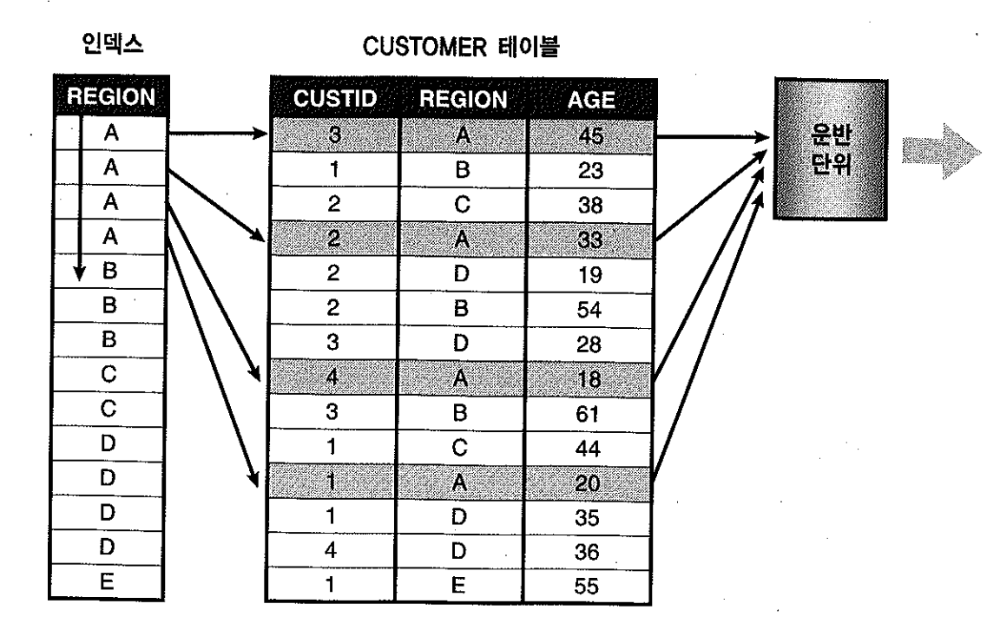

# 05. 인덱스를이용한소트연산대체


PK 컬럼에 아래와 같은 distinct 쿼리를 수행할 일은 없겠지만 혹시 수행한다면 이때도 `sort unique 오퍼레이션`이 생략된다. sort unique nosort가 그것을 표현하고 있는데, 소트를 수행하지 않고도 인덱스를 이용해 unique한 집합을 출력할 수 있다.

```sql
EXPLAIN PLAN
FOR
SELECT DISTINCT empno
FROM   emp ;


@?\rdbms\admin\utlxpls

PLAN_TABLE_OUTPUT
--------------------------------------------------------------------------------

Plan hash value: 4053311859

-----------------------------------------------------------------------------
| Id  | Operation          | Name   | Rows  | Bytes | Cost (%CPU)| Time     |
-----------------------------------------------------------------------------
|   0 | SELECT STATEMENT   |        |    14 |    56 |     2  (50)| 00:00:01 |
|   1 |  SORT UNIQUE NOSORT|        |    14 |    56 |     2  (50)| 00:00:01 |
|   2 |   INDEX FULL SCAN  | PK_EMP |    14 |    56 |     1   (0)| 00:00:01 |
-----------------------------------------------------------------------------

9 개의 행이 선택되었습니다.
```

이들보다 활용도가 높은 것은 인덱스를 이용해 `sort order by`, `sort group by`를 대체하는 경우다. 이에 대해 좀 더 자세히 살펴보기로 하자.


## 1) Sort Order By 대체

아래 쿼리를 수행할 때 `region + custid`순으로 구성된 인덱스를 사용한다면 `sort order by` 연산을 대체할 수 있다.

인덱스가 region 단일 컬럼으로 구성됐거나, 결합 인덱스라도 region 바로 뒤에 custid가 오지 않는다면 region = 'A' 조건을 만족하는 모든 레코드를 인덱스를 경유해 읽어야 한다. 그 과정에서 다량의 랜덤 액세스가 발생할 테고 읽은 데이터를 custid순으로 정렬하고 나서야 결과집합 출력을 시작하므로 OLTP 환경에서 요구되는 빠른 응답 속도를 만족하기 어렵게 된다.
아래는 region 단일 컬럼 인덱스를 사용할 때의 실행계획이다.

```sql
EXPLAIN PLAN
FOR
SELECT  /* index(a customer_x01) */ 
        custid ,
        name ,
        resno ,
        status ,
        tell
FROM    customer a
WHERE   region = 'A'
ORDER   BY custid

----------------------------------------------------------------------------------
| Id  | Operation                    | Name         | Rows  | Bytes | Cost (%CPU)|
----------------------------------------------------------------------------------
|   0 | SELECT STATEMENT             |              | 40000 | 3515K |  2041   (1)|
|   1 |  SORT ORDER BY               |              | 40000 | 3515K |  2041   (1)|
|   2 |   TABLE ACCESS BY INDEX ROWID| CUSTOMER     | 40000 | 3515K |  1210   (1)|
|*  3 |    INDEX RANGE SCAN          | CUSTOMER_X01 | 40000 |       |   96    (2)|
----------------------------------------------------------------------------------

Predicate Information (identified by operation id):
---------------------------------------------------

   3 - access("REGION"='A')
```

Full Table Scan 방식으로 처리하면 테이블 랜덤 엑세스 부하를 줄일 수는 있지만 필요없는 레코드까지 모두 읽는 비효율이 따르고, 정렬 작업 때문에 전체범위처리가 불가피하다.
아래는 `region + custid` 순으로 구성된 인덱스를 사용할 때의 실행계획이며, `order by` 절을 그대로 둔 상태에서 자동으로`sort order by` 오퍼레이션이 제거된 것을 볼 수 있다. 이 방식으로 수행한다면 region = 'A' 조건을 만족하는 전체 로우를 읽지 않고도 결과 집합 출력을 시작할 수 있어 OLTP 환경에서 극적인 성능 개선 효과를 가져다 준다.

```sql
EXPLAIN PLAN
FOR
SELECT  /* index(a customer_x02) */ 
        custid ,
        name ,
        resno ,
        status ,
        tell
FROM    customer a
WHERE   region = 'A'
ORDER   BY custid

----------------------------------------------------------------------------------
| Id  | Operation                    | Name         | Rows  | Bytes | Cost (%CPU)|
----------------------------------------------------------------------------------
|   0 | SELECT STATEMENT             |              | 40000 | 3515K |  1372   (1)|
|   2 |   TABLE ACCESS BY INDEX ROWID| CUSTOMER     | 40000 | 3515K |  1372   (1)|
|*  2 |    INDEX RANGE SCAN          | CUSTOMER_X02 | 40000 |       |   258   (2)|
----------------------------------------------------------------------------------

Predicate Information (identified by operation id):
---------------------------------------------------

   2 - access("REGION"='A')
```

- 물론, 소트해야 할 대상 레코드가 무수히 많고 그 중 일부만 읽고 멈출 수 있는 업무에서만 이 방식이 유리하다.
- 인덱스를 스캔하면서 결과집합을 끝까지 Fetch 한다면 오히려 I/O 및 리소스 사용 측면에서 손해다. 대상 레코드가 소량일 때는 소트가 발생하더라도 부하가 크지 않아 개선효과도 미미하다.


## 2) Sort Group By 대체

region이 선두 컬럼인 결합 인덱스나 단일 컬럼 인덱스를 사용한다면 아래 쿼리에 필요한 `sort group by` 연산을 대체할 수 있다. 실행계획에 `sort group by nosort`라고 표시되는 부분을 확인하기 바란다.

```sql
EXPLAIN PLAN
FOR
SELECT region ,
       AVG( age ) ,
       COUNT( * )
FROM   customer
GROUP  BY region

----------------------------------------------------------------------------------
| Id  | Operation                    | Name         | Rows  | Bytes | Cost (%CPU)|
----------------------------------------------------------------------------------
|   0 | SELECT STATEMENT             |              |    25 |   725 | 30142   (1)|
|   1 |  SORT GROUP BY NOSORT        |              |    25 |   725 | 30142   (1)|
|   2 |   TABLE ACCESS BY INDEX ROWID| CUSTOMER     | 1000K |   27M | 30142   (1)|
|   3 |    INDEX FULL SCAN           | CUSTOMER_X01 | 1000K |       |  2337   (2)|
----------------------------------------------------------------------------------
```



- 간단히 설명하면, 인덱스를 스캔하면서 테이블을 액세스하다가 'A'가 아닌 레코드를 만다는 순간 그때까지 집계한 값을 Oracle Net으로 내려 보낸다. 이 값은 운반단위에 해당하는 SDU(Session Data Unit)에 버퍼링될 것이다.


## 3) 인덱스가 소트 연산을 대체하지 못하는 경우

아래는 sal 컬럼을 선두로 갖는 인덱스가 있는데도 정렬을 수행하는 경우다.

```sql
CREATE TABLE emp2 AS
SELECT *
FROM   emp ;


begin
  dbms_stats.gather_table_stats(user, 'emp2', method_opt => 'for all columns size 1');
end ;

CREATE INDEX emp2_sal_idx ON emp2( sal ) ;

ALTER SESSION SET optimizer_mode = all_rows ;

EXPLAIN PLAN
FOR
SELECT  *
FROM    emp2
ORDER   BY sal ;

@?\rdbms\admin\utlxpls

PLAN_TABLE_OUTPUT
--------------------------------------------------------------------------------

Plan hash value: 2441141433

---------------------------------------------------------------------------
| Id  | Operation          | Name | Rows  | Bytes | Cost (%CPU)| Time     |
---------------------------------------------------------------------------
|   0 | SELECT STATEMENT   |      |    14 |   518 |     4  (25)| 00:00:01 |
|   1 |  SORT ORDER BY     |      |    14 |   518 |     4  (25)| 00:00:01 |
|   2 |   TABLE ACCESS FULL| EMP2 |    14 |   518 |     3   (0)| 00:00:01 |
---------------------------------------------------------------------------

9 개의 행이 선택되었습니다.
```

- 옵티마이저가 이런 결정을 하는 가장 흔한 원인은 인덱스를 이용하지 않는 편이 더 낫다고 파단하는 경우다. 위에서 옵티마이저 모드가 all_rows인 것을 볼 수 있고, 이때 옵티마이저는 전체 로우를 Fetch 하는 것을 기준으로 쿼리 수행 비용을 산정한다. 따라서 데이터량이 많을수록 인덱스를 이용한 테이블 랜덤 액세스 비용이 높아져 옵티마이저는 차라리 Full Table Scan하는 쪽을 택할 가능성이 높아진다.
- 옵티마이저 모드를 first_rows로 바꾸면 사용자가 일부만 Fetch 하고 멈출 것임을 시사하므로 옵티마이저는 인덱스를 이용해 정렬 작업을 대체한다. 아래는 first_rows 힌트를 사용했을 때의 실행계획인다.

```sql
ALTER SESSION SET optimizer_mode = first_rows ;

EXPLAIN PLAN
FOR
SELECT  *
FROM    emp2
ORDER   BY sal ;

@?\rdbms\admin\utlxpls

PLAN_TABLE_OUTPUT
--------------------------------------------------------------------------------

Plan hash value: 2441141433

---------------------------------------------------------------------------
| Id  | Operation          | Name | Rows  | Bytes | Cost (%CPU)| Time     |
---------------------------------------------------------------------------
|   0 | SELECT STATEMENT   |      |    14 |   518 |     4  (25)| 00:00:01 |
|   1 |  SORT ORDER BY     |      |    14 |   518 |     4  (25)| 00:00:01 |
|   2 |   TABLE ACCESS FULL| EMP2 |    14 |   518 |     3   (0)| 00:00:01 |
---------------------------------------------------------------------------

9 개의 행이 선택되었습니다.
```

- 옵티마이저 모드를 바꿨는데도 옵티마이저가 계속해서 소트 오퍼레이션을 고집한다면 그럴 만한 이유가 있다. 십중팔구 sal 컬럼에` not null `제약이 정의돼 있지 않을 것이다. 단일 컬럼 인덱스일 때 값이 null이면 인덱스 레코드에 포함되지 않는다고 했다. 따라서 인덱스를 이용해 정렬 작업을 대체한다면 결과에 오류가 생긱 수 있어 옵티마이저는 사용자의 뜻을 따를 수 없는 것이다.
- `group by`도 마찬가지다. `group by nosort`를 위해 사용하려는 인덱스가 단일 컬럼 인덱스일 때는 해당 컬럼에 not null 제약이 설정되어 있어야 제대로 동작한다.

```sql
ALTER TABLE emp2 MODIFY sal NOT NULL ;

ALTER SESSION SET optimizer_mode = first_rows ;

EXPLAIN PLAN
FOR
SELECT  *
FROM    emp2
ORDER   BY sal ;

@?\rdbms\admin\utlxpls

PLAN_TABLE_OUTPUT
--------------------------------------------------------------------------------

Plan hash value: 422249803

--------------------------------------------------------------------------------------------
| Id  | Operation                   | Name         | Rows  | Bytes | Cost (%CPU)| Time     |
--------------------------------------------------------------------------------------------
|   0 | SELECT STATEMENT            |              |    14 |   518 |     2   (0)| 00:00:01 |
|   1 |  TABLE ACCESS BY INDEX ROWID| EMP2         |    14 |   518 |     2   (0)| 00:00:01 |
|   2 |   INDEX FULL SCAN           | EMP2_SAL_IDX |    14 |       |     1   (0)| 00:00:01 |
--------------------------------------------------------------------------------------------

9 개의 행이 선택되었습니다.
```

- 인덱스가 있는데도 소트를 대체하지 못하는 사례가 또 한가지 있다. 아래 스크립트와 실행계획을 보자.

```sql
CREATE INDEX emp_dept_ename_idx ON emp( deptno , ename ) ;

set autotrace traceonly exp

SELECT /*+ index(e emp_dept_ename_idx) */
	*
FROM   emp e
WHERE  deptno = 30
ORDER  BY ename ;

Execution Plan
----------------------------------------------------------
Plan hash value: 3593519358

--------------------------------------------------------------------------------------------------
| Id  | Operation                   | Name               | Rows  | Bytes | Cost(%CPU)| Time     |
--------------------------------------------------------------------------------------------------
|   0 | SELECT STATEMENT            |                    |     6 |   222 |     2   (0)| 00:00:01 |
|   1 |  TABLE ACCESS BY INDEX ROWID| EMP                |     6 |   222 |     2   (0)| 00:00:01 |
|*  2 |   INDEX RANGE SCAN          | EMP_DEPT_ENAME_IDX |     6 |       |     1   (0)| 00:00:01 |
--------------------------------------------------------------------------------------------------


Predicate Information (identified by operation id):
---------------------------------------------------

   2 - access("DEPTNO"=30)
       filter("DEPTNO"=30)
```

- 정상적으로 인덱스를 사용하는 것을 확인할 수 있다. 그런데 null 값이 먼저 출력되도록 하려고 아래처럼 `nulls first` 구문을 사용하는 순간 실행계획에 `sort order by`가 다시 나타난다.

```sql
set autotrace traceonly exp

SELECT /*+ index( e emp_dept_ename_idx) */
	*
FROM   emp e
WHERE  deptno = 30
ORDER  BY ename nulls first ;

Execution Plan
----------------------------------------------------------
Plan hash value: 669367854

---------------------------------------------------------------------------------------------------
| Id  | Operation                    | Name               | Rows  | Bytes | Cost (%CPU)| Time     |
---------------------------------------------------------------------------------------------------
|   0 | SELECT STATEMENT             |                    |     6 |   222 |3       (34)| 00:00:01 |
|   1 |  SORT ORDER BY               |                    |     6 |   222 |3       (34)| 00:00:01 |
|   2 |   TABLE ACCESS BY INDEX ROWID| EMP                |     6 |   222 |2        (0)| 00:00:01 |
|*  3 |    INDEX RANGE SCAN          | EMP_DEPT_ENAME_IDX |     6 |       |1        (0)| 00:00:01 |
---------------------------------------------------------------------------------------------------


Predicate Information (identified by operation id):
---------------------------------------------------

   3 - access("DEPTNO"=30)
```

- 단일 컬럼 인덱스일 때는 null 값을 저장하지 않지만 결합 인덱스일 때는 null 값을 가진 레코드를 맨 뒤쪽에 저장한다. 따라서 null 값부터 출력하려고 할 때는 인덱스를 이용하더라도 소트가 불가피하다.
