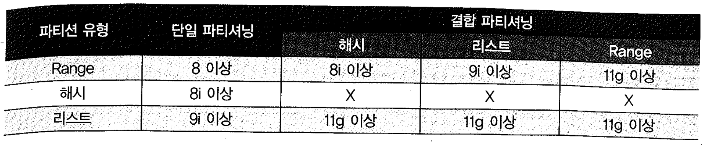
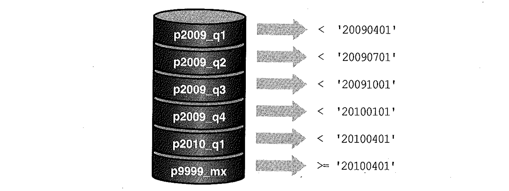

# 01. 테이블 파티셔닝

- 파티셔닝은 테이블과 인덱스 데이터를 파티션(Partition) 단위로 나누어 저장하는 것을 말한다.
- 테이블을 파티셔닝하면 하나의 테이블일지라도 파티션키에 따라 물리적으로 별도의 세그먼트에 데이터가 저장되며, 인덱스도 마찬가지다.
  - 관리적 측면 : 파티션 단이 백업, 추가, 삭제, 변경
  - 성능적 측면 : 파티션 단위 조회 및 DML수행


## 01. 파티션 기본 구조


### 수동 파티셔닝

- - 오라클 8이전에는 파티션 뷰를 통해 파티션 기능을 구현했으며 이를 수동파티셔닝 이라고 한다.

```sql
-- 파티션 뷰를 정의할 때 사용할 Base 테이블을 만든다.
create table p1 as select * from emp where deptno = 10;

create table p2 as select * from emp where deptno = 20;

create table p3 as select * from emp where deptno = 30;

-- 체크 제약을 반드시 설정해야 함
alter table p1 add constraint c_deptno_10 check(deptno < 20);

alter table p2 add constraint c_deptno_20 check(deptno >= 20 and deptno < 30);

alter table p3 add constraint c_deptno_30 check(deptno >= 30 and deptno < 40);

create index p1_empno_idx on p1(empno);

create index p2_empno_idx on p2(empno);

create index p3_empno_idx on p3(empno);

analyze table p1 compute statistics;

analyze table p2 compute statistics;

analyze table p3 compute statistics;

-- 파티션 뷰를 정의한다. 
create or replace view partition_view
as
select * from p1
union all
select * from p2
union all
select * from p3 ;

explain plan for
select * from partition_view
where  deptno = :deptno ;

@?/rdbms/admin/utlxpls
PLAN_TABLE_OUTPUT
--------------------------------------------------------------------------------

Plan hash value: 1236824284

---------------------------------------------------------------------------------------
| Id  | Operation            | Name           | Rows  | Bytes | Cost (%CPU)| Time     |
---------------------------------------------------------------------------------------
|   0 | SELECT STATEMENT     |                |     5 |   170 |     4   (0)| 00:00:01 |
|   1 |  VIEW                | PARTITION_VIEW |     5 |   170 |     4   (0)| 00:00:01 |
|   2 |   UNION-ALL PARTITION|                |       |       |            |          |
|*  3 |    TABLE ACCESS FULL | P1             |     3 |    93 |     3   (0)| 00:00:01 |
|*  4 |    TABLE ACCESS FULL | P2             |     5 |   155 |     3   (0)| 00:00:01 |
|*  5 |    TABLE ACCESS FULL | P3             |     6 |   204 |     3   (0)| 00:00:01 |
---------------------------------------------------------------------------------------

Predicate Information (identified by operation id):
---------------------------------------------------

   3 - filter("DEPTNO"=TO_NUMBER(:DEPTNO))
   4 - filter("DEPTNO"=TO_NUMBER(:DEPTNO))
   5 - filter("DEPTNO"=TO_NUMBER(:DEPTNO))
19 개의 행이 선택되었습니다.


explain plan for
select * from partition_view
 where  deptno = 10;


@?/rdbms/admin/utlxpls

PLAN_TABLE_OUTPUT
--------------------------------------------------------------------------------
Plan hash value: 180990235
---------------------------------------------------------------------------------------
| Id  | Operation            | Name           | Rows  | Bytes | Cost (%CPU)| Time     |
---------------------------------------------------------------------------------------
|   0 | SELECT STATEMENT     |                |     5 |   170 |     4   (0)| 00:00:01 |
|   1 |  VIEW                | PARTITION_VIEW |     5 |   170 |     4   (0)| 00:00:01 |
|   2 |   UNION-ALL PARTITION|                |       |       |            |          |
|*  3 |    TABLE ACCESS FULL | P1             |     3 |    93 |     3   (0)| 00:00:01 |
|*  4 |    FILTER            |                |       |       |            |          |
|*  5 |     TABLE ACCESS FULL| P2             |     1 |    31 |     3   (0)| 00:00:01 |
|*  6 |    FILTER            |                |       |       |            |          |
|*  7 |     TABLE ACCESS FULL| P3             |     1 |    34 |     3   (0)| 00:00:01 |
---------------------------------------------------------------------------------------

Predicate Information (identified by operation id):
---------------------------------------------------

   3 - filter("DEPTNO"=10)
   4 - filter(NULL IS NOT NULL)
   5 - filter("DEPTNO"=10)
   6 - filter(NULL IS NOT NULL)
   7 - filter("DEPTNO"=10)
23 개의 행이 선택되었습니다.
```


### 파티션 테이블

```sql
create table partition_table
partition by range(deptno) (
  partition p1 values less than(20)
, partition p2 values less than(30)
, partition p3 values less than(40)
)
as
select * from emp ;

create index ptable_empno_idx on partition_table(empno) LOCAL;

```

- 위의 파티션 테이블을 정의하면 세 개의 세그먼트가 생성된다.
- 인덱스 생성시도 LOCAL 옵션을 지정했으므로 각 파티션별로 개별적인 인덱스가 생성된다.
- 내부에 몇 개의 세그먼트를 생성하고 그것들이 논리적으로 하나의 오브젝트임을 메타정보로 딕셔너리에 저장해 두는 것에 지나지 않는다.
- 파티션 유형



## 02. Range 파티셔닝

- 오라클 8버전부터 제공된 가장 기초적인 파티셔닝 방식

```sql
-- Range 파티셔닝
create table 주문( 주문번호 number, 주문일자 varchar2(8), 고객id varchar2(5) )
partition by range(주문일자) (
  partition p2009_q1 values less than('20090401')
, partition p2009_q2 values less than('20090701')
, partition p2009_q3 values less than('20091001')
, partition p2009_q4 values less than('20100101')
, partition p2010_q1 values less than('20100401')
, partition p9999_mx values less than( MAXVALUE )
);
```



- 위와 같이 파티셔닝 테이블에 값을 입력하면 각 레코드를 파티션 키 컬럼 값에 따라 분할 저장하고, 읽을 때도 검색 조건을 만족하는 파티션만 읽을 수 있어 이력성 데이터 조회 시 성능을 크게 향상시켜 준다.
- 파티션 키로는 하나 이상의 컬럼을 지정할 수 있고, 최대 16개 까지 허용된다.
- 보관 주기 정책에 따라 과거 데이터가 저장된 파티션만 백업하고 삭제하는 등 데이터관리 작업을 효율적이고 빠르게 수행할 수 있는 것도 큰 장점이다.
- DB관리자의 실수로 신규 파티션 생성을 빠뜨리면 월초 또는 연초에 데이터가 입력되지 않는 에러가 발생하므로, maxvalue 파티션을 반드시 ㅅ생성해 두는 것이 좋다.
- 11g 부터는 Range 파티션을 생성할 때 interval 기준을 정의함으로써 정해진 간격으로 파티션이 자동추가 되도록 할 수 있다.


## 03. 해시 파티셔닝

- 해시파티셔닝은 Range 파티셔닝에 이어 오라클 8i 버전부터 제공
- 파티션 키에 해시함수를 적용한 결과 값이 같은 레코드를 같은 파티션 세그먼트에 저장해 두는 방식
- 검색할 때는 조건절 비교값에 해시 함수를 적용해 읽어야 할 파티션을 결정하며, 해시 알고리즘 특성상 "=" 조건 또는 "In-List" 조건으로 검색할 때만 파티션 Pruning이 작동한다.

```sql
create table t_hash1
(c1 number, c2 varchar2(10))
partition by hash (c1)
(partition p1 tablespace users,
partition p2 tablespace users);


create index t_hash1_idx on t_hash1(c1) local;

select index_name, status
from dba_ind_partitions
where index_name = 'T_HASH1_IDX';

INDEX_NAME                     STATUS
------------------------------ --------
T_HASH1_IDX                    USABLE
T_HASH1_IDX                    USABLE

insert into t_hash1
select level, 'a' from dual connect by level<=1000;

commit;


select index_name, status
from dba_ind_partitions
where index_name = 'T_HASH1_IDX';

INDEX_NAME                     STATUS
------------------------------ --------
T_HASH1_IDX                    USABLE
T_HASH1_IDX                    USABLE

alter table t_hash1
add partition p3 tablespace users;

테이블이 변경되었습니다.

SQL> select table_name, tablespace_name from dba_tab_partitions
  2  where table_name = 'T_HASH1';

TABLE_NAME                     TABLESPACE_NAME
------------------------------ ------------------------------
T_HASH1                        USERS
T_HASH1                        USERS
T_HASH1                        USERS


alter table t_hash1
add partition p3 tablespace users;


select table_name, partition_name from dba_tab_partitions
where table_name = 'T_HASH1';

TABLE_NAME                     PARTITION_NAME
------------------------------ ------------------------------
T_HASH1                        P1
T_HASH1                        P2
T_HASH1                        P3

select index_name, status
from dba_ind_partitions
where index_name = 'T_HASH1_IDX';


INDEX_NAME                     STATUS
------------------------------ --------
T_HASH1_IDX                    UNUSABLE
T_HASH1_IDX                    USABLE
T_HASH1_IDX                    UNUSABLE

SQL> alter table t_hash1
  2  add partition p4 tablespace users;

테이블이 변경되었습니다.

SQL> select index_name, status
  2  from dba_ind_partitions
  3  where index_name = 'T_HASH1_IDX';

INDEX_NAME                     STATUS
------------------------------ --------
T_HASH1_IDX                    UNUSABLE
T_HASH1_IDX                    UNUSABLE
T_HASH1_IDX                    UNUSABLE
T_HASH1_IDX                    UNUSABLE
```

- 테이블 파티셔닝 여부를 결정할 대는 데이터가 얼마나 고르게 분산될 수 있느냐가 가장 중요한 관심사항이다.
- 해시 파티셔닝 할 때 특히 데이터 분포를 신중히 고려해야 하는데, 사용자가 직접 파티션 기준을 정하는 Range, 리스트 파티셔닝과 다르게 해시 파티셔닝은 파티션 개수만 사용자가 결정하고 데이터를 분사시키는 해싱 알고리즘은 오라클에 으해 결정되기 때문이다.
- 파티션 키를 잘못 선정하면 데이터가 고르게 분산되지 않아 파티셔닝의 이점이 사라질 수도 있다.
- 오라클은, 특정 파티션에 데이터가 물리지 않도록 하려면 파티션 개수를 2의 제곱으로 설정할 것을 권고한다.
  - Linear hashing Algorithm 을 사용하지 때문에 2의 제곱으로 설정할 것으로 권고한다.
  - Linear Hashing Alogorithm의 주소 확장방법은 한번에 모든 버킷을 분할하지 않고 첫 번째 버킷부터 분할해 가면서 마지막 버킷 분할이 끝나면 처음 버킷 에서부터 다시 시작하는 싸이클 방식 임 .

h4.병렬 쿼리 성능 향상
데이터가 모든 파티션에 고르게 분산돼 있다면 더구나 각 파티션이 서로 다른 디바이스에 저장돼 있다면 병렬 I/O 성능을 극대화 할 수 있다.
h4.DML 경합 분산

- 대용량 테이블이나 인덱스에 발생하는 경합을 줄일 목적으로 해시 파티셔닝을 사용한다.
- 데이터가 입력되는 테이블 블록에도 경합이 발생할 수 이씨만, 그보다는 입력할 블록을 할당받기 위한 Freelist 조회 때문에 세그먼트 헤더 블록에 대한 경합이 발생 할 때 해시 파티셔닝 하면 헤더 블록에 대한 경합을 줄일 수 있다.
- Right Growing 인데그도 자주 경합 지점이 되곤 하는데, 맨 우측 끝 블록에만 값이 입력되는 특징때문이므로 이때 인덱스를 해시 파티셔닝함으로써 경합 발생 가능성을 낮출 수 있다.


## 4) 리스트 파티셔닝

- Oracle 9i 버전부터 제공되었으며, 사용자에 의해 미리 정해진 그룹핑 기준에 따라 데이터를 분할 저장하는 방식이다.

```sql
create table 인터넷매물( 물건코드varchar2(5), 지역?류varchar2(4) )
partition by list(지역?류) 
(partition p_지역1 values ('서울'), 
partition p_지역2 values ('경기', '인천'), 
partition p_지역3 values ('부산', '대구', '대전', '광주'),
 partition p_기타values (DEFAULT) ) ;
```

- 순서와 상관없이 불연속적인 값의 목록으로써 결정된다.
- 단일 컬럼으로만 파티션 키를 지정해야 한다.
- 리스트 파티션에도 default 파티션을 생성해 두어야 안전하다.


