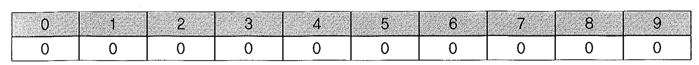
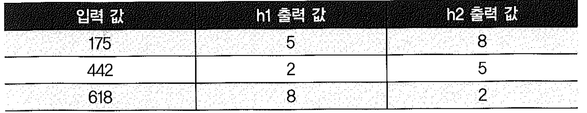
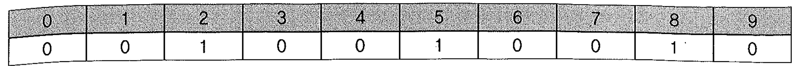
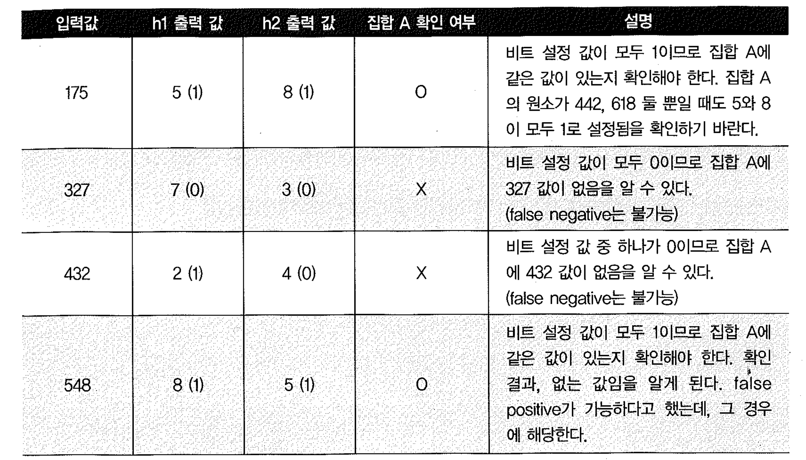
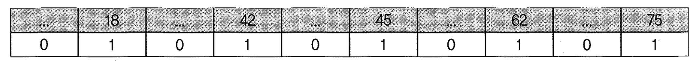
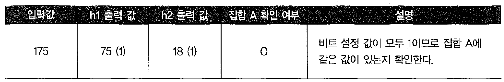
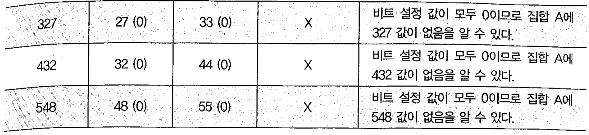

# 02. 파티션 Pruning


- 파티션 Pruning은 하드파싱이나 실행 시점에 SQL 조건절을 분석하여 읽지 않아도 되는 파티션 세그먼트를 액세스 대상에서 제외 시키는 기능이다.
- 파티션 테이블에 대한 쿼리나 DML을 수행할 때 극적인 성능 개선을 가져다주는 핵심원리가 파티션 Pruning에 있다고 할 수 있다.


## 1) 기본 파티션 Pruning


#### 정적(Static) 파티션 Pruning

- 파티션 키 컬럼을 상수 조건으로 조회하는 경우에 작동하며, 액세스할 파티션이 쿼리 최적화 시점에 미리 결정되는 것이 특징이다.
- 실행 계획읜 `Pstart(partition start)`와 `Pstop(partition stop)` 컬럼에는 액세스할 파티션 번호가 출력된다.


#### 동적(Dynamic) 파티션 Pruning

- 파티션 키 컬럼을 바인드 변수로 조회하면 쿼리 최적화 시점에는 액세스할 파티션을 미리 결정할 수 없다.
- 실행 시점이 되서야 사용자가 입력한 값에 따라 결정되며, 실행계획의 Pstart와 Pstop 컬럼에는 `KEY 로 표기된다.
- NL조인할 때도 Inner 테이블이 조인 컬럼 기준으로 파티셔닝 돼 있다면 동적 Pruning이 작동한다.


### 파티션 Pruning 기능에 따른 실행계획 비교

```sql
create table t ( key, no, data )
partition by range(no)(
  partition p01 values less than(11)
, partition p02 values less than(21)
, partition p03 values less than(31)
, partition p04 values less than(41)
, partition p05 values less than(51)
, partition p06 values less than(61)
, partition p07 values less than(71)
, partition p08 values less than(81)
, partition p09 values less than(91)
, partition p10 values less than(maxvalue)
)
as
select lpad(rownum, 6, '0'), mod(rownum, 100)+1, lpad(rownum, 10, '0')
from   dual
connect by level <= 999999;

-- 상수값으로 입력
select count(*) from t 
Where no between 30 and 50; 

--------------------------------------------------------------------------------------------------
| Id  | Operation                 | Name | Rows  | Bytes | Cost (%CPU)| Time | Pstart| Pstop |
--------------------------------------------------------------------------------------------------
|   0 | SELECT STATEMENT          |      |     1 |    13 |   287  (14)| 00:00:04 |       |       |
|   1 |  SORT AGGREGATE           |      |     1 |    13 |            |          |       |       |
|   2 |   PARTITION RANGE ITERATOR|      |   204K|  2590K|   287  (14)| 00:00:04 *|*     *3 |     5* |
|   3 |    TABLE ACCESS FULL      | T    |   204K|  2590K|   287  (14)| 00:00:04 *|     3 |     5* |
-------------------------------------------------------------------------------------------------- 


-- Bind변수로 입력

select count(*) from t 
Where no between :a and :b;
---------------------------------------------------------------------------------------------------
| Id  | Operation                  | Name | Rows  | Bytes | Cost (%CPU)| Time  | Pstart| Pstop |
---------------------------------------------------------------------------------------------------
|   0 | SELECT STATEMENT           |      |     1 |    13 |   876   (7)| 00:00:11 |       |       |
|   1 |  SORT AGGREGATE            |      |     1 |    13 |            |          |       |       |
|   2 |   FILTER                   |      |       |       |            |          |       |       |
|   3 |    PARTITION RANGE ITERATOR|      |  2214 | 28782 |   876   (7)| 00:00:11 *|   KEY |   KEY |*
|   4 |     TABLE ACCESS FULL      | T    |  2214 | 28782 |   876   (7)| 00:00:11 *|   KEY |   KEY |*
--------------------------------------------------------------------------------------------------- 
*  'KEY'라고 표시된 것은 하드파싱 시점에 액세스할 파티션을 결정할 수 없기 때문이다.

-- In-List 이용

select count(*) from t 
Where no in (30, 50);
------------------------------------------------------------------------------------------------
| Id  | Operation               | Name | Rows  | Bytes | Cost (%CPU)| Time     | Pstart| Pstop |
------------------------------------------------------------------------------------------------
|   0 | SELECT STATEMENT        |      |     1 |    13 |   210  (22)| 00:00:03 |       |       |
|   1 |  SORT AGGREGATE         |      |     1 |    13 |            |          |       |       |
|   2 |   PARTITION RANGE INLIST|      | 22428 |   284K|   210  (22)| 00:00:03 |{*}KEY(I) |KEY(I)* |
|   3 |    TABLE ACCESS FULL    | T    | 22428 |   284K|   210  (22)| 00:00:03 |{*}KEY(I) |KEY(I) |*
------------------------------------------------------------------------------------------------ 

 * IN-List  조건을 사용하면 상수 값이더라도 KEY(I)라고 표시된다.

--NL Join Test

create table n
as
select level no from dual connect by level <=100;


explain plan for 
select /*+ leading(n) use_nl(t) */ * 
from   n, t
where  t.no = n.no;

----------------------------------------------------------------------------
| Id  | Operation                  | Name | Rows  | Bytes | Pstart| Pstop |
----------------------------------------------------------------------------
|   0 | SELECT STATEMENT           |      | 1097K |   48M |       |       |
|   1 |  NESTED LOOPS              |      | 1097K |   48M |       |       |
|   2 |   TABLE ACCESS FULL        | N    |   100 | 1300  |       |       |
|   3 |    PARTITION RANGE ITERATOR|      | 10975 | 353K  |   KEY |   KEY |
|   4 |     TABLE ACCESS FULL      | T    | 10975 | 353K  |   KEY |   KEY |
----------------------------------------------------------------------------

-- 결합파티션
SQL > create table t ( key, no, data )
partition by range(no) subpartition by hash(key) subpartitions 16 (
  partition p01 values less than(11)
, partition p02 values less than(21)
, partition p03 values less than(31)
, partition p04 values less than(41)
, partition p05 values less than(51)
, partition p06 values less than(61)
, partition p07 values less than(71)
, partition p08 values less than(81)
, partition p09 values less than(91)
, partition p10 values less than(maxvalue)
)
as
select lpad(rownum, 6, '0'), mod(rownum, 50)+1, lpad(rownum, 10, '0') 
from   dual 
connect by level <= 999999;


select count(*) from t where no between 30 and 50;

----------------------------------------------------------------------------
| Id  | Operation                  | Name | Rows  | Bytes | Pstart| Pstop |
----------------------------------------------------------------------------
|   0 | SELECT STATEMENT           |      |     1 |    13 |       |       |
|   1 |  SORT AGGREGATE            |      |     1 |    13 |       |       |
|   2 |   PARTITION RANGE ITERATOR |      |  576K | 7323K |     3 |     5 |
|   3 |    PARTITION HASH ALL      |      |  576K | 7323K |     1 |    16 |
|   4 |     TABLE ACCESS FULL      | T    |  576K | 7323K |    33 |    80 |
----------------------------------------------------------------------------

select count(*) from t where no between :A and :B;

----------------------------------------------------------------------------
| Id  | Operation                  | Name | Rows  | Bytes | Pstart| Pstop |
----------------------------------------------------------------------------
|   0 | SELECT STATEMENT            |      |     1 |    13 |       |       |
|   1 |  SORT AGGREGATE             |      |     1 |    13 |       |       |
|*  2 |   FILTER                    |      |       |       |       |       |
|*  2 |    PARTITION RANGE ITERATOR |      |  2226 | 28938 |   KEY |   KEY |
|   3 |     PARTITION HASH ALL      |      |  2226 | 28938 |     1 |    16 |
|*  4 |      TABLE ACCESS FULL      | T    |  2226 | 28938 |   KEY |   KEY |
----------------------------------------------------------------------------
```


### 파티션 Pruning 기능에 따른 I/O 수행량 비교

```sql
-- Partition Pruning 발생
select * from t
where no=1 and key ='000100'

Call     Count CPU Time Elapsed Time       Disk      Query    Current       Rows
------- ------ -------- ------------ ---------- ---------- ---------- ----------
Parse        1    0.062        0.144          0         22          0          0
Execute      1    0.000        0.000          0          0          0          0
Fetch        2    0.000        0.092         44         50          0          1
------- ------ -------- ------------ ---------- ---------- ---------- ----------
Total        4    0.062        0.236         44         72          0          1

Rows     Row Source Operation
-------  ---------------------------------------------------
      0  STATEMENT
      1   PARTITION RANGE SINGLE PARTITION: 1 1 (cr=50 pr=44 pw=0 time=27716 us)
      1    PARTITION HASH SINGLE PARTITION: 6 6 (cr=50 pr=44 pw=0 time=27700 us)
      1     TABLE ACCESS FULL T PARTITION: 6 6 (cr=50 pr=44 pw=0 time=27685 us)

-- Sub Partition Key Column에 Function을 이용

select * from t
where no=1 and to_number(key) = 100


Call     Count CPU Time Elapsed Time       Disk      Query    Current       Rows
------- ------ -------- ------------ ---------- ---------- ---------- ----------
Parse        1    0.031        0.036          0        121          0          0
Execute      1    0.000        0.000          0          0          0          0
Fetch        2    0.031        1.051        587        777          0          1
------- ------ -------- ------------ ---------- ---------- ---------- ----------
Total        4    0.062        1.087        587        898          0          1

Rows     Row Source Operation
-------  ---------------------------------------------------
      0  STATEMENT
      1   PARTITION RANGE SINGLE PARTITION: 1 1 (cr=777 pr=587 pw=0 time=362513 us)
      1    PARTITION HASH ALL PARTITION: 1 16 (cr=777 pr=587 pw=0 time=362497 us)
# TABLE ACCESS FULL T PARTITION: 1 16 (cr=777 pr=587 pw=0 time=1049983 us)


-- 암시적 형변환이 일어난 경우
elect * from t
where no=1 and key = 100;

Call     Count CPU Time Elapsed Time       Disk      Query    Current       Rows
------- ------ -------- ------------ ---------- ---------- ---------- ----------
Parse        1    0.031        0.034          0        121          0          0
Execute      1    0.000        0.000          0          0          0          0
Fetch        2    0.031        0.037          0        777          0          1
------- ------ -------- ------------ ---------- ---------- ---------- ----------
Total        4    0.062        0.071          0        898          0          1

Rows     Row Source Operation
-------  ---------------------------------------------------
      0  STATEMENT
      1   PARTITION RANGE SINGLE PARTITION: 1 1 (cr=777 pr=0 pw=0 time=12688 us)
      1    PARTITION HASH ALL PARTITION: 1 16 (cr=777 pr=0 pw=0 time=12665 us)
      1     TABLE ACCESS FULL T PARTITION: 1 16 (cr=777 pr=0 pw=0 time=34235 us)

-- 주 Partition Key에 형변환을 사용할 경우
select * from t
where to_char(no)=1 and key = 100

Call     Count CPU Time Elapsed Time       Disk      Query    Current       Rows
------- ------ -------- ------------ ---------- ---------- ---------- ----------
Parse        1    0.031        0.038          0        166          0          0
Execute      1    0.000        0.000          0          0          0          0
Fetch        2    0.359        4.513       2859       4217         51          1
------- ------ -------- ------------ ---------- ---------- ---------- ----------
Total        4    0.390        4.550       2859       4383         51          1

Rows     Row Source Operation
-------  ---------------------------------------------------
      0  STATEMENT
      1   PARTITION RANGE ALL PARTITION: 1 10 (cr=4217 pr=2859 pw=0 time=13718 us)
      1    PARTITION HASH ALL PARTITION: 1 16 (cr=4217 pr=2859 pw=0 time=4481997 us)
      1     TABLE ACCESS FULL T PARTITION: 1 160 (cr=4217 pr=2859 pw=0 time=4508829 us)
```


#### 동적 파티션 Pruning 시 테이블 레벨 통계 사용

- 바인드 변수를 사용하면 최적화 시점에 파티션을 확장할 수 없어 동적 파티션 Pruning이 일어 나는데, 이와 같은 이유로 쿼리 최적화에 테이블 레벨 통계가 사용된다.
- 정적 파티션 Pruning일 때는 파티션 레벨 통계가 사용된다.
- 테이블 레벨 통계는 파티션 레벨 통계보다 다소 부정확하기 때문에 옵티마이저가 가끔 잘못된 실행계획을 수립하는 경우가 생기며, 이는 바인드 변수 때문에 생기는 대표적인 부작용 중 하나다.


## 2) Sub쿼리 Pruning

- 서브 쿼리 Pruning(8i)
- 조인 필터 Pruning (11g)

```sql
Select d.분기, o.주문일자, o.고객ID, o.상품ID, o.주문수량, o.주문금액
From 일자 d, 주문 o
Where o.주문일자 = d.일자
And     d.분기 >= 'Q20071';
```

- NL조인할 때 Inner 테이블이 조인 컬럼 기준으로 파티셔닝 돼 있다면 동적 Pruning이 작동한다.
- 주문은 대용량 거래 테이블이므로 주문일자 기준으로 월별 Range 파티셔닝 돼 있을 테고, 일자 테이블을 드라이빙해 NL 조인한다면 분기 >='Q20071'기간에 포함되는 주문 레코드만 읽을 수 있다.
- 위와 같은 상황에서 대용량 주문 테이블을 Random 액세스 위주의 NL 방식으로 조인한다면 결코 좋은 성능을 기대하기 어렵다. 2007년 1분기 이후 주문 데이터만 필요한데도 주문 테이블로부터 모든 파티션을 읽어 조인하고서 나중에 분기 조건을 필터링해야 하기 때문이다
- 오라클은 recursive 서브쿼리를 이용한 동적 파티션 Pruning을 고려한다. 즉, subquery Pruning이라고 불리는 매커니즘 이다.


```sql
select distinct TBL$OR$IDX$PART$NUM(주문, 0,1,0, a.일자)
 From (select 일자 from 일자 were 분기 >= 'Q20071') a
Order by 1
```

- 위와 같은 쿼리가 실행 한다. 이 쿼리를 수행하면 액세스 해야 할 파티션 번호 목록이 구해지며, 이를 이용해 필요한 주문 파티션만 스캔할 수 있다.
- Pstart에 KEY(SQ)는 SQ는 Subquery를 뜻한다


- 제거될 것으로 예상되는 파티션 개수가 상당히(기본 값에 의하면 50%) 많고, where 조건절을 가진 드라이빙 테이블이 파티션 테이블에 비해 상당히 작을때만 서브쿼리 Pruning이 작동한다.

```sql
drop table dept;

drop table emp;

create table dept as select * from scott.dept;

create table emp 
partition by range (deptno)
(partition p1 values less than (10),
 partition p2 values less than (20), 
 partition p3 values less than (30),
 partition p4 values less than (MAXVALUE))
as
select * from scott.emp ; 


-- 서브쿼리 Pruning이 작동하지 않는 경우
alter session set "_subquery_pruning_cost_factor" = 20;  -- default
alter session set "_subquery_pruning_reduction" = 50;    -- default


set autotrace traceonly exp;

select /*+ leading(d) use_hash(e) */ *
from   dept d, emp e
where  d.deptno = e.deptno
and    d.loc = 'DALLAS';

---------------------------------------------------------------------------------------------
| Id  | Operation            | Name | Rows  | Bytes | Cost (%CPU)| Time     | Pstart| Pstop |
---------------------------------------------------------------------------------------------
|   0 | SELECT STATEMENT     |      |     5 |   585 |     8  (13)| 00:00:01 |       |       |
|*  1 |  HASH JOIN           |      |     5 |   585 |     8  (13)| 00:00:01 |       |       |
|*  2 |   TABLE ACCESS FULL  | DEPT |     1 |    30 |     3   (0)| 00:00:01 |       |       |
|   3 |   PARTITION RANGE ALL|      |    14 |  1218 |     4   (0)| 00:00:01 |     1 |     4 |
|   4 |    TABLE ACCESS FULL | EMP  |    14 |  1218 |     4   (0)| 00:00:01 |     1 |     4 |
---------------------------------------------------------------------------------------------

select /*+ leading(e) use_hash(d) */ *
from   dept d, emp e
where  d.deptno = e.deptno
and    d.loc = 'DALLAS';

---------------------------------------------------------------------------------------------
| Id  | Operation            | Name | Rows  | Bytes | Cost (%CPU)| Time     | Pstart| Pstop |
---------------------------------------------------------------------------------------------
|   0 | SELECT STATEMENT     |      |     5 |   585 |     8  (13)| 00:00:01 |       |       |
|*  1 |  HASH JOIN           |      |     5 |   585 |     8  (13)| 00:00:01 |       |       |
|   2 |   PARTITION RANGE ALL|      |    14 |  1218 |     4   (0)| 00:00:01 |     1 |     4 |
|   3 |    TABLE ACCESS FULL | EMP  |    14 |  1218 |     4   (0)| 00:00:01 |     1 |     4 |
|*  4 |   TABLE ACCESS FULL  | DEPT |     1 |    30 |     3   (0)| 00:00:01 |       |       |
---------------------------------------------------------------------------------------------


-- 서브쿼리 Pruning이 작동하는 경우

alter session set "_subquery_pruning_cost_factor" = 1;
alter session set "_subquery_pruning_reduction" = 100;


select /*+ leading(d) use_hash(e) */ *
from   dept d, emp e
where  d.deptno = e.deptno
and    d.loc = 'DALLAS';

--------------------------------------------------------------------------------------------------
| Id  | Operation                 | Name | Rows  | Bytes | Cost (%CPU)| Time     | Pstart| Pstop |
--------------------------------------------------------------------------------------------------
|   0 | SELECT STATEMENT          |      |     5 |   585 |     8  (13)| 00:00:01 |       |       |
|*  1 |  HASH JOIN                |      |     5 |   585 |     8  (13)| 00:00:01 |       |       |
|*  2 |   TABLE ACCESS FULL       | DEPT |     1 |    30 |     3   (0)| 00:00:01 |       |       |
|   3 |   PARTITION RANGE SUBQUERY|      |    14 |  1218 |     4   (0)| 00:00:01 |KEY(SQ)|KEY(SQ)|
|   4 |    TABLE ACCESS FULL      | EMP  |    14 |  1218 |     4   (0)| 00:00:01 |KEY(SQ)|KEY(SQ)|
--------------------------------------------------------------------------------------------------


select /*+ leading(e) use_hash(d) */ *
from   dept d, emp e
where  d.deptno = e.deptno
and    d.loc = 'DALLAS';

--------------------------------------------------------------------------------------------------
| Id  | Operation                 | Name | Rows  | Bytes | Cost (%CPU)| Time     | Pstart| Pstop |
--------------------------------------------------------------------------------------------------
|   0 | SELECT STATEMENT          |      |     5 |   585 |     8  (13)| 00:00:01 |       |       |
|*  1 |  HASH JOIN                |      |     5 |   585 |     8  (13)| 00:00:01 |       |       |
|   2 |   PARTITION RANGE SUBQUERY|      |    14 |  1218 |     4   (0)| 00:00:01 |KEY(SQ)|KEY(SQ)|
|   3 |    TABLE ACCESS FULL      | EMP  |    14 |  1218 |     4   (0)| 00:00:01 |KEY(SQ)|KEY(SQ)|
|*  4 |   TABLE ACCESS FULL       | DEPT |     1 |    30 |     3   (0)| 00:00:01 |       |       |
--------------------------------------------------------------------------------------------------
```


## 3) 조인 필터 Pruning

- 서브 쿼리 Pruning은 드라이빙 테이블을 한 번 더 액세스하는 추가 비용이 발생한다.
- 11g부터 오라클은 블룸 필터(Bloom Filter) 알고리즘을 기반으로 한 조인 필터 pruning 방식을 도입하였다.


### 블룸 필터(Bloom Filter)알고리즘

- 아래 처럼 A,B 두 개의 집합이 있고, 두 집합 간의 교집합을 찾으려고 한다.
- 집합 A={175, 442, 68}
- 집합 B={175, 442, 68}

1. N 비트 Array를 할당하고 (1~n), 각 비트를 0으로 설정한다.

"0~9"번 까지 10개 비트를 할당하고 모두 0으로 설정한다.


1. n개의 값 (1~n중 하나)을 리턴하는 m개의 해시 함수를 정의하며, 서로 다른 해시 알고리즘을 사용한다. m개의 해쉬 함수는 다른 입력 값에 대해 우연히 같은 출력 값을 낼 수도 있다.

0부터 9 까지 총 10개의 값을 리턴할 수 있는 두 개의 함수 (h1, 2)를 정의한다. 두 함수는 서로 다르게 구현되었다.

```sql
create or replace function h1(e number) return number
as
begin
  return mod(e, 10);
end;
/

create or replace function h2(e number) return number
as
begin
  return mod(ceil(e/10), 10);
end;
/

select rownum no, h1(rownum) r1, h2(rownum) r2
from dual
connect by level <= 100;


create or replace function h1(e number) return number
as
begin
  return mod(e, 100);
end;
/

create or replace function h2(e number) return number
as
begin
  return mod(ceil(e/10), 100);
end;
/


select rownum no, h1(rownum) r1, h2(rownum) r2
from dual
connect by level <= 100;
```

1. 집합 A의 각 원소마다 차례로 m개의 해시 함수를 "모두" 적용한다. 그리고 각 해시 함수에서 리턴된 값(1~n중 하나)에 해당하는 비트(1~n중 하나)를 모두 1로 설정한다.

집합 A의 각 원소(175, 442, 618)마다 차례로 h1, h2 함수를 적용하고, 각 해ㅣ 함수에서 리턴된 값 (0~9중 하나)에 해당하는 비트를 모두 1로 설정한다.


따라서 3번 과정을 모두 완료하고 나서 비트값을 확인해 보면, 아래와 같다.


1. 교집합을 찾을 준비가 끝났다. 이제 집합 B의 각 원소마다 차례로 m개의 해시 함수를 "모두" 적용한다. 그리고 원소별로 해시 함수에서 리턴된 값(1~n)에 해당하는 비트를 모두 확인한다.
   1. 하나라도 0으로 설정돼 있으면 그 원소는 집합 A에 없는 값이다. 잘못된 음수(false negative)는 불가능하기 때문이다. 즉, 집합 A에 있는 값인데 0으로 남았을 리가 없다. ( 0을 음수라고 가정하자.)
   2. 모두 1로 설정돼 있으면 그 원소는 집합 A에 포함될 가능성이 있는 값이므로 이대만 집합 A를 찾아가 실제 같은 값을 가진 원소가 있는지 찾아 본다. 모두 1로 설정돼 있는데도 집합 A에 실제 그 값이 있는지 확인해야 하는 이유는, 잘못된 양수(flase positive) 집합 A에 없는 값인데 모두 1로 설정될 수도 있기 때문이다.

집합 B(175, 327,432,548)의 각 원소마다 차례로 h1, h2 함수를 적용하고, 리턴된 값 (0~9중 하나)에 해당하는 비트를 모두 확인한다. 하나라도 0으로 설정돼 있으면 그 원소는 집합 A에 없는 값이다. 모두 1로 설정돼 있으면 그 원소는 집합 A에 포함 될 가능성이 있는 값이므로 이때만 집합 A를 찾아가 실제 같은 값을 가진 원소가 있는지 찾아 본다.


- 볼룸 필터 역할은, 교집합에 해당하는 원소(175)를 찾는 데 있지 않고 교집합이 아닌 것이 확실한 원소(327, 432)를 찾는 데에 있다. 327과 432를 제외한 나머지 원소(175, 548)에 대해서만 집합 A를 확인해서 실제 교집합인지를 가린다.

#### 볼룸 필터 알고리즘에서 false positive를 줄이는 방법

- 집합 B의 원소 548 false positive가 발생해 불필요하게 집합 A를 확인해야만 한다.
- 10비트 보다 큰 100비트 Array를 사용하면 어떻게 될까???

```sql
create or replace function h1(e number) return number
as
begin
  return mod(e, 100);
end;
/

create or replace function h2(e number) return number
as
begin
  return mod(ceil(e/10), 100);
end;
/
```

- 아래는 집합 A에 있는 세 값을 h1, h2 함수에 입력했을 때의 출력 값이다.


- 이들 출력 밧으로 비트를 설정하고 나면, 아래처럼 18, 42, 45, 62, 75 비트가 1로 설정된다.
- 

- 똑같이 집합 B (175, 327, 432, 548)의 함수 출력 값으로 비트를 확인해 보면, 이번에는 집합 A에 실제 값이 있는 175에 대해서만 확인이 필요해진다. False positive가 한 ㅂㄴ도 발생하지 않는 것이다.





- 이처럼 더 많은 비트를 할당(더 많은 공간 필요)하거나 더 많은 해시 함수를 사용(더 많은 시간을 소비)하면 false positive 발생 가능성은 줄어든다. 공간/시간의 효율성과 false positive 발생 가능성은 서로 트레이드 오프관게이므로 적정한 개수의 비트와 해시 함수를 사용하는 것이 과제다.


### 조인 필터(=볼륨 필터) Pruning

- 11g 부터 적용되기 시작한 이 기능은 파티션 테이블과 조인할 대, 읽지 않아도 되는 파티션을 제거해 주는 것으로서 '조인필터 Pruning' 또는 '볼륨 필터 Pruning'이라고 부른다.

```sql
Select d.분기, o.주문일자, o.고객ID, o.상품ID, o.주문수량, o.주문금액주문금액
From   일자 d, 주문 o
Where o.주문일자 = d.일자
And d.분기 >= 'Q20071';

Rows     Row Source Operation
-------  ---------------------------------------------------
 480591  HASH JOIN (cr=3827 pr=0 pw=0 time=4946 us cost=655 size=2100270 ...)
     12   PART JOIN FILTER CREATE:BF0000 (cr=4 pr=0 pw=0 time=18 us cost=4 ...)
     12    TABLE ACCESS FULL 일자 (cr=4 pr=0 pw=0 time=6 us cost=4 size=10388 ...)
 480591   PARTITION RANGE JOIN-FILTER PARTITION: :BF0000 :BF0000 (cr=3823 pr=0 ...)
 480591    TABLE ACCESS FULL 주문 PARTITION:  :BF0000 :BF0000 (cr=3823 pr=0 ...)
```

- Part join filter create와 partition range join-filter를 포함하는 두 개 오퍼레이션 단계가 눈에 띈다.
- 전자를 블룸 필터를 생성하는 단계, 후자는 블룸 필터를 이용해 파티션 Pruning 하는 단계를 나타낸다.

1. 일자 테이블로부터 분기 >= 'Q20071' 조건에 해당하는 레코드를 읽어 해시 테이블을 만들면서 블룸 필터를 생성한다. 즉, 조인 컬럼인 일자 값에 매핑되는 주문 테이블 파티션 번호를 찾아 n개의 해시함수에 입력하고 거기서 출력된 값을 이용해 비트 값을 설정한다.
2. 일자 테이블을 다 읽고 나면 주문 테이블의 파티션 번호별로 비트 값을 확인함으로써 읽지 않아도 되는 파티션 목록을 취합한다.
3. 취합된 파티션을 제외한 나머지 파티션만 읽어 조인한다.

- 이 알고리즘을 사용하는 조인필터 Pruning도 조인 대상 집합을 확실히 포함하는 파티션을 찾는 게 아니라, 확실히 포함하지 않는 파티션을 찾는다. 그런 후 그 파티션 목록을 제외한 나머지 파티션만 스캔한다.
- 위 쿼리는 기본적으로 2007년 1월부터 현재까지의 파티션만 읽지만, false positive가 발생해 그 이전 파티션 중 일부를 불필요하게 읽을 가능성은 있다. 하지만 이런 고급 파티션 Pruning 기법을 활용하지 않았을 때 모든 파티션을 읽는 것에 비하면 훨씬 효율적이다.
- 서브쿼리 pruning과 비교해 보면, 드라이빙 테이블이 클수록 조인 필터 Pruning이 유리하다.


## 4) SQL 조건절 작성 시 주의사항

- 고객 테이블을 아래처럼 가입일 기준으로 Range 월 파티셔닝 하였다.

```sql
create table 고객
partition by range(가입일)
( partition m01 values less than('20090201')
, partition m02 values less than('20090301')
, partition m03 values less than('20090401')
, partition m04 values less than('20090501')
, partition m05 values less than('20090601')
, partition m06 values less than('20090701')
, partition m07 values less than('20090801')
, partition m08 values less than('20090901')
, partition m09 values less than('20091001')
, partition m10 values less than('20091101')
, partition m11 values less than('20091201')
, partition m12 values less than('20100101'))
as
select rownum 고객ID
     , dbms_random.string('a', 20) 고객명
     , to_char(to_date('20090101', 'yyyymmdd') + (rownum - 1), 'yyyymmdd') 가입일
from   dual
connect by level <= 365;
```

- 2009년 10월에 가입한 고객을 조회할 대 like 연산자를 사용했더ㅣ 두 개 (9~10번) 파티션을 스캔하는 것을 볼 수 있다. 왜 m10 파티션만 읽지 않고 m0 파티션까지 읽은 것일까?

```sql
set autotrace traceonly exp;

select * from 고객
where  가입일 like '200910%';

Execution Plan
----------------------------------------------------------------------------------------------------
| Id  | Operation                | Name | Rows  | Bytes | Cost (%CPU)| Pstart| Pstop |
--------------------------------------------------------------------------------------
|   0 | SELECT STATEMENT         |      |    31 | 62651 |     2   (0)|       |     |
|   1 |  PARTITION RANGE ITERATOR|      |    31 | 62651 |     2   (0)|     9 |  10 |
|*  2 |   TABLE ACCESS FULL      | 고객 |    31 | 62651 |     2   (0)|     9 |  10 |
--------------------------------------------------------------------------------------
```

- 아래 처럼 '20091001' 보다 작은 수많은 문자가 존재하는데, 이 값들이 입력된다면 파티션 정의상 2009년 9월 파티션(m09)에 저장된다.
  - 200910, 2091000, ...
  - 2009100+, 2009100-, 2009100*, 2009100/, ...
  - 2009100%, 200900$, 2009100#, ...
- 이 상태에서 위와 가이 like '200910%' 조건으로 검색한다면 이들 값까지 모두 결과집합에 포함시켜야 하므로 옵티마이저는 m09 파티션을 스캔하지 않을 수 없다. 사용자가 이런 값들을 이력하지 않더라도 옵티마이저 입장에서는 알 수 없는 일이다.
- 따라서 위와 같이 (월이 아닌) 일자로써 파티션 키 값을 정의했다면 아래와 같이 between 연산자를 이용해 정확한 값 범위를 주고 쿼리해야 한다.

```sql
set pagesize 1000
set linesize 300
select * from 고객
where 가입일 between '20091001' and '20091031';

Execution Plan
---------------------------------------------------------------------------------------
| Id  | Operation              | Name | Rows  | Bytes | Cost (%CPU)| Pstart| Psop |
-----------------------------------------------------------------------------------
|   0 | SELECT STATEMENT       |      |    31 | 62651 |     2   (0)|       |   |
|   1 |  PARTITION RANGE SINGLE|      |    31 | 62651 |     2   (0)|    10 |10 |
|*  2 |   TABLE ACCESS FULL    | 고객 |    31 | 62651 |     2   (0)|    10 |10 |
-----------------------------------------------------------------------------------
```

- Like 보다 between이 유리하다.
- 위와 같은 상황에서, 만약 일일이 SQL을 수정하기 곤란하다면 연월(yyyymm)로써 파티션 키 값을 다시 정의해 주면 된다.

