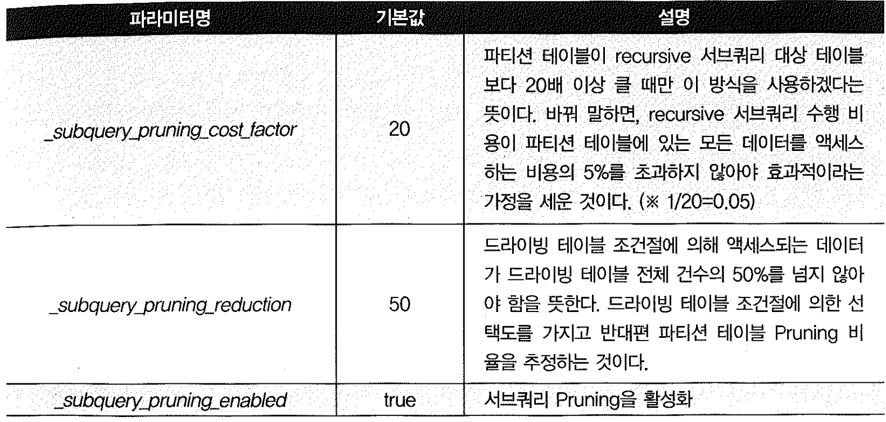

# 02. 파티션 Pruning


- 파티션 Pruning은 하드파싱이나 실행 시점에 SQL 조건절을 분석하여 읽지 않아도 되는 파티션 세그먼트를 액세스 대상에서 제외 시키는 기능이다.
- 파티션 테이블에 대한 쿼리나 DML을 수행할 때 극적인 성능 개선을 가져다주는 핵심원리가 파티션 Pruning에 있다고 할 수 있다.


## 1) 기본 파티션 Pruning


#### 정적(Static) 파티션 Pruning

- 파티션 키 컬럼을 상수 조건으로 조회하는 경우에 작동하며, 액세스할 파티션이 쿼리 최적화 시점에 미리 결정되는 것이 특징이다.
- 실행 계획읜 `Pstart(partition start)`와 `Pstop(partition stop)` 컬럼에는 액세스할 파티션 번호가 출력된다.


#### 동적(Dynamic) 파티션 Pruning

- 파티션 키 컬럼을 바인드 변수로 조회하면 쿼리 최적화 시점에는 액세스할 파티션을 미리 결정할 수 없다.
- 실행 시점이 되서야 사용자가 입력한 값에 따라 결정되며, 실행계획의 Pstart와 Pstop 컬럼에는 `KEY 로 표기된다.
- NL조인할 때도 Inner 테이블이 조인 컬럼 기준으로 파티셔닝 돼 있다면 동적 Pruning이 작동한다.


### 파티션 Pruning 기능에 따른 실행계획 비교

```sql
create table t ( key, no, data )
partition by range(no)(
  partition p01 values less than(11)
, partition p02 values less than(21)
, partition p03 values less than(31)
, partition p04 values less than(41)
, partition p05 values less than(51)
, partition p06 values less than(61)
, partition p07 values less than(71)
, partition p08 values less than(81)
, partition p09 values less than(91)
, partition p10 values less than(maxvalue)
)
as
select lpad(rownum, 6, '0'), mod(rownum, 100)+1, lpad(rownum, 10, '0')
from   dual
connect by level <= 999999;

-- 상수값으로 입력
select count(*) from t 
Where no between 30 and 50; 

--------------------------------------------------------------------------------------------------
| Id  | Operation                 | Name | Rows  | Bytes | Cost (%CPU)| Time | Pstart| Pstop |
--------------------------------------------------------------------------------------------------
|   0 | SELECT STATEMENT          |      |     1 |    13 |   287  (14)| 00:00:04 |       |       |
|   1 |  SORT AGGREGATE           |      |     1 |    13 |            |          |       |       |
|   2 |   PARTITION RANGE ITERATOR|      |   204K|  2590K|   287  (14)| 00:00:04 *|*     *3 |     5* |
|   3 |    TABLE ACCESS FULL      | T    |   204K|  2590K|   287  (14)| 00:00:04 *|     3 |     5* |
-------------------------------------------------------------------------------------------------- 


-- Bind변수로 입력

select count(*) from t 
Where no between :a and :b;
---------------------------------------------------------------------------------------------------
| Id  | Operation                  | Name | Rows  | Bytes | Cost (%CPU)| Time  | Pstart| Pstop |
---------------------------------------------------------------------------------------------------
|   0 | SELECT STATEMENT           |      |     1 |    13 |   876   (7)| 00:00:11 |       |       |
|   1 |  SORT AGGREGATE            |      |     1 |    13 |            |          |       |       |
|   2 |   FILTER                   |      |       |       |            |          |       |       |
|   3 |    PARTITION RANGE ITERATOR|      |  2214 | 28782 |   876   (7)| 00:00:11 *|   KEY |   KEY |*
|   4 |     TABLE ACCESS FULL      | T    |  2214 | 28782 |   876   (7)| 00:00:11 *|   KEY |   KEY |*
--------------------------------------------------------------------------------------------------- 
*  'KEY'라고 표시된 것은 하드파싱 시점에 액세스할 파티션을 결정할 수 없기 때문이다.

-- In-List 이용

select count(*) from t 
Where no in (30, 50);
------------------------------------------------------------------------------------------------
| Id  | Operation               | Name | Rows  | Bytes | Cost (%CPU)| Time     | Pstart| Pstop |
------------------------------------------------------------------------------------------------
|   0 | SELECT STATEMENT        |      |     1 |    13 |   210  (22)| 00:00:03 |       |       |
|   1 |  SORT AGGREGATE         |      |     1 |    13 |            |          |       |       |
|   2 |   PARTITION RANGE INLIST|      | 22428 |   284K|   210  (22)| 00:00:03 |{*}KEY(I) |KEY(I)* |
|   3 |    TABLE ACCESS FULL    | T    | 22428 |   284K|   210  (22)| 00:00:03 |{*}KEY(I) |KEY(I) |*
------------------------------------------------------------------------------------------------ 

 * IN-List  조건을 사용하면 상수 값이더라도 KEY(I)라고 표시된다.

--NL Join Test

create table n
as
select level no from dual connect by level <=100;


explain plan for 
select /*+ leading(n) use_nl(t) */ * 
from   n, t
where  t.no = n.no;

----------------------------------------------------------------------------
| Id  | Operation                  | Name | Rows  | Bytes | Pstart| Pstop |
----------------------------------------------------------------------------
|   0 | SELECT STATEMENT           |      | 1097K |   48M |       |       |
|   1 |  NESTED LOOPS              |      | 1097K |   48M |       |       |
|   2 |   TABLE ACCESS FULL        | N    |   100 | 1300  |       |       |
|   3 |    PARTITION RANGE ITERATOR|      | 10975 | 353K  |   KEY |   KEY |
|   4 |     TABLE ACCESS FULL      | T    | 10975 | 353K  |   KEY |   KEY |
----------------------------------------------------------------------------

-- 결합파티션
SQL > create table t ( key, no, data )
partition by range(no) subpartition by hash(key) subpartitions 16 (
  partition p01 values less than(11)
, partition p02 values less than(21)
, partition p03 values less than(31)
, partition p04 values less than(41)
, partition p05 values less than(51)
, partition p06 values less than(61)
, partition p07 values less than(71)
, partition p08 values less than(81)
, partition p09 values less than(91)
, partition p10 values less than(maxvalue)
)
as
select lpad(rownum, 6, '0'), mod(rownum, 50)+1, lpad(rownum, 10, '0') 
from   dual 
connect by level <= 999999;


select count(*) from t where no between 30 and 50;

----------------------------------------------------------------------------
| Id  | Operation                  | Name | Rows  | Bytes | Pstart| Pstop |
----------------------------------------------------------------------------
|   0 | SELECT STATEMENT           |      |     1 |    13 |       |       |
|   1 |  SORT AGGREGATE            |      |     1 |    13 |       |       |
|   2 |   PARTITION RANGE ITERATOR |      |  576K | 7323K |     3 |     5 |
|   3 |    PARTITION HASH ALL      |      |  576K | 7323K |     1 |    16 |
|   4 |     TABLE ACCESS FULL      | T    |  576K | 7323K |    33 |    80 |
----------------------------------------------------------------------------

select count(*) from t where no between :A and :B;

----------------------------------------------------------------------------
| Id  | Operation                  | Name | Rows  | Bytes | Pstart| Pstop |
----------------------------------------------------------------------------
|   0 | SELECT STATEMENT            |      |     1 |    13 |       |       |
|   1 |  SORT AGGREGATE             |      |     1 |    13 |       |       |
|*  2 |   FILTER                    |      |       |       |       |       |
|*  2 |    PARTITION RANGE ITERATOR |      |  2226 | 28938 |   KEY |   KEY |
|   3 |     PARTITION HASH ALL      |      |  2226 | 28938 |     1 |    16 |
|*  4 |      TABLE ACCESS FULL      | T    |  2226 | 28938 |   KEY |   KEY |
----------------------------------------------------------------------------
```


### 파티션 Pruning 기능에 따른 I/O 수행량 비교

```sql
-- Partition Pruning 발생
select * from t
where no=1 and key ='000100'

Call     Count CPU Time Elapsed Time       Disk      Query    Current       Rows
------- ------ -------- ------------ ---------- ---------- ---------- ----------
Parse        1    0.062        0.144          0         22          0          0
Execute      1    0.000        0.000          0          0          0          0
Fetch        2    0.000        0.092         44         50          0          1
------- ------ -------- ------------ ---------- ---------- ---------- ----------
Total        4    0.062        0.236         44         72          0          1

Rows     Row Source Operation
-------  ---------------------------------------------------
      0  STATEMENT
      1   PARTITION RANGE SINGLE PARTITION: 1 1 (cr=50 pr=44 pw=0 time=27716 us)
      1    PARTITION HASH SINGLE PARTITION: 6 6 (cr=50 pr=44 pw=0 time=27700 us)
      1     TABLE ACCESS FULL T PARTITION: 6 6 (cr=50 pr=44 pw=0 time=27685 us)

-- Sub Partition Key Column에 Function을 이용

select * from t
where no=1 and to_number(key) = 100


Call     Count CPU Time Elapsed Time       Disk      Query    Current       Rows
------- ------ -------- ------------ ---------- ---------- ---------- ----------
Parse        1    0.031        0.036          0        121          0          0
Execute      1    0.000        0.000          0          0          0          0
Fetch        2    0.031        1.051        587        777          0          1
------- ------ -------- ------------ ---------- ---------- ---------- ----------
Total        4    0.062        1.087        587        898          0          1

Rows     Row Source Operation
-------  ---------------------------------------------------
      0  STATEMENT
      1   PARTITION RANGE SINGLE PARTITION: 1 1 (cr=777 pr=587 pw=0 time=362513 us)
      1    PARTITION HASH ALL PARTITION: 1 16 (cr=777 pr=587 pw=0 time=362497 us)
# TABLE ACCESS FULL T PARTITION: 1 16 (cr=777 pr=587 pw=0 time=1049983 us)


-- 암시적 형변환이 일어난 경우
elect * from t
where no=1 and key = 100;

Call     Count CPU Time Elapsed Time       Disk      Query    Current       Rows
------- ------ -------- ------------ ---------- ---------- ---------- ----------
Parse        1    0.031        0.034          0        121          0          0
Execute      1    0.000        0.000          0          0          0          0
Fetch        2    0.031        0.037          0        777          0          1
------- ------ -------- ------------ ---------- ---------- ---------- ----------
Total        4    0.062        0.071          0        898          0          1

Rows     Row Source Operation
-------  ---------------------------------------------------
      0  STATEMENT
      1   PARTITION RANGE SINGLE PARTITION: 1 1 (cr=777 pr=0 pw=0 time=12688 us)
      1    PARTITION HASH ALL PARTITION: 1 16 (cr=777 pr=0 pw=0 time=12665 us)
      1     TABLE ACCESS FULL T PARTITION: 1 16 (cr=777 pr=0 pw=0 time=34235 us)

-- 주 Partition Key에 형변환을 사용할 경우
select * from t
where to_char(no)=1 and key = 100

Call     Count CPU Time Elapsed Time       Disk      Query    Current       Rows
------- ------ -------- ------------ ---------- ---------- ---------- ----------
Parse        1    0.031        0.038          0        166          0          0
Execute      1    0.000        0.000          0          0          0          0
Fetch        2    0.359        4.513       2859       4217         51          1
------- ------ -------- ------------ ---------- ---------- ---------- ----------
Total        4    0.390        4.550       2859       4383         51          1

Rows     Row Source Operation
-------  ---------------------------------------------------
      0  STATEMENT
      1   PARTITION RANGE ALL PARTITION: 1 10 (cr=4217 pr=2859 pw=0 time=13718 us)
      1    PARTITION HASH ALL PARTITION: 1 16 (cr=4217 pr=2859 pw=0 time=4481997 us)
      1     TABLE ACCESS FULL T PARTITION: 1 160 (cr=4217 pr=2859 pw=0 time=4508829 us)
```


#### 동적 파티션 Pruning 시 테이블 레벨 통계 사용

- 바인드 변수를 사용하면 최적화 시점에 파티션을 확장할 수 없어 동적 파티션 Pruning이 일어 나는데, 이와 같은 이유로 쿼리 최적화에 테이블 레벨 통계가 사용된다.
- 정적 파티션 Pruning일 때는 파티션 레벨 통계가 사용된다.
- 테이블 레벨 통계는 파티션 레벨 통계보다 다소 부정확하기 때문에 옵티마이저가 가끔 잘못된 실행계획을 수립하는 경우가 생기며, 이는 바인드 변수 때문에 생기는 대표적인 부작용 중 하나다.


## 2) Sub쿼리 Pruning

- 서브 쿼리 Pruning(8i)
- 조인 필터 Pruning (11g)

```sql
Select d.분기, o.주문일자, o.고객ID, o.상품ID, o.주문수량, o.주문금액
From 일자 d, 주문 o
Where o.주문일자 = d.일자
And     d.분기 >= 'Q20071';
```

- NL조인할 때 Inner 테이블이 조인 컬럼 기준으로 파티셔닝 돼 있다면 동적 Pruning이 작동한다.
- 주문은 대용량 거래 테이블이므로 주문일자 기준으로 월별 Range 파티셔닝 돼 있을 테고, 일자 테이블을 드라이빙해 NL 조인한다면 분기 >='Q20071'기간에 포함되는 주문 레코드만 읽을 수 있다.
- 위와 같은 상황에서 대용량 주문 테이블을 Random 액세스 위주의 NL 방식으로 조인한다면 결코 좋은 성능을 기대하기 어렵다. 2007년 1분기 이후 주문 데이터만 필요한데도 주문 테이블로부터 모든 파티션을 읽어 조인하고서 나중에 분기 조건을 필터링해야 하기 때문이다
- 오라클은 recursive 서브쿼리를 이용한 동적 파티션 Pruning을 고려한다. 즉, subquery Pruning이라고 불리는 매커니즘 이다.


```sql
select distinct TBL$OR$IDX$PART$NUM(주문, 0,1,0, a.일자)
 From (select 일자 from 일자 were 분기 >= 'Q20071') a
Order by 1
```

- 위와 같은 쿼리가 실행 한다. 이 쿼리를 수행하면 액세스 해야 할 파티션 번호 목록이 구해지며, 이를 이용해 필요한 주문 파티션만 스캔할 수 있다.
- Pstart에 KEY(SQ)는 SQ는 Subquery를 뜻한다





- 제거될 것으로 예상되는 파티션 개수가 상당히(기본 값에 의하면 50%) 많고, where 조건절을 가진 드라이빙 테이블이 파티션 테이블에 비해 상당히 작을때만 서브쿼리 Pruning이 작동한다.

```sql
drop table dept;

drop table emp;

create table dept as select * from scott.dept;

create table emp 
partition by range (deptno)
(partition p1 values less than (10),
 partition p2 values less than (20), 
 partition p3 values less than (30),
 partition p4 values less than (MAXVALUE))
as
select * from scott.emp ; 


-- 서브쿼리 Pruning이 작동하지 않는 경우
alter session set "_subquery_pruning_cost_factor" = 20;  -- default
alter session set "_subquery_pruning_reduction" = 50;    -- default


set autotrace traceonly exp;

select /*+ leading(d) use_hash(e) */ *
from   dept d, emp e
where  d.deptno = e.deptno
and    d.loc = 'DALLAS';

---------------------------------------------------------------------------------------------
| Id  | Operation            | Name | Rows  | Bytes | Cost (%CPU)| Time     | Pstart| Pstop |
---------------------------------------------------------------------------------------------
|   0 | SELECT STATEMENT     |      |     5 |   585 |     8  (13)| 00:00:01 |       |       |
|*  1 |  HASH JOIN           |      |     5 |   585 |     8  (13)| 00:00:01 |       |       |
|*  2 |   TABLE ACCESS FULL  | DEPT |     1 |    30 |     3   (0)| 00:00:01 |       |       |
|   3 |   PARTITION RANGE ALL|      |    14 |  1218 |     4   (0)| 00:00:01 |     1 |     4 |
|   4 |    TABLE ACCESS FULL | EMP  |    14 |  1218 |     4   (0)| 00:00:01 |     1 |     4 |
---------------------------------------------------------------------------------------------

select /*+ leading(e) use_hash(d) */ *
from   dept d, emp e
where  d.deptno = e.deptno
and    d.loc = 'DALLAS';

---------------------------------------------------------------------------------------------
| Id  | Operation            | Name | Rows  | Bytes | Cost (%CPU)| Time     | Pstart| Pstop |
---------------------------------------------------------------------------------------------
|   0 | SELECT STATEMENT     |      |     5 |   585 |     8  (13)| 00:00:01 |       |       |
|*  1 |  HASH JOIN           |      |     5 |   585 |     8  (13)| 00:00:01 |       |       |
|   2 |   PARTITION RANGE ALL|      |    14 |  1218 |     4   (0)| 00:00:01 |     1 |     4 |
|   3 |    TABLE ACCESS FULL | EMP  |    14 |  1218 |     4   (0)| 00:00:01 |     1 |     4 |
|*  4 |   TABLE ACCESS FULL  | DEPT |     1 |    30 |     3   (0)| 00:00:01 |       |       |
---------------------------------------------------------------------------------------------


-- 서브쿼리 Pruning이 작동하는 경우

alter session set "_subquery_pruning_cost_factor" = 1;
alter session set "_subquery_pruning_reduction" = 100;


select /*+ leading(d) use_hash(e) */ *
from   dept d, emp e
where  d.deptno = e.deptno
and    d.loc = 'DALLAS';

--------------------------------------------------------------------------------------------------
| Id  | Operation                 | Name | Rows  | Bytes | Cost (%CPU)| Time     | Pstart| Pstop |
--------------------------------------------------------------------------------------------------
|   0 | SELECT STATEMENT          |      |     5 |   585 |     8  (13)| 00:00:01 |       |       |
|*  1 |  HASH JOIN                |      |     5 |   585 |     8  (13)| 00:00:01 |       |       |
|*  2 |   TABLE ACCESS FULL       | DEPT |     1 |    30 |     3   (0)| 00:00:01 |       |       |
|   3 |   PARTITION RANGE SUBQUERY|      |    14 |  1218 |     4   (0)| 00:00:01 |KEY(SQ)|KEY(SQ)|
|   4 |    TABLE ACCESS FULL      | EMP  |    14 |  1218 |     4   (0)| 00:00:01 |KEY(SQ)|KEY(SQ)|
--------------------------------------------------------------------------------------------------


select /*+ leading(e) use_hash(d) */ *
from   dept d, emp e
where  d.deptno = e.deptno
and    d.loc = 'DALLAS';

--------------------------------------------------------------------------------------------------
| Id  | Operation                 | Name | Rows  | Bytes | Cost (%CPU)| Time     | Pstart| Pstop |
--------------------------------------------------------------------------------------------------
|   0 | SELECT STATEMENT          |      |     5 |   585 |     8  (13)| 00:00:01 |       |       |
|*  1 |  HASH JOIN                |      |     5 |   585 |     8  (13)| 00:00:01 |       |       |
|   2 |   PARTITION RANGE SUBQUERY|      |    14 |  1218 |     4   (0)| 00:00:01 |KEY(SQ)|KEY(SQ)|
|   3 |    TABLE ACCESS FULL      | EMP  |    14 |  1218 |     4   (0)| 00:00:01 |KEY(SQ)|KEY(SQ)|
|*  4 |   TABLE ACCESS FULL       | DEPT |     1 |    30 |     3   (0)| 00:00:01 |       |       |
--------------------------------------------------------------------------------------------------
```

