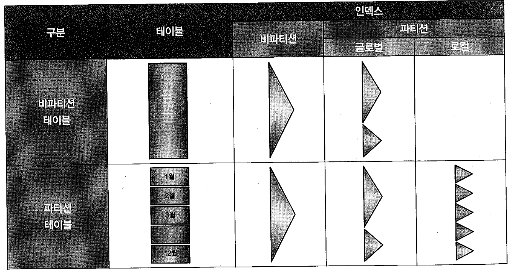
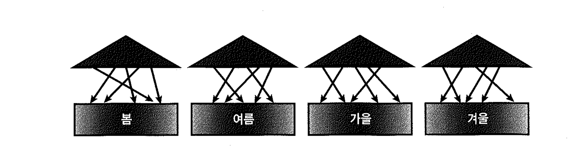
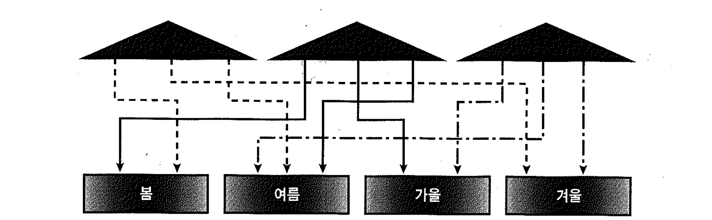
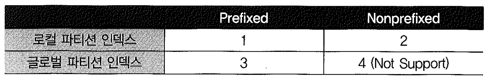
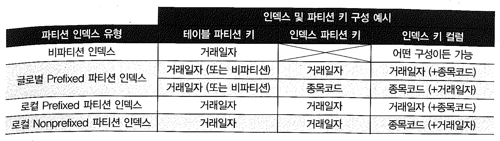
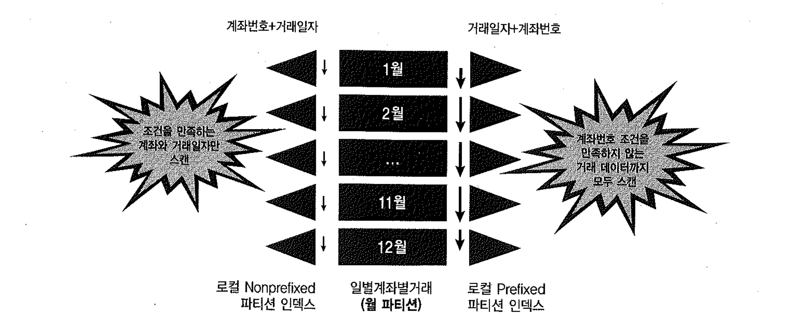
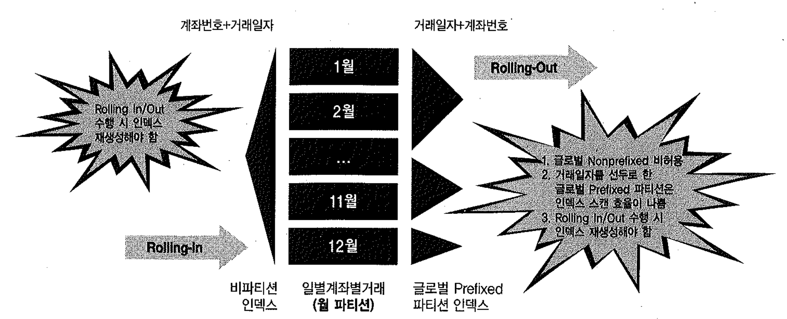
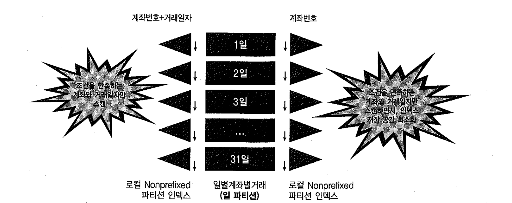

# 03. 인덱스 파티셔닝


## 1) 인덱스 파티션 유형

- 비파티션 인덱스(Non-Partitioned Index)
- 글로벌 파티션 인덱스(Global Partitioned Index)
- 로컬 파티션 인덱스(Local Partitioned Index)



- 비파티션 테이블은 비파티션 인덱스와 글로벌 파티션 인덱스를 가질 수 있다.
- 파티션 테이블은 비파티션 인덱스, 글로벌 파티션 인덱스, 로컬 파티션 인덱스를 가질 수 있다.
- 비파티션 테이블에 대한 비트맵 인덱스는 파티셔닝이 허용되지 않고, 파티션 테이블에 대한 비트맵 인덱스는 로컬 파티셔닝만 허용한다.


## 2) 로컬 파티션 인덱스



- 각 인덱스 파티션이 테이블 파티션과 1:1 대응 관계를 가지며, 테이블 파티션 속성을 그대로 상속받는다. (p.659 그림 6-8 참고)
- 파티션 키를 사용자가 따로 정의하지 않아도 오라클이 자동으로 관리
- 테이블 파티션과 1:1 관계가 되도록 사용자가 수동으로 인덱스 파티션을 구성하더라도 이를 로컬 파티션 인덱스라고 부르지 않는다.
- 테이블이 결합 파티셔닝 돼 있다면 인덱스도 같은 단위로 파티셔닝
- 테이블 파티션 구성에 변경이 생기더라도 인덱스를 재생성할 필요가 없다.


## 3) 비파티션 인덱스


- 파티셔닝하지 않은 인덱스
- 1:M 관계
- 하나의 인덱스 세그먼트가 여러 테이블 파티션 세그먼트와 관계
- `글로벌 비파티션 인덱스`라 부르기도 한다.


## 4) 글로벌 파티션 인덱스




- 테이블 파티션과 독립적인 구성을 갖도록 파티셔닝하는 것.
- 테이블은 파티셔닝돼 있지 않을 수도 있다.
- 기준 테이블의 파티션 구성에 변경(drop, exchange, split등)이 생길 때마다 인덱스가 unusable 상태로 바뀌고 그때마다 인덱스를 재생성해야 한다. (비파티션 인덱스일 때도 동일)
- 9i부터 update global indexes 옵션을 주면 파티션 DDL 작업에 의해 영향을 받는 인덱스 레코드를 자동으로 갱신해 준다. (unusable 상태로 빠지지 않는다)

```sql
alter table ...
split partition ...
update global indexes;

- 파티션 DDL로 인해 영향 받는 레코드가 전체의 5% 미만일 때만 유용
```

**테이블 파티션과의 관계**

- "오라클이 자동으로 관리해 주는 1:1 관계"가 아닌 파티션 인덱스는 모두 글로벌 파티션 인덱스
- 하나의 인덱스 파티션이 여러 테이블 파티션과 관계를 갖고, 반대로 하나의 테이블 파티션이 여러 인덱스 파티션과 관계를 갖는다.
- 로컬 파티션 인덱스처럼 테이블과 1:1 관계가 되도록 수동으로 구성하더라도 글로벌 파티션과 마찬가지로 기준 테이블 구성에 변경이 발생할 때마다 인덱스를 재생성해야 한다.
- 인덱스를 테이블 파티션과 다른 키 컬럼으로 글로벌 파티셔닝(테이블은 주문일자, 인덱스는 배송일자)할 수도 있는데, 이때는 테이블 파티션과 인덱스 파티션 간에는 항상 M:M 관계가 형성.

**글로벌 해지 파티션 인덱스**

- 9i까지는 글로벌 Range 파티션만 가능
- 10g부터는 글로벌 해시 파티션도 가능.
- 테이블과 독립적으로 인덱스만 해시 키 값에 따라 파티셔닝할 수 있다.
- 글로벌 해시 파티션 인덱스는 Right Growing 인덱스처러 Hot 블록이 발생하는 인덱스의 경합을 분산할 목적으로 주로 사용
- 글로벌 결합 인덱스 파티셔닝은 여전히 불가능


## 5) Prefixed vs. Nonprefixed



- 인덱스 파티션 키 컬럼이 인덱스 구성상 왼쪽 선두 컬럼에 위치하는지에 따른 구분
- Prefixed : 파티션 인덱스를 생성할 때, 파티션 키 컬럼을 인덱스 키 컬럼 왼쪽 선두에 두는 것
- Nonprefixed : 파티션 인덱스를 생성할 때, 파티션 키 컬럼을 인덱스 키 컬럼 왼쪽 선두에 주지 않는 것. 파티션 키가 인덱스 컬럼에 아예 속하지 않을 때도 여기에 속한다.
- 글로벌 파티션 인덱스는 Prefixed 파티션만 지원
- 인덱스 유형
  - 비파티션 인덱스
  - 글로벌 Prefixed 파티션 인덱스
  - 로컬 Prefixed 파티션 인덱스
  - 로컬 Nonprefixed 파티션 인덱스


## 6) 파티션 인덱스 구성 예시




**인덱스 파티셔닝 예**

```sql


 create table t ( gubun
    , seq, seq_name, seq_cls
    , seq2, seq2_name, seq2_cls
)
 partition by range(seq) (
 partition p1 values less than(100)
 , partition p2 values less than(200)
, partition p3 values less than(300)
 , partition p4 values less than(maxvalue)
)
 as
select 1
   , rownum, dbms_random.string('u', 10), 'A'
    , round(dbms_random.value(1, 400)), dbms_random.string('l', 10), 'B'
from   dual
connect by level <= 400 ;

테이블이 생성되었습니다. 
-- seq 컬럼 기준으로 Range 파티셔닝


create unique index t_idx1 on t(gubun, seq2) LOCAL ;
create unique index t_idx1 on t(gubun, seq2) LOCAL
                              *
1행에 오류:
ORA-14039: 열을 분할영역한 것은 UNIQUE 인덱스로 키 열의 부분 집합을 폼 합니다
- Unique 파티션 인덱스를 만들 때는 파티션 키 컬럼이 인덱스 컬럼에 포함돼 있어야 한다.


 create unique index t_idx1 on t(gubun, seq2) ;


-- 비파티션 인덱스를 만들 때는 그런 제약이 없다.

create unique index t_idx2 on t(gubun, seq) LOCAL ;


-- 파티션 키를 인덱스 구성 컬럼에 포함시켜 unique 인덱스 생성

create index t_idx3 on t(seq, gubun) LOCAL ;


-- 로컬 prefixed 파티션 인덱스 생성

create index t_idx4 on t(seq_name, seq) LOCAL ;


-- 로컬 Nonprefixed 파티션 인덱스 생성


create index t_idx5 on t(seq_cls, seq) GLOBAL
partition by range(seq) (
  partition p1 values less than(100)
, partition p2 values less than(200)
 , partition p3 values less than(300)
, partition p4 values less than(maxvalue)
)
;
partition by range(seq) (
                      *
2행에 오류:
ORA-14038: GLOBAL로 분할영역된 인덱스는 접두사이어야 합니다
- 글로벌 파티션 인덱스에는 Nonprefixed 인덱스가 허용되지 않는다.


create index t_idx5 on t(seq, seq_cls) GLOBAL
partition by range(seq) (
  partition p1 values less than(100)
 , partition p2 values less than(200)
 , partition p3 values less than(300)
  , partition p4 values less than(maxvalue)
 ) ;

인덱스가 생성되었습니다.
-- 글로벌 Prefixed 파티션 인덱스 생성
-- 테이블 파티션과 100% 같게 정의하더라도 이를 '로컬 파티션 인덱스'라고 부르지 않는다.


create index t_idx6 on t(seq, seq_name) GLOBAL
partition by range(seq) (
  partition p1 values less than(200)
 , partition p2 values less than(maxvalue)
) ;


-- 각 인덱스 파티션이 두 개 테이블 파티션과 매핑


create index t_idx7 on t(seq, seq_name, seq_cls) GLOBAL
partition by range(seq) (
 partition p1 values less than(50)
, partition p2 values less than(100)
, partition p3 values less than(150)
, partition p4 values less than(200)
, partition p5 values less than(250)
, partition p6 values less than(300)
, partition p7 values less than(350)
, partition p8 values less than(maxvalue)
 ) ;


-- 두 개 인덱스 파티션이 한 개 테이블 파티션과 매핑되는 구조


 create index t_idx8 on t(seq2) GLOBAL
partition by range(seq2) (
  partition p1 values less than(100)
 , partition p2 values less than(200)
 , partition p3 values less than(300)
 , partition p4 values less than(maxvalue)
 ) ;


-- 테이블과 다른 컬럼으로 파티셔닝할 때는 항상 M:M 관계 형성

 select i.index_name, i.uniqueness, p.locality
     , p.alignment, i.partitioned, p.partition_count
from   user_indexes i, user_part_indexes p
 where  i.table_name = 'T'
and    p.table_name(+) = i.table_name
and    p.index_name(+) = i.index_name
order by 1 ;

INDEX_NAME                     UNIQUENES LOCALI ALIGNMENT    PAR PARTITION_COUNT
------------------------------ --------- ------ ------------ --- ---------------
T_IDX1                         UNIQUE                        NO
T_IDX2                         UNIQUE    LOCAL  NON_PREFIXED YES               4
T_IDX3                         NONUNIQUE LOCAL  PREFIXED     YES               4
T_IDX4                         NONUNIQUE LOCAL  NON_PREFIXED YES               4
T_IDX5                         NONUNIQUE GLOBAL PREFIXED     YES               4
T_IDX6                         NONUNIQUE GLOBAL PREFIXED     YES               2
T_IDX7                         NONUNIQUE GLOBAL PREFIXED     YES               8
T_IDX8                         NONUNIQUE GLOBAL PREFIXED     YES               4

8 개의 행이 선택되었습니다. 
```


## 7) 글로벌 파이션 인덱스의 효용성

- 글로벌 파티션 인덱스는 경합을 분산시키려고 글로벌 해시 파티셔닝하는 경우외에는 거의 사용하지 않는 실정이다.
- 테이블을 파티셔닝하지 않을 정도로 중소형급 테이블이면 굳이 인덱스만을 따로 파티셔닝 할 이유는 없다.

- 파티션 테이블에 대한 글로벌 파티션 인덱스'의 효용성

  - 1) 테이블과 같은 컬럼으로 파티셔닝하는 경우

    - 테이블은 날짜 컬럼 기준으로 월별 파티셔닝하고, 인덱스는 분기별 파티셔닝하는 경우
    - 글로벌 파티션 인덱스에는 Prefixed 파티션만 허용되므로 날짜 컬럼을 선두로 둬야 한다.
    - 날짜 조건은 대개 범위검색 조건이 사용되므로 인덱스 스캔 효율 면에서 불리하다.
    - NL 조인에서 Inner 테이블 액세스를 위해 자주 사용되는 인덱스라면 비효율이 더 크게 작용.
    - 다른 '=' 조건 컬럼을 선두에 둘 수 있다는 측면에선 로컬 Nonprefixed 파티션 인덱스가 유리
    - 두 달 이상의 넓은 범위 조건을 가지고 Inner 테이블 액세스를 위해 사용될 때는 로컬 Nonprefixed 파티션 인덱스에도 비효율이 발생(조인 액세스가 일어나는 레코드마다 여러 인덱스 파티션을 탐색해야 하기 때문)
    - NL 조인에서 넓은 범위 조건을 가지고 Inner 테이블 액세스를 위해 자주 사용된다면 비파티션 인덱스가 가장 좋은 선택.

- - 2) 테이블과 다른 컬럼으로 파티셔닝하는 경우

    - 테이블 파티션 기준인 날짜 이외 컬럼으로 인덱스를 글로벌 파티셔닝 할 수 있는데, 그런 구성은 대개 인덱스를 적정 크기로 유지하려는 데에 목적.
    - 로컬 파티션 인덱스 때문에 무색해진다.


## 8) 로컬 Nonprefixed 파티션 인덱스의 효율성

- 로컬 Nonprefixed 파티션 인덱스는 이력성 데이터를 효과적으로 관리할 수 있게 해 주고, 인덱스 스캔 효율성을 높이는 데에도 유리.

- - 로컬 Prefixed 파티션 인덱스와 비교* (p.699 그림 6-11 참고)
  - 로컬 Prefixed 파티션 인덱스는 계좌번호 조건을 만족하지 않는 거래 데이터까지 모두 스캔
  - 로컬 Nonprefixed 파티션 인득스는 각 인덱스 파티션마다 필요한 최소 범위만 스캔.

```sql
create table 일별계좌별거래 (
  계좌번호 number
, 거래일자 date
, 거래량   number
, 거래금액 number
)
partition by range(거래일자)(
  partition p01 values less than(to_date('20090201', 'yyyymmdd'))
, partition p02 values less than(to_date('20090301', 'yyyymmdd'))
, partition p03 values less than(to_date('20090401', 'yyyymmdd'))
, partition p04 values less than(to_date('20090501', 'yyyymmdd'))
, partition p05 values less than(to_date('20090601', 'yyyymmdd'))
, partition p06 values less than(to_date('20090701', 'yyyymmdd'))
, partition p07 values less than(to_date('20090801', 'yyyymmdd'))
, partition p08 values less than(to_date('20090901', 'yyyymmdd'))
, partition p09 values less than(to_date('20091001', 'yyyymmdd'))
, partition p10 values less than(to_date('20091101', 'yyyymmdd'))
, partition p11 values less than(to_date('20091201', 'yyyymmdd'))
, partition p12 values less than(maxvalue)
) ;

declare
 l_first_date date;
 l_last_day number;
begin
  for i in 1..12
  loop
    l_first_date := to_date('2009' || lpad(i, 2, '0') || '01', 'yyyymmdd');
    l_last_day := to_number(to_char(last_day(l_first_date), 'dd'));
    insert into 일별계좌별거래
    select rownum 계좌번호
         , l_first_date + mod(rownum, l_last_day) 거래일자
         , round(dbms_random.value(100, 10000)) 거래량
         , round(dbms_random.value(10000, 1000000)) 거래금액
    from   dual
    connect by level <= 10000;
  end loop;
end;
/

create index local_prefix_index on 일별계좌별거래(거래일자, 계좌번호) local;

create index local_nonprefix_index on 일별계좌별거래(계좌번호, 거래일자) local;

select /*+ index(t local_prefix_index) */ sum(거래량), sum(거래금액)
from   일별계좌별거래 t
where  계좌번호 = 100
and    거래일자 between to_date('20090115', 'yyyymmdd')
                and     to_date('20091215', 'yyyymmdd')
;
Call     Count CPU Time Elapsed Time       Disk      Query    Current       Rows
------- ------ -------- ------------ ---------- ---------- ---------- ----------
Parse        1    0.000        0.000          0          0          0          0
Execute      1    0.000        0.000          0          0          0          0
Fetch        2    0.016        0.023          0        387          0          1
------- ------ -------- ------------ ---------- ---------- ---------- ----------
Total        4    0.016        0.023          0        387          0          1

Misses in library cache during parse: 0
Optimizer goal: ALL_ROWS
Parsing user: KJWON (ID=64)

Rows     Row Source Operation
-------  ---------------------------------------------------
      0  STATEMENT
      1   SORT AGGREGATE (cr=387 pr=0 pw=0 time=22846 us)
     11    PARTITION RANGE ALL PARTITION: 1 12 (cr=387 pr=0 pw=0 time=16366 us)
     11     TABLE ACCESS BY LOCAL INDEX ROWID 일별계좌별거래 PARTITION: 1 12 (cr=387 pr=0 pw=0 time=22704 us)
     11      INDEX RANGE SCAN LOCAL_PREFIX_INDEX PARTITION: 1 12 (cr=376 pr=0 pw=0 time=8009 us)(Object ID 52990)

select /*+ index(t local_nonprefix_index) */ sum(거래량), sum(거래금액)
from   일별계좌별거래 t
where  계좌번호 = 100
and    거래일자 between to_date('20090115', 'yyyymmdd')
                and     to_date('20091215', 'yyyymmdd')
;
Call     Count CPU Time Elapsed Time       Disk      Query    Current       Rows
------- ------ -------- ------------ ---------- ---------- ---------- ----------
Parse        1    0.000        0.000          0          0          0          0
Execute      1    0.000        0.000          0          0          0          0
Fetch        2    0.000        0.001          0         35          0          1
------- ------ -------- ------------ ---------- ---------- ---------- ----------
Total        4    0.000        0.001          0         35          0          1

Misses in library cache during parse: 0
Optimizer goal: ALL_ROWS
Parsing user: KJWON (ID=64)

Rows     Row Source Operation
-------  ---------------------------------------------------
      0  STATEMENT
      1   SORT AGGREGATE (cr=35 pr=0 pw=0 time=544 us)
     11    PARTITION RANGE ALL PARTITION: 1 12 (cr=35 pr=0 pw=0 time=532 us)
     11     TABLE ACCESS BY LOCAL INDEX ROWID 일별계좌별거래 PARTITION: 1 12 (cr=35 pr=0 pw=0 time=433 us)
     11      INDEX RANGE SCAN LOCAL_NONPREFIX_INDEX PARTITION: 1 12 (cr=24 pr=0 pw=0 time=232 us)(Object ID 53003)
```

- - 글로벌 Prefixed 파티션 인덱스와 비교
  - Prefixed 파티션만 혀용되므로 로컬 Prefixed 파티션과 마찬가지로 인덱스 스캔 효율이 나쁘다.
  - 파티션 단위 작업 시 매번 인덱스를 재생성해야 하므로 관리적 부담.

- - 비파티션 인덱스와 비교
  - 관리적 부담은 글로벌 파티션과 동일
  - 로컬 Nonprefixed 파티션 인덱스는, 두 달 이상의 걸친 넓은 범위의 거래일자 조건으로 조회할 때 여러 인덱스를 (수직적) 탐색해야 하는 비효율이 있다.
  - 비파티션 인덱스는 여러 달에 걸친 거래일자로 조회하더라도 인덱스 스캔 상 비효율은 없다.
  - 아주 넓은 범위의 거래일자로 조회하거나 계좌번호만으로 조회 할 때는 테이블 Random 액세스 부하 발생.
  - 로컬 Nonprefixed 파티션 인덱스는 여러 병렬 프로세스가 각각 하나의 인덱스 세그먼트를 스캔하도록 함으로써 응답속도를 향상시킬 수 있다.

- - 일 단위 파티셔닝
  - 테이블이 일파티션되어 있다면, 계좌번호만으로 로컬 Nonprefixed 파티션 인덱스를 생성함으로써 인덱스 저장 공간을 줄이는 효과를 얻을 수 있다. 
  - 

```sql
select 계좌번호, count(*)
from 일별계좌별집계
where 거래일자 between '20090101' and '20090115'
group by 계좌번호;

- 계좌번호만으로 인덱스를 생성하면 거래일자를 읽기 위한 테이블 액세스가 발생하므로 불리
```


#### 글로벌 파티션 인덱스의 효용성

- 글로벌 파티션 인덱스는 경합을 분산시키려고 글로벌 해시 파티셔닝하는 경우외에는 거의 사용하지 않는 실정이다.
- 테이블을 파티셔닝하지 않을 정도로 중소형급 테이블이면 굳이 인덱스만을 따로 파티셔닝 할 이유는 없다.

- 파티션 테이블에 대한 글로벌 파티션 인덱스'의 효용성

  - 1) 테이블과 같은 컬럼으로 파티셔닝하는 경우

    - 테이블은 날짜 컬럼 기준으로 월별 파티셔닝하고, 인덱스는 분기별 파티셔닝하는 경우
    - 글로벌 파티션 인덱스에는 Prefixed 파티션만 허용되므로 날짜 컬럼을 선두로 둬야 한다.
    - 날짜 조건은 대개 범위검색 조건이 사용되므로 인덱스 스캔 효율 면에서 불리하다.
    - NL 조인에서 Inner 테이블 액세스를 위해 자주 사용되는 인덱스라면 비효율이 더 크게 작용.
    - 다른 '=' 조건 컬럼을 선두에 둘 수 있다는 측면에선 로컬 Nonprefixed 파티션 인덱스가 유리
    - 두 달 이상의 넓은 범위 조건을 가지고 Inner 테이블 액세스를 위해 사용될 때는 로컬 Nonprefixed 파티션 인덱스에도 비효율이 발생(조인 액세스가 일어나는 레코드마다 여러 인덱스 파티션을 탐색해야 하기 때문)
    - NL 조인에서 넓은 범위 조건을 가지고 Inner 테이블 액세스를 위해 자주 사용된다면 비파티션 인덱스가 가장 좋은 선택.

- - 테이블과 다른 컬럼으로 파티셔닝하는 경우
    - 테이블 파티션 기준인 날짜 이외 컬럼으로 인덱스를 글로벌 파티셔닝 할 수 있는데, 그런 구성은 대개 인덱스를 적정 크기로 유지하려는 데에 목적.
    - 로컬 파티션 인덱스 때문에 무색해진다.

**로컬 Nonprefixed 파티션 인덱스의 효율성**

- 로컬 Nonprefixed 파티션 인덱스는 이력성 데이터를 효과적으로 관리할 수 있게 해 주고, 인덱스 스캔 효율성을 높이는 데에도 유리.

- 로컬 Prefixed 파티션 인덱스와 비교
  - 로컬 Prefixed 파티션 인덱스는 계좌번호 조건을 만족하지 않는 거래 데이터까지 모두 스캔
  - 로컬 Nonprefixed 파티션 인득스는 각 인덱스 파티션마다 필요한 최소 범위만 스캔.
  - 

- 글로벌 Prefixed 파티션 인덱스와 비교
  - Prefixed 파티션만 혀용되므로 로컬 Prefixed 파티션과 마찬가지로 인덱스 스캔 효율이 나쁘다.
  - 파티션 단위 작업 시 매번 인덱스를 재생성해야 하므로 관리적 부담.

- 비파티션 인덱스와 비교
  - 관리적 부담은 글로벌 파티션과 동일
  - 로컬 Nonprefixed 파티션 인덱스는, 두 달 이상의 걸친 넓은 범위의 거래일자 조건으로 조회할 때 여러 인덱스를 (수직적) 탐색해야 하는 비효율이 있다.
  - 비파티션 인덱스는 여러 달에 걸친 거래일자로 조회하더라도 인덱스 스캔 상 비효율은 없다.
  - 아주 넓은 범위의 거래일자로 조회하거나 계좌번호만으로 조회 할 때는 테이블 Random 액세스 부하 발생.
  - 로컬 Nonprefixed 파티션 인덱스는 여러 병렬 프로세스가 각각 하나의 인덱스 세그먼트를 스캔하도록 함으로써 응답속도를 향상시킬 수 있다.

- 일 단위 파티셔닝
  - 테이블이 일파티션되어 있다면, 계좌번호만으로 로컬 Nonprefixed 파티션 인덱스를 생성함으로써 인덱스 저장 공간을 줄이는 효과를 얻을 수 있다. 
    

```sql
select 계좌번호, count(*)
from 일별계좌별집계
where 거래일자 between '20090101' and '20090115'
group by 계좌번호;

- 계좌번호만으로 인덱스를 생성하면 거래일자를 읽기 위한 테이블 액세스가 발생하므로 불리.
```


## 9) 엑세스 효율을 고려한 인덱스 파티셔닝 선택 기준

**DW성 애플리케이션 환경**

- 날짜 컬럼 기준으로 파티셔닝된 이력성 대용량 테이블이 많다.
- 관리적 측면뿐만 아니라 병렬 쿼리 활용 측면에서도 로컬 파티션 인덱스가 좋은 선택
- 로컬 Nonprefixed 파티션 인덱스가 성능 면에서 유리

**OLTP성 애플리케이션 환경**

- 비파티션 인덱스가 대개 좋은 선택
- 동시 Insert 경합을 분산할 목적으로 해시 파티셔닝하는 경우가 아니라면 글로벌 파티션 인덱스는 효율성이 낮다.
- 테이블이 파티셔닝돼 있다면 인덱스 파티셔닝을 고려
- 파티션 키 컬럼이 검색 조건에서 빠졌을 때
  - 로컬 Nonprefixed 인덱스가 모든 인덱스 파티션을 스캔. 비효율은 있지만 잘 사용됨.
  - 로컬 Prefixed 파티션 인덱스는 사용 않됨.
  - 비효율 문제라면 비파티션 인덱스가 대안.

- 파티션 키 컬럼이 검색 조건으로 사용됐을 때
  - '='조건의 경우 Prefixed 와 Nonprefixed 차이는 없다.
  - 범위검색 조건의 경우 인덱스 스캔면에서 Nonprefixed 파티션이 낫다.

- 파티션 키 컬럼만으로 주로 조회한다면, 로컬 Prefixed 파티션 인덱스 생성.
- 로컬 인덱스를 선택했다면 Prefixed 파티션이든 Nonprefixed 파티션이든 검색 조건에 항상 사용되는 컬럼을 파티션 키로 선정.
- 파티션 키가 범위검색 조건으로 자주 사용된다면 Nonprefixed 인덱스가 유리
- NL 조인에서 파티션 키에 대한 넓은 범위검색 조건을 가지고 Inner 테이블 액세스 용도로 사용된다면 비파티션 인덱스를 사용.


## 10) 인덱스 파티셔닝 제약을 고려한 데이터베이스 설계

- Unique 파티션 인덱스를 정의할 때는 인덱스 파티션 키가 모두 인덱스 구성 컬럼에 포함돼어야 한다.
- 글로벌 파티션 인덱스는 Prefixed 파티션이어야 한다.
- 인덱스를 통해 액세스할 데이터량이 아주 많아 빠른 성능을 내기 어렵고, Full Table Scan으로 처리하기에는 너무 많은 양을 읽어야 할 때 주로 파티셔닝을 실시.
- 파티셔닝은 인덱스 전략 수립과 병행


