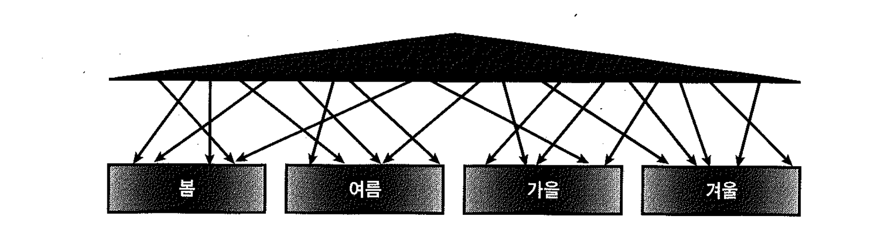

# 03. 인덱스 파티셔닝


## 1) 인덱스 파티션 유형

- 비파티션 인덱스(Non-Partitioned Index)
- 글로벌 파티션 인덱스(Global Partitioned Index)
- 로컬 파티션 인덱스(Local Partitioned Index)


- 비파티션 테이블은 비파티션 인덱스와 글로벌 파티션 인덱스를 가질 수 있다.
- 파티션 테이블은 비파티션 인덱스, 글로벌 파티션 인덱스, 로컬 파티션 인덱스를 가질 수 있다.
- 비파티션 테이블에 대한 비트맵 인덱스는 파티셔닝이 허용되지 않고, 파티션 테이블에 대한 비트맵 인덱스는 로컬 파티셔닝만 허용한다.


## 2) 로컬 파티션 인덱스


- 각 인덱스 파티션이 테이블 파티션과 1:1 대응 관계를 가지며, 테이블 파티션 속성을 그대로 상속받는다. (p.659 그림 6-8 참고)
- 파티션 키를 사용자가 따로 정의하지 않아도 오라클이 자동으로 관리
- 테이블 파티션과 1:1 관계가 되도록 사용자가 수동으로 인덱스 파티션을 구성하더라도 이를 로컬 파티션 인덱스라고 부르지 않는다.
- 테이블이 결합 파티셔닝 돼 있다면 인덱스도 같은 단위로 파티셔닝
- 테이블 파티션 구성에 변경이 생기더라도 인덱스를 재생성할 필요가 없다.


## 3) 비파티션 인덱스




- 파티셔닝하지 않은 인덱스
- 1:M 관계
- 하나의 인덱스 세그먼트가 여러 테이블 파티션 세그먼트와 관계
- `글로벌 비파티션 인덱스`라 부르기도 한다.


## 4) 글로벌 파티션 인덱스


- 테이블 파티션과 독립적인 구성을 갖도록 파티셔닝하는 것.
- 테이블은 파티셔닝돼 있지 않을 수도 있다.
- 기준 테이블의 파티션 구성에 변경(drop, exchange, split등)이 생길 때마다 인덱스가 unusable 상태로 바뀌고 그때마다 인덱스를 재생성해야 한다. (비파티션 인덱스일 때도 동일)
- 9i부터 update global indexes 옵션을 주면 파티션 DDL 작업에 의해 영향을 받는 인덱스 레코드를 자동으로 갱신해 준다. (unusable 상태로 빠지지 않는다)

```sql
alter table ...
split partition ...
update global indexes;

- 파티션 DDL로 인해 영향 받는 레코드가 전체의 5% 미만일 때만 유용
```

**테이블 파티션과의 관계**

- "오라클이 자동으로 관리해 주는 1:1 관계"가 아닌 파티션 인덱스는 모두 글로벌 파티션 인덱스
- 하나의 인덱스 파티션이 여러 테이블 파티션과 관계를 갖고, 반대로 하나의 테이블 파티션이 여러 인덱스 파티션과 관계를 갖는다.
- 로컬 파티션 인덱스처럼 테이블과 1:1 관계가 되도록 수동으로 구성하더라도 글로벌 파티션과 마찬가지로 기준 테이블 구성에 변경이 발생할 때마다 인덱스를 재생성해야 한다.
- 인덱스를 테이블 파티션과 다른 키 컬럼으로 글로벌 파티셔닝(테이블은 주문일자, 인덱스는 배송일자)할 수도 있는데, 이때는 테이블 파티션과 인덱스 파티션 간에는 항상 M:M 관계가 형성.

**글로벌 해지 파티션 인덱스**

- 9i까지는 글로벌 Range 파티션만 가능
- 10g부터는 글로벌 해시 파티션도 가능.
- 테이블과 독립적으로 인덱스만 해시 키 값에 따라 파티셔닝할 수 있다.
- 글로벌 해시 파티션 인덱스는 Right Growing 인덱스처러 Hot 블록이 발생하는 인덱스의 경합을 분산할 목적으로 주로 사용
- 글로벌 결합 인덱스 파티셔닝은 여전히 불가능


## 5) Prefixed vs. Nonprefixed


- 인덱스 파티션 키 컬럼이 인덱스 구성상 왼쪽 선두 컬럼에 위치하는지에 따른 구분
- Prefixed : 파티션 인덱스를 생성할 때, 파티션 키 컬럼을 인덱스 키 컬럼 왼쪽 선두에 두는 것
- Nonprefixed : 파티션 인덱스를 생성할 때, 파티션 키 컬럼을 인덱스 키 컬럼 왼쪽 선두에 주지 않는 것. 파티션 키가 인덱스 컬럼에 아예 속하지 않을 때도 여기에 속한다.
- 글로벌 파티션 인덱스는 Prefixed 파티션만 지원
- 인덱스 유형
  - 비파티션 인덱스
  - 글로벌 Prefixed 파티션 인덱스
  - 로컬 Prefixed 파티션 인덱스
  - 로컬 Nonprefixed 파티션 인덱스