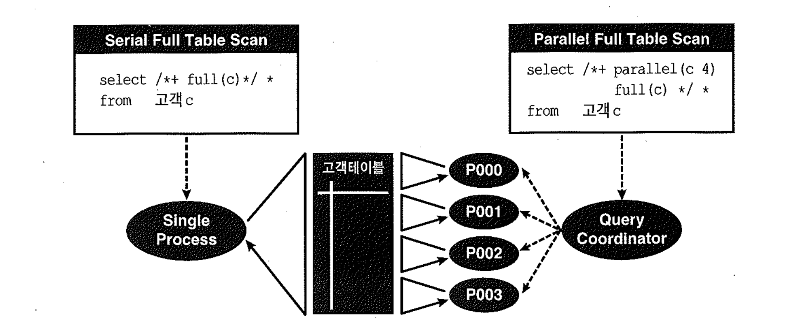

# 01-기본개념


**병렬처리**

- SQL문이 수행해야 할 작업범위를 여러개의 작은 단위로 나누어 여러 프로세스(또는 쓰레드)가 동시에 처리하는 것을 말한다.
- 여러 프로세스가 동시에 작업하므로 대용량 데이터를 처리할 때 수행속도를 극적으로 단축시킬 수 있다.





## 1) Query Coordinator와 병렬 서버 프로세스

- Query Coordinator(QC) : 병렬 SQL문을 발생한 세션
- 병렬 서버 프로세스 : 실제 작업을 수행하는 개별 세션


**병렬처리 수행 과정 및 QC의 역할**

- 1. 병렬 SQL이 시작되면 QC는 사용자가 지정한 병렬도(DOP, Degree Of Parallelism)와 오퍼레이션 종류에 따라 하나 또는 두개의 병렬 서버집합(Server Set)을 할당한다. 우선 서버풀(Parallel Execution Server Pool)로부터 필요한 만큼 서버 프로세스를 확보하고, 부족분은 새로 생성한다.

  - parallel_min_servers 파라미터로 설정된 수만큼의 병렬프로세스를 오라클이 기본적으로 생성해 서버풀에 담아 둔다.
  - parallel_max_servers 파라미터에 의해 생성가능한 최대 병렬서버 갯수가 결정된다.

- 2. QC는 각 병렬서버에게 작업을 할당한다. 작업을 지시하고 일이 잘 진행되는지 관리,감독하는 작업반장의 역할이다.

- 3. 병렬로 처리하도록 사용자가 지시하지 않은 테이블은 QC가 직접 처리한다. 예를 들어, 아래와 같은 실행계획에서 dept테이블을 직렬로 읽어 병렬서버에 전송하는 8~9번 오퍼레이션은 QC의 몫이다.

- 4. QC는 각 병렬서버로부터의 산출물을 통합하는 작업을 수행한다. 예를 들어 집계함수(sum, avg, min, max 등)가 사용된 아래와 같은 병렬쿼리를 수행할 때, 각 병렬서버가 자신의 처리범위 내에서 집계(4번 단계)한 값을 QC에게 전송(3번 단계)하면 QC가 최종 집계 작업을 수행(1번 단계)한다.

- 5. QC는 쿼리의 최종 결과집합을 사용자에게 전송하며, DML일때는 갱신건수를 집계해서 전송해 준다. 쿼리결과를 전송하는 단계에서 수행되는 스칼라서브쿼리도 QC가 수행한다.


- 병렬 처리가 전혀 발생하지 않더라도 parallel_min_servers에 지정된 최소 개수를 유지 한다고 함.
- 확인결과 parallel_min_servers 의값은 0 이였음.

```sql
-- Release 10.2.0.2.0
SYS@oraSub3 AS SYSDBA> show parameter parallel

NAME                                 TYPE                   VALUE
------------------------------------ ---------------------- ------------------------------
fast_start_parallel_rollback         string                 LOW
parallel_adaptive_multi_user         boolean                TRUE
parallel_automatic_tuning            boolean                FALSE
parallel_execution_message_size      integer                2148
parallel_instance_group              string
parallel_max_servers                 integer                40
parallel_min_percent                 integer                0
parallel_min_servers                 integer                0
parallel_server                      boolean                FALSE             -- Deprecated
parallel_server_instances            integer                1                 -- Deprecated
parallel_threads_per_cpu             integer                2
recovery_parallelism                 integer                0


-- Release 11.2.0.1.0
SQL> show parameter parallel

NAME                                 TYPE                   VALUE
------------------------------------ ---------------------- ------------------------------
fast_start_parallel_rollback         string                 LOW
parallel_adaptive_multi_user         boolean                TRUE
parallel_automatic_tuning            boolean                FALSE
parallel_degree_limit                string                 CPU
parallel_degree_policy               string                 MANUAL
parallel_execution_message_size      integer                16384
parallel_force_local                 boolean                FALSE
parallel_instance_group              string
parallel_io_cap_enabled              boolean                FALSE         -- Deprecated
parallel_max_servers                 integer                20
parallel_min_percent                 integer                0
parallel_min_servers                 integer                0
parallel_min_time_threshold          string                 AUTO
parallel_server                      boolean                FALSE         -- Deprecated
parallel_server_instances            integer                1             -- Deprecated
parallel_servers_target              integer                8
parallel_threads_per_cpu             integer                2
recovery_parallelism                 integer                0
```


**병렬처리 실행 예제**

```sql
SET AUTOT ON

SELECT /*+ ordered use_hash(d) full(d) full(e) noparallel(d) parallel(e 4) */
       COUNT(*)
     , MIN(sal)
     , MAX(sal)
     , AVG(sal)
     , SUM(sal)
  FROM dept d, emp e
 WHERE d.loc = 'CHICAGO'
   AND e.deptno = d.deptno
;

Execution Plan
----------------------------------------------------------
Plan hash value: 321505112

-------------------------------------------------------------------------------------------------------------------
| Id  | Operation                 | Name     | Rows  | Bytes | Cost (%CPU)| Time     |    TQ  |IN-OUT| PQ Distrib |
-------------------------------------------------------------------------------------------------------------------
|   0 | SELECT STATEMENT          |          |     1 |    47 |     6  (17)| 00:00:01 |        |      |            |
|   1 |  SORT AGGREGATE           |          |     1 |    47 |            |          |        |      |            |
|   2 |   PX COORDINATOR          |          |       |       |            |          |        |      |            |
|   3 |    PX SEND QC (RANDOM)    | :TQ10002 |     1 |    47 |            |          |  Q1,02 | P->S | QC (RAND)  |
|   4 |     SORT AGGREGATE        |          |     1 |    47 |            |          |  Q1,02 | PCWP |            |
|*  5 |      HASH JOIN            |          |     5 |   235 |     6  (17)| 00:00:01 |  Q1,02 | PCWP |            |
|   6 |       BUFFER SORT         |          |       |       |            |          |  Q1,02 | PCWC |            |
|   7 |        PX RECEIVE         |          |     1 |    21 |     3   (0)| 00:00:01 |  Q1,02 | PCWP |            |
|   8 |         PX SEND HASH      | :TQ10000 |     1 |    21 |     3   (0)| 00:00:01 |        | S->P | HASH       |
|*  9 |          TABLE ACCESS FULL| DEPT     |     1 |    21 |     3   (0)| 00:00:01 |        |      |            |
|  10 |       PX RECEIVE          |          |    14 |   364 |     2   (0)| 00:00:01 |  Q1,02 | PCWP |            |
|  11 |        PX SEND HASH       | :TQ10001 |    14 |   364 |     2   (0)| 00:00:01 |  Q1,01 | P->P | HASH       |
|  12 |         PX BLOCK ITERATOR |          |    14 |   364 |     2   (0)| 00:00:01 |  Q1,01 | PCWC |            |
|  13 |          TABLE ACCESS FULL| EMP      |    14 |   364 |     2   (0)| 00:00:01 |  Q1,01 | PCWP |            |
-------------------------------------------------------------------------------------------------------------------

Predicate Information (identified by operation id):
---------------------------------------------------

   5 - access("E"."DEPTNO"="D"."DEPTNO")
   9 - filter("D"."LOC"='CHICAGO')

Note
-----
   - dynamic sampling used for this statement


Statistics
----------------------------------------------------------
         24  recursive calls
          0  db block gets
          8  consistent gets
          0  physical reads
          0  redo size
        390  bytes sent via SQL*Net to client
        239  bytes received via SQL*Net from client
          2  SQL*Net roundtrips to/from client
          5  sorts (memory)
          0  sorts (disk)
          1  rows processed
```


## 2) Intra-Operation Parallelism 과 Inter-Operation Parallelism

**Order By를 포함하는 병렬처리 실행 예제**

```sql
SELECT /*+ full(고객) parallel(고객 4) */ *
  FROM 고객
 ORDER BY 고객명
;
```


- 병렬처리 방법은 아래 두가지 경우로 생각할 수 있는데.
  - 첫번째. 8명이 각각 정렬한후 머지하는 방법
  - 두번째. 2개조로 나누어 1조(4명)은 분배 2조(4명)은 정렬한후 취합하는 방법

- 첫번째 방법은 작업자가 많을수록 나중에 QC가 머지하는 단계에서 부하가 걸려 병렬처리를 극대화하기 어렵다.
- 반면에, 두번째 방법은 이미 각각 정렬된 결과를 머지 작업 없이 그대로 합치기만 하면 된다.
- 오라클은 두번째 방식으로 동작함

- Intra-Operation Parallelism
  - 서로 배타적인 범위를 동시에 처리하는 것
  - 서버집합 내부에서는 서로 데이터를 주고받을 일이 없다.

- Inter-Operation Parallelism
  - 데이터를 분배해서 서버집합2에 데이터 전송
  - 데이터를 정렬하여 QC에 데이터 전송
  - 서버집합간에 항상 통신이 발생한다.


## 3) 테이블 큐

- 테이블 큐(Table Queue) : 쿼리 서버집합 간(P->P) 또는 QC와 서버집합 간(P->S, S->P) 데이터 전송을 위해 연결된 파이프라인(Pipeline).
- 테이블 큐 식별자(TQ Identifier) - :TQ10000, :TQ10001, :TQ10002
- 서리 서버집합 간(P->P) Inter-Operation Parallelism이 발생될때 사용자가 지정한 병렬도(=2)의 배수(4개)만큼 서버프로세스가 필요하다.
- 그림 7-2에서는 병렬도=4이므로 8개의 프로세스가 필요했었다.


| 그림 | DOP(병렬도) | p(병렬프로세스) | :TQ10000(S->P) | :TQ10001(P->P) | :TQ10002(P->S) |
| :--- | :---------- | :-------------- | :------------- | :------------- | :------------- |
| 7-1  | 4           | 4               | 4              | 0              | 4              |
| 7-2  | 4           | 8(4*2)          | 4              | 16(4^2)        | 4              |
| 7-3  | 2           | 4(2*2)          | 2              | 4(2^2)         | 2              |


**Order By 병렬처리 실행 예제**

```sql
SELECT /*+ ordered use_hash(e) full(d) noparallel(d) full(e) parallel(e 2) pq_distribute(e broadcast none) */ *
  FROM dept d, emp e
 WHERE e.deptno = d.deptno
 ORDER BY e.ename
;

Execution Plan
----------------------------------------------------------
Plan hash value: 709482007

--------------------------------------------------------------------------------------------------------------------
| Id  | Operation                  | Name     | Rows  | Bytes | Cost (%CPU)| Time     |    TQ  |IN-OUT| PQ Distrib |
--------------------------------------------------------------------------------------------------------------------
|   0 | SELECT STATEMENT           |          |    14 |  1638 |     7  (29)| 00:00:01 |        |      |            |
|   1 |  PX COORDINATOR            |          |       |       |            |          |        |      |            |
|   2 |   PX SEND QC (ORDER)       | :TQ10002 |    14 |  1638 |     7  (29)| 00:00:01 |  Q1,02 | P->S | QC (ORDER) |
|   3 |    SORT ORDER BY           |          |    14 |  1638 |     7  (29)| 00:00:01 |  Q1,02 | PCWP |            |
|   4 |     PX RECEIVE             |          |    14 |  1638 |     6  (17)| 00:00:01 |  Q1,02 | PCWP |            |
|   5 |      PX SEND RANGE         | :TQ10001 |    14 |  1638 |     6  (17)| 00:00:01 |  Q1,01 | P->P | RANGE      |
|*  6 |       HASH JOIN            |          |    14 |  1638 |     6  (17)| 00:00:01 |  Q1,01 | PCWP |            |
|   7 |        BUFFER SORT         |          |       |       |            |          |  Q1,01 | PCWC |            |
|   8 |         PX RECEIVE         |          |     4 |   120 |     3   (0)| 00:00:01 |  Q1,01 | PCWP |            |
|   9 |          PX SEND BROADCAST | :TQ10000 |     4 |   120 |     3   (0)| 00:00:01 |        | S->P | BROADCAST  |
|  10 |           TABLE ACCESS FULL| DEPT     |     4 |   120 |     3   (0)| 00:00:01 |        |      |            |
|  11 |        PX BLOCK ITERATOR   |          |    14 |  1218 |     2   (0)| 00:00:01 |  Q1,01 | PCWC |            |
|  12 |         TABLE ACCESS FULL  | EMP      |    14 |  1218 |     2   (0)| 00:00:01 |  Q1,01 | PCWP |            |
--------------------------------------------------------------------------------------------------------------------

Predicate Information (identified by operation id):
---------------------------------------------------

   6 - access("E"."DEPTNO"="D"."DEPTNO")

Note
-----
   - dynamic sampling used for this statement


Statistics
----------------------------------------------------------
        191  recursive calls
          3  db block gets
         40  consistent gets
          0  physical reads
        632  redo size
       1295  bytes sent via SQL*Net to client
        239  bytes received via SQL*Net from client
          2  SQL*Net roundtrips to/from client
          8  sorts (memory)
          0  sorts (disk)
         14  rows processed
```


##### 생산자 / 소비자 모델

- 테이블 큐에는 항상 생산자(Producer)와 소비자(Customer)가 존재한다.
- 그림 7-3에서 보듯 Inter-Operation Parallelism이 나타날 때, 소비자 서버집합은 From절에 테이블 큐를 참조하는 서브쿼리를 가지고 작업을 수행한다.


##### 병렬 실행계획에서 생산자와 소비자 식별

- 10g 이후 버전부터는 실행계획에 'PX SEND' 및 'PX RECEIVE'가 표시됨.


1. QC가 dept 테이블을 읽어 첫번째 서버집합(Q1,01)에게 전송한다
2. 서버집합(Q1,01)은 emp테이블을 병렬로 읽으면서 QC에게서 받아둔 dept 테이블과 조인한다. 조인에 성공한 레코드는 바로바로 두번째 서버집합(Q1,02)에게 전송한다.
3. 서버집합(Q1,02)은 전송받은 레코드를 정렬하고 나서 QC에게 전송한다.


## 4) IN-OUT 오퍼레이션

| 구분 | 명칭                          | 설명                                                         | (Intra/Inter)-Operation Parallelism | 오퍼레이션 |
| :--- | :---------------------------- | :----------------------------------------------------------- | :---------------------------------- | :--------- |
| S->P | PARALLEL_FROM_SERIAL          | QC가 읽은 데이터를 테이블 큐를 통해 병렬서버 프로세스에게 전송 | X                                   | 직렬       |
| P->S | PARALLEL_TO_SERIAL            | 각 병렬서버 프로세스가 처리한 데이터를 QC에게 전송           | Inter                               | 병렬       |
| P->P | PARALLEL_TO_PARALLEL          | 데이터를 재분배(redistribution)하는 오퍼레이션 데이터를 정렬 또는 그룹핑하거나 조인을 위해 동적으로 파티셔닝할 때 사용 | Inter                               | 병렬       |
| PCWP | PARALLEL_COMBINED_WITH_PARENT | 한 서버집합이 현재스텝과 부모스텝을 모두 처리                | Intra                               | 병렬       |
| PCWC | PARALLEL_COMBINED_WITH_CHILD  | 한 서버집합이 현재스텝과 자식스텝을 모두 처리                | Intra                               | 병렬       |
|      | SERIAL                        | 공백인 경우 SERIAL 방식으로 처리                             | X                                   | 직렬       |


## 5) 데이터 재분배

| 구분        | 내용                                                         |
| :---------- | :----------------------------------------------------------- |
| RANGE       | Order By 또는 Group By 를 병렬로 처리할 때 사용 정렬작업을 맡은 두번째 서버집합의 프로세스마다 처리범위를 지정하고 나서 데이터를 읽는 첫번째 서버집합이 정렬키값에 따라 정해진 범위에 해당하는 두번째 프로세스에게 분배하는 방식 QC는 작업범위를 할당하며, 정렬작업에는 참여하지 않는다. 정렬결과를 순서대로 받아서 사용자에게 전송하는 역할만 담당 |
| HASH        | 조인이나 Hash Group By 를 병렬로 처리할 때 사용 조인 키나 Group By 키값을 해시함수에 적용하여 리턴되는 값에 따라 데이터를 분배 P->P 뿐만 아니라 S->P 방식으로 이루어 질수도 있다. |
| BROADCAST   | QC 또는 첫번째 서버집합의 프로세스들이 각각 읽은 데이터를 두번째 서버집합의 "모든" 병렬프로세스에게 전송하는 방식 병렬 조인에서 크기가 매우 작은 테이블이 있을 때 사용되며 P->P 뿐만 아니라 S->P 방식으로 이루어 진다. 작은 테이블은 병렬로 읽지 않을 때가 많으므로 오히려 S->P가 일반적임 |
| KEY         | 특정 컬럼(들)을 기준으로 테이블 또는 인덱스를 파티셔닝할때 사용하는 분배 방식 실행계획에는 'PARTITION (KEY)'로 표시된다.(줄여서 'PART (KEY)'). |
| ROUND-ROBIN | 파티션키, 정렬키, 해시함수에 의존하지 않고 반대편 정렬 서버에 무작위로 데이터 분배 골고루 분배되도록 ROUND-ROBIN 방식 사용 |


## 6) Granule

- Granule : 데이터를 병렬로 처리할 때 일의 최소 단위

#### 블록 기반 Granule

- 대부분의 병렬 오퍼레이션에 적용되는 기본 작업단위
- 실행계획상의 PX BLOCK ITERATOR
- Granule의 크기와 총갯수는 실행시점에서 오브?트 사이즈와 병렬도에 따라 QC가 동적으로 정한다.

#### 파티션 기반 Granule(= 파티션 Granule)

- 각 병렬 프로세스는 하나의 파티션 전체를 책임진다.(프로세스 하나가 파티션 두개 처리 불가)
- 실행계획상의 PX PARTITION RANGE ALL 또는 PX PARTITION RANGE ITERATOR
- Granule의 갯수가 테이블과 인덱스의 파티션 구조에 의해 정적으로 결정되므로 유영성이 적다.
- 병렬도보다 파티션 갯수가 상당히(대략 병렬도늬 3배 이상) 많을 때라야 유용하다
- 파티션 수보다 많은 병렬도를 지정할 수 없다.


## 7) 병렬 처리 과정에서 발생하는 대기 이벤트

- 병렬 처리 과정에서 자주 발생하는 대기 이벤트 요약

| 이벤트명                    | 클래스 | 설명                                                         |
| :-------------------------- | :----- | :----------------------------------------------------------- |
| PX Deq: Execute Reply       | Idle   | QC가 각 병렬 서버에게 작업을 배분하고서 작업이 완료되기를 기다리는 상태 |
| PX Deq: Execute Msg         | Idle   | 병렬 서버가 자신의 임무를 완수하고서 다른 병렬 서버가 일을 마치기를 기다리는 상태. QC 또는 소비자 병렬 서버에게 데이터 전송을 완료했을 때 나타남. |
| PX Deq: Table Q Normal      | Idle   | 메세지 수신 대기. 메세지 큐에 데이터가 쌓이기를 기다리는 상태. |
| PX Deq Credit: send blkd    | Other  | 메세지 송신 대기. QC 또는 소비자 병렬 서버에게 전송할 데이터가 있는데 블로킹 된 상태. 생산자 프로세스가 메세지 큐를 통해 데이터를 전송하려고 하는데 어떤 이유에서건 소비자 프로세스가 버퍼에서 데이터를 빨리 꺼내가지 않을 때 발생. |
| PX Deq Credit: need bulffer | Idle   | 데이터를 전송하기 전에 상대편 병렬 서버 또는 QC로부터 credit 비트를 얻으려고 대기하는 상태. 오라클 측의 설명(메타링크 문서번호 271767.1)에 의하면 'PX Deq Credit:send blkd'와 'PX Deq Credit: need bulffer'는 거의 같은 대기 이벤트이고, 내부적인 이유로 전자는 로컬 시스템에서 자주 발생하며, 후자는 RAC 시스템에서 자주 발생함. |


### 대기 이벤트 모니터링

```sql
-- SESSION_1 수행
SELECT /*+ ORDERED USE_HASH(D) FULL(D) FULL(E) NOPARALLEL(D) PARALLEL(E 4) */
       COUNT(*),
       MIN(E.SAL),
       MAX(E.SAL),
       AVG(E.SAL),
       SUM(E.SAL)
FROM   DEPT  D,
       T_EMP E
WHERE  D.LOC    = 'CHICAGO'
AND    E.DEPTNO = D.DEPTNO
;

-- SESSION_2 수행
SELECT DECODE(A.QCSERIAL#, NULL, 'PAREMT', 'CHILD') ST_LVL,
       A.SERVER_SET "SET",
       A.SID,
       A.SERIAL#,
       STATUS,
       EVENT,
       WAIT_CLASS
FROM   V$PX_SESSION   A,
       V$SESSION      B
WHERE  A.SID     = B.SID
AND    A.SERIAL# = B.SERIAL#
ORDER  BY A.QCSID,
          ST_LVL DESC,
          A.SERVER_GROUP,
          A.SERVER_SET
;

ST_LVL SET  SID SERIAL# STATUS   EVENT                 WAIT_CLASS
------ --- ---- ------- -------- --------------------- ----------
PAREMT     7634    6110 ACTIVE   PX Deq: Execute Reply Idle
CHILD    1 7647     574 ACTIVE   direct path read      User I/O
CHILD    1 7860    1083 ACTIVE   direct path read      User I/O
CHILD    1 7933   11436 ACTIVE   direct path read      User I/O
CHILD    1 7938    4284 ACTIVE   direct path read      User I/O
CHILD    1 7872    2783 INACTIVE PX Deq: Execution Msg Idle
CHILD    1 7801    2574 INACTIVE PX Deq: Execution Msg Idle
```

- 작업을 처음 시작하면 QC에는 `PX Deq: Execute Reply`이벤트가 보이며, 가장 먼저 작업을 끝낸 병렬 서버로부터 데이터를 받아 클라이언트에게 전송할때는 `SQL*Net Message from client`로 변경됨
- 병렬서버에서 `PX Deq: Execution Msg` 메세지는 작업을 다 마친 의미이며, `direct path read`는 작업이 수행중인 의미임.


### 대기 이벤트 해소

- `v$event_name` 뷰를 조회해 보면 병렬처리와 관련된 대기 이벤트가 대부분 idle로 분류돼 있음.
- 이유는, 이들 이벤트를 회피하기 위해 사용자가 할 수 있는 일들이 거의 없기 때문.

```sql
insert /*+ append */ into t1
select /*+ full(t2) parallel(t2 4) */ * from t2
```

- 여기서 t2 테이블은 병렬로 읽지만 t1으로의 insert는 직렬로 수행되고 있다.
- 이럴 때 t2를 읽어 QC에게 전송하는 4개의 병렬 서버들은 `PX Deq Credit: send blkd` 이벤트에서 자주 대기하게 됨.


- insert 과정에서 병목(direct path write 대기 이벤트 발생)이 생기므로 select 문을 병렬로 수행하는 것은 불필요할 수 있음.
- select 문을 직렬로 처리하면 PX Deq Credit: send blkd 이벤트는 사라짐.

- 병목을 해소함으로써 속도를 향상시키고 싶다면, 아래와 같이 t1으로의 insert도 병렬로 수행되게끔 함.

```sql
alter session enable parallel dml;
insert /*+ append parallel(t1 4) */ into t1
select /*+ full(t2) parallel(t2 4) */ * from t2;
```

- insert를 담당한 1번 병렬 서버 집합은 아래에서 보듯 Direct Path Write를 수행하거나 2번 서버 집합으로부터 메시지 수신을 위해 대기(PX Deq: Table Q Normal 대기 이벤트)하고 있음.


```sql
ST_LVL   SET  SID   SERIAL# STATUS   EVENT                     WAIT_CLASS
------ --- ---- ------- -------- ----------------------------------------
PARENT  QC    2643    46632  ACTIVE    PX Deq: Execute Reply      Idle
CHILD   1     2778     22712  ACTIVE   direct path write          User I/O
CHILD   1     2753    37169   ACTIVE   direct path write          User I/O
CHILD   1     3096     52396  ACTIVE   PX Deq: Table Q Normal    User I/O
CHILD   1     2483     6508    ACTIVE   direct path write           User I/O
CHILD   1     2512     21611   ACTIVE  direct path read            Idle
CHILD   1     2822     38188   ACTIVE  PX Deq Credit: send blkd     Idle
CHILD   1     2492     18064   ACTIVE  direct path read               Idle
CHILD   1     3186     29287   ACTIVE  PX Deq Credit: send blkd     Idle
```

- select를 담당한 2번 병렬 서버 집합은 Direct Path Read를 수행하거나 1번 서버 집합으로 메시지를 송신하기 위해 대기(PX Deq Credit: send blkd) 하고 있음.
