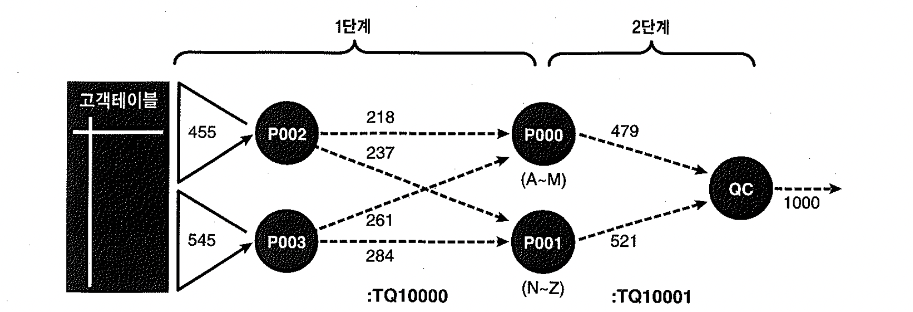
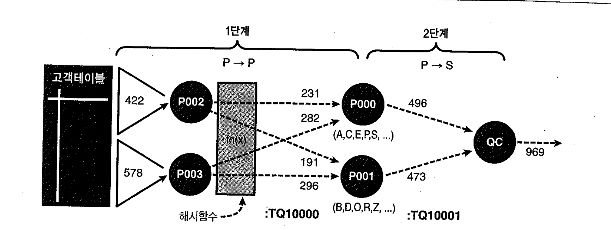
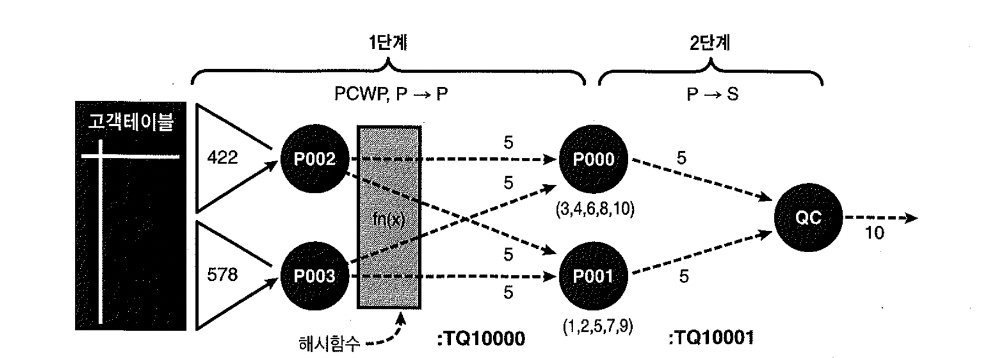

# 02-병렬OrderBy와GroupBy


## 1) 병렬 Order By

```sql
-- 테이블 생성
CREATE TABLE CUSTOMER_XSOFT AS
SELECT ROWNUM CUSTOMER_ID,
       DBMS_RANDOM.STRING('U', 10) CUSTOMER_NAME,
       MOD(ROWNUM, 10) + 1 CUSTOMER_GRADE,
       TO_CHAR(TO_DATE('20090101', 'YYYYMMDD') + (ROWNUM - 1), 'YYYYMMDD') JOIN_DATE
FROM   DUAL
CONNECT BY LEVEL <= 1000
;       

-- 통계정보 생성
BEGIN
  DBMS_STATS.GATHER_TABLE_STATS(USER,
                                'CUSTOMER_XSOFT',
                                CASCADE => TRUE);
END;
/

-- 실행계획
EXPLAIN PLAN FOR
SELECT /*+ FULL(CX) PARALLEL(CX 2) */
       CX.CUSTOMER_ID,
       CX.CUSTOMER_NAME,
       CX.JOIN_DATE
FROM   CUSTOMER_XSOFT CX
ORDER BY CUSTOMER_NAME
;

@xplan
-----------------------------------------------------------------------------------------------------------------------
| Id  | Operation               | Name           | Rows  | Bytes | Cost (%CPU)| Time     |    TQ  |IN-OUT| PQ Distrib |
-----------------------------------------------------------------------------------------------------------------------
|   0 | SELECT STATEMENT        |                |  1000 | 24000 |     3  (34)| 00:00:01 |        |      |            |
|   1 |  PX COORDINATOR         |                |       |       |            |          |        |      |            |
|   2 |   PX SEND QC (ORDER)    | :TQ10001       |  1000 | 24000 |     3  (34)| 00:00:01 |  Q1,01 | P->S | QC (ORDER) |
|   3 |    SORT ORDER BY        |                |  1000 | 24000 |     3  (34)| 00:00:01 |  Q1,01 | PCWP |            |
|   4 |     PX RECEIVE          |                |  1000 | 24000 |     2   (0)| 00:00:01 |  Q1,01 | PCWP |            |
|   5 |      PX SEND RANGE      | :TQ10000       |  1000 | 24000 |     2   (0)| 00:00:01 |  Q1,00 | P->P | RANGE      |
|   6 |       PX BLOCK ITERATOR |                |  1000 | 24000 |     2   (0)| 00:00:01 |  Q1,00 | PCWC |            |
|   7 |        TABLE ACCESS FULL| CUSTOMER_XSOFT |  1000 | 24000 |     2   (0)| 00:00:01 |  Q1,00 | PCWP |            |
-----------------------------------------------------------------------------------------------------------------------

14 rows selected.
```

- 여기서 소개할 내용은 병렬 쿼리를 수행 한 후 1/N이 잘 되었는지 확인할 수 있는 `V$PQ_TQSTAT` 뷰(Parallel Query Table Queue Statistics)의 활용법을 소개한다.
- ORDER BY를 병렬로 수행하려면 테이블 큐를 통한 데이터 재분배가 필요한데, 쿼리 수행이 완료된 직후에 같은 세션에서 V$PQ_TQSTAT를 수행하면 데이터 전송 통계를 볼 수 있다.

```sql
SET SERVERTRACE OFF;

SELECT /*+ FULL(CX) PARALLEL(CX 2) */
       CX.CUSTOMER_ID,
       CX.CUSTOMER_NAME,
       CX.JOIN_DATE
FROM   CUSTOMER_XSOFT CX
ORDER BY CX.CUSTOMER_NAME
;

SELECT TQ_ID,
       SERVER_TYPE,
       PROCESS,
       NUM_ROWS,
       BYTES,
       WAITS
FROM   V$PQ_TQSTAT 
ORDER BY DFO_NUMBER,
         TQ_ID,
         DECODE(SUBSTR(SERVER_TYPE, 1, 4), 'Rang', 1, 'Prod', 2, 'Cons', 3),
         PROCESS
;

TQ_ID SERVER_TYPE PROCESS NUM_ROWS BYTES WAITS
----- ----------- ------- -------- ----- -----
    0 Ranger      QC           182  9808     1
    0 Producer    P002         548 14968     5
    0 Producer    P003         452 12427     3
    0 Consumer    P000         491 13421    88
    0 Consumer    P001         509 13908    89
    1 Producer    P000         491 13394     0
    1 Producer    P001         509 13881     0
    1 Consumer    QC          1000 27275     1 
```



- 병렬 쿼리 수행 속도가 예상만큼 빠르지 않다면 테이블 큐를 통한 데이터 전송량에 편차가 크지 않은지 확인해 볼 필요가 있는데, 이 때 이 뷰를 사용함.

## 2) 병렬 Group By

```sql
EXPLAIN PLAN FOR
SELECT /*+ FULL(CX) PARALLEL(CX 2) */
       CX.CUSTOMER_NAME,
       COUNT(*)
FROM   CUSTOMER_XSOFT CX
GROUP BY CUSTOMER_NAME
;

@xplan
-----------------------------------------------------------------------------------------------------------------------
| Id  | Operation               | Name           | Rows  | Bytes | Cost (%CPU)| Time     |    TQ  |IN-OUT| PQ Distrib |
-----------------------------------------------------------------------------------------------------------------------
|   0 | SELECT STATEMENT        |                |  1000 | 11000 |     3  (34)| 00:00:01 |        |      |            |
|   1 |  PX COORDINATOR         |                |       |       |            |          |        |      |            |
|   2 |   PX SEND QC (RANDOM)   | :TQ10001       |  1000 | 11000 |     3  (34)| 00:00:01 |  Q1,01 | P->S | QC (RAND)  |
|   3 |    HASH GROUP BY        |                |  1000 | 11000 |     3  (34)| 00:00:01 |  Q1,01 | PCWP |            |
|   4 |     PX RECEIVE          |                |  1000 | 11000 |     2   (0)| 00:00:01 |  Q1,01 | PCWP |            |
|   5 |      PX SEND HASH       | :TQ10000       |  1000 | 11000 |     2   (0)| 00:00:01 |  Q1,00 | P->P | HASH       |
|   6 |       PX BLOCK ITERATOR |                |  1000 | 11000 |     2   (0)| 00:00:01 |  Q1,00 | PCWC |            |
|   7 |        TABLE ACCESS FULL| CUSTOMER_XSOFT |  1000 | 11000 |     2   (0)| 00:00:01 |  Q1,00 | PCWP |            |
-----------------------------------------------------------------------------------------------------------------------

14 rows selected.

EXPLAIN PLAN FOR
SELECT /*+ FULL(CX) PARALLEL(CX 2) */
       CX.CUSTOMER_NAME,
       COUNT(*)
FROM   CUSTOMER_XSOFT CX
GROUP BY CX.CUSTOMER_NAME
ORDER BY CX.CUSTOMER_NAME
;

@xplan
-----------------------------------------------------------------------------------------------------------------------
| Id  | Operation               | Name           | Rows  | Bytes | Cost (%CPU)| Time     |    TQ  |IN-OUT| PQ Distrib |
-----------------------------------------------------------------------------------------------------------------------
|   0 | SELECT STATEMENT        |                |  1000 | 11000 |     3  (34)| 00:00:01 |        |      |            |
|   1 |  PX COORDINATOR         |                |       |       |            |          |        |      |            |
|   2 |   PX SEND QC (ORDER)    | :TQ10001       |  1000 | 11000 |     3  (34)| 00:00:01 |  Q1,01 | P->S | QC (ORDER) |
|   3 |    SORT GROUP BY        |                |  1000 | 11000 |     3  (34)| 00:00:01 |  Q1,01 | PCWP |            |
|   4 |     PX RECEIVE          |                |  1000 | 11000 |     2   (0)| 00:00:01 |  Q1,01 | PCWP |            |
|   5 |      PX SEND RANGE      | :TQ10000       |  1000 | 11000 |     2   (0)| 00:00:01 |  Q1,00 | P->P | RANGE      |
|   6 |       PX BLOCK ITERATOR |                |  1000 | 11000 |     2   (0)| 00:00:01 |  Q1,00 | PCWC |            |
|   7 |        TABLE ACCESS FULL| CUSTOMER_XSOFT |  1000 | 11000 |     2   (0)| 00:00:01 |  Q1,00 | PCWP |            |
-----------------------------------------------------------------------------------------------------------------------

14 rows selected.
```

- 병렬 ORDER BY와 병렬 GROUP BY의 내부 실행원리는 같지만, 차이점은 데이터 분배 방식에 있다.
  즉, GROUP BY 키 정렬 순서에 따라 분배하느냐 해시 함수 결과 값에 따라 분배하느냐의 차이다.
- SORT GROUP BY는 GROUP BY 결과를 QC에게 전송할 때 값 순서대로(QC ORDER) 진행하지만, HASH GROUP BY는 먼저 처리가 끝난 순서대로(QC RANDOM) 진행함.

```sql
SET AUTOTRACE OFF;

SELECT /*+ FULL(CX) PARALLEL(CX 2) */
       CX.CUSTOMER_NAME,
       COUNT(*)
FROM   CUSTOMER_XSOFT CX
GROUP BY CX.CUSTOMER_NAME
ORDER BY CX.CUSTOMER_NAME
;

SELECT TQ_ID,
       SERVER_TYPE,
       PROCESS,
       NUM_ROWS,
       BYTES,
       WAITS
FROM   V$PQ_TQSTAT 
ORDER BY DFO_NUMBER,
         TQ_ID,
         DECODE(SUBSTR(SERVER_TYPE, 1, 4), 'Rang', 1, 'Prod', 2, 'Cons', 3),
         PROCESS
;

TQ_ID SERVER_TYPE PROCESS   NUM_ROWS      BYTES      WAITS  
----- ----------- ------- ---------- ---------- ----------  
    0 Ranger      QC             182       4494          1  
    0 Producer    P002           455       5616          4  
    0 Producer    P003           545       6696          5  
    0 Consumer    P000           491       6015       5760  
    0 Consumer    P001           509       6231       5761  
    1 Producer    P000           491       7976          0  
    1 Producer    P001           509       8264          0  
    1 Consumer    QC            1000      16240          3  
```

- P002와 P003은 각각 455와 545개 로우를 읽어 해시 함수를 적용하고, 거기서 반환된 값에 따라 두 번째 서버 집합으로 데이터를 분배함.
  그 과정에서 P000은 491개 로우를 받아 GROUP BY한 결과 491개 로우를 QC에 전송하고, P001으로 509개 로우를 받아 GROUP BY한 결과 509개 로우를 QC에게 전송

- HASH 값에 따라 데이터를 분배하였으므로 P000과 P001은 서로 배타적인 집합을 가지고 GROUP BY를 수행함.




### Group By가 두 번 나타날 때의 처리 과정

```sql
EXPLAIN PLAN FOR
SELECT /*+ FULL(CX) PARALLEL(CX 2) */
       CX.CUSTOMER_GRADE,
       COUNT(*)
FROM   CUSTOMER_XSOFT CX
GROUP BY CX.CUSTOMER_GRADE
;

@xplan
------------------------------------------------------------------------------------------------------------------------
| Id  | Operation                | Name           | Rows  | Bytes | Cost (%CPU)| Time     |    TQ  |IN-OUT| PQ Distrib |
------------------------------------------------------------------------------------------------------------------------
|   0 | SELECT STATEMENT         |                |    10 |    30 |     3  (34)| 00:00:01 |        |      |            |
|   1 |  PX COORDINATOR          |                |       |       |            |          |        |      |            |
|   2 |   PX SEND QC (RANDOM)    | :TQ10001       |    10 |    30 |     3  (34)| 00:00:01 |  Q1,01 | P->S | QC (RAND)  |
|   3 |    HASH GROUP BY         |                |    10 |    30 |     3  (34)| 00:00:01 |  Q1,01 | PCWP |            |
|   4 |     PX RECEIVE           |                |    10 |    30 |     3  (34)| 00:00:01 |  Q1,01 | PCWP |            |
|   5 |      PX SEND HASH        | :TQ10000       |    10 |    30 |     3  (34)| 00:00:01 |  Q1,00 | P->P | HASH       |
|   6 |       HASH GROUP BY      |                |    10 |    30 |     3  (34)| 00:00:01 |  Q1,00 | PCWP |            |
|   7 |        PX BLOCK ITERATOR |                |  1000 |  3000 |     2   (0)| 00:00:01 |  Q1,00 | PCWC |            |
|   8 |         TABLE ACCESS FULL| CUSTOMER_XSOFT |  1000 |  3000 |     2   (0)| 00:00:01 |  Q1,00 | PCWP |            |
------------------------------------------------------------------------------------------------------------------------
```

- 이렇게 'HASH GROUP BY'가 2번 나타난 이유는 각 컬럼의 선택도 값의 차이에 있다.

```sql
SELECT COLUMN_NAME,
       NUM_DISTINCT,
       NUM_NULLS,
       1/NUM_DISTINCT SELECTIVITY,
       ROUND(1/NUM_DISTINCT * T.NUM_ROWS, 2) CARDINALITY
FROM   USER_TABLES T,
       USER_TAB_COLUMNS C
WHERE  T.TABLE_NAME = 'CUSTOMER_XSOFT'
AND    C.TABLE_NAME = T.TABLE_NAME              
ORDER BY COLUMN_ID
;

COLUMN_NAME    NUM_DISTINCT  NUM_NULLS SELECTIVITY CARDINALITY
-------------- ------------ ---------- ----------- -----------
CUSTOMER_ID            1000          0        .001           1
CUSTOMER_NAME          1000          0        .001           1
CUSTOMER_GRADE           10          0          .1         100
JOIN_DATE              1000          0        .001           1
```

- `CUSTOMER_NAME` 컬럼의 선택도는 0.001로 매우 낮고, `CUSTOMER_GRADE`는 0.1로 비교적 높다.
  즉, `CUSTOMER_GRADE`를 GROUP BY하면 전체 데이터의 1/10으로 줄어들기 때문에(10 로우) 먼저 GROUP BY를 하고 두 번째 서버 집합에 전송하여 프로세스 간 통신량을 줄이기 위함이다.
  하지만 `CUSTOMER_NAME`을 GROUP BY 해도 1000로우 그대로 유지하므로 GROUP BY 의미가 없으므로 한번밖에 표시가 안된다.

- 아래는 실제 SQL을 수행 후 `V$PQ_TQSTAT`로 확인 한 결과이다.

```sql
SET AUTOTRACE OFF;

SELECT /*+ FULL(CX) PARALLEL(CX 2) */
       CX.CUSTOMER_GRADE,
       COUNT(*)
FROM   CUSTOMER_XSOFT CX
GROUP BY CX.CUSTOMER_GRADE
;

SELECT TQ_ID,
       SERVER_TYPE,
       PROCESS,
       NUM_ROWS,
       BYTES,
       WAITS
FROM   V$PQ_TQSTAT 
ORDER BY DFO_NUMBER,
         TQ_ID,
         DECODE(SUBSTR(SERVER_TYPE, 1, 4), 'Rang', 1, 'Prod', 2, 'Cons', 3),
         PROCESS
;

TQ_ID SERVER_TYPE PROCESS   NUM_ROWS      BYTES      WAITS
----- ----------- ------- ---------- ---------- ----------
    0 Producer    P002            10        208          0
    0 Producer    P003            10        208          0
    0 Consumer    P000            10        208         10
    0 Consumer    P001            10        208         10
    1 Producer    P000             5         64          1
    1 Producer    P001             5         64          2
    1 Consumer    QC              10        128          1
```

- 앞에서 GROUP BY가 한번 나타날때와 비교했을 때 프로세스 간에 주고받은 데이터 건수가 현저히 준 것을 확인할 수 있다.

- 참고로 선택도가 낮은 컬럼으로 GROUP BY할 때도 강제로 이 방식을 사용하도록 하려면 `_groupby_nopushdown_cut_ratio` 값을 0으로 세팅(기본은 3)하면 된다.
  11g에서는 `gby_pushdown, no_gby_pushdown` 힌트가 추가되 파라미터 변경 없이도 사용자가 GROUP BY 방식을 조정할 수 있다.





