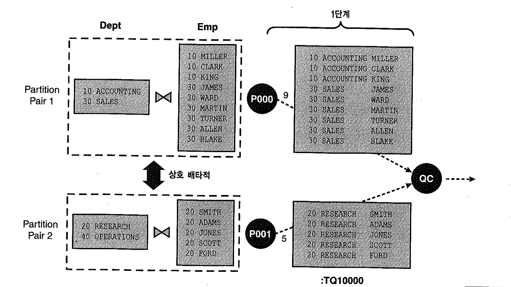
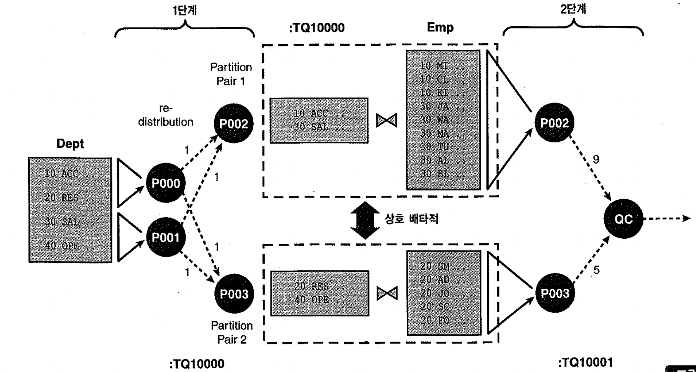
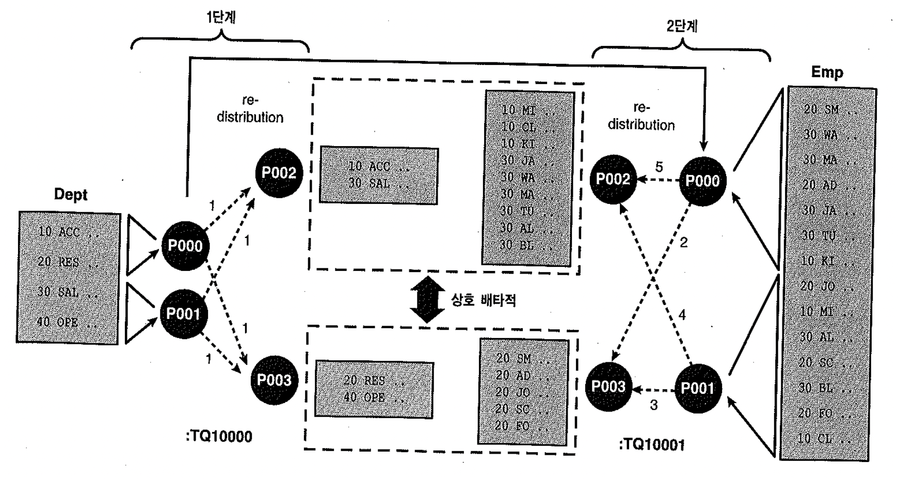
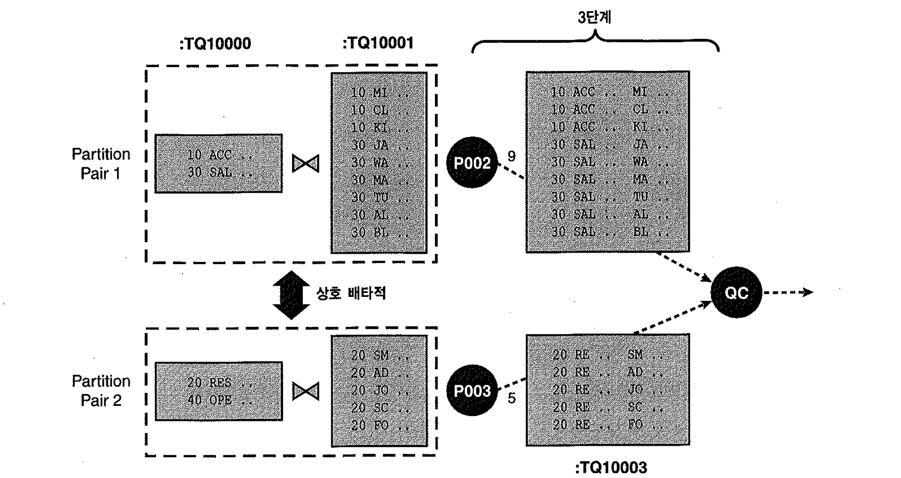
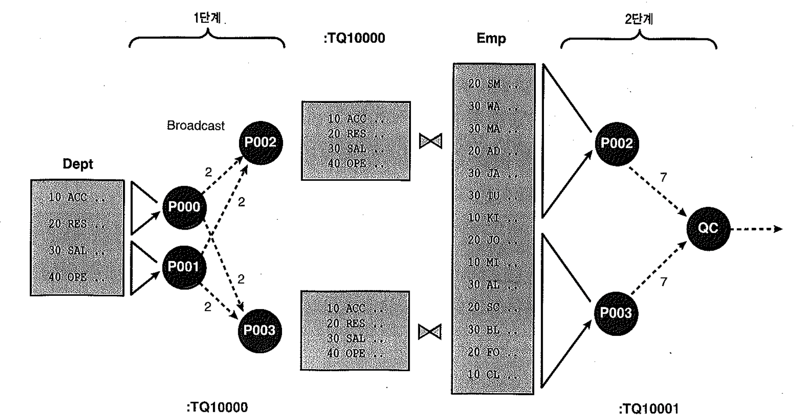

# 03. 병렬조인


## 1) EMP, DEPT 테이블을 파티션으로 생성

-  `PX PARTITION` 실행계획이 나오려면 조인키의 파티션 이름이 서로 동일해야 한다.

```sql
-- 오라클 버전
SELECT * FROM v$version
;

BANNER                                                            
------------------------------------------------------------------
Oracle Database 10g Enterprise Edition Release 10.2.0.3.0 - 64bit  
PL/SQL Release 10.2.0.3.0 - Production                            

-- EMP, DEPT 파티션 테이블 생성
DROP TABLE USER.EMP;
DROP TABLE USER.DEPT;

CREATE TABLE EMP
       (EMPNO NUMBER(4) NOT NULL,
        ENAME VARCHAR2(10),
        JOB VARCHAR2(9),
        MGR NUMBER(4),
        HIREDATE DATE,
        SAL NUMBER(7, 2),
        COMM NUMBER(7, 2),
        DEPTNO NUMBER(2))     
PARTITION BY HASH (DEPTNO)
(
    PARTITION PH_DEPTNO_001,
    PARTITION PH_DEPTNO_002,
    PARTITION PH_DEPTNO_003,
    PARTITION PH_DEPTNO_004
);  


INSERT INTO EMP VALUES
        (7369, 'SMITH',  'CLERK',     7902,
        TO_DATE('17-DEC-1980', 'DD-MON-YYYY'),  800, NULL, 20);
INSERT INTO EMP VALUES
        (7499, 'ALLEN',  'SALESMAN',  7698,
        TO_DATE('20-FEB-1981', 'DD-MON-YYYY'), 1600,  300, 30);
INSERT INTO EMP VALUES
        (7521, 'WARD',   'SALESMAN',  7698,
        TO_DATE('22-FEB-1981', 'DD-MON-YYYY'), 1250,  500, 30);
INSERT INTO EMP VALUES
        (7566, 'JONES',  'MANAGER',   7839,
        TO_DATE('2-APR-1981', 'DD-MON-YYYY'),  2975, NULL, 20);
INSERT INTO EMP VALUES
        (7654, 'MARTIN', 'SALESMAN',  7698,
        TO_DATE('28-SEP-1981', 'DD-MON-YYYY'), 1250, 1400, 30);
INSERT INTO EMP VALUES
        (7698, 'BLAKE',  'MANAGER',   7839,
        TO_DATE('1-MAY-1981', 'DD-MON-YYYY'),  2850, NULL, 30);
INSERT INTO EMP VALUES
        (7782, 'CLARK',  'MANAGER',   7839,
        TO_DATE('9-JUN-1981', 'DD-MON-YYYY'),  2450, NULL, 10);
INSERT INTO EMP VALUES
        (7788, 'SCOTT',  'ANALYST',   7566,
        TO_DATE('09-DEC-1982', 'DD-MON-YYYY'), 3000, NULL, 20);
INSERT INTO EMP VALUES
        (7839, 'KING',   'PRESIDENT', NULL,
        TO_DATE('17-NOV-1981', 'DD-MON-YYYY'), 5000, NULL, 10);
INSERT INTO EMP VALUES
        (7844, 'TURNER', 'SALESMAN',  7698,
        TO_DATE('8-SEP-1981', 'DD-MON-YYYY'),  1500,    0, 30);
INSERT INTO EMP VALUES
        (7876, 'ADAMS',  'CLERK',     7788,
        TO_DATE('12-JAN-1983', 'DD-MON-YYYY'), 1100, NULL, 20);
INSERT INTO EMP VALUES
        (7900, 'JAMES',  'CLERK',     7698,
        TO_DATE('3-DEC-1981', 'DD-MON-YYYY'),   950, NULL, 30);
INSERT INTO EMP VALUES
        (7902, 'FORD',   'ANALYST',   7566,
        TO_DATE('3-DEC-1981', 'DD-MON-YYYY'),  3000, NULL, 20);
INSERT INTO EMP VALUES
        (7934, 'MILLER', 'CLERK',     7782,
        TO_DATE('23-JAN-1982', 'DD-MON-YYYY'), 1300, NULL, 10);

CREATE TABLE DEPT
       (DEPTNO NUMBER(2),
        DNAME VARCHAR2(14),
        LOC VARCHAR2(13) )
PARTITION BY HASH (DEPTNO)
(
    PARTITION PH_DEPTNO_001,
    PARTITION PH_DEPTNO_002,
    PARTITION PH_DEPTNO_003,
    PARTITION PH_DEPTNO_004
);  
      
INSERT INTO DEPT VALUES (10, 'ACCOUNTING', 'NEW YORK');
INSERT INTO DEPT VALUES (20, 'RESEARCH',   'DALLAS');
INSERT INTO DEPT VALUES (30, 'SALES',      'CHICAGO');
INSERT INTO DEPT VALUES (40, 'OPERATIONS', 'BOSTON');

COMMIT;
/

BEGIN
  DBMS_STATS.GATHER_TABLE_STATS(USER,
                                'EMP',
                                CASCADE => TRUE);
END;
/

BEGIN
  DBMS_STATS.GATHER_TABLE_STATS(USER,
                                'DEPT',
                                CASCADE => TRUE);
END;
/

-- XPLAN 확인
EXPLAIN PLAN FOR
SELECT /*+ LEADING(E D) FULL(D) FULL(E) PARALLEL(D 2) PARALLEL(E 2) PQ_DISTRIBUTE(D, NONE, NONE) */
       D.DEPTNO,
       D.DNAME,
       E.ENAME
FROM   DEPT D,
       EMP  E
WHERE  E.DEPTNO = D.DEPTNO  
;

@xplan
---------------------------------------------------------------------------------------------------------------------------------
| Id  | Operation               | Name     | Rows  | Bytes | Cost (%CPU)| Time     | Pstart| Pstop |    TQ  |IN-OUT| PQ Distrib |
---------------------------------------------------------------------------------------------------------------------------------
|   0 | SELECT STATEMENT        |          |    14 |   308 |    14   (8)| 00:00:01 |       |       |        |      |            |
|   1 |  PX COORDINATOR         |          |       |       |            |          |       |       |        |      |            |
|   2 |   PX SEND QC (RANDOM)   | :TQ10000 |    14 |   308 |    14   (8)| 00:00:01 |       |       |  Q1,00 | P->S | QC (RAND)  |
|   3 |    PX PARTITION HASH ALL|          |    14 |   308 |    14   (8)| 00:00:01 |     1 |     4 |  Q1,00 | PCWC |            |
|*  4 |     HASH JOIN           |          |    14 |   308 |    14   (8)| 00:00:01 |       |       |  Q1,00 | PCWP |            |
|   5 |      TABLE ACCESS FULL  | EMP      |    14 |   126 |     7   (0)| 00:00:01 |     1 |     4 |  Q1,00 | PCWP |            |
|   6 |      TABLE ACCESS FULL  | DEPT     |     4 |    52 |     7   (0)| 00:00:01 |     1 |     4 |  Q1,00 | PCWP |            |
---------------------------------------------------------------------------------------------------------------------------------
                                                                                                                                 
Predicate Information (identified by operation id):                                                                              
---------------------------------------------------                                                                              
                                                                                                                                 
   4 - access("E"."DEPTNO"="D"."DEPTNO")                                                                                         

18 rows selected.
```



- `Full Partition Wise` 방법은 조인키가 같은 기준으로 파티셔닝(equi-partitioning) 되어 있으면 가능(대신 Partition 이름이 같아야 함!!!)
- 내부 프로세스는, P000과 P001 서버 프로세스가 각각 Partition Pair1과 Partition Pair2를 처리하는데 이 때 각각 Partition-Pair가 형성되어 있으므로 각 서버 프로세스가 하나씩 독립적으로 조인을 수행할 수 있다.
- P000, P001 서버 프로세스 옆에 표시된 숫자 9와 5는 각각 조인을 수행하고 나서 QC에ㅔㄱ 전송한 조인 결과 숫자이며, 만약 Partition-Pair가 10개면, 두 개 서버 프로세스가 각각 5개씩 순차적으로 처리함.
- `Full Partition Wise` 특징
  1) 다른 병렬 조인은 두 개의 서버집합이 필요한 반면, `Full Partition Wise`는 하나의 서버집합만 필요
  2) `Full Partition Wise` 조인은 파티션 기반 Granule이므로 서버 프로세스 개수는 파티션 개수 이하로 제한
  3) 파티션 방식은 어떤 것이든 상관없음.
  4) 조인 방식도 어떤 것이든 선택 가능함.


# 2) 둘 중 하나만 파티셔닝된 경우 - Partial Partition Wise 조인




#### EMP 파티션, DEPT 노말 테이블 생성

```sql
-- 오라클 버전
SELECT * FROM v$version
;

BANNER                                                            
------------------------------------------------------------------
Oracle Database 10g Enterprise Edition Release 10.2.0.3.0 - 64bit  
PL/SQL Release 10.2.0.3.0 - Production                            

-- EMP, DEPT 파티션 테이블 생성
DROP TABLE USER.EMP;
DROP TABLE USER.DEPT;

CREATE TABLE EMP
       (EMPNO NUMBER(4) NOT NULL,
        ENAME VARCHAR2(10),
        JOB VARCHAR2(9),
        MGR NUMBER(4),
        HIREDATE DATE,
        SAL NUMBER(7, 2),
        COMM NUMBER(7, 2),
        DEPTNO NUMBER(2));

INSERT INTO EMP VALUES
        (7369, 'SMITH',  'CLERK',     7902,
        TO_DATE('17-DEC-1980', 'DD-MON-YYYY'),  800, NULL, 20);
INSERT INTO EMP VALUES
        (7499, 'ALLEN',  'SALESMAN',  7698,
        TO_DATE('20-FEB-1981', 'DD-MON-YYYY'), 1600,  300, 30);
INSERT INTO EMP VALUES
        (7521, 'WARD',   'SALESMAN',  7698,
        TO_DATE('22-FEB-1981', 'DD-MON-YYYY'), 1250,  500, 30);
INSERT INTO EMP VALUES
        (7566, 'JONES',  'MANAGER',   7839,
        TO_DATE('2-APR-1981', 'DD-MON-YYYY'),  2975, NULL, 20);
INSERT INTO EMP VALUES
        (7654, 'MARTIN', 'SALESMAN',  7698,
        TO_DATE('28-SEP-1981', 'DD-MON-YYYY'), 1250, 1400, 30);
INSERT INTO EMP VALUES
        (7698, 'BLAKE',  'MANAGER',   7839,
        TO_DATE('1-MAY-1981', 'DD-MON-YYYY'),  2850, NULL, 30);
INSERT INTO EMP VALUES
        (7782, 'CLARK',  'MANAGER',   7839,
        TO_DATE('9-JUN-1981', 'DD-MON-YYYY'),  2450, NULL, 10);
INSERT INTO EMP VALUES
        (7788, 'SCOTT',  'ANALYST',   7566,
        TO_DATE('09-DEC-1982', 'DD-MON-YYYY'), 3000, NULL, 20);
INSERT INTO EMP VALUES
        (7839, 'KING',   'PRESIDENT', NULL,
        TO_DATE('17-NOV-1981', 'DD-MON-YYYY'), 5000, NULL, 10);
INSERT INTO EMP VALUES
        (7844, 'TURNER', 'SALESMAN',  7698,
        TO_DATE('8-SEP-1981', 'DD-MON-YYYY'),  1500,    0, 30);
INSERT INTO EMP VALUES
        (7876, 'ADAMS',  'CLERK',     7788,
        TO_DATE('12-JAN-1983', 'DD-MON-YYYY'), 1100, NULL, 20);
INSERT INTO EMP VALUES
        (7900, 'JAMES',  'CLERK',     7698,
        TO_DATE('3-DEC-1981', 'DD-MON-YYYY'),   950, NULL, 30);
INSERT INTO EMP VALUES
        (7902, 'FORD',   'ANALYST',   7566,
        TO_DATE('3-DEC-1981', 'DD-MON-YYYY'),  3000, NULL, 20);
INSERT INTO EMP VALUES
        (7934, 'MILLER', 'CLERK',     7782,
        TO_DATE('23-JAN-1982', 'DD-MON-YYYY'), 1300, NULL, 10);

CREATE TABLE DEPT
       (DEPTNO NUMBER(2),
        DNAME VARCHAR2(14),
        LOC VARCHAR2(13) )
PARTITION BY HASH (DEPTNO)
(
    PARTITION PH_DEPTNO_001,
    PARTITION PH_DEPTNO_002,
    PARTITION PH_DEPTNO_003,
    PARTITION PH_DEPTNO_004
);  
      
INSERT INTO DEPT VALUES (10, 'ACCOUNTING', 'NEW YORK');
INSERT INTO DEPT VALUES (20, 'RESEARCH',   'DALLAS');
INSERT INTO DEPT VALUES (30, 'SALES',      'CHICAGO');
INSERT INTO DEPT VALUES (40, 'OPERATIONS', 'BOSTON');

COMMIT;
/

BEGIN
  DBMS_STATS.GATHER_TABLE_STATS(USER,
                                'EMP',
                                CASCADE => TRUE);
END;
/

BEGIN
  DBMS_STATS.GATHER_TABLE_STATS(USER,
                                'DEPT',
                                CASCADE => TRUE);
END;
/

-- XPLAN 확인
EXPLAIN PLAN FOR
SELECT /*+ LEADING(E D) FULL(D) FULL(E) PARALLEL(D 2) PARALLEL(E 2) PQ_DISTRIBUTE(D, PARTITION, NONE) */
       D.DEPTNO,
       D.DNAME,
       E.ENAME
FROM   DEPT D,
       EMP  E
WHERE  E.DEPTNO = D.DEPTNO  
;

@xplan
-------------------------------------------------------------------------------------------------------------------------------------
| Id  | Operation                   | Name     | Rows  | Bytes | Cost (%CPU)| Time     | Pstart| Pstop |    TQ  |IN-OUT| PQ Distrib |
-------------------------------------------------------------------------------------------------------------------------------------
|   0 | SELECT STATEMENT            |          |    14 |   308 |    10  (10)| 00:00:01 |       |       |        |      |            |
|   1 |  PX COORDINATOR             |          |       |       |            |          |       |       |        |      |            |
|   2 |   PX SEND QC (RANDOM)       | :TQ10001 |    14 |   308 |    10  (10)| 00:00:01 |       |       |  Q1,01 | P->S | QC (RAND)  |
|*  3 |    HASH JOIN                |          |    14 |   308 |    10  (10)| 00:00:01 |       |       |  Q1,01 | PCWP |            |
|   4 |     PX RECEIVE              |          |    14 |   126 |     3   (0)| 00:00:01 |       |       |  Q1,01 | PCWP |            |
|   5 |      PX SEND PARTITION (KEY)| :TQ10000 |    14 |   126 |     3   (0)| 00:00:01 |       |       |  Q1,00 | P->P | PART (KEY) |
|   6 |       PX BLOCK ITERATOR     |          |    14 |   126 |     3   (0)| 00:00:01 |       |       |  Q1,00 | PCWC |            |
|   7 |        TABLE ACCESS FULL    | EMP      |    14 |   126 |     3   (0)| 00:00:01 |       |       |  Q1,00 | PCWP |            |
|   8 |     PX PARTITION HASH ALL   |          |     4 |    52 |     7   (0)| 00:00:01 |     1 |     4 |  Q1,01 | PCWC |            |
|   9 |      TABLE ACCESS FULL      | DEPT     |     4 |    52 |     7   (0)| 00:00:01 |     1 |     4 |  Q1,01 | PCWP |            |
-------------------------------------------------------------------------------------------------------------------------------------
                                                                                                                                     
Predicate Information (identified by operation id):                                                                                  
---------------------------------------------------                                                                                  
                                                                                                                                     
   3 - access("E"."DEPTNO"="D"."DEPTNO")                                                                                             

21 rows selected.
```

- 둘 중 한 테이블만 조인 컬럼에 대해 파티션된 경우, 다른 한쪽 테이블을 같은 기준으로 동적 파티셔닝하고 나서 각 Partition-Pair를 독립적으로 병렬 조인하는 방법
- 둘 다 파티셔닝 되어 있지만 파티션 기준이 다른 경우 이 방식으로 조인될 수 있다.
- 중요한점은, 데이터를 동적으로 파티셔닝하기 위해 데이터 재분배가 선행되어야 하므로 Inter-operation parallelism을 위해 두 개의 서버 집합이 필요해짐

-- 그림 7_8 참조

- EMP 테이블을 읽어 DEPT 테이블에 재 분배 하기 위해 P000, P001 서버 집합이 P002, P003에 데이터를 재분배 하는것을 보여주며, 그 이후는 'Full Partition Wise'과 같다.
- 위의 실행계획에서 'PART (KEY)'는 어느 한 쪽에 'Partial Partition Wise' 조인이 된 것을 보여주는데, 이 때 'PART (KEY)'가 있는 쪽이 파티션 된 테이블은 아니다.


# 3) 둘 다 파티셔닝되지 않은 경우 - 동적 파티셔닝






### EMP, DEPT 노말 테이블 생성

```sql
-- 오라클 버전
SELECT * FROM v$version
;

BANNER                                                            
------------------------------------------------------------------
Oracle Database 10g Enterprise Edition Release 10.2.0.3.0 - 64bit  
PL/SQL Release 10.2.0.3.0 - Production                            

-- EMP, DEPT 파티션 테이블 생성
DROP TABLE USER.EMP;
DROP TABLE USER.DEPT;

CREATE TABLE EMP
       (EMPNO NUMBER(4) NOT NULL,
        ENAME VARCHAR2(10),
        JOB VARCHAR2(9),
        MGR NUMBER(4),
        HIREDATE DATE,
        SAL NUMBER(7, 2),
        COMM NUMBER(7, 2),
        DEPTNO NUMBER(2));

INSERT INTO EMP VALUES
        (7369, 'SMITH',  'CLERK',     7902,
        TO_DATE('17-DEC-1980', 'DD-MON-YYYY'),  800, NULL, 20);
INSERT INTO EMP VALUES
        (7499, 'ALLEN',  'SALESMAN',  7698,
        TO_DATE('20-FEB-1981', 'DD-MON-YYYY'), 1600,  300, 30);
INSERT INTO EMP VALUES
        (7521, 'WARD',   'SALESMAN',  7698,
        TO_DATE('22-FEB-1981', 'DD-MON-YYYY'), 1250,  500, 30);
INSERT INTO EMP VALUES
        (7566, 'JONES',  'MANAGER',   7839,
        TO_DATE('2-APR-1981', 'DD-MON-YYYY'),  2975, NULL, 20);
INSERT INTO EMP VALUES
        (7654, 'MARTIN', 'SALESMAN',  7698,
        TO_DATE('28-SEP-1981', 'DD-MON-YYYY'), 1250, 1400, 30);
INSERT INTO EMP VALUES
        (7698, 'BLAKE',  'MANAGER',   7839,
        TO_DATE('1-MAY-1981', 'DD-MON-YYYY'),  2850, NULL, 30);
INSERT INTO EMP VALUES
        (7782, 'CLARK',  'MANAGER',   7839,
        TO_DATE('9-JUN-1981', 'DD-MON-YYYY'),  2450, NULL, 10);
INSERT INTO EMP VALUES
        (7788, 'SCOTT',  'ANALYST',   7566,
        TO_DATE('09-DEC-1982', 'DD-MON-YYYY'), 3000, NULL, 20);
INSERT INTO EMP VALUES
        (7839, 'KING',   'PRESIDENT', NULL,
        TO_DATE('17-NOV-1981', 'DD-MON-YYYY'), 5000, NULL, 10);
INSERT INTO EMP VALUES
        (7844, 'TURNER', 'SALESMAN',  7698,
        TO_DATE('8-SEP-1981', 'DD-MON-YYYY'),  1500,    0, 30);
INSERT INTO EMP VALUES
        (7876, 'ADAMS',  'CLERK',     7788,
        TO_DATE('12-JAN-1983', 'DD-MON-YYYY'), 1100, NULL, 20);
INSERT INTO EMP VALUES
        (7900, 'JAMES',  'CLERK',     7698,
        TO_DATE('3-DEC-1981', 'DD-MON-YYYY'),   950, NULL, 30);
INSERT INTO EMP VALUES
        (7902, 'FORD',   'ANALYST',   7566,
        TO_DATE('3-DEC-1981', 'DD-MON-YYYY'),  3000, NULL, 20);
INSERT INTO EMP VALUES
        (7934, 'MILLER', 'CLERK',     7782,
        TO_DATE('23-JAN-1982', 'DD-MON-YYYY'), 1300, NULL, 10);

CREATE TABLE DEPT
       (DEPTNO NUMBER(2),
        DNAME VARCHAR2(14),
        LOC VARCHAR2(13) )
PARTITION BY HASH (DEPTNO);
      
INSERT INTO DEPT VALUES (10, 'ACCOUNTING', 'NEW YORK');
INSERT INTO DEPT VALUES (20, 'RESEARCH',   'DALLAS');
INSERT INTO DEPT VALUES (30, 'SALES',      'CHICAGO');
INSERT INTO DEPT VALUES (40, 'OPERATIONS', 'BOSTON');

COMMIT;
/

BEGIN
  DBMS_STATS.GATHER_TABLE_STATS(USER,
                                'EMP',
                                CASCADE => TRUE);
END;
/

BEGIN
  DBMS_STATS.GATHER_TABLE_STATS(USER,
                                'DEPT',
                                CASCADE => TRUE);
END;
/

-- XPLAN 확인
EXPLAIN PLAN FOR
SELECT /*+ LEADING(E D) FULL(D) FULL(E) PARALLEL(D 2) PARALLEL(E 2) PQ_DISTRIBUTE(D, HASH, HASH) */
       D.DEPTNO,
       D.DNAME,
       E.ENAME
FROM   DEPT D,
       EMP  E
WHERE  E.DEPTNO = D.DEPTNO  
;

@xplan
---------------------------------------------------------------------------------------------------------------------------------
| Id  | Operation               | Name     | Rows  | Bytes | Cost (%CPU)| Time     | Pstart| Pstop |    TQ  |IN-OUT| PQ Distrib |
---------------------------------------------------------------------------------------------------------------------------------
|   0 | SELECT STATEMENT        |          |    14 |   308 |     6   (0)| 00:00:01 |       |       |        |      |            |
|   1 |  PX COORDINATOR         |          |       |       |            |          |       |       |        |      |            |
|   2 |   PX SEND QC (RANDOM)   | :TQ10002 |    14 |   308 |     6   (0)| 00:00:01 |       |       |  Q1,02 | P->S | QC (RAND)  |
|*  3 |    HASH JOIN BUFFERED   |          |    14 |   308 |     6   (0)| 00:00:01 |       |       |  Q1,02 | PCWP |            |
|   4 |     PX RECEIVE          |          |    14 |   126 |     3   (0)| 00:00:01 |       |       |  Q1,02 | PCWP |            |
|   5 |      PX SEND HASH       | :TQ10000 |    14 |   126 |     3   (0)| 00:00:01 |       |       |  Q1,00 | P->P | HASH       |
|   6 |       PX BLOCK ITERATOR |          |    14 |   126 |     3   (0)| 00:00:01 |       |       |  Q1,00 | PCWC |            |
|   7 |        TABLE ACCESS FULL| EMP      |    14 |   126 |     3   (0)| 00:00:01 |       |       |  Q1,00 | PCWP |            |
|   8 |     PX RECEIVE          |          |     4 |    52 |     3   (0)| 00:00:01 |       |       |  Q1,02 | PCWP |            |
|   9 |      PX SEND HASH       | :TQ10001 |     4 |    52 |     3   (0)| 00:00:01 |       |       |  Q1,01 | P->P | HASH       |
|  10 |       PX BLOCK ITERATOR |          |     4 |    52 |     3   (0)| 00:00:01 |     1 |     1 |  Q1,01 | PCWC |            |
|  11 |        TABLE ACCESS FULL| DEPT     |     4 |    52 |     3   (0)| 00:00:01 |     1 |     1 |  Q1,01 | PCWP |            |
---------------------------------------------------------------------------------------------------------------------------------
                                                                                                                                 
Predicate Information (identified by operation id):                                                                              
---------------------------------------------------                                                                              
                                                                                                                                 
   3 - access("E"."DEPTNO"="D"."DEPTNO")                                                                                         
```

- 조인 컬럼에 대해 어느 한 쪽도 파티셔닝되지 않은 상황이라면 오라클은 두 가지 방식 중 하나를 사용
  1) 양쪽 테이블을 동적으로 파티셔닝하고서 'Full Partition Wise' 조인
  2) 한쪽 테이블을 Broadcast하고 나서 조인

- 그림 7_9 참조

- 프로세스 설명

  1) 1단계 : 첫 번째 서버 집합(P000, P001)이 DEPT 테이블을 읽어 두 번째 서버 집합(P002, P003)에 전송.
  2) 2단계 : 첫 번째 서버 집합(P000, P001)이 EMP 테이블을 읽어 두 번째 서버 집합(P002, P003)에 전송.

  첫 번째 서버 집합은 데이터를 분배하고, 두 번째 서버 집합은 받은 데이터를 파티셔닝하는 역할을 하면서 Partition-Pair를 구성하여 Full Partition Wise 조인을 수행함

  3) 3단계 : 양쪽 테이블 모두의 파티셔닝을 담당한 두 번째 서버 집합(P002, P003)이 각 Partition-Pair에 대해 독립적으로 병렬 조인을 수행

- 동적 파티셔닝은 양쪽 모두 파티셔닝을 해야 하고 작업 시 메모리 자원과 Temp 테이블스페이스 공간을 많이 사용하므로 가급적 아래의 상황에서만 사용하는 것이 좋음
  1) 어느 한 쪽도 조인 컬럼 기준으로 파티셔닝되지 않은 상황에서 두 테이블 모두 대용량 테이블이고 조인 컬럼 데이터 분포도가 균일할 경우


# 4) 둘 다 파티셔닝되지 않은 경우 - Broadcase 방식




```sql
EXPLAIN PLAN FOR
SELECT /*+ FULL(D) FULL(E) PARALLEL(D 2) PARALLEL(E 2) */
       D.DEPTNO,
       D.DNAME,
       E.ENAME
FROM   DEPT D,
       EMP  E
WHERE  E.DEPTNO = D.DEPTNO  
;

@xplan
---------------------------------------------------------------------------------------------------------------------------------
| Id  | Operation               | Name     | Rows  | Bytes | Cost (%CPU)| Time     | Pstart| Pstop |    TQ  |IN-OUT| PQ Distrib |
---------------------------------------------------------------------------------------------------------------------------------
|   0 | SELECT STATEMENT        |          |    14 |   308 |     6   (0)| 00:00:01 |       |       |        |      |            |
|   1 |  PX COORDINATOR         |          |       |       |            |          |       |       |        |      |            |
|   2 |   PX SEND QC (RANDOM)   | :TQ10001 |    14 |   308 |     6   (0)| 00:00:01 |       |       |  Q1,01 | P->S | QC (RAND)  |
|*  3 |    HASH JOIN            |          |    14 |   308 |     6   (0)| 00:00:01 |       |       |  Q1,01 | PCWP |            |
|   4 |     PX RECEIVE          |          |     4 |    52 |     3   (0)| 00:00:01 |       |       |  Q1,01 | PCWP |            |
|   5 |      PX SEND BROADCAST  | :TQ10000 |     4 |    52 |     3   (0)| 00:00:01 |       |       |  Q1,00 | P->P | BROADCAST  |
|   6 |       PX BLOCK ITERATOR |          |     4 |    52 |     3   (0)| 00:00:01 |     1 |     1 |  Q1,00 | PCWC |            |
|   7 |        TABLE ACCESS FULL| DEPT     |     4 |    52 |     3   (0)| 00:00:01 |     1 |     1 |  Q1,00 | PCWP |            |
|   8 |     PX BLOCK ITERATOR   |          |    14 |   126 |     3   (0)| 00:00:01 |       |       |  Q1,01 | PCWC |            |
|   9 |      TABLE ACCESS FULL  | EMP      |    14 |   126 |     3   (0)| 00:00:01 |       |       |  Q1,01 | PCWP |            |
---------------------------------------------------------------------------------------------------------------------------------
                                                                                                                                 
Predicate Information (identified by operation id):                                                                              
---------------------------------------------------                                                                              
                                                                                                                                 
   3 - access("E"."DEPTNO"="D"."DEPTNO")                                                                                         

21 rows selected.

Elapsed: 00:00:00.17
```

- 조인 컬럼에 대해 어느 한 쪽도 파티셔닝되지 않은 상황에서 오라클이 선택할 수 있는 두 번째 방식은 Broadcast 방식으로, 두 테이블 중 작은 쪽을 반대편 서버 집합의 "모든" 프로세스에 Broadcase하고 나서 조인을 수행하는 방식
  1) 1단계 : 첫 번째 서버 집합에 속한 프로세스들이 각자 읽은 DEPT 테이블 레코드를 두 번째 서버 집합에 속한 모든 병렬 프로세스에 전송
  2) 2단계 : 두 번째 서버 집합에 속한 프로세스들이 각자 맡은 범위의 EMP 테이블을 읽으면서 병렬로 조인을 수행.

| 방식                        | 특징                                                         |
| :-------------------------- | :----------------------------------------------------------- |
| Full Partition Wise 조인    | 두 테이블 모두 조인 컬럼에 대해 같은 기준으로 파티셔닝 ☞ 데이터 재분배 불필요 -> 단일 서버 집합만으로 수정 |
| Partial Partition Wise 조인 | 둘 중 한 테이블만 조인 컬럼에 대해 파티셔닝된 경우 ☞ 파티셔닝되지 않은 다른 쪽 테이블을 같은 기준으로 파티셔닝하고 나서 Full Partition Wise 조인 ☞ 동적 파티셔닝을 위한 데이터 재분배 필요 -> 두 개의 서버 집합이 작업 수행 |
| 동적 파티셔닝               | 어느 한 쪽도 조인 컬럼에 대해 파티셔닝되지 않은 상황 ☞ 양쪽 테이블이 모두 대용량 ☞ 임시 테이블스페이스를 많이 사용 ☞ 양쪽 테이블 모두 전체범위처리 ☞ 조인 컬럼의 데이터 분포가 균일해야 함 |
| Broadcase                   | 어느 한 쪽도 조인 컬럼에 대해 파티셔닝되지 않은 상황 ☞ 둘 중 하나의 테이블이 매우 적을 때 ☞ 동적 파티셔닝이 불필요 -> 큰 테이블에 대한 부분범위처리 가능 |


