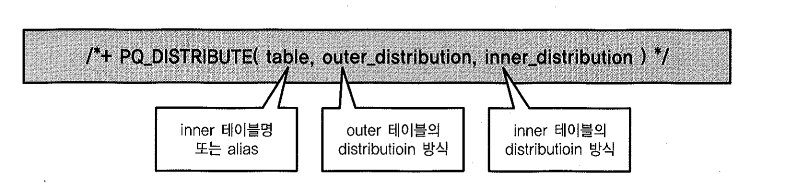

# 04. PQ_DISTRIBUTE힌트


## 1) pq_distribute 힌트 용도

조인되는 두 테이블간의 파티션의 구성, 데이터 크기에 따라 병렬 조인을 수행하는 옵티마이져의 선택이 달라질 수 있다. 이 때 사용자가 직접 조인을 위한 데이터 분배 방식을 결정 할 수 있는 힌트이다.

1. pq_distribute 힌트의 용도
   1. 옵티마이져가 파티션된 테이블을 적절히 활용하지 못하고 동적 재분할을 시도할 때
   2. 기존 파티션 키를 무시하고 다른 키 값으로 동작 재분할하고 싶을 때
   3. 통계정보가 부정확하거나 통계정보를 제공하기 어려운 상황에서 실행계획을 고정시고정시 할 때
   4. 기타 여러 가지 이유로 데이터 분배 방식을 변경하고 자 할 때


- 병렬 쿼리는 '분할 & 정복 원리'에 기초한다. 그 중 병렬 조인을 위해서는 '분배 & 조인 원리가 작동함을 이해하는 것이 중요 pq_distribute 힌트는 조인에 앞서 데이터를 분배(Distribure)하는 과정에만 관여하는 힌트
- HASH, RANGE 등 조인 뱅식와 비슷한 용어가 사용되지만 이와 혼동하지 않도록 주의


```sql
SQL> SELECT /*+ ordered use_merge(e) parallel(d 4) parallel(e 4)
  2             pq_distribute(e hash hash) */*
  3    FROM dept d
  4       , emp e
  5   WHERE e.deptno = d.deptno;

--------------------------------------------------------------------------
| Id  | Operation                | Name     |    TQ  |IN-OUT| PQ Distrib |
--------------------------------------------------------------------------
|   0 | SELECT STATEMENT         |          |        |      |            |
|   1 |  PX COORDINATOR          |          |        |      |            |
|   2 |   PX SEND QC (RANDOM)    | :TQ10002 |  Q1,02 | P->S | QC (RAND)  |
|   3 |    MERGE JOIN            |          |  Q1,02 | PCWP |            |
|   4 |     SORT JOIN            |          |  Q1,02 | PCWP |            |
|   5 |      PX RECEIVE          |          |  Q1,02 | PCWP |            |
|   6 |       PX SEND HASH       | :TQ10000 |  Q1,00 | P->P | HASH       |
|   7 |        PX BLOCK ITERATOR |          |  Q1,00 | PCWC |            |
|   8 |         TABLE ACCESS FULL| DEPT     |  Q1,00 | PCWP |            |
|*  9 |     SORT JOIN            |          |  Q1,02 | PCWP |            |
|  10 |      PX RECEIVE          |          |  Q1,02 | PCWP |            |
|  11 |       PX SEND HASH       | :TQ10001 |  Q1,01 | P->P | HASH       |
|  12 |        PX BLOCK ITERATOR |          |  Q1,01 | PCWC |            |
|  13 |         TABLE ACCESS FULL| EMP      |  Q1,01 | PCWP |            |
--------------------------------------------------------------------------
```


## 2) 구문 이해하기




1. Table : Ordered 또는 Leading 힌트에 의해 먼저 처리되는 Outer Table을 기준으로 그 집합과 조인되는 Inner 테이블을 첫 번째 인자로 지정 Outer_distribution / Inner_Distribution : Outer 및 Inner테이블, 각각의 분배방식 지정
2. 올바른 사용법 예시

```sql
SQL> SELECT /*+ ordered
  2             use_hash(b) use_nl(c) use_merge(d)
  3             full(a) full(b) full(c) full(d)
  4             parallel(e, 16) parallel(b, 16) parallel(c, 16) parallel(d, 16)
  5             pq_distribute(b, none, partition)
  6             pq_distribute(c, none, broadcast)
  7             pq_distribute(d, none, hash) */*
  8    FROM 상품기본이력임시 a
  9       , 상품 b
 10       , 코드상세 c
 11       , 상품상세 d
 12   WHERE ...
```

1. from절에 나열된 순서대로 조인하라.
2. b(상품) 테이블과는 해시 조인, c(코드상세) 테이블과는 NL조인, d(상품상세) 테이블과는 소트머지 조인을 하라.
3. a, b, c, d 네 테이블을 full scan하라.
4. a, b, c, d 네 테이블을 병렬로 처리하라.
5. 상품(b) 테이블과 조인할 때, inner 테이블(=상품)을 outer 테이블(=상품기본이력임시)에 맞춰 파티셔닝하라.
6. 코드상세© 테이블과 조인할 때, inner 테이블(=코드상세)을 Broadcast하라
7. 상품상세(d) 테이블과 조인할 때, 양쪽 모두를 Hash방식으로 동적 파티셔닝하라.


## 3) 분배방식 지정

| **힌트**                              | **설명**                                                     |
| ------------------------------------- | ------------------------------------------------------------ |
| pq_distribute(inner, none, none)      | Full-parition Wise 조인으로 유도할 때 사용.양쪽 테이블 모두 조인 컬럼에 대해 같은 기준으로 파티션되어 있어야 작동 |
| pq_distribute(inner, partition, none) | Partial-partition Wise 조인으로 유도할 때 사용.inner 테이블이 조인 키 컬럼으로 파티셔닝되어 있을 때만 작동 |
| pq_distribute(inner, none, partition) | Partial-partition Wise 조인으로 유도할 때 사용.outer 테이블이 조인 키 컬럼으로 파티셔닝되어 있을 때만 작동 |
| pq_distribute(inner, hash, hash)      | 조인 키 컬럼을 해시 함수에 적용하고 거기서 반환된 값을 기준으로 양쪽 테이블을 동적으로 파티셔닝하라는 힌트 |
| pq_distribute(inner, broadcast, none) | outer 테이블을 Broadcast하라는 힌트                          |
| pq_distribute(inner, none, broadcast) | inner 테이블을 Broadcast하라는 힌트                          |


## 4) Pq_distribute 힌트를 이용한 튜닝사례

- 생략

