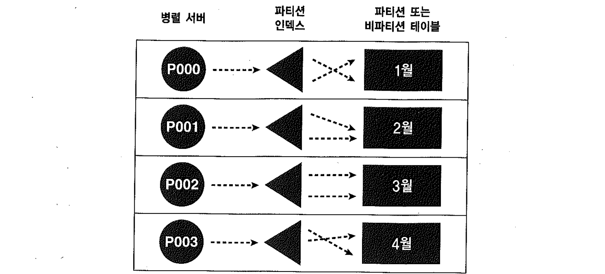
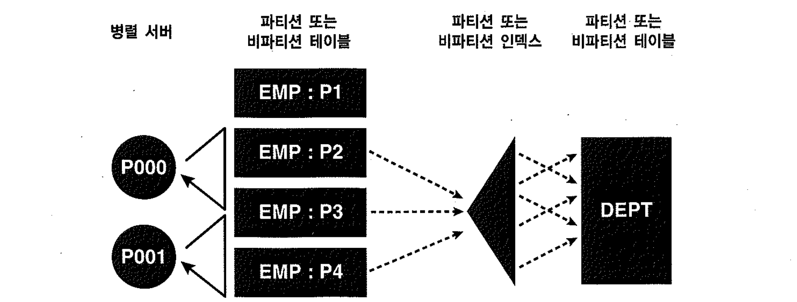
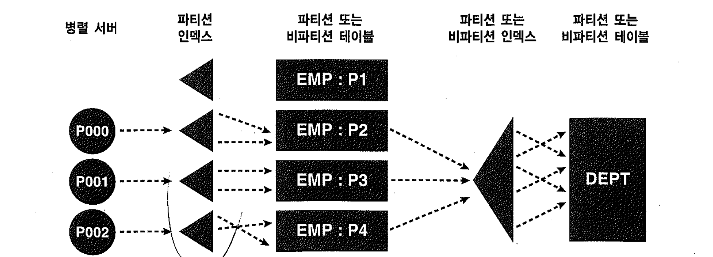
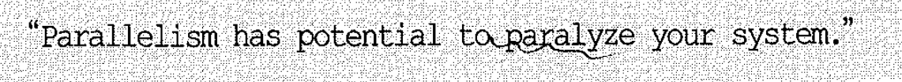

# 05. 병렬처리에관한기타상식


## 1) Direct Path Read

버퍼 캐시 히트율이 낮은 대용량 데이터를 건건이 버퍼 캐시를 거쳐 읽는다면 오히려 성능이 나빠지게 마련이다.
오라클은 병렬 방식으로 Full Scan 할 때는 버퍼 캐시를 거치지 않고 곧바로 PGA영역으로 읽어 들이는 Direct Path Read방식을 사용한다.
버퍼캐시에 충분히 적재될 크기의 중소형 테이블을 병렬쿼리로 읽을 때 오히려 성능이 나빠지는 경우가 있는데, 버퍼경합이 없는 한 Disk i/o가 메모리 i/o보다 빠를 수 없기 때문이다. 게다가 Direct Path Read를 하려면 메모리와 디스크간 동기화를 맞추기 위해서 Object레벨의 Partitial 체크포인트가 먼저 수행해야 하기 때문이다.


## 2) 병렬처리를 가능하게 하려면 쿼리, DML, DDL시 다음과 같은 선처리가 필요하다.

~~~
Alter session enable parallel query;
Alter session enable parallel dml;
Alter session enable parallel ddl;
~~~

- 다행히 parallel query와 parallel ddl은 기본적으로 활성화 되어 있지만 parallel dml은 명시적으로 활성화 해주어야 한다.


```sql
explain plan for
update /*+ parallel(t 4) */ t
set no2 = lpad(no,5,'0');

select * from table(dbms_xplan.display());

---------------------------------------------------------------------------------------
| Id  | Operation             | Name     | Pstart| Pstop |    TQ  |IN-OUT| PQ Distrib |
---------------------------------------------------------------------------------------
|   0 | UPDATE STATEMENT      |          |       |       |     |         |            |
|   1 |  UPDATE               | T        |       |       |     |         |            |
|   2 |   PX COORDINATOR      |          |       |       |     |         |            |
|   3 |    PX SEND QC (RANDOM)| :TQ10000 |       |       |  Q1,00 | P->S | QC (RAND)  |
|   4 |     PX BLOCK ITERATOR |          |     1 |     4 |  Q1,00 | PCWC |            |
|   5 |      TABLE ACCESS FULL| T        |     1 |     4 |  Q1,00 | PCWP |            |
---------------------------------------------------------------------------------------

alter session enable parallel dml;

explain plan for
update /*+ parallel(t 4) */ t
set no2 = lpad(no,5,'0');


select * from table(dbms_xplan.display());

---------------------------------------------------------------------------------------
| Id  | Operation             | Name     | Pstart| Pstop |    TQ  |IN-OUT| PQ Distrib |
---------------------------------------------------------------------------------------
|   0 | UPDATE STATEMENT      |          |       |       |     |         |            |
|   1 |  PX COORDINATOR       |          |       |       |     |         |            |
|   2 |   PX SEND QC (RANDOM) | :TQ10000 |       |       |  Q1,00 | P->S | QC (RAND)  |
|   3 |    UPDATE             | T        |       |       |  Q1,00 | PCWP |            |
|   4 |     PX BLOCK ITERATOR |          |     1 |     4 |  Q1,00 | PCWC |            |
|   5 |      TABLE ACCESS FULL| T        |     1 |     4 |  Q1,00 | PCWP |            |
---------------------------------------------------------------------------------------
```

- 오라클 9iR1까지는 한 세그먼트를 두 개 이상의 프로세스가 동시에 갱신할 수 없었다. 따라서 파티션되지 않은 테이블이라면 병렬로 갱신 할 수 없었고, 파티션 테이블일 때라도 병렬도를 파티션 개수 이하로만 지정할 수 있었다.
- **병렬 DML을 수행 할 때 Exclusive 모드 테이블 lock이 걸린다는 사실이며, 다른 트랜젝션이 DML을 수행하지 못하므로 운영환경을 고려하여 사용해야 한다**.


## 3) 병렬 인덱스 스캔

Index Fast Full Scan이 아닌 한 인덱스는 기본적으로 병렬로 스캔 할 수 없다.
파티션된 인덱스일 때 병렬 스캔이 가능하며 파티션 기반 Granule이므로 병렬도는 파티션개수 이하로만 지정가능 함.




## 4) 병렬 NL조인

- 병렬조인은 항상 Table Full Scan을 이용한 해쉬 조인 또는 소트머지 조인으로 처리된다고 생각하기 쉽다. 하지만 인덱스 기반의 병렬 NL조인도 가능

```sql
select /*+ ordered use_nl(d) full(e) parallel(e 2) */ *
from emp1 e, dept d
where d.deptno = d.deptno
and e.sal >= 1000;

---------------------------------------------------------------------------------------
| Id  | Operation             | Name     | Pstart| Pstop |    TQ  |IN-OUT| PQ Distrib |
---------------------------------------------------------------------------------------
|   0 | SELECT STATEMENT      |          |       |       |        |      |            |
|   1 |  PX COORDINATOR       |          |       |       |        |      |            |
|   2 |   PX SEND QC (RANDOM) | :TQ10000 |       |       |  Q1,00 | P->S | QC (RAND)  |
|   3 |    NESTED LOOPS       |          |       |       |  Q1,00 | PCWP |            |
|   4 |     PX BLOCK ITERATOR |          |     2 |     4 |  Q1,00 | PCWC |            |
|*  5 |      TABLE ACCESS FULL| EMP1     |     2 |     4 |  Q1,00 | PCWP |            |
|   6 |     TABLE ACCESS FULL | DEPT     |       |       |  Q1,00 | PCWP |            |
---------------------------------------------------------------------------------------
```

Parallel Full Scan은 블록 기반 Granule이 사용되므로 병렬도는 파티션 개수와 무관하다. 단 너무 크게 병렬도를 잡으면 아무 일도 안 하는 노는 프로세스가 생길 수 있으므로 주의해야 한다.

	


#### 병렬 인덱스 스캔으로 드라이빙하는 경우

- 파티션된 인덱스부터 드라이빙하여 병렬 NL조인을 수행

```sql
select /*+ ordered use_nl(d) index(e emp_sal_idx) parallel_index(e emp_sal_idx 3) */ *
from emp1 e, dept d
where d.deptno = d.deptno
and e.sal >= 1000;

--------------------------------------------------------------------------------------
| Id  | Operation                             | Name        | Pstart| Pstop |    TQ  |
--------------------------------------------------------------------------------------
|   0 | SELECT STATEMENT                      |             |       |       |        |
|   1 |  PX COORDINATOR                       |             |       |       |        |
|   2 |   PX SEND QC (RANDOM)                 | :TQ10000    |       |       |  Q1,00 |
|   3 |    NESTED LOOPS                       |             |       |       |  Q1,00 |
|   4 |     PX PARTITION RANGE ITERATOR       |             |     2 |     4 |  Q1,00 |
|   5 |      TABLE ACCESS BY LOCAL INDEX ROWID| EMP1        |     2 |     4 |  Q1,00 |
|*  6 |       INDEX RANGE SCAN                | EMP_SAL_IDX |     2 |     4 |  Q1,00 |
|   7 |     TABLE ACCESS FULL                 | DEPT        |       |       |  Q1,00 |
--------------------------------------------------------------------------------------
```

- 아래 그림과 같은 방식으로 병렬 NL조인을 수행하려면, 드라이빙 인덱스가 반드시 파티션인덱스여야 한다.
- 인덱스를 드라이빙한 병렬 NL조인에는 파티션 기반 Granule 이 사용되므로 병렬도가 파티션 개수를 초과할 수 없다.
- 여기서는 세 개 파티션만 액세스하므로 병렬도를 3 이상 줄 수 없다.
- 만약 병렬도를 2로 지정한다면 각각 하나씩 처리하다가 먼저 일을 마친 프로세스가 나머지 하나를 더 처리한다.





**병렬 NL 조인의 필요한 경우**

1. 두 개의 초대용량 테이블을 소트머지나 해시 방식으로 조인하려면 많은 리소스가 필요해 부담스러움
2. 조인 결과가 매우 적다면 큰 비효율임
3. 수행빈도가 낮음.
4. 원칙적으로 인덱스를 생성하는 것이 답이지만 수행빈도가 낮은 쿼리를 위해 초대용량테이블에 인덱스를 만드는 것이 부담스러움..


## 5) 병렬 쿼리와 스칼라 서브쿼리

QC의 트레이스는 `user_dump_dest`에 생성되고 슬레이브의 트레이스는 `Background_dump_dest`에 생성된다.

1. 병렬처리 시 Trace결과를 보고 스칼라 서브쿼리의 주체가 어떤 프로세스인지 알 수 있다.
2. QC에 스칼라 서브쿼리 수행 통계가 나타나지 않는 경우 병렬서버 프로세스가 스칼라서브쿼리를 수행 것임을 알 수 있고 병렬서버프로세스들이 order by를 위한 정렬처리를 함과 동시에 스칼라 서브쿼리를 하면서 sort area(temp)에 중간 결과집합을 담는 것을 알 수 있다.
3. 병렬쿼리는 대부분 Full Table Scan을 하는데 Random액세스 위주의 스칼라서브쿼리까지 수행된다면 수행 속도를 크게 떨어트린다.
4. 스칼라서브쿼리를 일반 조인문장으로 변경하여 Full Scan + Parallel방식으로 처리하는 것이 매우 중요한 튜닝기법 중 하나가 될 수 있다.


## 6) 병렬 쿼리와 사용자 정의 함수

함수에 parallel_enable 키워드를 사용하든 안하든 병렬로 처리되는 것과는 연관관계가 없다.

1. SQL수행 결과는 병렬로 수행 되는지 여부와 관계없이 항상 일관된 결과를 반환해야 한다.
2. 하지만 세션변수를 참조하는 함수는 병렬로 실행했을 때 일관성이 보장되지 않기 때문에 오랄클은 기본적으로 병렬 수행을 거부한다.
3. 그럼에도 불구하고 사용자가 병렬 수행을 원할 때 사용하는 키워드가 parallel_enable이다.
4. 즉, 직렬과 비교해 병렬처리 시 수행결과가 달라질 수 있음에도 paralle_enable를 선언하면 오라클은 사용자의 지시에 따라 함수를 병렬로 실행할 수 있도록 허용하며 결과에 대한 책임은 사용자의 몫이라는 의미이다.


## 7) 병렬 쿼리와 Rownum

1. 1. SQL에 ROWNUM을 포함하면 쿼리문을 병렬로 실행하는 데에 제약을 받게 되므로 주의해야 함. (DML)
   2. 각 프로시져가 P->P로 동작하여 정렬부담을 나누어가져야 함에도 불구하고 QC가 정렬을 전담하는 상황이 발생함

```sql
select /*+ parallel(t1 24) */ no, no2
from t1
order by no2;

----------------------------------------------------------------
| Id  | Operation               | Name     |IN-OUT| PQ Distrib |
----------------------------------------------------------------
|   0 | SELECT STATEMENT        |          |      |            |
|   1 |  PX COORDINATOR         |          |      |            |
|   2 |   PX SEND QC (ORDER)    | :TQ10001 | P->S | QC (ORDER) |
|   3 |    SORT ORDER BY        |          | PCWP |            |
|   4 |     PX RECEIVE          |          | PCWP |            |
|   5 |      PX SEND RANGE      | :TQ10000 | P->P | RANGE      |
|   6 |       PX BLOCK ITERATOR |          | PCWC |            |
|   7 |        TABLE ACCESS FULL| T1       | PCWP |            |
----------------------------------------------------------------

select /*+ parallel(t1 24) */ no, no2, rownum
from t1
order by no2;

---------------------------------------------------------------
| Id  | Operation              | Name     |IN-OUT| PQ Distrib |
---------------------------------------------------------------
|   0 | SELECT STATEMENT       |          |      |            |
|   1 |  SORT ORDER BY         |          |      |            |
|   2 |   COUNT                |          |      |            |
|   3 |    PX COORDINATOR      |          |      |            |
|   4 |     PX SEND QC (RANDOM)| :TQ10000 | P->S | QC (RAND)  |
|   5 |      PX BLOCK ITERATOR |          | PCWC |            |
|   6 |       TABLE ACCESS FULL| T1       | PCWP |            |
---------------------------------------------------------------
```


## 8) 병렬 쿼리 시 주의사항



병렬처리가 바람직한 경우

- 동시 사용자 수가 적은 애플리케이션 환경에서 직렬로 처리할 때 보다 성능 개선효과가 확실할 때.
- OLTP성 시스템 환경이더라도 작업을 빨리 완료함으로써 직렬로 처리할 때보다 오히려 전체적인 시스템 리소스 사용률을 감소시킬 수 있을때.


병렬쿼리와 관계된 주의사항

- Workarea_size_policy를 manual로 설정한다면, 사용자가 지정한 sort_area_size가 모든 병렬서버에 적용되므로 적절한 sort_area_size를 설정하지 않은 경우 OS레벨에서 과도한 페이징이 발생하고 심할 경우 시스템이 마비될 수 있다.
- 병렬도를 지정하지 않으면 `cpu_count *parallel_threads_per_cpu`만큼의 병렬 프로세스가 할당되어 의도하지 않은 수의 프로세스가 작동하게 된다.
- 실행계획에 P->P 가 나타날 때문 지정한 병렬도의 두 배수만큼 병렬 프로세스가 필요하다는 것이다. ( producer, consumer)
- 쿼리 블록마다 병렬도를 다르게 지정하면 여러가지 규칙에 따라 최종병렬도가 결정되어 사용된다. 결국 쿼리 작성 시 병렬도를 모두 같게 지정하는 것이 바람직하다.
- Parallel 힌트를 사용할 때는 반드시 Full힌트도 함께 사용하는 것이 바람직하다. 간혹 옵티마이져에 의해 index 스캔이 선택된 경우 Parallel 이 무시되는 경우가 발생하기 때문이다.
- 병렬 DML 수행 시 Exclusive 모드로 Table lock이 걸리므로 업무 트랜젝션을 고려해야 한다.
- 테이블이나 인덱스를 빠르게 생성하려고 parallel옵션을 주었다면 작업을 완료하자마자 noparallel로 돌려놓는 것을 잊지 말아야 한다.
- 부분범위 처리 방식으로 조회하면서 병렬 쿼리를 사용한 경우 필요한 만큼의 fetch이후 곧바로 커서를 닫아줘야 한다. ( Orange, Toad같은 툴의 경우 리소스를 해제하지 못하는 경우가 있으므로 select * from dual로 새로운 쿼리를 수행하여 이전 커서를 닫아 주는 방식을 취할 수 있다. )
