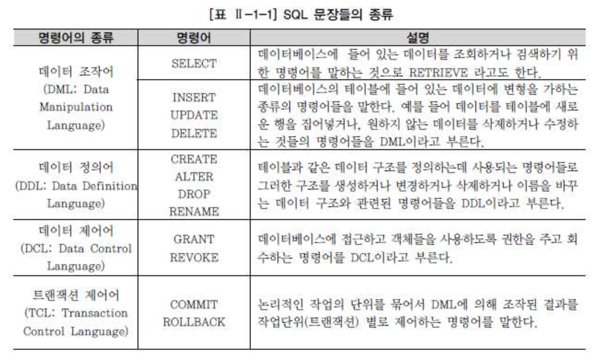
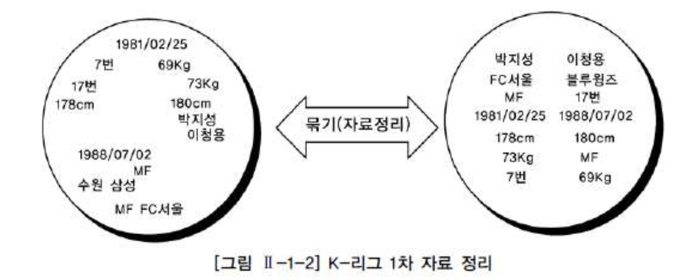
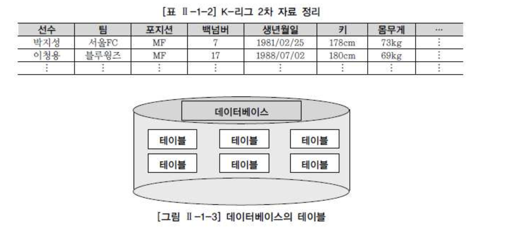
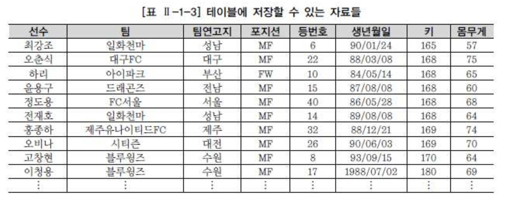
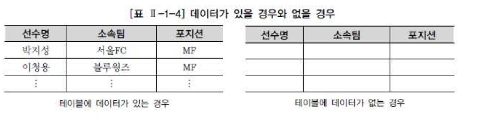
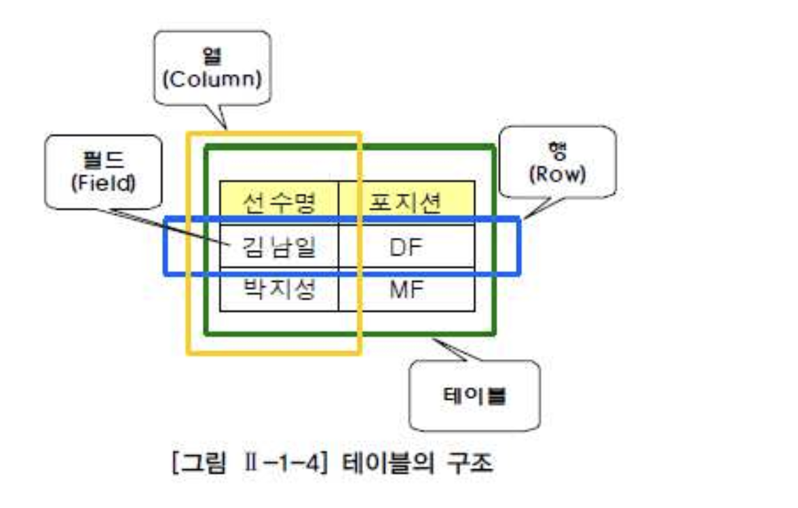
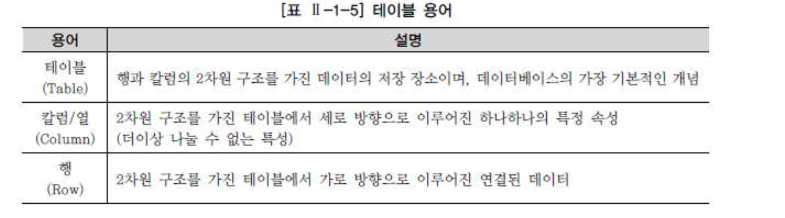
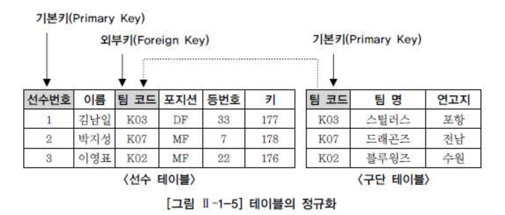
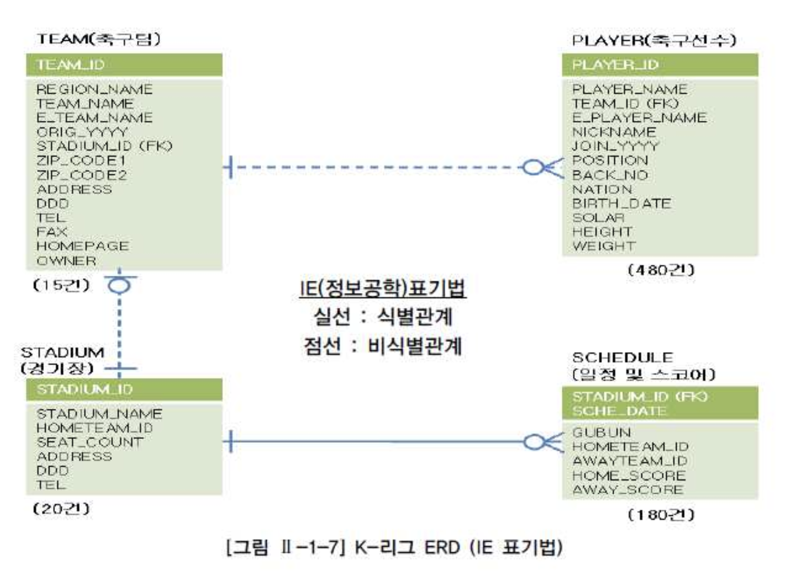
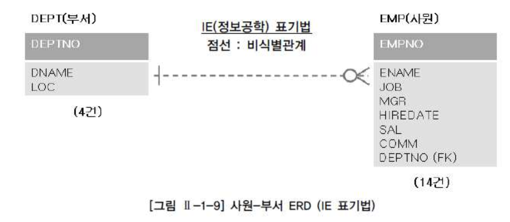

# 01. 관계형 데이터베이스 개요

## 1) 데이터베이스

- 데이터베이스는 일상적인 정보들을 모아 놓은 것 자체를 의미한다.
- 효율적인 데이터의 관리 뿐만 아니라 예기치 못한 사건으로 인한 데이터의 손상을 피하고, 필요시 필요한 데이터를 복구하기 위한 강력한 기능의 소프트웨어를 필요로 하게 되었고 이러한 기본적인 요구사항을 만족시켜주는 시스템을 DBMS(Database Management System)라고 한다.

#### 데이터베이스의 발전

- 1960년대 : 플로우차트 중심의 개발 방법을 사용하였으며 파일 구조를 통해 데이터를 저장하고 관리하였다.
- 1970년대 : 데이터베이스 관리 기법이 처음 태동되던 시기였으며 계층형(Hierarchical) 데이터베이스, 망형(Network) 데이터베이스 같은 제품들이 상용화 되었다.
- 1980년대 : 현재 대부분의 기업에서 사용되고 있는 관계형 데이터베이스가 상용화되었으며 Oracle, Sybase, DB2와 같은 제품이 사용되었다.
- 1990년대 : Oracle, Sybase, Informix, DB2, Teradata, SQL Server 외 많은 제품들이 보다 향상된 기능으로 정보시스템의 확실한 핵심 솔루션으로 자리잡게 되었으며, 인터넷 환경의 급속한 발전과 객체 지향 정보를 지원하기 위해 객체 관계형 데이터베이스로 발전하였다.

#### 관계형 데이터베이스(Relational Database)

- 1970년 영국의 수학자였던 E.F. Codd 박사의 논문에서 처음으로 관계형 데이터베이스가 소개된 이후, IBM의 SQL 개발 단계를 거쳐서, Oracle을 선발로 여러 회사에서 상용화된 제품을 내놓음.
- 기존의 파일시스템과 계층형, 망형 데이터베이스를 대부분 대체하면서 주력 데이터베이스가 되었다.

- 현재 기업에서 사용하고 있는 대부분의 데이터베이스는 기존 관계형 데이터베이스에 객체 지원 기능을 추가한 객체 관계형 데이터베이스를 사용하고 있지만, 현실적으로 기업의 핵심 데이터는 대부분 관계형 데이터베이스 구조로 저장이 되고, 관계형 데이터베이스를 유일하게 조작할 수 있는 SQL 문장에 의해 관리되고 있으므로 관계형 데이터베이스와 SQL의 중요성은 아무리 강조해도 지나치지 않다.

#### 파일시스템

- 하나의 파일을 많은 사용자가 동시에 검색할 수는 있지만 동시에 입력, 수정, 삭제할 수 없기 때문에 정보의 관리가 어려우므로, 하나의 파일을 여러 사용자나 어플리케이션에서 동시에 사용하기 위해서 원래의 데이터 파일을 여러 개 복사하여 사용하게 된다.
- 여러 개의 데이터 파일이 존재하는 경우에 동일한 데이터가 여러 곳에 저장되는 문제가 발생하고, 하나의 원본 파일에 대한 변경 작업이 발생했을 때 모든 복사본 파일에 대한 변경 작업을 한꺼번에 병행 처리하지 않으면 서로 다른 정보 파일이 존재하기 때문에 데이터의 불일치성이 발생한다.
- 파일시스템은 분산된 데이터 간의 정합성을 유지하는데 과다한 노력이 필요하게 되고 데이터의 정합성을 보장하기 힘들게 된다.
- 단일 사용자나 단일 어플리케이션이 파일시스템을 사용하는 경우 데이터베이스보다 처리 성능이 뛰어나므로 특정 업무에서는 아직도 파일시스템을 유용하게 사용하고 있다.

#### 관계형 데이터베이스

- 정규화를 통한 합리적인 테이블 모델링을 통해 이상(ANOMALY) 현상을 제거하고 데이터 중복을 피할 수 있으며, 동시성 관리, 병행 제어를 통해 많은 사용자들이 동시에 데이터를 공유 및 조작할 수 있는 기능을 제공하고 있다.
- 메타 데이터를 총괄 관리할 수 있기 때문에 데이터의 성격, 속성 또는 표현 방법 등을 체계화할 수 있고, 데이터 표준화를 통한 데이터 품질을 확보할 수 있는 장점을 가지고 있다.
- DBMS는 인증된 사용자만이 참조할 수 있도록 보안 기능을 제공하고 있다.
- 테이블 생성 시에 다양한 제약조건을 이용하여 사용자가 실수로 조건에 위배되는 데이터를 입력한다든지, 관계를 연결하는 중요 데이터를 삭제하는 것을 방지하여 데이터 무결성(Integrity)을 보장할 수 있다.
- 시스템의 갑작스런 장애로부터 사용자가 입력, 수정, 삭제하던 데이터가 제대로 반영될 수 있도록 보장해주는 기능과, 시스템 다운, 재해 등의 상황에서도 데이터를 회복/복구할 수 있는 기능을 제공한다.

## 2) SQL(Structured Query Language)

#### SQL(Structured Query Language)

- 관계형 데이터베이스에서 데이터 정의, 데이터 조작, 데이터 제어를 하기 위해 사용하는 언어
- SQL의 최초 이름이 SEQUEL(Structured English QUEry Language)이었기 때문에 '시큐얼'로 읽는 경우도 있지만, 표준은 SQL이므로 '에스큐엘'로 읽는 것을 권고
- 1986년부터 ANSI/ISO를 통해 표준화되고 정의된 SQL 기능은 벤더별 DBMS 개발의 목표가 됨
- 대부분의 관계형 데이터베이스에서 ANSI/ISO 표준을 최대한 따르고 있기 때문에, SQL에 대한 지식은 다른 데이터베이스를 사용하더라도 상당 부분 기존 지식을 재활용할 수 있음
- ANSI/IS0 SQL-99, SQL-2003 이후 기준이 적용된 SQL이라면 프로그램의 이식성을 높이는 데도 공헌
- SQL 문장은 일반적인 개발 언어처럼 독립된 하나의 개발 언어이다.
- 일반적인 프로그래밍 언어와는 달리 SQL은 관계형 데이터베이스에 대한 전담 접속(다른 언어는 관계형 데이터베이스에 접속할 수 없다) 용도로 사용되며 세미콜론( ; ) 으로 분리되어 있는 SQL 문장 단위로 독립되어 있음
- 관계형 데이터베이스는 수학의 집합 논리에 입각한 것이므로, SQL도 데이터를 집합으로써 취급함

- 결과적으로 SQL 문장을 배우는 것이 곧 관계형 데이터베이스를 배우는 기본 단계라 할 수 있음

###### SQL 문장

- 단순히 조회를 하는 SELECT 문장
- 데이터에 변경을 가하는 UPDATE, DELETE, INSERT
- 테이블을 생성하고 수정하고 변경하고 삭제하는 테이블 관련 SQL 문장이 있고, 추가로 데이터에 대한 권한을 제어하는 SQL 문장도 있다.

- 이들 SQL 명령어는 3가지 SAVEPOINT 그룹인 DDL, DML, DCL로 나눌 수 있는데, TCL의 경우 굳이 나눈다면 일부에서 DCL로 분류하기도 하지만, 다소 성격이 다르므로 별도의 4번째 그룹으로 분리할 것을 권고한다.

## 3) TABLE

- K-League에 등록되어 있는 팀들의 정보와 선수들에 관련된 데이터에 관심을 두고, 선수정보를 데이터베이스화 한다.
- 다음은 K-리그 구단 홈페이지를 방문하여 팀 및 선수들의 정보를 찾아서 선수들의 이름과 소속 구단, 포지션, 생년월일, 키, 몸무게, 등번호를 노트에 적어본 것이다.
- 참고로 본 가이드의 K-리그 데이터는 팀명이나 일부 실명이 포함되어 있지만 전체적으로는 가공의 데이터이다.

- 정리되지 않은 그림 Ⅱ-1-2 의 왼쪽 내용은 본인이 아니라면 알아보기도 힘들고 다른 사용자에게 큰 도움이 되지 않는다.
- 오른쪽의 내용도 한두 명의 선수에 대한 정보는 쉽게 볼 수 있지만 많은 선수들의 정보를 비교하기는 다소 어려워 보인다.
- 아래 그림의 표처럼 키는 키대로, 몸무게는 몸무게대로 데이터의 순서를 정해서 비교하는 것이 바람직하다.

- **데이터는 관계형 데이터베이스의 기본 단위인 테이블 형태로 저장된다.**
- 테이블은 어느 특정한 주제와 목적으로 만들어지는 일종의 집합이다.

- 표 Ⅱ-1-3 의 내용을 보면 선수, 팀, 팀연고지, 포지션, 등번호, 생년월일, 키, 몸무게가 각각의 칼럼이 되며, 해당 테이블은 반드시 하나 이상의 칼럼을 가져야 한다.

- 테이블에는 등록된 자료들이 있으며, 이 자료들은 삭제하지 않는 한 지속적으로 유지된다.
- 자료를 입력하지 않는다면 테이블은 본래 만들어졌을 때부터 가지고 있던 속성을 그대로 유지하면서 존재하게 된다.

- **테이블(TABLE)은 데이터를 저장하는 객체(Object)로서 관계형 데이터베이스의 기본 단위이다.**
- **관계형 데이터베이스에서는 모든 데이터를 칼럼과 행의 2차원 구조로 나타낸다.**

- 세로 방향을 칼럼(Column), 가로 방향을 행(Row)이라고 하고, 칼럼과 행이 겹치는 하나의 공간을 필드(Field)라고 한다.
- 선수정보 테이블을 예로 들면 선수명과 포지션 등의 칼럼이 있고, 각 선수에 대한 데이터를 행으로 구성하여 저장한다.

- 그림 Ⅱ-1-5 를 보면 선수와 관련된 데이터를 선수 테이블과 구단 테이블이라는 복수의 테이블로 분할하여 저장하고 있다.
- 그리고 분할된 테이블은 그 칼럼의 값에 의해 연결된다.
- 이렇게 테이블을 분할하여 데이터의 불필요한 중복을 줄이는 것을 정규화(Normalization)라고 한다.
- 데이터의 정합성 확보와 데이터 입력/수정/삭제시 발생할 수 있는 이상현상(Anomaly)을 방지하기 위해 정규화는 관계형 데이터베이스 모델링에서 매우 중요한 프로세스이다.

###### 기본키(Primary Key)

- 각 행을 한 가지 의미로 특정할 수 있는 한 개 이상의 칼럼(<선수> 테이블의 '선수번호'와 <구단> 테이블의 '구단코드')

###### 외부키(Foreign Key)

- 다른 테이블의 기본 키로 사용되면서 테이블과의 관계를 연결하는 역할을 하는 칼럼(<선수> 테이블의 '구단코드)

## 4) ERD(Entity Relationship Diagram)

- 테이블 간 서로의 상관 관계를 그림으로 도식화한 것을 E-R 다이어그램이라고 하며, 간략히 ERD라고 함
- 구성 요소는 엔터티(Entity), 관계(Relationship), 속성(Attribute) 3가지이며 현실 세계의 데이터는 이 3가지 구성 요소로 모두 표현이 가능함

###### K-리그 테이블 간의 양방향 관계

- 하나의 팀은 여러 명의 선수를 포함할 수 있다.
- 한 명의 선수는 하나의 팀에 꼭 속한다.

- 하나의 팀은 하나의 전용 구장을 꼭 가진다.
- 하나의 운동장은 하나의 홈팀을 가질 수 있다.

- 하나의 운동장은 여러 게임의 스케줄을 가질 수 있다.
- 하나의 스케줄은 하나의 운동장에 꼭 배정된다.

- 그림 Ⅱ-1-9 와 그림 Ⅱ-1-10 은 앞으로 사용하게 될 부서-사원 테이블 간의 관계를 IE 표기법과 Barker 표기법으로 표현한 ERD이다.

###### 사원-부서 테이블 간의 양방향 관계

- 하나의 부서는 여러 명의 사원을 보유할 수 있다.
- 한 명의 사원은 하나의 부서에 꼭 소속된다.

