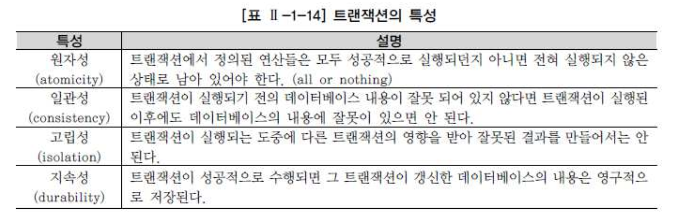
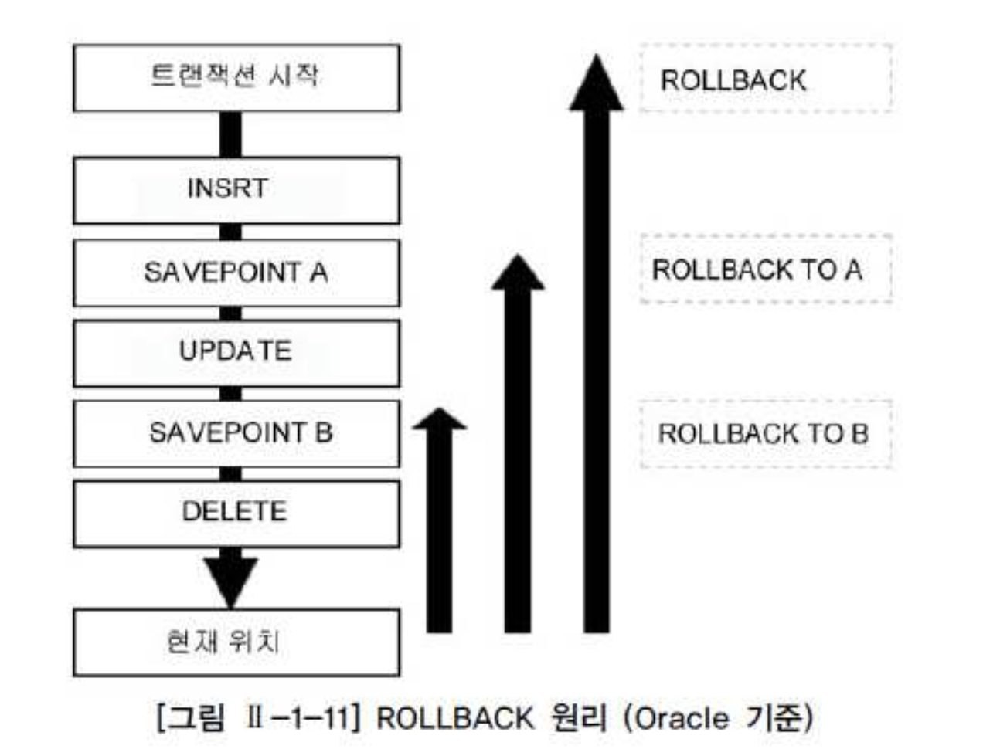

# 04. TCL


##  1) 트랜잭션 개요

- 트랜잭션은 데이터베이스의 논리적 연산단위이다.
- 밀접히 관련되어 분리될 수 없는 한 개 이상의 데이터베이스 조작을 가리킨다.
- 하나의 트랜잭션에는 하나 이상의 SQL 문장이 포함된다. 트랜잭션은 분할할 수 없는 최소의 단위이다.
- 하나의 트랜잭션은 전부 적용하거나 전부 취소한다. 즉, TRANSACTION은 ALL OR NOTHING의 개념인 것이다.


- 은행에서의 계좌이체 상황을 연상하면 트랜잭션을 이해하는데 도움이 된다. 계좌이체는 최소한 두 가지 이상의 작업으로 이루어져 있다.
- 우선 자신의 계좌에서 잔액을 확인하고 이체할 금액을 인출한 다음 나머지 금액을 저장한다.
- 그리고 이체할 계좌를 확인하고 앞에서 인출한 금액을 더한 다음에 저장하면 계좌이체가 성공한다.


###### 계좌이체 사례

- STEP1. 100번 계좌의 잔액에서 10,000원을 뺀다.
- STEP2. 200번 계좌의 잔액에 10,000원을 더한다.


- 계좌이체라는 작업 단위는 이런 두 개의 업데이트가 모두 성공적으로 완료되었을 때 종료된다.
- 둘 중 하나라도 실패할 경우 계좌이체는 원래의 금액을 유지하고 있어야만 한다.
- 만약 어떠한 장애에 의해 어느 쪽이든 한 쪽만 실행했을 경우, 이체한 금액은 어디로 증발해 버렸거나 마음대로 증가하게 된다.
- 당연히 그런 일이 있어서는 안 되므로 이러한 경우에는 수정을 취소하여 원 상태로 되돌려야 한다.
- 이런 계좌이체 같은 **하나의 논리적인 작업 단위를 구성하는 세부적인 연산들의 집합을 트랜잭션이라 한다.**
- 이런 관점에서 데이터베이스 응용 프로그램은 트랜잭션의 집합으로 정의할 수도 있다.


- 올바르게 반영된 데이터를 데이터베이스에 반영시키는 것을 커밋(COMMIT), 트랜잭션 시작 이전의 상태로 되돌리는 것을 롤백(ROLLBACK)이라고 하며, 저장점(SAVEPOINT) 기능과 함께 3가지 명령어를 트랜잭션을 콘트롤하는 TCL(TRANSACTION CONTROL LANGUAGE)로 분류한다.


- 트랜잭션의 대상이 되는 SQL문은 UPDATE, INSERT, DELETE 등 데이터를 수정하는 DML 문이다.
- SELECT 문장은 직접적인 트랜잭션의 대상이 아니지만, SELECT FOR UPDATE 등 배타적 LOCK을 요구하는 SELECT 문장은 트랜잭션의 대상이 될 수 있다.





- 계좌이체는 한 계좌에서 현금이 인출된 후에 다른 계좌로 입금이 되는데. 현금이 인출되기 전에 다른 계좌에 입금이 되는 것은 문제를 발생시킬 수 있다.
- 그리고 이체가 결정되기 전까지는 다른 사람이 이 계좌의 정보를 변경할 수 없다.
- 이것을 보통 문에 자물쇠를 채우듯이 한다고 하여 잠금(LOCKING)이라고 표현한다.
- 트랜잭션의 특성(특히 원자성)을 충족하기 위해 데이터베이스는 다양한 레벨의 잠금 기능을 제공하고 있는데, 잠금은 기본적으로 트랜잭션이 수행하는 동안 특정 데이터에 대해서 다른 트랜잭션이 동시에 접근하지 못하도록 제한하는 기법이다.
- 잠금이 걸린 데이터는 잠금을 실행한 트랜잭션만 독점적으로 접근할 수 있고 다른 트랜잭션으로부터 간섭이나 방해를 받지 않는 것이 보장된다.
- 그리고 잠금이 걸린 데이터는 잠금을 수행한 트랜잭션만이 해제할 수 있다.


### 2. COMMIT

- 입력한 자료나 수정한 자료에 대해서 또는 삭제한 자료에 대해서 전혀 문제가 없다고 판단되었을 경우 COMMIT 명령어를 통해서 트랜잭션을 완료할 수 있다.


###### COMMIT이나 ROLLBACK 이전의 데이터 상태는 다음과 같다.

- 단지 메모리 BUFFER에만 영향을 받았기 때문에 데이터의 변경 이전 상태로 복구 가능하다.
- 현재 사용자는 SELECT 문장으로 결과를 확인 가능하다.
- 다른 사용자는 현재 사용자가 수행한 명령의 결과를 볼 수 없다.
- 변경된 행은 잠금(LOCKING)이 설정되어서 다른 사용자가 변경할 수 없다.


- (예제) PLAYER 테이블에 데이터를 입력하고 COMMIT을 실행한다.

```

INSERT INTO PLAYER 
(PLAYER_ID, TEAM_ID, PLAYER_NAME, POSITION, HEIGHT, WEIGHT, BACK_NO) 
VALUES ('1997035', 'K02', '이운재', 'GK', 182, 82, 1); 
1개의 행이 만들어졌다. 

COMMIT; 
커밋이 완료되었다.
```


- (예제) PLAYER 테이블에 있는 데이터를 수정하고 COMMIT을 실행한다.

```
UPDATE PLAYER 
SET HEIGHT = 100; 
480개의 행이 수정되었다. 

COMMIT; 
커밋이 완료되었다.
```


- (예제) PLAYER 테이블에 있는 데이터를 삭제하고 COMMIT을 실행한다.

```
DELETE FROM PLAYER; 
480개의 행이 삭제되었다. 

COMMIT; 
커밋이 완료되었다. 
```


- COMMIT 명령어는 DML(INSERT, UPDATE, DELETE)을 사용한 후에 변경 작업이 완료되었음을 데이터베이스에 알려 주기 위해 사용한다.


#### COMMIT 이후의 데이터 상태는 다음과 같다.

- 데이터에 대한 변경 사항이 데이터베이스에 반영된다.
- 이전 데이터는 영원히 잃어버리게 된다.
- 모든 사용자는 결과를 볼 수 있다.
- 관련된 행에 대한 잠금(LOCKING)이 풀리고, 다른 사용자들이 행을 조작할 수 있게 된다.


#### SQL Server의 COMMIT

- Oracle은 DML을 실행하는 경우 DBMS가 트랜잭션을 내부적으로 실행하며 DML 문장 수행 후 사용자가 임의로 COMMIT 혹은 ROLLBACK을 수행해 주어야 트랜잭션이 종료된다. (일부 툴에서는 AUTO COMMIT을 옵션으로 선택할 수 있다.)
- SQL Server는 기본적으로 AUTO COMMIT 모드이기 때문에 DML 수행 후 사용자가 COMMIT이나 ROLLBACK을 처리할 필요가 없다.
- DML 구문이 성공이면 자동으로 COMMIT이 되고 오류가 발생할 경우 자동으로 ROLLBACK 처리된다. 위의 예제를 SQL Server용으로 변경하면 아래와 같다.


- (예제) PLAYER 테이블에 데이터를 입력한다.

```
INSERT INTO PLAYER 
(PLAYER_ID, TEAM_ID, PLAYER_NAME, POSITION, HEIGHT, WEIGHT, BACK_NO) 
VALUES ('1997035', 'K02', '이운재', 'GK', 182, 82, 1); 
1개의 행이 만들어졌다.
```


- (예제) PLAYER 테이블에 있는 데이터를 수정한다.

```
UPDATE PLAYER SET HEIGHT = 100; 
480개의 행이 수정되었다.
```


- (예제) PLAYER 테이블에 있는 데이터를 삭제한다.

```
DELETE FROM PLAYER; 
480개의 행이 삭제되었다. 
```


- ### SQL Server에서의 트랜잭션은 기본적으로 3가지 방식으로 이루어진다.

###### 1) AUTO COMMIT

- SQL Server의 기본 방식이며, DML, DDL을 수행할 때마다 DBMS가 트랜잭션을 컨트롤하는 방식이다.
- 명령어가 성공적으로 수행되면 자동으로 COMMIT을 수행하고 오류가 발생하면 자동으로 ROLLBACK을 수행한다.


###### 2) 암시적 트랜잭션

- Oracle과 같은 방식으로 처리된다.
- 즉, 트랜잭션의 시작은 DBMS가 처리하고 트랜잭션의 끝은 사용자가 명시적으로 COMMIT 또는 ROLLBACK으로 처리한다.
- 인스턴스 단위 또는 세션 단위로 설정할 수 있다. 인스턴스 단위로 설정하려면 서버 속성 창의 연결화면에서 기본연결 옵션 중 암시적 트랜잭션에 체크를 해주면 된다.
- 세션 단위로 설정하기 위해서는 세션 옵션 중 SET IMPLICIT TRANSACTION ON을 사용하면 된다.


###### 3) 명시적 트랜잭션

- 트랜잭션의 시작과 끝을 모두 사용자가 명시적으로 지정하는 방식이다.
- BEGIN TRANSACTION (BEGIN TRAN 구문도 가능)으로 트랜잭션을 시작하고 COMMIT TRANSACTION(TRANSACTION은 생략 가능) 또는 ROLLBACK TRANSACTION(TRANSACTION은 생략 가능)으로 트랜잭션을 종료한다.
- ROLLBACK 구문을 만나면 최초의 BEGIN TRANSACTION 시점까지 모두 ROLLBACK이 수행된다.


### 3. ROLLBACK

- 테이블 내 입력한 데이터나, 수정한 데이터, 삭제한 데이터에 대하여 COMMIT 이전에는 변경 사항을 취소할 수 있는데 데이터베이스에서는 롤백(ROLLBACK) 기능을 사용한다.
- 롤백(ROLLBACK)은 데이터 변경 사항이 취소되어 데이터의 이전 상태로 복구되며, 관련된 행에 대한 잠금(LOCKING)이 풀리고 다른 사용자들이 데이터 변경을 할 수 있게 된다.


- (예제) PLAYER 테이블에 데이터를 입력하고 ROLLBACK을 실행한다.

```
INSERT INTO PLAYER 
(PLAYER_ID, TEAM_ID, PLAYER_NAME, POSITION, HEIGHT, WEIGHT, BACK_NO) 
VALUES ('1999035', 'K02', '이운재', 'GK', 182, 82, 1); 
1개의 행이 만들어졌다. 

ROLLBACK; 
롤백이 완료되었다.
```


- (예제) PLAYER 테이블에 있는 데이터를 수정하고 ROLLBACK을 실행한다.

```
UPDATE PLAYER SET HEIGHT = 100; 
480개의 행이 수정되었다. 

ROLLBACK; 
롤백이 완료되었다.
```


- (예제) PLAYER 테이블에 있는 데이터를 삭제하고 ROLLBACK을 실행한다.

```
DELETE FROM PLAYER; 
480개의 행이 삭제되었다. 

ROLLBACK; 
롤백이 완료되었다. 
```


###### SQL Server의 ROLLBACK

- SQL Server는 위에서 언급한 바와 같이 AUTO COMMIT이 기본 방식이므로 임의적으로 ROLLBACK을 수행하려면 명시적으로 트랜잭션을 선언해야 한다.
- 위의 예제는 아래와 같이 변경된다.


- (예제) PLAYER 테이블에 데이터를 입력하고 ROLLBACK을 실행한다.

```
BEGIN TRAN INSERT INTO PLAYER 
(PLAYER_ID, TEAM_ID, PLAYER_NAME, POSITION, HEIGHT, WEIGHT, BACK_NO) 
VALUES ('1999035', 'K02', '이운재', 'GK', 182, 82, 1); 
1개의 행이 만들어졌다. 

ROLLBACK; 
롤백이 완료되었다.
```


- (예제) PLAYER 테이블에 있는 데이터를 수정하고 ROLLBACK을 실행한다.

```
BEGIN TRAN UPDATE PLAYER SET HEIGHT = 100; 
480개의 행이 수정되었다. 

ROLLBACK; 
롤백이 완료되었다.
```


- (예제) PLAYER 테이블에 있는 데이터를 삭제하고 ROLLBACK을 실행한다.

```
BEGIN TRAN DELETE FROM PLAYER; 
480개의 행이 삭제되었다. 

ROLLBACK; 
롤백이 완료되었다. 
```


###### ROLLBACK 후의 데이터 상태는 다음과 같다.

- 데이터에 대한 변경 사항은 취소된다.
- 이전 데이터는 다시 재저장된다.
- 관련된 행에 대한 잠금(LOCKING)이 풀리고, 다른 사용자들이 행을 조작할 수 있게 된다.


###### COMMIT과 ROLLBACK을 사용함으로써 다음과 같은 효과를 볼 수 있다.

- 데이터 무결성 보장
- 영구적인 변경을 하기 전에 데이터의 변경 사항 확인 가능
- 논리적으로 연관된 작업을 그룹핑하여 처리 가능


## 4) SAVEPOINT

- 저장점(SAVEPOINT)을 정의하면 롤백(ROLLBACK)할 때 트랜잭션에 포함된 전체 작업을 롤백하는 것이 아니라 현 시점에서 SAVEPOINT까지 트랜잭션의 일부만 롤백할 수 있다.
- 따라서 복잡한 대규모 트랜잭션에서 에러가 발생했을 때 SAVEPOINT까지의 트랜잭션만 롤백하고 실패한 부분에 대해서만 다시 실행할 수 있다. (일부 툴에서는 지원이 안 될 수 있음) 복수의 저장점을 정의할 수 있으며, 동일이름으로 저장점을 정의했을 때는 나중에 정의한 저장점이 유효하다.


- 다음의 SQL문은 SVPT1이라는 저장점을 정의하고 있다.

```
SAVEPOINT SVPT1;
```


- 저장점까지 롤백할 때는 ROLLBACK 뒤에 저장점 명을 지정한다.

```
ROLLBACK TO SVPT1; 
```


- 위와 같이 롤백(ROLLBACK)에 SAVEPOINT 명을 부여하여 실행하면 저장점 설정 이후에 있었던 데이터 변경에 대해서만 원래 데이터 상태로 되돌아가게 된다.
- SQL Server는 SAVE TRANSACTION을 사용하여 동일한 기능을 수행할 수 있다.


- 다음의 SQL문은 SVTR1이라는 저장점을 정의하고 있다.

```
SAVE TRANSACTION SVTR1; 
```


- 저장점까지 롤백할 때는 ROLLBACK 뒤에 저장점 명을 지정한다.

```
ROLLBACK TRANSACTION SVTR1; 
```


- (예제) SAVEPOINT를 지정하고, PLAYER 테이블에 데이터를 입력한 다음 롤백(ROLLBACK)을 이전에 설정한 저장점까지 실행한다.

```sql
SAVEPOINT SVPT1; 

INSERT INTO PLAYER 
(PLAYER_ID, TEAM_ID, PLAYER_NAME, POSITION, HEIGHT, WEIGHT, BACK_NO) 
VALUES ('1999035', 'K02', '이운재', 'GK', 182, 82, 1); 

ROLLBACK TO SVPT1; 
```


- (예제) 먼저 SAVEPOINT를 지정하고 PLAYER 테이블에 있는 데이터를 수정한 다음 롤백(ROLLBACK)을 이전에 설정한 저장점까지 실행한다.

```
SAVEPOINT SVPT2; 

UPDATE PLAYER SET WEIGHT = 100; 

ROLLBACK TO SVPT2; 
```


- (예제) SAVEPOINT를 지정하고, PLAYER 테이블에 있는 데이터를 삭제한 다음 롤백(ROLLBACK)을 이전에 설정한 저장점까지 실행한다.

```
SAVEPOINT SVPT3; 

DELETE FROM PLAYER; 

ROLLBACK TO SVPT3; 
```





- 그림 Ⅱ-1-11 에서 보듯이 저장점 A로 되돌리고 나서 다시 B와 같이 미래 방향으로 되돌릴 수는 없다.
- 일단 특정 저장점까지 롤백하면 그 저장점 이후에 설정한 저장점이 무효가 되기 때문이다.
- 즉, 'ROLLBACK TO A'를 실행한 시점에서 저장점 A 이후에 정의한 저장점 B는 존재하지 않는다.


- 저장점 지정 없이 "ROLLBACK"을 실행했을 경우 반영안된 모든 변경 사항을 취소하고 트랜잭션 시작 위치로 되돌아간다.
- (예제) 새로운 트랜잭션을 시작하기 전에 PLAYER 테이블의 데이터 건수와 몸무게가 100인 선수의 데이터 건수를 확인한다.
- ※ 몸무게를 확인할 수 있는 WHERE 절 조건과 데이터 건수를 집계하기 위한 COUNT 함수는 1장 5절과 6절에서 설명한다.

```sql
SELECT COUNT(*) FROM PLAYER; 

COUNT(*) 
------- 
480 
1개의 행이 선택되었다. 

SELECT COUNT(*) 
FROM PLAYER 
WHERE WEIGHT = 100; 

COUNT(*) 
------- 
0 
1개의 행이 선택되었다.
```


- (예제) 그림 Ⅱ-1-11을 확인하기 위해 새로운 트랜잭션을 시작하고 SAVEPOINT A와 SAVEPOINT B를 지정한다. (툴에 AUTO COMMIT 옵션이 적용되어 있는 경우 해제함)

```sql
INSERT INTO PLAYER 
(PLAYER_ID, TEAM_ID, PLAYER_NAME, POSITION, HEIGHT, WEIGHT, BACK_NO) 
VALUES ('1999035', 'K02', '이운재', 'GK', 182, 82, 1); 
1개의 행이 만들어졌다. 

SAVEPOINT SVPT_A; 
저장점이 생성되었다. 

UPDATE PLAYER 
SET WEIGHT = 100; 
481개의 행이 수정되었다. 

SAVEPOINT SVPT_B; 
저장점이 생성되었다. 

DELETE FROM PLAYER; 
481개의 행이 삭제되었다. 

-- 현재 위치에서 (예제) CASE 1,2,3을 순서대로 수행해본다. 
```


- (예제) CASE1. SAVEPOINT B 저장점까지 롤백(ROLLBACK)을 수행하고 롤백 전후 데이터를 확인해본다.

```sql

SELECT COUNT(*) 
FROM PLAYER; 

COUNT(*) 
-------- 
0 
1개의 행이 선택되었다. 

ROLLBACK TO SVPT_B; 
롤백이 완료되었다. 

SELECT COUNT(*) 
FROM PLAYER; 

COUNT(*) 
------- 
481 
1개의 행이 선택되었다. 
```


- (예제) CASE2. SAVEPOINT A 저장점까지 롤백(ROLLBACK)을 수행하고 롤백 전후 데이터를 확인해본다.

```sql

SELECT COUNT(*) 
FROM PLAYER 
WHERE WEIGHT = 100; 

COUNT(*) 
------- 
481 
1개의 행이 선택되었다. 

ROLLBACK TO SVPT_A; 
롤백이 완료되었다. 

SELECT COUNT(*) 
FROM PLAYER 
WHERE WEIGHT = 100; 

COUNT(*) 
------- 
0 
1개의 행이 선택되었다. 
```


- (예제) CASE3. 트랜잭션 최초 시점까지 롤백(ROLLBACK)을 수행하고 롤백 전후 데이터를 확인해본다.

```sql
SELECT COUNT(*) 
FROM PLAYER; 

COUNT(*) 
------- 
481 
1개의 행이 선택되었다. 

ROLLBACK; 
롤백이 완료되었다. 

SELECT COUNT(*) 
FROM PLAYER; 

COUNT(*) 
------- 
480 
1개의 행이 선택되었다. 
```


###### 트랜잭션 정리

- DML(INSERT, UPDATE, DELETE) 수행시 변경되는 데이터의 무결성을 보장하는 것이 커밋(COMMIT)과 롤백(ROLLBACK)의 목적
- COMMIT은 변경된 데이터를 테이블이 영구적으로 반영
- 저장점(SAVEPOINT/SAVE TRANSACTION)은 데이터 변경작업을 사전에 지정한 저장점까지만 롤백
- Oracle의 트랜잭션은 대상이 되는 SQL 문장을 실행하면 자동으로 시작되고, COMMIT 또는 ROLLBACK을 실행한 시점에서 종료


###### COMMIT과 ROLLBACK을 실행하지 않아도 자동으로 트랜잭션이 종료되는 경우

- CREATE, ALTER, DROP, RENAME, TRUNCATE TABLE 등 DDL 문장을 실행하면 그 전후 시점에 자동으로 커밋
- DML 문장 이후에 커밋 없이 DDL 문장이 실행되면 DDL 수행 전에 자동으로 커밋
- 데이터베이스를 정상적으로 접속을 종료하면 자동으로 트랜잭션이 커밋
- 애플리케이션의 이상 종료로 데이터베이스와의 접속이 단절되었을 때는 트랜잭션이 자동으로 롤백


- SQL Server의 트랜잭션은 DBMS가 트랜잭션을 컨트롤하는 방식인 AUTO COMMIT이 기본 방식이다.
- 다음의 경우는 Oracle과 같이 자동으로 트랜잭션이 종료된다.
- 애플리케이션의 이상 종료로 데이터베이스(인스턴스)와의 접속이 단절되었을 때는 트랜잭션이 자동으로 롤백
