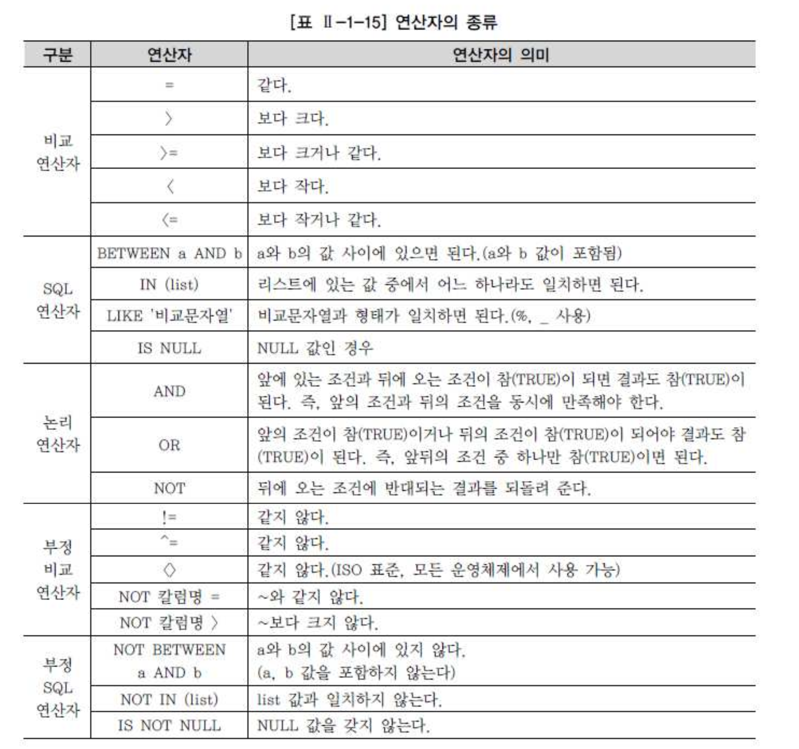

# 05. where


##  1) WHERE 조건절 개요

- 데이터를 가져오기 위해서는 SELECT 절과 FROM 절만을 사용하여 기본적인 SQL 문장을 구성한다면 자신이 원하는 자료만을 검색하기 위해서 SQL 문장에 WHERE 절을 이용하여 자료들에 대하여 제한할 수 있다.

- 현실의 데이터베이스는 많은 사용자나 프로그램들이 동시에 접속하여 다량의 트랜잭션을 발생하고 있다.
- WHERE 조건절을 사용하지 않고 필요 없는 많은 자료들을 데이터베이스로부터 요청하는 SQL 문장은 해당 데이터 베이스의 CPU와 메모리를 과다 사용하게 되어 성능을 저하 시키게 된다. 뿐만아니라 조건이 없는 SELECT문은 테이블을 전체(FTS) 를 읽게 되어 데이터의 양에 따라 성능을 저하 시키게 된다
- (FTS가 무조건 나쁜 것은 아니며 병렬 처리 등을 이용해 유용하게 사용하는 경우도 많다.)
- 그렇기 때문에 튜닝에 대해 1차적인 검토 대상이 된다.

```
 형식 : SELECT \[DISTINCT/ALL\] 칼럼명 \[ALIAS명\] FROM 테이블명 WHERE 조건식; |
```


###### WHERE 절은 FROM 절 다음에 위치하며, 조건식은 아래 내용으로 구성된다.

- 칼럼(Column)명 (보통 조건식의 좌측에 위치)
- 비교 연산자
- 문자, 숫자, 표현식 (보통 조건식의 우측에 위치)
- 비교 칼럼명 (JOIN 사용시)


## 2) 연상자의 종류

- 비교 연산자 (부정 비교 연산자 포함)
- SQL 연산자 (부정 SQL 연산자 포함)
- 논리 연산자 로 구성이 된다.




## 3) 비교연산자


- 소속팀이 삼성블루윙즈이거나 전남드래곤즈에 소속된 선수들이어야 하고, 포지션이 미드필더(MF:Midfielder)이어야 한다. 키는 170 센티미터 이상이고 180 이하여야 한다.

1. 소속팀코드 = 삼성블루윙즈팀 코드(K02)
2. 소속팀코드 = 전남드래곤즈팀 코드(K07)
3. 포지션 = 미드필더 코드(MF)
4. 키 > = 170 센티미터
5. 키 <= 180 센티미터


- 예제

```
SELECT PLAYER_NAME 선수이름   
     , POSITION 포지션   
     , BACK_NO 백넘버, HEIGHT 키   
  FROM PLAYER   
 WHERE TEAM_ID = K02; 
```

- 결과: 3행에 오류: ERROR: 열명이 부적합하다


- TEAM_ID라는 팀명의 데이터 타입은 CHAR(3)인데 비교 연산자 오른쪽에 K02의 값을 작은따옴표(' ')나 큰따옴표(" ")와 같은 인용 부호로 묶어서 처리하지 않았기 때문에 발생하는 에러이다.
- **VARCHAR, CHAR은 작은 따옴표나 큰따옴표를 묶어서 비교처리를 해야 한다.**
- 하지만 NUMERIC과 같은 숫자형 형태의 값은 인용부호를 사용하지 않는다.


- 예제

```
SELECT PLAYER_NAME 선수이름   
     , POSITION 포지션   
     , BACK_NO 백넘버   
     , HEIGHT 키   
  FROM PLAYER   
 WHERE HEIGHT >= 170; 
```

- 숫자 유형 칼럼의 경우 숫자로 변환이 가능한 문자열과 비교되면 상대 타입을 숫자 타입으로 바꾸어 비교한다.
- 예를 들면 (예제)의 WHERE HEIGHT >= 170 조건을 WHERE HEIGHT >= '170' 이라고 표현하더라도, HEIGHT라는 칼럼이 숫자 유형의 변수이므로 내부적으로 '170'이라는 문자열을 숫자 유형 170으로 바꾸어 처리한다.


## 4) SQL연산자

- 모든 데이터 타입에 대해서 연산이 가능한 4가지 종류


###### 1) BETWEEN 연산자

- 예제

```
SELECT PLAYER_NAME 선수이름   
     , POSITION 포지션   
     , BACK_NO 백넘버   
     , HEIGHT 키   
  FROM PLAYER   
 WHERE  HEIGHT BETWEEN 170 AND 180;
```

- BETWEEN a AND b는 범위에서 'a'와 'b'의 값을 포함하는 범위를 말하는 것이다.


###### 2) IN 연산자

- 예제

```
SELECT PLAYER_NAME 선수이름   
     , POSITION 포지션   
     , BACK_NO 백넘버   
     , HEIGHT 키   
  FROM PLAYER   
 WHERE  TEAM_ID IN ('K02','K07');
```


###### 3) LIKE연산자

- 예제

```
SELECT PLAYER_NAME 선수이름   
     , POSITION 포지션   
     , BACK_NO 백넘버   
     , HEIGHT 키   
  FROM PLAYER   
 WHERE POSITION LIKE 'MF';
```

- LIKE의 사전적 의미는 '~와 같다'이다. 따라서 위와 같은 경우라면 비교 연산자인 '='을 사용해서 작성해도동일한 결과를 얻을 수 있을 것이다.
- 그러나 MF가 들어가 있는 글자를 검색 할때는 검색 내용에 따라 **와일드카드** 문자를 사용해야 한다.


###### 4) IS NULL

- 존재하지 않는 확정되지 않은 값을 표현할 때 사용하며 비교연산자와 달리 비교 자체가 불가능하다.

- NULL 값과의 수치연산은 NULL 값을 리턴한다.
- NULL 값과의 비교연산은 거짓(FALSE)을 리턴한다.
- 어떤 값과 비교할 수도 없으며, 특정 값보다 크다, 적다라고 표현할 수 없다.

- 예제: 잘못된 사례

```
SELECT PLAYER_NAME 선수이름   
     , POSITION 포지션   
     , BACK_NO 백넘버   
     , HEIGHT 키   
  FROM PLAYER   
 WHERE  POSITION = NULL;   
```

- 결과) 선택된 레코드가 없다.
- POSITION = NULL을 사용했는데 문법 에러가 나지는 않았지만 WHERE 절의 조건이 거짓(FALSE)이 되어 WHERE 절의 조건을 만족하는 데이터를 한건도 얻지 못하게 된 것으로 의미 없는 SQL이 되고 말았다.


- 예제:수정한 SQL

```
SELECT PLAYER_NAME 선수이름  
     , POSITION 포지션   
     , BACK_NO 백넘버   
     , HEIGHT 키   
  FROM PLAYER   
 WHERE  POSITIONIS NULL;
```


## 5) 논리연산자

- 조건들을 논리적으로 연결시키기 위해서 사용되는 연산자라고 생각하면 된다.


- 예제) AND 연산자

```
 SELECT PLAYER_NAME 선수이름  
      , POSITION 포지션  
      , BACK_NO 백넘버  
      , HEIGHT 키  
   FROM PLAYER  
  WHERE TEAM_ID = 'K02'  
    AND HEIGHT >= 170; 
```


- OR 연산자

```
 SELECT PLAYER_NAME 선수이름  
      , POSITION 포지션  
      , BACK_NO 백넘버  
      , HEIGHT 키  
   FROM PLAYER  
  WHERE (TEAM_ID = 'K02'  
     OR BACK_NO = 1)  
    AND HEIGHT >= 170; 
 
```


## 6) 부정연산자

- 비교 연산자, SQL 비교 연산자에 대한 부정 표현을 부정 논리 연산자, 부정 SQL 연산자로 구분할 수 있다.


- 예제1)

```
 SELECT PLAYER_NAME 선수이름  
      , POSITION 포지션  
      , BACK_NO 백넘버  
      , HEIGHT 키  
   FROM PLAYER  
  WHERE TEAM_ID = 'K02'  
    AND NOT POSITION = 'MF'  
    AND NOT HEIGHT BETWEEN 175 AND 185; 
 
```


- 예제2

```
 SELECT PLAYER_NAME 선수이름  
      , POSITION 포지션  
      , BACK_NO 백넘버  
      , HEIGHT 키  
   FROM PLAYER  
  WHERE TEAM_ID = 'K02'  
    AND POSITION <> 'MF'  
    AND HEIGHT NOT BETWEEN 175 AND 185; 
```


- 예제3)

```
 SELECT PLAYER_NAME 선수이름  
      , NATION 국적  
   FROM PLAYER  
  WHERE NATION IS NOT NULL; 
```


## 7) ROWNUM, TOP 사용

- SQL 처리 결과 집합의 각 행에 대해 임시로 부여되는 일련번호이며, 테이블이나 집합에서 원하는 만큼의 행만 가져오고 싶을 때 WHERE 절에서 행의 개수를 제한하는 목적으로 사용한다.


###### 1) ROWNUM

- 한건을 가져올 경우
  - SELECT PLAYER_NAME FROM PLAYER WHERE ROWNUM = 1;
  - SELECT PLAYER_NAME FROM PLAYER WHERE ROWNUM <= 1;
  - SELECT PLAYER_NAME FROM PLAYER WHERE ROWNUM < 2;


- N개 이상의 건을 가져올 경우
  - SELECT PLAYER_NAME FROM PLAYER WHERE ROWNUM <= N;
  - SELECT PLAYER_NAME FROM PLAYER WHERE ROWNUM < N + 1


###### 2) TOP 절

- SQL Server는 TOP 절을 사용하여 결과 집합으로 출력되는 행의 수를 제한할 수 있다.

```
 형식 TOP (Expression)  \[PERCENT\]  \[WITH TIES\]  
```

- Expression: 반환할 행의 수를 지정하는 숫자이다.
- PERCENT: 쿼리 결과 집합에서 처음 Expression%의 행만 반환됨을 나타낸다
- WITH TIES: ORDER BY 절이 지정된 경우에만 사용할 수 있으며 TOP N(PERCENT)의 마지막 행과 같은 값이 있는 경우 추가 행이 출력되도록 지정


- 한건을 가져올 경우
  - SELECT TOP(1) PLAYER_NAME FROM PLAYER; 처럼 사용할 수 있다.

- N개 이상의 건을 가져올 경우
  - SELECT TOP(N) PLAYER_NAME FROM PLAYER;

- ORDER BY 를 사용 하지 않으면 ROWNUM과 TOP은 같은 기능을 사용 하지만 사용 하게 되면 기능의 차이가 발생 하게 된다.
