# 06. 함수


## 1) 내장 함수(BUILT-IN FUNCTION) 개요

- 다양한 기준으로 분류를 할수 있는데 밴더에서 제공하는 함수인 내장 함수(Built-in Function)와 사용자가 정의할 수 있는 함수(User Defined Function)로 나눌 수 있다.
- 내장 함수는 다시 함수의 입력 값이 단일행 값이 입력되는 단일행 함수(Single-Row Function)와 여러 행의 값이 입력되는 다중행 함수(Multi-Row Function)로 나눌 수 있다. 다중행 함수는 다시 집계 함수(Aggregate Function), 그룹 함수(Group Function), 윈도우 함수(Window Function)로 나눌 수 있다.

형식: 함수명 (칼럼이나 표현식 [, Arg1, Arg2, ... ])


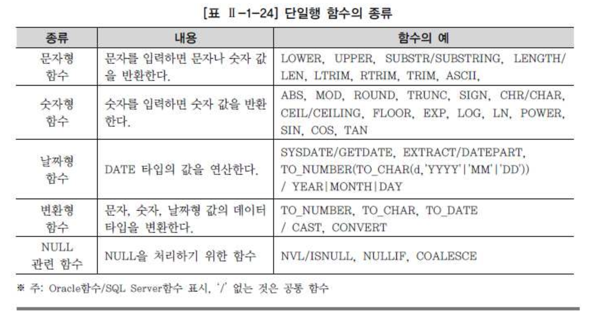


### 2. 문자형 함수

- SELECT, WHERE, ORDER BY 절에 사용 가능하다.
- 각 행(Row)들에 대해 개별적으로 작용하여 데이터 값들을 조작하고, 각각의 행에 대한 조작 결과를 리턴한다.
- 여러 인자(Argument)를 입력해도 단 하나의 결과만 리턴한다.
- 함수의 인자(Arguments)로 상수, 변수, 표현식이 사용 가능하고, 하나의 인수를 가지는 경우도 있지만 여러 개의 인수를 가질 수도 있다.
- 특별한 경우가 아니면 함수의 인자(Arguments)로 함수를 사용하는 함수의 중첩이 가능하다.


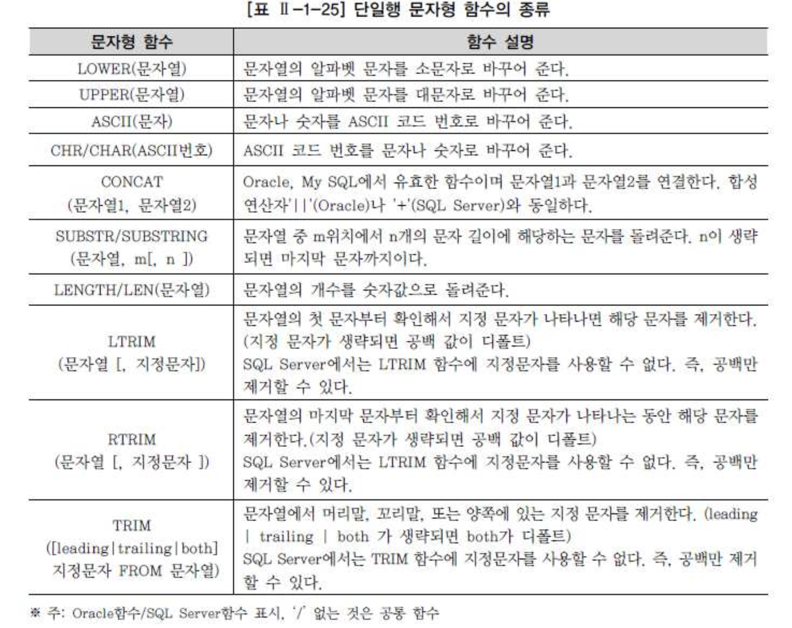


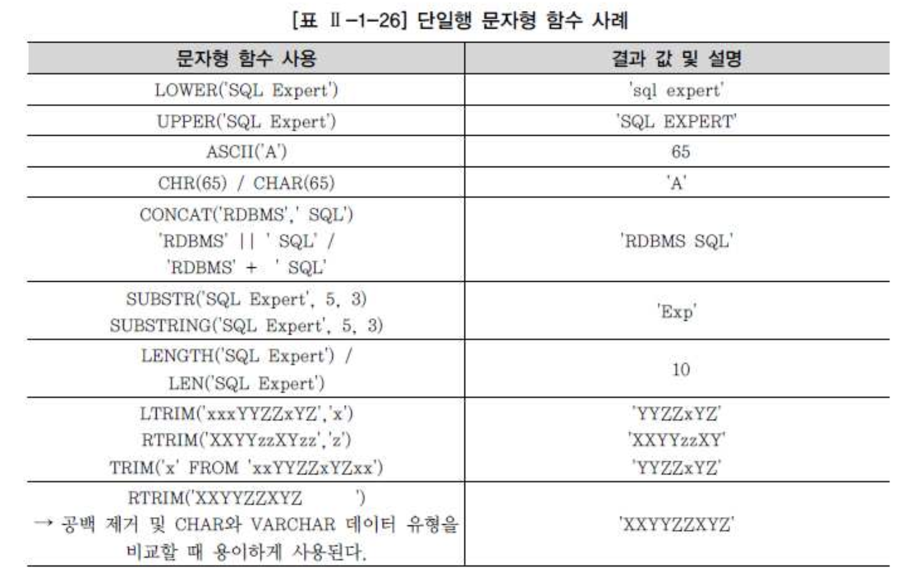


- SQL Expert'라는 문자형 데이터의 길이를 구하는 문자형 함수를 사용한다.
- 예제

```sql
-- 오라클
SELECT LENGTH('SQL Expert')   
  FROM DUAL;
  
 LENGTH('SQL Expert')  
---------------------  
                   10
      
 -- SQL SERVER 
SELECT LEN( 'SQL Expert')   
  FROM DUAL;  

 LENGTH('SQL Expert')  
---------------------  
                   10
```


###### DUAL 테이블

- 사용자 SYS가 소유하며 모든 사용자가 액세스 가능한 테이블이다.
- SELECT ~ FROM ~ 의 형식을 갖추기 위한 일종의 DUMMY 테이블이다.
- DUMMY라는 문자열 유형의 칼럼에 'X'라는 값이 들어 있는 행을 1건 포함하고 있다.


## 3) 숫자형 함수

- 숫자형 함수는 숫자 데이터를 입력받아 처리하고 숫자를 리턴하는 함수이다.


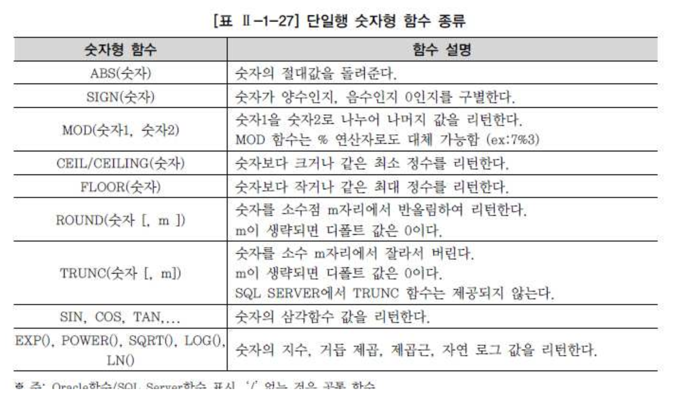


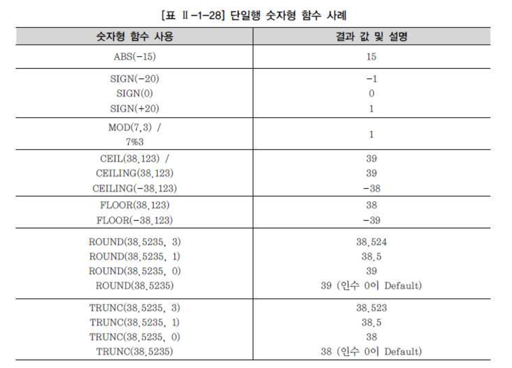


## 4) 날짜형 함수

- 날짜형 함수는 DATE 타입의 값을 연산하는 함수이다.
- Oracle의 TO_NUMBER(TO_CHAR( )) 함수의 경우 변환형 함수로 구분할 수도 있으나 SQL Server의 YEAR, MONTH,DAY 함수와 매핑하기 위하여 날짜형 함수에서 설명한다.


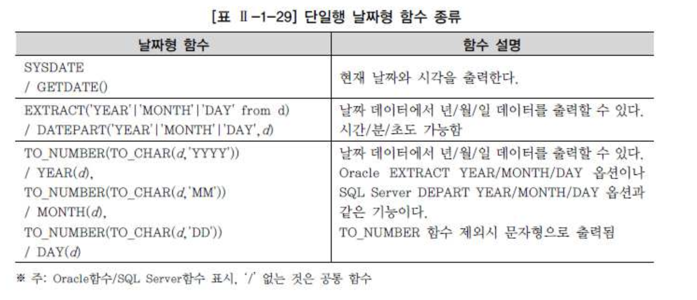


- 데이터베이스는 날짜를 저장할 때 내부적으로 세기(Century), 년(Year), 월(Month), 일(Day), 시(Hours), 분(Minutes), 초(Seconds)와 같은 숫자 형식으로 변환하여 저장한다.
- 덧셈, 뺄셈 같은 산술 연산자로도 계산이 가능하다.


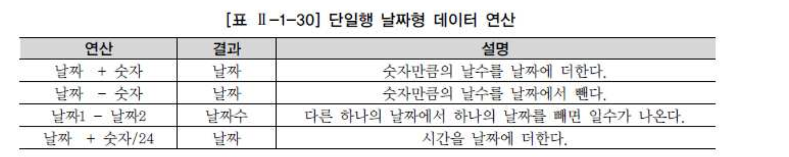


- **예제)**

```sql
 SELECT SYSDATE FROM DUAL; => 12/07/18  
 SELECT GETDATE() AS CURRENTTIME; => 2012-07-18 13:10:02.047  
 
-- 오라클 함수  
 SELECT EXTRACT(YEAR FROM HIREDATE)  입사년도  
      , EXTRACT(MONTH FROM HIREDATE) 입사월  
      , EXTRACT(DAY FROM HIREDATE)   입사일  
   FROM EMP;
 
-- SQL SERVER  
 SELECT DATEPART(YEAR, HIREDATE)  입사년도  
      , DATEPART(MONTH, HIREDATE) 입사월  
      , DATEPART(DAY, HIREDATE)   입사일  
   FROM EMP;  

-- 결과
ENAME  HIREDATE  입사년도 입사월 입사일  
------ --------- ------ ---- -----  
 SMITH 1980-12-17 1980    12   17  
 ALLEN 1981-02-20 1981     2   20  
 WARD  1981-02-22 1981     2   22

```


## 5) 변환형 함수

- 변환형 함수는 특정 데이터 타입을 다양한 형식으로 출력하고 싶을 경우에 사용되는 함수이다.

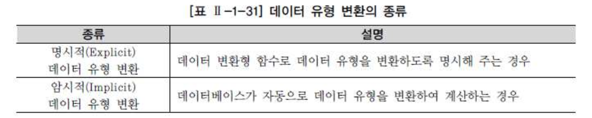


- 암시적 데이터 유형 변환의 경우 성능 저하가 발생할 수 있으며, 자동적으로 데이터베이스가 알아서 계산하지 않는 경우가 있어 에러를 발생할 수 있으므로 명시적인 데이터 유형 변환 방법을 사용하는 것이 바람직하다.
- 명시적 데이터 유형 변환에 사용되는 대표적인 변환형 함수는 다음과 같다.

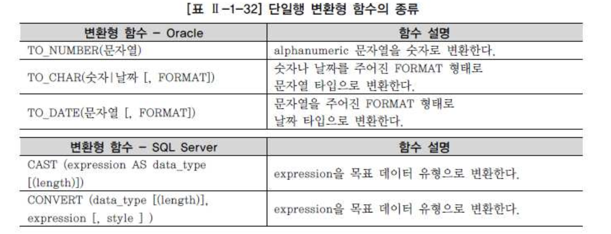


- 변환형 함수를 사용하여 출력 형식을 지정할 때, 숫자형과 날짜형의 경우 상당히 많은 포맷이 벤더별로 제공된다. 벤더별 데이터 유형과 함께 데이터 출력의 포맷 부분은 벤더의 고유 항목이 많으므로 매뉴얼을 참고
- 예제) 날짜 표시

```sql
-- ORACLE     
SELECT TO_CHAR(SYSDATE, 'YYYY/MM/DD') 날짜  
     , TO_CHAR(SYSDATE, 'YYYY. MON, DAY') 문자형  
  FROM DUAL;  
   
결과) 2012-07-19 2012. 7월 , 월요일  
   
   
-- SQL Server  
SELECT CONVERT(VARCHAR(10),GETDATE(),111) AS CURRENTDATE  
   
결과) 2012/07/19  


-- 금액을 달러와 원화로 표시)  
-- Oracle  
SELECT TO_CHAR(123456789/1200,'$999,999,999.99') 환율반영달러  
     , TO_CHAR(123456789,'L999,999,999') 원화 -- 칼럼의 L999에서 L은 로칼 화폐 단위를 의미한다.  
 FROM DUAL ;   
   
결과) $102,880.66 , 123,456,789     


-- 숫자형 변환 후 덧셈)  
-- 팀(TEAM) 테이블의 ZIP 코드1과 ZIP 코드2를 숫자로 변환한 후 두 항목을 더한 숫자를 출력한다.  
-- 데이터)  
1. ZIP_CODE1 데이터: 700, 500, 800  
2. ZIP_CODE2 데이터: 50, 92, 40  

--Oracle  
SELECT TEAM_ID  
     , TO_NUMBER(ZIP_CODE1,'999') + TO_NUMBER(ZIP_CODE2,'999') 우편번호합  
  FROM TEAM;  
   
결과) 750, 592, 840  

--SQL Server  
SELECT TEAM_ID  
     , CAST(ZIP_CODE1 AS INT) + CAST(ZIP_CODE2 AS INT) 우편번호합  
 FROM TEAM; 

결과) 750, 592, 840 
    
```


## 6) CASE 표현

- IF-THEN-ELSE 논리와 유사한 방식으로 표현식을 작성해서 SQL의 비교 연산 기능을 보완하는 역할을 한다.


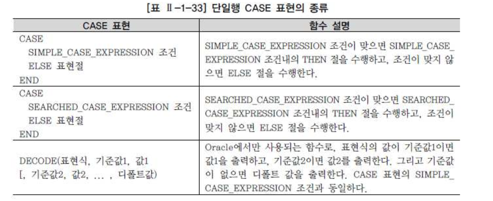

#### SIMPLE_CASE_EXPRESSION 표현방식

- CASE 다음에 바로 조건에 사용되는 칼럼이나 표현식을 표시( EQUI(=) 조건을 사용 하지 않음)
- 예)

```sql
SELECT LOC  
     , CASE LOC WHEN 'NEW YORK' THEN 'EAST'  
                WHEN 'BOSTON'   THEN 'EAST'  
                WHEN 'CHICAGO'  THEN 'CENTER'  
                WHEN 'DALLAS'   THEN 'CENTER'  
                ELSE   'ETC'  
                END AS AREA  
FROM DEPT;
```


#### SEARCHED_CASE_EXPRESSION 표현방식

- CASE 다음에 바로 조건에 사용되는 칼럼이나 표현식을 표시 하지 않고 EQUI(=) 조건을 사용함
- 예)

```
SELECT ENAME  
     , CASE WHEN SAL >= 3000 THEN 'HIGH'  
            WHEN SAL >= 1000 THEN 'MID'  
            ELSE 'LOW'  
            END AS  SALARY_GRADE   
  FROM EMP;    
```


- CASE 표현은 함수의 성질을 가지고 있으므로, 다른 함수처럼 중첩해서 사용할 수 있다

```sql
 SELECT ENAME  
      , SAL  
      , CASE WHEN SAL >= 2000 THEN 1000  
        ELSE (CASE WHEN SAL >= 1000 THEN 500  
                                    ELSE 0  
                                    END)  
        END as BONUS  
 FROM EMP;  
```


## 7) NULL관련 함수


### NVL/ISNULL 함수

- NULL 특성
  - 값이 정해져 있지 않으므로 0 , 공백, ""와는 다르다.(0:숫자, 공백:문자, "":문자)
  - 테이블 생성시 PK 혹은 NOT NULL 컬럼 이외에는 모든 데이터 유형은 NULL 값을 가질수 있다.
  - NULL값을 포함한 연산을 할 경우 결과 값도 NULL이다.
  - NULL 값이 아닌 값을 얻고자 할때는 NVL, ISNULL 함수를 사용 해야 한다.


- NULL을 포함한 데이터 연산

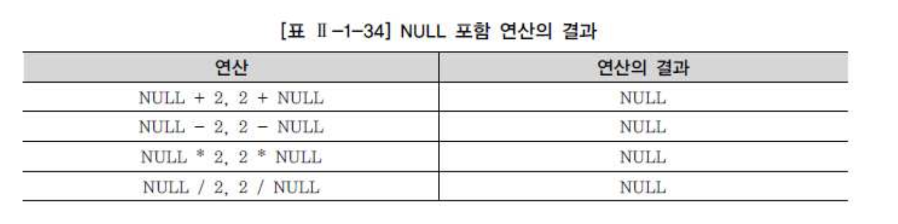

- NVL/ISNULL 함수를 유용하게 사용하는 예는 산술적인 계산에서 데이터 값이 NULL일 경우이다.
- 칼럼 간 계산을 수행하는 경우 NULL 값이 존재하면 해당 연산 결과가 NULL 값이 되므로 원하는 결과를 얻을 수 없는 경우가 발생한다.
- 이런 경우는 NVL 함수를 사용하여 숫자인 0(Zero)으로 변환을 시킨 후 계산을 해서 원하는 데이터를 얻는다.


```sql
-- ORACLE 
SELECT PLAYER_NAME 선수명  
     , POSITION  
     , NVL(POSITION,'없음') 포지션  
  FROM PLAYER  
 WHERE TEAM_ID = 'K08'  


-- SQLSERVER  
SELEC PLAYER_NAME 선수명  
    , POSITION  
    , ISNULL(POSITION,'없음') 포지션  
 FROM PLAYER  
WHERE TEAM_ID = 'K08' 
```


#### CASE 표현

- NVL 함수와 ISNULL 함수를 사용한 SQL 문장은 벤더 공통적으로 CASE 문장으로 표현

```sql
SELECT PLAYER_NAME 선수명  
     , POSITION  
     , CASE WHEN POSITION IS NULL THEN '없음'  
            ELSE POSITION  
           END AS 포지션  
FROM PLAYER  
WHERE TEAM_ID = 'K08'  
```


#### NULL과 공집합

- 데이터 조건이 한건도 없는 경우를 공집합이라고 하지만 NULL값 데이터와는 다르게 이해해야 한다.

  `SELECT MGR FROM EMP WHERE ENAME='KING';`

- 위의 쿼리에서 ENAME이 KING인 사람은 존재를 하나 MGR의 데이터의 값이 없는 경우 공집합에 해당하지 않는다. ds


#### 공집합의 NVL/ISNULL 함수 사용

- STEP1
  - SELECT MGR FROM EMP WHERE ENAME='KANKAN';
  - 위의 데이터를 검색시 KANKAN의 이름을 가진 사람이 없는 경우(데이터를 찾을 수 없는 경우)이는 공집합에 해당한다.


- STEP2
  - SELECT NVL(MGR,'9999') FROM EMP WHERE ENAME='KANKAN';
  - KANKAN의 이름을 가진 사람이 존재 하지 않으므로 데이터 내용은 출력 되지 않는다.(ISNULL/NVL은 값의 대상을 바꾸는 값이므로..)


- STEP3
  - SELECT NVL(MAX(MGR),'9999') FROM EMP WHERE ENAME='KANKAN';
  - MAX의 값으로 검색을 할 경우 ENAME에서 KANKAN의 이름을 가진 사람이 없더라도 MAX 그룹 함수를 이용하여 NULL값을 출력 하였다.
  - (1개의 레코드를 출력 하였다) 그 후 NULL 값을 NVL로 이용하여 9999로 치완하였으며 레코드 한건인 '9999' 가 출력 되었다.


- Oracle의 SQL*PLUS 같이 화면에서 데이터베이스와 직접 대화하는 환경이라면, 화면상에서 "데이터를 찾을 수 없다."라는 문구로 공집합을 구분할 수 있지만, 다른 개발 언어 내에 SQL 문장이 포함된 경우에는 NULL과 공집합을 쉽게 구분하기 힘들다.


### NULLIF

- NULLIF 함수는 EXPR1이 EXPR2와 같으면 NULL을, 같지 않으면 EXPR1을 리턴한다.

   `SELECT ENAME, EMPNO, MGR, NULLIF(MGR,7698) NUIF FROM EMP;`

- MGR의 데이터 값이 7698과 같은 경우는 NULL값을 출력 한다.


### 기타 NULL 관련 함수 (COALESCE)

- `COALESCE` 함수는 인수의 숫자가 한정되어 있지 않으며, NULL이 아닌 최초의 EXPR을 나타낸다. 만일 모든 EXPR이 NULL이라면 NULL을 리턴한다.

  `SELECT ENAME, COMM, SAL, COALESCE(COMM, SAL) COAL FROM EMP;`

- COMM의 값이 NULL이면 SAL을 비교하며 SAL값도 NULL인 경우 NULL를 리턴한다. 단 NULL값이 아닌 경우는 해당 컬럼의 값을 리턴한다.