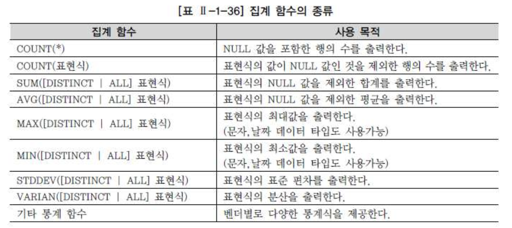

# 07. groupby, having


## 1) 집계 함수(Aggregate Function)

- 여러 행들의 그룹이 모여서 그룹당 단 하나의 결과를 돌려주는 다중행 함수 중 집계 함수(Aggregate Function)의 특성은 다음과 같다.
  - 여러 행들의 그룹이 모여서 그룹당 단 하나의 결과를 돌려주는 함수
  - GROUP BY 절은 행들을 소그룹화 한다.

- SELECT 절, HAVING 절, ORDER BY 절에 사용할 수 있다.


집계 함수명 ( DISTINCT 칼럼이나 표현식 )


- ALL : Default 옵션이므로 생략 가능함
- DISTINCT : 같은 값을 하나의 데이터로 간주할 때 사용하는 옵션임


- 자주 사용되는 주요 집계 함수들은 다음과 같다.


예) 전체 테이블 집계(GROUP BY 생략)

```sql
 SELECT COUNT(*)             "전체 행수"  
      , COUNT(HEIGHT)        "키 건수"  
      , MAX(HEIGHT)          "최대키"  
      , MIN(HEIGHT)          "최소키"  
      , ROUND(AVG(HEIGHT),2) "평균키"  
   FROM PLAYER; 
```


## 2) GROUP BY 절

- WHERE 절을 통해 조건에 맞는 데이터를 조회했지만 테이블에 1차적으로 존재하는 데이터 이외의 정보, 예를 들면 각 팀별로 선수가 몇 명인지, 선수들의 평균 신장과 몸무게가 얼마나 되는지, 또는 각 팀에서 가장 큰 키의 선수가 누구인지 등의 2차 가공 정보도 필요하다.


- 형식

```sql
 SELECT  [DISTINCT] 칼럼명  [ALIAS명]  
 FROM 테이블명  
  [WHERE 조건식 ]  
  [GROUP BY 칼럼(Column)이나 표현식]  
  [HAVING 그룹조건식];
```


###### GROUP BY 절과 HAVING 절의 특징

- GROUP BY 절을 통해 소그룹별 기준을 정한 후, SELECT 절에 집계 함수를 사용
- 집계 함수의 통계 정보는 NULL 값을 가진 행을 제외하고 수행한다.
- GROUP BY 절에서는 SELECT 절과는 달리 ALIAS 명을 사용불가
- 집계 함수는 WHERE 절에는 올 수 없다. (집계 함수를 사용할 수 있는 GROUP BY 절보다 WHERE 절이 먼저 수행)
- WHERE 절은 전체 데이터를 GROUP으로 나누기 전에 행들을 미리 제거시킨다.
- HAVING 절은 GROUP BY 절의 기준 항목이나 소그룹의 집계 함수를 이용한 조건을 표시할 수 있다.
- GROUP BY 절에 의한 소그룹별로 만들어진 집계 데이터 중, HAVING 절에서 제한 조건을 두어 조건을 만족하는 내용만 출력한다.
- HAVING 절은 일반적으로 GROUP BY 절 뒤에 위치한다.


- 일부 데이터베이스의 과거 버전에서 GROUP BY 절에 명시된 칼럼의 순서대로 오름차순 정렬을 자동으로 정렬(비공식적인 지원이었음)하는 경우가 있었으나, 원칙적으로 관계형 데이터베이스 환경에서는 ORDER BY 절을 명시해야 데이터 정렬이 수행된다.
- ANSI/ISO 기준에서도 데이터 정렬에 대한 내용은 ORDER BY 절에서만 언급되어있지, GROUP BY 절에는 언급되어 있지 않다.


- 예) 잘못된 쿼리-수정전

```sql
 SELECT POSITION             포지션  
      , COUNT(*)             인원수  
      , COUNT(HEIGHT)        키대상  
      , MAX(HEIGHT)          최대키  
      ,  MIN(HEIGHT)         최소키  
      , ROUND(AVG(HEIGHT),2) 평균키  
   FROM PLAYER  
```

- 결과) 오류: ERROR: 단일 그룹의 집계 함수가 아니다.
  - GROUP BY 절에서 그룹 단위를 표시해 주어야 SELECT 절에서 그룹 단위의 칼럼과 집계 함수를 사용할 수 있다.

- 그렇지 않으면 예제와 같이 에러를 발생하게 된다.


- 예) 잘못된쿼리-수정 후

```sql
SELECT POSITION             포지션  
    , COUNT(*)             인원수  
    , COUNT(HEIGHT)        키대상  
    , MAX(HEIGHT)          최대키  
    , MIN(HEIGHT)          최소키 
    , ROUND(AVG(HEIGHT),2) 평균키  
 FROM PLAYER  
GROUP BY POSITION;   
```

- ORDER BY 절이 없기때문에 포지션으로 정렬되지 않았지만 포지션 별로 인워수, 키대상, 최대키, 최소키, 평균키에 대한 그룹 내용을 출력 하고 있다.


## 3) HAVING 절

- 예) 잘못된쿼리-수정전

```sql
SELECT POSITION             포지션  
     , ROUND(AVG(HEIGHT),2) 평균키  
  FROM PLAYER  
 WHERE AVG(HEIGHT) >= 180          
 GROUP BY POSITION;   

* - - * 3행에 오류: ERROR: 집계 함수는 허가되지 않는다.*  
```

- 위의 쿼리를 보면 POSITION 별로 평큔키가 180 이상인 사람에 대해서 출력을 하기 위해 작성 하였으나 WHERE 절에서는 집계 함수는 허가 되지 않는다.
- 그 이유는 먼저 WHERE 절의 조건절이 먼저 적용이 된 후 GROUP 절이 실행이 되므로 WHERE절에 있는 집계 함수는 사용 할 수 없게 된다.이때는 HAVING 절에서 집계 함수에 조건을 작성 하면 된다.


- 예) 잘못된쿼리-수정후

```sql
SELECT POSITION             포지션  
     , ROUND(AVG(HEIGHT),2) 평균키  
  FROM PLAYER  
 GROUP BY POSITION;  
HAVING AVG(HEIGHT) >= 180  
```

- 만일 위의 쿼리에서 GROUP BY 와 HAVING 절의 순서를 바꾼다면?
- GROUP BY 절과 HAVING 절의 순서를 바꾸어서 수행하더라도 문법 에러도 없고 결과물도 동일한 결과를 출력한다.
- 그렇지만, SQL 내용을 보면, 포지션이란 소그룹으로 그룹핑(GROUPING)되어 통계 정보가 만들어지고, 이후 적용된 결과 값에 대한 HAVING 절의 제한 조건에 맞는 데이터만을 출력하는 것이므로 논리적으로 **GROUP BY 절과 HAVING 절의 순서를 지키는 것을 권고한다.**
- (**단 SQL SERVER는 반드시 GROUP BY 와 HAVING 절의 순서를 지켜야 한다**)


## 4) CASE 표현을 활용한 월별 데이터 집계

- 집계 함수(CASE( ))~GROUP BY" 기능은, 모델링의 제1정규화로 인해 반복되는 칼럼의 경우 구분 칼럼을 두고 여러 개의 레코드로 만들어진 집합을, 정해진 칼럼 수만큼 확장해서 집계 보고서를 만드는 유용한 기법이다.
- 부서별로 월별 입사자의 평균 급여를 알고 싶다는 고객의 요구사항이 있는데, 입사 후 1년마다 급여 인상이나 보너스 지급과 같은 일정이 정기적으로 잡힌다면 업무적으로 중요한 정보가 될 수 있다.
- **STEP 1 월별 데이터를 추출하는 작업을 진행한다. 이 단계는 월별 정보가 있다면 생략 가능하다.**

```sql
 SELECT ENAME, DEPTNO, EXTRACT(MONTH FROM HIREDATE) 입사월, SAL FROM EMP;    -- ORACLE  
 SELECT ENAME, DEPTNO, DATEPART(MONTH, HIREDATE)    입사월, SAL FROM EMP;    --SQL SERVER  
 SELECT ENAME, DEPTNO, MONTH(HIREDATE)              입사월, SAL FROM EMP;    --SQL SERVER
```


- **STEP 2 월별 데이터 구분**

```sql
SELECT ENAME
     , DEPTNO
     , CASE MONTH WHEN   1 THEN SAL END M01
     , CASE MONTH WHEN   2 THEN SAL END M02
     , CASE MONTH WHEN   3 THEN SAL END M03
     , CASE MONTH WHEN   4 THEN SAL END M04
     , CASE MONTH WHEN   5 THEN SAL END M05
     , CASE MONTH WHEN   6 THEN SAL END M06
     , CASE MONTH WHEN   7 THEN SAL END M07
     , CASE MONTH WHEN   8 THEN SAL END M08
     , CASE MONTH WHEN   9 THEN SAL END M09
     , CASE MONTH WHEN  10 THEN SAL END M10
     , CASE MONTH WHEN  11 THEN SAL END M11
     , CASE MONTH WHEN 12 THEN SAL END M12  
  FROM 
     ( SELECT ENAME  
            , DEPTNO  
            , EXTRACT(MONTH FROM HIREDATE) MONTH  
            , SAL  
          FROM EMP  
     )
;
```


- **STEP3. 부서별 데이터 집계**

```sql
SELECT DEPTNO,  
       AVG(CASE MONTH WHEN   1 THEN SAL END) M01,  
       AVG(CASE MONTH WHEN   2 THEN SAL END) M02,  
       AVG(CASE MONTH WHEN   3 THEN SAL END) M03,  
       AVG(CASE MONTH WHEN   4 THEN SAL END) M04,  
       AVG(CASE MONTH WHEN   5 THEN SAL END) M05,  
       AVG(CASE MONTH WHEN   6 THEN SAL END) M06,  
       AVG(CASE MONTH WHEN   7 THEN SAL END) M07,  
       AVG(CASE MONTH WHEN   8 THEN SAL END) M08,  
       AVG(CASE MONTH WHEN   9 THEN SAL END) M09,  
       AVG(CASE MONTH WHEN 10 THEN SAL END) M10,  
       AVG(CASE MONTH WHEN 11 THEN SAL END) M11,  
       AVG(CASE MONTH WHEN 12 THEN SAL END) M12  
 FROM 
    (
      SELECT ENAME  
           , DEPTNO  
           , EXTRACT(MONTH FROM HIREDATE) MONTH  
           , SAL  
        FROM EMP  
    )  
GROUP BY DEPTNO  


-- DECODE    
SELECT DEPTNO,  
       AVG(DECODE( MONTH ,   1 , SAL )) M01,  
       AVG(DECODE( MONTH ,   2 , SAL )) M02,  
       AVG(DECODE( MONTH ,   3 , SAL )) M03,  
       AVG(DECODE( MONTH ,   4 , SAL )) M04,  
       AVG(DECODE( MONTH ,   5 , SAL )) M05,  
       AVG(DECODE( MONTH ,   6 , SAL )) M06,  
       AVG(DECODE( MONTH ,   7 , SAL )) M07,  
       AVG(DECODE( MONTH ,   8 , SAL )) M08,  
       AVG(DECODE( MONTH ,   9 , SAL )) M09,  
       AVG(DECODE( MONTH , 10 , SAL )) M10,  
       AVG(DECODE( MONTH , 11 , SAL )) M11,  
       AVG(DECODE( MONTH , 12 , SAL )) M12  
 FROM
    (  
      SELECT DEPTNO  
           , EXTRACT(MONTH FROM HIREDATE) MONTH  
           , SAL  
        FROM EMP  
    )  
GROUP BY DEPTNO
```

- 하나의 데이터에 여러 번 CASE 표현을 사용하고 집계 함수가 적용되므로 SQL 처리 성능 측면에서 나쁜 것이 아니냐는 생각을 할 수도 있지만, 같은 기능을 하는 리포트를 작성하기 위해 장문의 프로그램을 코딩 하는 것에 비해, 위의 방법을 사용 하면 복잡한 프로그램이 아닌 하나의 SQL 문장으로 처리 가능하므로 DBMS 자원 활용이나 처리 속도에서 훨씬 효율적이다.
- 데이터의 건수가 많아질수록 처리 속도의 차이는 더 크질 수 있다. 개발자들은 가능한 하나의 SQL 문장으로 비즈니스적인 요구 사항을 처리할 수 있도록 노력해야 한다.


## 5) 집계 함수와 NULL

- 리포트의 빈칸을 NULL이 아닌 ZERO로 표현하기 위해 NVL(Oracle)/ISNULL(SQL Server) 함수를 사용하는 경우가 많은데, 다중 행 함수를 사용하는 경우는 오히려 불필요한 부하가 발생하므로 굳이 NVL 함수를 다중 행 함수 안에 사용할 필요가 없다.
- 다중 행 함수는 입력 값으로 전체 건수가 NULL 값인 경우만 함수의 결과가 NULL이 나오고 전체 건수 중에서 일부만 NULL인 경우는 NULL인 행을 다중 행 함수의 대상에서 제외한다.
- SUM(CASE MONTH WHEN 1 THEN SAL ELSE 0 END)처럼 ELSE 절에서 0(Zero)을 지정하면 불필요하게 0이 SUM 연산에 사용되므로 자원의 사용이 많아진다.
- 하나가 Oracle의 SUM(NVL(SAL,0)), SQL Server의 SUM(ISNULL (SAL,0)) 연산이다. 개별 데이터의 급여(SAL)가 NULL인 경우는 NULL의 특성으로 자동적으로 SUM 연산에서 빠지는 데, 불필요하게 NVL/ISNULL 함수를 사용해 0(Zero)으로 변환시켜 데이터 건수만큼의 연산이 일어나게 하는 것은 시스템의 자원을 낭비하는 일이다.


- 예제) SIMPLE_CASE_EXPRESSION 조건

```sql
SELECT TEAM_ID  
    , NVL(SUM(CASE POSITION WHEN 'FW' THEN 1 ELSE 0 END),0) FW  -- 불필요한 연산이 일어남  
      -- SUM은 NULL을 제외 하고 합산 하므로 SUM안이 아닌 밖에 NVL를 사용 하여 건수들 만큼 자원의 낭비를 줄임  
    , NVL(SUM(CASE POSITION WHEN 'MF' THEN 1 END),0) MF    
      -- SQL  SERVER로 변경 하고자 할 경우 ISNULL(SUM(CASE POSITION WHEN 'DF' THEN 1 END),0) DF
    , NVL(SUM(CASE POSITION WHEN 'DF' THEN 1 END),0) DF      
      -- SEARCHED_CASE_EXPRESSION 표현 NVL(SUM(CASE POSITION = 'GK' THEN 1 END),0)  GK  
    , NVL(SUM(CASE POSITION WHEN 'GK' THEN 1 END),0) GK  
    , COUNT(*)   SUM  
 FROM PLAYER  
GROUP BY TEAM_ID;
```

