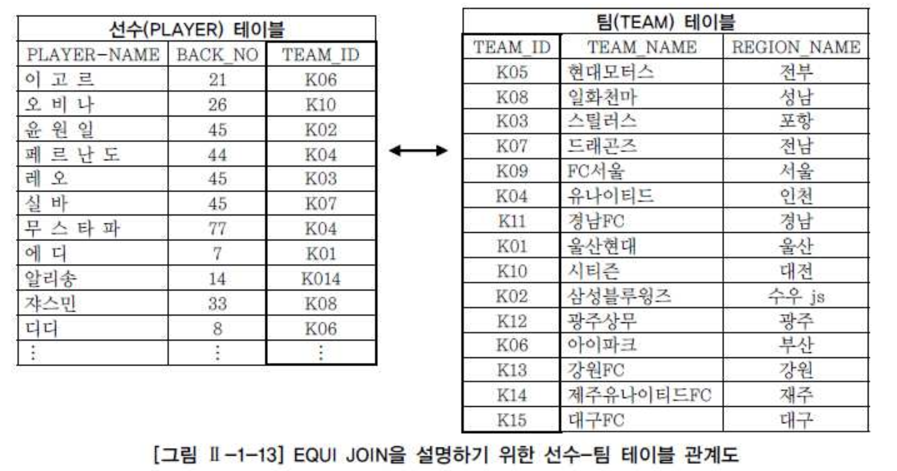

# 09. 조인


##  1) JOIN 의 개요

- 두 개 이상의 테이블 들을 연결 또는 결합하여 데이터를 출력하는 것을 JOIN이라고 하며, 일반적으로 사용되는 SQL 문장의 상당수가 JOIN이라고 생각하면 JOIN의 중요성을 이해하기 쉬울 것이다.
- JOIN은 관계형 데이터베이스의 가장 큰 장점이면서 대표적인 핵심 기능이라고 할 수 있다.
- 일반적인 경우 행들은 PRIMARY KEY(PK)나 FOREIGN KEY(FK) 값의 연관에 의해 JOIN이 성립된다. 하지만 어떤 경우에는 이러한 PK, FK의 관계가 없어도 논리적인 값들의 연관만으로 JOIN이 성립 가능하다.
- FROM 절에 여러 테이블이 나열되더라도 SQL에서 데이터를 처리할 때는 단 두 개의 집합 간에만 조인이 일어난다는 것이다.
- FROM 절에 A, B, C 테이블이 나열되었더라도 특정 2개의 테이블만 먼저 조인 처리되고, 2개의 테이블이 조인되어서 처리된 새로운 데이터 집합과 남은 한 개의 테이블이 다음 차례로 조인되는 것이다.
- 예를 들어 A, B, C, D 4개의 테이블을 조인하고자 할 경우 옵티마이저는 ( ( (A JOIN D) JOIN C) JOIN B)와 같이 순차적으로 조인을 처리하게 된다.
- 먼저 A와 D 테이블을 조인 처리하고, 그 결과 집합과 C 테이블을 다음 순서에 조인 처리하고, 마지막으로 3개의 테이블을 조인 처리한 집합과 B 테이블을 조인 수행하게 된다.
- 이때 테이블의 조인 순서는 옵티마이저에 의해서 결정되고 과목3의 주요 튜닝 포인트가 된다.


## 2) EQUAL JOIN

- 두 개의 테이블 간에 칼럼 값들이 서로 정확하게 일치하는 경우에 사용되는 방법으로 대부분 PK ↔ FK의 관계를 기반으로 한다.
- 그러나 일반적으로 테이블 설계 시에 나타난 PK ↔ FK의 관계를 이용하는 것이지 반드시 PK ↔ FK의 관계로만 EQUI JOIN이 성립하는 것은 아니다.
- 이 기능은 계층형(Hierarchical)이나 망형(Network) 데이터베이스와 비교해서 관계형 데이터베이스의 큰 장점이다


- WHERE 안에 사용한 JOIN

```sql
SELECT 테이블1.칼럼명, 테이블2.칼럼명, ...  
FROM 테이블1, 테이블2  
WHERE 테이블1.칼럼명1 = 테이블2.칼럼명2; 
-- WHERE 절에 JOIN 조건을 넣는다.
```


- ANSI/ISO SQL 표준 방식

```sql
SELECT 테이블1.칼럼명, 테이블2.칼럼명, ...  
FROM 테이블1   
INNER JOIN 테이블2  
ON 테이블1.칼럼명1 = 테이블2.칼럼명2;

-- ON 절에 JOIN 조건을 넣는다.  (조건식)
```


- 예) WHERE 조건이용한 JOIN

```sql
SELECT PLAYER.PLAYER_NAME  선수명  
    , TEAM.TEAM_NAME      소속팀명  
FROM PLAYER, TEAM  
WHERE PLAYER.TEAM_ID = TEAM.TEAM_ID; 
```


- 예) ANSI JOIN

```sql
SELECT PLAYER.PLAYER_NAME  선수명  
     , TEAM.TEAM_NAME      소속팀명  
  FROM PLAYER  
 INNER JOIN TEAM  
    ON PLAYER.TEAM_ID = TEAM.TEAM_ID;
```


- "테이블명.칼럼명"처럼 테이블명과 칼럼명이 같이 나타난다.
- 이렇게 특정 칼럼에 접근하기 위해 그 칼럼이 어느 테이블에 존재하는 칼럼인지를 명시하는 것은 두 가지 이유가 있다.
  - 1. JOIN에 사용되는 두 개의 테이블에 같은 칼럼명이 존재하는 경우에는 DBMS의 옵티마이저는 **어떤 칼럼을 사용해야 할지 모르기 때문에 파싱 단계에서 에러가 발생된다.**
  - 2. 데이터가 어느 테이블에 있는 칼럼을 말하는 것인지 쉽게 알 수 있게 하므로 **SQL에 대한 가독성이나 유지보수성을 높이는 효과가 있다.**

- 하나의 SQL 문장 내에서 유일하게 사용하는 칼럼명이라면 칼럼명 앞에 테이블 명을 붙이지 않아도 되지만, 현재 두 집합에서 유일하다고 하여 미래에도 두 집합에서 유일하다는 보장은 없기 때문에 향후 발생할 오류를 방지하고 일관성을 위해 유일한 칼럼도 출력할 칼럼명 앞에 테이블명을 붙여서 사용하는 습관을 기르는 것을 권장한다.


- 조인 조건에 맞는 데이터만 출력하는 INNER JOIN에 참여하는 대상 테이블이 N개라고 했을 때, N개의 테이블로부터 필요한 데이터를 조회하기 위해 필요한 JOIN 조건은 대상 테이블의 개수에서 하나를 뺀 N-1개 이상이 필요하다.
- 즉 FROM 절에 테이블이 3개가 표시되어 있다면 JOIN 조건은 3-1=2개 이상이 필요하며, 테이블이 4개가 표시되어 있다면 JOIN 조건은 4-1=3개 이상이 필요하다.
- (옵티마이저의 발전으로 옵티마이저가 일부 JOIN 조건을 실행계획 수립 단계에서 추가할 수도 있지만, 예외적인 사항이다.)


##### 가. 선수-팀 EQUI JOIN 사례




- 우선 선수(PLAYER) 테이블과 팀(TEAM) 테이블에 있는 데이터와 이들 간의 관계를 나타내는 그림을 통해서 실제로 데이터들이 어떻게 연결되는지 살펴본다.
- 위와 같이 선수들의 정보가 들어 있는 선수(PLAYER) 테이블이 있고, 팀의 정보가 들어 있는 팀(TEAM) 테이블이 있다.
- 그런데 선수(PLAYER) 테이블에 있는 소속팀코드(TEAM_ID) 칼럼이 팀(TEAM) 테이블의 팀코드(TEAM_ID)와 PK(팀 테이블의 팀코드)와 FK(선수 테이블의 소속팀 코드)의 관계에 있다.


- 예1) 테이블 명을 이용한 경우

```sql
 -- WHERE조건을 이용한 JOIN  
SELECT PLAYER.PLAYER_NAME  
    , PLAYER.BACK_NO  
    , PLAYER.TEAM_ID  
    , TEAM.TEAM_NAME  
    , TEAM.REGION_NAME  
 FROM PLAYER, TEAM  
WHERE PLAYER.TEAM_ID = TEAM.TEAM_ID;  
 
-- ANSI JOIN  
SELECT PLAYER.PLAYER_NAME  
    , PLAYER.BACK_NO  
    , PLAYER.TEAM_ID  
    , TEAM.TEAM_NAME  
    , TEAM.REGION_NAME  
 FROM PLAYER  
INNER JOIN TEAM  
   ON PLAYER.TEAM_ID = TEAM.TEAM_ID;
```


- 예2) ALIAS를 이용한 경우

```sql
-- WHERE조건을 이용한 JOIN  
 SELECT A.PLAYER_NAME  
      , A.BACK_NO  
      , A.TEAM_ID  
      , B.TEAM_NAME  
      , B.REGION_NAME  
   FROM PLAYER A, TEAM B  
  WHERE A.TEAM_ID = B.TEAM_ID;


 -- ANSI JOIN  
SELECT A.PLAYER_NAME  
    , A.BACK_NO  
    , A.TEAM_ID  
    , B.TEAM_NAME  
    , B.REGION_NAME  
 FROM PLAYER A  
INNER JOIN TEAM  B  
   ON A.TEAM_ID = B.TEAM_ID;   
```


##### 나. 선수-팀 WHERE 절 검색 조건 사례

```sql
-- WHERE 조건 JOIN  
 SELECT A.PLAYER_NAME  
      , A.BACK_NO  
      , A.TEAM_ID  
      , B.TEAM_NAME  
      , B.REGION_NAME  
   FROM PLAYER A, TEAM B  
  WHERE A.TEAM_ID = B.TEAM_ID  
    AND A.POSITION = 'GK'  
  ORDER BY A.BACK_NO;  
 
  
 -- ANSI  
 SELECT A.PLAYER_NAME  
      , A.BACK_NO  
      , A.TEAM_ID  
      , B.TEAM_NAME  
      , B.REGION_NAME  
   FROM PLAYER A  
  INNER JOIN TEAM  B  
     ON A.TEAM_ID   = B.TEAM_ID  
  WHERE A.POSITION = 'GK'  
  ORDER BY A.BACK_NO;
```


- ALIAS 명을 지정 하였으나 테이블 명을 사용 할 경우 열명이 부적합니다의 오류가 발생 한다.

```sql
SELECT PLAYER.PLAYER_NAME  -- 열명이 부적합 합니다. 발생  
     , A.BACK_NO  
     , A.TEAM_ID  
     , B.TEAM_NAME  
     , B.REGION_NAME  
  FROM PLAYER A  
 INNER JOIN TEAM  B  
    ON A.TEAM_ID   = B.TEAM_ID  
 WHERE  A.POSITION = 'GK'  
 ORDER BY A.BACK_NO; 
```


## 3) Non Equal Join

- 연산자가 아닌 다른 (between >= , <=, >, <)연산자를 사용하여 join을 수행한다.
- 두 개의 테이블이 PK-FK로 연관관계를 가지거나 논리적으로 같은 값이 존재하는 경우에는 "=" 연산자를 이용하여 EQUI JOIN을 사용한다.
- 그러나 두 개의 테이블 간에 칼럼 값들이 서로 정확하게 일치하지 않는 경우에는 EQUI JOIN을 사용할 수 없으며 Non Equal Join을 사용 할 수 있으나 모델링에 따라 사용 하지 못하는 경우가 발생된다.

```sql
SELECT E.ENAME  
     , E.JOB  
     , E.SAL  
     , S.GRADE  
  FROM EMP E, SALGRADE S  
 WHERE E.SAL BETWEEN S.LOSAL AND S.HISAL;
```


- 사원(EMP) 테이블에서 사원들의 급여가 급여등급(SALGRADE) 테이블의 등급으로 표시되기 위해서는 "=" 연산자로 JOIN을 이용할 수가 없다.


- 그림 Ⅱ-1-17을 보면 SCOTT라는 사원을 예로 들어 급여는 3,000달러($)이고, 3,000달러($)는 급여등급 테이블에서 2,001 ~ 3,000달러($) 사이의 4급에 해당하는 급여등급이라는 값을 얻을 수 있다.


```sql
SELECT E.ENAME 사원명  
     , E.SAL 급여  
     , S.GRADE 급여등급   
  FROM EMP E, SALGRADE S   
 WHERE E.SAL BETWEEN S.LOSAL AND S.HISAL;
```


## 4) 3개 이상의 table join

```sql
-- WHERE JOIN  
 SELECT P.PLAYER_NAME   선수명  
      , P.POSITION      포지션  
      , T.REGION_NAME   연고지  
      , T.TEAM_NAME     팀명  
      , S.STADIUM_NAME  구장명  
   FROM PLAYER P, TEAM T, STADIUM S  
  WHERE P.TEAM_ID  = T.TEAM_ID  
    AND T.STADIUM_ID = S.STADIUM_ID  
  ORDER BY 선수명;  
    

-- ANSI   
 SELECT P.PLAYER_NAME    선수명  
      , P.POSITION       포지션  
      , T.REGION_NAME    연고지  
      , T.TEAM_NAME      팀명  
      , S.STADIUM_NAME   구장명  
   FROM PLAYER P   
  INNER JOIN TEAM T  
     ON P.TEAM_ID = T.TEAM_ID  
  INNER JOIN STADIUM S  
     ON T.STADIUM_ID = S.STADIUM_ID  
  ORDER BY 선수명;
```

- 지금까지 JOIN에 대한 기본적인 사용법을 확인해 보았는데, JOIN이 필요한 기본적인 이유는 과목1에서 배운 정규화에서부터 출발한다.
- 정규화란 불필요한 데이터의 정합성을 확보하고 이상현상(Anomaly) 발생을 피하기 위해, 테이블을 분할하여 생성하는 것이다.
- 사실 데이터웨어하우스 모델처럼 하나의 테이블에 모든 데이터를 집중시켜놓고 그 테이블로부터 필요한 데이터를 조회할 수도 있다.
- 그러나 이렇게 됐을 경우, 가장 중요한 데이터의 정합성에 더 큰 비용을 지불해야 하며, 데이터를 추가, 삭제, 수정하는 작업 역시 상당한 노력이 요구될 것이다.
- 성능 측면에서도 간단한 데이터를 조회하는 경우에도 규모가 큰 테이블에서 필요한 데이터를 찾아야 하기 때문에 오히려 검색 속도가 떨어질 수도 있다.
- 테이블을 정규화하여 데이터를 분할하게 되면 위와 같은 문제는 자연스럽게 해결 된다.
- 그렇지만 특정 요구조건을 만족하는 데이터들을 분할된 테이블로부터 조회하기 위해서는 테이블 간에 논리적인 연관관계가 필요하고 그런 관계성을 통해서 다양한 데이터들을 출력할 수 있는 것이다.
- 그리고, 이런 논리적인 관계를 구체적으로 표현하는 것이 바로 SQL 문장의 JOIN 조건인 것이다.
- 관계형 데이터베이스의 큰 장점이면서, SQL 튜닝의 중요 대상이 되는 JOIN을 잘못 기술하게 되면 시스템 자원 부족이나 과다한 응답시간 지연을 발생시키는 중요 원인이 되므로 JOIN 조건은 신중하게 작성해야 한다.
