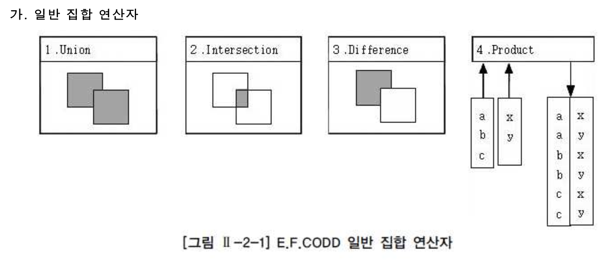
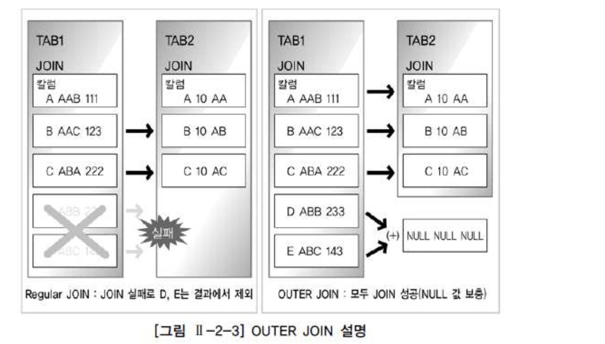
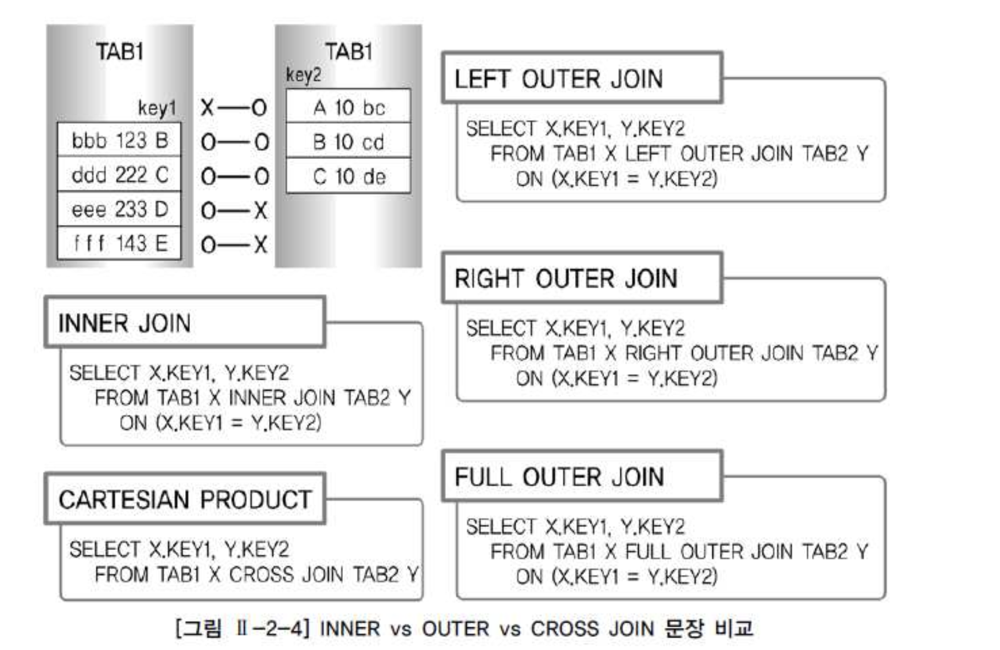

# 01. 표준조인


## 1) STANDARD SQL 개요

STANDARD JOIN 기능 추가 (CROSS, OUTER JOIN 등 새로운 FROM 절 JOIN 기능들) - SCALAR SUBQUERY, TOP-N QUERY 등의 새로운 SUBQUERY 기능들 - ROLLUP, CUBE, GROUPING SETS 등의 새로운 리포팅 기능 - WINDOW FUNCTION 같은 새로운 개념의 분석 기능들


##### 일반 집합 연산자




###### 일반 집합 연산자를 현재의 SQL과 비교

- UNION : 합집합이다. 공통 교집합의 중복을 없애기 위해 사전 작업으로 정렬작업 발생
- UNION ALL : 공통집합 그대로 보여준다.
- INTERSECTION : 교집합
- DIFFERENCE : 차집합 오라클은 MINUS이다.
- PRODUCT : CROSS(ANIS/ISO 표준) PRODUCT라고 불리는 곱집합.


##### 순수 관계 연산자


순수 관계 연산자는 관계형 데이터베이스를 구현하기 위해 새롭게 만들어진 연산자


- SELECT 연산은 WHERE 절로 구현
- PROJECT 연산은 SELECT 절로 구현
- (NATURAL) JOIN 연산은 다양한 JOIN 기능으로 구현 : JOIN 연산은 WHERE 절의 INNER JOIN 조건과 함께 FROM 절의 NATURAL JOIN, INNER JOIN, OUTER JOIN, USING 조건절, ON 조건절 등으로 가장 다양하게 발전
- DIVIDE 연산은 현재 사용되지 않는다.


- 관계형 데이터베이스의 경우 요구사항 분석, 개념적 데이터 모델링, 논리적 데이터 모델링, 물리적 데이터 모델링 단계를 거치게 되는데, 이 단계에서 엔터티 확정 및 정규화 과정, 그리고 M:M (다대다) 관계를 분해하는 절차를 거치게 된다.
- 정규화 과정의 경우 데이터 정합성과 데이터 저장 공간의 절약을 위해 엔터티를 최대한 분리하는 작업으로, 일반적으로 3차 정규형이나 보이스코드 정규형까지 진행하게 된다. 이런 정규화를 거치면 하나의 주제에 관련 있는 엔터티가 여러 개로 나누어지게 되고, 이 엔터티들이 주로 테이블이 되는데 이렇게 흩어진 데이터를 연결해서 원하는 데이터를 가져오는 작업이 바로 JOIN이라고 할 수 있다.
- 관계형 데이터베이스에 있어서 JOIN은 SQL의 가장 중요한 기능이므로 충분히 이해할 필요가 있다.


## 2) FROM 절 JOIN 형태


###### ANSI/ISO SQL에서 표시하는 FROM 절의 JOIN 형태는 다음과 같다.

- INNER JOIN
- NATURAL JOIN
- USING 조건절
- ON 조건절
- CROSS JOIN
- OUTER JOIN


## 3) INNER JOIN

- INNER JOIN은 OUTER(외부) JOIN과 대비하여 내부 JOIN이라고 하며 JOIN 조건에서 동일한 값이 있는 행만 반환한다.
- INNER JOIN 표시는 그 동안 WHERE 절에서 사용하던 JOIN 조건을 FROM 절에서 정의하겠다는 표시이므로 USING 조건절이나 ON 조건절을 필수적으로 사용해야 한다.


```sql
SELECT A.DEPTNO, A.EMPNO, A.ENAME, B.DNAME
FROM   EMP A, DEPT B
WHERE  A.DEPTNO = B.DEPTNO ;

-- 위와 아래는 같은 결과를 반환하다.

SELECT A.DEPTNO, A.EMPNO, A.ENAME, B.DNAME
FROM   EMP A INNER JOIN DEPT B
WHERE  A.DEPTNO = B.DEPTNO ;

SELECT A.DEPTNO, A.EMPNO, A.ENAME, B.DNAME
FROM   EMP A  JOIN DEPT B
WHERE  A.DEPTNO = B.DEPTNO ;
```


## 4) NATURAL JOIN

- NATURAL JOIN은 두 테이블 간의 동일한 이름을 갖는 모든 칼럼들에 대해 EQUI(=) JOIN을 수행한다. NATURAL JOIN이 명시되면, 추가로 USING 조건절, ON 조건절, WHERE 절에서 JOIN 조건을 정의할 수 없다. 그리고, SQL Server에서는 지원하지 않는 기능이다.

```sql
SELECT DEPTNO, EMPNO, ENAME, DNAME
FROM   EMP NATURAL JOIN DEPT ;

-- NATURAL은 식별자를 가질 수 없다. 또한 동일한 열에 대해서는 생략된다. 
```


## 5) USING 조건절

- NATURAL JOIN에서는 모든 일치되는 칼럼들에 대해 JOIN이 이루어지지만, FROM 절의 USING 조건절을 이용하면 같은 이름을 가진 칼럼들 중에서 원하는 칼럼에 대해서만 선택적으로 EQUI JOIN을 할 수가 있다. 다만, 이 기능은 SQL Server에서는 지원하지 않는다.

```sql
SELECT *
FROM DEPT JOIN DEPT_TEMP
USING (DEPTNO);

SELECT *
FROM DEPT JOIN DEPT_TEMP
USING (LOC, DEPTNO);

-- USING절에 명시된 컬럼이 기준이 되어 동일한 열들을 조인한다. 명시된 데이터가 앞에 나온다. 
```


```sql
SELECT *
FROM DEPT JOIN DEPT_TEMP
USING (DEPTNO);

SELECT *
FROM DEPT JOIN DEPT_TEMP
USING (LOC, DEPTNO);

-- USING절에 명시된 컬럼이 기준이 되어 동일한 열들을 조인한다. 명시된 데이터가 앞에 나온다. 
```


## 6) ON 조건절

- JOIN 서술부(ON 조건절)와 비 JOIN 서술부(WHERE 조건절)를 분리하여 이해가 쉬우며, 칼럼명이 다르더라도 JOIN 조건을 사용할 수 있는 장점이 있다.

```sql
SELECT E.EMPNO, E.NAME, E.DEPTNO, D.DNAME
FROM   EMP E JOIN DEPT D
ON     (E.DEPTNO = D.DEPTNO);
```


##### WHERE 절과의 혼용

```sql
SELECT E.EMPNO, E.NAME, E.DEPTNO, D.DNAME
FROM   EMP E JOIN DEPT D
ON     (E.DEPTNO = D.DEPTNO)
WHERE  E.DEPTNO = 30;
```


##### ON 조건절 + 데이터 검증 조건 추가

```sql
SELECT E.EMPNO, E.NAME, E.DEPTNO, D.DNAME
FROM   EMP E JOIN DEPT D
ON     (E.DEPTNO = D.DEPTNO AND E.DEPTNO = 30);


SELECT E.EMPNO, E.NAME, E.DEPTNO, D.DNAME
FROM   EMP E JOIN DEPT D
ON     (E.DEPTNO = D.DEPTNO )
WHERE   E.DEPTNO = 30;

-- 같은 결과를 출력
```


##### 다중 테이블 JOIN

```sql
SELECT E.EMPNO, D.DEPTNO, D.DNAME, T.DNAME NEW_NAME
FROM   EMP E JOIN DEPT D
ON     (E.DEPTNO = D.DEPTNO)
       JOIN DEPT_TEMP T
ON     (E.DEPTNO = T.DEPTNO);


SELECT E.EMPNO, D.DEPTNO, D.DNAME, T.DNAME NEW_NAME
FROM   EMP E ,DEPT D, DEPT_TEMP T
WHERE  E.DEPTNO = D.DEPTNO 
AND    E.DEPTNO = T.DEPTNO;

-- 같은 결과를 출력
```


## 7) CROSS JOIN

- CROSS JOIN은 E.F.CODD 박사가 언급한 일반 집합 연산자의 PRODUCT의 개념으로 테이블 간 JOIN 조건이 없는 경우 생길 수 있는 모든 데이터의 조합을 말한다. 두 개의 테이블에 대한 CARTESIAN PRODUCT 또는 CROSS PRODUCT와 같은 표현으로, 결과는 양쪽 집합의 M*N 건의 데이터 조합이 발생한다. (아래 56건의 데이터는 EMP 14건 * DEPT 4건의 데이터 조합 건수이다.)

```sql
SELECT ENAME,  DNAME
FROM   EMP CROSS JOIN DEPT
ORDER  BY ENAME;
```


## 8) OUTER JOIN



- INNER(내부) JOIN과 대비하여 OUTER(외부) JOIN이라고 불리며, JOIN 조건에서 동일한 값이 없는 행도 반환할 때 사용할 수 있다.


##### LEFT OUTER JOIN

- 아래의 쿼리는 종업원이 부서에 속하지 않은 종업원의 정보를 출력한다.

```sql
SELECT *
FROM   EMP E LEFT OUTER JOIN DEPT D
ON     E.DEPTNO = D.DEPTNO;
```


##### RIGHT OUTER JOIN

- 아래의 쿼리는 부서에 종업원이 속해있는 않은 정보를 출력한다.

```sql
SELECT *
FROM   EMP E RIGHT OUTER JOIN DEPT D
ON     E.DEPTNO = D.DEPTNO;
```


##### FULL OUTER JOIN

```sql
SELECT *
FROM   EMP E FULL OUTER JOIN DEPT D
ON     E.DEPTNO = D.DEPTNO;

SELECT *
FROM   EMP E LEFT OUTER JOIN DEPT D
ON     E.DEPTNO = D.DEPTNO
UNION
SELECT *
FROM   EMP E RIGHT OUTER JOIN DEPT D
ON     E.DEPTNO = D.DEPTNO;

-- 위의 쿼리와 동일한 결과를 출력한다.
```


## 9) INNER vs OUTER vs CROSS JOIN 비교




