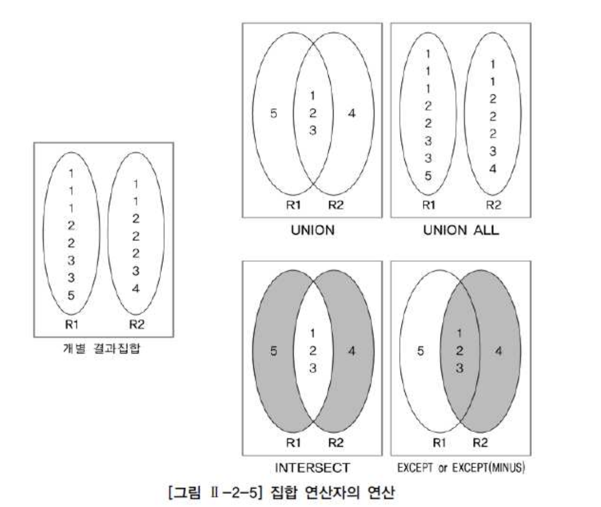

# 02. 집합연산자


- 두 개 이상의 테이블에서 조인을 사용하지 않고 연관된 데이터를 조회하는 방법 중에 또 다른 방법이 있는데 그 방법이 바로 집합 연산자(Set Operator)를 사용하는 방법이다.

| 집합 연산자 | 내용                                                         |
| :---------- | :----------------------------------------------------------- |
| UNION       | 여러 개의 SQL문의 결과에 대한 합집합으로 결과에서 모든 중복된 행은 하나의 행으로 만든다. |
| UNION ALL   | 여러 개의 SQL문의 결과에 대한 합집합으로 중복된 행도 그대로 결과로 표시된다. 즉, 단순히 결과만 합쳐놓은 것이다. 일반적으로 여러 개의 결과가 상호 배타적인(Exclusive)일 때 많이 사용한다. 개별 SQL문의 결과가 서로 중복되지 않는 경우, UNION과 결과가 동일한다. (결과의 정렬 순서에는 차이가 있을 수 있음) |
| INTERSECT   | 여러 개의SQL문의 결과에 대한 교집합이다. 중복된 행은 하나의 행으로 만든다. |
| EXCEPT      | 앞의 SQL문의 결과에서 뒤의 SQL문의 결과에 대한 차집합이다. 중복된 행은 하나의 행으로 만든다. (일부 데이터베이스는 MINUS를 사용함) |





### UNION

```sql
SELECT TEAM_ID 팀코드
     , PLAYER_NAME 선수명
     , POSITION 포지션
     , BACK_NO 백넘버
     , HEIGHT 키 
  FROM PLAYER 
 WHERE TEAM_ID = 'K02' 
 UNION 
SELECT TEAM_ID 팀코드
     , PLAYER_NAME 선수명
     , POSITION 포지션
     , BACK_NO 백넘버
     , HEIGHT 키 
  FROM PLAYER 
 WHERE POSITION = 'GK';
```


### UNION ALL 

```sql
SELECT TEAM_ID 팀코드, PLAYER_NAME 선수명, POSITION 포지션, BACK_NO 백넘버, HEIGHT 키 
  FROM PLAYER 
 WHERE TEAM_ID = 'K02' 
 UNION ALL 
SELECT TEAM_ID 팀코드, PLAYER_NAME 선수명, POSITION 포지션, BACK_NO 백넘버, HEIGHT 키 
  FROM PLAYER 
 WHERE POSITION = 'GK'; 
```


### INTERSECTIN

```sql
SELECT TEAM_ID 팀코드, PLAYER_NAME 선수명, POSITION 포지션, BACK_NO 백넘버, HEIGHT 키 
  FROM PLAYER 
 WHERE TEAM_ID = 'K02' 
INTERSECT 
SELECT TEAM_ID 팀코드, PLAYER_NAME 선수명, POSITION 포지션, BACK_NO 백넘버, HEIGHT 키 
  FROM PLAYER 
 WHERE POSITION = 'GK' 
 ORDER BY 1, 2, 3, 4, 5; 
```


### MINUS

```sql
SELECT TEAM_ID 팀코드, PLAYER_NAME 선수명, POSITION 포지션, BACK_NO 백넘버, HEIGHT 키 
  FROM PLAYER 
 WHERE TEAM_ID = 'K02' 
 MINUS 
SELECT TEAM_ID 팀코드, PLAYER_NAME 선수명, POSITION 포지션, BACK_NO 백넘버, HEIGHT 키 
  FROM PLAYER 
 WHERE POSITION = 'MF' 
ORDER BY 1, 2, 3, 4, 5; 
```
