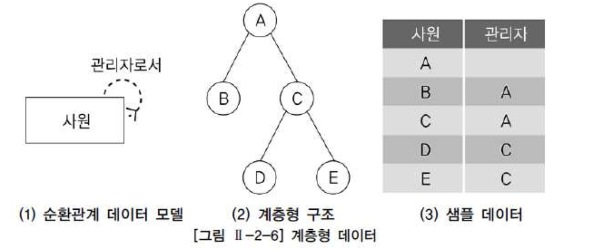
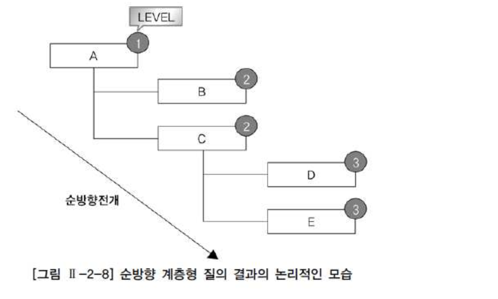
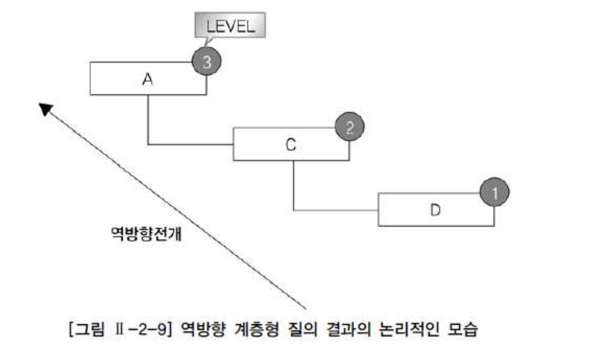
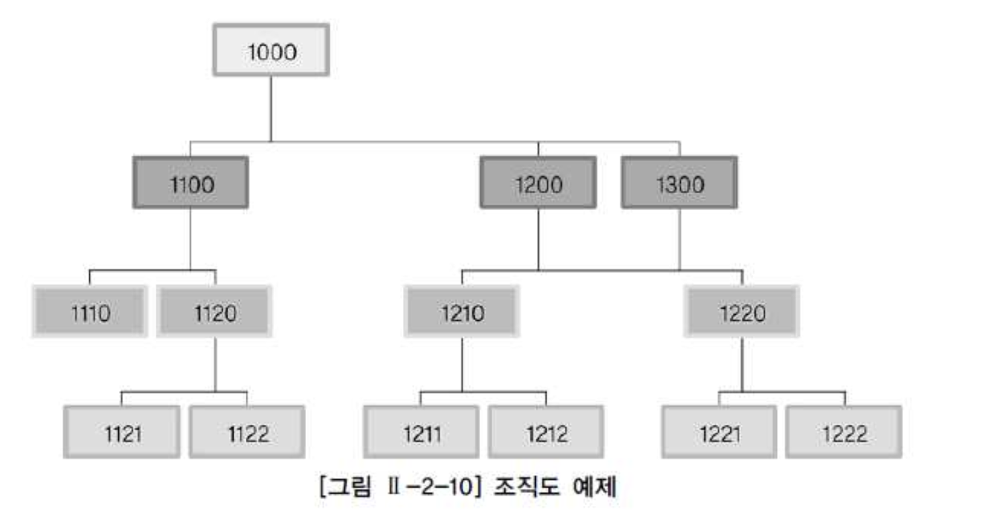
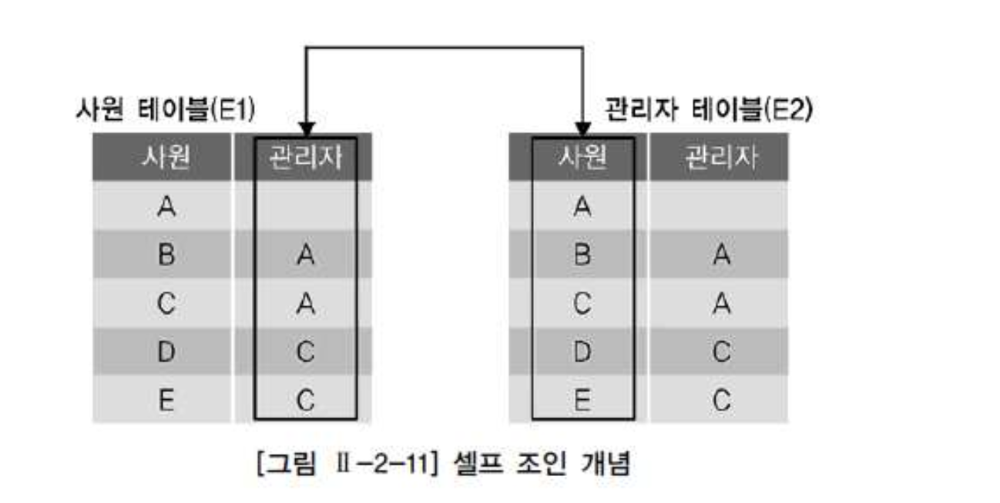

# 03. 계층형 질의와 셀프조인


###  계층형 질의

- 테이블에 계층형 데이터가 존재하는 경우 데이터를 조회하기 위해서 계층형 질의(Hierarchical Query)를 사용한다.
- 계층형 데이터란 동일 테이블에 계층적으로 상위와 하위 데이터가 포함된 데이터를 말한다.





- 그림은 사원에 대한 순환관계 데이터 모델을 표현한 것이다.
- (2)계층형 구조에서 A의 하위 사원은 B, C이고 B 밑에는 하위 사원이 없고 C의 하위 사원은 D, E가 있다.
- 계층형 구조를 데이터로 표현한 것이 (3)샘플 데이터이다.


###### Oracle 계층형 질의

```sql
 SELECT ...
   FROM   TABLE
  WHERE  CONDITION AND CONDITION
  START WITH CONDITION
CONNECT BY [NOCYCLE] CONDITION AND CONDITION
 [ORDER SIBLINGS BY COLUMN, COLUMN......]
```

- **START WITH** 절은 계층 구조 전개의 시작 위치를 지정하는 구문이다. 즉, 루트 데이터를 지정한다.(액세스)
- **CONNECT BY** 절은 다음에 전개될 자식 데이터를 지정하는 구문이다. 자식 데이터는 CONNECT BY절에 주어진 조건을 만족해야 한다.(조인)
- **PRIOR** : CONNECT BY절에 사용되며, 현재 읽은 칼럼을 지정한다. PRIOR 자식 = 부모 형태를 사용하면 계층구조에서 자식 데이터에서 부모 데이터(자식 → 부모) 방향으로 전개하는 순방향 전개를 한다. 그리고 PRIOR 부모 = 자식 형태를 사용하면 반대로 부모 데이터에서 자식 데이터(부모 → 자식) 방향으로 전개하는 역방향 전개를 한다.
- NOCYCLE : 데이터를 전개하면서 이미 나타났던 동일한 데이터가 전개 중에 다시 나타난다면 이것을 가리켜 사이클(Cycle)이 형성되었다라고 말한다. 사이클이 발생한 데이터는 런타임 오류가 발생한다. 그렇지만 NOCYCLE를 추가하면 사이클이 발생한 이후의 데이터는 전개하지 않는다.
- ORDER SIBLINGS BY : 형제 노드(동일 LEVEL) 사이에서 정렬을 수행한다.
- WHERE : 모든 전개를 수행한 후에 지정된 조건을 만족하는 데이터만 추출한다.(필터링)


- Oracle은 계층형 질의를 사용할 때 다음과 같은 가상 칼럼(Pseudo Column)을 제공한다.

| 가상 컬럼          | 설명                                                         |
| :----------------- | :----------------------------------------------------------- |
| LEVEL              | 루트 데이터이면 1, 그 하위 데이터이면 2이다. 리프(Leaf) 데이터까지 1씩 증가한다. |
| CONNECT_BY_ISLEAF  | 전개 과정에서 해당 데이터가 리프 데이터이면 1, 그렇지 않으면 0이다. |
| CONNECT_BY_ISCYCLE | 전개 과정에서 자식을 갖는데, 해당 데이터가 조상으로서 존재하면 1, 그렇지 않으면 0이다. 여기서 조상이란 자신으로부터 루트까지의 경로에 존재하는 데이터를 말한다. CYCLE 옵션을 사용했을 때만 사용할 수 있다. |


- 다음은 그림의 (3)샘플 데이터를 계층형 질의 구문을 이용해서 조회한 것이다. 여기서는 결과 데이터를 들여쓰기 하기 위해서 LPAD 함수를 사용하였다.

```sql
 SELECT LEVEL, LPAD(' ', 4 * (LEVEL-1)) || EMPNO 사원, 
        MGR 관리자, CONNECT_BY_ISLEAF ISLEAF 
   FROM EMP
  START WITH MGR IS NULL 
CONNECT BY PRIOR EMPNO = MGR; 


LEVEL     EMP            MGR      ISLEAF
------    -------------- -------  ---------
1         7839                    0 
2            7566        7839     0
3               7788     7566     0 
4                  7876  7788     1 
```





- A는 루트 데이터이기 때문에 레벨이 1이다.
- A의 하위 데이터인 B, C는 레벨이 2이다.
- 그리고 C의 하위 데이터인 D, E는 레벨이 3이다.
- 리프 데이터는 B, D, E이다. 관리자 → 사원 방향을 전개이기 때문에 순방향 전개이다.
- 그림은 계층형 질의에 대한 논리적인 실행 모습이다.


- 다음 예제는 사원 'D'로부터 자신의 상위관리자를 찾는 역방향 전개의 예이다.

```sql
 SELECT LEVEL, LPAD(' ', 4 * (LEVEL-1)) || EMPNO사원, 
        MGR 관리자, CONNECT_BY_ISLEAF ISLEAF 
   FROM EMP 
  START WITH EMPNO = '7876' 
CONNECT BY PRIOR MGR = EMPNO; 


LEVEL     EMP            MGR      ISLEAF
------    -------------- -------  ---------
1         7876           7788     0 
2            7788        7566     0
3               7566     7839     0 
4                  7839           1 
```





- 본 예제는 역방향 전개이기 때문에 하위 데이터에서 상위 데이터로 전개된다. 결과를 보면 내용을 제외하고 표시 형태는 순방향 전개와 동일하다.
- D는 루트 데이터이기 때문에 레벨이 1이다. D의 상위 데이터인 C는 레벨이 2이다. 그리고 C의 상위 데이터인 A는 레벨이 3이다. 리프 데이터는 A이다.
- 루트 및 레벨은 전개되는 방향에 따라 반대가 됨을 알 수 있다. `그림 Ⅱ-2-9`는 역방향 전개에 대한 계층형 질의에 대한 논리적인 실행 모습이다.


| 함수                | 설명                                                         |
| :------------------ | :----------------------------------------------------------- |
| SYS_CONNECT_BY_PATH | 루트 데이터부터 현재 전개할 데이터가지의 경로를 표시한다. 사용법 : SYS_CONNECT_BY_PATH (칼럼, 경로분리자) |
| CONNECT_BY_ROOT     | 현재 전개할 데이터의 루트 데이터를 표시한다. 단항 연산자이다. 사용법 : CONNECT_BY_ROOT 칼럼 |


```sql
 SELECT CONNECT_BY_ROOT(EMPNO) 루트사원, SYS_CONNECT_BY_PATH(EMPNO, '/') 경로, 
        EMPNO 사원, MGR 관리자 
   FROM EMP
  START WITH MGR IS NULL 
CONNECT BY PRIOR EMPNO = MGR; 


루트사원      경로                 사원       관리자
--------    -------------------  ------     ----------
    7839    /7839                7839
    7839    /7839/7566           7566       7839
    7839    /7839/7566/7788      7788       7566
```


###### SQL Server 계층형 질의

```sql
WITH EMPLOYEES_ANCHOR AS 
   ( SELECT EMPLOYEEID, LASTNAME, FIRSTNAME, REPORTSTO, 0 AS LEVEL 
       FROM EMPLOYEES 
      WHERE REPORTSTO IS NULL /* 재귀 호출의 시작점 */ 
      UNION ALL 
     SELECT R.EMPLOYEEID, R.LASTNAME, R.FIRSTNAME, R.REPORTSTO, A.LEVEL + 1 
       FROM EMPLOYEES_ANCHOR A, EMPLOYEES R 
      WHERE A.EMPLOYEEID = R.REPORTSTO 
   ) 
SELECT LEVEL
     , EMPLOYEEID
     , LASTNAME
     , FIRSTNAME
     , REPORTSTO 
  FROM EMPLOYEES_ANCHOR 

GO 
************************************************************************** 
Level EmployeeID LastName   FirstName ReportsTo 
---- --------    -------    -----     -------- 
0    2           Fuller     Andrew    NULL 
1    1           Davolio    Nancy     2 
1    3           Leverling  Janet     2 
1    4           Peacock    Margaret  2 
1    5           Buchanan   Steven    2 
1    8           Callahan   Laura     2 
2    6           Suyama     Michael   5 
2    7           King       Robert    5 
2    9           Dodsworth  Anne      5 
(9개 행 적용됨) 
```

- WITH 절의 CTE 쿼리를 보면, UNION ALL 연산자로 쿼리 두 개를 결합했다.
- 둘 중 위에 있는 쿼리를 '앵커 멤버'(Anchor Member)라고 하고, 아래에 있는 쿼리를 '재귀 멤버'(Recursive Member)라고 한다.


- 아래는 재귀적 쿼리의 처리 과정이다.
  - CTE 식을 앵커 멤버와 재귀 멤버로 분할한다.
  - 앵커 멤버를 실행하여 첫 번째 호출 또는 기본 결과 집합(T0)을 만든다.
  - Ti는 입력으로 사용하고 Ti+1은 출력으로 사용하여 재귀 멤버를 실행한다.
  - 빈 집합이 반환될 때까지 3단계를 반복한다.
  - 결과 집합을 반환한다. 이것은 T0에서 Tn까지의 UNION ALL이다.





```sql
WITH T_EMP_ANCHOR AS ( 
     SELECT EMPLOYEEID, MANAGERID, 0 AS LEVEL 
       FROM T_EMP 
      WHERE MANAGERID IS NULL /* 재귀 호출의 시작점 */ 
      UNION ALL 
     SELECT R.EMPLOYEEID, R.MANAGERID, A.LEVEL + 1 
       FROM T_EMP_ANCHOR A, T_EMP R 
      WHERE A.EMPLOYEEID = R.MANAGERID ) 
SELECT LEVEL, REPLICATE(' ', LEVEL) + EMPLOYEEID AS EMPLOYEEID, MANAGERID 
  FROM T_EMP_ANCHOR 
GO 
************************************************************************** 
Level EmployeeID ManagerID 
---   -------    --------- 
0     1000       NULL 
1     1100       1000 
1     1200       1000 
1     1300       1000 
2     1210       1200 
2     1220       1200 
3     1221       1220 
3     1222       1220 
3     1211       1210 
3     1212       1210 
2     1110       1100 
2     1120       1100 
3     1121       1120 
3     1122       1120 
(14개 행 적용됨)
```


```sql
WITH T_EMP_ANCHOR AS ( 
     SELECT EMPLOYEEID, MANAGERID, 0 AS LEVEL, CONVERT(VARCHAR(1000), EMPLOYEEID) AS SORT 
       FROM T_EMP 
      WHERE MANAGERID IS NULL /* 재귀 호출의 시작점 */ 
      UNION ALL 
     SELECT R.EMPLOYEEID, R.MANAGERID, A.LEVEL + 1, CONVERT(VARCHAR(1000), A.SORT + '/' + R.EMPLOYEEID) AS SORT 
       FROM T_EMP_ANCHOR A, T_EMP R 
      WHERE A.EMPLOYEEID = R.MANAGERID ) 
SELECT LEVEL 
     , REPLICATE(' ', LEVEL) + EMPLOYEEID AS EMPLOYEEID
     , MANAGERID
     , SORT 
  FROM T_EMP_ANCHOR 
 ORDER BY SORT 
GO 


Level EmployeeID ManagerID Sort 
----  --------   --------  ------------- 
0     1000       NULL      1000 
1     1100       1000      1000/1100 
2     1110       1100      1000/1100/1110 
2     1120       1100      1000/1100/1120 
3     1121       1120      1000/1100/1120/1121 
3     1122       1120      1000/1100/1120/1122 
1     1200       1000      1000/1200 
2     1210       1200      1000/1200/1210 
3     1211       1210      1000/1200/1210/1211 
3     1212       1210      1000/1200/1210/1212 
2     1220       1200      1000/1200/1220 
3     1221       1220      1000/1200/1220/1221 
3     1222       1220      1000/1200/1220/1222 
1     1300       1000      1000/1300 
(14개 행 적용됨) 
```


### 셀프 조인

- 셀프 조인(Self Join)이란 동일 테이블 사이의 조인을 말한다. 따라서 FROM 절에 동일 테이블이 두 번 이상 나타난다.
- 동일 테이블 사이의 조인을 수행하면 테이블과 칼럼 이름이 모두 동일하기 때문에 식별을 위해 반드시 테이블 별칭(Alias)를 사용해야 한다.
- 그리고 칼럼에도 모두 테이블 별칭을 사용해서 어느 테이블의 칼럼인지 식별해줘야 한다. 이외 사항은 조인과 동일하다.
- 셀프 조인에 대한 기본적인 사용법은 다음과 같다




```sql
SELECT E1.EMPNO 사원, E1.MGR 관리자, E2.MGR 차상위_관리자 
  FROM EMP E1, EMP E2 
 WHERE E1.MGR = E2.EMPNO 
 ORDER BY E2.MGR DESC, E1.MGR, E1.EMPNO; 


사원    관리자    차상위_관리자 
-----  -------  ---------------
7566   7839
7689   7839
7782   7839
7788   7566     7839     
```
