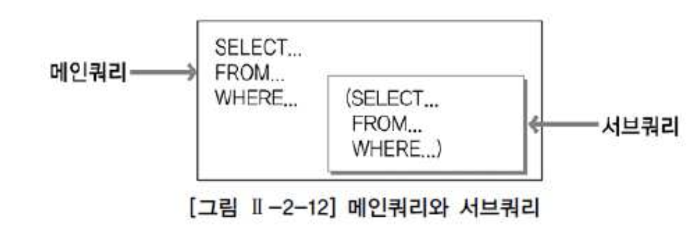
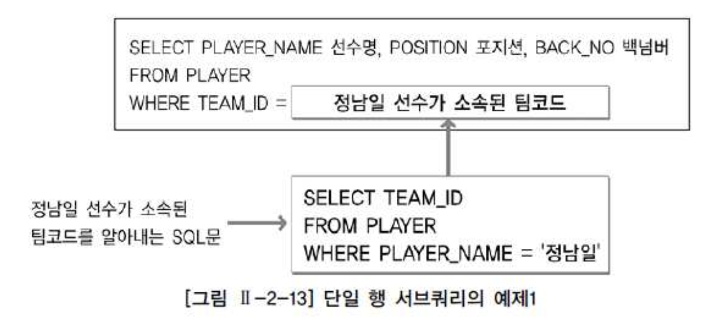
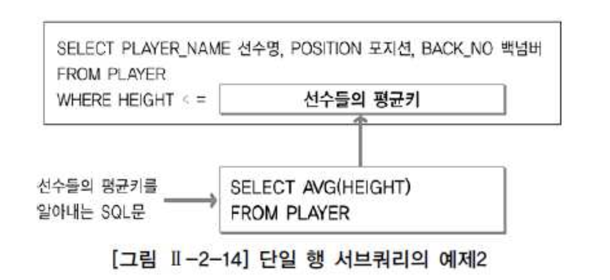
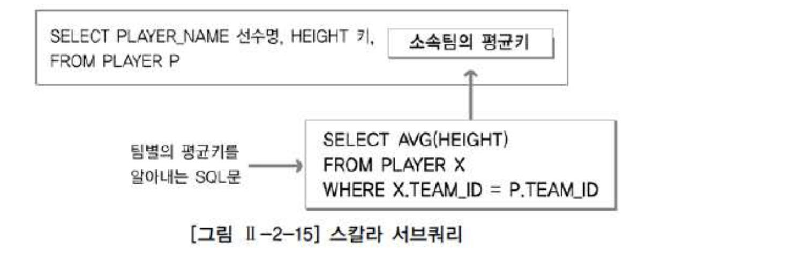

# 04. 서브쿼리





- 서브쿼리(Subquery)란 하나의 SQL문안에 포함되어 있는 또 다른 SQL문을 말한다. 서브쿼리는 알려지지 않은 기준을 이용한 검색을 위해 사용한다. 서브쿼리는 그림 Ⅱ-2-12와 같이 메인쿼리가 서브쿼리를 포함하는 종속적인 관계이다.


###### 서브쿼리 사용시 주의사항

- 서브쿼리를 괄호로 감싸서 사용한다.
- 서브쿼리는 단일 행(Single Row) 또는 복수 행(Multiple Row) 비교 연산자와 함께 사용 가능하다. 단일 행 비교 연산자는 서브쿼리의 결과가 반드시 1건 이하이어야 하고 복수 행 비교 연산자는 서브쿼리의 결과 건수와 상관 없다.
- 서브쿼리에서는 ORDER BY를 사용하지 못한다. ORDER BY절은 SELECT절에서 오직 한 개만 올 수 있기 때문에 ORDER BY절은 메인쿼리의 마지막 문장에 위치해야 한다.


###### 서브쿼리가 가능한 곳은 다음과 같다.

- SELECT CLAUSE
- FROM CLAUSE
- WHERE CLAUSE
- HAVING CLAUSE
- ORDER BY CLAUSE
- INSERT VALUES CLAUSE
- UPDATE SET CLAUSE


| 서브쿼리 종류                  | 설명                                                         |
| :----------------------------- | :----------------------------------------------------------- |
| Un-Correlated(비연관) 서브쿼리 | 서브쿼리가 메인쿼리 컬럼을 가지고 있지 않은 형태의 서브쿼리이다. 메인쿼리에 값(서브쿼리가 실행된 결과)을 제공하기 위한 목적으로 주로 사용한다. |
| Correlated(연관) 서브쿼리      | 서브쿼리가 메인쿼리 컬럼을 가지고 있는 형태의 서브쿼리이다. 일반적으로 메인쿼리가 먼저 수행되어 읽혀진 데이터를 서브쿼리에서 조건이 맞는지 확인하고자 할 때 주로 사용된다. |


| 서브쿼리 종류                             | 설명                                                         |
| :---------------------------------------- | :----------------------------------------------------------- |
| Single Row 서브쿼리(단일 행 서브쿼리)     | 서브쿼리의 실행 결과가 항상 1건 이하인 서브쿼리를 의미한다. 단일 행 서브쿼리는 단일 행 비교 연산자와 함께 사용된다. 단일 행 비교 연산자에는 =, <, <=, > , >=, <>이 있다. |
| Multi Row 서브쿼리(다중 행 서브쿼리)      | 서브쿼리의 실행 결과가 여러 건인 서브쿼리를 의미한다. 다중 행 서브쿼리는 다중 행 비교 연산자와 함께 사용된다. 다중 행 비교 연산자에는 IN, ALL, ANY, SOME, EXISTS가 있다. |
| Multi Column 서브쿼리(다중 컬럼 서브쿼리) | 서브쿼리의 실행 결과로 여러 컬럼을 반환한다. 메인쿼리의 조건절에 여러 컬럼을 동시에 비교할 수 있다. 서브쿼리와 메인쿼리에서 비교하고자 하는 컬럼 개수와 컬럼의 위치가 동일해야 한다. |


### 단일 행 서브 쿼리





```sql
SELECT PLAYER_NAME 선수명
     , POSITION 포지션
     , BACK_NO 백넘버 
  FROM PLAYER 
 WHERE TEAM_ID = 
             ( SELECT TEAM_ID 
                 FROM PLAYER 
                WHERE PLAYER_NAME = '정남일'
              ) 
 ORDER BY PLAYER_NAME; 
```





```sql
SELECT PLAYER_NAME 선수명 
     , POSITION 포지션
     , BACK_NO 백넘버 
  FROM PLAYER 
 WHERE HEIGHT <= (SELECT AVG(HEIGHT) 
                    FROM PLAYER) 
ORDER BY PLAYER_NAME;
```


### 다중 행 서브 쿼리

| 다중 행 연산자           | 설명                                                         |
| :----------------------- | :----------------------------------------------------------- |
| IN(서브쿼리)             | 서브쿼리의 결과에 존재하는 임의의 값과 동일한 조건을 의미한다. (Multiple OR 조건) |
| 비교연산자 ALL(서브쿼리) | 서브쿼리의 결과에 존재하는 모든 값을 만족하는 조건을 의미한다. 비교 연산자로 ">"를 사용했다면 메인쿼리는 서브쿼리의 모든 결과 값을 만족해야 하므로, 서브쿼리 결과의 최대값보다 큰 모든 건이 조건을 만족한다. |
| 비교연산자 ANY(서브쿼리) | 서브쿼리의 결과에 존재하는 어느 하나의 값이라도 만족하는 조건을 의미한다. 비교 연산자로 ">"를 사용했다면 메인쿼리는 서브쿼리의 값들 중 어떤 값이라도 만족하면되므로, 서브쿼리의 결과의 최소값보다 큰 모든 건이 조건을 만족한다. (SOME은 ANY와 동일함.) |
| EXISTS(서브쿼리)         | 서브쿼리의 결과를 만족하는 값이 존재하는지 여부를 확인하는 조건을 의미한다. 조건을 만족하는 건이 여러 건이더라도 1건만 찾으면 더 이상 검색하지 않는다. |


```sql
SELECT REGION_NAME 연고지명
     , TEAM_NAME 팀명
     , E_TEAM_NAME 영문팀명 
  FROM TEAM 
 WHERE TEAM_ID = 
             ( SELECT TEAM_ID 
                 FROM PLAYER 
                WHERE PLAYER_NAME = '정현수') 
ORDER BY TEAM_NAME; 

ORA-01427: 단일 행 하위 질의에 2개 이상의 행이 리턴되었다. 
```


```sql
SELECT REGION_NAME 연고지명
     , TEAM_NAME 팀명
     , E_TEAM_NAME 영문팀명 
  FROM TEAM 
 WHERE TEAM_ID IN 
             ( SELECT TEAM_ID 
                 FROM PLAYER 
                WHERE PLAYER_NAME = '정현수') 
 ORDER BY TEAM_NAME; 
```


### 다중 칼럼 서브쿼리

- 다중 칼럼 서브쿼리는 서브쿼리의 결과로 여러 개의 칼럼이 반환되어 메인쿼리의 조건과 동시에 비교되는 것을 의미한다.

```sql
SELECT TEAM_ID 팀코드
     , PLAYER_NAME 선수명
     , POSITION 포지션 
     , BACK_NO 백넘버
     , HEIGHT 키 
  FROM PLAYER 
 WHERE (TEAM_ID, HEIGHT) IN
                          ( SELECT TEAM_ID, MIN(HEIGHT) 
                              FROM PLAYER 
                             GROUP BY TEAM_ID) 
 ORDER BY TEAM_ID, PLAYER_NAME; 
```


### 연관 서브쿼리

- 연관 서브쿼리(Correlated Subquery)는 서브쿼리 내에 메인쿼리 칼럼이 사용된 서브쿼리이다.

```sql
SELECT T.TEAM_NAME 팀명
     , M.PLAYER_NAME 선수명
     , M.POSITION 포지션
     , M.BACK_NO 백넘버
     , M.HEIGHT 키 
  FROM PLAYER M, TEAM T 
 WHERE M.TEAM_ID = T.TEAM_ID 
   AND M.HEIGHT < ( SELECT AVG(S.HEIGHT) 
                      FROM PLAYER S 
                     WHERE S.TEAM_ID = M.TEAM_ID 
                       AND S.HEIGHT IS NOT NULL 
                     GROUP BY S.TEAM_ID ) 
 ORDER BY 선수명; 
```


### 그밖에 위치에서 사용하는 서브쿼리


###### SELECT 절에 서브쿼리 사용하기

- 다음은 SELECT 절에서 사용하는 서브쿼리인 스칼라 서브쿼리(Scalar Subquery)에 대해서 알아본다.
- 스칼라 서브쿼리는 한 행, 한 칼럼(1 Row 1 Column)만을 반환하는 서브쿼리를 말한다.
- 스칼라 서브쿼리는 칼럼을 쓸 수 있는 대부분의 곳에서 사용할 수 있다.
- 선수 정보와 해당 선수가 속한 팀의 평균 키를 함께 출력하는 예제로 스칼라 서브쿼리를 설명하면 다음과 같다.





```sql
SELECT PLAYER_NAME 선수명
     , HEIGHT 키
     , ( SELECT AVG(HEIGHT) 
           FROM PLAYER X 
          WHERE X.TEAM_ID = P.TEAM_ID) 팀평균키 
  FROM PLAYER P;
```


###### FROM 절에서 서브쿼리 사용하기

- FROM 절에서 사용되는 서브쿼리를 인라인 뷰(Inline View)라고 한다.
- 인라인 뷰는 테이블 명이 올 수 있는 곳에서 사용할 수 있다.

```sql
SELECT T.TEAM_NAME 팀명
     , P.PLAYER_NAME 선수명
     , P.BACK_NO 백넘버 
  FROM
     ( SELECT TEAM_ID, PLAYER_NAME, BACK_NO 
         FROM PLAYER 
        WHERE POSITION = 'MF'
     ) P
     , TEAM T 
 WHERE P.TEAM_ID = T.TEAM_ID 
 ORDER BY 선수명; 
```


###### HAVING 절에서 서브쿼리 사용하기

- HAVING 절은 그룹함수와 함께 사용될 때 그룹핑된 결과에 대해 부가적인 조건을 주기 위해서 사용한다.

```sql
SELECT P.TEAM_ID 팀코드
     , T.TEAM_NAME 팀명
     , AVG(P.HEIGHT) 평균키 
  FROM PLAYER P, TEAM T 
 WHERE P.TEAM_ID = T.TEAM_ID 
 GROUP BY P.TEAM_ID, T.TEAM_NAME 
HAVING AVG(P.HEIGHT) < (SELECT AVG(HEIGHT) 
                          FROM PLAYER 
                         WHERE TEAM_ID ='K02');
```


###### UPDATE문의 SET 절에서 사용하기

```sql
UPDATE TEAM A 
   SET A.STADIUM_NAME = (SELECT X.STADIUM_NAME 
                           FROM STADIUM X 
                          WHERE X.STADIUM_ID = A.STADIUM_ID); 
```


###### INSERT문의 VALUES절에서 사용하기

```sql
INSERT
  INTO PLAYER 
     ( PLAYER_ID
     , PLAYER_NAME
     , TEAM_ID
     ) 
VALUES(
        (SELECT TO_CHAR(MAX(TO_NUMBER(PLAYER_ID))+1) FROM PLAYER)
      , '홍길동'
      , 'K06'); 
```


###### 뷰(View)

- 테이블은 실제로 데이터를 가지고 있는 반면, 뷰(View)는 실제 데이터를 가지고 있지 않다. 뷰는 단지 뷰 정의(View Definition)만을 가지고 있다.
- 질의에서 뷰가 사용되면 뷰 정의를 참조해서 DBMS 내부적으로 질의를 재작성(Rewrite)하여 질의를 수행한다.
- 뷰는 실제 데이터를 가지고 있지 않지만 테이블이 수행하는 역할을 수행하기 때문에 가상 테이블(Virtual Table)이라고도 한다. 뷰는 표 Ⅱ-2-7과 같은 장점을 갖는다.


| 뷰의 장점 | 설명                                                         |
| :-------- | :----------------------------------------------------------- |
| 독립성    | 테이블 구조가 변경되어도 뷰를 사용하는 응용 프로그램은 변경하지 않아도 된다. |
| 편리성    | 복잡한 질의를 뷰로 생성함으로써 관련 질의를 단순하게 작성할 수 있다. 또한 해당 형태의 SQL문을 자주 사용할 때 뷰를 이용하면 편리하게 사용할 수 있다. |
| 보안성    | 직원의 급여정보와 같이 숨기고 싶은 정보가 존재한다면, 뷰를 생성할 때 해당 컬럼을 빼고 생성함으로써 사용자에게 정보를 감출 수 있다. |


```sql
CREATE VIEW V_PLAYER_TEAM AS 
SELECT P.PLAYER_NAME
     , P.POSITION
     , P.BACK_NO
     , P.TEAM_ID
     , T.TEAM_NAME 
  FROM PLAYER P, TEAM T 
 WHERE P.TEAM_ID = T.TEAM_ID; 
```


```sql
SELECT PLAYER_NAME
     , POSITION
     , BACK_NO
     , TEAM_ID
     , TEAM_NAME 
  FROM V_PLAYER_TEAM 
 WHERE PLAYER_NAME LIKE '황%'
```


```sql
DROP VIEW V_PLAYER_TEAM; 
```

