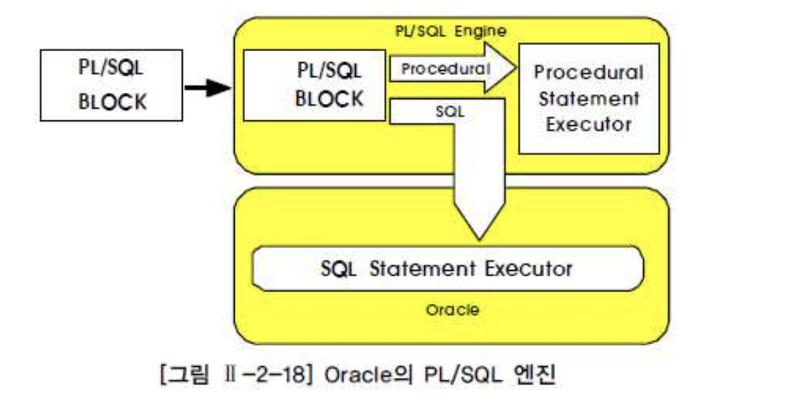
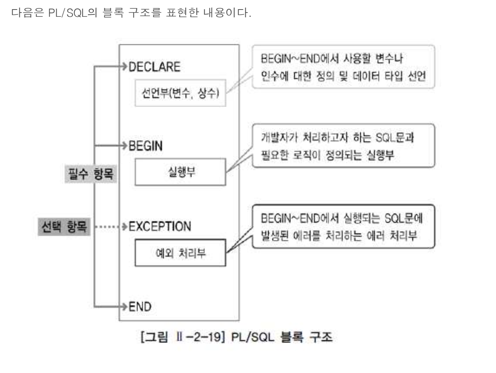
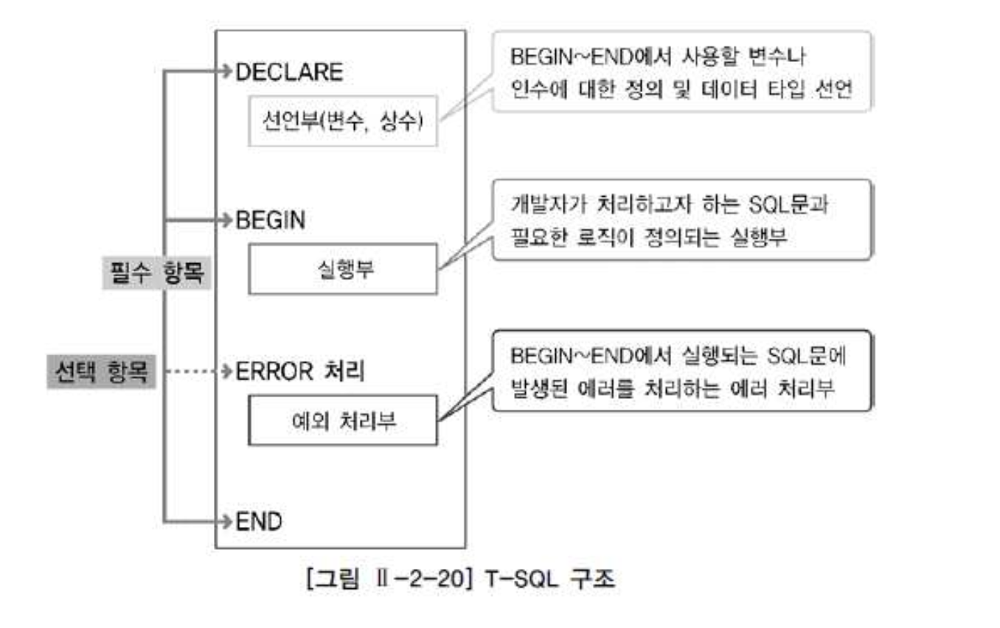
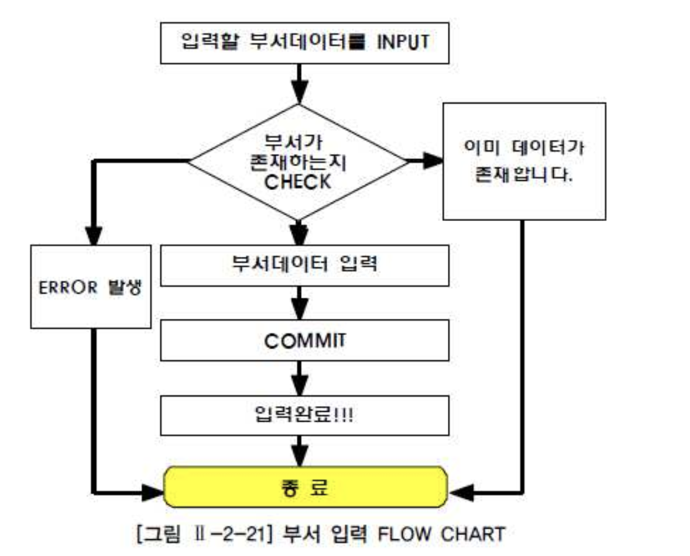

# 08. 절차형SQL


## 1) 절차형 SQL 개요

- 일반적인 개발 언어처럼 SQL에도 절차 지향적인 프로그램을 벤더별로 제공.

| 벤더       | 절차형SQL                           |
| :--------- | :---------------------------------- |
| ORACLE     | PL(Procedural Language)/SQL(Oracle) |
| DB2        | SQL/PL                              |
| SQL Server | T-SQL                               |


## 2) PL/SQL 개요

##### PL/SQL

- Oracle의 PL/SQL은 Block 구조로 되어있고 Block 내에는 DML 문장과 QUERY 문장, 그리고 절차형 언어(IF, LOOP) 등을 사용할 수 있다.
- 특징은 저장 모듈(Stored Module)을 이용해서 PL/SQL 을 데이터베이스에 저장하여 독립적으로 실행되거나 다른 프로그램으로부터 실행될 수 있는 완전한 실행 프로그램이다.
- Oracle의 저장 모듈에는 Procedure, User Defined Function, Trigger가 있다.


###### PL/SQL의 특징은 다음과 같다.

- PL/SQL은 Block 구조로 되어있어 각 기능별로 모듈화가 가능하다.
- 변수, 상수 등을 선언하여 SQL 문장 간 값을 교환한다.
- IF, LOOP 등의 절차형 언어를 사용하여 절차적인 프로그램이 가능하도록 한다.
- DBMS 정의 에러나 사용자 정의 에러를 정의하여 사용할 수 있다.
- PL/SQL은 Oracle에 내장되어 있으므로 Oracle과 PL/SQL을 지원하는 어떤 서버로도 프로그램을 옮길 수 있다.
- PL/SQL은 응용 프로그램의 성능을 향상시킨다.
- PL/SQL은 여러 SQL 문장을 Block으로 묶고 한 번에 Block 전부를 서버로 보내기 때문에 통신량을 줄일 수 있다.


###### PL/SQL Architecture




- PL/SQL Block 프로그램을 입력받으면 SQL 문장과 프로그램 문장을 구분하여 처리한다.
- 즉 프로그램 문장은 PL/SQL 엔진이 처리하고 SQL 문장은 Oracle 서버의 SQL Statement Executor가 실행하도록 작업을 분리하여 처리한다.


###### PL/SQL 구조




###### PL/SQL 기본 문법(Syntax)

```sql
CREATE [OR REPLACE] Procedure [Procedure_name]
   ( argument1 [IN|OUT|INOUT] data_type1,
     argument2 [IN|OUT|INOUT] date_type2,
  ... ... )
IS [AS]
 ... ...
BEGIN
 ... ...
EXCEPTION
 ... ...
END;
 /    > Compile

DROP Procedure [Procedure_name];
```


## 3) T-SQL 개요

###### T-SQL 특징

- T-SQL은 근본적으로 SQL Server를 제어하기 위한 언어로서, T-SQL은 엄격히 말하면,
- MS사에서 ANSI/ISO 표준의 SQL에 약간의 기능을 더 추가해 보완적으로 만든 것이다.
- T-SQL을 이용하여 다양한 저장 모듈(Stored Module)을 개발할 수 있다.


- 변수 선언 기능 @@이라는 전역변수(시스템 함수)와 @이라는 지역변수가 있다.
- 지역변수는 사용자가 자신의 연결 시간 동안만 사용하기 위해 만들어지는 변수이며 전역변수는 이미 SQL서버에 내장된 값이다.
- 데이터 유형(Data Type)을 제공한다. 즉 int, float, varchar 등의 자료형을 의미한다.
- 연산자(Operator) 산술연산자( \+, \-, \*, /)와 비교연산자(=, <, >, <>) 논리연산자(and, or, not) 사용이 가능하다.
- 흐름 제어 기능 IF-ELSE와 WHILE, CASE-THEN 사용이 가능하다.
- 주석 기능한줄 주석 : -- 뒤의 내용은 주석범위 주석 : /\* 내용 \*/ 형태를 사용하며, 여러 줄도 가능함


###### T-SQL 구조




###### T-SQL 기본 문법(Syntax)

```sql
CREATE Procedure [schema_name.]Procedure_name
  @parameter1 data_type1 [VARYING결과 집합|DEFAULT|OUT|READONLY],
  @parameter2 date_type2 [mode],
   ... ...
WITH [Option RECOMPILE|ENCRYPTIONCREATE|EXECUTE AS|
AS
... ...
BEGIN
 ... ...
ERROR 처리
... ...
END;

DROP Procedure [schema_name.]Procedure_name;
```


## 4) Procedure의 생성과 활용




```sql
-- ORACLE  --
 SQL> desc dept

 Name                                      Null?    Type
 ----------------------------------------- -------- ----------------------------
 DEPTNO                                    NOT NULL NUMBER(2)    > PK
 DNAME                                              VARCHAR2(14)
 LOC                                                VARCHAR2(13)


CREATE OR REPLACE Procedure p_DEPT_insert
 ( v_DEPTNO in number,
   v_dname in varchar2,
   v_loc in varchar2,
   v_result out varchar2)
IS
cnt number := 0;
BEGIN
  SELECT COUNT(*) INTO CNT
    FROM DEPT WHERE DEPTNO = v_DEPTNO
     AND ROWNUM = 1;
if cnt > 0 then
  v_result := '이미 등록된 부서번호이다';
else
  INSERT INTO DEPT (DEPTNO, DNAME, LOC)  VALUES (v_DEPTNO, v_dname, v_loc);
  COMMIT;
  v_result := '입력 완료';
end if;
EXCEPTION
   WHEN OTHERS THEN
   ROLLBACK;
   v_result := 'ERROR 발생';
END;
/

SQL> /

Procedure created.

-- SQL Server --

CREATE Procedure dbo.p_DEPT_insert
  @v_DEPTNO int,
  @v_dname varchar(30),
  @v_loc varchar(30),
  @v_result varchar(100) OUTPUT
AS
DECLARE @cnt int
SET @cnt = 0
  BEGIN 
   SELECT @cnt=COUNT(*)
     FROM DEPT
    WHERE DEPTNO = @v_DEPTNO
   IF @cnt > 0
BEGIN
 SET @v_result = '이미 등록된 부서번호이다'
 RETURN
END
ELSE
  BEGIN
   BEGIN TRAN
   INSERT INTO DEPT (DEPTNO, DNAME, LOC)
   VALUES (@v_DEPTNO, @v_dname, @v_loc)
   IF @@ERROR<>0
   BEGIN
      ROLLBACK
      SET @v_result = 'ERROR 발생'
      RETURN
   END
   ELSE
   BEGIN
      COMMIT
      SET @v_result = '입력 완료!!'
   RETURN
  END
 END
END
```


- 실행 결과

```sql
-- ORACLE --
select * from dept;

    DEPTNO DNAME                        LOC
---------- ---------------------------- --------------------------
        10 ACCOUNTING                   NEW YORK
        20 RESEARCH                     DALLAS
        30 SALES                        CHICAGO
        40 OPERATIONS                   BOSTON

variable rslt varchar2(30);

exec p_dept_insert(10,'dev','seoul',:rslt);

PL/SQL 처리가 정상적으로 완료되었습니다.

print rslt;

RSLT
--------------------------------------------------------------------------------
이미 등록된 부서번호이다

exec p_dept_insert(50,'NewDev','seoul',:rslt);

PL/SQL 처리가 정상적으로 완료되었습니다.

print rslt;

RSLT
--------------------------------------------------------------------------------
입력 완료

select * from dept;

    DEPTNO DNAME                        LOC
---------- ---------------------------- --------------------------
        50 NewDev                       seoul
        10 ACCOUNTING                   NEW YORK
        20 RESEARCH                     DALLAS
        30 SALES                        CHICAGO
        40 OPERATIONS                   BOSTON
```


## 5) User Defined Function의 생성과 활용

- User Defined Function은 Procedure처럼 절차형 SQL을 로직과 함께 데이터베이스 내에 저장해 놓은 명령문의 집합을 의미한다.
- SUM, SUBSTR, NVL 등의 함수는 벤더에서 미리 만들어둔 내장 함수이고, 사용자가 별도의 함수를 만들 수도 있다.
- Function이 Procedure와 다른 점은 RETURN을 사용해서 하나의 값을 반드시 되돌려 줘야 한다는 것이다.
- 즉 Function은 Procedure와는 달리 SQL 문장에서 특정 작업을 수행하고 반드시 수행결과를 리턴한다.


```sql
-- ORACLE --

CREATE OR REPLACE Function UTIL_ABS
 (v_input in number)
  return NUMBER IS v_return number := 0;
 BEGIN
  if v_input < 0 then
     v_return := v_input * -1;
  else
      v_return := v_input; end if;
RETURN v_return;
END; /

SELECT SCHE_DATE 경기일자,
       HOMETEAM_ID || ' - ' || AWAYTEAM_ID 팀들,
       HOME_SCORE || ' - ' || AWAY_SCORE SCORE,
       UTIL_ABS(HOME_SCORE - AWAY_SCORE) 점수차
FROM SCHEDULE
WHERE GUBUN = 'Y'
AND SCHE_DATE BETWEEN '20120801' AND '20120831'
ORDER BY SCHE_DATE;
```


## 6) Trigger의 생성과 활용

- Trigger란 특정한 테이블에 INSERT, UPDATE, DELETE와 같은 DML문이 수행되었을 때, 데이터베이스에서 자동으로 동작하도록 작성된 프로그램이다.
- 즉 사용자가 직접 호출하여 사용하는 것이 아니고 데이터베이스에서 자동적으로 수행하게 된다. Trigger는 테이블과 뷰, 데이터베이스 작업을 대상으로 정의할 수 있다.


```sql
-- ORACLE --
SQL> CREATE TABLE ORDER_LIST (
     ORDER_DATE CHAR(8) NOT NULL,
     PRODUCT VARCHAR2(10) NOT NULL,
     QTY NUMBER NOT NULL,
     AMOUNT NUMBER NOT NULL);

테이블이 생성되었습니다.

SQL> CREATE TABLE SALES_PER_DATE (
      SALE_DATE CHAR(8) NOT NULL,
      PRODUCT VARCHAR2(10) NOT NULL,
      QTY NUMBER NOT NULL,
      AMOUNT NUMBER NOT NULL);

테이블이 생성되었습니다.


SQL> CREATE OR REPLACE Trigger SUMMARY_SALES
      AFTER INSERT
      ON ORDER_LIST
      FOR EACH ROW
    DECLARE
      o_date ORDER_LIST.order_date%TYPE;
      o_prod ORDER_LIST.product%TYPE;
    BEGIN
      o_date := :NEW.order_date;
     o_prod := :NEW.product;
     UPDATE SALES_PER_DATE
      SET qty = qty + :NEW.qty,
          amount = amount + :NEW.amount
      WHERE sale_date = o_date
       AND product = o_prod;
   if SQL%NOTFOUND then
     INSERT INTO SALES_PER_DATE
     VALUES(o_date, o_prod, :NEW.qty, :NEW.amount);
    end if;
   END;
   /

트리거가 생성되었습니다.
```


###### Trigger를 선언한다.

- CREATE OR REPLACE Trigger SUMMARY_SALES : Trigger 선언문
- AFTER INSERT : 레코드가 입력이 된 후 Trigger 발생
- ON ORDER_LIST : ORDER_LIST 테이블에 Trigger 설정
- FOR EACH ROW : 각 ROW마다 Trigger 적용


###### o_date(주문일자), o_prod(주문상품) 값을 저장할 변수를 선언하고, 신규로 입력된 데이터를 저장한다.

- : NEW는 신규로 입력된 레코드의 정보를 가지고 있는 구조체
- : OLD는 수정, 삭제되기 전의 레코드를 가지고 있는 구조체


| 구분   | :OLD                         | :NEW                     |
| :----- | :--------------------------- | :----------------------- |
| Insert | NULL                         | 입력된 레코드 값         |
| Update | UPDATE 되기 전의 레코드의 값 | UPDATE 된 후의 레코드 값 |
| Delete | 레코드가 삭제되기 전 값      | NULL                     |


- 먼저 입력된 주문 내역의 주문 일자와 주문 상품을 기준으로 SALES_PER_DATE 테이블에 업데이트한다.
- 처리 결과가 SQL%NOTFOUND이면 해당 주문 일자의 주문 상품 실적이 존재하지 않으며, SALES_ PER_DATE 테이블에 새로운 집계 데이터를 입력한다.


```sql
SQL> SELECT * FROM ORDER_LIST;

선택된 레코드가 없습니다.

SQL> SELECT * FROM SALES_PER_DATE;

선택된 레코드가 없습니다.

SQL> INSERT INTO ORDER_LIST VALUES('20120901', 'MONOPACK', 10, 300000);

1 개의 행이 만들어졌습니다.

SQL> commit;

커밋이 완료되었습니다.

SQL>  SELECT * FROM ORDER_LIST;

ORDER_DATE       PRODUCT                     QTY     AMOUNT
---------------- -------------------- ---------- ----------
20120901         MONOPACK                     10     300000

SQL> SELECT * FROM SALES_PER_DATE;

SALE_DATE        PRODUCT                     QTY     AMOUNT
---------------- -------------------- ---------- ----------
20120901         MONOPACK                     10     300000

SQL> INSERT INTO ORDER_LIST VALUES('20120901','MONOPACK',20,600000); 

1 개의 행이 만들어졌습니다.

SQL> commit;

커밋이 완료되었습니다.

SQL> SELECT * FROM ORDER_LIST;

ORDER_DATE       PRODUCT                     QTY     AMOUNT
---------------- -------------------- ---------- ----------
20120901         MONOPACK                     10     300000
20120901         MONOPACK                     20     600000

SQL> SELECT * FROM SALES_PER_DATE;

SALE_DATE        PRODUCT                     QTY     AMOUNT
---------------- -------------------- ---------- ----------
20120901         MONOPACK                     30     900000

INSERT INTO ORDER_LIST VALUES('20120901','MULTIPACK',10,300000);

1 개의 행이 만들어졌습니다.

SELECT * FROM ORDER_LIST;

ORDER_DATE       PRODUCT                     QTY     AMOUNT
---------------- -------------------- ---------- ----------
20120901         MONOPACK                     10     300000
20120901         MONOPACK                     20     600000
20120901         MULTIPACK                    10     300000

SELECT * FROM SALES_PER_DATE;

SALE_DATE        PRODUCT                     QTY     AMOUNT
---------------- -------------------- ---------- ----------
20120901         MONOPACK                     30     900000
20120901         MULTIPACK                    10     300000

rollback;

롤백이 완료되었습니다.

SELECT * FROM ORDER_LIST;

ORDER_DATE       PRODUCT                     QTY     AMOUNT
---------------- -------------------- ---------- ----------
20120901         MONOPACK                     10     300000
20120901         MONOPACK                     20     600000

SELECT * FROM SALES_PER_DATE;

SALE_DATE        PRODUCT                     QTY     AMOUNT
---------------- -------------------- ---------- ----------
20120901         MONOPACK                     30     900000

```


## 7) 프로시저와 트리거의 차이점

- 프로시저는 BEGIN ~ END 절 내에 COMMIT, ROLLBACK과 같은 트랜잭션 종료 명령어를 사용할 수 있지만,
- 데이터베이스 트리거는 BEGIN ~ END 절 내에 사용할 수 없다


| 프로시저                   | 트리거                     |
| :------------------------- | :------------------------- |
| Create Procedure 문법사용  | Create Trigger 문법사용    |
| Execute 명령어로 실행      | 생성 후 자동으로 실행      |
| Commit , rollback 실행가능 | Commit, Rollback 실행 안됨 |
