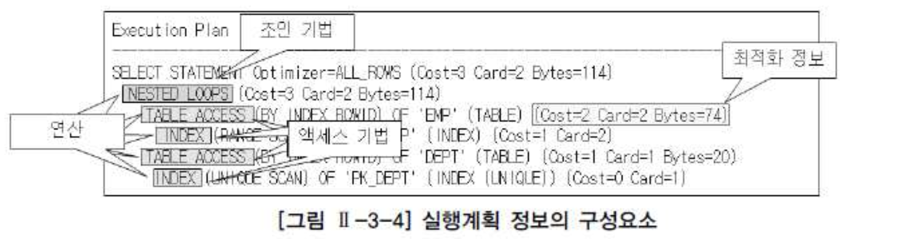

# 01. 옵티마이저와 실행계획


##  1) 옵티마이저


- 옵티마이저는 사용자가 질의한 SQL문에 대해 최적의 실행 방법을 결정하는 역할을 수행한다.
- 옵티마이저가 선택한 실행 방법의 적절성 여부는 질의 수행 속도에 가장 큰 영향을 미치게된다.
- 옵티마이저가 최적의 살행 방법을 결정하는 방식에는 규칙기반(RBO, Rule Based Optimizer)와 비용기반(CBO, Cost Based Optimizer)로 구분한다.
- 현재는 비용기반(CBO) 위주로 신규 기능에 지원되고, 규칙기반(RBO) 에서는 신규 기능에 대해서 지원하지않는다.


#### 가. 규칙기반 옵티마이저

- 규칙기반 옵티마이저가 실행계획을 생성할 때 참조하는 정보에는 SQL문을 실행하기 위해서 이용 가능한 인덱스 유무와(유일, 비유일, 단일, 복합 인덱스) 종류, SQL문 에서 사용하는 연산자(=, <, <>, LIKE, BETWEEN 등)의 종류 그리고 SQL문에서 참조하는 객체(힙, 테이블, 클러스터 테이블 등)의 종류 등이 있다.


| 순위   | 액세스경로                                                | 설명                                                  |
| :----- | :-------------------------------------------------------- | :---------------------------------------------------- |
| **1**  | **Single Row By Rowid**                                   | **ROWID에 의한 단일 로우**                            |
| 2      | Single Row By Cluster Join                                | 클러스터 조인에 의한 단일 로우                        |
| 3      | Single Row By Hash Cluster Key whit Unique or Primary Key | 유일하거나 PK를 가진 해시 클러스터키에 의한 단일 로우 |
| **4**  | **Single Row By Unique or Primary Key**                   | **유일하거나 PK에 의한 단일 로우**                    |
| 5      | Clustered Join                                            | 클러스터 조인                                         |
| 6      | Hash Cluster Key                                          | 해시 클러스터 키                                      |
| 7      | Indexed Cluster Key                                       | 인덱스 클러스터 키                                    |
| **8**  | **Composite Index**                                       | **복합 컬럼 인덱스**                                  |
| **9**  | **Single-Column Indexes**                                 | **단일 컬럼 인덱스**                                  |
| **10** | **Bounded Range Search on Indexed Columns**               | **인덱스기 구성된 컬럼에서 제한된 범위 검색**         |
| **11** | **Unbounded Range Search on Indexed Columns**             | **인덱스가 구성된 컬럼에서 무제한 범위 검색**         |
| 12     | Sort Merge Join                                           | 정렬-병합 조인                                        |
| 13     | MAX or MIN of Indexed Column                              | 인덱스가 구성된 열에서 MAX 또는 MIN                   |
| 14     | ORDER BY on Indexed Column                                | 인덱스가 구성된 열에서 ORDER BY                       |
| **15** | **Full Tabel Scan**                                       | **풀 테이블 스캔**                                    |


- Oracle의 규칙기반 옵티마이저 15가지 규칙 숫자가 낮을수록 높은 우선순위

- 위 15가지 규칙중 주요한 규칙에 대해서 상세한 설명


###### **규칙 1. Single row by rowid**

- ROWID를 통해서 테이블에서 하나의 행을 액세스하는 방식이다.
- ROWID는 행이 포함된 데이터 파일, 블록 등의 정보를 가지고 있기 때문에 다른 정보를 참조하지 않고도 바로 원하는 행을 액세스할 수 있다.
- 하나의 행을 액세스하는 가장 빠른 방법이다.


###### **규칙 4. Single row by unique or primary key**

- 유일 인덱스(Unique Index)를 통해서 하나의 행을 액세스하는 방식이다.
- 이 방식은 인덱스를 먼저 액세스하고 인덱스에 존재하는 ROWID를 추출하여 테이블의 행을 액세스한다.


###### **규칙 8. Composite index** : 복합 인덱스에 동등('=' 연산자) 조건으로 검색하는 경우이다.

- 예를 들어, 만약 A+B 칼럼으로 복합 인덱스가 생성되어 있고, 조건절에서 WHERE A=10 AND B=1 형태로 검색하는 방식이다.
- 복합 인덱스 사이의 우선 순위 규칙은 다음과 같다. 인덱스 구성 칼럼의 개수가 더 많고 해당 인덱스의 모든 구성 칼럼에 대해 '='로 값이 주어질 수록 우선순위가 더 높다.
- 예를 들어, A+B로 구성된 인덱스와 A+B+C로 구성된 인덱스가 각각 존재하고 조건절에서 A, B, C 칼럼 모두에 대해 '='로 값이 주어진다면 A+B+C 인덱스가 우선 순위가 높다.
- 만약 조건절에서 A, B 칼럼에만 '='로 값이 주어진다면 A+B는 인덱스의 모든 구성 칼럼에 대해 값이 주어지고 A+B+C 인덱스 입장에서는 인덱스의 일부 칼럼에 대해서만 값이 주어졌기 때문에 A+B 인덱스가 우선 순위가 높게 된다.


###### **규칙 9. Single column index**

- 단일 칼럼 인덱스에 '=' 조건으로 검색하는 경우이다. 만약 A 칼럼에 단일 칼럼 인덱스가 생성되어 있고, 조건절에서 A=10 형태로 검색하는 방식이다.


###### **규칙 10. Bounded range search on indexed columns**

- 인덱스가 생성되어 있는 칼럼에 양쪽 범위를 한정하는 형태로 검색하는 방식이다.
- 이러한 연산자에는 BETWEEN, LIKE 등이 있다. 만약 A 칼럼에 인덱스가 생성되어 있고, A BETWEEN '10' AND '20' 또는 A LIKE '1%' 형태로 검색하는 방식이다.


###### **규칙 11. Unbounded range search on indexed columns**

- 인덱스가 생성되어 있는 칼럼에 한쪽 범위만 한정하는 형태로 검색하는 방식이다.
- 이러한 연산자에는 >, >=, <, <= 등이 있다. 만약 A 칼럼에 인덱스가 생성되어 있고, A > '10' 또는 A < '20' 형태로 검색하는 방식이다.


###### **규칙 15. Full table scan**

- 전체 테이블을 액세스하면서 조건절에 주어진 조건을 만족하는 행만을 결과로 추출한다.


- 규칙기반은 인덱스를 이용한 액세스 방식이 전체 테이블 액세스 방식보다 우선순위가높다.
- 그러므로 규칙기반 에서는 SQL문에서 이용 가능한 인덱스가 존재하다면 전체 테이블 액세스 방식보다 항상 인덱스를 사용하는 실행계획을 생성하게된다.
- 규칙기반 옵티마이저가 조인 순서를 결정할 때는 조인 칼럼 인덱스의 존재 유무가 중요한 판단기준이다.


###### 규칙기반 최적화

```sql
INDEX
-----
EMP_JOB : JOB 
EMP_SAL : SAL 
PK_EMP : EMPNO (UNIQUE)

존재해야된다고해서
job, sal 은 인덱스가 존재하지않아서 생성

CREATE INDEX JOB ON EMP
(JOB)

CREATE INDEX SAL ON EMP
(SAL)

-- 예제형태(규칙10) --
select  ename
  from EMP
 where job='SALESMAN'
  and sal between 3000 and 6000

------------------------------------------------------------------------------------
| Id  | Operation                   | Name | Rows  | Bytes | Cost (%CPU)| Time     |
------------------------------------------------------------------------------------
|   0 | SELECT STATEMENT            |      |       |       |     2 (100)|          |
|*  1 |  TABLE ACCESS BY INDEX ROWID| EMP  |     1 |    18 |     2   (0)| 00:00:01 |
|*  2 |   INDEX RANGE SCAN          | SAL  |     3 |       |     1   (0)| 00:00:01 |
------------------------------------------------------------------------------------
 
Predicate Information (identified by operation id):
---------------------------------------------------
 
   1 - filter("JOB"='SALESMAN')
   2 - access("SAL">=3000 AND "SAL"<=6000)


-- sal 에 to_number로(규칙9) --
select  ename
  from EMP
 where job='SALESMAN'
   and to_number(sal) between 3000 and 6000

------------------------------------------------------------------------------------
| Id  | Operation                   | Name | Rows  | Bytes | Cost (%CPU)| Time     |
------------------------------------------------------------------------------------
|   0 | SELECT STATEMENT            |      |       |       |     2 (100)|          |
|*  1 |  TABLE ACCESS BY INDEX ROWID| EMP  |     1 |    18 |     2   (0)| 00:00:01 |
|*  2 |   INDEX RANGE SCAN          | JOB  |     3 |       |     1   (0)| 00:00:01 |
------------------------------------------------------------------------------------
 
Predicate Information (identified by operation id):
---------------------------------------------------
 
   1 - filter((TO_NUMBER(TO_CHAR("SAL"))>=3000 AND 
              TO_NUMBER(TO_CHAR("SAL"))<=6000))
   2 - access("JOB"='SALESMAN')
```


#### 나. 비용기반 옵티마이저

- 규칙기반은 어떠한 정해진(연산자) 규칙에 따라 만들어졌을때 BETWEEN 의 현실적인 데이터의 건수 등을 측정을 예측하지못한다.
- 비용기만은 이러한 단점을 극복하기위해 출현하였다.
- 비용기반은 SQL문을 처리하는데 필요한 비용이 가장 적은 실행계획을 선택하는 방식이다.
- 비용이란 SQL문을 처리하기 위해 예상되는 소유시간 또는 자원 사용량을 의미한다.
- 비용기반은 테이블, 인덱스, 칼럼 등의 다양한 객체 통계정보와 시스템 통계정보 등을 이용한다.
- 비용기반은 통계정보가 없는 경우 불확실한 실행계획을 생성 할 수 있으므로 정확한 통계정보를 유지하는것이 중요한 요소이다.


- 질의변환기는 사용자가 작성 SQL문을 처리하기에 보다 용이한 형태로 변환하는 모듈
- 대안생성기는 동일한 결과를 생성하는 다양한 대안 계획을 생성하는 모듈
  - 대안계획은 연산 적용순서변경, 연산방법변경, 조인순서변경 등을 통해 생성
  - 동일한 결과를 생성하는 가능한 모든 대안 계획을 생성해야 보다 나은 최적화를 수행
  - 대안계획을 생성이 너무 많아지면 최적화 하는 수행시간이 그만큼 오래 걸릴 수 있다.

- 비용예측기는 대안 계획생성기에 의해 생성된 대안 계획의 비용을 예측하는 모듈
  - 대안계획의 정확한 비용을 예측하기 위해서 연산의 중간 집합의 크기 및 결과 집합의 크기, 분포도등의 예측이 정확해야한다.
  - 대안계획을 구성하는 각 연산에 대한 비용 계산식이 정확해야한다.

- 비용기반은 통계정보, DBMS버전 , DBMS설정(PARAMETER) 의해 동일한 SQL 실행계획이 틀어질 수 있다.
  
- 비용기반은 다양한 한계(BIND변수)들로 인해 실행계획의 예측 및 제어가 어렵다라는 단점이 존재


## 2) 실행계획

- 실행계획이라는 SQL에서 요구한 사항을 처리하기 위한 절차와 방법을 의미한다.
- 실행계획생성한다는 것은 SQL을 어떤 순서로 어떻게 실행할 지를 결정하는 작업이다.
- 실행계획은 데이터베이스 벤더마다 서로 다르다.
- 실행계획에서 표시되는 내용 및 형태도 약간씩 차이는 있지만 실행계획이 SQL 처리를 위한 절차와 방법을 의미한다는 기본적인 사항은 모두 동일하다
- 하단은 Oracle 실행계획 형태이다. 실행계획은 구성하는 요소는 조인순서, 조인기법, 액세스 기법, 최적화 정보, 연산등이있다.




###### 조인작업 수행 할 때 참조하는 테이블순서

- FROM 절 A,B 두개의 테이블이 존재할 때 조인 작업을 위해 먼저 A 테이블을 읽고 B 테이블을 읽는 작업을 수행한다면 조인 순서는 A -> B이다.
- 조인순서는 EMP -> DEPT이다.
- 조인기법은 NL JOIN, HASH JOIN, SORT JOIN, MERGE JOIN 등이 있다.
- 액세스기법은 인덱스를 이용하여 테이블을 액세스하는 인덱스 스캔과 테이블 전체를 모두 읽으면서 조건을 만족하는 행을 찾는 전체테이블스캔이있다.
- 최적화 정보는 옵티마이저가 실행계획의 각 단계마다 예상되는 비용을 표시 한것이다.
- 최적화 정보에는 COST(상대적비용), CARD(주어진조건을 만족한 결과 집합 혹은 조인 조건을 만족한 결과 집합건수), BYTES(결과집합이 차지하는 메모리양)가 있다.
- 연산은 여러가지 조작을 통해서 워ㅓㅜㄴ하는 결과를 얻어내는 일련의 작업이다.
- 연산에는 조인기법, 액세스 기법, 필터, 정렬, 집계, 뷰 등 다양한 종류가 존재한다.


###### 조인기법예제

```sql
 SELECT *
   FROM EMP A, DEPT B
  WHERE A.DEPTNO = B.DEPTNO

----------------------------------------------------------------------------------------
| Id  | Operation                    | Name    | Rows  | Bytes | Cost (%CPU)| Time     |
----------------------------------------------------------------------------------------
|   0 | SELECT STATEMENT             |         |       |       |     4 (100)|          |
|   1 |  NESTED LOOPS                |         |    14 |   798 |     4   (0)| 00:00:01 |
|   2 |   TABLE ACCESS FULL          | EMP     |    14 |   518 |     3   (0)| 00:00:01 |
|   3 |   TABLE ACCESS BY INDEX ROWID| DEPT    |     1 |    20 |     1   (0)| 00:00:01 |
|*  4 |    INDEX UNIQUE SCAN         | PK_DEPT |     1 |       |     0   (0)|          |
----------------------------------------------------------------------------------------
 
Query Block Name / Object Alias (identified by operation id):
-------------------------------------------------------------
 
   1 - SEL$1
   2 - SEL$1 / A@SEL$1
   3 - SEL$1 / B@SEL$1
   4 - SEL$1 / B@SEL$1
 
Predicate Information (identified by operation id):
---------------------------------------------------
 
   4 - access("A"."DEPTNO"="B"."DEPTNO")
 
Column Projection Information (identified by operation id):
-----------------------------------------------------------
 
   1 - "A"."EMPNO"[NUMBER,22], "A"."ENAME"[VARCHAR2,10], "A"."JOB"[VARCHAR2,9], 
       "A"."MGR"[NUMBER,22], "A"."HIREDATE"[DATE,7], "A"."SAL"[NUMBER,22], 
       "A"."COMM"[NUMBER,22], "A"."DEPTNO"[NUMBER,22], "B"."DEPTNO"[NUMBER,22], 
       "B"."DNAME"[VARCHAR2,14], "B"."LOC"[VARCHAR2,13]
   2 - "A"."EMPNO"[NUMBER,22], "A"."ENAME"[VARCHAR2,10], "A"."JOB"[VARCHAR2,9], 
       "A"."MGR"[NUMBER,22], "A"."HIREDATE"[DATE,7], "A"."SAL"[NUMBER,22], 
       "A"."COMM"[NUMBER,22], "A"."DEPTNO"[NUMBER,22]
   3 - "B"."DEPTNO"[NUMBER,22], "B"."DNAME"[VARCHAR2,14], "B"."LOC"[VARCHAR2,13]
   4 - "B".ROWID[ROWID,10], "B"."DEPTNO"[NUMBER,22]
```


## 3) SQL 처리 흐름도

- SQL 처리 흐름도란 SQL의 내부적인 처리 절차를 시각적으로 표현한 도표이다.
- 조인순서는 TAB1 -> TAB2
- TAB1을 Outer Table 또는 Driving Table이라고 하고, TAB2를 Inner Table또는 Lookup Talbe이라고 한다
- 테이블 액세스 방법은 TAB1은 전체 테이블 스캔을 의미하고 TAB2는 I01_TAB2이라는 인덱스를 통한 인덱스 스캔을 했음을 표시한다.
- 조인방법은 NL Join 을 수행 했음을 표시한다.
- TAB1에 대한 액세스는 스캔 방식이고 조인시도 및 I01_TAB2 인덱스를 통한 TAB 액세스는 랜덤 방식이다.
- 대량의 데이터를 랜덤방식으로 액세스 하면 많은 I/O가 발생하여 성능은 저하된다.


###### SQL 처리 흐름도

```sql
-- 1번
 SELECT *
   FROM EMP A, DEPT B
  WHERE A.DEPTNO = B.DEPTNO
    AND A.JOB='SALESMAN'

--------------------------------------------------------------------------------------------------
| Id  | Operation                    | Name    | Starts | E-Rows | A-Rows |   A-Time   | Buffers |
--------------------------------------------------------------------------------------------------
|   1 |  NESTED LOOPS                |         |      1 |      3 |      4 |00:00:00.01 |      14 |
|*  2 |   TABLE ACCESS FULL          | EMP     |      1 |      3 |      4 |00:00:00.01 |       8 |
|   3 |   TABLE ACCESS BY INDEX ROWID| DEPT    |      4 |      1 |      4 |00:00:00.01 |       6 |
|*  4 |    INDEX UNIQUE SCAN         | PK_DEPT |      4 |      1 |      4 |00:00:00.01 |       2 |
--------------------------------------------------------------------------------------------------
 
Predicate Information (identified by operation id):
---------------------------------------------------
 
   2 - filter("A"."JOB"='SALESMAN')
   4 - access("A"."DEPTNO"="B"."DEPTNO")


-- 2번
 SELECT *
   FROM EMP A, DEPT B
  WHERE A.DEPTNO = B.DEPTNO
    AND A.JOB='SALESMAN'
    AND b.DNAME = 'SALES'

--------------------------------------------------------------------------------------------------
| Id  | Operation                    | Name    | Starts | E-Rows | A-Rows |   A-Time   | Buffers |
--------------------------------------------------------------------------------------------------
|   1 |  NESTED LOOPS                |         |      1 |      1 |      4 |00:00:00.01 |      14 |
|*  2 |   TABLE ACCESS FULL          | EMP     |      1 |      3 |      4 |00:00:00.01 |       8 |
|*  3 |   TABLE ACCESS BY INDEX ROWID| DEPT    |      4 |      1 |      4 |00:00:00.01 |       6 |
|*  4 |    INDEX UNIQUE SCAN         | PK_DEPT |      4 |      1 |      4 |00:00:00.01 |       2 |
--------------------------------------------------------------------------------------------------
 
Predicate Information (identified by operation id):
---------------------------------------------------
 
   2 - filter("A"."JOB"='SALESMAN')
   3 - filter("B"."DNAME"='SALES')
   4 - access("A"."DEPTNO"="B"."DEPTNO")
```

- 조건절의 있는 조건을 읽은후 조인시도를 한다.
- 조건절의 건수만큼 조인시도는 일어난다.
- 이유는 B.DEPTNO 는 인덱스 이므로 EMP 에서 읽어들인 건수만큼만 DEPT와 조인시도가 이뤄진다.
