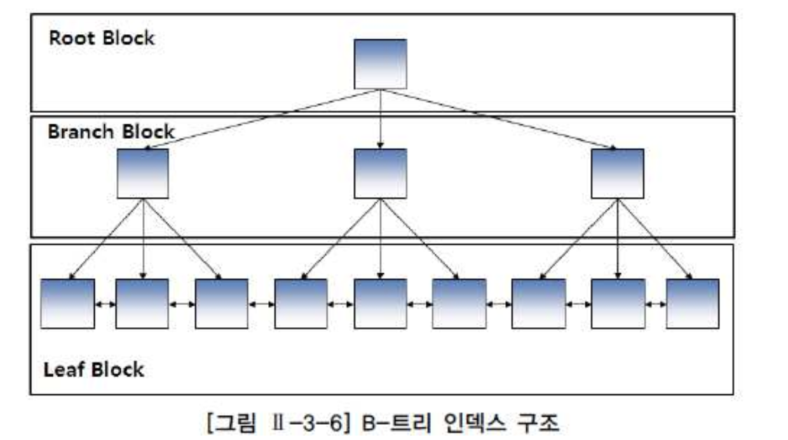
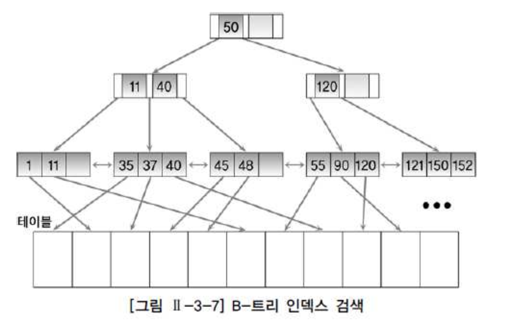
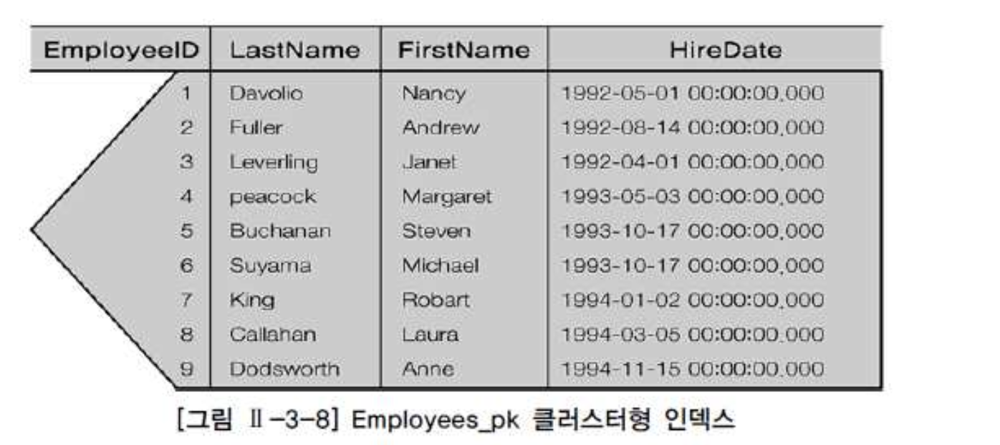
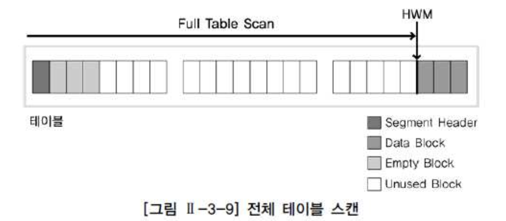
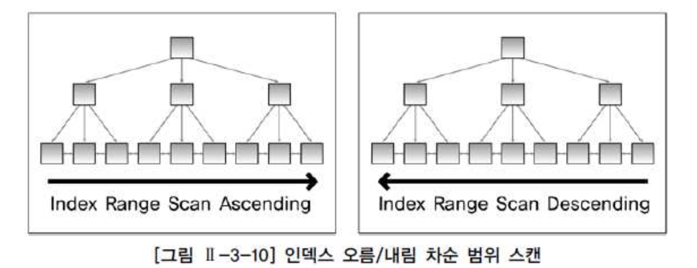
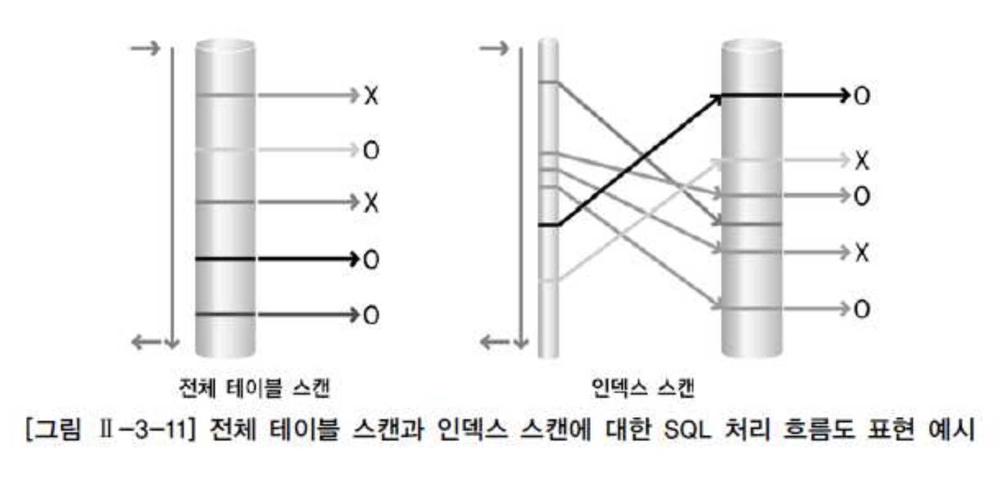

# 02. 인덱스 기본

##  1) 인덱스 특징과 종류

- 인덱스는 원하는 데이터를 쉽게 찾을 수 있도록 돕는 책의 찾아보기(색인)과 유사한 개념이다.
- 인덱스는 테이블을 기반으로 선택적으로 생성할 수 있는 구조이다.
- 인덱스의 기본적인 목적은 검색 성능의 최적화이다.
- 검색 조건을 만족하는 데이터를 인덱스를 통해 효과적으로 찾을수 있도록 돕는다.
- DML 작업은 테이블과 인덱스를 함께 변경하므로 느려지는 단점이 존재한다.

### 가. 트리기반 인덱스

- DBMS에서 가장 일반적인 인덱스이다.
- B 트리 인덱스는 브랜치블록과 리프 블록으로 구성한다.
- 브랜치 블록중 가장 상위에 있는 블록을 루트 블록이라한다.
- 브랜치 블록은 분기를 목적으로 하는 블록이다.
- 리프 블록은 트리 가장 아래 단계에 존재한다.
- 리프블록은 인덱스를 구성하는 칼럼의 데이터와 해당 데이터를 가지고 있는 행의 위치를 가리키는 레코드 식별자로 구성된다.
- 인덱스 데이터는 인덱스를 구성하는 칼럼의 값으로 정렬된다.
- 인덱스 데이터의 값이 동ㅇ리하면 레코드 식별자 순서로 저장된다.
- 리프 블록은 양방향 링크를 가지고 있다.(이것을 통하여 오름차순과 내림차순 검색을 쉽게 할 수 있다.)
- B 트리 인덱스는 '=' , 'BETWEEN', '>' 등과 같은 연산자로 검색구조에 적합한 구조이다.|

###### 브랜치 블록이 3개의 포인터로 구성된 B트리 인덱스에서 원하는 값을 찾는과정

- 1단계. 브랜치 블록의 가장 왼쪽 값이 찾고자 하는 값보다 작거나 같으면 왼쪽 포인터로 이동.
- 2단계. 찾고자 하는 값이 브랜치 블록의 값 사이에 존재하면 가운데 포인터로 이동
- 3단계. 오른쪽에 있는 값보다 크면 오른쪽 포인터로 이동
- 37을 찾는 과정(=37) 루트 50 -> 11,40 -> 35,37,40
- 37~50 사이값을 찾는 과정(BETWEEN 37 AND 50) 루트 50 -> 11,40 -> 35,37,40 -> 45,48(옆으로 50이 존재할때까지 이동) 양방향 링크로 연결되어 있으므로 가능하다.

- 인덱스를 생성할 때 동일 칼럼으로 구성된 인덱스를 생성할 수 없다.
- 인덱스 구성 칼럼은 동일하지만 칼럼의 순서가 다르면 서로 다른 인덱스로 생설할 수 있다.(JOB+SAL , SAL+JOB)
- 인덱스 칼럼의 순서는 성능에 중요한 영향을 미치는 요소이다.
- Oracle 에서는 B 트리, 비트맵, 리버스 키, 함수기반 인덱스등이 존재한다.

### 나. SQl Server의 클러스터형 인덱스

SQL Server의 인덱스 종류는 저장 구조에 따라 클러스터형, 비클러스터형 인덱스로 나뉜다.

###### 클러스터형 인덱스는 두가지 중요한 특징이있다

- 첫째, 인덱스 리프 페이지가 곧 데이터 페이지다. 테이블 탐색에 필요한 레코드 식별자가 리프페이지에 없다.
- 클러스터형 인덱스의 리프 페이지를 탐색하면 해당 테이블의 모든 칼럼 값을 곧바로 얻을 수 있다. 클러스터형 인덱스를 사전에 비유한다.
- 예를들면, 영한사전은 알파벳 순으로 정렬되어 있으며 각 단어 바로 옆에 한글 설명이 붙어있다.
- 책 끝 부분에 잇는 찾아보기(색인)가 페이지 벊만 알려주는 것과 비교하면 그 차이를 알 수 있다.

- 둘째, 리프 페이지를 모든 로우(데이터)는 인덱스 키 칼럼 순으로 물리적으로 정렬되어 저장된다.
- 테이블 로우는 물리적으로 한 가지 순서로만 정렬될 수 있다. 그러므로 클러스터형 인덱스 테이블당 한 개만 생성 할 수 있다
- 전화번호부 한 권을 상호와 인명으로 동시에 정렬할 수 없는 것과 마찬가지다

- 그림은 employee ID, last name, first name, hire daqte로 구성된 employrees 테이블에 대해 employee ID에 기반한 클러스터형 인덱스를 생성한 모습이다.

## 2) 전체테이블 스캔과 인덱스 스캔

### 가. 전체 테이블 스캔

- 테이블에 존재하는 모든 데이터를 읽어 가면서 조건이 맞으면 결과로 추출하고 조건에 맞지않으면 버리는 방식이다.

- Oracle 경우 그림과 같이 검색 조건에 맞는 데이터를 찾기 위해 테이블의 고수위 마크(HWM,High Water Mark) 아래의 모든 블록을 읽는다.
- 고수위 마크는 테이블에 데이터가 쓰여졌던 블록 상위 최상위 위치(현재는 지워져서 데이터가 존재하지 않을 수도 있음)를 의미한다.
- 전체 테이블 스캔 방식으로 데이터를 검색할 때 고수위 마크까지의 블록 내 모든 데이터를 읽어야 하기 때문에 모든 결과를 찾을 때 까지 시간이 오래 걸릴 수 있다.
- 전체 테이블 스캔방식은 테이블에 존재하는 모든 블록의 데이터를 읽는다.
- 모든 블록을 ㄹ읽었다기 보다 Full Table Scan 연산이었기 때문에 모든블록을 읽은 것이다.
- 이렇게 읽은 블록은 재사용성이 떨어진다.
- 전체 테이블 스캔 방식으로 읽은 블록들은 메모리에서 곧 제거될 수 있도록 관리된다.

###### 옵티마이저가 연산으로 전체 테이블 스캔방식을 선택하는 이유

- 1) SQL문에 조건이 존재하지 않은경우

  - SQL문에 조건이 존재하지 않는다는 것은 테이블에 존재하는 모든 데이터가 답이 된다는것이므로 모든 블록을 읽으면서 결과로서 반환

- 2) SQL문의 주어진 조건에 사용 가능한 인덱스가 존재하지 않는 경우

  - 사용 가능한 인덱스가 존재하지 않는다면 데이터를 액세스할 수 있는 방법은 테이블의 모든 데이터를 읽으면서 주어진 조건을 만족하는지를 검사하는 방법 뿐이다.
  - 또한, 주어진 조건에 사용 가능한 인덱스는 존재하나 함수를 사용하여 인덱스 칼럼을 변형한 경우에는 인덱스를 사용할 수 없다.
  
- 3) 옵티마이저의 취사 선택

  - 조건을 만족하는 데이터가 많은 경우, 결과를 추출하기 위해서 테이블의 대부분의 블록을 액세스해야 한다고 옵티마이저가 판단하면 조건에 사용 가능한 인덱스가 존재해도 전체 테이블 스캔 방식으로 읽을 수 있다.

- 4) 그 밖의 경우

  - 병렬처리 방식으로 처리하는 경우 또는 전체 테이블 스캔 방식의 힌트를 사용한 경우에 전체 테이블 스캔방식으로 읽을 수 있다

### 나. 인덱스 스캔

- 데이터베이스에서 주로 사용되는 트리 기반 인덱스 중심으로 설명한다.
- 인덱스 스캔은 인덱스를 구성하는 칼럼의 값을 기반으로 데이터를 추출하는 방식이다.
- 인덱스 리프 블록은 인덱스 구성하는 칼럼과 레코드 식별자로 구성되어 있다.
- 인덱스의 리프 블록을 읽으면 인덱스 구성 칼럼의 갑소가 테이블의 레코드 식별자를 알 수 있다.
- 인덱스에 존재하지 않는 칼럼의 값이 필요한 경우 현재 읽은 레코드 식별자를 이용하여 테이블을 액세스 해야한다.
- SQL문에 필요로 하는 모든 칼럼이 인덱스 구성 칼럼에 포함된 경우 테이블에 대한 액세스는 발생하지 않는다.
- 인덱스는 인덱스 구성 칼럼의 순서로 정렬되어 있다.

###### 인덱스 유일스캔(index unique scan)

- 유일 인덱스는 중복을 허락하지않는다. 유일 인덱스 구성 칼럼에는 모두 '=' 구성이다

###### 인덱스 범위 스캔(index range scan)

- 인덱스를 이용하여 한 건 이상 데이터를 추출하는 방식이다.
- 칼럼 모두에 대해 '='로 값이 주어지지 않은 경우와 비유일 인덱스(non-unique index)를 이용한 스캔방식으로 데이터를 액세스한다.
- 하단 그림과 왼쪽 방식으로 읽는다

###### 인덱스 역순 범위 스캔(index range scan descending)

- 그림의 오른쪽과 같이 인덱스 리프 블록의 양방향 양방향 링크를 이용하여 내림차순으로 데이터를 읽는 방식이다.
- 이 방식을 이용하여 최대값을 쉽게 찾을수 있다.

- 이외에도 인덱스 전채스캔(index full scan), 인덱스 고속 전체스캔(fast full index scan), 인덱스 스킵스캔(index skip scan) 등이 존재

### 다. 전체 테이블 스캔과 인덱스 스캔방식의 비교

- 데이터를 액세스하는 방법은 인덱스를 경우해서 읽는 인덱스 스캔방식과 테이블을 전체 데이터를 모두 읽으면서 데이터를 추출하는 전체 테이블을 스캔하는 방식이있다.
- 인덱스 스캔은 사용가능한 적절한 인덱스가 존재할 떄만 이용할 수 있는 방식이고, 전체 테이블 스캔 방식은 인덱스의 존재유무와 상관없이 항상 사용가능한 스캔 방식이다.

- 전체 테이블 스캔이냐, 인덱스 스캔이냐 차이는 대용량 데이터중 극히 일부의 데이터를 찾을 때는 인덱스 스캔방식을 이용하여 몇번의 I/O만으로 데이터를 찾고 전체 테이블 스캔은 모든 데이터를 읽으면서 원하는 데이터를 찾아햐 하므로 비효율적인 검색을 한다.
- 그러나 어차피 한번에 여러 블록씩 읽는거라면 전체 테이블 스캔 방식이 유리할 수 있다.
