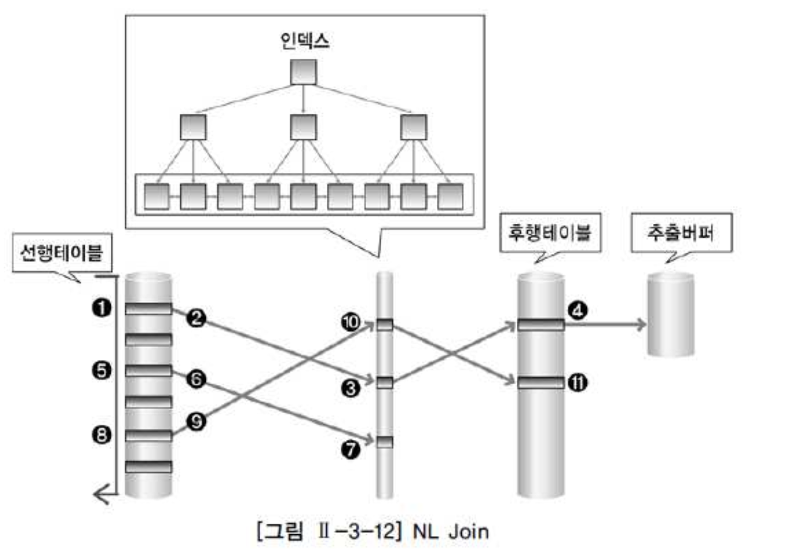

# 03. 조인수행원리

- 조인이란 두개 이상의 테이블을 하나의 집합으로 만드는 연산이다.
- 조인기법중 자주사용되는 조인은 NL JOIN, HASH JOIN, SORT MERGE JOIN등이 있다.


## 1) NL Join

- NL 조인은 프로그램에서 사용하는 중첩된 반복문과 유사한 방식으로 조인을 수행한다.
- 반복문의 외부에 있는 테이블을 선행 테이블 또는 외부테이블(OUTER TABLE)이라고하고,
- 반복문의 내부에 있는 테이블을 후행 테이블 또는 내부(INNER TABLE)이라고 한다.

```sql
 FOR 선행 테이블 읽음 -> 외부테이블(OUTER TABLE)
 FOR 후행테이블 읽음 -> 내부 테이블(INNER TABLE)
(선행 테이블과 후행 테이블조인)
```

- 먼저 선행 테이블의 조건을 만족하는 행을 추출하여 후행 테이블을 읽으면서 조인을 수행한다.
- 선행테이블의 조건을 만족하는 모든 행의 수만큼 반복수행한다.
- 선행 테이블의 조건을 만족하는 행의 수가 많으면 그만큼 후행 테이블 조인작업은 반복 수행된다.
- 결과 행의 수가 적은 테이블을 조인 순서상 선행 테이블로 선택하는것이 전체 일량을 줄일수있다.
- 랜덤 방식으로 데이터 액세스하기 때문에 처리 범위가 좁은 것의 조건으로 선택이 유리하다.


##### NL JOIN 작업 방법

1) 선행 테이블에서 주어진 조건을 만족하는 행을 찾음
2) 선행 테이블의 조인 키 값을 가지고 후행 테이블에서 조인 수행
3) 선행 테이블의 조건을 만족하는 모든 행에 대해 1번 작업 반복 수행




##### NL JOIN의 수행 방식

- 1) 선행 테이블에서 조건을 만족하는 첫 번째 행을 찾음

  - 이때 선행 테이블에 주어진 조건을 만족하지 않는 경우 해당 데이터는 필터링됨

- 2) 선행 테이블의 조인 키를 가지고 후행 테이블에 조인 키가 존재하는지 찾으로 감

  - 조인시도

- 3) 후행 테이블의 인덱스에 선행 테이블의 조인 키가 존재하는지 확인

  - 선행 테이블의 조인 값이 후행 테이블에 존재하지 않으면 선행 테이블 데이터는 필터링됨(조인작업x)

- 4) 인덱스에서 추출한 레코드 식별자를 이용하여 테이블을 액세스

  - 인덱스 스캔을 통한 테이블 액세스

- 5) ~ 11) 반복수행

- 추출버퍼는 SQL문의 실행결과를 보관하는 버퍼로 일정 크기를 설정하여 결과가 모두 차거나 더이상
- 결과가 없으면 추출버퍼를 채울 것이 없으면 결과를 사용자에게 반환한다.
- 추출 버퍼는 운반단위, Array Size, prefetch Size라고도 한다.

- 그림 3-12 선행 테이블에 사용 가능한 인덱스가 존재했다면 인덱스를 통해 선행 테이블을 액세스할 수 있다.
- **NL Join 기법은 성공하면 바로 결과를 사용자에게 보여주므로 온라인 프로그램에 적당한 조인 기법이다.**


## 2) Sort Merge Join

- Sort Merge Join은 조인 칼럼을 기준으로 데이터를 정렬하여 조인을 수행.
- Sort Merge Join은 주로 스캔 방식으로 데이터를 읽는다.
- Sort Merge Join은 랜덤액세스로 부담이 되는 넓은 범위의 데이터를 처리 할 때 이용.
- Sort Merge Join은 정렬할 데이터가 많아 메모리에 모든 정렬작업을 수행하기 어려운 경우에는 임시영역을 사용하므로 성능이 떨어질 수 있다.
- Sort Merge Join은 Hash Join과는 달리 동등 조인 뿐만 아니라 비동등 조인에 대해서 조인 작업이 가능하다.


##### Sort Merge Join 동작

- 1) 선행 테이블에서 주어진 조건을 만족하는 행을 찾음
- 2) 선행 테이블의 조인 키를 기준으로 정렬 작업을 수행(1 ~ 2번작업을 선행 테이블의 조건을 만족하는 모든 행에 대해 반복 수행)
- 3) 후행 테이블에서 주어진 조건을 만족하는 행을 찾음
- 4) 후행 테이블의 조인 키를 기준으로 정렬 작업을 수행(3 ~ 4번 작업을 후행 테이블의 조건을 만족하는 모든 행에 대해 반복 수행)
- 5) 정렬된 결과를 이용하여 조인을 수행하며 조인에 성공하면 추출버퍼에 넣음

- Sort Merge Join은 조인 칼럼의 인덱스가 존재하지 않을 경우에도 사용할 수 있는 기법이다.
- Sort Merge Join에서 조인 작업을 위해 항상 정렬 작업이 발생하는 것은아니다.


## 3) Hash Join

- Hash Join은 해슁기법을 이용하여 조인을 수행
- 조인 칼럼을 기준으로 해쉬함수를 수행하여 서로 동일한 해쉬 값을 갖는 것들 사이에서 실제 값이 같은지를 비교하면서 조인을 수행
- NL Join 랜덤액세스 와 Sort Merge Join 의 문제점인 정렬 작업의 부담을 해결하기 위한 대안으로 등장


##### Hash Join 동작

- 1) 선행 테이블에서 주어진 조건을 만족하는 행을찾음

- 2) 선행 테이블의 조인 키를 기준으로 해쉬 함수를 적용하여 해쉬 테이블을 생성(조인 칼럼과 SELECt 절에서 필요로 하는 칼럼도 함께 저장)

  - (1 ~ 2번 작업을 선행 테이블의 조건을 만족하는 모든 행에 대해 반복수행)

- 3) 후행 테이블에서 주어진 조건을 만족하는 행을 찾음

- 4) 후행 테이블의 조인 키를 기준으로 해쉬 함수를 적용하여 해당 버킷을 찾음(조인 키를 이용해서 실제 조인될 데이터를 찾음)

- 5) 조인에 성공하면 추출버퍼에 넣음(3 ~ 5번 작업을 후행 테이블의 조건을 만족하는 모든 행에 대해서 반복수행)|


- Hash Join은 조인 칼럼의 인덱스가 존재하지 않을 경우에도 사용할 수 있는 기법이다.
- Hash Join은 해쉬 함수를 이용하여 조인을 수행하기 때문에 ='=로 수행하는 조인, 동등조건에만 사용 할 수 있다.
- 해쉬 함수가 적용될 때 동일한 값을 항상 같은 값으로 해슁됨이 보장된다.
- Hash Join 작업을 수행하기위해 해쉬 테이블을 메모리에 생성해야한다.
- 메모리에 적재할 수 있는 영역에 크기보다 커지면 임시 영역(디스크)에 해쉬 테이블을 저장한다.
- Hash Join을 할 때는 결과 행의 수가 적은 테이블을 선행 테이블로 사용하는 것이 좋다.
- 선행 테이블을 Build Input 이라하며, 후행 테이블은 Prove Input이라한다.
