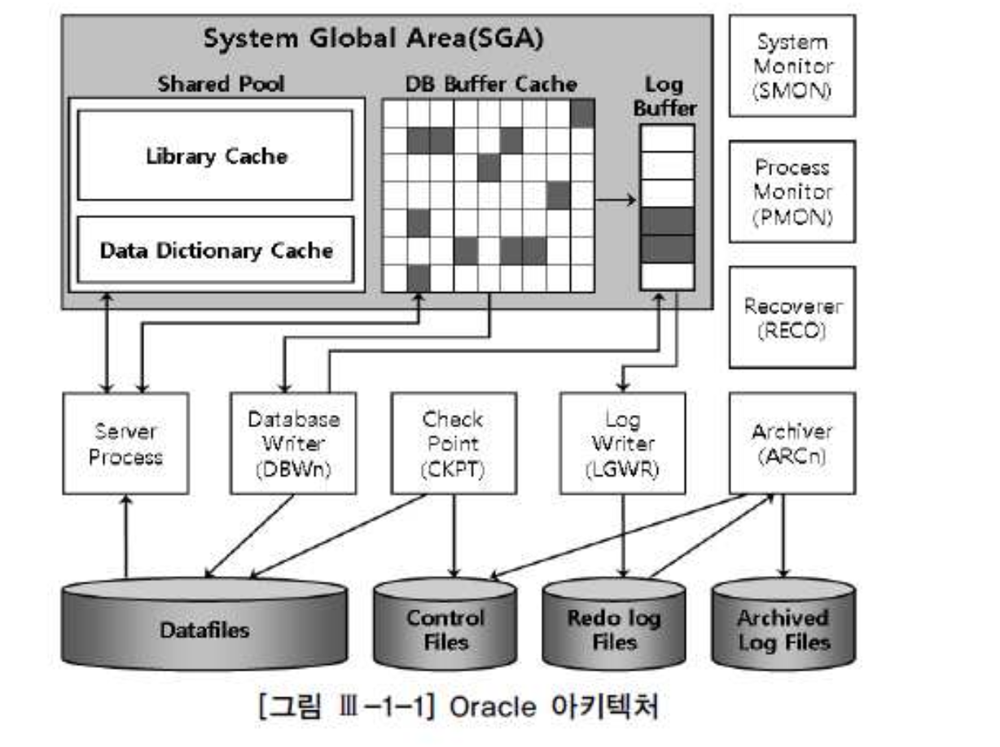
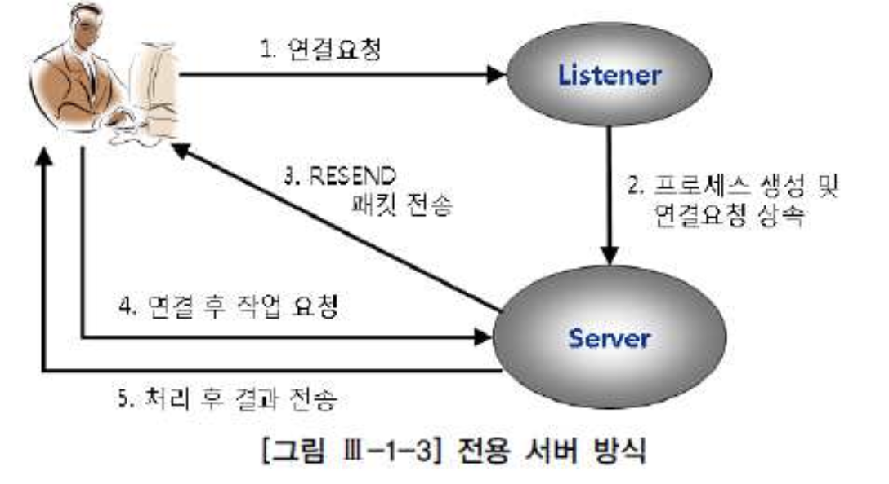
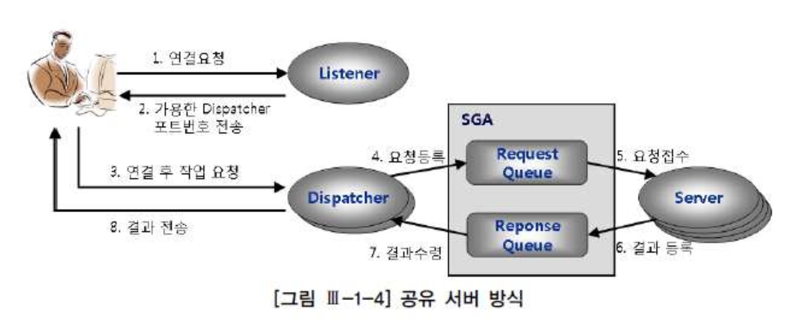
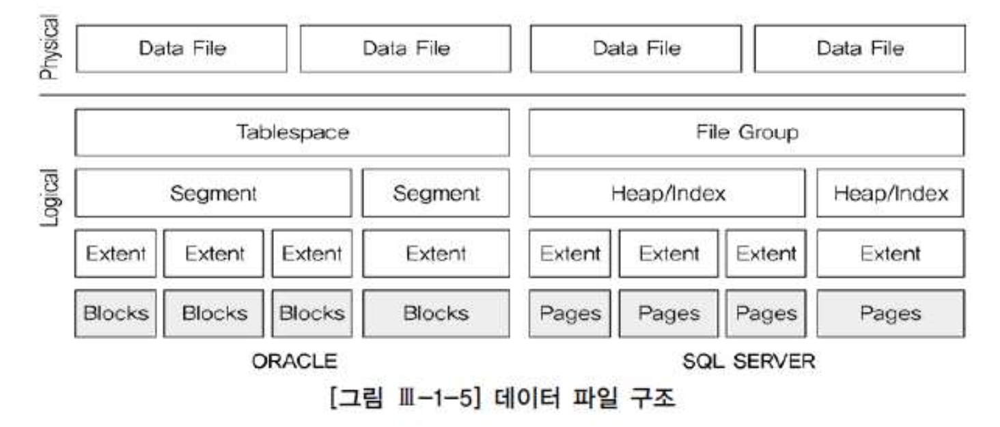
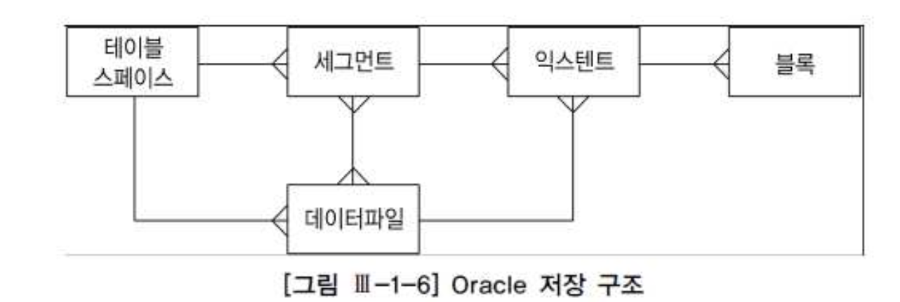
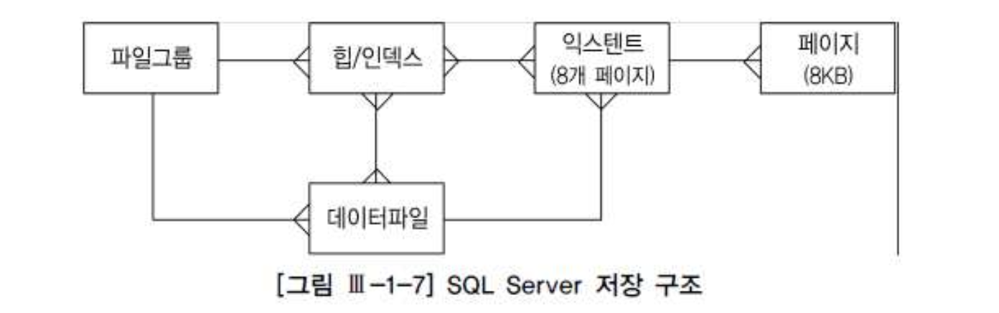
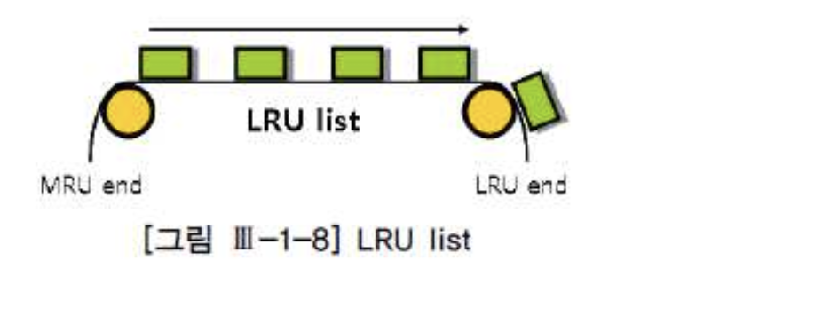

# 01. 데이터베이스 아키텍처


##  1) 아키텍처 개요

##### 가. ORACLE 아키텍처

**정의**

- 데이터베이스 : 물리적인 디스크에 저장된 데이터집합(데이터파일, 리두로그파일, 컨트롤파일)
- 인스턴스 : 공유메모리(SGA)와 이를 엑세스하는 프로세스 집합

- 하나의 인스턴스는 하나의 데이터베이스를 엑세스(Single), 여러개의 인스턴스는 하나의 데이터베이스를 엑세스(RAC)





##### 나. SQL Server 아키텍처

**정의**

- 하나의 인스턴스당 최고 32,767개의 데이터베이스를 정의해서 사용
- 기본적으로 시스템데이터베이스가 만들어지면, 사용자데이터베이스를 추가하여 생성하는 구조


- 시스템데이터베이스 : mster, model, msdb, tempdb 등
- 사용자데이터베이스 : 데이터파일(mdf), 트랜잭션로그파일(ldf), 보조데이터파일(ndf)


## 2) 프로세스

- 서버프로세스 : 전면에 나서 사용자가 던지는 각종 명령을 처리
- 백그라운드프로세스 : 뒤에서 묵묵히 주어진 역할을 수행


##### 가. 서버프로세스(Server Process)

- 사용자 프로세스와 통신하면서 사용자의 각종 명령어 처리
- ORACLE : 서버프로세스
- SQL Server : Worker thread

###### 처리절차

- 사용자의 요청
- SQL 파싱
- 커서를 열어서 SQL을 실행하면서 블록 READ
- 읽은 데이터를 정렬하여 요청한 결과집합을 만들어 네트워크를 통해 전송


###### 클라이언트가 서버프로세스와 연결하는 방식(예 오라클)

**1) 전용서버 방식(Dedicated Server)**

- - 클라이언트 세션과 서버프로세스가 1:1 로 매핑
  - 오라클의 가장 일반적인 방식
  - 클라이언트 요청에 의해 리스너 프로세스는 dedicated server 생성
  - 새로운 dedicated server 프로세스는 리스너에 의해 커넥션 권한을 상속받음
  - 데이터베이스와 물리적인 커넥션을 맺음





- 2) 공유서버 방식(Shared Server)

  - 클라이언트 세션과 서버프로세스가 1:N 로 매핑
  - 클라이언트 요청에의해 리스너 프로세스는 현재 사용가능한 dispatcher pool 탐색확인
  - 리스너는 사용가능한 dispatcher커넥션 정보를 클라이언트에 되돌려줌
  - 클라이언트는 리스너 접속을 끝내고 바로 dispatcher 로 접속





##### 나. 백그라운드프로세스

| ORACLE                 | SQL Server                               | 설명                                                         |
| :--------------------- | :--------------------------------------- | :----------------------------------------------------------- |
| SMON(System Monitor)   | Database cleanup / Shrinking Thread      | 장애가 발생한 시스템을 재기동할 때 인스턴스 복구를 수행하고, 임시 세그먼트와 익스텐트를 모니터링한다 |
| PMON(Process Minitor)  | Open Data Services(OPS)                  | 이상이 생긴 프로세스가 사용하던 리소스를 복구한다            |
| DBWn(Database Writers) | Lazywriter Thread                        | 버퍼 캐시에 있는 더티 버퍼를 데이터 파일에 기록              |
| LGWR (Log Writer)      | Log writer Thread                        | 로그 버퍼 엔트리를 redo 로그 파일에 기록한다                 |
| ARCn(Archiver)         | N/A                                      | 꽉찬 리두로그가 덮어 쓰여지기 전에 archive로그 디렉토리로 백업한다 |
| CKPT(Checkpoint)       | Database Checkpoint Thread               | checkpoint 프로시스는 이전의 checkpoint 가 일어났던 마지막 시점 이후의 데이터베이스 변경 사항을 데이터파일에 기록하도록 트리거링하고, 기록이 완료되면 현재 어디까지 기록했는지를 컨트롤 파일과 데이터 파일 헤더에 기록한다. 좀더 자세히 설명하면 wirte Ahead Logging 방식을 사용하는 DBMS는 리두로그에 기록해 둔 버퍼 블록에 대한 변경사항 중 현재 어디까지를 데이터 파일에 기록했는지 체크 포인트정보를 관리해야 한다. 이는 버퍼캐시와 데이터 파일이 동기화된 시점을 가리키며, 장애가 발생하면 마지막 체크포인트 이후 로그 데이터만 디스크에 기록함으로써 인스턴스를 복구할수 있도록 하는 용도로 사용된다.이 정보를 갱신하는 주기가 길수록 장애 발생시 인스턴스 복구 시간도길어진다. |
| RECO(Recoverer)        | Distributed Transaction Coordinator(DTC) | 분산 트랜잭션 과정에 발생한 문제를 해결한다                  |


## 3) 파일구조




##### 가. 데이터파일

###### 1) 블록(=페이지)

- 대부분의 DBMS에서는 I/O 블록단위로 이루어짐
- 데이터를 읽고 쓸때의 논리적인 단위
- SQL 성능을 좌우하는 가장 중요한 성능지표
- 옵티마이저의 판단에 가장 큰 영향을 미치는 요소


| 항목     | 오라클                         | SQL Server |
| :------- | :----------------------------- | :--------- |
| 명칭     | 블록                           | 페이지     |
| 블록크기 | 2KB,4KB, 8KB, 16KB, 32KB, 64KB | 8KB        |


###### 2) 익스텐트(Extent)

- 테이블스페이스로부터 공간을 할당하는 단위


| 항목     | 오라클                | SQL Server                        |
| :------- | :-------------------- | :-------------------------------- |
| 크기     | 다양한크기의 익스텐트 | 항상 64KB(페이지크기가 8KB이므로) |
| 오브젝트 | 단일오브젝트사용      | 2개이상의오브젝트                 |


- 균일익스텐트(Uniform)
  - 64KB 이상의 공간을 필요로 하는 테이블이나 인덱스를 위해 사용됨
  - 8개 페이지 단위로 할당된 익스텐트를 단일 오브젝트가 모두 사용
- 혼합익스텐트(Mixed)
  - 한 익스텐트에 할당된 8페이지를 여러 오브젝트가 나누어 사용
  - 모든 테이블이 처음에는 혼합 익스텐트로 시작하지만 64KB가 넘으면서 두번째부터는 균일익스텐트 사용


###### 3) 세그먼트(Segment)

- 테이블, 인덱스,Undo 처럼 저장공간을 필요로하는 데이터베이스 오브젝트 (한개 이상의 익스테트 사용)
- 파티션은 오브젝트와 세그먼트가 1:M (파티션을 만들면 내부적으로 여러개의 세그먼트가 만들어짐)
- 한 세그먼트에 할당된 엑스텐트가 여러 데이터파일에 흩어져 저장됨(디스크 경합감소.I/O 분산효과)


| 오라클   | SQL Server                      |
| :------- | :------------------------------ |
| 세그먼트 | 힙구조 또는 인덱스구조 오브젝트 |


###### 4) 테이블스페이스(Tablespace)

- 세그먼트를 담는 콘테이너로서 여러개의 데이터파일로 구성됨
- 사용자는 데이터파일을 직접 선택할수 없으므로 실제 파일을 선택하고 익스텐트를 할당하는것은 DBMS의 몫


| 오라클         | SQL Server |
| :------------- | :--------- |
| 테이블스페이스 | 파일그룹   |








##### 나. 임시파일

- 대량의 정렬이나 해시 작업을 수행하다가 메모리 공간이 부족해지면 중간 결과집합을 저장하는 용도
- 오라클에서는 임시 테이블스페이스를 여러개 생성해두고, 사용자마다 별도의 임시 테이블스페이스를 지정해 줄 수 있음

```
create temporary tablespace big_temp 
tempfile '/usr/local/oracle/oradata/ora10g/big_temp.dbf' size 2000m; 

alter user scott temporary tablespace big_temp; 
```


##### 다. 로그파일

- DB 버퍼 캐시에 가해지는 모든 변경사항을 기록하는 파일
- 로그 기록은 Append 방식으로 이루어지기 때문에 상대적으로 매우 빠름
- 빠른 커밋 지원


###### 로그파일

- 리두로그(오라클)
  - 트랜잭션의 데이터 유실 방지,
  - 마지막 체크포인트이후 사고 발생 직전까지 수행되었던 트랜잭션을 Redo 로그를 이용해서 재현함(캐시복구)
  - 최소 두개이상의 파일로 구성하며 round-robin 방식 이용하여 사용


- 트랜잭션로그(SQL Server)
  - 데이터파일(데이터베이스)마다 트랜잭션 로그 파일이 하나씩 생성됨(ldf)
  - 가상로그파일이라고 불리는 더 작은 세그먼트 단위로 나뉨
  - 가상로그파일 개수가 너무 많아지지 않도록 옵션을 지정(로그파일을 넉넉한 크기로 만들어 자동 증가가 발생하지 않도록 하거나, 증가단위를 크게 지정)


###### Archved(=Offline) Redo 로그

- Archived Redo 로그
  - 오라클에서 온라인 리두로그가 재사용 되기 전에 다른 위치로 백업해둔 파일
  - 디스크가 깨지는 등의 물리적인 저장매채 장애에 대해서 복구하기 위해 사용
  - SQL Server는 Archived Redo 로그에 대응되는 개념 없음


## 4) 메모리구조

###### 시스템 공유 메모리영역

| 오라클                  | SQL Server  |
| :---------------------- | :---------- |
| System Global Area(SGA) | Memory Pool |


- 여러 프로세스가 동시에 엑세스할 수 있는 메모리영역
- 모든 DBMS는 공통적으로 사용하는 캐시 영역이 있음(DB 버퍼캐시, 공유풀, 로그 버퍼)
- 그 외에 Large Pool, Java Pool, 시스템 구조와 제어 구조를 캐싱하는 영역 포함하고 있음
- 여러 프로세스가 공유되기 때문에 내부적으로 Latch, 버퍼Lock, 라이브러리 캐시 Lock/Pin같은 엑세스 직렬화 매커니즘 사용


###### 프로세스 전용 메모리영역

- 오라클은 프로세스 기반의 아키텍처로 서버 프로세스가 자신만의 전용 메모리 영역을 가짐 (Process Global Area(PGA))
- 데이터를 정렬하고 세션과 커서 정보를 저장
- 쓰레드기반의 아키텍처를 사용하는 SQL Server 는 프로세스 전용 메모리 영역을 갖지 않는다.


##### 가. DB 버퍼캐시

- 데이터파일로부터 읽어들인 데이터 블록을 담는 캐시영역
- 사용자 프로세스는 서버 프로세스를 통해 DB 버퍼 캐시의 버퍼 블록을 동시에 엑세스(내부적으로 Buffer Lock을 통한 직렬화)
- Direct Path Read 매커니즘이 작동하는 경우를 제외하면, 모든 블록 읽기는 버퍼 캐시를 통해 이루어짐
- 디스크에서 읽을때도 버퍼캐시에 적재한 후 읽음
- 데이터 변경도 버퍼캐시에 적재된 블록을 통해 이루어짐.
- 변경된 블록(더티버퍼) 은 주기적으로 DBWR 프로세스에 의해 데이터파일에 기록
- 디스크 I/O는 물리적으로 액세스암이 움직이면서 헤드를 통해 이루어지는 반면, 메모리I/O는 전기적신호에 불과하기 때문에 디스크I/O와는 비교할수 없을 정도로 빠름 .

**위와 같은 이유로 버퍼캐시가 필요함**


###### 1) 버퍼블록상태

- Free Buffer
  - 인스턴스 기둥호 아직 데이터가 읽혀지지 않아 비어 있는 상태이거나, 데이터파일과 서로 동기화 되어 언제든지 덮어써도 되는 상태
- Dirty Buffer
  - 버퍼가 캐시된 이후 변경이 발생하지만, 아직 디스크에 기록되지 않아 데이터파일 블록과 동기화가 필요한 버퍼 블록. 이 버퍼 블록이 재사용 되려면 디스크에 먼저 기록되어야 하고 디스크레 기록된 순간 Free 버퍼로 변경
- **Pinned Buffer** : 읽기 또는 쓰기 작업이 현재 진행중인 버퍼 블록


###### 2) LRU알고리즘

- 버퍼 캐시는 유한한 자원이므로 모든 데이터를 캐싱해 둘 수 없기 때문에 사용 빈도가 높은 데이터 블록 위주로 버퍼 캐시가 구성 되도록 LRU 알고리즘을 사용
- 모든 버퍼 블록헤더를 LRU 체인에 연결해 사용 빈도 순으로 위치를 옮기다가(Touch count가 높을수록 MRU) Free 버퍼가 필요해지면, 엑세스 빈도가 낮은(LRU) 쪽 데이터 블록부터 밀어내는 방식





##### 나. 공유풀(shared pool)

- 딕셔너리캐시와 라이브러리 캐시로 구성되며 버퍼 캐시처럼 LRU 알고리즘을 사용


| 오라클      | SQL Server      |
| :---------- | :-------------- |
| Shared Pool | Procedure Cache |


###### 1) 딕셔너리 캐시

- 테이블, 인덱스같은 오브젝트는 물론 테이블스페이스, 데이터파일, 세그먼트, 익스텐트, 사용자, 제약사항과 같은 메타정보 저장


###### 2) 라이브러리캐시

- SQL 실행에 관련된 모든 객체에 대한 정보 관리
- 서버 프로세스가 SQL을 작업할때 사용되는 작업공간
- SQL에 대한 분석정보 및 실행계획 저장
- 공유 SQL을 저장하기 위해 사용

- 라이브러리 캐시는 캐싱된 SQL과 그 실행계획의 재사용성을 높이는 것이 수행 성능을 높이고 DBMS 부하를 최소화 하는 핵심원리임
- 바인드변수 사용 및 기준에 맞는 SQL 작성으로 재사용성을 높여 줘야 함.


##### 다.로그버퍼

- Only Recovery를 위해 사용됨.
- DB버퍼에 가해지는 모든 변경사항을 로그퍼버에 먼저 기록


###### Physiolosical logging

- physical logging과 logical logging의 장점을 결합한것으로 변경된 데이터에 대한 before/after 이미지를 저장하오 opcode(명세서)를 기록하여 완벽한 복구를 보장


###### page fix rule

- 변경이 시작되는 시점부터 완료되는 시점까지 해당 블록을 보호해주는 아키텍처로 os에서 세마포어를 할당받아서 세마포어가 해당 블록을 보호


###### log a head

- 데이터 변경작업시에 DBWR에 의한 블록 변경보다 로그를 먼저 기록하는 기법


###### log force at commit

- 커밋시 리두로그를 먼저 기록하는 기법, 기록하는 속도가 빠른 리두를 먼저 기록하게 하여 중간에 발생하는 장애로부터 완벽한 복구를 보장하는 기법


###### logical odering of redo

- 로그를 기록할때 정해진 위치가 아닌 순서와 무관하게 기록하되, scn과 RBA 를 이용하여 복구에 대한 순서를 결정하여 빠른 복구 보장


##### 라. PGA(Process Global Area)

- 오라클의 서버 프로세스는 자신만의 PGA 메모리 영역을 할다받아 이를 프로세스에 종속적인 고유 데이터를 저장하는 용도로 사용
- PGA 는 다른 프로세스와 공유되지 않은 독립적인 메모리 공간으로 똑같은 개수의 블록을 읽더라도 SGA 버퍼 캐시에서 읽는것보다 훨씬 빠름


###### 1) UGA(User Global Area)

- 각 세션을 위한 독립적인 공간
- Dedicated Server : PGA 에 UGA 영역 할당
- Shared Server: SGA의 Large Pool 또는 Shared Pool 에 UGA 영역 할당


###### 2) CGA(Call Global Area)

- 오라클은 하나의 데이터베이스 call을 넘어서 다음 call까지 계속 참조되는 정보를 UGA 에 담고, call이 진행되는 동안 필요한 데이터는 CGA에 담는다
- Parse Call, Execute Call, Fetch Call 마다 매번 항당 받음
- Call이 진행되는동안 Recursive call이 발생하면 그 안에서도 Parse, Execute, Fetch 단계별로 CGA 할당
- 할당된 공간은 call이 끝나자마자 해제되어 PGA에 반환


###### 3) Sort Area

- 데이터 정렬을 위해 사용되며, 부족할때마다 chunk 단위로 조금씩 할당됨
- 세션마다 sort_area_size 파라미터로 설정가능
- 9i 이상부터는 workarea_size_policy 파라미터를 auto로 설졍하면 내부적으로 알아서 sort area를 할당해줌


| 구분   | Sort Area 할당위치                                           |
| :----- | :----------------------------------------------------------- |
| DML    | CGA 영역에 할당                                              |
| SELECT | 수행중간단계에 필요한 sort area는 CGA에 할당, 최종 결과집합을 출력하기 직전 단계에서 필요한 sort area는 UGA에 할당 |

- SQL Server는 PGA영역이 없으며 , 정렬을 위해서는 Memory Pool 안에 있는 버퍼캐시에서 수행하며, 세션관련정보는 Memory Pool 안의 Connection Context 영역에 저장


## 5) 대기이벤트

- DBMS 내부에서 활동하는 수많은 프로세스간에서는 상호작용이 필요하며, 그 과정에서 다른 프로세스가 일을 마칠때까지 기다려야하는 상황이 발생
- 그때마다 해당 프로세스는 자신이 일을 계속 진행할 수 있는 조건이 충족될때까지 수면(Sleep)상태로 대기


| 오라클                 | SQL Server          |
| :--------------------- | :------------------ |
| 대기이벤트(Wait Event) | 대기유형(Wait Type) |

- "Response Time Analysis" 성능방법론에서 정의한 서버 응답시간


```
Reponse Time = Service Time + Wait Time
               CPU Time     + Queue Time
```

- 서비스시간(Service Time = CPU Time) : 프로세스가 정상적으로 동작하며 일을 수행한 시간
- 대기시간(Wait Time = Queue Time) : 프로세스가 잠시 수행을 멈추고 대기한 시간

- Response Time Analysis 방법론은 Cpu Time과 Wait Time을 각각 break down 하면서 서버의 일량과 대기시간을 분석
- Cpu Time은 파싱작업에 소비한 시간인지 쿼리 본연의 오퍼레이션 수행을 위해 소비한 시간인지 분석
- Wait Time은 각가 발생한 대기 이벤트를 분석해서 가장 시간을 많이 소비한 이벤트 중심으로 해결방안 모색


##### 가. 라이브러리캐시 부하

- 라이브러리 캐시에서 SQL 커서를 찾고 최적화 하는 과정에서 경합이 발생하여 나타난 대기이벤트
  - latch : shared pool
  - latch : library cache


- 라이브러리 캐시와 관련해서 자주발생하는 대기이벤트로 수행중인 SQL이 참조하는 오브젝트에 다른 사용자가 DDL문장을 수행할때
  - library cache lock
  - library cache pin


##### 나. 데이터베이스 call과 네트워크 부하

- 애플리케이션과 네트워크 구간에서 소모된 시간에 의해 나타난 이벤트
  - SQL*Net message from client : client로부터 다음 명령이 올때까지 idle 상태로 기다릴때 발생(데이터베이스 경합과 관계없음)
  - SQL*Net message to client : 메시지를 보냈는데 메시지를 받았다는 신호가 늦게 도착하는경우 이거나 , 클라언트가 너무 바쁠경우.
  - SQL*Net more data to client: 메시지를 보냈는데 메시지를 받았다는 신호가 늦게 도착하는경우 이거나 , 클라언트가 너무 바쁠경우.
  - SQL*Net more data from client : 클라이언트로부터 더 받을 데이터가 있는데 지연이 발생한 경우


##### 다. 디스크 부하

- 디스크 I/O 발생할 때 나타나는 대기 이벤트
  - db file sequential read : Single Block I/O. 한번의 I/O call에 하나의 데이터 블록만 읽음. 인덱스 블록을 읽을때 발생
  - db file scattered read : Multi Block I/O . Table Full Scan 또는 Index Fast Full Scan 시 나타남
  - direct path read
  - direct path write
  - direct path write temp
  - direct path read temp
  - db file parallel read


##### 라. 버퍼캐시 경합

- 버퍼캐시에서 블록을 읽는 과정에서 경합이 발생하여 나타나는 대기 이벤트
  - latch : cache buffers chains
  - latch : cache buffers lru chain
  - buffers busy waits
  - free buffer waits

- 해소 방법은 I/O부하 해소 방법과 비슷함


##### 마. LOCK관련 대기이벤트

- Lock과 관련된 대기이벤트
  - enq : TM - contention
  - enq : TX - row lock contention
  - enq : TX - index contention
  - enq : TX - allocate ITL entry
  - enq : TX contention
  - latch free : 특정 자원에 대한 래치를 여러차례(2000번 가량) 요구했지만 해당 자원이 계속 사용중이어서 잠시 대기 상태로 빠질때마다 발생
- Lock은 사용자 데이터를 보호하는 반면, Latch는 SGA에 공유되어 있는 갖가지 자료구조를 보호할 목적으로 사용하는 가벼운 LOCK
- Latch도 일종의 Lock 이지만 큐잉(Queueing) 매커니즘을 사용하지 않음
- 특정자원에 액세스하려는 프로세스는 래치 획득에 성공할때까지 반복해서 시도하나, 우선권은 부여받지 못함 (처음시도한 래치가 맨 나중에 래치획득에 성공할수도 있음)


- 그 외 대기이벤트
  - log file sync
  - checkpoint completed
  - log file switch completion
  - log buffer space

