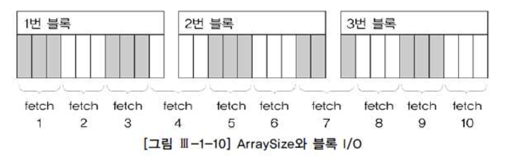
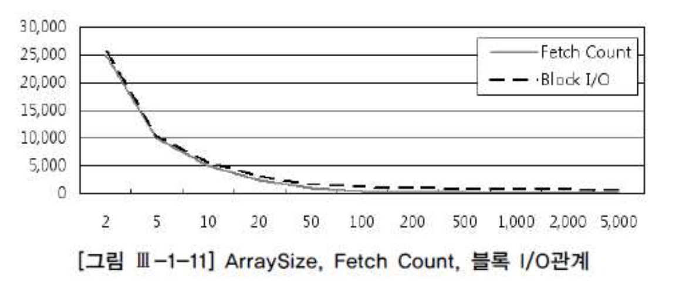

# 03. 데이터베이스 Call과 네트워크 부하


##  1) 데이터베이스 Call 종류

##### 가. SQL 커서에 대한 작업 요청에 따른 구분

- Parse Call : SQL 파싱을 요청하는 Call
- Execute Call : SQL 실행을 요청하는 Call
- Fetch Call : SELECT 문의 결과 데이터 전송을 요청하는 Call


```sql
select cust_nm, birthday from customer where cust_id = :cust_id 

call   count cpu   elapsed disk query current rows 
----- ------ ----- ------- ---- ----- ------ ----- 
Parse      1  0.00    0.00    0     0      0     0 
Execute 5000  0.18    0.14    0     0      0     0 
Fetch   5000  0.21    0.25    0 20000      0 50000 
----- ------ ----- ------- ---- ----- ------ ----- 
total  10001  0.39    0.40    0 20000      0 50000 
```


##### 나. Call 발생 위치에 따른 구분


###### 1) User Call

- DBMS로부터 요청되는 Call
- User Call이 많으면 성능이 좋을수 없으므로, DBMS 확장성을 높이려면 User Call을 최소화 하려는 노력이 중요함
- User Call을 줄이기 위한 기술요소
  - Loop 쿼리를 해소하고 집합적 사고를 통해 One SQL로 구현
  - Array Processing : Array 단위 Fetch, Bulk Insert/Update/Delete
  - 부분범위처리 원리 활용
  - 효과적인 화면 페이지 처리
  - 사용자 정의 함수/프로시저/트리거의 적절한 활용


###### 2) Recursive Call

- DBMS 내부에서 발생하는 Call
- SQL 파싱과 최적화 과정에서 발생(데이터 딕셔너리조회, 사용자 정의함수/프로시저 내에서의 SQL 수행)
- Recursive Call 최소화 방안
  - 바인드 변수 사용하여 하드파싱 발생 횟수 감소
  - 사용자 정의 함수/프로시저의 적절한 사용


## 2) 데이터베이스 Call과 성능

##### 가. One SQL 구현의 중요성

- Java 예시

```sql
public class JavaLoopQuery{ 
  public static void insertData( Connection con 
                               , String param1 
                               , String param2 
                               , String param3 
                               , long param4) throws Exception{ 
  String SQLStmt = "INSERT INTO 납입방법별_월요금집계 " 
          + "(고객번호, 납입월, 납입방법코드, 납입금액) " 
          + "VALUES(?, ?, ?, ?)"; 
  PreparedStatement st = con.prepareStatement(SQLStmt); 
  st.setString(1, param1); 
  st.setString(2, param2); 
  st.setString(3, param3); 
  st.setLong(4, param4); 
  st.execute(); 
  st.close(); 
} 

public static void execute(Connection con, String input_month) throws Exception { 
  String SQLStmt = "SELECT 고객번호, 납입월, 지로, 자동이체, 신용카드, 핸드폰, 인터넷 " 
                 + "FROM 월요금납부실적 " 
                 + "WHERE 납입월 = ?"; 
  PreparedStatement stmt = con.prepareStatement(SQLStmt); 
  stmt.setString(1, input_month); 
  ResultSet rs = stmt.executeQuery(); 
  while(rs.next()){ 
    String 고객번호 = rs.getString(1); 
    String 납입월 = rs.getString(2); 
    long 지로 = rs.getLong(3); 
    long 자동이체 = rs.getLong(4); 
    long 신용카드 = rs.getLong(5); 
    long 핸드폰 = rs.getLong(6); 
    long 인터넷 = rs.getLong(7); 
    if(지로 > 0) insertData (con, 고객번호, 납입월, "A", 지로); 
    if(자동이체 > 0) insertData (con, 고객번호, 납입월, "B", 자동이체); 
    if(신용카드 > 0) insertData (con, 고객번호, 납입월, "C", 신용카드); 
    if(핸드폰 > 0) insertData (con, 고객번호, 납입월, "D", 핸드폰); 
    if(인터넷 > 0) insertData (con, 고객번호, 납입월, "E", 인터넷); 
 } 
  rs.close(); 
  stmt.close(); 
} 
static Connection getConnection() throws Exception { ...... } 
static void releaseConnection(Connection con) throws Exception { ...... } 

public static void main(String[] args) throws Exception{ 
  Connection con = getConnection(); 
  execute(con, "200903"); 
  releaseConnection(con); 
 } 
} 
```


- 예를 들어 처리해야할 납부실적이 10만건이라고 하면, (array 단위 fetch 기능을 이용하지 않을때 Insert를 위한 Parse Call이 50만번, Execute call이 50만번으로 최대 110만 번의 데이터베이스 Call이 발생함
- 위의 프로그램을 DBMS 내의 프로시저로 개발하면 네트워크 트래픽 없는 Recursive Call만 발생하여 제법 빠르게 수행되겠지만, Java, C, VB, Delphi 등으로 개발된 애플리케이션에서 수행되면 성능에 심각한 문제가 나타날 것이다.
- 실제 시간이 소요되는것을 살펴보면, 서버내의 일량은 미미하나 대부분 네트워크 구간에서의 소비 또는 데이터베이스 Call이 발생할 때마다 OS로부터 CPU와 메모리 리소스를 할당 받으려고 기다리면서 소비
- 이러한 프로그램을 아래와 같이 One SQL로 통합하면 1~2초내로 수행되는것을 확인할수 있는데, 이 원리는 110번 발생할수 있는 데이터베이스 Call을 단 2회(Parse Call 1회, Execute Call 1회)로 줄인데 있다


```java
public class JavaOneSQL{ 
  public static void execute(Connection con, String input_month) throws Exception { 
    String SQLStmt = "INSERT INTO 납입방법별_월요금집계" 
         + "(납입월,고객번호,납입방법코드,납입금액) " 
         + "SELECT x.납입월, x.고객번호, CHR(64 + Y.NO) 납입방법코드 " 
         + " , DECODE(Y.NO, 1, 지로, 2, 자동이체, 3, 신용카드, 4, 핸드폰, 5, 인터넷) " 
         + "FROM 월요금납부실적 x, (SELECT LEVEL NO FROM DUAL CONNECT BY LEVEL <= 5) y " 
         + "WHERE x.납입월 = ? " 
         + "AND y.NO IN ( DECODE(지로, 0, NULL, 1), DECODE(자동이체, 0, NULL, 2) " 
         + " , DECODE(신용카드, 0, NULL, 3) , DECODE(핸드폰, 0, NULL, 4) " 
         + " , DECODE(인터넷, 0, NULL, 5) )" ; 

    PreparedStatement stmt = con.prepareStatement(SQLStmt); 
    stmt.setString(1, input_month); 
    stmt.executeQuery(); stmt.close(); 
  } 
  static Connection getConnection() throws Exception { ...... } 
  static void releaseConnection(Connection con) throws Exception { ...... } 

  public static void main(String[] args) throws Exception{ 
    Connection con = getConnection(); 
    execute(con, "200903"); 
    releaseConnection(con); 
  } 
} 
```


##### 나. 데이터베이스 Call과 시스템 확장성

- 데이터베이스 Call은 개별 프로그램 수행속도 뿐 아니라 궁극적으로 시스템 전체의 확장성에도 영향을 미친다.


- 예시) 인터넷 쇼핑몰에서 조회한 상품 5개를 선택후 위시리스트에 등록하는 프로그램일때

```java
void insertWishList ( String p_custid , String p_goods_no ) { 
  SQLStmt = "insert into wishlist " 
          + "select custid, goods_no " 
          + "from cart " 
          + "where custid = ? " 
          + "and goods_no = ? " ; 
  stmt = con.preparedStatement(SQLStmt); 
  stmt.setString(1, p_custid); 
  stmt.setString(2, p_goods_no); stmt.execute(); 
} 
```


- 5번의 메소드를 호출하므로 Parse Call과 Execute Call 각각 5번씩 발생

```java
void insertWishList ( String p_custid , String[] p_goods_no ) { 
  SQLStmt = "insert into wishlist " 
          + "select custid, goods_no " 
          + "from cart " 
          + "where custid = ? " 
          + "and goods_no in ( ?, ?, ?, ?, ? )" ; 
  stmt = con.preparedStatement(SQLStmt); 
  stmt.setString(1, p_custid); 
  for(int i=0; i < 5; i++){ 
      stmt.setString(i+2, p_goods_no[i]); 
  } 
  stmt.execute(); 
} 
```


- 확장성을 고려하여 작성하였으므로 1번의 메소드를 호출하며 Parse Call과 Execute Call도 각각 1번씩만 호출


## 3) Array Processing 활용

- Array Processing 기능을 활용하면 한번의 SQL(INSERT/UPDATE/DELETE) 수행으로 다량의 레코드를 동시 처리
- 네트워크 Call 감소
- SQL 수행시간 감소
- CPU 사용량 감소


- Insert 할 데이터를 계속 array에 담기만 하다가 1000건이 쌓일때마다 한번씩 executeBatch를 수행
  Select 결과집합을 Fetch할때도 1000건씩 하도록 조종한다.
- **Call 횟수를 줄이는것이 성능개선에 도움이 되는것을 알수 있다**
- 대용량 데이터의 처리에는 Array Processing이 필수
- 효과를 극대화 하기위해 연속된 일련의 처리과정을 모두 Array 단위로 진행해야함( select, insert 모두)


- 예시) PL/SQL을 이용한 데이터 Bulk로 1000건씩 Fetch해서 Bulk Insert

```sql
DECLARE 
  l_fetch_size NUMBER DEFAULT 1000; -- 1,000건씩 Array 처리 
  CURSOR c IS 
    SELECT empno, ename, job, sal, deptno, hiredate 
    FROM emp; 

... 

   BEGIN 
  
  OPEN C; 
 
   LOOP 

    FETCH c BULK COLLECT 
    INTO p_empno, p_ename, p_job, p_sal, p_deptno, p_hiredate 
    LIMIT l_fetch_size; 

    FORALL i IN p_empno.first..p_empno.last 
      INSERT INTO emp2 
      VALUES ( p_empno (i) 
             , p_ename (i) 
             , p_job (i) 
             , p_sal (i) 
             , p_deptno (i) 
             , p_hiredate (i) ); 
     EXIT WHEN c%NOTFOUND; 
   END LOOP; 

  CLOSE C; 
```

- array processing 기법을 지원하는 인터페이스가 개발 언어마다 다르므로 API를 통해 반드시 확인하고 활용해야함*


## 4) Fetch Call 최소화

##### 가. 부분범위처리 원리

- 쿼리 결과 집합을 전송할때, 전체 데이터를 연속적으로 전송하지 않고 사용자로부터 Fetch Call이 있을때마다 일정량씩 나누어서 전송하는 것


- 데이터를 클라이언트에게 전송할때 일정량씩 나누어서 전송

```sql
set arraysize 100
call  count cpu   elapsed disk query current rows 
----- ----- ----- ------- ----- ----- ----- ------ 
Parse     1 0.00    0.00     0     0     0     0 
Execute   1 0.00    0.02     2     2     0     0 
Fetch   301 0.14    0.18     9   315     0 30000 
----- ----- ----- ------- ----- ----- ----- ------ 
total   303 0.14    0.20    11   317     0 30000 
```


- SQL Server : 쿼리분석기 옵션에 설정되어있는 "네트워크 패키지 크기"로 운반 (default 4,096 바이트)
- ORACLE : 내부적으로는 SDU(Session Data Unit,Session 레이어), TDU(Transport Data Unit,Transport 레이어) 단위로 나누어서 전송
  array 사이즈를 작게 설정하면 하나의 네트워크 패킷에 담아 전송하겠지만, 크게 설정하면 여러개의 패킷으로 나누어 전송


##### 나. ArraySize 조정에 의한 Fetch Call 감소 및 블록 I/O 감소 효과

- 대량의 데이터파일을 전송한다면 arraysize 크게하여 fetch call 횟수를 줄여주는것이 유리
- 반대로 적은량의 데이터만 fetch 하다가 멈추는 프로그램이라면 arraysize를 작게 설정하는것이 유리
- arraysie를 증가시키면 네트워크 부하감소 및 서브프로세스가 읽어야할 블록 갯수 감소 효과





- 예시)10개의 행으로 구성된 3개의 블록

| arraysize | fetch 횟수 | 블록I/O |
| :-------- | :--------- | :------ |
| 3         | 10         | 12      |
| 10        | 3          | 3       |
| 30        | 1          | 1       |


- ArraySize와 Fetch Count 및 블록 I/O 관계 : 반비례




- ArraySize 를 키운다고 해서 Fetch count 와 블록 I/O가 같은 비율로 줄지 않음
- ArraySize를 무작정 크게 설정한다고 좋은것이 아니며, 일정크기 이상이면 리소스만 낭비하는 결과를 초래할 수 있음

**SQL\*Plus 이외의 프로그램 언어에서 Array 단위 Fetch 기능 활용 방법**


###### 1) Oracle PL/SQL(커서를 열고 레코드를 Fetch)

- 9i : 한번에 한 로우씩만 처리(Single-Row Fetch)
- 10g : 자동으로 100개씩 array Fetch가 일어남. (Cursor For Loop 구문을 이용할때만)


```sql
for item in cursor 
loop 
   ...... 
end loop; 
```


###### 2) JAVA(FetchSize를 100으로 설정했을때 데이터를 Fetch 해오는 매커니즘)

```java
String sql = "select custid, name from customer"; 
PreparedStatement stmt = conn.prepareStatement(sql); 
stmt.setFetchSize(100); -- Statement에서 조정 

ResultSet rs = stmt.executeQuery(); 
// rs.setFetchSize(100); -- ResultSet에서 조정할 수도 있다. 

while( rs.next() ) { 
  int empno = rs.getInt(1); 
  String ename = rs.getString(2); 
  System.out.println(empno + ":" + ename); 
} 

rs.close(); 
stmt.close(); 
```


- 최초 rs.next() 호출 시 한꺼번에 100건을 가져와서 클라이언트 Array 버퍼에 캐싱한다.
- 이후 rs.next() 호출할 때는 데이터베이스 Call을 발생시키지 않고 Array 버퍼에서 읽는다.
- 버퍼에 캐싱 돼 있던 데이터를 모두 소진한 후 101번째 rs.next() 호출 시 다시 100건을 가져온다.
- 모든 결과집합을 다 읽을 때까지 2~3번 과정을 반복한다.


## 5) 페이지 처리 활용

- 페이지 처리를 하지 않을때 발새하는 부하요인
  - 다량 발생하는 Fetch Call의 부하
  - 대량의 결과 집합을 클라이언트에 전송하면서 발생하는 네트워크 부하
  - 대량의 데이터 블록을 읽으면서 발생하는 I/O 부하
  - AP 서버 및 웹 서버 리소스 사용량 증가


- 페이지처리를 통한 부하해소
  - 페이지 단위로, 화면에서 필요한 만큼만 Fetch Call
  - 페이지 단위로, 홤녀에서 필요한 만큼만 네트워크를 통해 결과 전송
  - 인덱스와 부분범위처리 원리를 이용해 각 페이지에 필요한 최소량만 I/O
- 데이터를 소량씩 나누어 전송하므로 AP웹 서버 리소스 사용량 최소화

- 결론적으로, 조회할 데이터가 일정량 이상이고 수행빈도가 높다면 필수적으로 페이지 처리 구현해야함*


## 6) 분산 쿼리

- 분산 DB간 테이블 조인

```sql
select channel_id, sum(quantity_sold) auantity_cold 
from order a, sales@lk_sales b 
where a.order_date between :1 and :2 
and b.order_no = a.order no 
group by channel_id 

Rows    Row Source Operation 
-----   --------------------------------------------- 
5 SORT  GROUP BY 
10981    NESTED LOOPS 
500000    REMOTE 
10981     TABLE ACCESS BY INDEX ROWID ORDER 
500000     INDEX UNIQUE SCAN (ORDER_PK) 
```


- 원격의 sal테이블을 전송받아 order 테이블과 NL 조인
- 50만건이나 되는 데이터를 네트워크를 통해 전송받고 있어 성능저하의 원인이 됨.


- 분산 DB 간의 성능저하 해결방안

```sql
select /*+ driving_site(b) */ 
       channel_id, sum(quantity_sold) auantity_cold 
  from order a, sales@lk_sales b 
 where a.order_date between :1 and :2
   and b.order_no = a.order_no 
 group by channel_id 

Rows   Row Source Operation
----   --------------------------------------------- 
5 SORT GROUP BY 
10981   NESTED LOOPS 
939      TABLE ACCESS (BY INDEX ROWID) OF 'ORDER' 
939       INDEX (RANGE SCAN) OF 'ORDER_IDX2' (NON-UNIQUE) 
10981    REMOTE 
```


- order_date에 조건에 해당하는 데이터만 원격으로 보내서 조인과 group by를 거친 결과 집합만 전송받음
- 원격서버가 처리가능하도록 dirving_site 힌트 사용

- 분산쿼리의 성능을 높이는 핵심은, 네트워크를 통한 데이터 전송량을 줄이는 데 있다*


## 7) 사용자 정의 함수 / 프로시저의 특징과 성능

##### 가. 사용자 정의 함수/프로시저의 특징

- 가상머신과 같은 별도의 실행엔진을 통해 실행됨
- 실행시마다 컨텍스트 스위칭이 일어나므로, 내장함수를 호출할때와 비교해서 성능이 상당히 떨어짐

- 예시)문자타입의 일자 데이터를 날짜 타입으로 변환해주는 사용자정의함수

```sql
create or replace function date_to_char(p_dt date) return varchar2 as 
  begin 
    return to_char(p_dt, 'yyyy/mm/dd hh24:mi:ss'); 
  end; 
 / 
```


- to_char 함수를 바로 호출할때보다 훨씬 느림
- 메인쿼리가 참조하는 사용자 정의 함수에 또 다른 쿼리문이 내장되어 있다면 수행 성능이 훨씬 나빠짐
- 함수에 내장된 쿼리를 수행할 때마다 Execute Call, Fetch Call이 재귀적으로 일어남.
- Recusive Call이 반복적으로 일어남(User Call 에 비해 성능부하가 미미하지만, 그 횟수가 무수히 반복되면 성능 저하)


##### 나. 사용자 정의 함수/프로시저에 의한 성능 저하 해소 방안

- 소량의 데이터를 조회할 때 사용
- 부분점위 처리가 가능한 상황에서 제한적으로 사용
- 가급적 함수를 풀어 조인 또는 스칼라 서브쿼리 형태로 변환