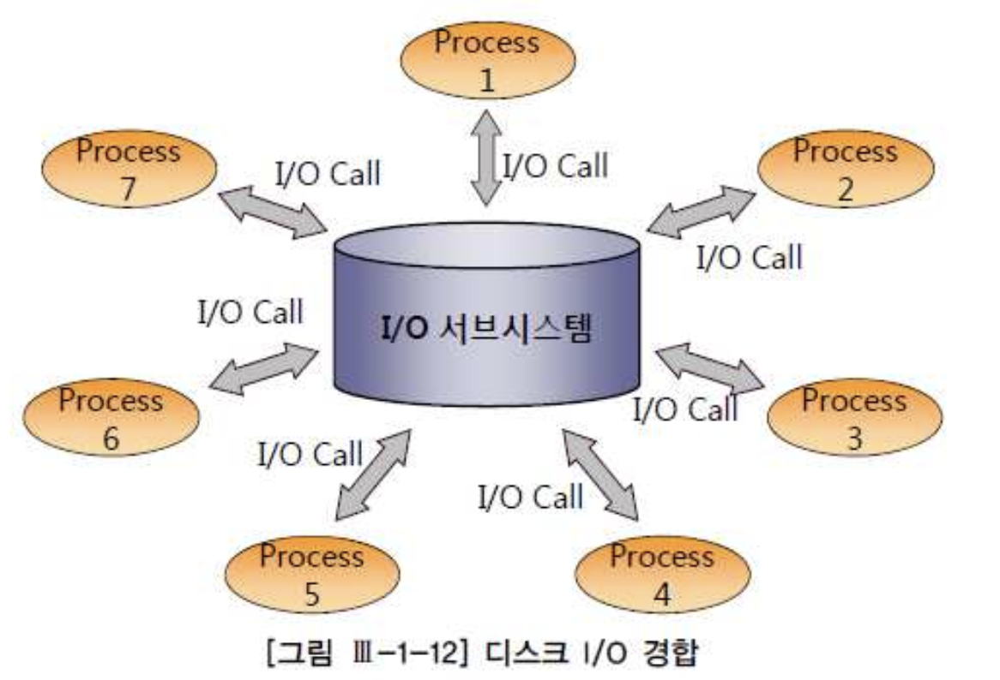
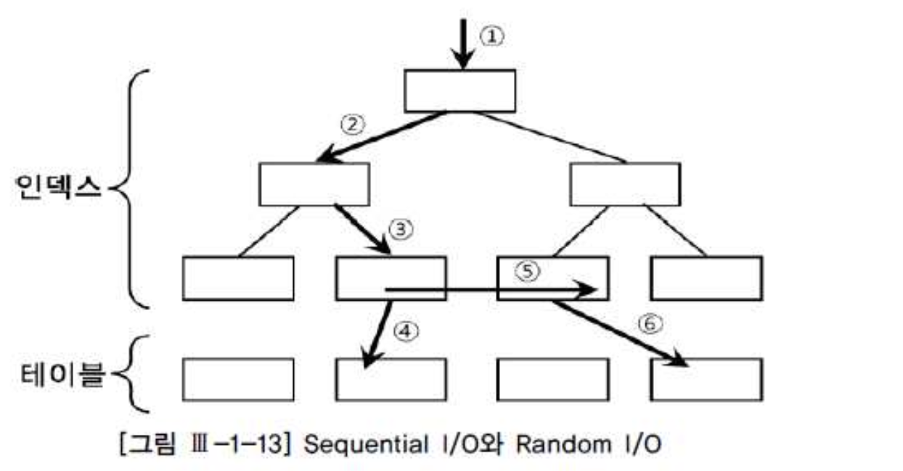

# 04. 데이터베이스IO원리


## 1) 블록단위 I/O

- 데이터 파일에서 DB 버퍼 캐시로 블록을 적재할 때
- 데이터 파일에서 블록을 직접 읽고 쓸때
- 버퍼 캐시에서 블록을 읽고 쓸때
- 버퍼 캐시에서 변경된 블록을 다시 데이터 파일에 쓸 때


## 2) 메모리 I/O vs. 디스크 I/O

##### 가. I/O 효율화 튜닝의 중요성

- 디스크를 경우한 데이터 입출력은 디스크의 액세스 암(Arm)이 움직이면서 헤드를 통해 데이터를 읽고 쓰기 때문에 느림
- 메모리를 통한 입출력은 전기적 신호에 불과하기 때문에 디스크를 통한 I/O에 디해 비교할수 없을정도로 빠름
- 모든 DBMS는 읽고자 하는 블록을 먼저 버퍼 캐시에서 찾고 ,없을경우에는 디스크에서 읽어 버퍼 캐시로 적재 후 읽기/쓰기 작업을 수행





- 이러한 이유로 모든 데이터를 메모리에 올려놓고 사용하면 좋겠지만 메모리는 물리적으로 한정된 자원이므로
- **결국 디스크 I/O를 최소화하고 버퍼 캐시 효율을 높이는것이 데이터베이스 I/O 튜닝의 목표**


##### 나. 버퍼 캐시 히트율(Buffer Cache Hit Ratio)

- 버퍼 캐시 효율을 측정하는 지표로써 전체 읽은 블록중 메모리 버퍼 캐시에서 찾은 비율

```
  BCHR = (버퍼 캐시에서 곧바로 찾은 블록 수 / 총 읽은 블록 수) × 100 
```


- BCHR은 주로 전체적인 관점에서 측정하지만, 개별 SQL에 대해서도 구해볼수 있으며,이 비율이 낮은것이 SQL 성능을 떨어뜨리는 주범임

```sql
call   count  cpu  elapsed disk query current rows 
------ ----- ----- ------- ---- ----- ------ ---- 
Parse     15  0.00    0.08    0    0      0   0 
Execute   44  0.03    0.03    0    0      0   0 
Fetch     44  0.01    0.13   18  822      0  44 
------ ----- ----- ------- ---- ----- ------ ---- 
total    103  0.04    0.25   18  822      0  44 
```


###### Disk 항목이 디스크를 경유한 블록수

- 총 읽은 블록 수 = 822
- 버퍼 캐시에서 곧바로 찾은 블록 수 = 822 - 18 = 804
- CHR = (822 - 18) / 822 = 97.8%


- **논리적인 블록요청 횟수를 줄이고, 물리적으로 디스크에서 읽어야할 블록수를 줄이는것이 I/O 효율화 튜닝의 핵심 원리**


##### 다. 네트워크, 파일시스템 캐시가 I/O 효율에 미치는 영향

- 대용량의 데이터를 읽고 쓰는데 다양한 네트워크 기술이 사용됨에 따라 네트워크 속도도 SQL 성능에 크게 영향을 미친다.
- RAC같은 클러스터링 환경에선 인스턴스 간에 캐시된 블록을 공유하므로 메모리 I/O의 성능에도 네트워크 속도가 지대한 영향을 미친다.
- 같은양의 디스크 I/O 가 발생하더라도 I/O 대기시간이 크게 차이 나는것은 디스크 경합때문일수도 있지만, OS에서 지원하는 파일시스템 버퍼 캐시와 SAN 캐시 때문일 수도 있다.
- (SAN 캐시는 크다고 문제가 되지 않지만, 파일시스템 버퍼 캐시는 최소화 하여 데이터베이스 자체 캐시영역에 좀더 큰 공간을 할당하는것이 더욱 효과적임 )

- **네트워크 문제든, 파일시스템 문제든 I/O 성능에 관한 가장 확실하고 근본적인 해결책은 논리적인 블록 요청 횟수를 최소화 하는것**


## 3) Sequential I/O vs. Random I/O



- sequential 액세스는 논리적/물리적 순서를 따라 차례대로 읽어 나가는 방식
  - ⑤: 인덱스 리프 블록에 위치한 모든 레코드는 포인터를 논리적으로 연결되어 있고, 이 포인터를 따라 스캔하는 방식
- Random 액세스는 레코드간 논리적, 물리적인 순서를 따르지 않고, 한건을 읽기 위해 한 블록씩 접근하는 방식
  - ①②③④⑥ 방식
- I/O 튜닝의 핵신 원리
  - Sequential 액세스에 의한 선택 비중을 높인다.
  - Random 액세스 발생량을 줄인다.


##### 가. Sequential 액세스에 의한 선택 비중 높이기

- 읽는 총 건수 중에서 결과 집합으로 선택되는 비중을 높여야 함
- 같은 결과를 얻기위해 얼마나 적은 레코드를 읽느냐로 효율성이 판단됨

```sql
-- 테스트용 테이블 생성 
create table t 
 as 
 select * 
   from all_objects 
  order by dbms_random.value; 

-- 테스트용 테이블 데이터 건수 : 49,906 
select count(*) from t;

COUNT(*) 
-------- 
49906 
```


```sql
select count(*) 
  from t 
 where owner like 'SYS%' 

Rows   Row Source Operation 
-----  ------------------------------ 
    1  SORT AGGREGATE (cr=691 pr=0 pw=0 time=13037 us) 
24613   TABLE ACCESS FULL T (cr=691 pr=0 pw=0 time=98473 us) 
```

- 전체 레코드 49,906건
- 선택 레코드 24,613건 (49 %)
- 읽은 블록수 691 블록
- Table Full Scan 치고는 나쁘지 않음


```sql
select count(*) 
  from t 
 where owner like 'SYS%' 
   and object_name = 'ALL_OBJECTS' 

Rows Row Source Operation 
---- ------------------------------ 
   1 SORT AGGREGATE (cr=691 pr=0 pw=0 time=7191 us) 
   1  TABLE ACCESS FULL T (cr=691 pr=0 pw=0 time=7150 us) 
```

- 전체 레코드 49,906건
- 선택 레코드 1건 (0.002 %)
- 읽은 블록수 691 블록
- Table Full Scan 비효율 발생


```sql
create index t_idx on t(owner, object_name);

select /*+ index(t t_idx) */ count(*) 
  from t 
 where owner like 'SYS%' 
   and object_name = 'ALL_OBJECTS' 

Rows Row Source Operation 
---- ------------------------------ 
   1 SORT AGGREGATE (cr=76 pr=0 pw=0 time=7009 us) 
   1  INDEX RANGE SCAN T_IDX (cr=76 pr=0 pw=0 time=6972 us)(Object ID 55337) 
```

- 인덱스를 사용하고도 1개의 레코드를 읽기위해 76개 블록 액세스
- 테이블 뿐 아니라, 인덱스를 sequential 액세스 방식으로 스캔할 때도 비효율 발생
- 조건절에 사용된 컬럼과 연산자 형태, 인덱스 구성에 의해 효율성이 결정됨


```sql
create index t_idx on t(object_name,owner );

select /*+ index(t t_idx) */ count(*) 
  from t 
 where owner like 'SYS%' 
   and object_name = 'ALL_OBJECTS' 

Rows Row Source Operation 
---- ------------------------------ 
   1 SORT AGGREGATE (cr=2 pr=0 pw=0 time=44 us) 
   1  INDEX RANGE SCAN T_IDX (cr=2 pr=0 pw=0 time=23 us)(Object ID 55338) 
```

- 인덱스 순서를 변경해줌으로써 루트와 리프 단 2개의 인덱스 블록만 읽어 가장 효율적인 방식으로 Sequential 액세스 수행


##### 나.Random 액세스 발생량 줄이기

- Random 액세스 발생량을 낮추는 방법

```sql
drop index t_idx; 

create index t_idx on t(owner); 

select object_id 
  from t 
 where owner = 'SYS' 
   and object_name = 'ALL_OBJECTS' 

Rows  Row Source Operation 
----  ------------------------------ 
    1 TABLE ACCESS BY INDEX ROWID T (cr=739 pr=0 pw=0 time=38822 us) 
22934  INDEX RANGE SCAN T_IDX (cr=51 pr=0 pw=0 time=115672 us)(Object ID 55339) 
```

- 인덱스로부터 만족하는 22,934건을 읽어 그 횟수만큼 테이블을 Random 액세스수행하여 최종적으로 1건의 결과 추출
- 최종 선택된 것에 비해 너무 많은 Random 액세스 발생


```sql
drop index t_idx; 

create index t_idx on t(owner, object_name); 

select object_id 
  from t 
 where owner = 'SYS'
   and object_name = 'ALL_OBJECTS' 

Rows Row Source Operation 
---- ------------------------------ 
   1 TABLE ACCESS BY INDEX ROWID T (cr=4 pr=0 pw=0 time=67 us) 
   1  INDEX RANGE SCAN T_IDX (cr=3 pr=0 pw=0 time=51 us)(Object ID 55340) 
```

- 인덱스에 조건절 컬럼을 추가해줌으로써 랜덤액세스 감소


## 4) Single Block I/O vs.MultiBlock I/O

- Single Block I/O : 한번의 I/O Call에 하나의 데이터 블록만 읽어서 메모리에 적재하는 방식
  - 인덱스를 통해 테이블을 엑세스할때, 기본적으로 인덱스와 테이블 모두 이 방식 사용
- Multi Block I/O : I/O Call 이 필요한 시점에, 인접한 블록들을 같이 읽어 메모리에 적재하는 방식
  - Table Full Scan 처럼 물리적으로 저장된 순서에 따라 읽을때 인접한 블록들을 같이 읽는것이 유리함
  - 인접한블록 : 하나의 익스텐트에 속한 블록


###### Single Block I/O 방식

```sql
create table t 
as select * from all_objects; 

alter table t add 
constraint t_pk primary key(object_id); 

select /*+ index(t) */ count(*) 
  from t 
 where object_id > 0 


call count cpu elapsed disk query current rows 
----- ---- ---- ------ ---- ----- ----- ------ 
Parse    1 0.00   0.00    0    0     0      0 
Execute  1 0.00   0.00    0    0     0      0 
Fetch    2 0.26   0.25   64   65     0      1  
----- ---- ---- ------ ---- ----- ----- ------ 
total    4 0.26   0.25   64   65     0      1   

Rows  Row Source Operation 
----- ------------------------------ 
    1 SORT AGGREGATE (cr=65 r=64 w=0 time=256400 us) 
31192  INDEX RANGE SCAN T_PK (cr=65 r=64 w=0 time=134613 us) 

Elapsed times include waiting on following events:  
 Event waited on                Times  Max. Wait Total Waited 
------------------------------- Waited --------- ------------ 
SQL*Net message to client            2      0.00         0.00 
db file sequential read             64      0.00         0.00 
SQL*Net message from client          2      0.05         0.05 
```

- 64번의 인덱스 블록을 디스크에서 읽으면서 64번의 I/O Call이 발생


###### MultiBlock I/O 방식

```sql
-- 디스크 I/O가 발생하도록 버퍼 캐시 Flushing 
alter system flush buffer_cache; 

-- Multiblock I/O 방식으로 인덱스 스캔 
select /*+ index_ffs(t) */ count(*) 
  from t 
 where object_id > 0 

call  count cpu  elapsed disk query current rows 
----- ----- ---- ------- ---- ----- ------- ---- 
Parse     1 0.00   0.00     0    0       0   0 
Execute   1 0.00   0.00     0    0       0   0 
Fetch     2 0.26   0.26    64   69       0   1 
----- ----- ---- ------- ---- ----- ------- ----
total     4 0.26   0.26    64   69       0   1  

Rows  Row Source Operation 
----- ------------------------------ 
    1 SORT AGGREGATE (cr=69 r=64 w=0 time=267453 us) 
31192  INDEX FAST FULL SCAN T_PK (cr=69 r=64 w=0 time=143781 us) 

Elapsed times include waiting on following events: 
 Event waited on                Times Max. Wait Total Waited 
------------------------------ Waited --------- ------------ 
SQL*Net message to client           2      0.00       0.00 
db file scattered read              9      0.00       0.00 
SQL*Net message from client         2      0.35       0.36 
```

- 64개 블록을 디스크에서 읽었는데 I/O Call이 9번 발생
- Oracle 10g부터는 Index Range Scan 또는 Index Full Scan일때도 Multiblock I/O 방식으로 읽는 경우가 있음(테이블엑세스없이 인덱스만으로 처리할때)


## 5) I/O 효율화 원리

- **논리적인 I/O 요청 횟수를 최소화 하는것이 I/O 효율화 튜닝의 핵심 원리**
- I/O 때문에 성능이 낮게 측정될때, 하드웨어적인 방법을 통해 I/O 성능을 향상 시킬수도 있지만, SQL 튜닝을 통해 I/O 발생 횟수를 줄이는것이 근본적이고 확실한 해결 방법이다.

- 애플리케이션 측면에서이 I/O 효율화 원리
  - 필요한 최소 블록만 읽도록 SQL 작성
  - 최적의 옵티마이징 팩터 제공
  - 필요하다면, 옵티마이저 힌트를 사용하여 최적의 액세스 경로를 유도


##### 가. 필요한 최소 블록만 읽도록 SQL 작성

- 비효율적인 액세스를 없애고 필요한 최소 블록만 액세스

```sql
select a.카드번호 
     , a.거래금액 전일_거래금액 
     , b.거래금액 주간_거래금액 
     , c.거래금액 전월_거래금액 
     , d.거래금액 연중_거래금액 
from ( -- 전일거래실적 
       select 카드번호, 거래금액 
       from 일별카드거래내역 
       where 거래일자 = to_char(sysdate-1,'yyyymmdd') 
       ) a 
     , ( -- 전주거래실적 
        select 카드번호, sum(거래금액) 거래금액 
        from 일별카드거래내역 
        where 거래일자 between to_char(sysdate-7,'yyyymmdd') and to_char(sysdate-1,'yyyymmdd') 
        group by 카드번호 
       ) b 
     , ( -- 전월거래실적 
        select 카드번호, sum(거래금액) 거래금액 
        from 일별카드거래내역 
        where 거래일자 between to_char(add_months(sysdate,-1),'yyyymm') 
               || '01' and to_char(last_day(add_months(sysdate,-1)),'yyyymmdd') 
        group by 카드번호 
       ) c 
     , ( -- 연중거래실적 
        select 카드번호, sum(거래금액) 거래금액 
        from 일별카드거래내역 
        where 거래일자 between to_char(add_months(sysdate,-12),'yyyymmdd') 
                      and to_char(sysdate-1,'yyyymmdd') 
        group by 카드번호 
       ) d 
where b.카드번호 (+) = a.카드번호 
and   c.카드번호 (+) = a.카드번호 
and   d.카드번호 (+) = a.카드번호 
```


```sql
select 카드번호 
    , sum( case when 거래일자 = to_char(sysdate-1,'yyyymmdd') 
                 then 거래금액 
             end ) 전일_거래금액 
    , sum( case when 거래일자 between to_char(sysdate-7,'yyyymmdd') and to_char(sysdate-1,'yyyymmdd') 
                 then 거래금액 
             end ) 주간_거래금액 
    , sum( case when 거래일자 between to_char(add_months(sysdate,-1),'yyyymm') 
                  || '01' and to_char(last_day(add_months(sysdate,-1)),'yyyymmdd') 
                 then 거래금액 
             end ) 전월_거래금액 
     , sum( 거래금액 )연중_거래금액 
from 일별카드거래내역 
where 거래일자 between to_char(add_months(sysdate,-12),'yyyymmdd')
                 and to_char(sysdate-1,'yyyymmdd') 
group by 카드번호 
having sum( case when 거래일자 = to_char(sysdate-1,'yyyymmdd') then 거래금액 end ) > 0 
```

- 같은 테이블을 4번 엑세스하여 처리하던 방식을 1번만 읽어서 처리할수 있도록 튜닝


##### 나. 최적의 옵티마이징 팩터 제공

- 전략적인 익덱스 구성
  - 전략적인 엔덱스 구성은 가장 기본적인 옵티마이징 팩터
- DBMS가 제공하는 기능 활용
  - 인덱스 외에도 DBMS가 제공하는 다양한 기능을 적극적으로 활용
  - 인덱스,파티션,클러스터, 윈도우 함수 등을 적극 활용하여 옵티마이저가 최적의 선택을 할 수 있도록 한다.
- 옵티마이저 모드 설정
  - 옵티마이저모드(전체처리속도, 최초등담속도)와 그 외 옵티마이저 행동에 영향을 미치는 일부 파라미터를 변경해 주는것이 도움이 될수 있다
- 통계정보
  - 옵티마이저에게 정확한 정보를제공


##### 다. 필요하다면, 옵티마이저 힌트를 사용해 최적의 액세스 경로로 유도

- 최적의 옵티마이징 팩터를 제공했다면 가급적 옵티마이저에게 맡기는것이 바람직하지만, 옵티마이저가 생각만큼 최적의 실행계획을 수립하지 못하는경우 사용

- 예시)

```sql
select /*+ leading(d) use_nl(e) index(d dept_loc_idx) */ * 
  from emp e, dept d 
 where e.deptno = d.deptno 
   and d.loc = 'CHICAGO' 
```

- 옵티마이저 힌트를 사용할 때 반드시 의도한 실행계획으로 수행되는지 확인해야 함


- **여러가지로 옵티마이저 힌트 사용은 불가피함**
- **데이터베이스 애플리케이션 개발자라면 인덱스 ,조인, 옵티마이저의 기본 원리를 이해하고,**
- **그것을 바탕으로 최적의 액세스 경로를 유도할수 있는 능력을 필수적으로 갖춰야 함**