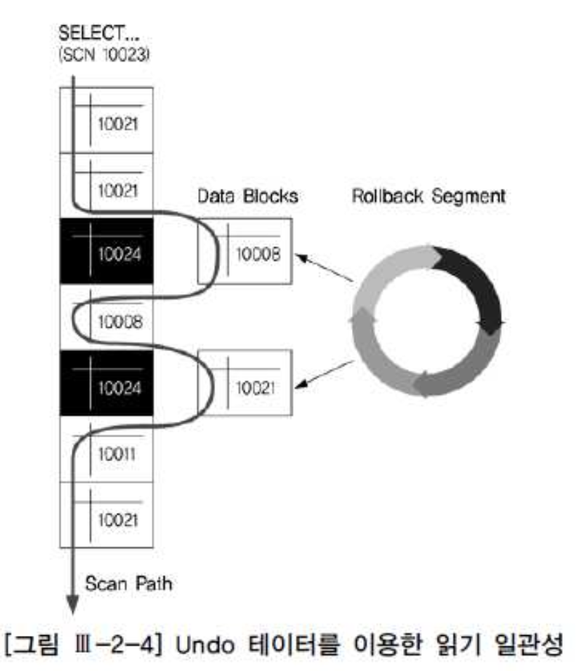

# 03. 동시성제어

- DBMS는 다수의 사용자를 가정하며, 동시에 작동하는 다중 트랜잭션의 상호 간섭 작용에서 데이터베이스를 보호 할 수 있어야 하며, 이를 동시성 제어(Concurrency Control)이라 한다.
- 동시성을 제어할 수 있도록 하기 위해 모든 DBMS가 공통적으로 Lock 기능을 제공.
- SET TRANSACTION 명령어를 이용해 트랜잭션 격리성 수준을 조정할 수 있는 기능도 제공.
- SQL Server의 경우, 기본 트랜잭션 격리성 수준인 Read committed 상태에선 레코드를 읽고 다음 레코드로 이동하자 마자 공유 Lock을 해제하지만, Repeatable Read로 올리면 트랜잭션을 커밋될 대까지 공유 Lock을 유지
- 동시성과 일관성의 상관관계


### 1. 비관적 동시성 제어 vs. 낙관적 동시성 제어

##### 가. 비관적 동시성 제어 (Pessimistic concurrency Control)

- 사용자들이 같은 데이터를 동시에 수정할 것이라고 가정.
- 데이터를 읽는 시점에 Lock을 걸고 트랜잭션이 완료될 때까지 이를 유지


```sql
SELECT 적립포인트, 방문횟수, 최근방문일시, 구매실적
 FROM 고객
 WHERE 고개번호 = :CUST_NUM FOR UPDATE;

-\- 새로운 적립포인트 계산

UPDATE 고객 
   SET 적립포인트 = :적립포인트  
 WHERE 고객번호 = :CUST_NUM;
```


- select 시점에 Lock을 거는 비관적 동시성 제어는 자칫 시스템 동시성을 심각하게 떨어뜨릴 우려가 있음
- 아래와 같이 wait 또는 nowait 옵션을 함께 사용하는 것이 바람직


```sql
for update nowait \--> 대기 없이 Exception을 던짐

for update wait 3 \--> 3초 대기 후 Exception을 던짐
```


##### 나. 낙관적 동시성 제어(Optimistic concurrency control)

- 사용자들이 같은 데이터를 동시에 수정하지 않을 것이라고 가정
- 이런 이유로 데이터를 읽을 대는 Lock을 설정하지 않음
- 대신 수정 시점에, 다른 사용자에 의해 값이 변경됐는지를 반드시 검사해야 함


```sql
SELECT 적립포인트, 방문횟수, 최근방문일시, 구매실적
  INTO :a, :b, :c, :d
  FROM 고객
 WHERE 고객번호 = :cust_num;

\--새로운 적립포인트 계산

UPDATE 고객 
   SET 적립포인트 = :적립포인트
 WHERE 고객번호 = :cust_num
   AND 적립포인트 = :a
   AND 방문횟수 = :b
   AND 최근방문일시 = :c
   AND 구매실적 = :d;

IF sql%rowcount = 0 then
 alert('다른 사용자에 의해 변경되었습니다.');
END IF;
```


- 최종 일시를 관리하는 컬럼이 존재하면, 좀 더 간단하게 구현

```sql
SELECT 적립포인트, 방문횟수, 최근방문일시, 구매실적, 변경일시
  INTO :a, :b, :c, :d, :mod_dt
  FROM 고객
 WHERE 고객번호 = :cust_num;

\--새로운 적립포인트 계산

UPDATE 고객 
   SET 적립포인트 = :적립포인트, 변경일시 = SYSDATE
 WHERE 고객번호 = :cust_num
   AND 변경일시 = :mod_dt;


IF sql%rowcount = 0 then
 alert('다른 사용자에 의해 변경되었습니다.');
END IF;
```


### 2. 다중버전 동시성 제어

##### 가. 일반적인 Locking 매커니즘의 문제점

- 동시성 제어의 목표는 동시에 실행되는 트랜잭션 수를 최대화하면서도 입력, 수정, 삭제, 검색 시 데이터 무결성이 유지하는데 있다.
- 읽기 작업에 공유 Lock을 사용하는 일반적인 Locking 매커니즘에서는 읽기 작업과 쓰기 작업이 서로 방해를 일으키기 때문에 종종 동시성에 문제가 발생.
- 데이터 일관성에 문제가 생기는 경우도 있어 이를 해결하려면 Lock을 더 오랫동안 유지하거나 테이블 레벨 lock을 사용해야 하므로 동시성 저하 발생


| 계좌번호 | 1     | 2     | 3     | 4     | 5     | 6     | 7     | 8     | 9     | 10    |
| :------- | :---- | :---- | :---- | :---- | :---- | :---- | :---- | :---- | :---- | :---- |
| 잔고     | 1,000 | 1,000 | 1,000 | 1,000 | 1,000 | 1,000 | 1,000 | 1,000 | 1,000 | 1,000 |


- 예제

|      | < TX1>                                                       | <TX2>                                                 |
| :--- | :----------------------------------------------------------- | :---------------------------------------------------- |
| T1   | select sum(잔고) from 계좌; --> 2번 계좌까지 읽음 현재 잔고는 2,000원 |                                                       |
| T2   |                                                              | update 계좌 set 잔고 = 잔고 + 100 where 계좌번호 = 7; |
| T3   | --> 6번 계좌까지 읽음 현재 잔고는 5,000원                    |                                                       |
| T4   |                                                              | update 계좌 set 잔고 = 잔고 - 100 where 계좌번호 = 3; |
| T5   |                                                              | commit;                                               |
| T6   | --> 10번 계좌 까지 읽음                                      |                                                       |


- T1 : 2번 계좌까지 읽음. 현재 잔고는 2,000
- T2 : UPDATE를 수행. 7번 계좌 잔고는 1,100원이 되었고,아직 커밋되지 않음
- T3 : 6번 계좌까지 일음. 현재까지의 잔고는 5,000원
- T4 : UPDATE를 실행. 3번 계좌는 900원
- T5 : COMMIT을 수행하였으므로 3번 계좌는 900원, 7번 계좌는 1,100인 상태에서 커밋
- T6 : 10번 계좌까지 읽어 내려 감. 7번 계좌 잔고를 1,100으로 바꾼 TX2 트랜잭션이 커밋되었으므로 총 잔고는 10,100원이 된다.


- 위와 같은 비일관성 읽기 문제를 해결하기 위한 일반적인 해법은 트랜잭션 격리성 수준을 상향. 기본 트랜잭션 격리성 수준(Read comitted)에서는 값을 읽는 순간에만 공유 Lock을 걸었다가 다음 레코드로 이동할 때 Lock을 해제함으로써 위와 같은 현상이 발생.

- 트랜잭션 격리성 수준을 Repeatable Read로 올리면 TX1 쿼리가 진행되는 동안 읽은 레코드는 공유 Lock이 계속 유지되며, 심지어 쿼리가 끝나고 다음 쿼리가 진행되는 동안에도 유지된다.

- 트랜잭션 격리성 수준을 올리면 일관성이 높아지지만, Lock이 더 오래 유지됨으로 인해 동시성을 저하 시키고 교착상태가 발생할 가능성도 커짐.
  - TX2가 계좌번호 7번을 배타적 LOCK을 설정
  - TX1은 3번 레코드에 공유 Lock을 설정
  - TX1이 7번을 읽으려는 순간 Dead Lock이 발생


##### 나. 다중버전 동시성 제어

- ORACLE은 버전 3부터 다중버전 동시성 제어(Multiversion Concurrency Control, MVCC) 매커니즘을 사용
- MS SQL Server 2005, IBM DB2 9.7버전 부터 동시성 매커니즘을 제공하기 시작

- MVCC란?
  - 데이터를 변경할 대마다 그 변경사항을 UNDO 영역에 저장
  - 데이터를 읽다가 쿼리(또는 트랜잭션)시작 시점 이후에 변경된(변경이 진행중이거나 이미 커밋된)값을 발견하면, UNDO 영역에 저장된 정보를 이용해 쿼리(또는 트랜잭션)시작 시점의 일관성 있는 버전(CR Copy)를 생성하고 읽음

- 쿼리 도중 배타적 Lock이 걸린, 즉 변경이 진행 중인 레코드를 만나더라도 대기하지 않기 때문에 동시성 측면에 유리
- UNDO 블록 I/O, CR Copy 생성, CR 블록 캐싱 같은 부가적인 작업의 오버헤드 발생
- Oracle은 UNDO 데이터를 UNDO 세그먼트에 저장혹, SQL Server는 tempdb에 저장.
- MVCC는 문장수준과 트랜잭션 수준의 읽기 일관성이 존재


##### 다. 문장수준 읽기 일관성




- 문장수준 읽기 일관성(Statement-Level Read Consistency)은, 다른 트랜잭션에 의해 데이터의 추가, 변경, 삭제가 발생하더라도 단일 SQL문 내에서 일관성 있게 값을 읽는것을 말함.
- 일관성 기준 시점은 쿼리 시작 시점이 된다.
- 위의 그림은 10023 시점에 시작된 쿼리가 10023 시점 이후에 변경된 데이터 블록을 만났을 대, Rollback(=UNDO) 세그먼트에 저장된 정보를 이용해 10023 이전 시점으로 되돌리고서 값을 읽는 것을 표현
- SQL Server에서 문장수준 읽기 일관성 모드로 DB를 운영하려면 아래 명령어를 수행.


```
alter database <데이터베이스 이름> set read_committed_snapshot on;
```


##### 라. 트랜잭션 수준 읽기 일관성

- 트랜잭션 수준 읽기 일관성은, 다른 트랜잭션에 의해 데이터의 추가, 변경, 삭제가 발생하더라도 트랜잭션 내에서 일관성 있게 값을 읽는 것
- Read committed에서 완벽한 문장수준의 읽기 일관성을 보장하는 MVCC 매커니즘도 트랜잭션 수준의 읽기 일관성은 보장하지 않음
- 일반적인 Locking 매커니즘도 트랜잭션 수준의 읽기 일관성은 보장하지 않음
- **트랜잭션 수준으로 완벽한 읽기 일관성을 보장받으려면 격리성 수준을 Serializable Read로 올려주어야 함.**
- Isolation Level을 Serializable Read로 상향조정하면, 일관성 기준 시점은 트랜잭션 시작 시점이 된다. 물론 트랜잭션이 진행되는 동안 자신이 발생시킨 변경사항은 그대로 읽음.


```sql
alter database <데이터베이스 이름> set allow_snapshot_isolation on;

-- 트랜잭션 시작하기 전 'snapshot'으로 변경
set tranaction isolation level snapshot

begin tran
 select ...;
 update....;
commit;
```


##### Snapshot too old

- UNDO 데이터를 활용함으로써 높은 수준의 동시성과 읽기 일관성을 유지하는 대신, 일반적인 Locking 매커니즘에 없는 SNAPSHOT TOO OLD 에러가 MVCC에서 발생
- **UNDO 영역에 저장된 UNDO 정보가 다른 트랜잭션에 의해 재사용돼 필요한 CR Copy을 생성할 수 없을 때 발생**


##### SNAPSHOT TOO OLD 발생 가능성을 줄이는 방법

- **UNDO 영역의 크기를 증가**
- **불필요한 커밋을 자주 수행하지 않음**
- FETCH ACROSS COMMIT 형태의 프로그램 작성을 피해 다른 방식으로 구현
- ANSI 표준에 따르면 커밋 이전에 열려 있던 커서는 더는 FETCH 하면 안됨
- 트랜잭션이 몰리는 시간대에 오래 걸리는 쿼리가 같이 수행되지 않도록 조정
- 큰 테이블을 일정 범위로 나누어 읽고 단게적으로 실행할 수 있도록 코딩.
- SNAPSHOT TOO OLD 발생 가능성을 줄일 뿐 아니라 문제가 발생시 특정 부분부터 다시 시작할 수 있음.--> 읽기 일관성에 문제가 없을때만 적용
- 오랜 시간에 걸쳐 같은 블록을 여러번 방문하는 NL Join 형태의 조인문 또는 인덱스를 경유한 테이블 액세스를 수반하는 프로그램이 있는지 체크하고,
- 이를 회피할 수 있는 방법(조인 메소드 변경, Full Table Scan등)을 찾음
- 소트 부하를 감수하더라도 order by 등을 강제로 삽입해 소트 연산이 발생하도록 함
- 대량 업데이트 후에 곧바로 해당 테이블 또는 인덱스를 Full Scan 하도록 쿼리를 수행하는 것도 하나의 해결 방법
