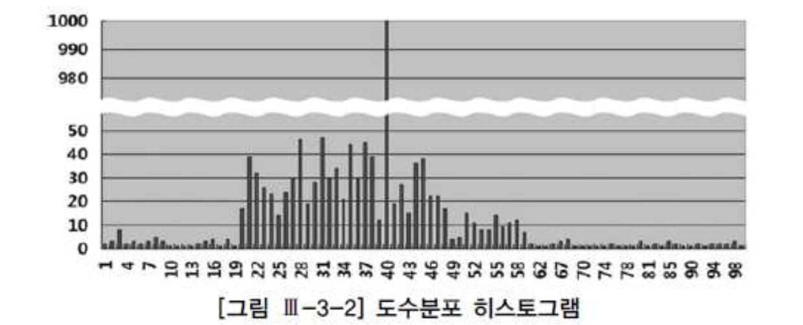
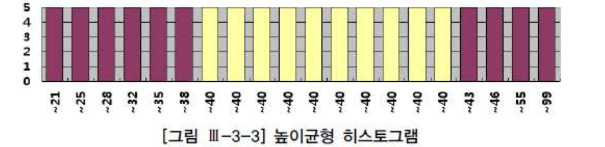

# 01. 옵티마이저


## 1) 옵티마지어 소개


### 가. 옵티마이저란?

- SQL을 가장 빠르고 효율적으로 수행할 최적(최저비용)의 처리경로를 생성해 주는 DBMS 내부의 핵심엔진이다.


##### SQL 최적화 과정

- 사용자가 던진 쿼리 수행을 위해, 후보군이 될만한 실행계획을 찾는다.
- 오브젝트 통계 및 시스템 통계정보를 이용해 각 실행계획의 예상비용을 산정한다.
- 각 실행계획을 비교해서 최저비용을 갖는 하나를 선택한다.


### 나. 옵티마이저 종류

##### 1) 규칙기반 옵티마이저( = Heuristic 옵티마이저 )

- 미리 정해 놓은 규칙에 따라 액세스 경로를 평가하고 실행계획을 선택한다.


###### 규칙?

- 액세스 경로별 우선순위로서, 인덱스 구조, 연산자, 조건절 형태가 순위를 절정짓는 주요인다.


##### 2) 비용기반 옵티마저

- 테이블과 인덱스에 대한 여러 통계정보를 기초로 각 오퍼레이션 단계별 예상 비용을 산정하고, 이를 합산한 총비용이가장 낮은 실행계획을 선택한다.


###### 비용?

- 쿼리를 수행하는데 소요되는 일량 또는 시간을 뜻함


###### 오브젝트 통계 항목?

- 레코드 개수
- 블록 개수
- 편균 행 길이
- 칼럼 값의 수
- 칼럼 값의 분포
- 인덱스 높이
- 클러스터링 팩터
- 시스템 통계정보( CPU 속도, 디스크 I/O 속도 등 )


###### 스스로 학습하는 옵티마이저( Self-Learning Optimizer )

- 예상치와 런타임 수행 결과를 비교하고, 예상치가 빗나갔을 때 실행계획을 조정하는 옵티마이저로 발전할 것이다.


### 다. SQL 최적화 과정

- Parser : SQL문장을 이루는 개별 구성요소를 분석하고 파싱해서 파싱 트리를 만든다.( Syntax(문법), Semantic(의미) )
- Query Transformer : 파싱된 SQL을 좀 더 일반적이고 표준적인 형태로 변환한다.
- Estimator : 오브젝트 및 시스템 통계정보를 이용해 쿼리 수행 각 단계의 선택도, 카디널리티, 비용을 계산하고, 궁극적으로는
  실행계획 전체에 대한 총비용을 계산해 낸다.
- Plan Generator : 하나의 쿼리를 수행하는데 있어, 후보군이 될만한 실행계획들을 생성해 낸다.
- Row-Source Generator : 옵티마이저가 생성한 실행계획을 SQL 엔진이 실제 실행할 수 있는 코드(또는 프로시저 ) 형태로 포맷팅한다.
- SQL Engine : SQL을 실행한다.


### 라. 최적화 목표

##### 1) 전체 처리속도 최적화

```sql
ALTER SYSTEM SET OPTIMIZER_MODE = ALL_ROWS;	--시스템 레벨
ALTER SESSION SET OPTIMIZER_MODE = ALL_ROWS;	--세션 레벨
SELECT /*+ ALL_ROWS */ * FROM T WHERE ... ;	--SQL 레벨
```


##### 2) 최초 응답속도 최적화

```sql
ALTER SESSION SET OPTIMIZER_MODE = FIRST_ROWS_10;
ALTER SESSION SET OPTIMIZER_MODE = FIRST_ROWS_10;

세션이 변경되었습니다.

SHOW PARAMETER OPTIMIZER_MODE;

NAME                                 TYPE                   VALUE
------------------------------------ ---------------------- ------------------------------
optimizer_mode                       string                 FIRST_ROWS_10

SELECT /*+ FIRST_ROWS(10) */ * FROM T WHERE ... ;

```


## 2) 옵티마이저 행동에 영향을 미치는 요소


가. SQL과 연산자 형태

나. 옵티마이징 팩터

다. DBMS 제약 설정

라. 옵티마이저 힌트

마. 통계정보

바. 옵티마이저 파라메터

사. DBMS 버전과 종류


## 3) 옵티마이저 한계


가. 옵티마이징 펙터 부족

- 사용자가 적절한 팩터를 제공하지 않는다면 (인덱스 ,IOT, 클러스터링, 파티셔닝) 좋은 실행계획을 얻을 수 없다.

나. 통계정보의 불확실성

- 컬럼간 비지니스 관계까지 통계로 구하기 어렵다.

다. 바인드변수 사용 시 균등분포 가정

라. 비현실적인 가정

- 오라클에서 single block i/o 와 multi block i/o 비용을 같게 평가함

마. 규칙에 의존하는 CBO

바. 하드웨어 성능 


## 4) 통계정보를 이용한 비용계산 원리

##### 옵티마이저 통계유형

- 테이블 통계 : 전체 레코드 수, 총 블록 수, 빈 블록 수, 한 행당 평균 크기 등
- 인덱스 통계 : 인덱스 높이, 리프 블록 수, 클러스터링 팩터, 인덱스 래코드 수 등
- 칼럼 통계 : 값의 수, 최저 값, 최고 값, 밀도, null값 개수, 칼럼 히스토그램 등
- 시스템 통계 : CPU 속도, 평균적인 I/O 속도, 초당 I/O 처리량 등


##### 가. 선택도

- 특정 조건에 의해 선택될 것으로 예상되는 레코드 비율


###### 실행계획 수립 절차 : 선택도 -> 카디널리티 -> 비용 -> 액세스 방식, 조인 순서, 조인 방법 등 결정

- 히스토그램이 있으면 그것으로 선택도를 산정하며, 단일 컬럼에 대해서는 비교적 정확한 값을 구한다. 히스토 그램이 없거나.
  있더라도 조건절에 바인드 변수를 사용하면 옵티마이저는 데이터 분포가 균일하다고 가정한 상태에서 선택도를 구한다.

```
                              1                         1
선택도 = ----------------------- = -----------------------
           Distinct Value 개수          num distinct
```


##### 나. 카디널리티

- 특정 액세스 단계를 거치고 난 후 출력될 것으로 예상된느 결과 건수


###### 카디널리티 = 총 로우수 * 선택도 = num_rows / num_distinct

```sql
SELECT * FROM 사원 WHERE 부서 = :부서

DISTINCT VALUE = 10
NUM_ROWS = 1000

선택도 = 1 / 10 = 0.1
카디널리티 = 1000 * 0.1 = 100

SELECT * FROM 사원 WHERE 부서 = :부서 AND 직급 = :직급

--부서
DISTINCT VALUE = 10
선택도 = 1 / 10 = 0.1

--직급
DISTINCT VALUE = 4
선택도 = 1 / 4 = 0.25


--카디널리티 = 1000 * 0.1 * 0.25 = 25
```


##### 다. 히스토그램

- 분포가 균일하지 않은 컬럼으로 조회할 때 효과를 발휘한다.


###### 도수분포 히스토그램 ( Frequency number ) : 1 : 1 ( 버킷 : 값 )




###### 높이균형 히스토그램 ( Height-Balance Histogram ): 1 : M ( 버킷 : 값 ) AND M : M( 버킷 : 값 )

- 데이터 분포도 : 1 / (버킷 개수) * 100
- 빈도수 : ( 총 레코드 개수 ) / ( 버킷 개수 )


###### 빈도 수가 많은 값( popular value )



##### 라. 비용 : 예상 일량 또는 시간

- IO 비용 모델 : I/O 요청 횟수만을 쿼리 수행 비용으로 간주
- CPU 비용 모델 : I/O 요청 횟수만을 쿼리 수행 비용 + 시간 개념


###### 인덱스를 경유한 테이블 액세스 비용 : Single Block I/O COUNT

- blevel : 브랜치 레빌을 의미하며, 리프 블록에 도달하기 전에 읽게 될 브랜치 블록 개수임
- 클러스터링 팩터 : 특정 칼럼을 기준으로 같은 값을 갖는 데이타가 서로 모여있는 정도. 인덱스를 경유해 테이블 전체 로우를 액세스 할 때 읽을 것으로 예상되는 논리적인 블록 개수로 계수화 함.
- 유효 인덱스 선택도 : 전체 인덱스 레코드 중에서 조건절을 만족하는 레코드를 찾기 위해 스캔할 것으로 예상되는 비율. 리프 블록에는 인덱스 레코드가 정렬된 상태로 저장되므로 이 비율이 곧 방문할 리프 블록 비율임
- 유효 테이블 선택도 : 전체 레코드 중에서 인덱스 스캔을 완료하고 최종적으로 테이블을 방문할 것으로 예상되는 비율
  - 클러스터링 팩터는 인덱스를 경유해 전체 로우를 엑세스할 때 읽힐것으로 예상되는 테이블 블록 개수이므로
  - 여기에 유효 테이블 선택도를 곱함으로써 조건절에 대해 읽힐 것으로 예상되는 테이블 블록 개수를 구할 수 있음


```sql
 비용 = blevel					-- 인덱스 수직적 탐색 비용
      + (리프 블록 수 * 유효 인덱스 선택도)	-- 인덱스 수평적 탐색 비용
      + (클러스터링 팩터 * 유효 테이블 선택도)	-- 테이블 Random 액세스 비용
```


## 5) 옵티마이저 힌트

##### Oracle 힌트


###### 1) 힌트 기술 방법

```sql
SELECT /*+ LEADING( E2 E1 ) USER_NL( E1 ) INDEX( E1 EMP_EMP_ID_PK )
           USE_MERGE(J) FULL(J) */
       E1.FIRST_NAME, E1. LAST_NAME, J.JOB_ID, SUM( E2.SALARY ) TOTAL_SAL
 FROM EMPLOYEES E1, EMPLOYEES E2, JOB_HISTORY J
WHERE E1.EMPLOYEE_ID - E2.MANAGER_ID
  AND E1.EMPLOYEE_ID = J.EMPLOYEE_ID
  AND E1.HIRE_DATE = J.START_DATE
GROUP BY E.1FIRST_NAME, E1.LAST_NAME, J.JOB_ID
ORDER BY TOTAL_SAL;
```


###### 2) 힌트가 무시되는 경우

- 문법적으로 안 맞게 힌트를 기술
- 의미적으로 안 맞게 힌트를 기술 : 서브쿼리에 UNNEST와 PUSH_SUBQ를 같이 기술한 경우( unnest되지 않은 서브쿼리만이 push_subq힌트의 적용 대상임)
- 잘못된 참조 사용 : 잘못된 별칭
- 논리적으로 불가능한 액세스 경로


```sql
-- EMP_ENAME_IDX NULL 허용 컬럼 인덱스
SELECT /*+ INDEX( E EMP_ENAME_IDX ) */ COUNT(*) FROM EMP E
```


###### 버그

- Oracle : 사용 인덱스 변경시 에러 미발생 ( 장점 : 안정적, 단점 : 성능 )
- SQL Server : 사용 인덱스 변경시 에러 발생 ( 장점 : 성능, 단점 : ? )


###### 3) 힌트 종류

| 분류      | 힌트                                                         |
| :-------- | :----------------------------------------------------------- |
| 최적화    | all_rows first_rows(n)                                       |
| 액세스    | full cluster hash index, no_index index_asc, index_desc index_combine index_join index_ffs, no_index_ffs index_ss, no_index_ss index_ss_asc, index_ss_desc |
| 쿼리 변환 | no_query_transformation use_concat no_expand rewrite, no_rewrite merge, no_merge start_transformation, no_star_transformation fact, no_fact unnest, no_unnest |
| 조인순서  | ordered leading                                              |
| 조인방식  | use_nl,no_use_nl use_nl_with_index use_merge, no_use_merge use_hash, no_use_hash |
| 병렬처리  | parallel, no_parallel pq_distribute parallel_index, no_parallel_index |
| 기타      | append, noappend cache, nocache push_pred, no_push_pred push_subq, no_push_subq qb_name cursor_sharing_exact driving_site dynamic_sampling model_min_analysis |


##### 나. SQL Server 힌트

- 테이블 힌트 : 테이블명 다음에 WITH절을 통해 지정한다. fastfirstrow, holdlock, nolock 등
- 조인 힌트 : FROM절에 지정하며, 두 테이블 간 조인 전략에 영향을 미친다. loop, hash, merge, remote 등
- 쿼리 힌트 : 쿼리당 맨 마지막에 한번만 지정할 수 있는 쿼리 힌트는 아래와 같이(??) OPTION절을 이용한다.