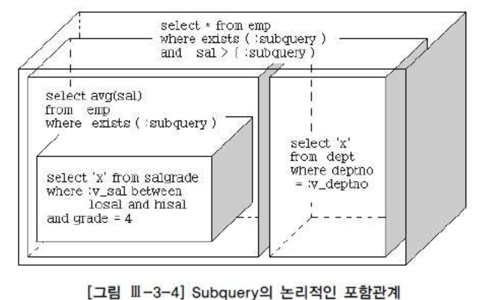

# 02. 쿼리변환


## 1) 쿼리 변환이란?

- 실행계획을 생성하고 비용을 계산하기에 앞서 사용자 SQL을 최적화에 유리한 형태로 재작성함


### 방식?

- 휴리스틱( Heuristic ) 쿼리 변환 : 일종의 규칙 기반의 최적화 기법( 불필요한 부분 제거 )
- 비용기반 쿼리 변환 : 변환된 쿼리의 비용이 더 낮을 때만 그것을 사용하고, 그렇지 않을 때는 원본 쿼리 그대로 두고 최적화를 수행한다.


#### 서브쿼리 Unnesting( SSU : Simple Subquery Unnesting ) ( 9i : Heuristic, 10g : Cost-Base )

- 서브쿼리를 메인 쿼리와 같은 레벨로 풀어낸다면 다양한 액세스 경로와 조인 메소드를 평가 할 수 있다.
- 옵티마이저는 많은 조인 테크닉을 가지기 때문에 조인 형태로 변환했을 때 더 나은 실행계획을 찾을 가능성이 높아진다.


```sql
SELECT  *
     FROM EMP A
    WHERE EXISTS(SELECT 'X' FROM DEPT WHERE DEPTNO = A.DEPTNO)  -- JE( Join Elimination( hint : ELIMINATE_JOIN, NO_ELIMINATE_JOIN ) )
      AND SAL  > (SELECT AVG(SAL)
                    FROM EMP B
                   WHERE EXISTS(SELECT /*+   */ 'O'
                                 FROM SALGRADE S
                                WHERE B.SAL BETWEEN LOSAL AND HISAL
                                  AND GRADE = 4) );
  
-----------------------------------------------------------------------------------------------------------------------------
| Id  | Operation                   | Name     | Starts | E-Rows | A-Rows |   A-Time   | Buffers |  OMem |  1Mem | Used-Mem |
-----------------------------------------------------------------------------------------------------------------------------
|   0 | SELECT STATEMENT            |          |      1 |        |      4 |00:00:00.01 |      16 |    |  |          |
|*  1 |  TABLE ACCESS BY INDEX ROWID| EMP      |      1 |      1 |      4 |00:00:00.01 |      16 |    |  |          |
|*  2 |   INDEX FULL SCAN           | FK_EMP   |      1 |     14 |     14 |00:00:00.01 |       2 |    |  |          |
|   3 |   SORT AGGREGATE            |          |      1 |      1 |      1 |00:00:00.01 |      12 |    |  |          |
|   4 |    MERGE JOIN SEMI          |          |      1 |     14 |      5 |00:00:00.01 |      12 |    |  |          |
|   5 |     SORT JOIN               |          |      1 |     14 |     14 |00:00:00.01 |       6 |  2048 |  2048 | 2048  (0)|
|   6 |      TABLE ACCESS FULL      | EMP      |      1 |     14 |     14 |00:00:00.01 |       6 |    |  |          |
|*  7 |     FILTER                  |          |     14 |        |      5 |00:00:00.01 |       6 |    |  |          |
|*  8 |      SORT JOIN              |          |     14 |      1 |      6 |00:00:00.01 |       6 |  2048 |  2048 | 2048  (0)|
|   9 |       VIEW                  | VW_SQ_1  |      1 |      1 |      1 |00:00:00.01 |       6 |    |  |          |
|* 10 |        TABLE ACCESS FULL    | SALGRADE |      1 |      1 |      1 |00:00:00.01 |       6 |    |  |          |
-----------------------------------------------------------------------------------------------------------------------------

Predicate Information (identified by operation id):
---------------------------------------------------

   1 - filter("SAL">)
   2 - filter("A"."DEPTNO" IS NOT NULL)
   7 - filter("B"."SAL"<="ITEM_2")
   8 - access(INTERNAL_FUNCTION("B"."SAL")>=INTERNAL_FUNCTION("ITEM_1"))
       filter(INTERNAL_FUNCTION("B"."SAL")>=INTERNAL_FUNCTION("ITEM_1"))
  10 - filter("GRADE"=4)
```





##### 서브 쿼리의 처리의 옵티마이저의 선택..

- 조인문으로 변환 후 최적화( Subquery Unnesting == Subquery Flattening ) ( 다양한 실행계획 )
- 서브쿼리를 Unnesting 하지 않고 원래대로 둔 상태에서 최적화 한다.( Filter ) ( 제한적 실행계획 )


## 3) 서브쿼리 Unnesting

- Filter

```sql
SELECT * FROM V$VERSION WHERE ROWNUM <= 1;

BANNER
--------------------------------------------------------------------------------
Oracle Database 11g Enterprise Edition Release 11.2.0.3.0 - 64bit Production

-- JE( Join Elimination )ㅡㅡ^
SELECT COUNT(*)
    FROM EMP
   WHERE DEPTNO IN ( SELECT DEPTNO FROM DEPT );
-------------------------------------------------------------------------------------
| Id  | Operation        | Name   | Starts | E-Rows | A-Rows |   A-Time   | Buffers |
-------------------------------------------------------------------------------------
|   0 | SELECT STATEMENT |        |      1 |        |      1 |00:00:00.01 |       1 |
|   1 |  SORT AGGREGATE  |        |      1 |      1 |      1 |00:00:00.01 |       1 |
|*  2 |   INDEX FULL SCAN| FK_EMP |      1 |     14 |     14 |00:00:00.01 |       1 |
-------------------------------------------------------------------------------------

Predicate Information (identified by operation id):
---------------------------------------------------

   2 - filter("DEPTNO" IS NOT NULL)

ALTER TABLE EMP  DROP CONSTRAINT FK_DEPTNO;

테이블이 변경되었습니다.

-- FILTER
SELECT COUNT(*)
   FROM EMP
  WHERE DEPTNO IN ( SELECT /*+ NO_UNNEST */ DEPTNO FROM DEPT );
-----------------------------------------------------------------------------------------
| Id  | Operation           | Name    | Starts | E-Rows | A-Rows |   A-Time   | Buffers |
-----------------------------------------------------------------------------------------
|   0 | SELECT STATEMENT    |         |      1 |        |      1 |00:00:00.01 |       9 |
|   1 |  SORT AGGREGATE     |         |      1 |      1 |      1 |00:00:00.01 |       9 |
|*  2 |   FILTER            |         |      1 |        |     14 |00:00:00.01 |       9 |
|   3 |    TABLE ACCESS FULL| EMP     |      1 |     14 |     14 |00:00:00.01 |       6 |
|*  4 |    INDEX UNIQUE SCAN| PK_DEPT |      3 |      1 |      3 |00:00:00.01 |       3 |
-----------------------------------------------------------------------------------------

Predicate Information (identified by operation id):
---------------------------------------------------

   2 - filter( IS NOT NULL) <-- ??
   4 - access("DEPTNO"=:B1) <-- 별도의 서브플랜으로 최적화..

EXPLAIN PLAN FOR
 SELECT COUNT(*)
 FROM EMP
 WHERE DEPTNO IN ( SELECT /*+ NO_UNNEST */ DEPTNO FROM DEPT );

SELECT * FROM TABLE( DBMS_XPLAN.DISPLAY( NULL ) );
-------------------------------------------------------------------------------
| Id  | Operation           | Name    | Rows  | Bytes | Cost (%CPU)| Time     |
-------------------------------------------------------------------------------
|   0 | SELECT STATEMENT    |         |     1 |     3 |     3   (0)| 00:00:01 |
|   1 |  SORT AGGREGATE     |         |     1 |     3 |            |          |
|*  2 |   FILTER            |         |       |       |            |          |
|   3 |    TABLE ACCESS FULL| EMP     |    14 |    42 |     3   (0)| 00:00:01 |
|*  4 |    INDEX UNIQUE SCAN| PK_DEPT |     1 |     3 |     0   (0)| 00:00:01 |
-------------------------------------------------------------------------------

Predicate Information (identified by operation id):
---------------------------------------------------

   2 - filter( EXISTS (SELECT /*+ NO_UNNEST */ 0 FROM "DEPT" "DEPT"
              WHERE "DEPTNO"=:B1))
   4 - access("DEPTNO"=:B1)
```


- Unnesting 과정

```sql
-- 1. VIEW
SELECT /*+ NO_MERGE( A ) */  COUNT(*)
FROM (SELECT DEPTNO FROM DEPT) A, EMP B
WHERE A.DEPTNO = B.DEPTNO;
-------------------------------------------------------------------------------------------------
| Id  | Operation          | Name    | Starts | E-Rows | A-Rows |   A-Time   | Buffers | Reads  |
-------------------------------------------------------------------------------------------------
|   0 | SELECT STATEMENT   |         |      1 |        |      1 |00:00:00.01 |       3 |      1 |
|   1 |  SORT AGGREGATE    |         |      1 |      1 |      1 |00:00:00.01 |       3 |      1 |
|   2 |   NESTED LOOPS     |         |      1 |     14 |     14 |00:00:00.01 |       3 |      1 |
|   3 |    VIEW            |         |      1 |      4 |      4 |00:00:00.01 |       1 |      0 |
|   4 |     INDEX FULL SCAN| PK_DEPT |      1 |      4 |      4 |00:00:00.01 |       1 |      0 |
|*  5 |    INDEX RANGE SCAN| FK_EMP  |      4 |      4 |     14 |00:00:00.01 |       2 |      1 |
-------------------------------------------------------------------------------------------------

Predicate Information (identified by operation id):
---------------------------------------------------

   5 - access("A"."DEPTNO"="B"."DEPTNO")

-- 2. MERGE
SELECT /*+  MERGE( A ) */  COUNT(*)
FROM (SELECT DEPTNO FROM DEPT) A, EMP B
WHERE A.DEPTNO = B.DEPTNO
;
----------------------------------------------------------------------------------------
| Id  | Operation          | Name    | Starts | E-Rows | A-Rows |   A-Time   | Buffers |
----------------------------------------------------------------------------------------
|   0 | SELECT STATEMENT   |         |      1 |        |      1 |00:00:00.01 |       3 |
|   1 |  SORT AGGREGATE    |         |      1 |      1 |      1 |00:00:00.01 |       3 |
|   2 |   NESTED LOOPS     |         |      1 |     14 |     14 |00:00:00.01 |       3 |
|   3 |    INDEX FULL SCAN | PK_DEPT |      1 |      4 |      4 |00:00:00.01 |       1 |
|*  4 |    INDEX RANGE SCAN| FK_EMP  |      4 |      4 |     14 |00:00:00.01 |       2 |
----------------------------------------------------------------------------------------

Predicate Information (identified by operation id):
---------------------------------------------------

   4 - access("DEPTNO"="B"."DEPTNO")

-- 3. Unnesting 
SELECT COUNT(*)
 FROM EMP
 WHERE DEPTNO IN ( SELECT DEPTNO FROM DEPT );
-------------------------------------------------------------------------------------------------
| Id  | Operation          | Name    | Starts | E-Rows | A-Rows |   A-Time   | Buffers | Reads  |
-------------------------------------------------------------------------------------------------
|   0 | SELECT STATEMENT   |         |      1 |        |      1 |00:00:00.01 |       3 |      1 |
|   1 |  SORT AGGREGATE    |         |      1 |      1 |      1 |00:00:00.01 |       3 |      1 |
|   2 |   NESTED LOOPS     |         |      1 |     14 |     14 |00:00:00.01 |       3 |      1 |
|   3 |    INDEX FULL SCAN | PK_DEPT |      1 |      4 |      4 |00:00:00.01 |       1 |      1 |
|*  4 |    INDEX RANGE SCAN| FK_EMP  |      4 |      4 |     14 |00:00:00.01 |       2 |      0 |
-------------------------------------------------------------------------------------------------

Predicate Information (identified by operation id):
---------------------------------------------------

   4 - access("DEPTNO"="DEPTNO")
```

- 최근 옵티마이저는 서브쿼리를 Unnesting했을 때 쿼리 수행 비용이 더 낮은지를 비교해 보고 적용 여부를 판단하는 쪽으로 발전하고 있다.
- unnest : 서브쿼리를 Unnestiong 함으로써 조인방식으로 최적화하도록 유도한다.
- no_unnest : 서브쿼리를 그대로 둔 상태에서 필터 방식으로 최적화하도록 유도한다.


### 서브쿼리가 M쪽 집합이거나 Nonunique 인덱스일 때

- (1) PK/Unique 제약 또는 Unique 인덱스가 없는 서브쿼리 쪽 테이블이 먼저 드라이빙된다면,
  먼저 Sort unique 오퍼레이션을 수행함으로써 1쪽 집합으로 만든 다음에 조인한다.
- (2) 메인 쿼리 쪽 테이블이 드라이빙된다면 세미 조인( Semi Join ) 방식으로 조인한다.
  이것이 세미 조인(Semi Join)이 탄생하게 된 배경이다.


- <사례1>

```sql
SELECT *                           
 FROM DEPT D                                                                
WHERE DEPTNO IN (SELECT DEPTNO  FROM EMP E ); 

--(1) EMP 테이블 드라이빙
SELECT /*+ QB_NAME( MAIN )  LEADING( E@SUB ) */ *
     FROM DEPT D
  WHERE DEPTNO IN (SELECT /*+ QB_NAME( SUB ) UNNEST */  DEPTNO  FROM EMP E );
-----------------------------------------------------------------------------------------------------------------------------
| Id  | Operation                    | Name    | Starts | E-Rows | A-Rows |   A-Time   | Buffers |  OMem |  1Mem | Used-Mem |
-----------------------------------------------------------------------------------------------------------------------------
|   0 | SELECT STATEMENT             |         |      1 |        |      3 |00:00:00.01 |       6 |    |  |          |
|   1 |  NESTED LOOPS                |         |      1 |        |      3 |00:00:00.01 |       6 |    |  |          |
|   2 |   NESTED LOOPS               |         |      1 |      3 |      3 |00:00:00.01 |       3 |    |  |          |
|   3 |    SORT UNIQUE               |         |      1 |     14 |      3 |00:00:00.01 |       1 |  2048 |  2048 | 2048  (0)|
|   4 |     INDEX FULL SCAN          | FK_EMP  |      1 |     14 |     14 |00:00:00.01 |       1 |    |  |          |
|*  5 |    INDEX UNIQUE SCAN         | PK_DEPT |      3 |      1 |      3 |00:00:00.01 |       2 |    |  |          |
|   6 |   TABLE ACCESS BY INDEX ROWID| DEPT    |      3 |      1 |      3 |00:00:00.01 |       3 |    |  |          |
-----------------------------------------------------------------------------------------------------------------------------

Predicate Information (identified by operation id):
---------------------------------------------------

   5 - access("DEPTNO"="DEPTNO")

--(2) DEPT 테이블 드라이브
  SELECT /*+ QB_NAME( MAIN )  LEADING( D@SUB ) */ *
    FROM EMP E
   WHERE DEPTNO IN (SELECT  /*+ QB_NAME( SUB )  UNNEST */ DEPTNO  FROM DEPT D );
-------------------------------------------------------------------------------------------------------------------------------------
| Id  | Operation                    | Name            | Starts | E-Rows | A-Rows |   A-Time   | Buffers |  OMem |  1Mem | Used-Mem |
-------------------------------------------------------------------------------------------------------------------------------------
|   0 | SELECT STATEMENT             |                 |      1 |        |     14 |00:00:00.01 |       6 |       |       |          |
|   1 |  NESTED LOOPS                |                 |      1 |        |     14 |00:00:00.01 |       6 |       |       |          |
|   2 |   NESTED LOOPS               |                 |      1 |     14 |     14 |00:00:00.01 |       4 |       |       |          |
|   3 |    SORT UNIQUE               |                 |      1 |      4 |      4 |00:00:00.01 |       1 |  2048 |  2048 | 2048  (0)|
|   4 |     INDEX FULL SCAN          | DEPT_DEPTNO_IDX |      1 |      4 |      4 |00:00:00.01 |       1 |       |       |          |
|*  5 |    INDEX RANGE SCAN          | FK_EMP          |      4 |      5 |     14 |00:00:00.01 |       3 |       |       |          |
|   6 |   TABLE ACCESS BY INDEX ROWID| EMP             |     14 |      4 |     14 |00:00:00.01 |       2 |       |       |          |
-------------------------------------------------------------------------------------------------------------------------------------

Predicate Information (identified by operation id):
---------------------------------------------------

   5 - access("DEPTNO"="DEPTNO")
```


- <사례2>

```sql
SELECT *                           
 FROM EMP E                                                         
WHERE DEPTNO IN (SELECT DEPTNO  FROM DEPT D ); 

-- (1) DEPT 테이블 드라이브
ALTER TABLE DEPT DROP PRIMARY KEY;

테이블이 변경되었습니다.

CREATE INDEX DEPT_DEPTNO_IDX ON DEPT( DEPTNO );

인덱스가 생성되었습니다.

SELECT /*+ QB_NAME( MAIN )  LEADING( D@SUB ) */ *
FROM EMP E
WHERE DEPTNO IN (SELECT  /*+ QB_NAME( SUB )  UNNEST */ DEPTNO  FROM DEPT D );
-------------------------------------------------------------------------------------------------------------------------------------
| Id  | Operation                    | Name            | Starts | E-Rows | A-Rows |   A-Time   | Buffers |  OMem |  1Mem | Used-Mem |
-------------------------------------------------------------------------------------------------------------------------------------
|   0 | SELECT STATEMENT             |                 |      1 |        |     14 |00:00:00.01 |       6 |       |       |          |
|   1 |  NESTED LOOPS                |                 |      1 |        |     14 |00:00:00.01 |       6 |       |       |          |
|   2 |   NESTED LOOPS               |                 |      1 |     14 |     14 |00:00:00.01 |       4 |       |       |          |
|   3 |    SORT UNIQUE               |                 |      1 |      4 |      4 |00:00:00.01 |       1 |  2048 |  2048 | 2048  (0)|
|   4 |     INDEX FULL SCAN          | DEPT_DEPTNO_IDX |      1 |      4 |      4 |00:00:00.01 |       1 |       |       |          |
|*  5 |    INDEX RANGE SCAN          | FK_EMP          |      4 |      5 |     14 |00:00:00.01 |       3 |       |       |          |
|   6 |   TABLE ACCESS BY INDEX ROWID| EMP             |     14 |      4 |     14 |00:00:00.01 |       2 |       |       |          |
-------------------------------------------------------------------------------------------------------------------------------------

Predicate Information (identified by operation id):
---------------------------------------------------

   5 - access("DEPTNO"="DEPTNO")


-- (1) 위 쿼리 QT
SELECT /*+ LEADING( D ) */ *
FROM (SELECT  /*+  NO_MERGE */ DISTINCT DEPTNO  FROM DEPT D ) D, EMP E
WHERE E.DEPTNO = D.DEPTNO      ;
----------------------------------------------------------------------------------------------------------------------------
| Id  | Operation                    | Name   | Starts | E-Rows | A-Rows |   A-Time   | Buffers |  OMem |  1Mem | Used-Mem |
----------------------------------------------------------------------------------------------------------------------------
|   0 | SELECT STATEMENT             |        |      1 |        |     14 |00:00:00.01 |      11 |    |  |          |
|   1 |  NESTED LOOPS                |        |      1 |        |     14 |00:00:00.01 |      11 |    |  |          |
|   2 |   NESTED LOOPS               |        |      1 |     14 |     14 |00:00:00.01 |       9 |    |  |          |
|   3 |    VIEW                      |        |      1 |      4 |      4 |00:00:00.01 |       6 |    |  |          |
|   4 |     HASH UNIQUE              |        |      1 |      4 |      4 |00:00:00.01 |       6 |  1518K|  1518K|  874K (0)|
|   5 |      TABLE ACCESS FULL       | DEPT   |      1 |      4 |      4 |00:00:00.01 |       6 |    |  |          |
|*  6 |    INDEX RANGE SCAN          | FK_EMP |      4 |      5 |     14 |00:00:00.01 |       3 |    |  |          |
|   7 |   TABLE ACCESS BY INDEX ROWID| EMP    |     14 |      4 |     14 |00:00:00.01 |       2 |    |  |          |
----------------------------------------------------------------------------------------------------------------------------

Predicate Information (identified by operation id):
---------------------------------------------------

   6 - access("E"."DEPTNO"="D"."DEPTNO")


--(2) EMP 테이블 드라이브
SELECT /*+ QB_NAME( MAIN )  LEADING( E@MAIN ) */ *
FROM EMP E
WHERE DEPTNO IN (SELECT  /*+ QB_NAME( SUB )  UNNEST */ DEPTNO  FROM DEPT D );
------------------------------------------------------------------------------------------------
| Id  | Operation          | Name            | Starts | E-Rows | A-Rows |   A-Time   | Buffers |
------------------------------------------------------------------------------------------------
|   0 | SELECT STATEMENT   |                 |      1 |        |     14 |00:00:00.01 |       9 |
|   1 |  NESTED LOOPS SEMI |                 |      1 |     14 |     14 |00:00:00.01 |       9 |
|   2 |   TABLE ACCESS FULL| EMP             |      1 |     14 |     14 |00:00:00.01 |       7 |
|*  3 |   INDEX RANGE SCAN | DEPT_DEPTNO_IDX |      3 |      4 |      3 |00:00:00.01 |       2 |
------------------------------------------------------------------------------------------------

Predicate Information (identified by operation id):
---------------------------------------------------

   3 - access("DEPTNO"="DEPTNO")
```


## 3) 뷰 Merging

- <쿼리1>

```sql
SELECT *
  FROM (SELECT * FROM EMP WHERE JOB = 'SALESMAN') A
     , (SELECT * FROM DEPT WHERE LOC = 'CHICAGO') A
WHERE A.DEPTNO = B.DEPTNO
```


- <쿼리2>

```sql
SELECT *
  FROM EMP A, DEPT B
 WHERE A.DEPTNO = B.DEPTNO
   AND A.JOB = 'SALESMAN'
   AND B.LOC = 'CHICAGO'
```


- VIEW

```sql
-- 뷰 생성
CREATE OR REPLACE VIEW EMP_SALESMAN
AS
SELECT EMPNO, ENAME, JOB, MGR, HIREDATE, SAL, COMM, DEPTNO
FROM EMP
WHERE JOB = 'SALESMAN';

-- NO_MERGE
SELECT /*+ NO_MERGE( E )  LEADING( E ) */ E.EMPNO, E.ENAME, E.JOB, E.MGR, E.SAL, D.DNAME
FROM EMP_SALESMAN E, DEPT D
WHERE D.DEPTNO = E.DEPTNO
AND E.SAL >= 1500;
----------------------------------------------------------------------------------------------------------
| Id  | Operation                    | Name            | Starts | E-Rows | A-Rows |   A-Time   | Buffers |
----------------------------------------------------------------------------------------------------------
|   0 | SELECT STATEMENT             |                 |      1 |        |      2 |00:00:00.01 |      12 |
|   1 |  NESTED LOOPS                |                 |      1 |        |      2 |00:00:00.01 |      12 |
|   2 |   NESTED LOOPS               |                 |      1 |      3 |      2 |00:00:00.01 |      10 |
|   3 |    VIEW                      | EMP_SALESMAN    |      1 |      3 |      2 |00:00:00.01 |       7 |
|*  4 |     TABLE ACCESS FULL        | EMP             |      1 |      3 |      2 |00:00:00.01 |       7 |
|*  5 |    INDEX RANGE SCAN          | DEPT_DEPTNO_IDX |      2 |      1 |      2 |00:00:00.01 |       3 |
|   6 |   TABLE ACCESS BY INDEX ROWID| DEPT            |      2 |      1 |      2 |00:00:00.01 |       2 |
----------------------------------------------------------------------------------------------------------

Predicate Information (identified by operation id):
---------------------------------------------------

   4 - filter(("JOB"='SALESMAN' AND "SAL">=1500))
   5 - access("D"."DEPTNO"="E"."DEPTNO")

-- MERGE
SELECT /*+ MERGE( E )  LEADING( E )  USE_NL( D ) */ E.EMPNO, E.ENAME, E.JOB, E.MGR, E.SAL, D.DNAME
FROM EMP_SALESMAN E, DEPT D
WHERE D.DEPTNO = E.DEPTNO
AND E.SAL >= 1500;
----------------------------------------------------------------------------------------------------------
| Id  | Operation                    | Name            | Starts | E-Rows | A-Rows |   A-Time   | Buffers |
----------------------------------------------------------------------------------------------------------
|   0 | SELECT STATEMENT             |                 |      1 |        |      2 |00:00:00.01 |      12 |
|   1 |  NESTED LOOPS                |                 |      1 |        |      2 |00:00:00.01 |      12 |
|   2 |   NESTED LOOPS               |                 |      1 |      3 |      2 |00:00:00.01 |      10 |
|*  3 |    TABLE ACCESS FULL         | EMP             |      1 |      3 |      2 |00:00:00.01 |       7 |
|*  4 |    INDEX RANGE SCAN          | DEPT_DEPTNO_IDX |      2 |      1 |      2 |00:00:00.01 |       3 |
|   5 |   TABLE ACCESS BY INDEX ROWID| DEPT            |      2 |      1 |      2 |00:00:00.01 |       2 |
----------------------------------------------------------------------------------------------------------

Predicate Information (identified by operation id):
---------------------------------------------------

   3 - filter(("JOB"='SALESMAN' AND "SAL">=1500))
   4 - access("D"."DEPTNO"="DEPTNO")
```

- 위 같은 단순한 뷰는 Merging하더라도 성능이 나빠지지 않는다.
- 복잡한 연산을 포함하는 뷰는 Merging하면 오히려 성능이 더 나빠질 수 도있다.( group by 절, select-list에 distinct 연산자 포함 )


### 뷰 Merging이 불가능한 경우

- 집합 연산자( union, union all, intersect, minus )
- connect by절
- rownum pseudo 칼럼
- select-list에 집계 함수( avg, count, max, min, sum) 사용

```sql
SELECT /*+   OPTIMIZER_FEATURES_ENABLE('10.2.0.3')  */ *
FROM DEPT D
     , (SELECT DEPTNO, SUM( SAL ) AS SAL
           FROM EMP E
           GROUP BY DEPTNO ) E
WHERE D.LOC = 'DALLAS'
AND D.DEPTNO = E.DEPTNO ;
----------------------------------------------------------------------------------------------------------------------------
| Id  | Operation                    | Name   | Starts | E-Rows | A-Rows |   A-Time   | Buffers |  OMem |  1Mem | Used-Mem |
----------------------------------------------------------------------------------------------------------------------------
|   0 | SELECT STATEMENT             |        |      1 |        |      1 |00:00:00.01 |       8 |    |  |          |
|   1 |  HASH GROUP BY               |        |      1 |      1 |      1 |00:00:00.01 |       8 |   817K|   817K|  484K (0)|
|   2 |   TABLE ACCESS BY INDEX ROWID| EMP    |      1 |      5 |      5 |00:00:00.01 |       8 |    |  |          |
|   3 |    NESTED LOOPS              |        |      1 |      5 |      7 |00:00:00.01 |       7 |    |  |          |
|*  4 |     TABLE ACCESS FULL        | DEPT   |      1 |      1 |      1 |00:00:00.01 |       6 |    |  |          |
|*  5 |     INDEX RANGE SCAN         | FK_EMP |      1 |      5 |      5 |00:00:00.01 |       1 |    |  |          |
----------------------------------------------------------------------------------------------------------------------------

Predicate Information (identified by operation id):
---------------------------------------------------

   4 - filter("D"."LOC"='DALLAS')
   5 - access("D"."DEPTNO"="DEPTNO")
```

- 분석 함수( Analytic Function )


## 4) 조건절 Pushing

- 옵티마지어가 뷰를 처리함에 있어 1차적으로 뷰 Merging을 고려하지만, 조건절 Pushing을 시도할 수도 있다.

- 조건절(Predicate) Pushdown : 쿼리 블록 밖에 있는 조건절을 쿼리 블록 안쪽으로 밀어 넣는 것을 말함
- 조건절(Prediate) Pullup : 쿼리 블록 안에 있는 조건절을 쿼리 블록 밖으로 내오는 것을 말하며, 그것을 다시 다른 쿼리 블록에 PushDown 하는 데 사용함
- 조인 조건( Join Predicate) Pushdown : NL Join 수쟁 중에 드라이빙 테이블에서 읽은 값을 건건이 Inner 쪽( =right side) 뷰 쿼리 블록 안으로 밀어 넣는 것을 말함


### 가. 조건절(Predicate) Pushdown

- 쿼리 블록 밖에 있는 조건절을 쿼리 블록 안쪽으로 밀어 넣는 것을 말함

```sql
-- CASE 1
SELECT /*+ NO_MERGE( E ) */ DEPTNO, AVG_SAL
FROM (SELECT DEPTNO, AVG(SAL) AS AVG_SAL
         FROM EMP
   GROUP BY DEPTNO ) E
WHERE DEPTNO = 30;
--------------------------------------------------------------------------------------------------
| Id  | Operation                     | Name   | Starts | E-Rows | A-Rows |   A-Time   | Buffers |
--------------------------------------------------------------------------------------------------
|   0 | SELECT STATEMENT              |        |      1 |        |      1 |00:00:00.01 |       2 |
|   1 |  VIEW                         |        |      1 |      1 |      1 |00:00:00.01 |       2 |
|   2 |   SORT GROUP BY NOSORT        |        |      1 |      1 |      1 |00:00:00.01 |       2 |
|   3 |    TABLE ACCESS BY INDEX ROWID| EMP    |      1 |      6 |      6 |00:00:00.01 |       2 |
|*  4 |     INDEX RANGE SCAN          | FK_EMP |      1 |      6 |      6 |00:00:00.01 |       1 |
--------------------------------------------------------------------------------------------------

Predicate Information (identified by operation id):
---------------------------------------------------

   4 - access("DEPTNO"=30)

-- CASE 2
SELECT D.DEPTNO, D.DNAME, E.AVG_SAL
 FROM (SELECT DEPTNO, AVG(SAL) AS AVG_SAL
         FROM EMP
   GROUP BY DEPTNO) E
        , DEPT D
  WHERE D.DEPTNO = E.DEPTNO
    AND D.DEPTNO = 30
    --AND E.DEPTNO = 30 <-- 조건절 이행
;
---------------------------------------------------------------------------------------------------------------------------------------
| Id  | Operation                      | Name            | Starts | E-Rows | A-Rows |   A-Time   | Buffers |  OMem |  1Mem | Used-Mem |
---------------------------------------------------------------------------------------------------------------------------------------
|   0 | SELECT STATEMENT               |                 |      1 |        |      1 |00:00:00.01 |    5 |          |       |          |
|   1 |  NESTED LOOPS                  |                 |      1 |      1 |      1 |00:00:00.01 |    5 |          |       |          |
|   2 |   TABLE ACCESS BY INDEX ROWID  | DEPT            |      1 |      1 |      1 |00:00:00.01 |    3 |          |       |          |
|*  3 |    INDEX RANGE SCAN            | DEPT_DEPTNO_IDX |      1 |      1 |      1 |00:00:00.01 |    2 |          |       |          |
|   4 |   VIEW                         |                 |      1 |      1 |      1 |00:00:00.01 |    2 |          |       |          |
|   5 |    SORT GROUP BY               |                 |      1 |      1 |      1 |00:00:00.01 |    2 |  2048 |  2048 | 2048  (0)|
|   6 |     TABLE ACCESS BY INDEX ROWID| EMP             |      1 |      6 |      6 |00:00:00.01 |    2 |          |       |          |
|*  7 |      INDEX RANGE SCAN          | FK_EMP          |      1 |      6 |      6 |00:00:00.01 |    1 |          |       |          |
---------------------------------------------------------------------------------------------------------------------------------------

Predicate Information (identified by operation id):
---------------------------------------------------

   3 - access("D"."DEPTNO"=30)
   7 - access("DEPTNO"=30)
```


### 나. 조건절( Predicate ) Pullup

- 안쪽에 있는 조건들을 바깥 쪽으로 끄집어 내는것을 말함.

- 조건절( Predicate ) Pullup

```sql
SELECT *
   FROM (SELECT DEPTNO, AVG(SAL) FROM EMP WHERE DEPTNO = 10 GROUP BY DEPTNO ) e1
          , (SELECT DEPTNO, MIN(SAL), MAX(SAL) FROM EMP GROUP BY DEPTNO ) e2
 WHERE E1.DEPTNO = E2.DEPTNO;
------------------------------------------------------------------------------------------------------------------------------
| Id  | Operation                      | Name   | Starts | E-Rows | A-Rows |   A-Time   | Buffers |  OMem |  1Mem | Used-Mem |
------------------------------------------------------------------------------------------------------------------------------
|   0 | SELECT STATEMENT               |        |      1 |        |      1 |00:00:00.01 |       4 |    |          |          |
|*  1 |  HASH JOIN                     |        |      1 |      1 |      1 |00:00:00.01 |       4 |   963K|   963K|  382K (0)|
|   2 |   VIEW                         |        |      1 |      1 |      1 |00:00:00.01 |       2 |    |          |          |
|   3 |    HASH GROUP BY               |        |      1 |      1 |      1 |00:00:00.01 |       2 |   899K|   899K|  720K (0)|
|   4 |     TABLE ACCESS BY INDEX ROWID| EMP    |      1 |      3 |      3 |00:00:00.01 |       2 |    |          |          |
|*  5 |      INDEX RANGE SCAN          | FK_EMP |      1 |      3 |      3 |00:00:00.01 |       1 |    |          |          |
|   6 |   VIEW                         |        |      1 |      1 |      1 |00:00:00.01 |       2 |    |          |          |
|   7 |    HASH GROUP BY               |        |      1 |      1 |      1 |00:00:00.01 |       2 |   838K|   838K|  722K (0)|
|   8 |     TABLE ACCESS BY INDEX ROWID| EMP    |      1 |      3 |      3 |00:00:00.01 |       2 |    |          |          |
|*  9 |      INDEX RANGE SCAN          | FK_EMP |      1 |      3 |      3 |00:00:00.01 |       1 |    |          |          |
------------------------------------------------------------------------------------------------------------------------------

Predicate Information (identified by operation id):
---------------------------------------------------

   1 - access("E1"."DEPTNO"="E2"."DEPTNO")
   5 - access("DEPTNO"=10)
   9 - access("DEPTNO"=10)
```


- QT

```sql
SELECT *                                                                        
  FROM (SELECT DEPTNO, AVG(SAL) FROM EMP WHERE DEPTNO = 10 GROUP BY DEPTNO ) e1 
         , (SELECT DEPTNO, MIN(SAL), MAX(SAL) FROM EMP WHERE DEPTNO = 10 GROUP BY DEPTNO ) e2     
 WHERE E1.DEPTNO = E2.DEPTNO;  
```


### 다. 조인 조건( Join Predicate ) Pushdown

- 조인 조건절을 뷰 쿼리 블록 안으로 밀어 넣는 것( NL JOIN )

- Oracle 11g

```sql
SELECT /*+ LEADING( D )  USE_NL( E )  NO_MERGE( E )  PUSH_PRED( E )  */ D.DEPTNO, D.DNAME, E.AVG_SAL
 FROM DEPT D
     , (SELECT DEPTNO, AVG(SAL)  AVG_SAL FROM EMP GROUP BY DEPTNO ) E
WHERE E.DEPTNO(+) = D.DEPTNO;
------------------------------------------------------------------------------------------------------------------------------
| Id  | Operation                      | Name   | Starts | E-Rows | A-Rows |   A-Time   | Buffers |  OMem |  1Mem | Used-Mem |
------------------------------------------------------------------------------------------------------------------------------
|   0 | SELECT STATEMENT               |        |      1 |        |      4 |00:00:00.01 |      11 |    |          |          |
|   1 |  NESTED LOOPS OUTER            |        |      1 |      4 |      4 |00:00:00.01 |      11 |    |          |          |
|   2 |   TABLE ACCESS FULL            | DEPT   |      1 |      4 |      4 |00:00:00.01 |       7 |    |          |          |
|   3 |   VIEW PUSHED PREDICATE        |        |      4 |      1 |      3 |00:00:00.01 |       4 |    |          |          |
|   4 |    SORT GROUP BY               |        |      4 |      1 |      3 |00:00:00.01 |       4 |  2048 |  2048 | 2048  (0)|
|   5 |     TABLE ACCESS BY INDEX ROWID| EMP    |      4 |      5 |     14 |00:00:00.01 |       4 |    |          |          |
|*  6 |      INDEX RANGE SCAN          | FK_EMP |      4 |      5 |     14 |00:00:00.01 |       2 |    |          |          |
------------------------------------------------------------------------------------------------------------------------------

Predicate Information (identified by operation id):
---------------------------------------------------

   6 - access("DEPTNO"="D"."DEPTNO")
```


- Oracle 10g

```sqk
SELECT /*+   OPTIMIZER_FEATURES_ENABLE('10.2.0.3') LEADING( D )  USE_NL( E )  NO_MERGE( E )  PUSH_PRED( E )  */ D.DEPTNO, D.DNAME, E.AVG_SAL
 FROM DEPT D
     , (SELECT DEPTNO, AVG(SAL)  AVG_SAL FROM EMP GROUP BY DEPTNO ) E
WHERE E.DEPTNO(+) = D.DEPTNO;
------------------------------------------------------------------------------------------------------------------
| Id  | Operation            | Name | Starts | E-Rows | A-Rows |   A-Time   | Buffers |  OMem |  1Mem | Used-Mem |
------------------------------------------------------------------------------------------------------------------
|   0 | SELECT STATEMENT     |      |      1 |        |      4 |00:00:00.01 |      13 |       |       |          |
|   1 |  NESTED LOOPS OUTER  |      |      1 |      4 |      4 |00:00:00.01 |      13 |       |       |          |
|   2 |   TABLE ACCESS FULL  | DEPT |      1 |      4 |      4 |00:00:00.01 |       7 |       |       |          |
|*  3 |   VIEW               |      |      4 |      1 |      3 |00:00:00.01 |       6 |       |       |          |
|   4 |    SORT GROUP BY     |      |      4 |      3 |     12 |00:00:00.01 |       6 |  2048 |  2048 | 2048  (0)|
|   5 |     TABLE ACCESS FULL| EMP  |      1 |     14 |     14 |00:00:00.01 |       6 |       |       |          |
------------------------------------------------------------------------------------------------------------------

Predicate Information (identified by operation id):
---------------------------------------------------

   3 - filter("E"."DEPTNO"="D"."DEPTNO")
```


- Oracle 10g 스칼라 서브쿼리로 부분범위 처리

```sql
SELECT /*+   OPTIMIZER_FEATURES_ENABLE('10.2.0.3') */D.DEPTNO, D.DNAME
          , (SELECT AVG(SAL) FROM EMP WHERE DEPTNO = D.DEPTNO) AS AVG_SAL
 FROM DEPT D;
-------------------------------------------------------------------------------------------------
| Id  | Operation                    | Name   | Starts | E-Rows | A-Rows |   A-Time   | Buffers |
-------------------------------------------------------------------------------------------------
|   0 | SELECT STATEMENT             |        |      1 |        |      4 |00:00:00.01 |       7 |
|   1 |  SORT AGGREGATE              |        |      4 |      1 |      4 |00:00:00.01 |       4 |
|   2 |   TABLE ACCESS BY INDEX ROWID| EMP    |      4 |      5 |     14 |00:00:00.01 |       4 |
|*  3 |    INDEX RANGE SCAN          | FK_EMP |      4 |      5 |     14 |00:00:00.01 |       2 |
|   4 |  TABLE ACCESS FULL           | DEPT   |      1 |      4 |      4 |00:00:00.01 |       7 |
-------------------------------------------------------------------------------------------------

Predicate Information (identified by operation id):
---------------------------------------------------

   3 - access("DEPTNO"=:B1)

-- 집계합수가 여러개일때 문제 쿼리
SELECT /*+  OPTIMIZER_FEATURES_ENABLE('10.2.0.3')    */ D.DEPTNO, D.DNAME
           , (SELECT AVG(SAL) FROM EMP WHERE DEPTNO = D.DEPTNO) AS AVG_SAL
            , (SELECT MIN(SAL) FROM EMP WHERE DEPTNO = D.DEPTNO) AS AVG_SAL
            , (SELECT MAX(SAL) FROM EMP WHERE DEPTNO = D.DEPTNO) AS AVG_SAL
FROM DEPT D;
-------------------------------------------------------------------------------------------------
| Id  | Operation                    | Name   | Starts | E-Rows | A-Rows |   A-Time   | Buffers |
-------------------------------------------------------------------------------------------------
|   0 | SELECT STATEMENT             |        |      1 |        |      4 |00:00:00.01 |       7 |
|   1 |  SORT AGGREGATE              |        |      4 |      1 |      4 |00:00:00.01 |       4 |
|   2 |   TABLE ACCESS BY INDEX ROWID| EMP    |      4 |      5 |     14 |00:00:00.01 |       4 |
|*  3 |    INDEX RANGE SCAN          | FK_EMP |      4 |      5 |     14 |00:00:00.01 |       2 |
|   4 |  SORT AGGREGATE              |        |      4 |      1 |      4 |00:00:00.01 |       4 |
|   5 |   TABLE ACCESS BY INDEX ROWID| EMP    |      4 |      5 |     14 |00:00:00.01 |       4 |
|*  6 |    INDEX RANGE SCAN          | FK_EMP |      4 |      5 |     14 |00:00:00.01 |       2 |
|   7 |  SORT AGGREGATE              |        |      4 |      1 |      4 |00:00:00.01 |       4 |
|   8 |   TABLE ACCESS BY INDEX ROWID| EMP    |      4 |      5 |     14 |00:00:00.01 |       4 |
|*  9 |    INDEX RANGE SCAN          | FK_EMP |      4 |      5 |     14 |00:00:00.01 |       2 |
|  10 |  TABLE ACCESS FULL           | DEPT   |      1 |      4 |      4 |00:00:00.01 |       7 |
-------------------------------------------------------------------------------------------------

Predicate Information (identified by operation id):
---------------------------------------------------

   3 - access("DEPTNO"=:B1)
   6 - access("DEPTNO"=:B1)
   9 - access("DEPTNO"=:B1)

-- 위 쿼리 효율적을 Trace 로 확인 가능..
SELECT /*+   OPTIMIZER_FEATURES_ENABLE('10.2.0.3') */ DEPTNO, DNAME
          , TO_NUMBER( SUBSTR( SAL, 1, 7 ) ) AVG_SAL
          , TO_NUMBER( SUBSTR( SAL, 8, 7 ) ) MIN_SAL
          , TO_NUMBER( SUBSTR( SAL, 15 ) ) MAX_SAL
  FROM (SELECT /*+ NO_MERGE */ D.DEPTNO, D.DNAME
                       , (SELECT LPAD( AVG(SAL), 7 ) || LPAD(MIN(SAL), 7) || MAX(SAL)
                             FROM EMP WHERE DEPTNO = D.DEPTNO) AS SAL
                FROM DEPT D
             )  ;
-------------------------------------------------------------------------------------------------
| Id  | Operation                    | Name   | Starts | E-Rows | A-Rows |   A-Time   | Buffers |
-------------------------------------------------------------------------------------------------
|   0 | SELECT STATEMENT             |        |      1 |        |      4 |00:00:00.01 |      11 |
|   1 |  SORT AGGREGATE              |        |      4 |      1 |      4 |00:00:00.01 |       4 |
|   2 |   TABLE ACCESS BY INDEX ROWID| EMP    |      4 |      5 |     14 |00:00:00.01 |       4 |
|*  3 |    INDEX RANGE SCAN          | FK_EMP |      4 |      5 |     14 |00:00:00.01 |       2 |
|   4 |  VIEW                        |        |      1 |      4 |      4 |00:00:00.01 |      11 |
|   5 |   TABLE ACCESS FULL          | DEPT   |      1 |      4 |      4 |00:00:00.01 |       7 |
-------------------------------------------------------------------------------------------------

Predicate Information (identified by operation id):
---------------------------------------------------

   3 - access("DEPTNO"=:B1)
```


## 5) 조건절 이행

- ( A = B ) 이고 ( B = C ) 이면 (A = C)이다.

```sql
-- BATCH I/O
SELECT *
   FROM DEPT D
         , EMP E
  WHERE E.JOB = 'MANAGER'
    AND E.DEPTNO = 10
     AND D.DEPTNO = E.DEPTNO;
-----------------------------------------------------------------------------------------------------------
| Id  | Operation                     | Name            | Starts | E-Rows | A-Rows |   A-Time   | Buffers |
-----------------------------------------------------------------------------------------------------------
|   0 | SELECT STATEMENT              |                 |      1 |        |      1 |00:00:00.01 |    7 |
|   1 |  NESTED LOOPS                 |                 |      1 |        |      1 |00:00:00.01 |    7 |
|   2 |   NESTED LOOPS                |                 |      1 |      1 |      3 |00:00:00.01 |    5 |
|   3 |    TABLE ACCESS BY INDEX ROWID| DEPT            |      1 |      1 |      1 |00:00:00.01 |    3 |
|*  4 |     INDEX RANGE SCAN          | DEPT_PK         |      1 |      1 |      1 |00:00:00.01 |    2 |
|*  5 |    INDEX RANGE SCAN           | FK_EMP          |      1 |      3 |      3 |00:00:00.01 |    2 |
|*  6 |   TABLE ACCESS BY INDEX ROWID | EMP             |      3 |      1 |      1 |00:00:00.01 |    2 |
-----------------------------------------------------------------------------------------------------------

Predicate Information (identified by operation id):
---------------------------------------------------

   4 - access("D"."DEPTNO"=10)
   5 - access("E"."DEPTNO"=10)
   6 - filter("E"."JOB"='MANAGER')

 --
SELECT /*+ OPTIMIZER_FEATURES_ENABLE('11.2.0.3')   NO_NLJ_BATCHING(@SEL$1  E@SEL$1)  */ *
 FROM DEPT D
         , EMP E
 WHERE E.JOB = 'MANAGER'
      AND E.DEPTNO = 10
      AND D.DEPTNO = E.DEPTNO;
-- AND D.DEPTNO = 10
--------------------------------------------------------------------------------------------------
| Id  | Operation                    | Name    | Starts | E-Rows | A-Rows |   A-Time   | Buffers |
--------------------------------------------------------------------------------------------------
|   0 | SELECT STATEMENT             |         |      1 |        |      1 |00:00:00.01 |       6 |
|   1 |  NESTED LOOPS                |         |      1 |      1 |      1 |00:00:00.01 |       6 |
|   2 |   TABLE ACCESS BY INDEX ROWID| DEPT    |      1 |      1 |      1 |00:00:00.01 |       2 |
|*  3 |    INDEX UNIQUE SCAN         | DEPT_PK |      1 |      1 |      1 |00:00:00.01 |       1 |
|*  4 |   TABLE ACCESS BY INDEX ROWID| EMP     |      1 |      1 |      1 |00:00:00.01 |       4 |
|*  5 |    INDEX RANGE SCAN          | FK_EMP  |      1 |      3 |      3 |00:00:00.01 |       2 |
--------------------------------------------------------------------------------------------------

Predicate Information (identified by operation id):
---------------------------------------------------

   3 - access("D"."DEPTNO"=10)
   4 - filter("E"."JOB"='MANAGER')
   5 - access("E"."DEPTNO"=10)
```


## 6) 불필요한 조인 제거

- PK/FK 존재시 조인제거( Join Elimination ) 함

```sql
SELECT E.EMPNO, E.ENAME, E.DEPTNO, E.SAL, E.HIREDATE
     FROM DEPT D, EMP E
  WHERE D.DEPTNO = E.DEPTNO;
-------------------------------------------------------------------------------------------------
| Id  | Operation          | Name    | Starts | E-Rows | A-Rows |   A-Time   | Buffers | Reads  |
-------------------------------------------------------------------------------------------------
|   0 | SELECT STATEMENT   |         |      1 |        |     14 |00:00:00.04 |      11 |      1 |
|   1 |  NESTED LOOPS      |         |      1 |     14 |     14 |00:00:00.04 |      11 |      1 |
|   2 |   TABLE ACCESS FULL| EMP     |      1 |     14 |     14 |00:00:00.04 |       7 |      1 |
|*  3 |   INDEX UNIQUE SCAN| DEPT_PK |     14 |      1 |     14 |00:00:00.01 |       4 |      0 |
-------------------------------------------------------------------------------------------------

Predicate Information (identified by operation id):
---------------------------------------------------

   3 - access("D"."DEPTNO"="E"."DEPTNO")

ALTER TABLE SCOTT.EMP ADD ( 
CONSTRAINT FK_DEPTNO 
FOREIGN KEY (DEPTNO) 
REFERENCES SCOTT.DEPT (DEPTNO));

SELECT E.EMPNO, E.ENAME, E.DEPTNO, E.SAL, E.HIREDATE
FROM DEPT D, EMP E
WHERE D.DEPTNO = E.DEPTNO;
------------------------------------------------------------------------------------------------
| Id  | Operation                   | Name   | Starts | E-Rows | A-Rows |   A-Time   | Buffers |
------------------------------------------------------------------------------------------------
|   0 | SELECT STATEMENT            |        |      1 |        |     14 |00:00:00.01 |       4 |
|   1 |  TABLE ACCESS BY INDEX ROWID| EMP    |      1 |     14 |     14 |00:00:00.01 |       4 |
|*  2 |   INDEX FULL SCAN           | FK_EMP |      1 |     14 |     14 |00:00:00.01 |       2 |
------------------------------------------------------------------------------------------------

Predicate Information (identified by operation id):
---------------------------------------------------

   2 - filter("E"."DEPTNO" IS NOT NULL)
```

- EMP의 DEPTNO 칼럼이 Null 허용 컬럼이면 결과가 틀리게 될 수 있다. ( null 조인 실패 )
- filter("E"."DEPTNO" IS NOT NULL) <- 옵티마이저


- Outer 10g

```sql
SELECT /*+  OPTIMIZER_FEATURES_ENABLE('10.2.0.3') */ E.EMPNO, E.ENAME, E.DEPTNO, E.SAL, E.HIREDATE
FROM DEPT D, EMP E
WHERE D.DEPTNO(+) = E.DEPTNO;
----------------------------------------------------------------------------------------
| Id  | Operation          | Name    | Starts | E-Rows | A-Rows |   A-Time   | Buffers |
----------------------------------------------------------------------------------------
|   0 | SELECT STATEMENT   |         |      1 |        |     14 |00:00:00.01 |      11 |
|   1 |  NESTED LOOPS OUTER|         |      1 |     14 |     14 |00:00:00.01 |      11 |
|   2 |   TABLE ACCESS FULL| EMP     |      1 |     14 |     14 |00:00:00.01 |       7 |
|*  3 |   INDEX UNIQUE SCAN| DEPT_PK |     14 |      1 |     14 |00:00:00.01 |       4 |
----------------------------------------------------------------------------------------

Predicate Information (identified by operation id):
---------------------------------------------------

   3 - access("D"."DEPTNO"="E"."DEPTNO")                        
 
```


- Outer 11g

```sql
SELECT /*+  OPTIMIZER_FEATURES_ENABLE('11.2.0.3') */ E.EMPNO, E.ENAME, E.DEPTNO, E.SAL, E.HIREDA
  FROM DEPT D, EMP E
WHERE D.DEPTNO(+) = E.DEPTNO;
------------------------------------------------------------------------------------
| Id  | Operation         | Name | Starts | E-Rows | A-Rows |   A-Time   | Buffers |
------------------------------------------------------------------------------------
|   0 | SELECT STATEMENT  |      |      1 |        |     14 |00:00:00.01 |       7 |
|   1 |  TABLE ACCESS FULL| EMP  |      1 |     14 |     14 |00:00:00.01 |       7 |
------------------------------------------------------------------------------------                                                                    
```


## 7) OR 조건을 Union으로 변환 

- INDEX COMBINE 으로 풀리수도 있다.

```sql
SELECT *
  FROM EMP
 WHERE JOB = 'CLERK' OR DEPTNO = 20;
------------------------------------------------------------------------------------
| Id  | Operation         | Name | Starts | E-Rows | A-Rows |   A-Time   | Buffers |
------------------------------------------------------------------------------------
|   0 | SELECT STATEMENT  |      |      1 |        |      4 |00:00:00.01 |       7 |
|*  1 |  TABLE ACCESS FULL| EMP  |      1 |      5 |      4 |00:00:00.01 |       7 |
------------------------------------------------------------------------------------

Predicate Information (identified by operation id):
---------------------------------------------------

   1 - filter(("JOB"='CLERK' OR "DEPTNO"=2))

CREATE INDEX EMP_JOB_IDX ON EMP ( JOB );

인덱스가 생성되었습니다.

SELECT *
FROM EMP
WHERE JOB = 'CLERK' OR DEPTNO = 20;
------------------------------------------------------------------------------------
| Id  | Operation         | Name | Starts | E-Rows | A-Rows |   A-Time   | Buffers |
------------------------------------------------------------------------------------
|   0 | SELECT STATEMENT  |      |      1 |        |      7 |00:00:00.01 |       7 |
|*  1 |  TABLE ACCESS FULL| EMP  |      1 |      8 |      7 |00:00:00.01 |       7 |
------------------------------------------------------------------------------------

Predicate Information (identified by operation id):
---------------------------------------------------

   1 - filter(("DEPTNO"=20 OR "JOB"='CLERK'))

SELECT /*+ USE_CONCAT */  *
FROM EMP
WHERE JOB = 'CLERK' OR DEPTNO = 20;
------------------------------------------------------------------------------------------------------
| Id  | Operation                    | Name        | Starts | E-Rows | A-Rows |   A-Time   | Buffers |
------------------------------------------------------------------------------------------------------
|   0 | SELECT STATEMENT             |             |      1 |        |      7 |00:00:00.01 |       6 |
|   1 |  CONCATENATION               |             |      1 |        |      7 |00:00:00.01 |       6 |
|   2 |   TABLE ACCESS BY INDEX ROWID| EMP         |      1 |      4 |      4 |00:00:00.01 |       4 |
|*  3 |    INDEX RANGE SCAN          | EMP_JOB_IDX |      1 |      4 |      4 |00:00:00.01 |       2 |
|*  4 |   TABLE ACCESS BY INDEX ROWID| EMP         |      1 |      4 |      3 |00:00:00.01 |       2 |
|*  5 |    INDEX RANGE SCAN          | FK_EMP      |      1 |      5 |      5 |00:00:00.01 |       1 |
------------------------------------------------------------------------------------------------------

Predicate Information (identified by operation id):
---------------------------------------------------

   3 - access("JOB"='CLERK')
   4 - filter(LNNVL("JOB"='CLERK'))
   5 - access("DEPTNO"=20)

SELECT *
FROM EMP
WHERE JOB = 'CLERK'
UNION ALL
SELECT *
FROM EMP
WHERE DEPTNO = 20
AND LNNVL( JOB = 'CLERK' );
------------------------------------------------------------------------------------------------------
| Id  | Operation                    | Name        | Starts | E-Rows | A-Rows |   A-Time   | Buffers |
------------------------------------------------------------------------------------------------------
|   0 | SELECT STATEMENT             |             |      1 |        |      7 |00:00:00.01 |       6 |
|   1 |  UNION-ALL                   |             |      1 |        |      7 |00:00:00.01 |       6 |
|   2 |   TABLE ACCESS BY INDEX ROWID| EMP         |      1 |      4 |      4 |00:00:00.01 |       4 |
|*  3 |    INDEX RANGE SCAN          | EMP_JOB_IDX |      1 |      4 |      4 |00:00:00.01 |       2 |
|*  4 |   TABLE ACCESS BY INDEX ROWID| EMP         |      1 |      4 |      3 |00:00:00.01 |       2 |
|*  5 |    INDEX RANGE SCAN          | FK_EMP      |      1 |      5 |      5 |00:00:00.01 |       1 |
------------------------------------------------------------------------------------------------------

Predicate Information (identified by operation id):
---------------------------------------------------

   3 - access("JOB"='CLERK')

SELECT /*+ NO_EXPAND */  *
FROM EMP
WHERE JOB = 'CLERK' OR DEPTNO = 20;
------------------------------------------------------------------------------------
| Id  | Operation         | Name | Starts | E-Rows | A-Rows |   A-Time   | Buffers |
------------------------------------------------------------------------------------
|   0 | SELECT STATEMENT  |      |      1 |        |      7 |00:00:00.01 |       7 |
|*  1 |  TABLE ACCESS FULL| EMP  |      1 |      8 |      7 |00:00:00.01 |       7 |
------------------------------------------------------------------------------------

   1 - filter(("DEPTNO"=20 OR "JOB"='CLERK'))
```

- LNNVL( JOB = 'CLERK' ) : JOB < > 'CLERK' && JOB IS NULL ( 조건식이 false 이거나 Unknown 값일 때 true를 리턴한다.


## 8) 기타 쿼리 변환

### 가. 집합연산을 조인으로 변환

- Intersect나 Minus값은 집합(Set) 연산을 조인 형태로 변환하는 것을 말한다.
- 집합 연산

```sql
SELECT JOB, MGR FROM EMP
MINUS
SELECT JOB, MGR FROM EMP
WHERE DEPTNO = 10;
-----------------------------------------------------------------------------------------------------------------------------
| Id  | Operation                     | Name   | Starts | E-Rows | A-Rows |   A-Time   | Buffers |  OMem |  1Mem | Used-Mem |
-----------------------------------------------------------------------------------------------------------------------------
|   0 | SELECT STATEMENT              |        |      1 |        |      5 |00:00:00.01 |       8 |    |  |          |
|   1 |  MINUS                        |        |      1 |        |      5 |00:00:00.01 |       8 |    |  |          |
|   2 |   SORT UNIQUE                 |        |      1 |     14 |      8 |00:00:00.01 |       6 |  2048 |  2048 | 2048  (0)|
|   3 |    TABLE ACCESS FULL          | EMP    |      1 |     14 |     14 |00:00:00.01 |       6 |    |  |          |
|   4 |   SORT UNIQUE                 |        |      1 |      3 |      3 |00:00:00.01 |       2 |  2048 |  2048 | 2048  (0)|
|   5 |    TABLE ACCESS BY INDEX ROWID| EMP    |      1 |      3 |      3 |00:00:00.01 |       2 |    |  |          |
|*  6 |     INDEX RANGE SCAN          | FK_EMP |      1 |      3 |      3 |00:00:00.01 |       1 |    |  |          |
-----------------------------------------------------------------------------------------------------------------------------

Predicate Information (identified by operation id):
---------------------------------------------------

   6 - access("DEPTNO"=10)


select ksppinm name,
         ksppstvl value,
          ksppstdf is_default,
          decode(bitand(ksppiflg/256,1),1,'true','false') ses_modifiable,
          decode(bitand(ksppiflg/65536,3),1,'immediate',2,'deferred',3,'immediate','false') sys_modifiable, ksppdesc descrition
   from   sys.x$ksppi i, sys.x$ksppcv v
    where i.indx = v.indx
 and   i.ksppinm like '%&1%'
/
Enter value for 1: convert_set_to_join
old   8: and   i.ksppinm like '%&1%'
new   8: and   i.ksppinm like '%convert_set_to_join%'

NAME                               VALUE           IS_DEFAULT      SES_MODIFIABLE  SYS_MODIFIABLE  DESCRITION
---------------------------------- --------------- --------------- --------------- --------------- ------------------------------
_convert_set_to_join               FALSE           TRUE            true            immediate       enables conversion of set oper
                                                                                                   ator to join
   SELECT   /*+ opt_param('_convert_set_to_join','true'  )  */  JOB, MGR FROM EMP
    MINUS
   SELECT JOB, MGR FROM EMP
    WHERE DEPTNO = 10;
-----------------------------------------------------------------------------------------------------------------------------
| Id  | Operation                     | Name   | Starts | E-Rows | A-Rows |   A-Time   | Buffers |  OMem |  1Mem | Used-Mem |
-----------------------------------------------------------------------------------------------------------------------------
|   0 | SELECT STATEMENT              |        |      1 |        |      5 |00:00:00.01 |       8 |    |  |          |
|   1 |  HASH UNIQUE                  |        |      1 |      6 |      5 |00:00:00.01 |       8 |  1115K|  1115K|  866K (0)|
|*  2 |   HASH JOIN ANTI              |        |      1 |      6 |      9 |00:00:00.01 |       8 |   947K|   947K|  800K (0)|
|   3 |    TABLE ACCESS FULL          | EMP    |      1 |     14 |     14 |00:00:00.01 |       6 |    |  |          |
|   4 |    TABLE ACCESS BY INDEX ROWID| EMP    |      1 |      3 |      3 |00:00:00.01 |       2 |    |  |          |
|*  5 |     INDEX RANGE SCAN          | FK_EMP |      1 |      3 |      3 |00:00:00.01 |       1 |    |  |          |
-----------------------------------------------------------------------------------------------------------------------------

Predicate Information (identified by operation id):
---------------------------------------------------

   2 - access(SYS_OP_MAP_NONNULL("JOB")=SYS_OP_MAP_NONNULL("JOB") AND
              SYS_OP_MAP_NONNULL("MGR")=SYS_OP_MAP_NONNULL("MGR"))
   5 - access("DEPTNO"=10)

 SELECT DISTINCT JOB, MGR
 FROM EMP  E
  WHERE NOT EXISTS(SELECT 'X'
                     FROM EMP
                   WHERE DEPTNO = 10
                      AND SYS_OP_MAP_NONNULL(JOB)=SYS_OP_MAP_NONNULL(E.JOB)
                     AND SYS_OP_MAP_NONNULL(MGR)=SYS_OP_MAP_NONNULL(E.MGR));
-----------------------------------------------------------------------------------------------------------------------------
| Id  | Operation                     | Name   | Starts | E-Rows | A-Rows |   A-Time   | Buffers |  OMem |  1Mem | Used-Mem |
-----------------------------------------------------------------------------------------------------------------------------
|   0 | SELECT STATEMENT              |        |      1 |        |      5 |00:00:00.01 |       8 |    |  |          |
|   1 |  HASH UNIQUE                  |        |      1 |      6 |      5 |00:00:00.01 |       8 |  1115K|  1115K|  843K (0)|
|*  2 |   HASH JOIN ANTI              |        |      1 |      6 |      9 |00:00:00.01 |       8 |   947K|   947K|  767K (0)|
|   3 |    TABLE ACCESS FULL          | EMP    |      1 |     14 |     14 |00:00:00.01 |       6 |    |  |          |
|   4 |    TABLE ACCESS BY INDEX ROWID| EMP    |      1 |      3 |      3 |00:00:00.01 |       2 |    |  |          |
|*  5 |     INDEX RANGE SCAN          | FK_EMP |      1 |      3 |      3 |00:00:00.01 |       1 |    |  |          |
-----------------------------------------------------------------------------------------------------------------------------

Predicate Information (identified by operation id):
---------------------------------------------------

   2 - access(SYS_OP_MAP_NONNULL("JOB")=SYS_OP_MAP_NONNULL("E"."JOB") AND
              SYS_OP_MAP_NONNULL("MGR")=SYS_OP_MAP_NONNULL("E"."MGR"))
   5 - access("DEPTNO"=10)

-- SYS_OP_MAP_NONNULL
SELECT 1
   FROM DUAL
 WHERE NULL = NULL;

선택된 레코드가 없습니다.

SELECT 1
  FROM DUAL
 WHERE SYS_OP_MAP_NONNULL( NULL ) = SYS_OP_MAP_NONNULL( NULL )
 ;

         1
----------
         1
```


### 조인 칼럼에 IS NOT NULL 조건 추가

- NULL 조인시 실패하기 때문에 필터 조건을 추가하여 불필요한 테이블 엑세스(?) 및 조인 시도를 줄일 수 있어 쿼리 성능 향상에 도움이 된다.
- FTS : Oracle의 경우 null값 비중이 5% 이상일 때) 내부적으로 추가해준다.
- Single Column Index Scan : 싱글 컬럼일때는 널값을 가지고 있지 않기 때문에 조인 칼럼에 IS NOT NULL 조건 추가 불필요..
- Multi Column Index Scan : 글쎄.. 테스트 해봐야할듯 ;;

```sql
SELECT COUNT(*), COUNT(DEPTNO)
  FROM EMP
WHERE SAL <= 2900;

  COUNT(*) COUNT(DEPTNO)
---------- -------------
        10            10

INSERT INTO EMP VALUES( 7940, 'MILLER', 'CLERK', '7782', '1982-01-23', 2900, NULL, NULL, NULL );
SELECT COUNT(*), COUNT(DEPTNO)
 FROM EMP
WHERE SAL <= 2900;

  COUNT(*) COUNT(DEPTNO)
---------- -------------
        11            10

-- 널값이 5% 이상인 상태에서 컬럼 통계정보가 존재하면 넣어주지만..
 SELECT /*+ LEADING( E ) USE_NL( D ) */ COUNT(E.EMPNO), COUNT(D.DNAME)
   FROM EMP E, DEPT D
 WHERE E.DEPTNO = D.DEPTNO
     AND SAL <= 2900  ;

COUNT(E.EMPNO) COUNT(D.DNAME)
-------------- --------------
            10             10

---------------------------------------------------------------------------------------------------
| Id  | Operation                     | Name    | Starts | E-Rows | A-Rows |   A-Time   | Buffers |
---------------------------------------------------------------------------------------------------
|   0 | SELECT STATEMENT              |         |      1 |        |      1 |00:00:00.01 |      20 |
|   1 |  SORT AGGREGATE               |         |      1 |      1 |      1 |00:00:00.01 |      20 |
|   2 |   NESTED LOOPS                |         |      1 |        |     10 |00:00:00.01 |      20 |
|   3 |    NESTED LOOPS               |         |      1 |     10 |     10 |00:00:00.01 |      10 |
|*  4 |     TABLE ACCESS FULL         | EMP     |      1 |     10 |     11 |00:00:00.01 |       6 |
|*  5 |     INDEX UNIQUE SCAN         | DEPT_PK |     11 |      1 |     10 |00:00:00.01 |       4 |
|   6 |    TABLE ACCESS BY INDEX ROWID| DEPT    |     10 |      1 |     10 |00:00:00.01 |      10 |
---------------------------------------------------------------------------------------------------

Predicate Information (identified by operation id):
---------------------------------------------------

   4 - filter("SAL"<=2900)
   5 - access("E"."DEPTNO"="D"."DEPTNO")

EXEC DBMS_STATS.GATHER_TABLE_STATS( USER, 'EMP', METHOD_OPT=>'FOR ALL COLUMNS', NO_INVALIDATE=>FALSE);

SELECT /*+ LEADING( E ) USE_NL( D ) */ COUNT(E.EMPNO), COUNT(D.DNAME)
   FROM EMP E, DEPT D
  WHERE E.DEPTNO = D.DEPTNO
     AND SAL <= 2900  ;

COUNT(E.EMPNO) COUNT(D.DNAME)
-------------- --------------
            10             10

----------------------------------------------------------------------------------------------------
| Id  | Operation                      | Name    | Starts | E-Rows | A-Rows |   A-Time   | Buffers |
----------------------------------------------------------------------------------------------------
|   0 | SELECT STATEMENT               |         |      1 |        |      1 |00:00:00.01 |      16 |
|   1 |  SORT AGGREGATE                |         |      1 |      1 |      1 |00:00:00.01 |      16 |
|   2 |   NESTED LOOPS                 |         |      1 |        |     10 |00:00:00.01 |      16 |
|   3 |    NESTED LOOPS                |         |      1 |     10 |     10 |00:00:00.01 |       6 |
|*  4 |     TABLE ACCESS BY INDEX ROWID| EMP     |      1 |     10 |     10 |00:00:00.01 |       2 |
|*  5 |      INDEX FULL SCAN           | FK_EMP  |      1 |     14 |     14 |00:00:00.01 |       1 |
|*  6 |     INDEX UNIQUE SCAN          | DEPT_PK |     10 |      1 |     10 |00:00:00.01 |       4 |
|   7 |    TABLE ACCESS BY INDEX ROWID | DEPT    |     10 |      1 |     10 |00:00:00.01 |      10 |
----------------------------------------------------------------------------------------------------

Predicate Information (identified by operation id):
---------------------------------------------------

   4 - filter("SAL"<=2900)
   5 - filter("E"."DEPTNO" IS NOT NULL)
   6 - access("E"."DEPTNO"="D"."DEPTNO")


27 개의 행이 선택되었습니다.
```

- no_invalidate == false: 통계 정보 갱신 후 관련된 SQL Cursor들을 즉시 invalidate한다. 9i에서의 기본값이다.
- no_invalidate == true: 통계 정보 갱신 후 관련된 SQL Cursor들을 invalidate하지 않는다. SQL Cursor들이 Shared Pool에서 age-out 된 후 reaload될 때 갱신된 통계 정보가 사용된다.


### 필터 조건 추가

```sql
SELECT *
  FROM EMP
 WHERE SAL BETWEEN 1000 AND 2000;
------------------------------------------------------------------------------------
| Id  | Operation         | Name | Starts | E-Rows | A-Rows |   A-Time   | Buffers |
------------------------------------------------------------------------------------
|   0 | SELECT STATEMENT  |      |      1 |        |      6 |00:00:00.01 |       7 |
|*  1 |  TABLE ACCESS FULL| EMP  |      1 |      6 |      6 |00:00:00.01 |       7 |
------------------------------------------------------------------------------------

Predicate Information (identified by operation id):
---------------------------------------------------

   1 - filter(("SAL"<=2000 AND "SAL">=1000))

SELECT *
   FROM EMP
  WHERE SAL BETWEEN 2000 AND 1000
  ;
---------------------------------------------------------------------------
| Id  | Operation          | Name | Starts | E-Rows | A-Rows |   A-Time   |
---------------------------------------------------------------------------
|   0 | SELECT STATEMENT   |      |      1 |        |      0 |00:00:00.01 |
|*  1 |  FILTER            |      |      1 |        |      0 |00:00:00.01 |
|*  2 |   TABLE ACCESS FULL| EMP  |      0 |      1 |      0 |00:00:00.01 |
---------------------------------------------------------------------------

Predicate Information (identified by operation id):
---------------------------------------------------

   1 - filter(NULL IS NOT NULL)
   2 - filter(("SAL"<=1000 AND "SAL">=2000))
```