# 01. 인덱스 기본원리


## 1) 인덱스 구조


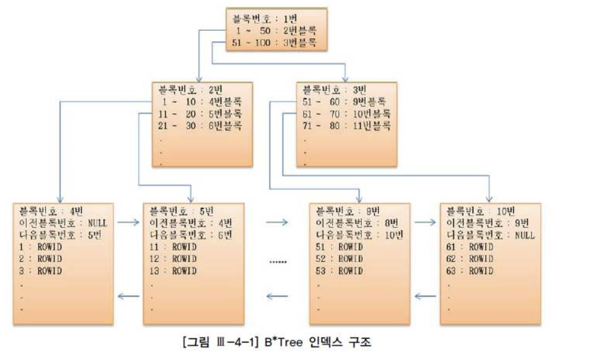


## 2) 인덱스 스캔 방식

### Range Scan

### 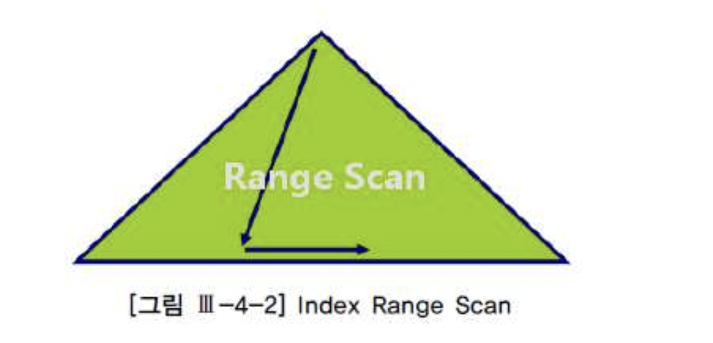


##### 스캔 방식

- Root \-> Branch \-> Leaf Sequential Scan


##### 활용 Case

- SQL 에 Index 선두 컬럼을 이용한 조건 있을 때
- Sort order by 생략 목적
- Min/Max 값 빠르게 추출 목적


##### 성능 향상 포인트

- Scan 범위 / Table Access 횟수 줄이는 것


##### 실행 계획 예시

- **ORACLE : INDEX(RANGE SCAN)**

```
Execution Plan
---------------------------------------------------
o SELECT STATEMENT Optimizer=ALL_ROWS
1 0 TABLE ACCESS (BY INDEX ROWID) OF 'EMP' (TABLE)
2 1 INDEX (RANGE SCAN) OF 'EMP DEPTNO_IDX' (INDEX)
```


- **SQL Server : Index Seek**

```
StmtText
---------------------------------------------------------------------
I--Nested Loops(Inner Join, OUTER REFERENCES:([Bmk1000)))
   I--Index Seek(OBJECT:(U.ldboJ.[empl[emp_deptnojdx]), SEEK:([deptno]=20) ORDERED FORWARD)
   I--RID Lookup(OBJECT:(L .l. [dboJ.[emp]), SEEK:([Bmkl000]=[Bmk1000]) LOOKUP ORDERED FORWARD)
```


##### Index Full Scan

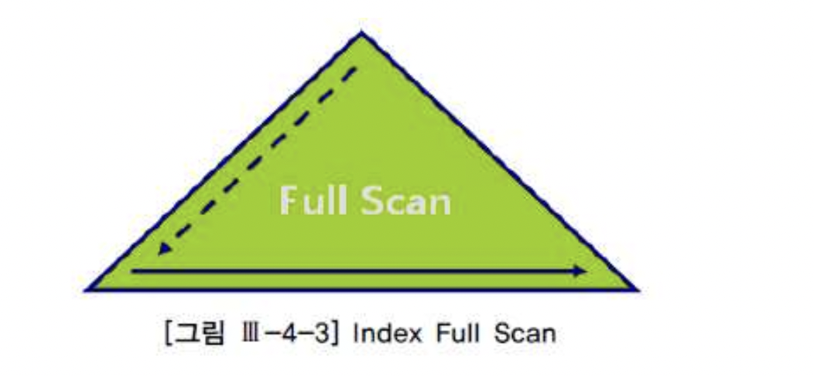


##### 스캔방식

- 시작 Leaf Block 찾기 위한 처음 수직적 탐색
- 이후 모든 Leaf Block Sequential 스캔


##### 활용 Case

- Table Full Scan 대체
  - SQL 에 Index 선두 컬럼을 이용한 조건이 없고
  - Scan 범위 대비 Filtering 되어 추출하는 범위가 작을 때
  - (Index 에서 Filtering 이 잘 되어 Table Access 가 적게 발생할 때)

- 정렬된 값의 의 빠른 반환 필요 시
  - Table Access 가 많아서 총 비용이 많이 들더라도 정렬된 값의 처음 값 몇 개만 빠르게 반환해야할 때
  - --> First_rows(Oracle)/fastfirstrow(SQL Server) 모드 운영 시 선택 가능
  - --> 전체 범위 반환시에는 FTS 보다 느릴 수 있음


##### 실행 계획 예시

- **ORACLE : Index (FULL SCAN)**

```
Execution Plan
--------------------------------------------------
o SELECT STATEMENT Optimizer=ALL_ROWS
1 0 TABLE ACCESS (BY INDEX ROWID) OF 'EMP' (TABLE)
2 1 INDEX (FULL SCAN) OF 'EMP_IDX' (INDEX)
```


- **SQL Server : Index Scan**

```
StmtText
1--Filter(WHERE:(L.l. [dbol. [empl. [sall) (2000.)))
  I-- Nested Loops(lnner Join, OUTER REFERENCES' ([BmklOOO]))
   I--Index Scan(OBJECT:(L .l. [dboJ.[empJ.[emp_idx]), ORDERED FORWARD)
   I--RID Lookup(OBJECT: (L .l. [dboJ.[emp]), SEEK: ([BmklOOOl=[BmklOOO]) LOOKUP ORDERED FORW ARD)
```


##### Index Unique Scan


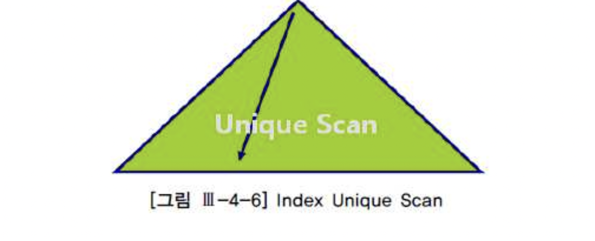

##### 스캔 방식

- 수직적 탐색만으로 Data Access


##### 활용 Case

- Unique Index 를 = 조건으로 검색 시


##### 실행 계획 예시

- **ORACLE : INDEX (UNIQUE SCAN)**

```
Execution Plan
-------------------------------------------
o SELECT STATEMENT Optimizer=ALL_ROWS
1 0 TABLE ACCESS (BY INDEX ROWID) OF 'EMP'
2 1 INDEX (UNIQUE SCAN) OF 'PK EMP' (UNIQUE)
```

- **SQL Server : Index Seek -> Range Scan 과 구분 없음**


### Index Skip Scan

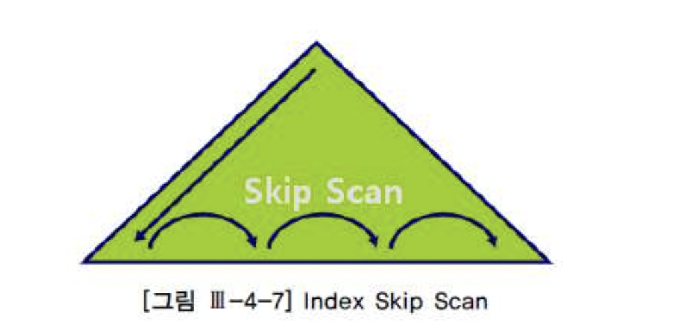


##### Scan 방식

- Root/Branch 블록 탐색 후 Data 가 있을 가능성 있는 하위 블록만 Access
- 선두 컬럼 데이터 별로 Looping 돌면서 후행 컬럼에 대해 Random Access 하는 개념과 "유사"
- Oracle 전용


##### 활용 Case

- SQL에 선두 컬럼에 대한 조건이 없을 때
- 선두 컬럼의 Distinct value 가 적고 후행 컬럼의 Distinct value 가 많을 때
- SQL 에 명시적으로 선두 컬럼에 대해 In List 를 지정 해 주면 Skip Scan 에 의존하지 않고 돌일 효과 낼 수 있음


##### 실행 계획 예시

- **ORACLE : INDEX (SKIP SCAN)**

```
Execution Plan
--------------------------------------------------
o SELECT STATEMENT Optimizer=ALL_ROWS
1 0 T ABLE ACCESS (Bγ INDEX ROWID) OF '사원 (TABLE)
2 1 INDEX (SKIP SCAN) OF '사원 IDX' (INDEX)
```


### Index Fast Full Scan


아마 이런 방식인 듯


##### Scan 방식

- Index Segment 전체를 Multiblock Scan
- Root \-> Branch \-> Leaf Scan 방식의 인덱스 구조 무시


##### 활용 Case

- Select 절의 컬럼이 인덱스에 모두 포함되어 있을 때만 가능함
- Index Full Scan 과의 비교


| 항목         | Index Full Scan                                           | Index Fast Full Scan         |
| :----------- | :-------------------------------------------------------- | :--------------------------- |
| 스캔방식     | Index 구조를 따라 스캔                                    | Index 세그먼트 스캔          |
| 결과집합순서 | 순서 보장                                                 | 순서 보장되지 않음           |
| Block I/O    | Single block I/O                                          | Multiblock I/O               |
| 병렬 탐색    | 파티션 없이는 불가능                                      | 가능                         |
| 사용조건     | 선두컬럼 조건 없고 Filtering 데이터가 전체에 비해 적을 때 | 인덱스 포함된 컬럼만 조회 시 |


### Index Range Scan Decending

##### Scan 방식

- 뒤에서부터 Range scan


##### 활용 Case

- 인덱스 컬럼 기준 내림차순 정렬 시
- 인덱스 컬럼의 Max 값 구할 때


##### 실행계획 예시

- **ORACLE : INDEX (RANGE SCAN DESCENDING)**

```
Execution Plan
-------------------------------------------------
SELECT STATEMENT Optimizer=ALL_ROWS
1 0 TABLE ACCESS (BY INDEX ROWID) OF 'EMP' (TABLE)
2 1 INDEX (RANGE SCAN DESCENDING) OF 'PK_EMP' (INDEX (UNIQUE))
```


- **SQL Server : Index Scan ... ORDERED BACKWORD**


## 3. 인덱스 종류

### 1. B-Tree

##### 구조

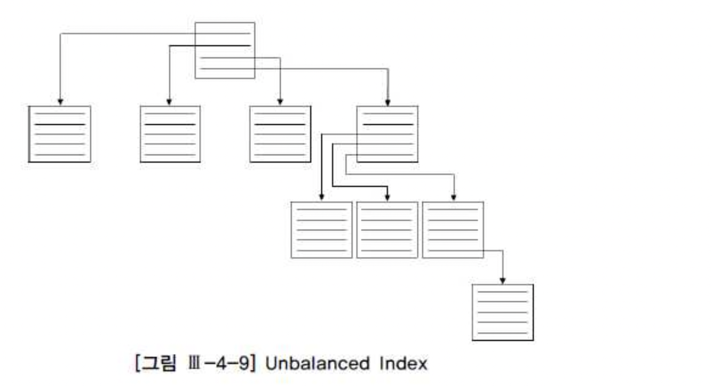


###### Root/Branch

- 하위 노드의 Data 범위 키 값
- 하위 노드의 Block 주소


###### Leaf

- 인덱스 키 값
- Table Block 주소
- 앞/뒤 Index Block 주소


##### 특징

- 인덱스 키 순서로 정렬되어 있어 범위 스캔(Range Scan) 가능
- 앞/뒤 Block 주소로 정방향, 역방향 스캔 가능
- Oracle B-Tree Index 는 널 저장 하지 않음
- SQL Server 는 Null 저장, 가장 앞순위로 정렬


##### 활용

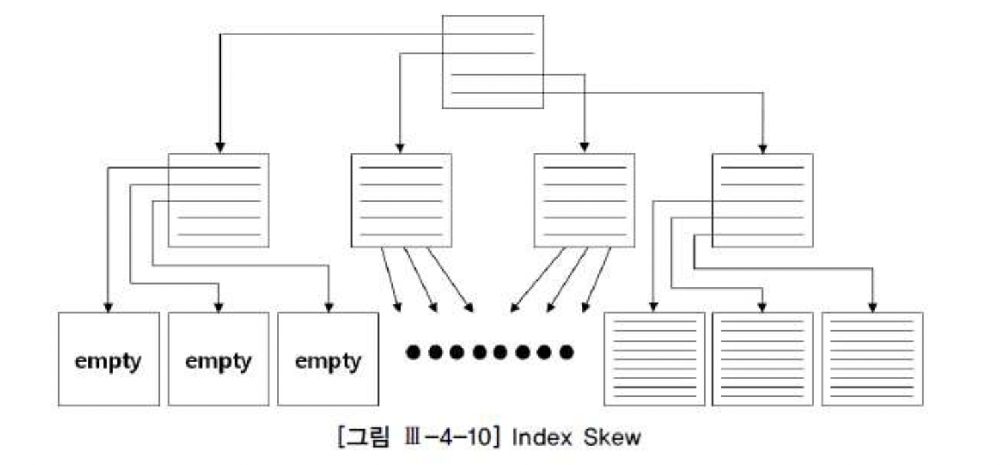


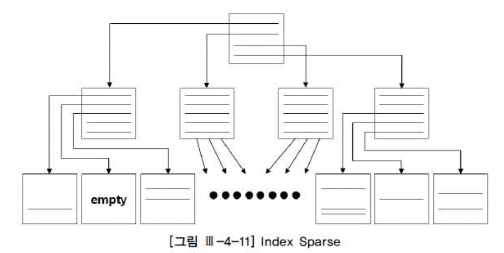


###### Index Fragmentation

- a.

  Unbalanced Index

  - 발생하지 않음(B-Tree 의 B 는 Balanced)


- b.

   

  Index Skew

  - Index 정렬 순으로 특정 방향의 데이터가 대량 Delete 되어 Leaf block 이 빈 상태
  - Leaf Block 은 Freelist 로 반환되지만 구조는 그대로 유지
  - 상위 Branch 범위에 해당하는 값 입력 시, 다른 노드에 인덱스 분할 발생 시 재 사용 가능
  - 재 사용 전까지 Scan 효율이 낮은 상태로 유지
  - SQL Server 에서는 Empty Leaf 를 주기적으로 정리(Ghost mark 처리 후 별도 정리)


- c.

   

  Index Sparse

  - 전반적인 Leaf nod 의 밀도 저하
  - 완전한 Empty 상태가 아니므로 상위 Branch 범위의 데이터 입력 전까지 블록 재 사용 불가
  - 레코드 건수가 일정해도 Index Size 만 증가 가능


###### Index 재 생성

- a. Rebuild 로 빈 공간 제거 작업은 전략적 선택
  - Scan 효율 증가 <--> DML 시 인덱스 분할로 인한 성능 저하
  - 빈 공간을 남기면서 재 생성하는 방법도 근본적 해결책은 아님
  - 재 생성 시 System 부하, 시간 고려 필요


- \* b. Rebuild 필요한 시점*
  - 인덱스 분할 경합 높을 때
  - 인덱스 깊이(Height) 증가 시
  - 자주 사용하는 인덱스 Scan 효율 증가 필요시
  - 대량 Delete 후 Data 재 입력시 까지 오랜 시간 소요 시
  - 총 Table Rows 수 대비 Index Size 만 계송 증가 시


### 나. Bitmap

##### 구조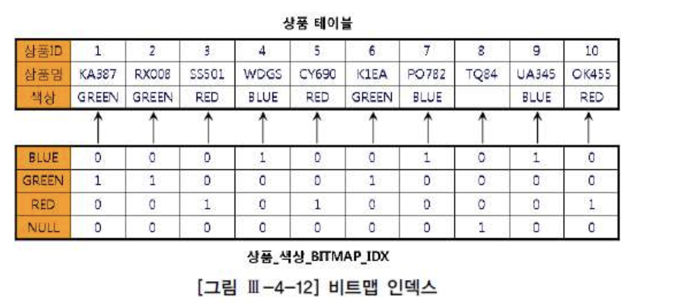


##### 특징

- Null 저장
- 부정형 조건 사용 시에도 Scan 가능
- Random Access 의 Cost 는 B-Tree 와 큰 차이 없음(Index block scan 만 줄어듬)
- 여러 Bitmap Index 를 동시에 사용하기 쉬움(Bitmap Index Merge)


##### 활용 방안

- Distinct value 의 개수가 적은 컬럼일 때 저장 효율 높음
- 대용량 데이터 검색 성능 향상
- 비 정형(ad-hoc) 쿼리 많을 때 적합
- 변경(DML) 작업 시 동일 Bitmap 범위의 모든 레코드에 Lock
- 일반적으로 DW 환경에 적합


### 다. FB Index(Funcdion Based Index)

##### 구조

- 컬럼 값에 가공 함수(ex round, || ) 적용한 값으로 Index 생성


##### 활용 방안

- 컬럼을 가공한 값을 이용해 데이터 검색 해야하는 요건이 어쩔수 없이 있을 때
- DML 로 인한 인덱스 갱신 시 함수까지 적용하여 갱신하므로 추가적인 부하 고려 필요함


### 라. Reverse Key Index

##### 구조

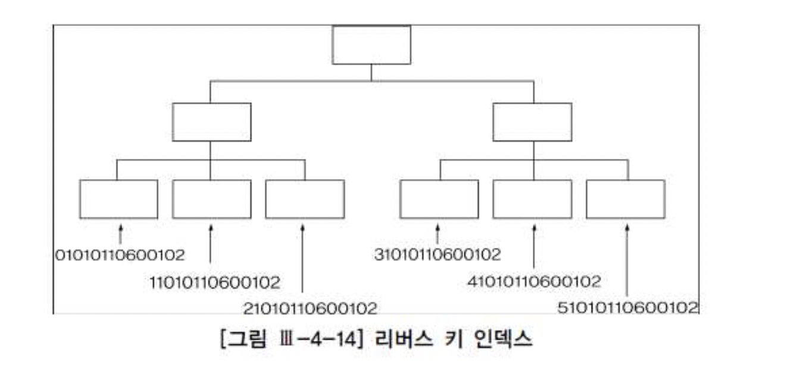

- B-Tree 와 유사하나 Leaf 의 Key 값이 글자 역순
- reverse(column) 함수 적용하여 인덱스 생성 한 것과 같음


##### 활용 방안

- Right Growing 현상으로 Insert 시 동일 인덱스 블록에 대한 경합 심할 때 사용 시 효율적
- = 조건 입력시만 사용 가능함 - 데이터의 '의미' 적인 부분이 없어지므로 (hash 함수 적용시와 유사)


### 마. Cluster Index(Oracle)

##### 구조

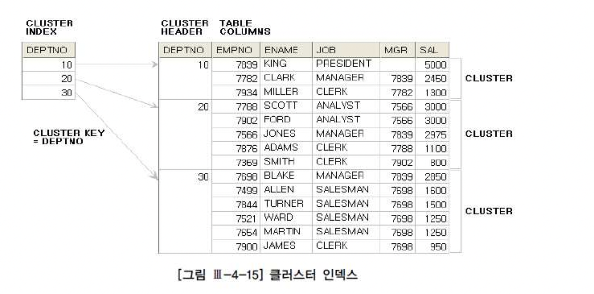


###### Cluster Table

- Cluster Key 가 같은 Row 가 하나의 Block 에 모이도록 저장
- 한 블록에 모두 담을 수 없을 때에는 여러 블록을 Cluster Chain 으로 연결
- 여러 테이블의 Join 된 데이터도 구성 가능


###### Cluster Index

- Cluster table 을 탐색하기 위한 인덱스로...
- B-Tree 와 유사
- Leaf Node 의 키 값은 Cluster Key 컬럼의 Unique 한 값을 가지고 있음
- Leaf node 는 해당 키 값을 저장하는 Cluster table의 데이터 블록만 가리키며
- 이로 인해 Index-Table 사이의 Random Access 는 값 하나 당 한번만 발생
- Random Access 후 Cluster table 에서는 Sequential Scan
- Table Data 와 1:M 관계


##### 활용 방안

- Index Key 값 별 Sequential Scan 하기 때문에 넓은 범위 검색 시 유리
- 수정(Cluster 이동), 입력(새 Cluster 할당)이 빈번한 컬럼에는 비추


### 바. IOT(Oracle) / Cluster형 Index(SQL Server)

##### 구조


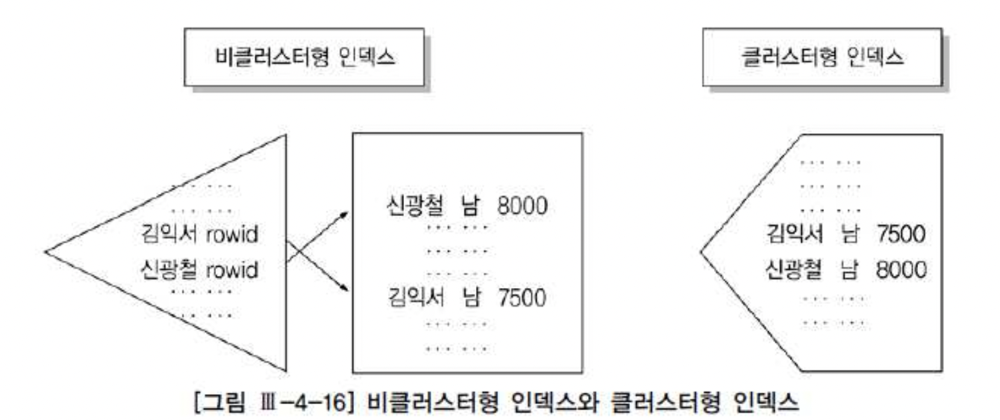


- Table = Index
- Cluster 형 인덱스
  - B-Tree Index 와 유사
  - Leaf Page 에 Key 값 + 나머지 Data 전부 저장
  - Unique 인덱스 아니어도 무관 - 중복 식별 위해 4byte 의 uniquifier 저장

- IOT
  - PK Index 로 구성된 Table
  - PK 외 나머지 Data 는 Overflow 영역에 저장


##### 특징

- Scan 성능 높음
  - Table Data 의 정렬 보장
  - 별도의 Table Access 과정 생략 가능

- DML 성능 낮음
  - Table 정렬 상태 유지 필요
  - SQL Server: Leaf Page 에 모든 데이터가 있으므로 잦은 분할(Split) 발생


##### 활용 방안

- 넓은 범위 검색이 잦은 테이블
- 크기 작고 NL 이 많은 테이블
- 컬럼 수 적고 Row 수 많은 테이블
- 데이터 입력, 조회 패턴이 다른 테이블(일반 Index 와 유사한 듯)


##### 비 클러스터형(Secondary) Index

- Cluster 형 인덱스(IOT PK Index) 외 다른 Index
- 메인 인덱스를 가르키는 키 값을 포함
- SQL Server 비 클러스터형 인덱스 구조
  - 비 클러스터형 인덱스가 클러스터형 인덱스의 값(Data) 를 가짐(7.0 이상 버전)
  - 클러스터형 인덱스 분할 시
    - 갱신 발생 안함
    - 주소가 아닌 데이터 내용을 지칭하므로 영향 없음


- \* Oracle Secondary 인덱스 구조
  - a. Logical Rowid (PK + physical guess) 이용
  - b. physical guess 는 IOT (재)생성 시의 Data Block address(DBA)
  - c. PK Index 분할 시
    - 갱신 발생 안함
    - physical guess 주소 선 탐색 후 없으면 PK 값으로 재 탐색

