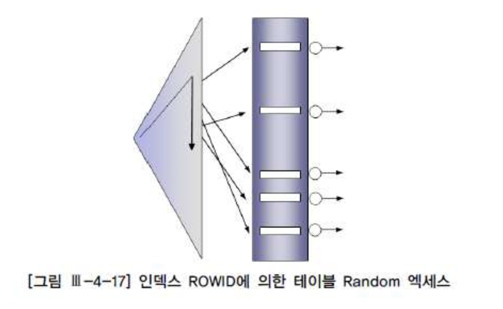
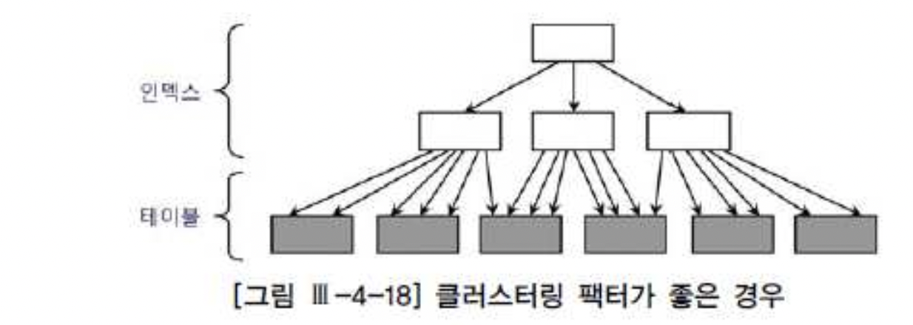
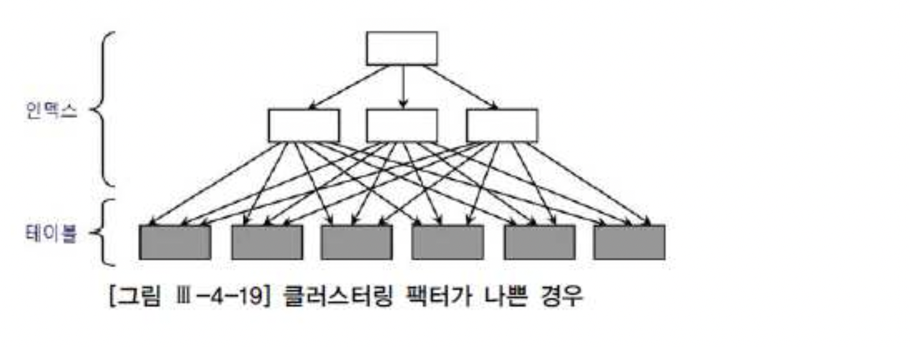
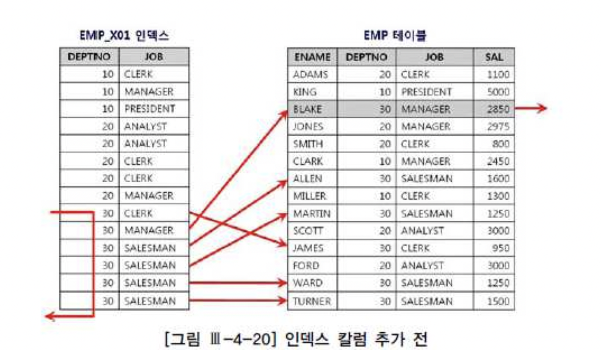
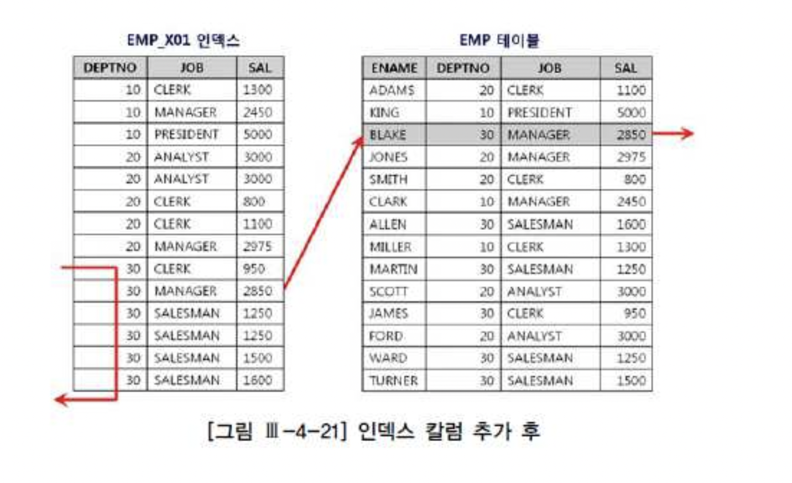
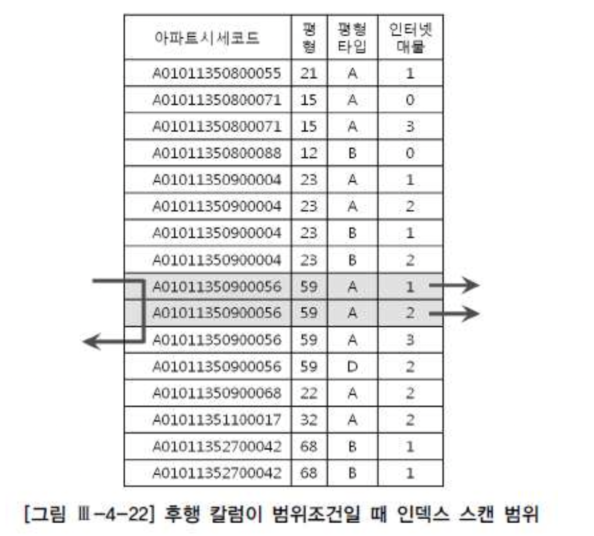
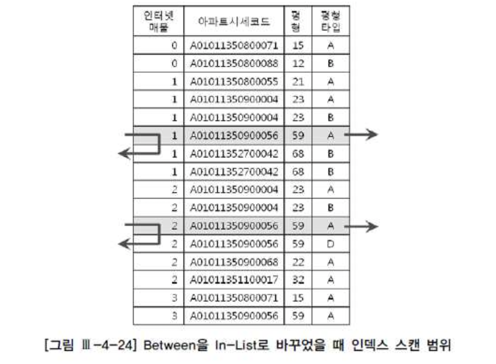

# 02. 인덱스 튜닝


## 1) 인덱스 튜닝 기초

##### 1. 인덱스가 있어도 효율적 활용이 불가능한 경우

- **인덱스 선두컬럼 조건절 가공**

```sql
SELECT * FROM EMP WHERE SUBSTR(TO_CHAR(EMP_NO), 1, 4) = '2012' ;
```


- **부정형 비교 사용**

```sql
SELECT * FROM EMP WHERE EMP_NO h3. = 20120902 ;
```


- **Not Null 컬럼 검색(ORACLE Only)**

```sql
SELECT * FROM EMP WHERE DEPT_CD IS NOT NULL ;
```

- Range Scan 은 불가능하지만 차선책은 선택 가능
  - Index full scan

- Case by Case 인 경우
  - 결합 인덱스인데 선두컬럼 조건이 있고 다른 컬럼에 널 검색 하는 경우 등


##### 2. 인덱스 컬럼 가공에 대한 튜닝 예시

| 원본                                                    | 튜닝 방안                                                    |
| :------------------------------------------------------ | :----------------------------------------------------------- |
| select * from 업체 where substr(업체명, 1, 2) = '대한'; | select * from 업체 where 업체명 like '대한%'                 |
| select * from 사원 where 월급여*12 = 36000000           | select * from 사원 where 월급여 = 36000000/12                |
| select * from 주문 where to_char(일시, 'yyyymmdd')=:dt  | select * from 주문 where 일시 >= to_date(:dt,'yyyymmdd') and 일시 < to_date(:dt, 'yyyymmdd') +1 |


##### 3. 묵시적 형 변환으로 인한 성능저하

- 조건절 비교식에서 두 값의 데이터 타입이 다를 때 내부적 형 변환 발생
- 문자형=숫자형 비교 : 문자를 숫자형으로 변환
- 문자형=날짜형 : 문자 --> 날짜에 맞추어 변환
- 예시


| 원본 쿼리            | 묵시절 형 변환된 쿼리           |
| :------------------- | :------------------------------ |
| WHERE CHAR_COL = 20  | WHERE to_number(CHAR_COL) = 20  |
| WHERE NUM_COL = '20' | Where NUM_COL = to_number('20') |

- **--> Case 에 따라 컬럼 가공이 발생 가능하므로 명시적으로 타입을 맞춰 주는것이 좋음**


## 2) Table Random Access 최소화

### 1. TABLE RANDOM ACCESS

###### a. 발생하는 경우

- Index Leaf block 에 없는 데이터를 추가로 Table 에서 가져와야 할 경우
- SELECT 절이나 조건절에 인덱스 외 컬럼 참조하는 경우


###### b. 실행계획 예시

- **ORACLE : TABLE ACCESS(BY INDEX ROWID)**

```
SQL) select * from 고객 where 지역 = '서울'，

Execution Plan
o SELECT STATEMENT Optimizer=ALL_ROWS
1 0 TABLE ACCESS (BY INDEX ROWID) OF '고객' (TABLE)
2 1 INDEX (RANGE SCAN) OF '고객 지 역 IDX' (INDEX)
```


###### c. Table Access 원리

##### rowid 란?

- 물리적 주소값: Object 번호, Datafile 번호, Block 번호 등
- 디스크 상의 위치 정보
- rowid 의 DBA(Data Block address) 를 버퍼캐시 검색 시 Hash Key 로 사용함


##### rowid 를 이용한 Block read 원리

- 1. Index 에서 rowid 를 읽고 DBA를 해시 함수에 적용해 Hash key 확인

- 2. Hash key 를 이용해 Buffer Cache 의 Hash Bucket 에 접근

- 3. Hash bucket 의 Hash Chain 을 스캔하면서 블록 헤더 탐색

- 4. 블록 헤더를 이용해 버퍼 블록을 스캔(버퍼에 캐싱된 데이터인지 먼저 확인)

  - 버퍼 블록이 없으면 신규 캐싱을 위해 LRU List 를 스캔하며 free buffer 확인
  - Free buffer 를 찾지 못하면 Dirty 버퍼를 디스크에 기록하여 free buffer 확보

- 5. Disk 에서 블록을 읽음(Caching)

- 위 과정을 수행 하는 동안 Latch 등등의 복잡한 과정이 들어 가기 때문에 Cost 가 많이 소요 됨
- 인덱스 Rowid 에 의한 Table Access 가 그닥 빠르지 않은 이유


###### d. Clustering Factor 란?

- 군집도 - Table data 가 특정 컬럼(인덱스 컬럼) 정렬 순으로 얼마나 잘 정렬되어 있는지
- 같은 값을 가지는 Data 가 같은 Block 에 더 잘 모여 있는 상태
- 군집도가 높을수록 1개 블록 Access 시 원하는 Row를 한꺼번에 많이 가져올 수 있음


### 2. 인덱스 손익분기점

###### a. 손익분기점이란

- **인덱스 경유하는 Table Scan 비용 < Table Full Scan 비용** 인 지점


###### b. 극복 방안 - DBMS 자체 기능 활용

- IOT / Cluster 형 인덱스
  - Table Access 자체를 발생시키지 않아 비용 감소
- Included Index(SQL Server Only)
  - 인덱스 컬럼 외의 테이블 컬럼을 인덱스 리프 블록에 저장하는 기능
  - 인덱스 검색 조건에는 영향을 주지 않으면서 Table Access 발생시키지 않음
- Cluster Table(ORACLE Only)
  - 키 값이 같은 레코드를 한 블록에 저장
  - 클러스터 인덱스 이용 할 경우 같은 데이터에 대해 1회 Random Access 발생
  - 클러스터에 도달하면 Sequential 방식 스캔하기 때문에 비효율 없음
- Partitioning
  - Table full scan(Sequential 방식 스캔) 의 비효율을 감소시킬 수 있음
- 부분범위처리 유도








### 3. Random Access 최소화 튜닝

#### a. 인덱스 컬럼 추가






- EMP 테이블 컬럼은

| EMP_NO | ENAME | DEPTNO | JOB  | SAL  | HIRE_DT |
| :----- | :---- | :----- | :--- | :--- | :------ |
|        |       |        |      |      |         |

- 인덱스는 [deptno + job] 순으로 구성
- 아래와 같은 쿼리를 수행하려고 할 때

```sql
select ename, job, sal
from emp
where deptno =30
and sal >= 3100
```


- **INDEX EMP_IND (DEPTNO + JOB)**

```sql
Call     Count CPU Time Elapsed Time       Disk      Query    Current       Rows
------- ------ -------- ------------ ---------- ---------- ---------- ----------
Parse        1    0.000        0.002          0          0          0          0
Execute      1    0.000        0.000          0          0          0          0
Fetch        2    0.010        0.020          0        106          0          6
------- ------ -------- ------------ ---------- ---------- ---------- ----------
Total        4    0.010        0.022          0        106          0          6

Rows     Row Source Operation
-------  ---------------------------------------------------
      0  STATEMENT
      6   TABLE ACCESS BY INDEX ROWID EMP (cr=106 pr=0 pw=0 time=11766 us)
    187    INDEX RANGE SCAN IND_EMP (cr=3 pr=0 pw=0 time=209 us)OF IND_EMP (NONUNIQUE)
```

- 6건의 Row 를 찾기 위해 Index --> Table Access 가 187건 발생
- 기존 인덱스의 변형 없이 SAL 조건 컬럼만 인덱스에 추가 시


- **INDEX EMP_IND (DEPTNO + JOB + SAL)**

```
Call     Count CPU Time Elapsed Time       Disk      Query    Current       Rows
------- ------ -------- ------------ ---------- ---------- ---------- ----------
Parse        1    0.000        0.002          0          0          0          0
Execute      1    0.000        0.000          0          0          0          0
Fetch        2    0.000        0.002          0          9          0          6
------- ------ -------- ------------ ---------- ---------- ---------- ----------
Total        4    0.000        0.004          0          9          0          6


Rows     Row Source Operation
-------  ---------------------------------------------------
      0  STATEMENT
      6   TABLE ACCESS BY INDEX ROWID EMP (cr=9 pr=0 pw=0 time=957 us)
      6    INDEX RANGE SCAN IND_EMP2 (cr=4 pr=0 pw=0 time=614 us)OF IND_EMP2 (NONUNIQUE)
```


- INDEX RANGE SCAN 186 -> 6건으로 감소
- 조건 절 컬럼 추가로 인해 불필요한 테이블 스캔, Filtering 감소 --> 읽고 버리는 row 감소


###### b. Covered Index

- 조건절에는 없는 컬럼이지만 SELECT 절 컬럼을 인덱스 컬럼 맨 뒤에 추가
- Leaf Block 에 찾는 모든 데이터가 있어 Table Access 자체가 발생하지 않음

- **INDEX EMP_IND (DEPTNO + JOB + SAL + ENAME)**

```
Call     Count CPU Time Elapsed Time       Disk      Query    Current       Rows
------- ------ -------- ------------ ---------- ---------- ---------- ----------
Parse        1    0.000        0.000          0          0          0          0
Execute      1    0.000        0.000          0          0          0          0
Fetch        2    0.000        0.001          0          5          0          6
------- ------ -------- ------------ ---------- ---------- ---------- ----------
Total        4    0.000        0.001          0          5          0          6

Rows     Row Source Operation
-------  ---------------------------------------------------
      0  STATEMENT
      6   INDEX RANGE SCAN IND_EMP3 (cr=5 pr=0 pw=0 time=908 us)OF IND_EMP3 (NONUNIQUE)
```


###### c. Include Index

- 인덱스 키로 사용되지 않는 컬럼을 Leaf block 에 추가

```
create index emp_x01 on emp (deptno) include (sal)
```

- 일반 결합 인덱스일 경우 sal 컬럼도 tree 구조 분기 키로 사용되도록 루트, 브렌치 블록에 저장
- Include 옵션 사용 할 경우 Leaf 블록에만 데이터 저장
- 인덱스 수직적 탐색에는 sal 컬럼 데이터 사용 불가
- 수평적 탐색 시 **Filter 조건**으로 사용 됨
- Table access 횟수 감소 가능


###### d. IOT, 클러스터형 인덱스, 클러스터 테이블 활용

설명이 이미 많이 나왔으므로 Hash Cluster 에 대해서만

- 해시 함수에서 반환된 값이 같은 데이터를 물리적으로 같은곳에 저장
- 해시 함수가
  - 인덱스 역할을 대신
  - 클러스터 키를 데이터 블록 주소로 변환
- 단점은
  - 항상 = 구조의 조건 검색만 가능(다른 hash 함수 사용 시와 동일)


###### e. Clustering Factor 높이기

- 특정 컬럼 기준으로 테이블 재 정렬(Reorg)
- 다른 컬럼의 클러스터링 펙터는 나빠질 수 있음
- Reorg 에 필요한 시스템/인적 자원 소요
  - --> 업무적으로 중요한(가장 자주 쓰이는) 컬럼인지 고려
  - --> 다른 컬럼과 상관관계가 있어 클러스터링 펙터가 함께 좋아질 수 있는지 고려


## 3) Index Scan 범위 최소화

- Sequential Access 의한 선택 비중을 높이는 방안


###### 인덱스 선행 컬럼이 범위 조건일 때 비효율 발생

- 인덱스 컬럼이 조건절에서 모두 = 조건일 때 비효율 없음(읽고 버리는 Row 없음)
- 인덱스 뒷쪽 컬럼에 대해 = 조건이 아니거나 조건절이 아니라면 비효율 적음
- 인덱스 선행 컬럼이 조건절 누락, 범위, Like 비교 시 비효율 발생


아래 쿼리에서

```sql
select 해당층, 평당가, 입력일, 해당동, 매물구분, 연사용일수, 중개업소코드
from 매물아파트매매
where 아파트시세코드 = 'A010101231241223'
and 평형 = 59
and 평형타임 = 'A'
and 인터넷매물 between 1 and 2
order by 입력일 desc
```


- 인터넷매물 between 1 and 2 조건이 인덱스 선/후행일때 비교시 아래와 같음



- 선행 컬럼이 = 일 때는 조건을 만족하는 레코드가 모여 있으므로 필요 범위만 스캔 가능
- 선행 컬럼이 between 일 때는 나머지 조건이 흩어지게 되므로 스캔 후 버리는 Row 많음


- -> 인덱스 선행 컬럼이 = 조건이 되게 구성
- -> 인덱스 구성을 바꿀 수 없을 때는 범위 조건을 In List 로 변환 가능한지 고려


- In list 변경

```
select 해당층, 평당가, 입력일, 해당동, 매물구분, 연사용일수, 중개업소코드
from 매물아파트매매
where 아파트시세코드 = 'A010101231241223'
and 평형 = 59
and 평형타임 = 'A'
and 인터넷매물 in (1, 2)
order by 입력일 desc
```





- 범위 스캔 -> In 절에 값 별로 수직적 탐색이 2번 발생하는 방식으로 변경
- 실행 계획 예시


- **ORACLE : INLIST ITERATOR**

```
----------------------------------------------------------------------
|Id | Operation                   | Name              | Rows | Bytes |
----------------------------------------------------------------------
| 0 | SELECT STATEMENT            |                   |   1  |   37  |
| 1 | INLIST ITERATOR             |                   |      |       |
| 2 | TABLE ACCESS BY INDEX ROWID | 매물아파트매매    |   1  |   37  |
| 3 | INDEX RANGE SCAN            | 매물아파트매매 PK |   1  |       |
----------------------------------------------------------------------  
```

- 이때 In list 값의 갯수가 적어야 효율성 발휘 가능함
  - Between range 탐색 > In List 수직적 탐색의 손익 분기점 고려 필요
- Oracle 일 경우 Index skip scan 이 유용할 수 있음


#### 범위 조건을 두개 이상 사용할 때 비효율 발생

- **인덱스가 [회사 + 지역 + 상품명] 일 때 아래 SQL에서**

```sql
select 고객 ID，상품명, 지역, ...
from 가입상품
where 회사 = :com
and 지 역 like :reg || '%'
and 상품명 like : prod || '%'
```

- 첫 조건인 '회사' 가 스캔 범위를 결정
- 지역, 상품명은 읽고 걸러내는 Filter 조건으로 사용 --> 비효율 발생


- **아래처럼 지역 컬럼 입력 조건이 아예 없을 경우 대비해 위와 같이 작성 한 경우라면**

```
where 회사 'AAA' and 지 역 like '%' and 상품명 like 'BBB%'
```


- 아예 지역 조건이 있을 때, 없을 때로 SQL 을 2개 만들기

```
<SQL1>
select 고객 ID，상품명, 지역, ...
from 가입상품
where 회사 = :com
and 상품명 like : prod || '%'

<SQL2>
select 고객 ID，상품명, 지역, ...
from 가입상품
where 회사 = :com
and 지 역 = :reg
and 상품명 like : prod || '%'
```


##### UNION ALL 을 사용하기

- 상단 쿼리는 비효율이 있지만 하단은 빨라질 수 있음

```
select 고객 ID，상품명, 지역, ...
from 가입상품
where :reg is null
and 회사 = :com
and 상품명 like : prod || '%'
union all
select 고객 ID，상품명, 지역, ...
from 가입상품
where 회사 = :com
and 지 역 = :reg
and 상품명 like : prod || '%'
```


## 4) 인덱스 설계


#### 1. 결합 인덱스 구성을 위한 기본 공식

- 조건절에 사용되거나, 자주 사용하는 컬럼 선정
- 위 컬럼 중 = 조건으로 조회되는 컬럼을 선두에 위치
- 소트 오퍼레이션 생략하기 위하 컬럼 추가(컬럼 순서 같을 때 order by, group by 절 생략 가능)


#### 2. 추가 고려 사항

- 선택도
- 업무중요도
- 클러스터링 팩터
- 데이터 량
- DML 부하 (기존 인덱스 갯수, 초당 DML 발생량, 자주 갱신되는 컬럼 포함 여부 등)
- 저장공간
- 인덱스 관리 비용

- --> 인덱스 생성은 공식이 아닌 전략적 선택의 문제*
