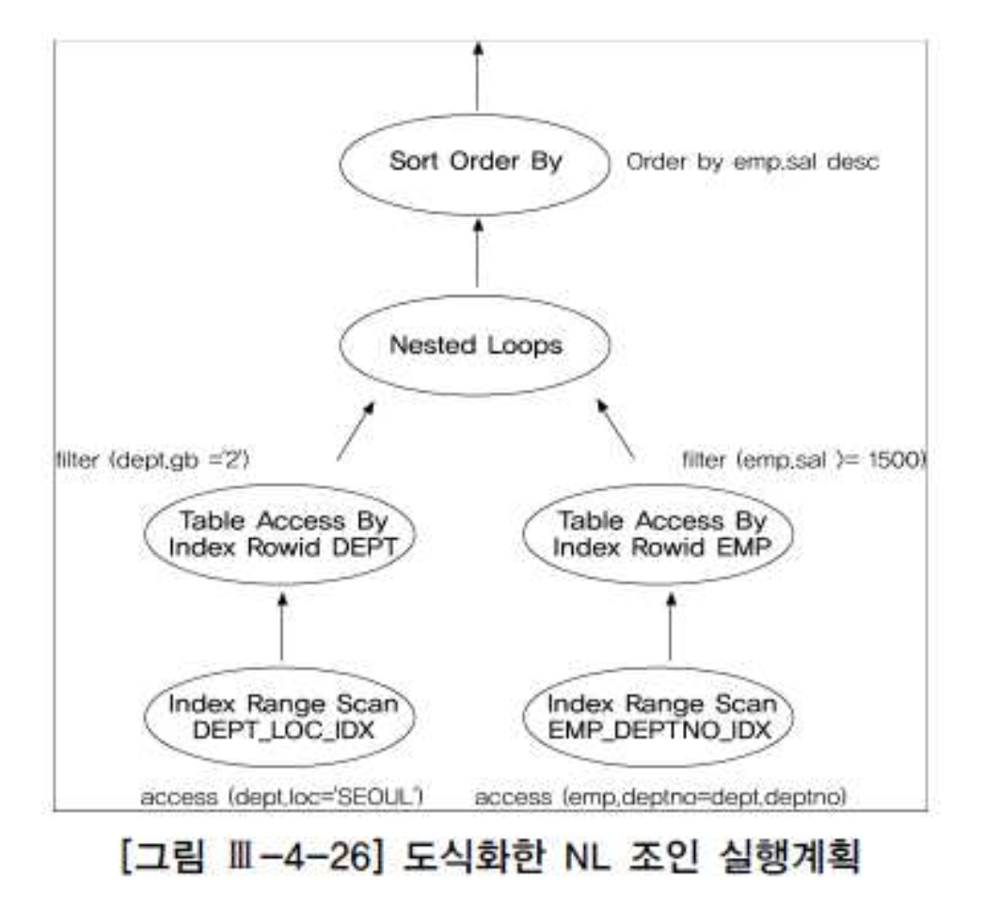
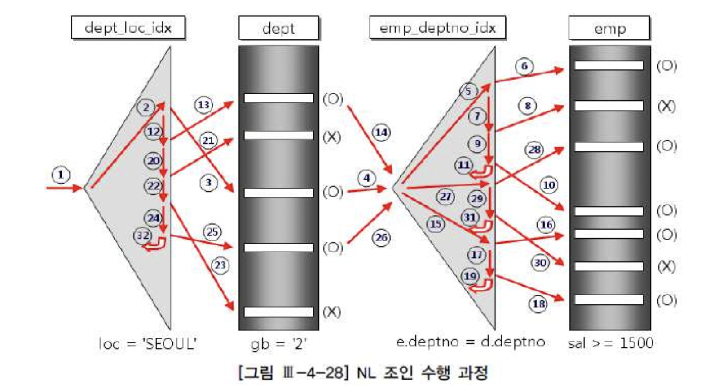
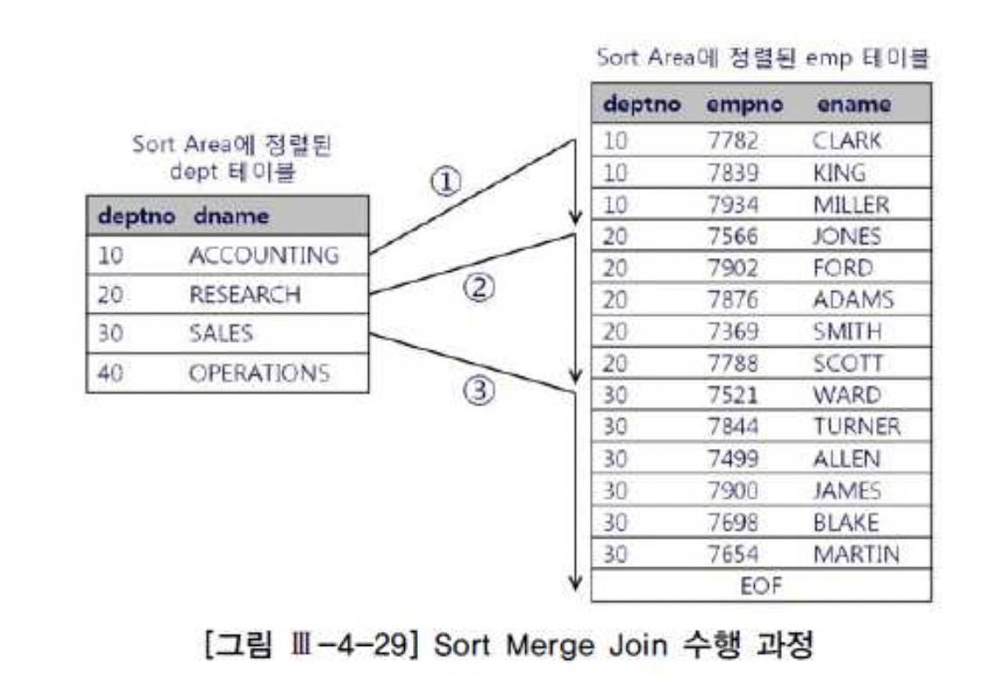
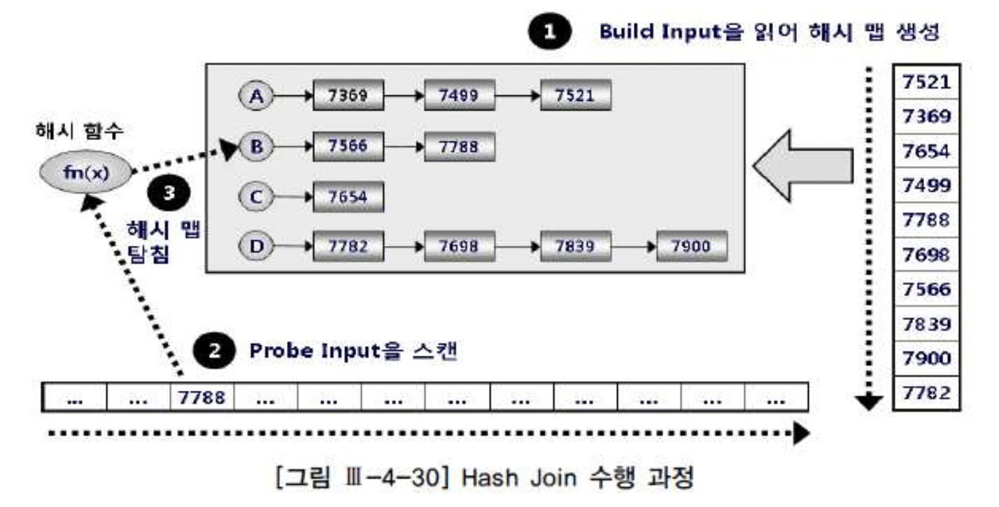

# 03. 조인기본원리


## 1) Nested Loop Join

##### 가. 기본 메커니즘


###### C,JAVA

```java
for(i=0; i<100; i++){    -- outer loop
  for(j=0; j<100; j++){  -- inner loop
    // Do Anything...
  }
}
```

- 위 중첩 루프문과 NL Join의 데이터 엑세스 방식은 아래 PL/SQL문으로 설명됨.


###### PL/SQL

```sql
begin
  for outer in (select deptno, empno, rpad(ename, 10) ename from emp)
  loop    -- outer 루프
    for inner in (select dname from dept where deptno = outer.deptno)
    loop  -- inner 루프
      dbms_output.put_line(outer.empno||' : '||outer.ename||' : '||inner.dname);
    end loop;
  end loop;
end;
```

- 위 PL/SQL문은 아래 쿼리와 같은 순서로 데이터 액세스하고, 데이터 출력순서도 같으며 내부적으로(=Recursive하게) 쿼리를 반복 수행하지 않는 점만 다르다.


###### Oracle

```sql
SELECT /*+ ordered use_nl(d) */ E.EMPNO, E.ENAME, D.DNAME
  FROM EMP E, DEPT D
 WHERE D.DEPTNO = E.DEPTNO

SELECT /*+ leading(e) use_nl(d) */ E.EMPNO, E.ENAME, D.DNAME
  FROM DEPT D, EMP E
 WEHRE D.DEPTNO = E.DEPTNO
```


- ordered : FROM 절에 나열된 테이블 순서대로 조인
- use_nl(d) : NL(Nested Loop) JOIN을 이용하여 조인, d : EMP 테이블을 OUTER/DRIVING TABLE로 조인


##### NL Join 수행 과정 분석

- 예제 SQL

```sql
SELECT /*+ ordered use_nl(e) */
       E.EMPNO, E.ENAME, D.DNAME, E.JOB, E.SAL
  FROM DEPT D, EMP E
 WHERE D.DEPTNO = E.DEPTNO ............①
   AND D.LOC = 'SEOUL'.................②
   AND D.GB = '2'......................③
   AND E.SAL >= 1500...................④
 ORDER BY SAL DESC
```


- Index

```sql
* PK_DEPT : DEPT.DEPTNO
* DEPT_LOC_IDX : DEPT.LOC
* PK_EMP : EMP.EMPNO
* EMP_DEPTNO_IDX : EMP.DEPTNO
* EMP_SAL_IDX : EMP.SAL
```


- EXECUTION PLAN

```sql
-----------------------------------------------------------
0      SELECT STATEMENT
1  0     SORT ORDER BY
2  1      NESTED LOOPS
3  2       TABLE ACCESS BY INDEX ROWID DEPT
4  3         INDEX RANGE SCAN DEPT_LOC_IDX
5  2       TABLE ACCESS BY INDEX ROWID EMP
6  5         INDEX RANGE SCAN EMP_DEPTNO_IDX
```

- 1) 사용되는 인덱스 : DEPT_LOC_IDX, EMP_DEPTNO_IDX
- 2) 조건비교 순서 : ② → ③ → ① → ④

- 1. DEPT_LOC_IDX 인덱스 범위 스캔(ID = 4)

  => DEPT.LOC = 'SEOUL' 조건에 해당하는 레코드를 찾기 위해 DEPT_LOC_IDX 인덱스 RANGE SCAN

- 2. 인덱스 ROWID로 DEPT 테이블 액세스(ID = 3)

  => DEPT_LOC_IDX 인덱스에서 읽은 ROWID로 DEPT 테이블을 액세스해 DEPT.GB = '2' 필터 조건에 해당하는 레코드를 찾는다.

- 3. EMP_DEPTNO_IDX 인덱스 범위 스캔(ID = 6)

  => DEPT 테이블에서 읽은 DEPTNO 값을 가지고 조인 조건을 만족하는 EMP 테이블 레코드를 찾기 위해 EMP_DEPTNO_IDX 인덱스 RANGE SCAN

- 4. 인덱스 ROWID로 EMP 테이블 액세스(ID = 5)

  => EMP_DEPTNO_IDX 인덱스에서 읽은 ROWID를 가지고 EMP 테이블을 액세스해 SAL >= 1500 필터 조건에 해당하는 레코드를 찾는다.

- 5. SAL 기준 내림차순(DESC) 정렬(ID = 1)

  => 1~4 과정을 통과한 레코드들을 SAL 컬럼 기준 내림차순(DESC)으로 정렬한 후 결과를 리턴한다.

※ 각 단계 완료 후 다은 단계로 넘어가는게 아니라 한 레코드씩 순차적으로 진행됨.





- 그림 Ⅲ-4-26을 해석할 때는, 형제 노드 간에는 좌에서 우로 읽고, 부모-자식 노드 간에는 아래에서 위쪽으로, 즉 자식 노드부터 읽는다.
- 그림 Ⅲ-4-28을 보면 지금까지 설명한 NL Join의 수행 절차를 좀 더 명확히 이해할 수 있다.





- 11, 19, 31, 32 : 스캔할 데이터가 더 있는지 확인하는 one-plus 스캔
  - ※one-plus 스캔 : Non Unique Scan

- (O):테이블 필터 조건에 의해 레코드가 걸러지지 않은 것을 의미하고, (X): 테이블 필터 조건에 의해 걸러진 것을 의미
- 결국 전체 일량은 dept_loc_idx 인덱스를 스캔하는 양이다

- 이 그림에서는 단일 칼럼 인덱스를 '=' 조건으로 스캔(Non Unique Scan)했으므로 비효율 없이 6(=5+1)건을 읽었고,
  - 그만큼 테이블 Random 액세스가 발생했으며 이 부분이 NL Join의 첫 번째 부하지점이다.


- 만약 dept 테이블로 많은 양의 Random 액세스가 있었는데 gb = '2' 조건 필터링 비율이 높다면 dept_loc_idx에 gb 칼럼을 추가하는 방안을 고려해야 한다.
- 두 번째 부하지점은 emp_deptno_idx 인덱스를 탐색하는 부분이며, Outer 테이블인 dept를 읽고 나서 조인 액세스가 얼마만큼 발생하느냐에 의해 결정된다.
- 이것 역시 Random 액세스에 해당하며, 그림 Ⅲ-4-28 에서는 gb = '2' 조건을 만족하는 건수만큼 3번의 조인시도가 있었다.
- 만약 emp_deptno_idx의 높이(height)가 3이면 매 건마다 그만큼의 블록 I/O가 발생하고, 리프 블록을 스캔하면서 추가적인 블록 I/O가 더해진다.


- 세 번째 부하지점은 emp_deptno_idx를 읽고 나서 emp 테이블을 액세스하는 부분이다. 여기서도 sal >= 1500 조건에 의해 필터링되는 비율이 높다면 emp_deptno_idx 인덱스에 sal 칼럼을 추가하는 방안을 고려해야 한다.
- OLTP 시스템에서 조인을 튜닝할 때는 일차적으로 NL Join부터 고려하는 것이 올바른 순서다. 우선, NL Join 메커니즘을 따라 각 단계의 수행 일량을 분석해 과도한 Random 액세스가 발생하는 지점을 파악한다. 조인 순서를 변경해 Random 액세스 발생량을 줄일 수 있는 경우가 있지만, 그렇지 못할 때는 인덱스 칼럼 구성을 변경하거나 다른 인덱스의 사용을 고려해야 한다. 여러 가지 방안을 검토한 결과 NL Join이 효과적이지 못하다고 판단될 때 Hash Join이나 Sort Merge Join을 검토한다.


## 2) Sort Merge Join

- NL Join은 Outer 테이블의 조인 컬럼 인덱스 유무가 매우 중요하다. 인덱스가 존재하지 않으면 Outer 테이블에서 읽히는 건마다
- Inner 테이블 전체를 스캔하기 때문이다. 이때 옵티마이저는 Sort Merge Join이나 Hash Join을 고려한다.

- Sort Merge Join은 두 테이블을 각각 정렬한 다음 두 집합을 머지하면서 조인을 수행하며 두 단계로 진행한다.
  - ① 소트 단계 : 양쪽 집합을 조인 컬럼 기준으로 정렬한다.
  - ② 머지 단계 : 정렬된 양쪽 집합을 머지한다.

- 만약 조인 칼럼에 인덱스가 있으면(Oracle의 경우 Outer 테이블에만 해당) ①번 소트 단계를 거치지 않고 곧바로 조인할 수도 있다.
- Oracle은 조인 연산자가 부등호이거나 아예 조인 조건이 없어도 Sort Merge Join으로 처리할 수 있지만,
- SQL Server는 조인 연산자가 '=' 일 때만 Sort Merge Join을 수행한다.


##### 가. 기본 메커니즘

- 예제) Oracle

```sql
SELECT /*+ ordered use_merge(e) */ D.DEPTNO, D.DNAME, E.EMPNO, E.ENAME
  FROM DEPT D, EMP E
 WHERE D.DEPTNO = E.DEPTNO

Execution Plan 
------------------------------------------------------------- 
0   SELECT STATEMENT Optimizer=CHOOSE (Cost=11 Card=654 Bytes=35K)
1 0   MERGE JOIN (Cost=11 Card=654 Bytes=35K) 
2 1     SORT (JOIN) (Cost=6 Card=654 Bytes=14K) 
3 2       TABLE ACCESS (FULL) OF 'DEPT' (Cost=2 Card=654 Bytes=14K) 
4 1     SORT (JOIN) (Cost=5 Card=327 Bytes=11K) 
5 4       TABLE ACCESS (FULL) OF 'EMP' (Cost=2 Card=327 Bytes=11K)
```





- 그림 Ⅲ-4-29 설명
  - Inner 집합인 emp 테이블이 정렬돼 있기 때문에 조인에 실패하는 레코드를 만나는 순간 멈출 수 있다.
  - deptno=10인 레코드를 찾기 위해 ①번 스캔을 진행하다가 20을 만나는 순간 멈춘다.
  - 정렬된 emp에서 스캔 시작점을 찾으려고 매번 탐색하지 않아도 된다는 점이다.
  - deptno=20인 레코드를 찾는 ②번 스캔은 ①번에서 스캔하다가 멈춘 지점을 기억했다가 거기서부터 시작하면 된다.
  - Outer 집합인 dept 테이블도 같은 순서로 정렬돼 있기 때문에 가능한 일이다.


- 아래는 Sort Merge Join이 머지하는 방식을 pseudo 코드로 작성한 것이다.
- PSEUDO 코드

```sql
Outer 집합(정렬된 dept)에서 첫 번째 로우 o를 가져온다. 
Inner 집합(정렬된 emp)에서 첫 번째 로우 i를 가져온다. 
loop 
  양쪽 집합 중 어느 것이든 끝에 도달하면 loop를 빠져나간다. 
  if o = i 이면 
    조인에 성공한 로우를 리턴한다. 
    inner 집합에서 다음 로우 i를 가져온다. 
  else if o < i 이면 
    outer 집합에서 다음 로우 o를 가져온다. 
  else (즉, o > i 이면) 
    inner 집합에서 다음 로우 i를 가져온다. 
  end if 
end loop
```

- 실제 조인 수행 과정이 NL Join과 크게 다르지 않고 outer 집합과 inner 집합을 미리 정렬해 둔다는 점만 다르다.


##### 나. Sort Merge Join의 특징

- 조인 하기 전에 양쪽 집합을 정렬한다.
  - 대량 집합 조인은 Random 액세스 위주의 NL Join의 경우 비효율이 있고, 이 비효율을 줄이고자 나온 조인 방식이 Sort Merge Join이다.
  - 만약 정렬해야 할 집합이 초대용량 테이블이면 정렬 자체가 큰 비용을 수반하기 때문에 성능 개선 효과를 얻지 못할 수도 있다.
  - 하지만, 일반 인덱스나 클러스터형 인덱스처럼 미리 정렬된 오브젝트를 이용하면 정렬작업을 하지 않고 바로 조인을 수행할 수 있어 Sort Merge Join이 좋은 대안이 될 수 있다.

- 부분적으로, 부분범위처리가 가능하다.
  - Outer 집합이 조인 칼럼 순으로 미리 정렬된 상태에서 사용자가 일부 로우만 Fetch 하다가 멈춘다면 Outer 집합은 끝까지 읽지 않아도 되기 때문이다.

- 테이블별 검색 조건에 의해 전체 일량이 좌우된다.
  - NL Join은 Outer 집합의 매 건마다 Inner 집합을 탐색한다. Outer 집합에서 조인 대상이 되는 건수에 의해 전체 일량이 좌우되는 이유다. 그러나 Sort Merge Join은 두 집합을 각각 정렬한 후에 조인함으로 각 집합의 크기, 즉 테이블별 검색 조건에 의해 전체 일량이 좌우된다.

- 스캔(Scan) 위주의 조인 방식이다.
  - Sort Merge Join은 스캔 위주의 조인 방식이다. Inner 테이블을 반복 액세스하지 않으므로 머지 과정에서 Random 액세스가 발생하지 않는 것이다.
  - 각 테이블 검색 조건에 해당하는 대상 집합을 찾을 때 인덱스를 이용한 Random 액세스 방식으로 처리될 수 있고,
  - 이때 발생하는 Random 액세스량이 많다면 Sort Merge Join의 이점이 사라질 수 있다.


## 3) Hash Join

##### 가. 기본 메커니즘

- Hash Join은 NL Join이나 Sort Merge Join이 효과적이지 못한 상황을 해결하고자 나온 조인 방식이며
- 아래는 Oracle과 SQL Server 각각에서 Hash Join으로 유도했을 때의 실행계획이다.


- 예제) Oracle

```sql
SELECT /*+ ordered use_hash(e) */ D.DEPTNO, D.DNAME, E.EMPNO, E.ENAME
  FROM DEPT D, EMP E
 WHERE D.DEPTNO = E.DEPTNO

Execution Plan 
------------------------------------------------------------- 
0   SELECT STATEMENT Optimizer=CHOOSE (Cost=5 Card=654 Bytes=35K) 
1 0   HASH JOIN (Cost=5 Card=654 Bytes=35K) 
2 1     TABLE ACCESS (FULL) OF 'DEPT' (Cost=2 Card=654 Bytes=14K) 
3 1     TABLE ACCESS (FULL) OF 'EMP' (Cost=2 Card=327 Bytes=11K)
```

- Hash Join은 둘 중 작은 집합(Build Input)을 읽어 해시 영역(Hash Area)에 해시 테이블(= 해시 맵)을 생성하고,
- 반대쪽 큰 집합(Probe Input)을 읽어 해시 테이블을 탐색하면서 조인하는 방식이다.(그림4-30 참조)





- 해시 함수 : 같은 입력값에 대해 같은 출력값을 보장하는 함수
- 해시 충돌 : 다른 입력값에 대한 출력값이 같은 경우


- 1단계 : 두 집합 중 작다고 판단되는 집합을 읽어 해시 테이블(해시 함수 사용)을 만든다.
  - 해시 함수에서 리턴받은 해시 값이 같은 데이터를 같은 해시 버킷에 체인(연결 리스트)으로 연결한다.
- 2단계 : Probe Input을 스캔해시 테이블 생성을 위해 선택되지 않은 나머지 데이터 집합(Probe Input)을 스캔한다.
- 3단계 : 해시 함수에서 리턴받은 버킷 주소로 찾아가 해시 체인을 스캔하면서 데이터를 찾는다.


- Random 액세스 부하가 없음
- Sort Merge Join처럼 조인 전에 미리 양쪽 집합을 정렬하는 부담 없음.
- 해시 테이블을 생성하는 비용이 수반됨.
- Build Input이 작아야 효과적임.
- Hash Build를 위해 가용한 메모리 공간을 초과할 정도로 Build Input이 대용량 테이블이면
  - 디스크에 썼다가 다시 읽어 들이는 과정을 거치기 때문에 성능이 많이 저하됨.
- Build Input으로 선택된 테이블이 작은 것도 중요하지만 해시 키 값으로 사용되는 칼럼에 중복 값이 거의 없을 때라야 효과적이다.
- 해시 테이블을 만드는 단계는 전체범위처리가 불가피하지만, 반대쪽 Probe Input을 스캔하는 단계는 NL Join처럼 부분범위처리가 가능함.


##### 나. Build Input이 가용 메모리 공간을 초과할 때 처리 방식

- Hash Join은 Hash Build를 위한 가용한 메모리 공간을 초과할 경우 DBMS는 'Grace Hash Join'이라고 알려진 조인 알고리즘을 사용하는데, 이는 아래 두 단계로 나누어 진행된다.


###### 1) 파티션 단계

- 조인되는 양쪽 집합(→ 조인 이외 조건절을 만족하는 레코드) 모두 조인 칼럼에 해시 함수를 적용하고, 반환된 해시 값에 따라 동적으로 파티셔닝을 실시한다.
- 독립적으로 처리할 수 있는 여러 개의 작은 서브 집합으로 분할함으로써 파티션 짝(pair)을 생성하는 단계다.
- 파티션 단계에서 양쪽 집합을 모두 읽어 디스크 상의 Temp 공간에 일단 저장해야 하므로 In-Memory Hash Join보다 성능이 크게 떨어지게 된다.


###### 2) 조인 단계

- 파티션 단계가 완료되면 각 파티션 짝(pair)에 대해 하나씩 조인을 수행한다. 이때, 각각에 대한 Build Input과 Probe Input은 독립적으로 결정된다. 즉, 파티션하기 전 어느 쪽이 작은 테이블이었는지에 상관없이 각 파티션 짝(pair)별로 작은 쪽 파티션을 Build Input으로 선택해 해시 테이블을 생성한다. 해시 테이블이 생성되고 나면 반대 쪽 파티션 로우를 하나씩 읽으면서 해시 테이블을 탐색하며, 모든 파티션 짝에 대한 처리가 완료될 때까지 이런 과정을 반복한다.

- Recursive Hash Join(=Nested-loops Hash Join)
  - 디스크에 기록된 파티션 짝(pair)끼리 조인을 수행하려고 '작은 파티션'을 메모리에 로드하는 과정에서 또다시 가용 메모리를 초과하는 경우가 발생할 수 있다. 그럴 때는 추가적인 파티셔닝 단계를 거치게 되는데, 이를 'Recursive Hash Join'이라고 한다.


##### 다. Build Input 해시 키 값에 중복이 많을 때 발생하는 비효율

- 해시 알고리즘의 성능은 해시 충돌 최소화가 관건이며, 이를 방지하려면 그만큼 많은 해시 버킷을 할당해야만 한다.
- DBMS는 가능하면 버킷 하나당 하나의 키 값만 갖는게 이상적이나 해시 버킷을 아무리 많이 할당하더라도 해시 테이블에 저장할 키 칼럼에 중복 값이 많다면 하나의 버킷에 많은 엔트리가 달릴 수 밖에 없으며 해시 버킷을 아무리 빨리 찾더라도 해시 버킷을 스캔하는 단계에서 많은 시간을 허비하기 때문에 탐색 속도가 현저히 저하된다.


##### 라. Hash Join 사용 기준

- Hash Join 성능을 좌우하는 두 가지 키 포인트
  - 한 쪽 테이블이 가용 메모리에 담길 정도로 충분히 작아야 함
  - Build Input 해시 키 칼럼에 중복 값이 거의 없어야 함

- Hash Join의 효과적인 선택 기준
  - 조인 칼럼에 적당한 인덱스가 없어 NL Join이 비효율적일 때
  - 조인 칼럼에 인덱스가 있더라도 NL Join 드라이빙 집합에서 Inner 쪽 집합으로의 조인 액세스량이 많아 Random 액세스 부하가 심할 때
  - Sort Merge Join 하기에는 두 테이블이 너무 커 소트 부하가 심할 때
  - 수행빈도가 낮고 조인할 때


## 4) Scalar Subquery

- - 서브쿼리 : 쿼리에 내장된 또다른 쿼리 블록
  - 서브쿼리 중에서 함수처럼 한 레코드당 정확히 하나의 값만을 리턴하는 서브쿼리를 'Scalar Subquery'라고 한다.
  - Scalar Subquery는 주로 select-list에서 사용되지만 몇 가지 예외사항을 뺀다면 칼럼이 올 수 있는 대부분 위치에서 사용 가능.


- Scalar Subquery를 사용한 위 쿼리 문장은 아래 Outer 조인문과 100% 같은 결과를 낸다. 즉, dept와 조인에 실패하는 emp 레코드가 있다면 dname으로 null 값이 출력된다.

```sql
SELECT /*+ ordered use_nl(d) */ e.empno, e.ename, e.sal, e.hiredate, d.dname 
  FROM emp e RIGHT OUTER JOIN dept d 
    ON d.deptno = e.deptno 
 WHERE e.sal >= 2000
```

- 위 쿼리는 NL 방식으로 수행되도록 힌트를 사용했기 때문에 결과와 조인을 수행하는 처리 경로가 동일함
- (Scalar Subquery는 내부적으로 캐싱 기법이 작용된다는 점이 다르다)


##### 가. Scalar Subquery의 캐싱 효과

- Scalar Subquery를 사용하면 내부적으로 캐시를 생성하고, 여기에 서브쿼리에 대한 입력 값과 출력 값을 저장한다.
- 메일 쿼리로부터 같은 입력 값이 들어오면 서브쿼리를 실행하는 대신 캐시된 출력 값을 리턴한다. 캐시에서 찾지 못할 때만
- 쿼리를 수행하며, 결과는 버리지 않고 캐시에 저장해 둔다.

```sql
SELECT EMPNO, ENAME, SAL, HIREDATE
     ,(
          SELECT D.DNAME                   -> 출력 값 : D.DNAME
            FROM DEPT D
           WHERE D.DEPTNO = E.EMPNO        -> 입력 값 : E.EMPNO
      )
  FROM EMP
 WHERE SAL >= 2000
```


- Scalar Subquery를 수행할 때, 입력 값과 출력 값을 빠르게 저장하고 찾기 위해 해싱 알고리즘이 사용된다.
- 따라서 입력 값의 종류가 소수여서 해시 충돌 가능성이 적은 때라야 캐싱 효과를 얻을 수 있으며, 반대의 경우라면
- 캐시를 확인하는 비용 때문에 오히려 성능은 저하되고 CPU 사용률만 높인다.


##### 나. 두 개 이상의 값을 리턴하고 싶을 때

- 아래 쿼리는 위치가 'CHICAGO'인 부서(dept)만 대상으로 급여 수준을 집계하려는 것인데, 사원(emp) 테이블 전체를 다 읽어야 하는 비효율이 있다.

```sql
SELECT d.deptno, d.dname, avg_sal, min_sal, max_sal 
  FROM dept d RIGHT OUTER JOIN 
       (SELECT deptno, 
              avg(sal) avg_sal, 
              min(sal) min_sal, 
              max(sal) max_sal 
         FROM emp 
        GROUP BY deptno
       ) e 
    ON e.deptno = d.deptno 
 WHERE d.loc = 'CHICAGO' 
```


- 아래의 스칼라 서브쿼리는 한 레코드당 하나의 값만 리턴한다는 특징 때문에 불가능함.

```sql
SELECT d.deptno, 
       d.dname ,
       (SELECT avg(sal), min(sal), max(sal) 
         FROM emp 
        WHERE deptno = d.deptno
       ) 
  FROM dept d 
 WHERE d.loc = 'CHICAGO'
```


- 아래와 같이 쿼리는 emp에서 같은 범위를 반복적으로 액세스하는 비효율이 생긴다.

```sql
SELECT d.deptno, d.dname ,
       (SELECT avg(sal) FROM emp WHERE deptno = d.deptno) avg_sal ,
       (SELECT min(sal) FROM emp WHERE deptno = d.deptno) min_sal ,
       (SELECT max(sal) FROM emp WHERE deptno = d.deptno) max_sal 
  FROM dept d 
 WHERE d.loc = 'CHICAGO' 
```


- 아래 처럼 구하고자 하는 값들을 모두 결합하고서 바깥쪽 액세스 쿼리에서 substr 함수로 분리하는 방법이 유용하게 쓰인다.

- 예제)Oracle

```sql
SELECT deptno, dname , 
       to_number(substr(sal, 1, 7)) avg_sal , 
       to_number(substr(sal, 8, 7)) min_sal , 
       to_number(substr(sal, 15)) max_sal 
  FROM 
       (SELECT d.deptno, d.dname ,
              (SELECT lpad(avg(sal), 7) || lpad(min(sal), 7) || max(sal) 
                FROM emp 
               WHERE deptno = d.deptno
              ) sal 
         FROM dept d 
        WHERE d.loc = 'CHICAGO' 
       )  
```

