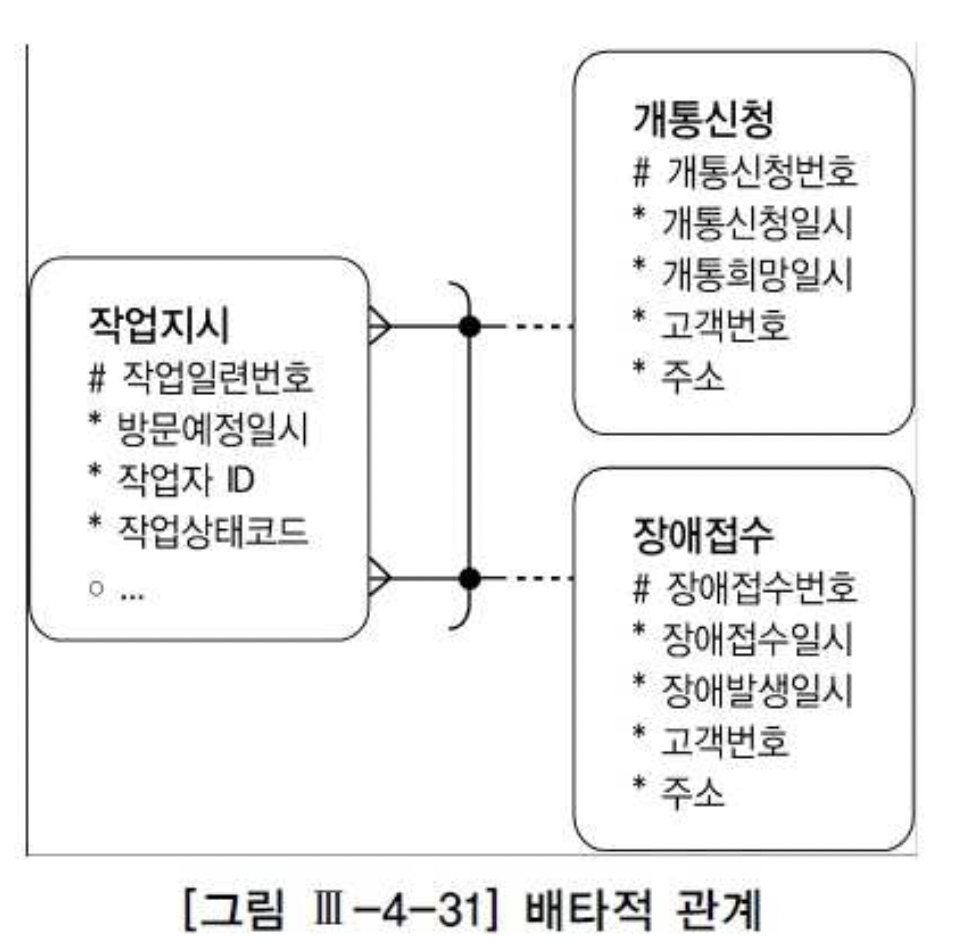
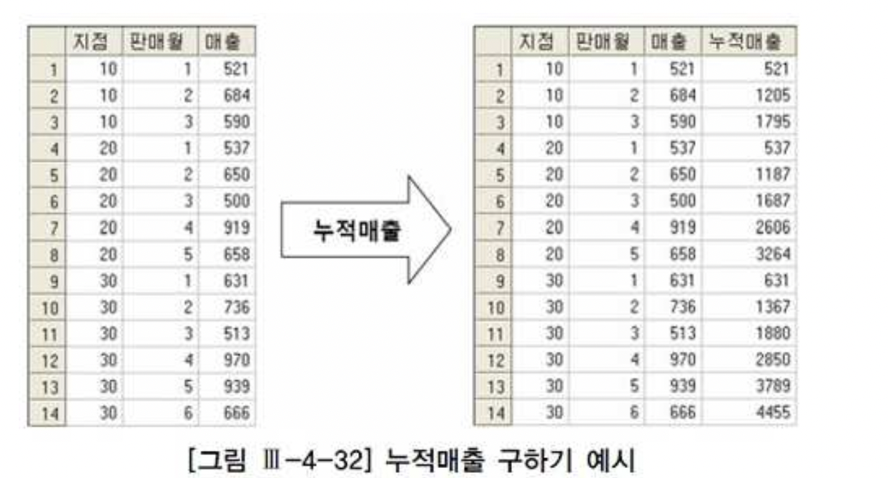
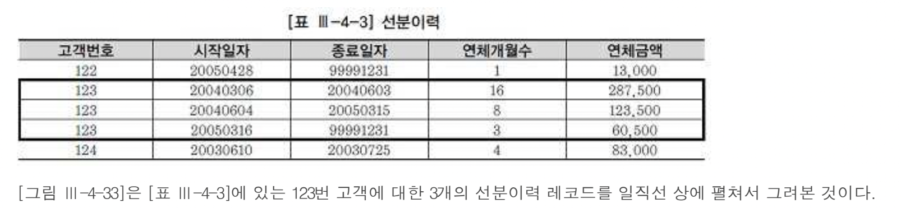
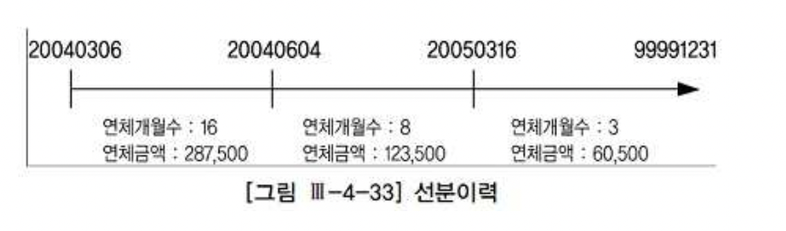
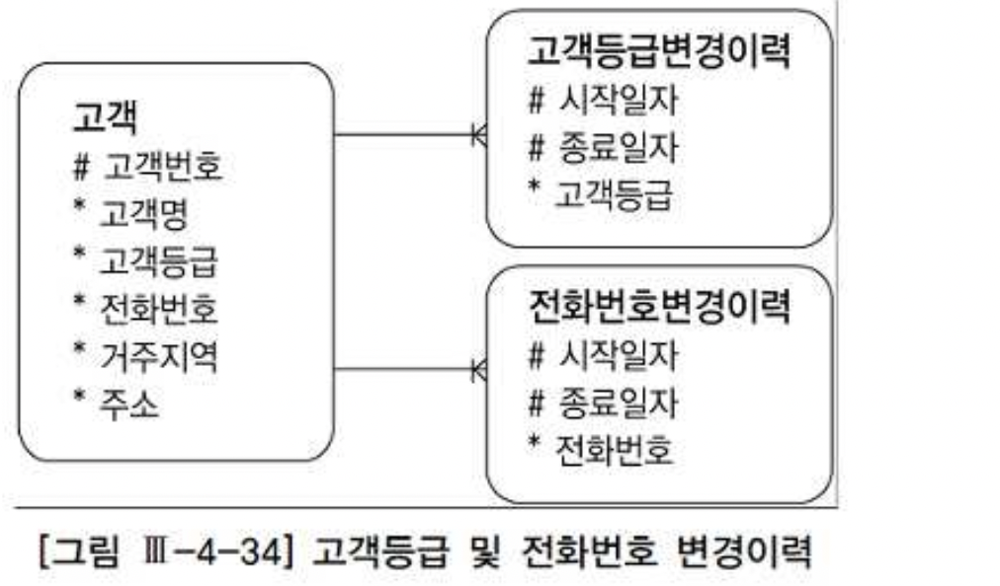
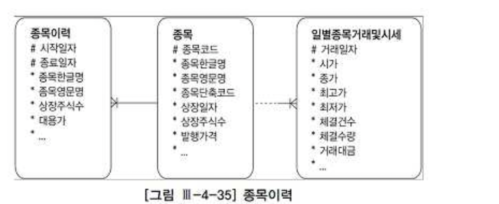
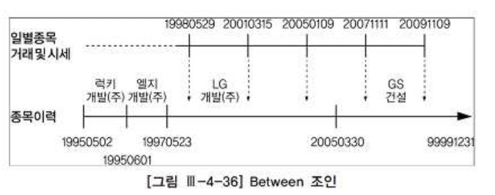
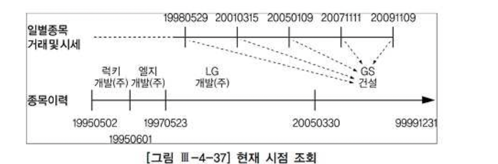
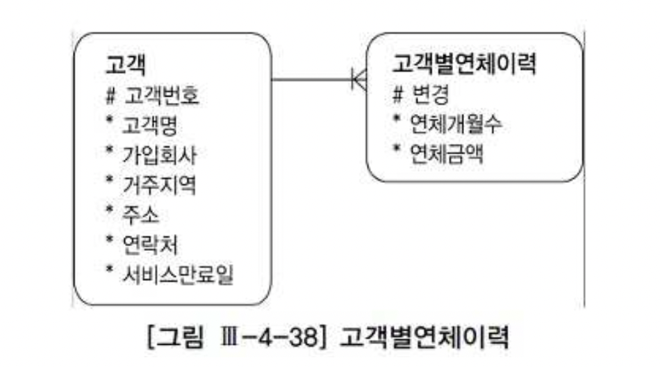

# 04. 고급조인기법


## 1) 인라인 뷰 활용

- 대부분 조인은 1:M 관계인 테이블끼리의 조인이고 조인 결과는 M쪽 집합과 같은 단위가 되는데,
- 이를 다시 1쪽 집합 단위로 그룹핑해야 한다면 M쪽 집합을 먼저 1쪽 단위로 그룹핑하고 나서 조인하는 것이 조인 횟수를 줄여주기 때문에 유리하다.
- 그런 처리를 위해 인라인 뷰를 사용할 수 있다. 2009년도 상품별 판매수량과 판매금액을 집계하는 아래 쿼리를 예로 들어보자.


###### 인라인 뷰 적용 전

```sql
SELECT min(t2.상품명) 상품명,
       sum(t1.판매수량) 판매수량,
       sum(t1.판매금액) 판매금액
  FROM 일별상품판매 t1,
       상품 t2
 WHERE t1.판매일자 BETWEEN '20090101' AND '20091231'
       AND t1.상품코드 = t2.상품코드
 GROUP BY t2.상품코드

Call      Count    CPU Time     Elapsed Time    Disk    Query    Current    Rows
----       ----     -------        ---------    ----     ----       ----    ----
Parse         1       0.000            0.000       0        0          0       0
Execute       1       0.000            0.000       0        0          0       0
Fetch       101       5.109           13.805   52744   782160          0    1000
----       ----     -------        ---------    ----     ----       ----    ----
Total       103       5.109           13.805   52744   782160          0    1000

  Rows Row Source Operation
 ----- ---------------------------------------------------
  1000 SORT GROUP BY (cr=782160 pr=52744 pw=0 time=13804391 us)
365000   NESTED LOOPS (cr=782160 pr=52744 pw=0 time=2734163731004 us)
365000     TABLE ACCESS FULL 일별상품판매 (cr=52158 pr=51800 pw=0 time=456175026878 us)
365000     TABLE ACCESS BY INDEX ROWID 상품 (cr=730002 pr=944 pw=0 time=872397482545 us)
365000       INDEX UNIQUE SCAN 상품_PK (cr=365002 pr=4 pw=0 time=416615350685 us)
```

- Row Source Operation을 분석해 보면, 일별상품판매 테이블로부터 읽힌 365,000개 레코드마다 상품 테이블과 조인을 시도했다.
- 조인 과정에서 730,002개의 블록 I/O가 발생했고, 총 소요시간은 13.8초다.
- 아래 처럼 상품코드별로 먼저 집계하고서 조인하도록 바꾸고 다시 수행해 보자.


###### 인라인 뷰 적용 후

```sql
SELECT t2.상품명,
       t1.판매수량,
       t1.판매금액
  FROM
       (SELECT 상품코드,
              sum(판매수량) 판매수량,
              sum(판매금액) 판매금액
         FROM 일별상품판매
        WHERE 판매일자 BETWEEN '20090101' AND '20091231'
        GROUP BY 상품코드
       ) t1,
       상품 t2
 WHERE t1.상품코드 = t2.상품코드

Call      Count    CPU Time     Elapsed Time    Disk    Query    Current    Rows
----       ----     -------        ---------    ----     ----       ----    ----
Parse         1       0.000            0.000       0        0          0       0
Execute       1       0.000            0.000       0        0          0       0
Fetch       101       1.422            5.540   51339    54259          0    1000
----       ----     -------        ---------    ----     ----       ----    ----
Total       103       1.422            5.540   51339    54259          0    1000

  Rows Row Source Operation
 ----- ---------------------------------------------------
  1000 NESTED LOOPS (cr=54259 pr=51339 pw=0 time=5540320 us)
  1000   VIEW (cr=52158 pr=51339 pw=0 time=5531294 us)
  1000   SORT GROUP BY (cr=52158 pr=51339 pw=0 time=5530293 us)
365000     TABLE ACCESS FULL 일별상품판매 (cr=52158 pr=51339 pw=0 time=2920041 us)
  1000   TABLE ACCESS BY INDEX ROWID 상품 (cr=2101 pr=0 pw=0 time=8337 us)
  1000     INDEX UNIQUE SCAN 상품_PK (cr=1101 pr=0 pw=0 time=3747 us)
```

- 상품코드별로 먼저 집계한 결과건수가 1,000건이므로 상품 테이블과 조인도 1,000번만 발생했다.
- 조인 과정에서 발생한 블록 I/O는 2,101개에 불과하고 수행시간도 5.5초 밖에 걸리지 않았다.


## 2) 배타적 관계의 조인

- 엔터티가 두 개 이상의 다른 엔터티의 합집합과 관계(Relationship)를 갖는 것을 '상호배타적(Exclusive OR) 관계'라고 한다.
- <그림 Ⅲ-4-31>에서 작업지시 테이블과 개통신청 및 장애접수 테이블과의 관계가 여기에 해당하며, 관계선에 표시된 아크(Arc)를 확인하기 바란다.


###### Exclusive OR

- 배타적 논리합
- Bool 연산자의 하나이며 2개의 피연산자 중 하나가 참이고 다른 하나가 거짓일 때에만 연산의 결과가 참이 된다.
- 'A XOR B'는 'A∀B' 등으로 표기하기도 한다.





###### 1. ERD 업무 설명

- 고객으로부터 개통이나 장애처리 요청을 받으면 작업기사에게 작업지시서를 발행
- 한 작업자에게만 작업지시를 내릴 때가 많지만, 작업 내용에 따라서는 여러 작업자가 필요할 수도 있다.
- 또한, 여러 작업자가 동시에 출동하는가 하면, 시간 간격을 두고 따로 출동하기도 한다.
- ERD에 다 표현하진 않았지만 개통신청과 장애접수는 관리하는 속성이 상당히 달라 별도의 테이블로 설계했다.
- 반면, 작업지시는 개통신청이든 장애접수든 거의 같은 속성을 관리하므로 한 테이블로 설계했다.
- 한 테이블로 통합하더라도 개통신청이나 장애접수 중 어느 것과 관계를 갖는지 구분할 수 있어야 한다.
- 그림 Ⅲ-4-31과 같은 데이터 모델을 실제 데이터베이스로 구현할 때, 작업지시 테이블에는 아래 두 가지 방법 중 하나를 사용한다.


- ① 개통신청번호, 장애접수번호 두 칼럼을 따로 두고, 레코드별로 둘 중 하나의 칼럼에만 값을 입력한다.
- ② 작업구분과 접수번호 칼럼을 두고, 작업구분이 '1'일 때는 개통신청번호를 입력하고 '2'일 때는 장애접수번호를 입력한다.

- ①번처럼 설계할 때는 아래와 같이 Outer 조인으로 간단하게 쿼리를 작성할 수 있다.


###### Oracle

```sql
SELECT
       /*+ ordered use_nl(b) use_nl(c) */
       a.작업일련번호,
       a.작업자ID,
       a.작업상태코드 ,
       nvl(b.고객번호, c.고객번호) 고객번호 ,
       nvl(b.주소, c.주소) 주소,
       ......
  FROM 작업지시 a,
       개통신청 b,
       장애접수 c
 WHERE a.방문예정일시 BETWEEN :방문예정일시1 AND :방문예정일시2
       AND b.개통신청번호(+) = a.개통신청번호
       AND c.장애접수번호(+) = a.장애접수번호
```


###### Oracle

```sql
SELECT x.작업일련번호,
       x.작업자ID,
       x.작업상태코드,
       y.고객번호,
       y.주소,
       ......
  FROM 작업지시 x, 개통신청 y
 WHERE x.방문예정일시 BETWEEN :방문예정일시1 AND :방문예정일시2
   AND x.작업구분 = '1'
   AND y.개통신청번호 = x.접수번호
UNION ALL
SELECT x.작업일련번호,
       x.작업자ID,
       x.작업상태코드,
       y.고객번호,
       y.주소,
       ......
  FROM 작업지시 x, 장애접수 y
 WHERE x.방문예정일시 BETWEEN :방문예정일시1 AND :방문예정일시2
   AND x.작업구분 = '2'
   AND y.장애접수번호 = x.접수번호
```

- <작업구분+방문예정일시> 결합 인덱스 이용 시 중복 읽는 범위는 없음.
- <방문예정일시+작업구분> 결합 인덱스 이용 시 인덱스 스캔 범위 중복 발생.
- <방문예정일시> 인덱스 이용 시 작업 구문을 필터링하기 위한 테이블 RANDOM ACCESS까지 중복 발생.

이럴 경우 아래와 같이 수정함으로써 중복 액세스에 의한 비효율 해소


###### Oracle

```sql
SELECT
       /*+ ordered use_nl(b) use_nl(c) */
       a.작업일련번호,
       a.작업자ID,
       a.작업상태코드 ,
       nvl(b.고객번호, c.고객번호) 고객번호 ,
       nvl(b.주소, c.주소) 주소,
       ......
  FROM 작업지시 a,
       개통신청 b,
       장애접수 c
 WHERE a.방문예정일시 BETWEEN :방문예정일시1 AND :방문예정일시2
   AND b.개통신청번호(+) = decode(a.작업구분, '1', a.접수번호)
   AND c.장애접수번호(+) = decode(a.작업구분, '2', a.접수번호)
```


## 3) 부등호 조인

- '=' 연산자 조인 외에 BETWEEN, LIKE, 부등호 같은 연산자로 조인 가능.
- 아래 형태의 테이블에서 우측과 같은 형태의 누적매출을 구해보자.
- 각 지점별로 판매월과 함께 증가하는 누적매출(running total)을 구하려는 것이다.





- 윈도우 함수(Oracle에서는 분석 함수(Analytic Function)라고 함)를 이용하면 아래와 같이 간단히 원하는 결과를 얻을 수 있다.

```sql
SELECT 지점,
       판매월,
       매출 ,
       sum(매출) over (partition BY 지점 ORDER BY 판매월 range 
                         BETWEEN unbounded preceding AND CURRENT ROW) 누적매출
  FROM 월별지점매출
```


- 윈도우 함수가 지원되지 않는 DBMS를 사용하고 있다면 아래와 같이 부등호 조인을 이용해 같은 결과를 얻을 수 있다

```sql
SELECT t1.지점, t1.판매월, min(t1.매출) 매출, sum(t2.매출) 누적매출
  FROM 월별지점매출 t1, 월별지점매출 t2
 WHERE t2.지점 = t1.지점
   AND t2.판매월 <= t1.판매월
 GROUP BY t1.지점, t1.판매월
ORDER BY t1.지점, t1.판매월;
```


## 4) Between 조인

##### 가. 선분이력이란?

- 고객별연체금액 변경이력을 관리할 때 이력의 시작시점만을 관리하는 것을 '점이력' 모델이라함.
- 시작시점과 종료시점을 함께 관리하는 것을 '선분이력' 모델이라고 함.
- 선분이력 모델에서 가장 마지막 이력의 종료일자는 항상 '99991231'(시간까지 관리할 때는 '99991231235959')로 입력해 두어야 함.





<그림 Ⅲ-4-33>은 <표 Ⅲ-4-3>에 있는 123번 고객에 대한 3개의 선분이력 레코드를 일직선 상에 펼쳐서 그려본 것이다.





- 이력을 선분형태로 관리하면 쿼리가 간단해지는 장점이 있음.
- EX)123번 고객의 2004년 8월 15일 시점 이력을 조회하고자 할 때 아래 처럼 between 조인을 이용해 간편하게 조회할 수 있다.

```sql
SELECT 고객번호, 
       연체금액, 
       연체개월수 
  FROM 고객별연체금액 
 WHERE 고객번호 = '123' 
       AND '20040815' BETWEEN b.시작일자 AND b.종료일자;
```


- 데이터를 점이력으로 관리할 때는 아래 처럼 서브쿼리를 이용해 복잡하게 쿼리를 해야한다.

```sql
SELECT 고객번호, 
       연체금액, 
       연체개월수 
  FROM 고객별연체금액 a 
 WHERE 고객번호 = '123' 
   AND 연체변경일자 = 
       (SELECT max(연체변경일자) 
          FROM 고객별연체금액 
          WHERE 고객번호 = a.고객번호 
            AND 변경일자 <= '20040815'
       ) ;
```

- 위와 같은 설계 시 PK를 일반적으로 <마스터 키 + 종료일자 + 시작일자> 순으로 결합 인덱스 구성
- 이 경우 이력을 변경 시마다 PK 값을 변경하여 RDBMS 설계 사상에 맞지 않음
- 개체 무결성을 완벽히 보장하기 어렵다는 것이 가장 큰 단점이다.


##### 나. 선분이력 기본 조회 패턴

- 기본적인 패턴으로 과거, 현재, 미래 임의 시점을 모두 조회할 수 있게 하려면 아래 처럼 쿼리를 작성하면 된다.

```sql
SELECT 연체개월수, 
       연체금액 
  FROM 고객별연체금액 
 WHERE 고객번호 = :cust_num 
   AND :dt BETWEEN 시작일자 AND 종료일자
```

- 현시점을 조회 시 '99991231' 상수 조건을 이용해 아래와 같이 '=' 조건으로 검색하는 것이 성능상 유리

```sql
SELECT 연체개월수, 
       연체금액 
  FROM 고객별연체금액 
 WHERE 고객번호 = :cust_num 
   AND 종료일자 = '99991231'
```


##### 다. 선분이력 조인

###### 1) 과거/현재/미래의 임의 시점 조회




- 고객과 두 선분이력 테이블을 조인해서 2004년8월 15일 시점 데이터를 조회할 때는 아래와 같이 쿼리하면 된다.
- 물론 :dt 변수에는 '20040815'(시작일자, 종료일자가 문자열 칼럼일 때)를 입력한다.

```sql
SELECT c.고객번호, 
       c.고객명, 
       c1.고객등급, 
       c2.전화번호 
  FROM 고객 c, 
       고객등급변경이력 c1, 
       전화번호변경이력 c2 
 WHERE c.고객번호 = :cust_num 
       AND c1.고객번호 = c.고객번호 
       AND c2.고객번호 = c.고객번호 
       AND :dt BETWEEN c1.시작일자 AND c1.종료일자 
       AND :dt BETWEEN c2.시작일자 AND c2.종료일자
```


###### 2) 현재 시점 조회

- 위 쿼리를 이용해 과거, 현재, 미래 어느 시점이든 조회할 수 있지만, 만약 미래 시점 데이터를 미리 입력하는 예약 기능이 없다면
- "현재 시점(즉, 현재 유효한 시점)" 조회는 아래와 같이 '=' 조건으로 만들어 주는 것이 효과적이다.

```sql
SELECT c.고객번호, 
       c.고객명, 
       c1.고객등급, 
       c2.전화번호 
  FROM 고객 c, 
       고객등급변경이력 c1, 
       전화번호변경이력 c2 
 WHERE c.고객번호 = :cust_num 
       AND c1.고객번호 = c.고객번호 
       AND c2.고객번호 = c.고객번호 
       AND c1.종료일자 = '99991231' 
       AND c2.종료일자 = '99991231'
```


- 미래 시점 데이터를 미리 입력하는 예약 기능이 있다면, 현재 시점을 조회할 때 아래와 같이 조회해야 한다.

```sql
SELECT c.고객번호, 
       c.고객명, 
       c1.고객등급, 
       c2.전화번호 
  FROM 고객 c, 
       고객등급변경이력 c1, 
       전화번호변경이력 c2 
 WHERE c.고객번호 = :cust_num 
       AND c1.고객번호 = c.고객번호 
       AND c2.고객번호 = c.고객번호 
       AND to_char(sysdate, 'yyyymmdd') BETWEEN c1.시작일자 AND c1.종료일자 
       AND to_char(sysdate, 'yyyymmdd') BETWEEN c2.시작일자 AND c2.종료일자
```


```
...... 
and convert(varchar(8), getdate(), 112) between c1.시작일자 and c1.종료일자 
and convert(varchar(8), getdate(), 112) between c2.시작일자 and c2.종료일자 
```


##### 라. Between 조인

- 지금까지는 선분이력 조회 시점이 정해져 있었다. 그림 Ⅲ-4-35에서 만약 우측(일별종목거래및시세)과 같은
- 일별 거래 테이블로부터 읽히는 미지의 거래일자 시점으로 선분이력(종목이력)을 조회할 때는 between 조인을 이용한다.





- 아래는 주식시장에서 과거 20년 동안 당일 최고가로 장을 마친(종가=최고가) 종목을 조회하는 쿼리다.
- <그림 Ⅲ-4-35>의 일별종목거래및시세 테이블로부터 시가, 종가, 거래 데이터를 읽고 그 당시 종목명과 상장주식수는 종목이력으로부터 가져오는데,
- 조인 연산자가 '='이 아니라 between이라는 점이 특징적이다.


```sql
SELECT a.거래일자, a.종목코드, b.종목한글명, b.종목영문명, b.상장주식수 , 
       a.시가, a.종가, a.체결건수, a.체결수량, a.거래대금 
  FROM 일별종목거래및시세 a, 
       종목이력 b 
 WHERE a.거래일자 BETWEEN to_char(add_months(sysdate, -20*12), 'yyyymmdd') AND to_char(sysdate-1, 'yyyymmdd') 
   AND a.종가 = a.최고가 
   AND b.종목코드 = a.종목코드 
   AND a.거래일자 BETWEEN b.시작일자 AND b.종료일자 
```


- 이런 식으로 조회하면 현재(=최종) 시점의 종목명을 가져오는 것이 아니라
- <그림 Ⅲ-4-36>에서 보는 것처럼 거래가 일어난 바로 그 시점의 종목명을 읽게 된다.





- 거래 시점이 아니라 현재(=최종) 시점의 종목명과 상장주식수를 출력하려면 between 조인 대신 아래와 같이 상수 조건으로 입력해야 한다.(<그림 Ⅲ-4-37> 참조)

```sql
SELECT a.거래일자, a.종목코드, b.종목한글명, b.종목영문명, b.상장주식수 , 
       a.시가, a.종가, a.체결건수, a.체결수량, a.거래대금 
  FROM 일별종목거래및시세 a, 
       종목이력 b 
 WHERE a.거래일자 BETWEEN to_char(add_months(sysdate, -20*12), 'yyyymmdd') AND to_char(sysdate-1, 'yyyymmdd') 
   AND a.종가 = a.최고가 
   AND b.종목코드 = a.종목코드 
   AND to_char(sysdate, 'yyyymmdd') BETWEEN b.시작일자 AND b.종료일자  
```




- 위 쿼리는 종목 테이블을 종목이력과 통합해 하나로 설계했을 때 사용하는 방식이며 그림 Ⅲ-4-35처럼 종목과 종목이력을
- 따로 설계했을 때는 최종 시점을 위해 종목 테이블과 조인하면 된다.


## 5) ROWID 활용

- 선분이력과 대비해, 데이터 변경이 발생할 때마다 변경일자와 함께 새로운 이력 레코드를 쌓는 방식을 '점이력'이라고 한다.





- 이력 모델에선 일반적으로 서브쿼리를 이용해 찾고자 하는 시점(서비스만료일)보다 앞선 변경일자 중
- 가장 마지막 레코드를 찾기 위해 아래와 같이 조회한다.

```sql
SELECT a.고객명,
       a.거주지역,
       a.주소,
       a.연락처,
       b.연체금액,
       b.연체개월수
  FROM 고객 a,
       고객별연체이력 b
 WHERE a.가입회사 = 'C70'
       AND b.고객번호 = a.고객번호
       AND b.변경일자 =
       (SELECT max(변경일자)
         FROM 고객별연체이력
        WHERE 고객번호 = a.고객번호
              AND 변경일자 <= a.서비스만료일
       )

Execution Plan
-------------------------------------------------------------
 0   SELECT STATEMENT Optimizer=CHOOSE (Cost=845 Card=10 Bytes=600)
 1 0  TABLE ACCESS (BY INDEX ROWID) OF '고객별연체이력' (Cost=2 Card=1 Bytes=19)
 2 1   NESTED LOOPS (Cost=845 Card=10 Bytes=600)
 3 2    TABLE ACCESS (BY INDEX ROWID) OF '고객' (Cost=825 Card=10 Bytes=410)
 4 3     INDEX (RANGE SCAN) OF '고객_IDX01' (NON-UNIQUE) (Cost=25 Card=10)
 5 2    INDEX (RANGE SCAN) OF '고객별연체이력_IDX01' (NON-UNIQUE) (Cost=1 Card=1)
 6 5     SORT (AGGREGATE) (Card=1 Bytes=13)
 7 6      FIRST ROW (Cost=2 Card=5K Bytes=63K)
 8 7       INDEX (RANGE SCAN (MIN/MAX)) OF '고객별연체이력_IDX01' (NON-UNIQUE) (... )
```


- 고객별연체이력 테이블 두 번 액세스
- 서브쿼리 내에서 서비스만료일보다 작은 레코드를 모두 스캔하지 않고 인덱스를 거꾸로 스캔하면서 가장 큰 값 하나만을 찾는 실행계획 수립
- 한 블록이라도 액세스를 줄여야 하는 상황이라면 ROWID를 이용해 아래와 같이 튜닝할 수 있다.


```sql
SELECT 
       /*+ ordered use_nl(b) rowid(b) */ 
       a.고객명, 
       a.거주지역, 
       a.주소, 
       a.연락처, 
       b.연체금액, 
       b.연체개월수 
  FROM 고객 a, 고객별연체이력 b 
 WHERE a.가입회사 = 'C70' 
   AND b.rowid = 
       (SELECT 
              /*+ index_desc(c 고객별연체이력_idx01) */ 
              rowid 
         FROM 고객별연체이력 c 
        WHERE c.고객번호 = a.고객번호 
              AND c.변경일자 <= a.서비스만료일 
              AND ROWNUM <= 1
       )

Execution Plan 
------------------------------------------------------------- 
0   SELECT STATEMENT Optimizer=CHOOSE (Cost=835 Card=100K Bytes=5M) 
1 0  NESTED LOOPS (Cost=835 Card=100K Bytes=5M) 
2 1   TABLE ACCESS (BY INDEX ROWID) OF '고객' (Cost=825 Card=10 Bytes=410) 
3 2    INDEX (RANGE SCAN) OF '고객_IDX01' (NON-UNIQUE) (Cost=25 Card=10) 
4 1   TABLE ACCESS (BY USER ROWID) OF '고객별연체이력' (Cost=1 Card=10K Bytes=137K) 
5 4    COUNT (STOPKEY) 
6 5     INDEX (RANGE SCAN DESCENDING) OF '고객별연체이력_IDX01' (NON-UNIQUE) (Cost=2 Card=5K... ) 
```

- 고객(a)에서 읽은 고객번호로 서브쿼리 쪽 고객별연체이력©과 조인하여 얻은 rowid 값으로 고객별연체이력(b) 액세스
- 고객별연체이력을 두 번 참조했지만, 실행계획 상에는 한 번만 조인한 것과 일량이 같다.
- 일반적인 NL Join과 같은 프로세스(Outer 인덱스 → Outer 테이블 → Inner 인덱스 → Inner 테이블)로 진행되는 것에 주목하기 바란다.
- 위 쿼리가 제대로 작동하려면 고객별연체이력_idx01 인덱스가 반드시 `고객번호 + 변경일자`  순으로 구성돼 있어야 하며 인덱스 구성이 변경되면 쿼리 결과가 틀려진다.
- first row(min/max) 알고리즘이 작동한다면 일반적으로 그것만으로도 충분한 성능을 내므로 굳이 위와 같은 기법을 적용하지 않는 것이 좋다.
- SQL Server는 Oracle처럼 사용자가 직접 ROWID를 이용해 테이블을 액세스(Table Access By User Rowid)하는 방식을 지원하지 않는다.
