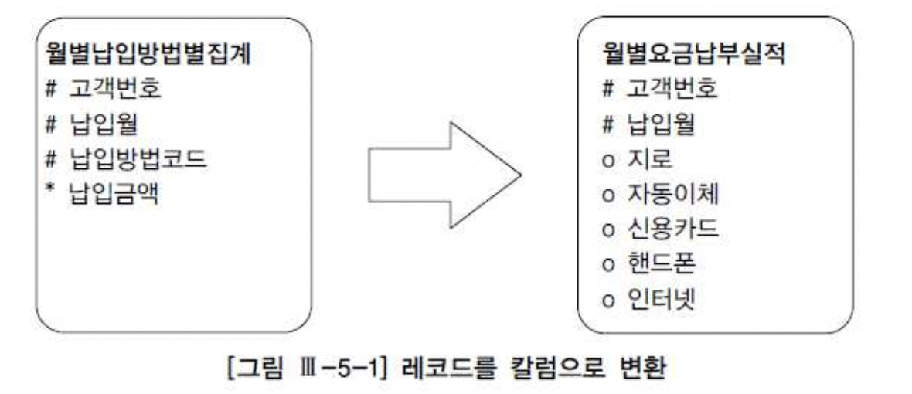
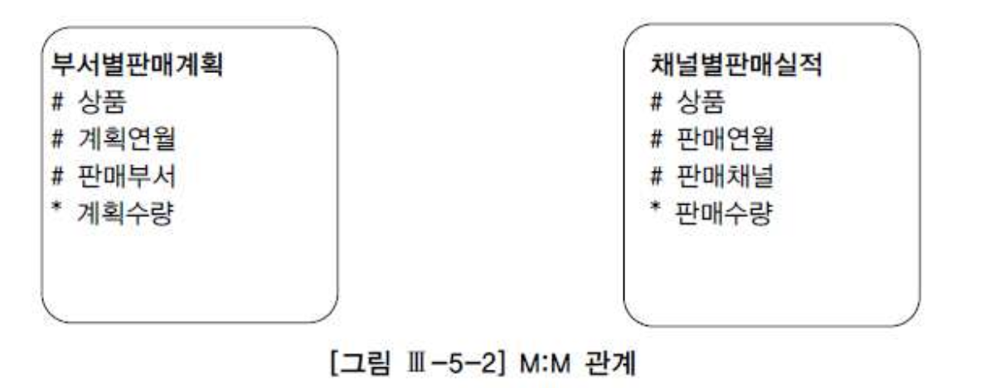
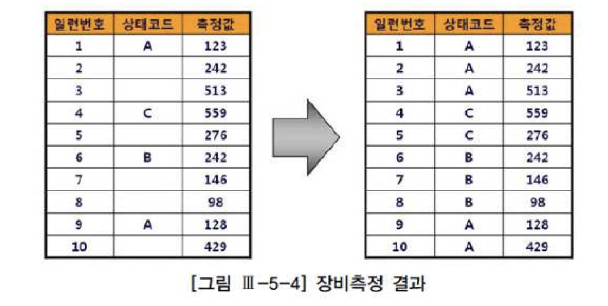

# 01. 고급SQL활용


##  1) CASE문 활용




```sql
-- 비효율적으로 작성된 SQL

INSERT INTO 월별요금납부실적
(고객번호, 납입월, 지로, 자동이체, 신용카드, 핸드폰, 인터넷)
SELECT K.고객번호
     , '200903' 납입월
     , A.납입금액 지로
     , B.납입금액 자동이체
     , C.납입금액 신용카드
     , D.납입금액 핸드폰
     , E.납입금액 인터넷
FROM   고객 K
     ,(SELECT 고객번호, 납입금액
       FROM   월별납입방법별집계
       WHERE  납입원 = '200903'
       AND    납입방법코드 = 'A') A
     ,(SELECT 고객번호, 납입금액
       FROM   월별납입방법별집계
       WHERE  납입원 = '200903'
       AND    납입방법코드 = 'B') B
     ,(SELECT 고객번호, 납입금액
       FROM   월별납입방법별집계
       WHERE  납입원 = '200903'
       AND    납입방법코드 = 'C') C
     ,(SELECT 고객번호, 납입금액
       FROM   월별납입방법별집계
       WHERE  납입원 = '200903'
       AND    납입방법코드 = 'D') D
     ,(SELECT 고객번호, 납입금액
       FROM   월별납입방법별집계
       WHERE  납입원 = '200903'
       AND    납입방법코드 = 'E') E
WHERE  A.고객번호(+) = K.고객번호
AND    B.고객번호(+) = K.고객번호
AND    C.고객번호(+) = K.고객번호
AND    D.고객번호(+) = K.고객번호
AND    E.고객번호(+) = K.고객번호
AND    NVL(A.납입금액,0) + NVL(B.납입금액,0) + NVL(C.납입금액,0) + NVL(D.납입금액,0) + NVL(E.납입금액,0) > 0

-- 효율적으로 작성된 SQL

INSERT INTO 월별요금납부실적
(고객번호, 납입월, 지로, 자동이체, 신용카드, 핸드폰, 인터넷)
SELECT K.고객번호
     , 납입월
     , NVL(SUM(CASE WHEN 납입방법코드 = 'A' THEN 납입금액 END), 0) 지로
     , NVL(SUM(CASE WHEN 납입방법코드 = 'B' THEN 납입금액 END), 0) 자동이체
     , NVL(SUM(CASE WHEN 납입방법코드 = 'C' THEN 납입금액 END), 0) 신용카드
     , NVL(SUM(CASE WHEN 납입방법코드 = 'D' THEN 납입금액 END), 0) 핸드폰
     , NVL(SUM(CASE WHEN 납입방법코드 = 'E' THEN 납입금액 END), 0) 인터넷
FROM   월별납입방법별집계
WHERE  납입월 = '200903'
GROUP BY 고객번호, 납입월;
```

- SQL Server 2005 버전, Oracle 11g 부터 Pivot 구문 지원
- 하지만 위와 같이 case문이나 decode 함수를 활용하는 기법은 One-SQL 로 구현하는데 반드시 필요하므로 숙지할 필요가 있음.


## 2) 데이터 복제 기법 활용

- 전통적인 방식은 복제용 테이블(copy_t)을 미리 만들어두고 활용하는 것임.

```sql
create table copy_t ( no number, no2 varchar2(2) ) ;

select * from emp a, copy_t b
where b.no <= 2;
```


- Oracle 9i 부터는 dual 테이블을 사용하면 됨.

```sql
-- emp 테이블을 2배로 복제
select * from emp a, (select rownum no from dual connect by level <= 2) b;
```


**카드상품분류와 고객등급 기준으로 거래실적을 집계하면서 소계까지 한번에 구하는 쿼리**

```sql
select a.카드상품분류
     ,(case when b.no = 1 then a.고객등급 else '소계' end) as 고객등급
     , sum(a.거래금액) as 거래금액
from  (select 카드.카드상품분류 as 카드상품분류
            , 고객.고객등급 as 고객등급
            , sum(거래금액) as 거래금액
       from   카드월실적
            , 카드
            , 고객
       where  실적년월 = '201008'
       and    카드.카드번호 = 카드월실적.카드번호
       and    고객,고객번호 = 카드.고객번호
       group by 카드.카드상품분류, 고객.고객등급) a
     , copy_t b
where  b.no <= 2
group by a.카드상품분류, b.no, (case when b.no = 1 then a.고객등급 else '소계' end)
```


- group by 카드.카드상품분류, 고객.고객등급

| 카드상품분류 | 고객등급 | 거래금액  |
| :----------- | :------- | :-------- |
| 상품분류A    | VIP      | 500000000 |
| 상품분류A    | 일반     | 300000000 |
| 상품분류B    | VIP      | 100000000 |
| 상품분류B    | 일반     | 50000000  |


- copy_t 테이블을 이용하여 복제

| 카드상품분류 | 고객등급 | 거래금액  | b.no |
| :----------- | :------- | :-------- | :--- |
| 상품분류A    | VIP      | 500000000 | 1    |
| 상품분류A    | 일반     | 300000000 | 1    |
| 상품분류B    | VIP      | 100000000 | 1    |
| 상품분류B    | 일반     | 50000000  | 1    |
| 상품분류A    | VIP      | 500000000 | 2    |
| 상품분류A    | 일반     | 300000000 | 2    |
| 상품분류B    | VIP      | 100000000 | 2    |
| 상품분류B    | 일반     | 50000000  | 2    |


- group by a.카드상품분류, b.no, (case when b.no = 1 then a.고객등급 else '소계' end)

| 카드상품분류 | 고객등급 | 거래금액  |
| :----------- | :------- | :-------- |
| 상품분류A    | VIP      | 500000000 |
| 상품분류A    | 일반     | 300000000 |
| 상품분류A    | 소계     | 800000000 |
| 상품분류B    | VIP      | 100000000 |
| 상품분류B    | 일반     | 50000000  |
| 상품분류B    | 소계     | 150000000 |


## 3) Union All을 활용한 M:M 관계의 조인

- M:M 관계의 조인을 해결하거나 Full Outer Join을 대체하는 용도로 Union All을 활용할 수 있다.

- 월별로 각 상품의 계획 대비 판매 실적을 집계하려고 함.
- 상품과 연월을 기준으로 볼 때 두 테이블은 M:M 관계이므로 조인하면 카티션 곱(Cartesian Product)이 발생함.





```sql
-- 상품, 연월 기준으로 group by를 먼저 수행하고 나면 두 집합은 1:1 관계가 되므로 
-- Full Outer Join을 통해 원하는 결과집합을 얻을 수 있음.

select nvl(a.상품, b.상품) as 상품
     , nvl(a.계획연월, b.판매연월) as 연월
     , nvl(계획수량, 0) 계획수량
     , nvl(판매수량, 0) 판매수량
from  (select 상품
            , 계획연월
            , sum(계획수량) 계획수량
       from   부서별판매계획
       where  계획연월 between '200901' and '200903'
       group by 상품, 계획연월 ) a
       full outer join
      (select 상품
            , 판매연월
            , sum(판매수량) 판매수량
       from   채널별판매실적
       where  판매연월 between '200901' and '200903'
       group by 상품, 판매연월 ) b
       on     a.상품 = b.상품
       and    a.계획연월 = b.판매연월
       
-- DBMS와 버전에 따라 Full Outer Join 시 테이블이 반복 액세스 되는 비효율이 있기도 함.

drop table dept_sell_plan;
create table dept_sell_plan(prod varchar2(1), yyyymm varchar2(6), dept varchar2(2), amt number);

insert into dept_sell_plan values('A', '200901', 'A1', 100);
insert into dept_sell_plan values('A', '200902', 'A1', 120);
insert into dept_sell_plan values('A', '200903', 'A1', 150);
insert into dept_sell_plan values('A', '200901', 'B1', 200);
insert into dept_sell_plan values('A', '200902', 'B1', 300);
insert into dept_sell_plan values('B', '200901', 'A1', 400);
insert into dept_sell_plan values('B', '200901', 'B1', 500);
insert into dept_sell_plan values('B', '200902', 'B1', 600);
insert into dept_sell_plan values('C', '200901', 'C1', 800);
insert into dept_sell_plan values('C', '200902', 'C1', 900);

--create unique index dept_idx1 on dept_sell_plan(prod, yyyymm, dept);

drop table channel_sell;
create table channel_sell(prod varchar2(1), yyyymm varchar2(6), channel varchar2(2), amt number);

insert into channel_sell values('A', '200901', 'AA', 200);
insert into channel_sell values('A', '200902', 'AA', 150);
insert into channel_sell values('A', '200901', 'BB', 500);
insert into channel_sell values('B', '200901', 'BB', 300);
insert into channel_sell values('B', '200902', 'BB', 200);
insert into channel_sell values('B', '200903', 'BB', 100);
insert into channel_sell values('C', '200901', 'CC', 400);
insert into channel_sell values('C', '200902', 'CC', 500);
insert into channel_sell values('C', '200903', 'CC', 600);

--create unique index channel_idx1 on channel_sell(prod, yyyymm, channel);

select nvl(a.prod, b.prod) as prod
     , nvl(a.yyyymm, b.yyyymm) as yyyymm
     , nvl(a.amt, 0) plan_amt
     , nvl(b.amt, 0) amt
from  (select prod
            , yyyymm
            , sum(amt) amt
       from   dept_sell_plan
       where  yyyymm between '200901' and '200903'
       group by prod, yyyymm ) a
       full outer join
      (select prod
            , yyyymm
            , sum(amt) amt
       from   channel_sell
       where  yyyymm between '200901' and '200903'
       group by prod, yyyymm ) b
       on     a.prod = b.prod
       and    a.yyyymm = b.yyyymm
order by prod, yyyymm       
;

-- 11g부터 _optimizer_native_full_outer_join = FORCE 로 설정되어 있으므로 Union All과 Anti Join이 사라짐.

-----------------------------------------------------------------------------------------
| Id  | Operation              | Name           | Rows  | Bytes | Cost (%CPU)| Time     |
-----------------------------------------------------------------------------------------
|   0 | SELECT STATEMENT       |                |    10 |   400 |    10  (40)| 00:00:01 |
|   1 |  SORT ORDER BY         |                |    10 |   400 |    10  (40)| 00:00:01 |
|   2 |   VIEW                 | VW_FOJ_0       |    10 |   400 |     9  (34)| 00:00:01 |
|*  3 |    HASH JOIN FULL OUTER|                |    10 |   400 |     9  (34)| 00:00:01 |
|   4 |     VIEW               |                |     9 |   180 |     4  (25)| 00:00:01 |
|   5 |      HASH GROUP BY     |                |     9 |   180 |     4  (25)| 00:00:01 |
|*  6 |       TABLE ACCESS FULL| CHANNEL_SELL   |     9 |   180 |     3   (0)| 00:00:01 |
|   7 |     VIEW               |                |    10 |   200 |     4  (25)| 00:00:01 |
|   8 |      HASH GROUP BY     |                |    10 |   200 |     4  (25)| 00:00:01 |
|*  9 |       TABLE ACCESS FULL| DEPT_SELL_PLAN |    10 |   200 |     3   (0)| 00:00:01 |
-----------------------------------------------------------------------------------------

Predicate Information (identified by operation id):
---------------------------------------------------

   3 - access("A"."PROD"="B"."PROD" AND "A"."YYYYMM"="B"."YYYYMM")
   6 - filter("YYYYMM">='200901' AND "YYYYMM"<='200903')
   9 - filter("YYYYMM">='200901' AND "YYYYMM"<='200903')

-- no_native_full_outer_join 사용   
   
------------------------------------------------------------------------------------------
| Id  | Operation               | Name           | Rows  | Bytes | Cost (%CPU)| Time     |
------------------------------------------------------------------------------------------
|   0 | SELECT STATEMENT        |                |     8 |   320 |    17  (30)| 00:00:01 |
|   1 |  SORT ORDER BY          |                |     8 |   320 |    17  (30)| 00:00:01 |
|   2 |   VIEW                  |                |     8 |   320 |    16  (25)| 00:00:01 |
|   3 |    UNION-ALL            |                |       |       |            |          |
|*  4 |     HASH JOIN OUTER     |                |     7 |   280 |     9  (34)| 00:00:01 |
|   5 |      VIEW               |                |     7 |   140 |     4  (25)| 00:00:01 |
|   6 |       HASH GROUP BY     |                |     7 |    91 |     4  (25)| 00:00:01 |
|*  7 |        TABLE ACCESS FULL| DEPT_SELL_PLAN |    10 |   130 |     3   (0)| 00:00:01 |
|   8 |      VIEW               |                |     1 |    20 |     4  (25)| 00:00:01 |
|   9 |       HASH GROUP BY     |                |     1 |    20 |     4  (25)| 00:00:01 |
|* 10 |        TABLE ACCESS FULL| CHANNEL_SELL   |     1 |    20 |     3   (0)| 00:00:01 |
|  11 |     HASH GROUP BY       |                |     1 |    29 |     8  (25)| 00:00:01 |
|* 12 |      HASH JOIN ANTI     |                |     1 |    29 |     7  (15)| 00:00:01 |
|* 13 |       TABLE ACCESS FULL | CHANNEL_SELL   |     1 |    20 |     3   (0)| 00:00:01 |
|* 14 |       TABLE ACCESS FULL | DEPT_SELL_PLAN |    10 |    90 |     3   (0)| 00:00:01 |
------------------------------------------------------------------------------------------

Predicate Information (identified by operation id):
---------------------------------------------------

   4 - access("A"."YYYYMM"="B"."YYYYMM"(+) AND "A"."PROD"="B"."PROD"(+))
   7 - filter("YYYYMM">='200901' AND "YYYYMM"<='200903')
  10 - filter("YYYYMM">='200901' AND "YYYYMM"<='200903')
  12 - access("PROD"="PROD" AND "YYYYMM"="YYYYMM")
  13 - filter("YYYYMM">='200901' AND "YYYYMM"<='200903')
  14 - filter("YYYYMM">='200901' AND "YYYYMM"<='200903')

31 개의 행이 선택되었습니다.
```


- 부서별판매계획 테이블과 채널별판매실적 테이블을 이어서 출력

| 구분 | 상품  | 연월   | 판매부서 | 판매채널 | 계획수량 | 실적수량 |
| :--- | :---- | :----- | :------- | :------- | :------- | :------- |
| 계획 | 상품A | 200901 | 10       |          | 10000    |          |
| 계획 | 상품A | 200901 | 20       |          | 5000     |          |
| 계획 | 상품A | 200901 | 10       |          | 20000    |          |
| 계획 | 상품B | 200901 | 10       |          | 20000    |          |
| 계획 | 상품B | 200902 | 30       |          | 15000    |          |
| 계획 | 상품C | 200901 | 30       |          | 15000    |          |
| 계획 | 상품C | 200903 | 20       |          | 20000    |          |
| 실적 | 상품A | 200901 |          | 대리점   |          | 7000     |
| 실적 | 상품A | 200903 |          | 온라인   |          | 8000     |
| 실적 | 상품B | 200902 |          | 온라인   |          | 12000    |
| 실적 | 상품B | 200903 |          | 위탁     |          | 19000    |
| 실적 | 상품C | 200901 |          | 대리점   |          | 13000    |
| 실적 | 상품C | 200902 |          | 위탁     |          | 18000    |


```sql
-- 상품, 연월 기준으로 group by 하면서 계획수량과 실적수량을 집계
select 상품, 연월, nvl(sum(계획수량), 0) as 계획수량, nvl(sum(실적수량), 0) as 실적수량
from  (select 상품
             , 계획연월 as 연월
             , 계획수량
             , to_number(null) as 실적수량
       from    부서별판매계획
       where   계획연월 between '200901' and '200903'
       union all
       select  상품
             , 판매연월 as 연월
             , to_number(null) as 계획수량
             , 판매수량
       from    채널별판매실적
       where   판매연월 between '200901' and '200903'
       ) a
group by 상품, 연월;
```


| 상품  | 연월   | 계획수량 | 판매수량 |
| :---- | :----- | :------- | :------- |
| 상품A | 200901 | 10000    | 7000     |
| 상품A | 200901 | 5000     | 0        |
| 상품A | 200901 | 20000    | 8000     |
| 상품B | 200901 | 20000    | 0        |
| 상품B | 200902 | 15000    | 12000    |
| 상품B | 200903 | 0        | 19000    |
| 상품C | 200901 | 15000    | 13000    |
| 상품C | 200902 | 0        | 18000    |
| 상품C | 200903 | 20000    | 0        |


## 4) 페이징 처리

- 효과적인 페이징 처리 방법을 살펴봄.


#### 가. 일반적인 페이징 처리용 SQL

```sql
-- 관심 종목에 대해 사용자가 입력한 거래일시 이후 거래 데이터를 페이징 처리 방식으로 조회

SELECT *
FROM  (SELECT ROWNUM NO
            , 거래일시
            , 체결건수
            , 체결수량
            , 거래대금
            , COUNT(*) OVER () CNT ------------------------- (1)
       FROM  (SELECT 거래일시
                   , 체결건수
                   , 체결수량
                   , 거래대금
              FROM   시간별종목거래
              WHERE  종목코드 = :isu_cd     -- 사용자가 입력한 종목코드
              AND    거래일시 >= :trd_time  -- 사용자가 입력한 거래일자 또는 거래일시
              ORDER BY 거래일시 ---------------------------- (2)
              )
       WHERE  ROWNUM <= :page * :pgsize + 1 ---------------- (3)
       )
WHERE NO BETWEEN (:page - 1) * :pgsize + 1 AND :pgsize * :page
```


- :pgsize : Fetch해 올 데이터 건수
- :page : 출력하고자 하는 페이지 번호

- (1) '다음' 페이지에 읽을 데이터가 더 있는지 확인하는 용도
  - CNT > :pgsize * :page => '다음' 페이지에 출력할 데이터가 더 있음.
  - 필요하지 않으면 (3)번 라인에서 +1을 제거하면 됨.

- (2) [종목코드 + 거래일시] 인덱스가 있으면 Sort 오퍼레이션 생략됨.
  - 없더라도 TOP-N 쿼리 알고리즘 작동으로 SORT 부하 최소화 할 수 있음.

- (3) :page = 10, :pgsize = 3 일 때, 거래일시 순으로 31건만 읽음.

- (4) :page = 10, :pgsize = 3 일 때, 읽은 31건 중 21~30번째 데이터 즉, 3 페이지만 리턴함.

- 첫 페이지만큼은 가장 최적의 수행 속도를 보임.
- 대부분 업무에서 앞쪽 일부만 조회하므로 표준적인 페이징 처리 구현 패턴에 가장 적당함.


#### 나. 뒤쪽 페이지까지 자주 조회할 때

- 뒤쪽의 어떤 페이지로 이동하더라도 빠르게 조회되도록 구현하기 위해서는, 해당 페이지 레코드로 바로 찾아가도록 구현해야 됨.

```sql
-- 다음 버튼 클릭시

SELECT 거래일시
     , 체결건수
     , 체결수량
     , 거래대금
FROM  (SELECT 거래일시
            , 체결건수
            , 체결수량
            , 거래대금
       FROM   시간별종목거래 A
       WHERE  :페이지이동 = 'NEXT'
       AND    종목코드 = :isu_cd
       AND    거래일시 >= :trd_time
       ORDER BY 거래일시
       )
WHERE  ROWNUM <= 11
```


- :trd_time : 사용자가 입력한 거래일자 또는 거래일시 '다음' 버튼 눌렀을 때는 '이전' 페이지의 마지막 거래일시를 입력함.

```sql
-- 이전 버튼 클릭시

SELECT 거래일시
     , 체결건수
     , 체결수량
     , 거래대금
FROM  (SELECT 거래일시
            , 체결건수
            , 체결수량
            , 거래대금
       FROM   시간별종목거래 A
       WHERE  :페이지이동 = 'PREV'
       AND    종목코드 = :isu_cd
       AND    거래일시 <= :trd_time
       ORDER BY 거래일시 DESC
       )
WHERE  ROWNUM <= 11
ORDER BY 거래일시  ------------- (1)
```


(1) 11건에 대해서만 소트 연산 수행함.

- SQL Server 에선 Top N 구문 이용함.

```sql
-- 다음 버튼 클릭시
SELECT TOP 11
       거래일시
     , 체결건수
     , 체결수량
     , 거래대금
FROM   시간별종목거래 A
WHERE  :페이지이동 = 'NEXT'
AND    종목코드 = :isu_cd
AND    거래일시 >= :trd_time
ORDER BY 거래일시;

-- 이전 버튼 클릭시
SELECT 거래일시
     , 체결건수
     , 체결수량
     , 거래대금
FROM  (SELECT TOP 11
              거래일시
            , 체결건수
            , 체결수량
            , 거래대금
       FROM   시간별종목거래 A
       WHERE  :페이지이동 = 'PREV'
       AND    종목코드 = :isu_cd
       AND    거래일시 <= :trd_time
       ORDER BY 거래일시 DESC
       )
ORDER BY 거래일시
```


#### 다. Union All 활용

- 위의 두 쿼리를 합쳐서 하나의 SQL로 처리하는 것도 가능함.

```sql
SELECT 거래일시
     , 체결건수
     , 체결수량
     , 거래대금
FROM  (SELECT 거래일시
            , 체결건수
            , 체결수량
            , 거래대금
       FROM   시간별종목거래 A
       WHERE  :페이지이동 = 'NEXT'
       AND    종목코드 = :isu_cd
       AND    거래일시 >= :trd_time
       ORDER BY 거래일시
       )
WHERE  ROWNUM <= 11
UNION ALL
SELECT 거래일시
     , 체결건수
     , 체결수량
     , 거래대금
FROM  (SELECT 거래일시
            , 체결건수
            , 체결수량
            , 거래대금
       FROM   시간별종목거래 A
       WHERE  :페이지이동 = 'PREV'
       AND    종목코드 = :isu_cd
       AND    거래일시 <= :trd_time
       ORDER BY 거래일시 DESC
       )
WHERE  ROWNUM <= 11
ORDER BY 거래일시
```


## 5) 윈도우 함수 활용




- 장비측정 결과를 저장.
  - 일련번호를 1씩 증가시키면서 측정값을 입력하고, 상태코드는 장비상태가 바뀔 때만 저장됨.
  - 조회시 상태코드가 NULL이면 가장 최근에 상태코드가 바뀐 레코드 값을 보여주려고 함.


```sql
select 일련번호
     , 측정값
     ,(select max(상태코드)
       from   장비측정
       where  일련번호 <= o.일련번호
       and    상태코드 is not null) 상태코드
from   장비측정 o
order by 일련번호
```

- 위 쿼리로는 결과값이 제대로 나오지 않음. 6행에서부터 상태코드가 'C' 값으로 나옴.
- [일련번호 + 상태코드]로 구성된 인덱스가 있으면 빠르게 수행될 수 있음.


```sql
select 일련번호
     , 측정값
     ,(select /*+ index_desc(장비측정 장비측정_idx) */
              상태코드
       from   장비측정
       where  일련번호 <= o.일련번호
       and    상태코드 is not null
       and    rownum <= 1) 상태코드
from   장비측정 o
order by 일련번호
```

- 부분범위처리 방식으로 앞쪽 일부만 보다 멈춘다면 위 쿼리가 최적임.
- 전체결과를 다 읽어야 한다면 윈도우 함수를 이용하는게 가장 쉬움.


```sql
select 일련번호
     , 측정값
     , last_value(상태코드 ignore nulls) over(order by 일련번호 rows between unbounded preceding
                                                                     and     current row) 상태코드
from   장비측정
order by 일련번호
```

- rows between unbounded preceding and current row 는 디폴트 값이므로 생략 가능함.
- last_value(상태코드 ignore nulls) over(order by 일련번호) 상태코드


## 6) With 구문 활용

- 오라클 9i, SQL Server 2005 버전부터 지원
- With 절 처리 방식
  - Materialize 방식 : 내부적으로 임시 테이블을 생성함으로써 반복 재사용
  - Inline 방식 : 물리적으로 임시 테이블을 생성하지 않으며, 참조된 횟수만큼 런타임 시 반복 수행.
    반복적으로 참조되는 집합을 미리 선언함으로써 코딩 단순화

- Oracle은 2가지 방식 모두 지원
- SQL Server는 Inline 방식으로만 실행.


```sql
with 위험고객카드 as (select 카드.카드번호
                      from   고객
                           , 카드
                      where  고객.위험고객여부 = 'Y'
                      and    고객.고객번호 = 카드발급.고객번호)
select v.*
from  (select a.카드번호 as 카드번호
            , sum(a.거래금액) as 거래금액
            , null as 현금서비스잔액
            , null as 해외거래금액
       from   카드거래내역 a
            , 위험고객카드 b
       where  조건
       group by a.카드번호
       union all
       select a.카드번호 as 카드번호
            , null as 현금서비스잔액
            , sum(amt) as 현금서비스금액
            , null as 해외거래금액
       from  (select a.카드번호 as 카드번호
                   , sum(a.거래금액) as amt
              from   현금거래내역 a
                   , 위험고객카드 b
              where  조건
              group by a.카드번호
              union all
              select a.카드번호 as 카드번호
                   , sum(a.결재금액) * -1 as amt
              from   현금결재내역 a
                   , 위험고객카드 b
              where  조건
              group by a.카드번호
              ) a
       group by a.카드번호
       union all
       select a.카드번호 as 카드번호
            , null as 현금서비스잔액
            , null as 현금서비스금액
            , sum(a.거래금액) as 해외거래금액
       from   해외거래내역 a
            , 위험고객카드 b
       where  조건
       group by a.카드번호
       ) v
```

- materialize 방식의 With절을 이용할 수 없다면 아래쪽 메인 쿼리에서 위험고객카드 집합을
- 얻기 위해 매번 고객과 카드 테이블을 반복해서 읽어야 함.
