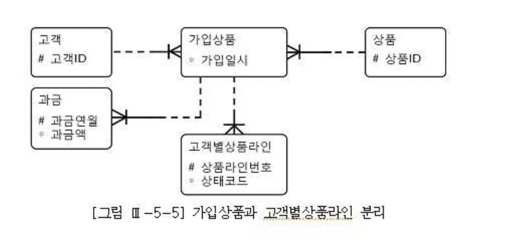
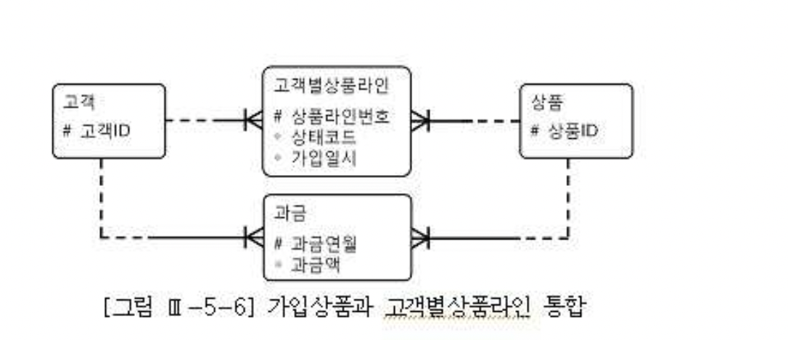

# 02. 소트튜닝


## 1) 소트와 성능


#### 가. 메모리 소트와 디스크 소트

- Oracle은 소트 영역을 PGA 영역에 할당하고, SQL Server는 버퍼 캐시에 할당함.
- 소트 시 메모리 공간이 부족할 경우 디스크 공간을 사용함.


| 구분                   | 설명                                                         |
| :--------------------- | :----------------------------------------------------------- |
| 메모리(In-Memory) 소트 | 전체 데이터의 정렬 작업을 할당받은 소트 영역 내에서 완료하는 것을 말함. 'Internal Sort' 또는 'Optimal Sort'라고도 함. |
| 디스크(To-Disk) 소트   | 할당받은 소트 영역 내에서 정렬을 완료하지 못해 디스크 공간까지 사용하는 것을 말함. 'External Sort'라고도 함. * Onepass Sort : 정렬 대상 집합을 디스크에 한 번만 기록 * Multipass Sort : 정렬 대상 집합을 디스크에 여러 번 기록 |


#### 나. 소트를 발생시키는 오퍼레이션

###### 1) Sort Aggregate

- 전체 로우를 대상으로 집계를 수행할 때 나타남.
- 실제 소트가 발생하진 않는다.
- SQL Server 실행계획엔 'Stream Aggregate' 라고 표시됨.


```sql
select sum(sal), max(sal), min(sal) from emp

---------------------------------------------------------------------------
| Id  | Operation          | Name | Rows  | Bytes | Cost (%CPU)| Time     |
---------------------------------------------------------------------------
|   0 | SELECT STATEMENT   |      |     1 |     4 |     3   (0)| 00:00:01 |
|   1 |  SORT AGGREGATE    |      |     1 |     4 |            |          |
|   2 |   TABLE ACCESS FULL| EMP  |    14 |    56 |     3   (0)| 00:00:01 |
---------------------------------------------------------------------------
```


###### 2) Sort Order By

- 정렬된 결과집합을 얻고자 할 때 나타남.

```sql
select * from emp order by sal desc

---------------------------------------------------------------------------
| Id  | Operation          | Name | Rows  | Bytes | Cost (%CPU)| Time     |
---------------------------------------------------------------------------
|   0 | SELECT STATEMENT   |      |    14 |   518 |     4  (25)| 00:00:01 |
|   1 |  SORT ORDER BY     |      |    14 |   518 |     4  (25)| 00:00:01 |
|   2 |   TABLE ACCESS FULL| EMP  |    14 |   518 |     3   (0)| 00:00:01 |
---------------------------------------------------------------------------
```


###### 3) Sort Group By

- Sorting 알고리즘을 사용해 그룹별 집계를 수행할 때 나타남.
- 오라클은 Hashing 알고리즘으로 그룹별 집계를 수행하기도 함.

```sql
select deptno, job, sum(sal), max(sal), min(sal)
from emp
group by deptno, job

---------------------------------------------------------------------------
| Id  | Operation          | Name | Rows  | Bytes | Cost (%CPU)| Time     |
---------------------------------------------------------------------------
|   0 | SELECT STATEMENT   |      |    11 |   165 |     4  (25)| 00:00:01 |
|   1 |  HASH GROUP BY     |      |    11 |   165 |     4  (25)| 00:00:01 |
|   2 |   TABLE ACCESS FULL| EMP  |    14 |   210 |     3   (0)| 00:00:01 |
---------------------------------------------------------------------------
```


###### 4) Sort Unique

- 선택된 결과집합에서 중복 레코드를 제거하고자 할 때 나타남.
- Union 연산자나 Distinct 연산자를 사용할 때가 대표적임.

```sql
select distinct deptno from emp order by deptno

---------------------------------------------------------------------------
| Id  | Operation          | Name | Rows  | Bytes | Cost (%CPU)| Time     |
---------------------------------------------------------------------------
|   0 | SELECT STATEMENT   |      |     3 |     9 |     5  (40)| 00:00:01 |
|   1 |  SORT UNIQUE       |      |     3 |     9 |     4  (25)| 00:00:01 |
|   2 |   TABLE ACCESS FULL| EMP  |    14 |    42 |     3   (0)| 00:00:01 |
---------------------------------------------------------------------------
```


###### 5) Sort Join

- Sort Merge Join을 수행할 때 나타남.

```sql
select /*+ ordered use_merge(e) */ *
from emp e, dept d
where d. deptno = e. deptno

----------------------------------------------------------------------------------------
| Id  | Operation                    | Name    | Rows  | Bytes | Cost (%CPU)| Time     |
----------------------------------------------------------------------------------------
|   0 | SELECT STATEMENT             |         |    14 |   798 |     6  (17)| 00:00:01 |
|   1 |  MERGE JOIN                  |         |    14 |   798 |     6  (17)| 00:00:01 |
|   2 |   TABLE ACCESS BY INDEX ROWID| EMP     |    14 |   518 |     2   (0)| 00:00:01 |
|   3 |    INDEX FULL SCAN           | EMP_IDX |    14 |       |     1   (0)| 00:00:01 |
|*  4 |   SORT JOIN                  |         |     4 |    80 |     4  (25)| 00:00:01 |
|   5 |    TABLE ACCESS FULL         | DEPT    |     4 |    80 |     3   (0)| 00:00:01 |
----------------------------------------------------------------------------------------
```


###### 6) Window Sort

- 윈도우 함수를 수행할 때 나타남.

```sql
select empno, ename, job, mgr, sal, row_number() over (order by hiredate)
from emp

---------------------------------------------------------------------------
| Id  | Operation          | Name | Rows  | Bytes | Cost (%CPU)| Time     |
---------------------------------------------------------------------------
|   0 | SELECT STATEMENT   |      |    14 |   476 |     4  (25)| 00:00:01 |
|   1 |  WINDOW SORT       |      |    14 |   476 |     4  (25)| 00:00:01 |
|   2 |   TABLE ACCESS FULL| EMP  |    14 |   476 |     3   (0)| 00:00:01 |
---------------------------------------------------------------------------
```


#### 다. 소트 튜닝 요약

- 소트 오퍼레이션은 메모리 집약적, CPU 집약적, 데이터량이 많을 때는 디스크 I/O까지 발생시킴.
- 특히, 부분범위처리를 할 수 없게 만듬.
- 될 수 있으면 소트가 발생하지 않도록 쿼리 작성해야 하고,
- 소트가 불가피하다면 메모리 내에서 수행을 완료할 수 있도록 해야 함.

- 데이터 모델 측면에서의 검토
- 소트가 발생하지 않도록 SQL 작성
- 인덱스를 이용한 소트 연산 대체
- 소트 영역을 적게 사용하도록 SQL 작성
- 소트 영역 크기 조정


## 2) 데이터 모델 측면에서의 검토

- 자주 사용되는 데이터 액세스 패턴을 고려하지 않은 채 물리 설계를 진행하거나,
- M:M 관계의 테이블을 해소하지 않아 핵심 프로그램이 항상 소트 오퍼레이션을 수반하는 경우 등.


- 정상적인 데이터 모델



- 자식 테이블에 통합




- 이 회사는 고객별 가입상품 레벨의 데이터 조회가 매우 빈번하게 일어난다면 그때마다 `고객별상품라인`  테이블을 group by 해야 한다.


```sql
select 과금.고객id
     , 과금.상품id
     , 과금.과금액
     , 가입상품.가입일시
from   과금
     ,(select 고객id
            , 상품id
            , min(가입일시) 가입일시
       from   고객별상품라인
       group by 고객id, 상품id) 가입상품
where  과금.고객id(+) = 가입상품.고객id
and    과금.상품id(+) = 가입상품.상품id
and    과금.과금연월(+) = :yyyymm


-- 잘 정규화된 데이터 모델을 사용했을 때

select 과금.고객id
     , 과금.상품id
     , 과금.과금액
     , 가입상품.가입일시
from   과금
     , 가입상품
where  과금.고객id(+) = 가입상품.고객id
and    과금.상품id(+) = 가입상품.상품id
and    과금.과금연월(+) = :yyyymm
```

- group by, union, distinct 같은 연산자가 심하게 많이 사용되는 패턴을 보인다면
- 대개 데이터 모델이 잘 정규화되지 않았음을 암시함.


## 3) 소트가 발생하지 않도록 SQL 작성

#### 가. Union을 Union All로 대체

```sql
select empno, job, mgr from emp where deptno = 10
union
select empno, job, mgr from emp where deptno = 20;

-----------------------------------------------------------------------------------------
| Id  | Operation                     | Name    | Rows  | Bytes | Cost (%CPU)| Time     |
-----------------------------------------------------------------------------------------
|   0 | SELECT STATEMENT              |         |     8 |   152 |     6  (67)| 00:00:01 |
|   1 |  SORT UNIQUE                  |         |     8 |   152 |     6  (67)| 00:00:01 |
|   2 |   UNION-ALL                   |         |       |       |            |          |
|   3 |    TABLE ACCESS BY INDEX ROWID| EMP     |     3 |    57 |     2   (0)| 00:00:01 |
|*  4 |     INDEX RANGE SCAN          | EMP_IDX |     3 |       |     1   (0)| 00:00:01 |
|   5 |    TABLE ACCESS BY INDEX ROWID| EMP     |     5 |    95 |     2   (0)| 00:00:01 |
|*  6 |     INDEX RANGE SCAN          | EMP_IDX |     5 |       |     1   (0)| 00:00:01 |
-----------------------------------------------------------------------------------------

select empno, job, mgr from emp where deptno = 10
union all
select empno, job, mgr from emp where deptno = 20;

----------------------------------------------------------------------------------------
| Id  | Operation                    | Name    | Rows  | Bytes | Cost (%CPU)| Time     |
----------------------------------------------------------------------------------------
|   0 | SELECT STATEMENT             |         |     8 |   152 |     4  (50)| 00:00:01 |
|   1 |  UNION-ALL                   |         |       |       |            |          |
|   2 |   TABLE ACCESS BY INDEX ROWID| EMP     |     3 |    57 |     2   (0)| 00:00:01 |
|*  3 |    INDEX RANGE SCAN          | EMP_IDX |     3 |       |     1   (0)| 00:00:01 |
|   4 |   TABLE ACCESS BY INDEX ROWID| EMP     |     5 |    95 |     2   (0)| 00:00:01 |
|*  5 |    INDEX RANGE SCAN          | EMP_IDX |     5 |       |     1   (0)| 00:00:01 |
----------------------------------------------------------------------------------------
```

- pk 컬럼인 empno를 select-list에 포함하므로 두 집합간 중복 가능성이 전혀 없음.


#### 나. Distinct를 Exists 서브쿼리로 대체

```sql
select distinct 과금연월
from   과금
where  과금연월 <= :yyyymm
and    지역 like :reg || '%'
```


- 입력한 과금연월(yyyymm) 이전에 발생한 과금 데이터를 모두 스캔하고 중복값 제거함.
- 각 월별로 과금이 발생한 적이 있는지 여부만 확인하면 됨.


```sql
select 연월
from   연월테이블 a
where  연월 <= :yyyymm
and    exists (select 'x'
               from   과금
               where  과금연월 = a.연월
               and    지역 like :reg || '%'
               )
```


- 연월테이블을 먼저 드라이빙해 과금 테이블을 exists 서브쿼리로 필터링하는 방식.
- [과금연월 + 연월] 인덱스 구성해주면 최적으로 수행될 수 있음.


#### 다. 불필요한 Count 연산 제거

- 데이터 존재 여부만 확인하면 되는데 불필요하게 전체 건수를 Count하는 경우

```sql
declare

    l_cnt number;

begin

    select count(*) into l_cnt
    from   member
    where  memb_cls = '1'
    and    birth_yyyy <= '1950';

    if l_cnt > 0 then
        dbms_output.put_line('exists');
    else
        dbms_output.put_line('not exists');
    end if;

end;


declare

    l_cnt number;

begin

    select 1 into l_cnt
    from   member
    where  memb_cls = '1'
    and    birth_yyyy <= '1950'
    and    rownum <= 1;

    dbms_output.put_line('exists');

    exception
        when no_data_found then
            dbms_output.put_line('not exists');

end;
```


## 4) 인덱스를 이용한 소트 연산 대체

#### 가. Sort Order By 대체

- [region + custid] 인덱스를 사용하면 sort order by 연산을 대체할 수 있음.

```sql
select custid, name, resno, status, tel1
from   customer
where  region = 'A'
order by custid
```

- 소트 오퍼레이션이 나타나지 않음
- 소트 대상 레코드가 무수히 많고 그 중 일부만 읽고 멈출 수 있을 때만 유용함.


#### 나. Sort Group By 대체

- region이 선두 컬럼인 결합 인덱스나 단일 컬럼 인덱스를 사용하면 Sort Group By 연산을 대체 할 수 있음.

```sql
select region, avg(age), count(*)
from   customer
group by region
```

- `SORT GROUP BY NOSORT`라고 표시됨.

```sql
drop table t1;

create table t1 as
select rownum as c1
     , mod(rownum,3) + 1 as c2
     , mod(rownum,5) + 1 as c3
from   dual
connect by level <= 100
;

select *
from   t1
where  c2 = '3'
order by c3
;

---------------------------------------------------------------------------
| Id  | Operation          | Name | Rows  | Bytes | Cost (%CPU)| Time     |
---------------------------------------------------------------------------
|   0 | SELECT STATEMENT   |      |    33 |  1287 |     4  (25)| 00:00:01 |
|   1 |  SORT ORDER BY     |      |    33 |  1287 |     4  (25)| 00:00:01 |
|*  2 |   TABLE ACCESS FULL| T1   |    33 |  1287 |     3   (0)| 00:00:01 |
---------------------------------------------------------------------------

-- Sort Order By 대체
create index t1_n1 on t1(c2,c3);

-------------------------------------------------------------------------------------
| Id  | Operation                   | Name  | Rows  | Bytes | Cost (%CPU)| Time     |
-------------------------------------------------------------------------------------
|   0 | SELECT STATEMENT            |       |    33 |  1287 |     2   (0)| 00:00:01 |
|   1 |  TABLE ACCESS BY INDEX ROWID| T1    |    33 |  1287 |     2   (0)| 00:00:01 |
|*  2 |   INDEX RANGE SCAN          | T1_N1 |    33 |       |     1   (0)| 00:00:01 |
-------------------------------------------------------------------------------------

-- Sort Group By 대체
-- (Hash Group By 로 나옴)

select c2
     , count(*)
from   t1
group by c2
;

---------------------------------------------------------------------------
| Id  | Operation          | Name | Rows  | Bytes | Cost (%CPU)| Time     |
---------------------------------------------------------------------------
|   0 | SELECT STATEMENT   |      |   100 |  1300 |     4  (25)| 00:00:01 |
|   1 |  HASH GROUP BY     |      |   100 |  1300 |     4  (25)| 00:00:01 |
|   2 |   TABLE ACCESS FULL| T1   |   100 |  1300 |     3   (0)| 00:00:01 |
---------------------------------------------------------------------------
```


#### 다. 인덱스를 활용한 Min, Max 구하기

- 인덱스가 항상 정렬 상태를 유지한다는 특징을 이용하여 Min, Max 값 추출

- [주문일자 + 주문번호]

```sql
select nvl(max(주문번호), 0) + 1
from   주문
where  주문일자 = :주문일자

-- FIRST ROW 와 MIN/MAX 오퍼레이션이 나타남
create index emp_n1 on emp(job, empno);

select nvl(max(empno),0) + 1
from   emp
where  job = 'SALESMAN'
;

---------------------------------------------------------------------------------------
| Id  | Operation                    | Name   | Rows  | Bytes | Cost (%CPU)| Time     |
---------------------------------------------------------------------------------------
|   0 | SELECT STATEMENT             |        |     1 |    12 |     1   (0)| 00:00:01 |
|   1 |  SORT AGGREGATE              |        |     1 |    12 |            |          |
|   2 |   FIRST ROW                  |        |     4 |    48 |     1   (0)| 00:00:01 |
|*  3 |    INDEX RANGE SCAN (MIN/MAX)| EMP_N1 |     4 |    48 |     1   (0)| 00:00:01 |
---------------------------------------------------------------------------------------

select nvl(max(empno + 1),1)
from   emp
where  job = 'SALESMAN'
;

----------------------------------------------------------------------------
| Id  | Operation         | Name   | Rows  | Bytes | Cost (%CPU)| Time     |
----------------------------------------------------------------------------
|   0 | SELECT STATEMENT  |        |     1 |    12 |     1   (0)| 00:00:01 |
|   1 |  SORT AGGREGATE   |        |     1 |    12 |            |          |
|*  2 |   INDEX RANGE SCAN| EMP_N1 |     4 |    48 |     1   (0)| 00:00:01 |
----------------------------------------------------------------------------
```


## 5) 소트 영역을 적게 사용하도록 SQL 작성

- 소트 연산이 불가피하다면 메모리 내에서 처리되게 하려고 노력해야 됨.


#### 가. 소트 완료 후 데이터 가공

```sql
-- 1번 쿼리
select lpad(empno, 10) || lpad(ename, 30) || lpad(job, 30)
from   emp
where  sal <= 2000
order by job

-- 2번 쿼리
select lpad(empno, 10) || lpad(ename, 30) || lpad(job, 30)
from  (select empno
            , ename
            , job
       from   emp
       where  sal <= 2000
       order by job)
```

- 1번 쿼리는 가공한 후 소트 영역에 담고, 2번 쿼리는 가공되지 않은 상태로 소트 영역에 담고
- 정렬을 완료하고 나서 가공하므로 1번 SQL에 비해 소트 영역을 휠씬 적게 사용함.


## 6) 소트 영역 크기 조정

- SQL Server에서는 소트 영역을 수동으로 조정하지 않음.

- Oracle 8i : sort_area_size 파라미터로 조정함.

```
  alter session set sort_area_size = 1048576;
```

- Oracle 9i 부터 '자동 PGA 메모리 관리(Automatic PGA Memory Management)' 기능 도임.
  pga_aggregate_target 파라미터에 인스터스 전체 이용 가능한 PGA 메모리 총량을 지정,
  Oracle이 자동으로 각 세션에 메모리를 할당해 줌.
  workarea_size_policy를 auto로 설정하면 됨(기본설정). sort_area_size 파라미터는 무시됨.
  수동으로 전환하여 배치 등 작업에 필요한 만큼의 소트 영역 크기를 늘림으로써 성능을 향상시킬 수 있음.

```
  alter session set workarea_size_policy = manual;
  alter session set sort_area_size = '10485760;
```
