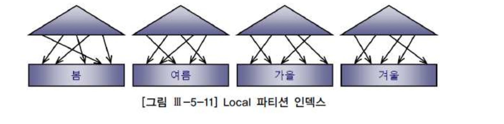
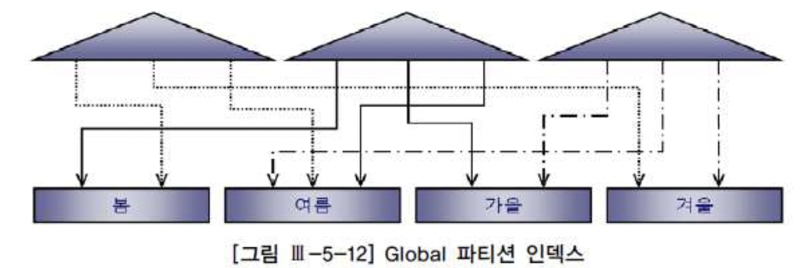
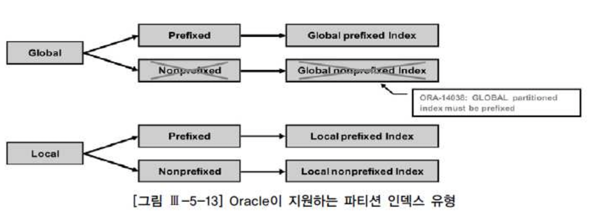

# 04. 파티션활용


## 1) 파티션의 유형

###### Range 파티셔닝

- 파티션 키 값의 범위(Range)로 분할
- 파티셔닝의 가장 일반적인 형태이며, 주로 날짜 칼럼을 기준으로 함예) 판매 데이터를 월별로 분할


###### Hash 파티셔닝

- 파티션 키 값에 해시 함수를 적용하고, 거기서 반환된 값으로 파티션 매핑

- 데이터가 모든 파티션에 고르게 분산되도록 DBMS가 관리
  - 각 로우의 저장 위치 예측 불가

- 파티션 키의 데이터 분포가 고른 칼럼이어야 효과적
  - 예) 고객번호, 주문일련번호 등

- 병렬처리 시 성능효과 극대화
- DML 경합 분산에 효과적


###### List 파티셔닝

- 불연속적인 값의 목록을 각 파티션에 지정
- 순서와 상관없이, 사용자가 미리 정한 그룹핑 기준에 따라 데이터를 분할 저장
  - 예) 판매 데이터를 지역별로 분할


###### Composite 파티셔닝

- Range나 List 파티션 내에 또 다른 서브 파티션(Range, Hash, List) 구성
  - Range + List 또는 List + Hash 등
- Range나 List 파티션이 갖는 이점 + 각 서브 파티션 구성의 이점


- 표 : 5-2 ORACLE 버전 별 파티션 지원 유형+

| 파티션유형 | 단일 파티셔닝 | + HASH  | + LIST  | +RANGE  |
| :--------- | :------------ | :------ | :------ | :------ |
| RANGE      | 8이상         | 8i이상  | 9i이상  | 11g이상 |
| HASH       | 8i이상        | X       | X       | X       |
| LIST       | 9i이상        | 11g이상 | 11g이상 | 11g이상 |

```sql
-- ORACLE : Range partition
create table 주문 ( 주문번호 number, 주문일자 varchar2(8), 고객id varchar2(5), )
partition by range(주문일자) ( 
  partition p2009_q1 values less than ('20090401') ,
  partition p2009_q2 values less than ('20090701') , 
  partition p2009_q3 values less than ('20091001') , 
  partition p2009_q4 values less than ('20100101') , 
  partition p2010_q1 values less than ('20100401') , 
  partition p9999_mx values less than ( MAXVALUE )
) ;

-- ORACLE : Range + HASH Partition

create table 주문 ( 주문번호 number, 주문일자 varchar2(8), 고객id varchar2(5), )
 partition by range(주문일자)
 subpartition by hash(고객id) subpartitions 8
 ( partition p2009_q1 values less than('20090401') ,
   partition p2009_q2 values less than('20090701') ,
   partition p2009_q3 values less than('20091001') ,
   partition p2009_q4 values less than('20100101') , 
   partition p2010_q1 values less than('20100401') , 
   partition p9999_mx values less than( MAXVALUE ) 
) ;
```


1. 파일 그룹을 생성한다(선택).
2. 파일을 파일 그룹에 추가한다(선택).
3. 파티션 함수(Partition Function)를 생성한다(필수).
    - 분할 방법과 경계 값을 지정 
4. 파티션 구성표(Partition Schema)를 생성한다(필수). 
    - 파티션 함수에서 정의한 각 파티션의 위치(파일 그룹)를 지정 
5. 파티션 테이블을 생성한다. 
    - 파티션 하고자 하는 테이블을 파티션 구성표에 생성한다.


## 2) 파티션 Pruning

- 파티션 Pruning은 옵티마이져가 SQL의 대상 테이블과 조건절을 분석하여 불필요한 파티션을 액세스 대상에서 제외하는 기능을 말한다.
- 기본 파티션 Pruning에는 정적 Pruning과 동적 Pruning이 있고, DBMS별로 서브쿼리 Pruning, 조인 필터(또는 블룸 필터) Pruning 같은 고급 Pruning 기법을 사용한다.


###### 정적(Static) 파티션 Pruning

```sql
--액세스할 파티션을 컴파일 시점(Compile-Time)에 미리 결정하며, 파티션 키 칼럼을 상수 조건으로 조회하는 경우에 작동한다.
select * from sales_range where sales_date >= '20060301' and sales_date <= '20060401'

-----------------------------------------------------------
| Id | Operation             | Name        |Pstart| Pstop | 
----------------------------------------------------------- 
| 0  | SELECT STATEMENT      |             |      |       | 
| 1  | PARTITION RANGE       ITERATOR |    | 3    | 4     | 
|* 2 | TABLE ACCESS FULL     | SALES_RANGE | 3    | 4     |
 ----------------------------------------------------------
Predicate Information (identified by operation id):
 --------------------------------------------------------- 
2 - filter("SALES_DATE">='20060301' AND "SALES_DATE"<='20060401')
```


###### 동적(Dynamic) 파티션 Pruning

```sql
-- 액세스할 파티션을 실행 시점(Run-Time)에 결정하며, 파티션 키 칼럼을 바인드 변수로 조회하는 경우가 대표적이다. NL Join할 때도 Inner 테이블이 조인 칼럼 기준으로 파티셔닝 돼 있으면 동적 Pruning이 작동한다.

select * from sales_range where sales_date >= :a and sales_date <= :b
---------------------------------------------------------------------- 
| Id | Operation                      | Name         | Pstart | Pstop | 
----------------------------------------------------------------------
| 0 | SELECT STATEMENT                |              |        |      |
|*1 | FILTER                          |              |        |      | 
| 2 | PARTITION RANGE  ITERATOR       |              | KEY    | KEY  | 
|*3 | TABLE ACCESS FULL               | SALES_RANGE  | KEY    | KEY  |
----------------------------------------------------------------------
Predicate Information (identified by operation id):
----------------------------------------------------------------------
1 - filter(:A<=:B)
3 - filter("SALES_DATE">=:A AND "SALES_DATE"<=:B)
```


## 3) 인덱스 파티셔닝

#### 가. Local 파티션 인덱스 vs. Global 파티션 인덱스

- Local 파티션 인덱스 : 테이블 파티션과 1:1로 대응되도록 파티셔닝한 인덱스( 그림 Ⅲ-5-11 참조). 인덱스 파티션 키를 사용자가 따로 지정하지 않으며, 테이블과 1:1 관계를 유지하도록 DBMS가 자동으로 관리해 줌. SQL Server에선 '정렬된(aligned) 파티션 인덱스'라고 부름





- Global 파티션 인덱스 : 테이블 파티션과 독립적인 구성을 갖도록 파티셔닝한 인덱스(그림 Ⅲ-5-12 참조). SQL Server에선 '정렬되지 않은(un-aligned) 파티션 인덱스'라고 부름




#### 나. Prefixed 파티션 인덱스 vs. NonPrefixed 파티션 인덱스

- 인덱스 파티션 키 칼럼이 인덱스 구성상 왼쪽 선두 칼럼에 위치하는지에 따른 구분이다.

- Prefixed : 파티션 인덱스를 생성할 때, 파티션 키 칼럼을 인덱스 키 칼럼 왼쪽 선두에 두는 것을 말한다.
- Non-prefixed : 파티션 인덱스를 생성할 때, 파티션 키 칼럼을 인덱스 키 칼럼 왼쪽 선두에 두지 않는 것을 말한다. 파티션 키가 인덱스 칼럼에 아예 속하지 않을 때도 여기에 속한다.


|        | Prefixed | Non-prefixed |
| :----- | :------- | :----------- |
| Local  | 1        | 2            |
| Global | 3        | 4            |


- 비파티션까지 포함에 인덱스를 총 5가지 유형으로 구분할 수 있다.




#### 다. 인덱스 파티셔닝 가이드

- 인덱스 파티션은 파티션 테이블과 마찬가지로 성능, 관리 편의성, 가용성, 확장성 등을 제공한다. 테이블에 종속적인 Local 파티션, 테이블과 독립적인 Global 파티션 모두 가능하지만, 관리적인 측면에서는 Local 인덱스가 훨씬 유용하다. 테이블 파티션에 대한 Drop, Exchange, Split 등의 작업 시 Global 인덱스는 Unusable 상태가 되기 때문이다. 인덱스를 다시 사용할 수 있게 하려면 인덱스를 Rebuild 하거나 재생성해 주어야 한다.

| 구분               | 적용기준 및 고려사항                                         |
| :----------------- | :----------------------------------------------------------- |
| 비파티션           | 파티션 키 컬럽 조건절에 누락되면 여러 인덱스 파티션을 액세스해야 하므로 비효율적 , 특히 OLTP 환경에서는 성능에 미치는 영향이 크므로 비파티셔닝 전략이 유용할 수 있음NLJoin 에서 파티션키에 대한 넓은 범위조건을 가지고 inner 테이블 액세스 용도로 인텍스 파티션을 사용된다면 비효율적 -> 비파티셔닝 인덱스 사용을 고려파티션 인덱스를 이용하면 sort order by 대체 효과 상실, 소트연산을 대체함으로써 부분범위처리를 활용하고자 할 때는 비파티셩닝 전략이 유용테이블 파티션 이동, 삭제 등 작업시 unusable 되므로 적용 시 주위 |
| Global Prefixed    | 인덱스 경합 분산에 효과적여러 Local 인덱스 파티션을 액세스하는 것이 비효율적일 때 대안으로 활용 가능테이블 파티션 이동, 삭제 등 작업시 unusable 되므로 적용 시 주위 |
| Local Prefixed     | 관리적 측면에서 유용 : 테이블 파티션 추가, 삭제 등 작업이 빈번할때,이력성 데이터를 주고 관리하는 DB에서는 효과적파티션 키 컬럼이 '=' 조건으로 사용될 때 유용파티셔닝 컬럼에 대한 검색 조건이 없으면 인덱스 선두 컬럼이 조건절이 누락된 것이므로 정상적으로 사용이 불가 (index Full scan 선택 가능)파티션 키 컬럼 (= 인덱스 선두 컬럼) like , between, 부등호 같은 범위검색 조건일 때 불리 |
| Local Non Prefixed | 관리적 측면에서 유용 : 테이블 파티션 추가, 삭제 등 작업이 빈번할때이력성 데이터를 주고 관리하는 DB에서는 효과적파티션 키 컬럼이 조건으로 사용될 때 유용파티셔닝 컬럼에 대한 검색 조건이 없으면 인덱스 파티션 전체를 엑세스 하는 비효율이 발생 할수 있으므로 주의파티션 키 컬럼이 범위검색 조건으로 자주 사용된다면 Local Prefixed 보다 Local NonPrefiexd 가 유리 , 그렇더라도 좁은 범위 검색이어야 함. |
