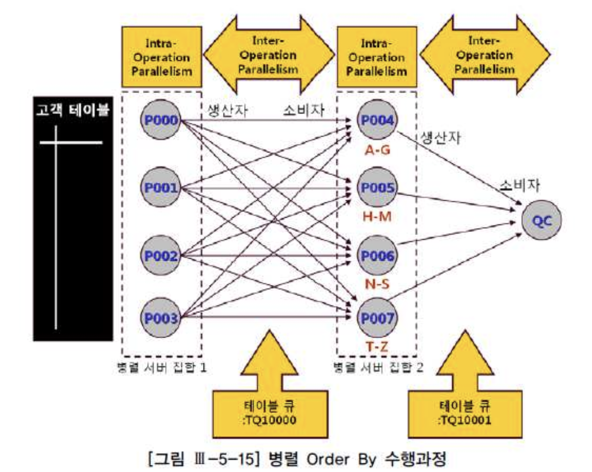
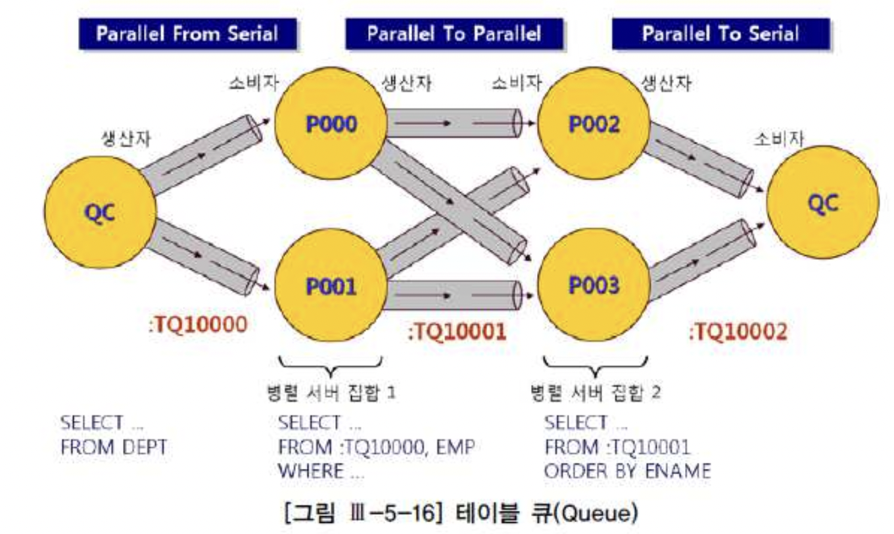

# 05. 배치 프로그램 튜닝


## 1) 배치 프로그램 튜닝 개요

**가. 배치 프로그램이란**

일반적으로 배치(Batch) 프로그램이라 하면, 일련의 작업들을 하나의 작업 단위로 묶어 연속적으로 일괄 처리하는 것을 말한다. 온라인 프로그램에서도 여러 작업을 묶어 처리하는 경우가 있으므로 이와 구분하려면 한 가지 특징을 더 추가해야 하는데, 사용자와의 상호작용(Interaction) 여부다.

- 사용자와의 상호작용 없이. 대량의 데이터를 처리하는 일련의 작업들을 묶어 정기적으로 반복 수행하거나 정해진 규칙에 따라 자동으로 수행

```sql
정기 배치 : 정해진 시점(주로 야간)에 실행
이벤트성 배치 : 사전에 정의해 둔 조건이 충족되면 자동으로 실행
On-Demand 배치 : 사용자의 명시적인 요구가 있을 때마다 실행
```


**나. 배치 환경의 변화**

과거 :

- 일(Daily) 또는 월(Monthly) 배치 작업 위주- 야간에 생성된 데이터를 주간 업무시간에 활용- 온라인과 배치 프로그램의 구분이 비교적 명확

현재 :

- 시간(Hourly) 배치 작업의 비중이 증가- 분(minutely) 배치 작업이 일부 존재- On-Demand 배치를 제한적이나마 허용


**다. 성능 개선 목표 설정**

- 배치 목표에 따라 성능개선이 틀려진다.

- 온라인 프로그램은 경우에 따라 전체 처리속도 최적화나 최초 응답속도 최적화를 목표로 선택하지만,
- 배치 프로그램은 항상 전체 처리속도 최적화를 목표로 설정해야 한다.
- 개별 프로그램 차원에서도 그렇지만 야간에 수행되는 전체 배치 프로그램에 대한 목표도 마찬가지다.

- 개별 서비스 또는 프로그램을 가장 빠른 속도로 최적화하더라도 전체 배치 프로그램 수행시간을 단축시키지 못하면 무의미하다.
- 여러 부서의 배치가 있다면 (그림과 같이 배치 윈도우를 구성) 서로 겹치지 않게 자원을 쓸수 있게 하면 시간을 단축 시킬 수 있다.


**라.배치 프로그램 구현 패턴과 튜닝 방안**

절차형으로 작성된 프로그램 : 애플리케이션 커서를 열고, 루프 내에서 또 다른 SQL이나 서브 프로시저를 호출하면서 같은 처리를 반복하는 형태
One SQL 위주 프로그램 : One SQL로 구성하거나, 집합적으로 정의된 여러 SQL을 단계적으로 실행

| 구분                           | 설명                                                         |
| :----------------------------- | :----------------------------------------------------------- |
| 절차형으로 작성된 프로그램     | 병목을 일으키는 SQL 을 찾아 I/O 튜닝 : 인덱스를 재구성하고 엑세스 경로 최적화 프로그램 Parallel 활용 : 메인 SQL 읽은 데이터 범위를 달리하여 프로그램을 동시에 활용 Array Processing 을 활용 One SQL 위주로 프로그램을 다시 구현 |
| One SQL 위주 프로그램으로 구현 | 병목을 일으키는 오퍼레이션을 찾아 I/O 튜닝 index scan 보다는 full table scan 방식으로 처리 NL Join 보다는 Hash Join 으로 처리 임시 테이블 활용, 파티셔닝 활용, 병렬처리 사용 |


## 2) 병렬 처리 활용

- 병렬 처리란, SQL문이 수행해야 할 작업 범위를 여러 개의 작은 단위로 나누어 여러 프로세스(또는 쓰레드)가 동시에 처리하는 것을 말한다.

```sql
 -- ORACLE --
 select /*+ full(o) parallel(o, 4) */ count(*) 주문건수, sum(주문수량) 주문수량, sum(주문금액) 주문금액
 from 주문 o 
 where 주문일시 between '20100101' and '20101231';

 select /*+ index_ffs(o, 주문_idx)) parallel_index(o, 주문_idx, 4) */ count(*) 주문건수 
 from 주문 o 
 where 주문일시 between '20100101' and '20101231'
 
 -- parallel 힌트를 사용할 때는 반드시 Full 힌트도 함께 사용하는 습관이 필요하다.
 -- 옵티마이저에 의해 인덱스 스캔이 선택되면 parallel 힌트가 무시되기 때문이다.
 -- parallel_index 힌트를 사용할 때, 반드시 index 또는 index_ffs 힌트를 함께 사용하는 습관도 필요하다. 
 -- 옵티마이저에 의해 Full Table Scan이 선택되면 parallel_index 힌트가 무시되기 때문이다.

 select count(*) 주문건수 
 from 주문 
 where 주문일시 between '20100101' and '20101231' option (MAXDOP 4)
```


##### 가. Query Coordinator와 병렬 서버 프로세스

- Query Coordinator(이하 QC)는 병렬 SQL문을 발행한 세션을 말하며, 병렬 서버 프로세스는 실제 작업을 수행하는 개별 세션들을 말한다. QC의 역할은 다음과 같다.
- 병렬 SQL이 시작되면 QC는 사용자가 지정한 병렬도(DOP, degree of parallelism)와 오퍼레이션 종류에 따라 하나 또는 두 개의 병렬 서버 집합(Server Set)을 할당한다.
- 우선 서버 풀(Parallel Execution Server Pool)로부터 필요한 만큼 서버 프로세스를 확보하고, 부족분은 새로 생성한다.
- QC는 각 병렬 서버에게 작업을 할당한다. 작업을 지시하고 일이 잘 진행되는지 관리감독하는 작업반장 역할이다.
- 병렬로 처리하도록 사용자가 지시하지 않은 테이블은 QC가 직접 처리한다.


##### 나. Intra-Operation Parallelism과 Inter-Operation Parallelism

```
select /*+ full(고객) parallel(고객 4) */ * from 고객 order by 고객명
```


- 서로 배타적인 범위를 독립적으로 동시에 처리하는 것을 'Intra-Operation Parallelism'이라고 한다.


##### 다. 테이블 큐

```
select /*+ ordered use_hash(e) full(d) noparallel(d) full(e) parallel(e 2) pq_distribute(e broadcast none) */ * 
from dept d, emp e 
where d.deptno = e.deptno
order by e.ename
```





##### 라. IN-OUT 오퍼레이션




- S→P, P→S, P→P는 프로세스 간 통신이 발생한다.
- PCWP와 PCWC는 프로세스 간 통신이 발생하지 않으며, 각 병렬 서버가 독립적으로 여러 스텝을 처리할 나타난다. 하위 스텝의 출력 값이 상위 스텝의 입력 값으로 사용된다.
- P→P, P→S, PCWP, PCWC는 병렬 오퍼레이션인 반면 S→P는 직렬(Serial) 오퍼레이션이다.


##### 마. 데이터 재분배

###### RANGE

- order by 또는 sort group by를 병렬로 처리할 때 사용된다. 정렬 작업을 맡은 두 번째 서버 집합의 프로세스마다 처리 범위(예를 들어, A~G, H~M, N~S, T~Z)를 지정하고 나서, 데이터를 읽는 첫 번째 서버 집합이 두 번째 서버 집합의 정해진 프로세스에게 "정렬 키 값에 따라" 분배하는 방식이다. QC는 각 서버 프로세스에게 작업 범위를 할당하고 정렬 작업에는 직접 참여하지 않으며, 정렬이 완료되고 나면 순서대로 결과를 받아서 사용자에게 전송하는 역할만 한다.


###### HASH

- 조인이나 hash group by를 병렬로 처리할 때 사용된다. 조인 키나 group by 키 값을 해시 함수에 적용하고 리턴된 값에 따라 데이터를 분배하는 방식이며, P→P 뿐만 아니라 S→P 방식으로 이루어질 수도 있다.


###### BROADCAST

- QC 또는 첫 번째 서버 집합에 속한 프로세스들이 각각 읽은 데이터를 두 번째 서버 집합에 속한 "모든" 병렬 프로세스에게 전송하는 방식이다. 병렬 조인에서 크기가 매우 작은 테이블이 있을 때 사용되며, P→P 뿐만 아니라 S→P 방식으로도 이루어진다.


###### KEY

- 특정 칼럼(들)을 기준으로 테이블 또는 인덱스를 파티셔닝할 때 사용하는 분배 방식이다.


###### ROUND-ROBIN

- 파티션 키, 정렬 키, 해시 함수 등에 의존하지 않고 반대편 병렬 서버에 무작위로 데이터를 분배할 때 사용된다.


##### 바. pq_distribute 힌트 활용

###### 1) pq_distribute 힌트의 용도

- 조인되는 양쪽 테이블의 파티션 구성, 데이터 크기 등에 따라 병렬 조인을 수행하는 옵티마이저의 선택이 달라질 수 있다.
- 대개 옵티마이저의 선택이 최적이라고 할 수 있지만 가끔 그렇지 못한 경우가 있다.
- 그럴 때 pq_distiribute 힌트를 사용함으로써 옵티마이저의 선택을 무시하고 사용자가 직접 조인을 위한 데이터 분배 방식을 결정할 수 있다.

- 옵티마이저가 파티션된 테이블을 적절히 활용하지 못하고 동적 재분할을 시도할 때
- 기존 파티션 키를 무시하고 다른 키 값으로 동적 재분할하고 싶을 때
- 통계정보가 부정확하거나 통계정보를 제공하기 어려운 상황(→ 옵티마이저가 잘못된 판단을 하기 쉬운 상황)에서 실행계획을 고정시키고자 할 때
- 기타 여러 가지 이유로 데이터 분배 방식을 변경하고자 할 때

- 병렬 방식으로 조인을 수행하기 위해서는 프로세스들이 서로 "독립적으로" 작업할 수 있도록 사전 준비작업이 필요하다. 먼저 데이터를 적절히 배분하는 작업이 선행되어야 하는 것이다.

- 병렬 쿼리는 '분할 & 정복(Divide & Conquer) 원리'에 기초한다.

- 그 중에서도 병렬 조인을 위해서는 '분배 & 조인(Distribute & Join) 원리'가 작동함을 이해하는 것이 매우 중요하다.

- 이때, pq_distribute 힌트는 조인에 앞서 데이터를 분배(distribute) 과정에만 관여하는 힌트임을 반드시 기억할 필요가 있다.


###### 2) pq_distribute 사용법

```sql
/*+ pq_distribute(inner, none, none) */
/*+ pq_distribute(inner, partition, none) */
/*+ pq_distribute(inner, none, partition) */
/*+ pq_distribute(inner, hash, hash) */
/*+ pq_distribute(inner, broadcast, none) */
/*+ pq_distribute(inner, none, broadcast) */
```


###### 3) pq_distribute 힌트를 이용한 튜닝 사례

```sql
SQL> INSERT /*+ APPEND */ INTO 상품기본이력 ( ... ) 
2 SELECT /*+ PARALLEL(A,32) PARALLEL(B,32) PARALLEL(C,32) PARALLEL(D,32) */ ...... 
3 FROM 상품기본이력임시 a, 상품 b, 코드상세 c, 상품상세 d 
4 WHERE a.상품번호= b.상품번호 
5 AND ... 
6 / 

INSERT /*+ append */ INTO 상품기본이력 ( *
1행에 오류:
ORA-12801: 병렬 질의 서버 P013에 오류신호가 발생했습니다
ORA-01652: 256(으)로 테이블 공간 TEMP에서 임시 세그먼트를 확장할 수 없습니다 
경 과: 01:39:56.08 

 ------------------------------------------------------------------------------- 
| Operation                | Name | Rows | Pstart | Pstop  |IN-OUT | PQ Distrib|
| ------------------------------------------------------------------------------ 
| INSERT STATEMENT         |      | 5248 |        |        |       |           |
|  LOAD AS SELECT          |      |      |        |        |       |           | 
|   HASH JOIN              |      | 5248 |        |        | P->S  | QC (RAND) |
|    HASH JOIN OUTER       |      | 5248 |        |        | P->P  | BROADCAST |
|     HASH JOIN            |      | 5248 |        |        | PCWP  |           | 
|      PARTITION HASH ALL  |      |      | 1      | 128    | PCWP  |           | 
|       TABLE ACCESS FULL  | 임시 | 5248 | 1      | 128    | P->P  | BROADCAST |
|      TABLE ACCESS FULL   | 상품 | 7595K|        |        | PCWP  |           |
|    TABLE ACCESS FULL     | 코드 | 26   |        |        | P->P  | BROADCAST |
|   TABLE ACCESS FULL      | 상세 | 7772K|        |        | PCWP  |           | 
--------------------------------------------------------------------------------

SQL> INSERT /*+ APPEND */ INTO 상품기본이력 ( ... ) 
2 SELECT /*+ ORDERED PARALLEL(A,16) PARALLEL(B,16) PARALLEL(C,16) PARALLEL(D,16)
3 PQ_DISTRIBUTE(B, NONE, PARTITION) 
4 PQ_DISTRIBUTE(C, NONE, BROADCAST)
5 PQ_DISTRIBUTE(D, HASH, HASH) */ ...... 
6 FROM 상품기본이력임시 a, 상품 b, 코드상세 c, 상품상세 d 
7 WHERE a.상품번호= b.상품번호 
8 AND ... 
9 /

8796902 개의 행이 만들어졌습니다.

 경 과: 00:02:29.00

 ------------------------------------------------------------------------------- 
| Operation                | Name | Rows | Pstart | Pstop |IN-OUT | PQ Distrib |
-------------------------------------------------------------------------------
| INSERT STATEMENT         |      | 5248 |        |        |      |            | 
|  LOAD AS SELECT          |      |      |        |        |      |            | 
|   HASH JOIN              |      | 5248 |        |        | P->S |  QC (RAND) | 
|    HASH JOIN OUTER       |      | 5248 |        |        | P->P |  HASH      |  
|     HASH JOIN            |      | 5248 |        |        | PCWP |            | 
|      PARTITION HASH ALL  |      |      |      1 |    128 | PCWP |            | 
|       TABLE ACCESS FULL  | 임시 | 5248 |      1 |    128 | PCWP |            |
|      TABLE ACCESS FULL   | 상품 | 7595K|        |        | P->P | PART (KEY) | 
|    TABLE ACCESS FULL     | 코드 | 26   |        |        | P->P | BROADCAST  | 
|   TABLE ACCESS FULL      | 상세 | 7772K|        |        | P->P | HASH       |
 -------------------------------------------------------------------------------
```


##### 사. 병렬 처리 시 주의사항

- 동시 사용자 수가 적은 애플리케이션 환경(야간 배치 프로그램, DW, OLAP 등)에서 직렬로 처리할 때보다 성능 개선 효과가 확실할 때(→ 이 기준에 따르면 작은 테이블은 병렬 처리 대상에서 제외됨)
- OLTP성 시스템 환경이더라도 작업을 빨리 완료함으로써 직렬로 처리할 때보다 오히려 전체적인 시스템 리소스(CPU, Memory 등) 사용률을 감소시킬 수 있을 때(→ 수행 빈도가 높지 않음을 전제로)
