# 01. 데이터모델의 이해

## 1) 모델링의 이해

### 가. 모델링의 정의

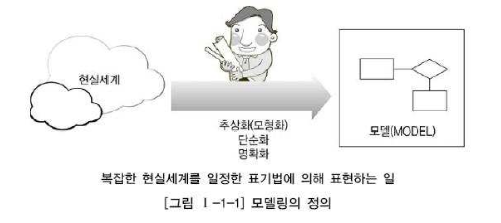

#### 모델링에 대한 다양한 정의

- Webster 사전
  - 가설적 일정 양식에 맞춘 표현
  - 어떤 것에 대한 예비표현으로, 그로부터 최종대상이 구축되도록 하는 계획으로서 기여하는 것
- 복잡한 '현실세계'를 단순화시켜 표현하는 것
- 모델이란 사물 또는 사건에 관한 양상(Aspect)이나 관점(Perspective)을 연관된 사람이나 그룹을 위하여 명확하게 하는 것이다.
- 모델이란 현실 세계의 추상화된 반영이다.

### 나. 모델링의 특징

| 3대 특징                | 설명                                                         |
| :---------------------- | :----------------------------------------------------------- |
| 추상화 (모형화, 가설적) | 현실세계를 일정한 형식에 맞추어 표현을 한다는 의미로 정리할 수 있다. 즉, 다양한 현상을 일정한 양식인 표기법에 의해 표기한다는 것이다. |
| 단순화                  | 복잡한 현실세계를 약속된 규약에 의해 제한된 표기법이나 언어로 표현하여 쉽게 이해할 수 있도록 하는 개념을 의미한다. |
| 명확화                  | 누구나 이해하기 쉽게 하기 위해 대상에 대한 애매모호함을 제거하고 정확하게 현상을 기술하는 것을 의미한다. |

- 모델링의 재정의 : 현실세계를 추상화, 단순화, 명확화하기 위해 일정한 표기법에 의해 표현하는 기법
- 정보시스템 구축에서의 모델링 활용
  - 계획/분석/설계 단계 : 업무를 분석하고 설계하는데 이용
  - 구축/운영 단계 : 변경과 관리의 목적으로 이용

### 다. 모델링의 세 가지 관점

| 관점                         | 설명                                                         | 키워드                 |
| :--------------------------- | :----------------------------------------------------------- | :--------------------- |
| 데이터관점                   | 업무가 어떤 데이터와 관련이 있는지? 데이터간의 관계는 무엇인지? | Data What              |
| 프로세스관점                 | 업무가 실제하고 있는 일이 무었인지? 무엇을 모델링해야 하는지? | Process How            |
| 데이터와 프로세스의 상관관점 | 업무가 처리하는 일의 방법에 따라 데이터는 어떻게 영향을 받고 있는지? | Interaction (상호작용) |

## 2) 데이터 모델의 기본개념의 이해

### 가. 데이터 모델링의 정의

#### 모델링에 대한 다양한 정의

- 정보시스템을 구축하기 위해, 해당 업무에 어떤 데이터가 존재하는지 또는 업무가 필요로 하는 정보는 무엇인지를 분석하는 방법
- 기업 업무에 대한 종합적인 이해를 바탕으로 데이터에 본재하는 업무 규칙(Business Rule)에 대하여 참(True) 또는 거짓(False)을 판별할 수 있는 사실(사실명제)을 데이터에 접근하는 방법(How), 사람(Who), 전산화는 별개(독립적인)의 관점에서 이를 명확하게 표현하는 추상화 기법

#### 실무적 관점(정보시스템 구축)에서의 데이터 모델링을 하는 주요 이유

- 정보시스템 구축 대상이 되는 업무 내용을 정확하게 분석하는 것
- 분석된 모델을 가지고 실제 데이터베이스를 생성하여 개발 및 데이터관리에 사용하기 위한 것
- 단지 데이터베이스 구축만이 목적이 아니라 데이터 모델링 자체로서 업무를 설명하고 분석하는 부분에도 중요한 의미를 가지고 있음.

#### 데이터 모델링이란

- 정보시스템을 구축하기 위한 데이터 관점의 업무분석 기법
- 현실세계의 데이터(Whet)에 대해 약속된 표기법에 의해 표현하는 과정
- 데이터베이스를 구축하기 위한 분석/설계의 과정

### 나. 데이터 모델이 제공하는 기능

#### 업무를 분석하는 관점에서 데이터 모델이 제공하는 기능

- 시스템을 현재 또는 원하는 모습으로 가시화하도록 도와준다.
- 시스템의 구조와 행동을 명세화 할 수 있게 한다.
- 시스템을 구축하는 구조화된 틀을 제공한다.
- 시스템을 구축하는 과정에서 결정한 것을 문서화한다.
- 다양한 영역에 집중하기 위해 다른 영역의 세부사항은 숨기는 다양한 관점을 제공한다.
- 특정 목표에 따라 구체화된 상세 수준의 표현방법을 제공한다.

## 3) 데이터 모델링의 중요성 및 유의점

### 가. 파급효과(Leverage)

- 시스템 구축이 완성되가는 시점에서의 데이터 모델 변경은 엄청난 파급효과를 발생시킨다.
- 데이터 구조변경에 따른 표준영향분석, 응용영향분석등 많은 영향 분석이 일어난다.
- 변경해야할 데이터 형태에 따른 영향도는 차이가 있겠지만,
  구조 변경으로 인한 일련의 변경작업은 전체 시스템 구축 프로젝트에서 큰 위험요소이다.
- 따라서, 데이터 설계는 그만큼 중요하다.

### 나. 복잡한 정보 요구사항의 간결한 표현(Conciseness)

- 데이터 모델은 구축할 시스템의 정보 요구사항과 한계를 가장 명확하고 간결하게 표현할 수 있는 도구이다.

### 다. 데이터 품질(Data Quality)

- 데이터는 중요한 자산이며, 기간이 오래될수록 활용가치는 더 커진다.
- 그러나, 데이터의 정확성이 떨어진다면? 데이터의 활용가치는 떨어지게 된다.
- 따라서 데이터 모델링을 할때는 다음을 유의하여 데이터 품질을 높여야 한다.
  - 중복(Duplication) : 동일 자료의 중복
  - 비유연성(Inflexibility) : 잘못된 데이터 모델은 사소한 업무변화에 대응하지 못하고 유지보수에 어려움이 따른다.
  - 비일관성(Inconsistency) : 데이터의 모순, 데이터간 상호 연관관계에 대한 정확한 정의로 이러한 위험을 예방

## 4) 데이터 모델링의 3단계 진행

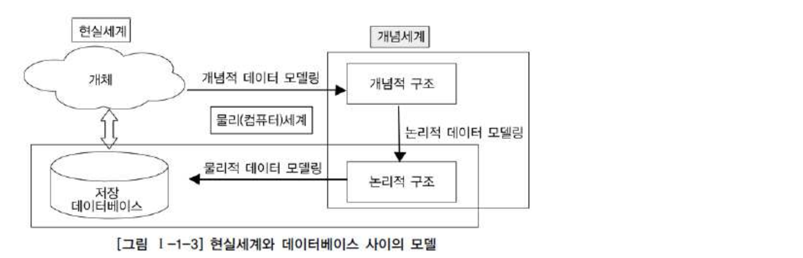

| 데이터 모델링        | 내용                                                         | 수준   |
| :------------------- | :----------------------------------------------------------- | :----- |
| 개념적 데이터 모델링 | 추상화 수준이 높고 업무중심적이고 포괄적인 수준의 모델링 진행. 전사적 데이터 모델릴, EA 수립시 많이 사용 | 추상적 |
| 논리적 데이터 모델링 | 시스템으로 구축하고자 하는 업무에 대해 Key, 속성, 관계 등을 정확하게 표현, 재사용성이 높음 |        |
| 물리적 데이터 모델링 | 실제로 데이터베이스에 이식할 수 있도록 성능, 저장 등 물리적인 성격을 고려하여 설계 | 구체적 |

## 5) 프로젝트 생명주기(Life Cycle)에서 데이터 모델링

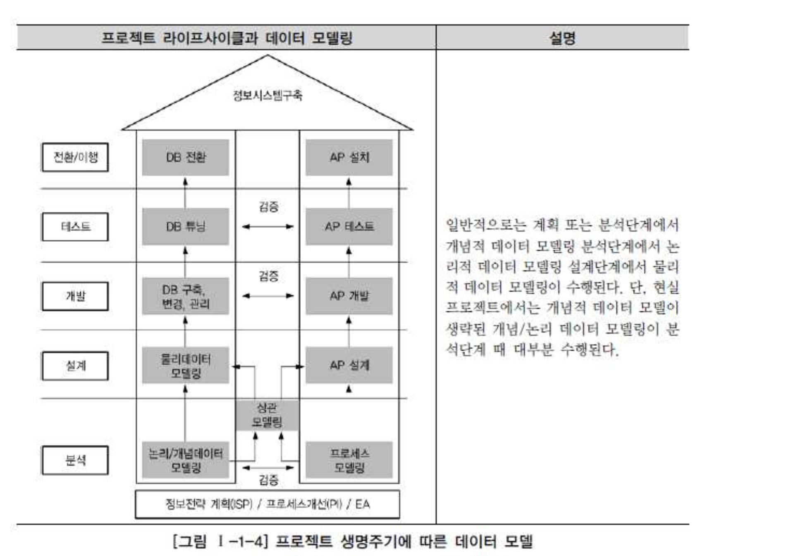

## 6) 데이터 모델링에서 데이터독립성의 이해

### 가. 데이터독립성의 필요성

- 데이터 독립성 필요
  - 유지보수 비용 증가
  - 데이터 중복성 증가
  - 데이터 복잡도 증가
  - 요구사항 대응 저하

### 나. 데이터베이스 3단계 구조

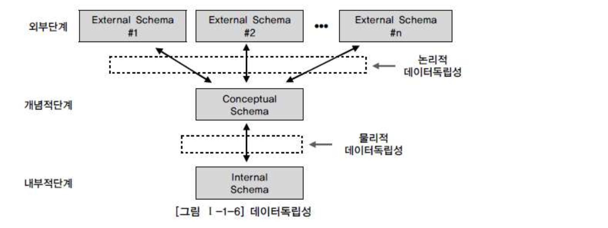

### 다. 데이터독립성 요소

| 항목                           | 내용                                                         | 비고                                         |
| :----------------------------- | :----------------------------------------------------------- | :------------------------------------------- |
| 외부스키마 (External Schema)   | \- View 단계, 여러 개의 사용자 관점으로 구성, 즉 개개 사용자 단계로서 개개 사용자가 보는 개인적 DB 스키마 - DB의 개별 사용자나 응용프로그래머가 접근하는 DB 정의 | 사용자 관점 접근하는 특성에 따른 스키마 구성 |
| 개념스키마 (Conceptual Schema) | \- 개념단계, 하나의 개념적 스키마로 구성, 모든사용자 관점을 통합한 조직 전체의 DB를 구성하는 것 - 모든 응용시스템들이나 사용자들이 필요로 하는 데이터를 통합한 조직 전체의 DB를 기술한 것으로 DB에 저장되는 데이터와 그들간의 관계를 표현한 스키마 | 통합관점                                     |
| 내부스키마 (Internal Schema)   | \- 내부단계, 내부 스키마로 구성, DB가 물리적으로 저장된 형식 - 물리적 장치에서 데이터가 실제적으로 저장되는 방법을 표현하는 스키마 | 물리적 저장구조                              |

### 라. 두 영역의 데이터독립성

| 독립성        | 내용                                                         | 특징                                                         |
| :------------ | :----------------------------------------------------------- | :----------------------------------------------------------- |
| 논리적 독립성 | \- 개념스키마가 변경되어도 외부스키마에는 영향을 미치지 않도록 지원하는 것 - 논리적 구조가 변경되어도 응용프로그램에 영향 없음 | \- 사용자 특성에 맞는 변경 가능 - 통합 구조 변경 가능        |
| 물리적 독립성 | \- 내부스키마가 변경되어도 외부/개념 스키마는 영향을 받지 않도록 지원하는 것 - 저장장치의 구조변경은 응용프로그램과 개념스키마에 영향 없음 | \- 물리적 구조 영향 없이 개념구조 변경 가능 - 개념구조 영향 없이 물리적 구조 변경 가능 |

### 마. 사상(Mapping)

| 사상                            | 내용                                                      | 예                                                           |
| :------------------------------ | :-------------------------------------------------------- | :----------------------------------------------------------- |
| 외부적/개념적 사상 (논리적사상) | \- 외부적 뷰와 개념적 뷰의 상호 관련성을 정의함           | 사용자가 접근하는 형식에 따라 다른 타입의 필드를 가질 수 있음. 개념적 뷰의 필드타입은 변화가 없음 |
| 개념적/내부적 사상 (물리적사상) | \- 개념적 뷰와 저장된 데이터베이스의 상호 관련성을 정의함 | 만약 저장된 데이터베이스 구조가 바뀐다면 개념적/내부적 사상이 바뀌어야 함. 그래야 개념적 스키마가 그대로 남아있게 됨 |

## 7) 데이터 모델링의 중요한 세 가지 개념

### 가. 데이터 모델링의 세 가지 요소

- 업무가 관여하는 어떤 것(Things)
- 어떤 것이 가지는 성격(Attributes)
- 업무가 관여하는 어떤것 간의 관계(Relationships)

### 나. 단수와 집합(복수)의 명령

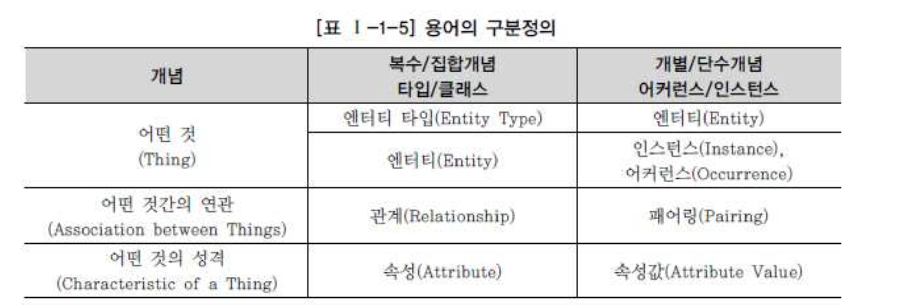

## 8) 데이터 모델링의 이해관계자

### 가. 이해관계자의 데이터 모델링 중요성 인식

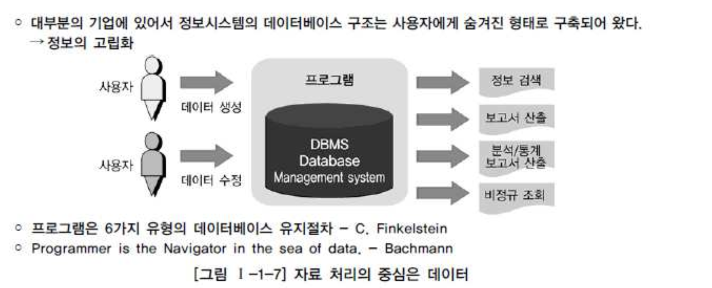

### 나. 데이터 모델링의 이해관계자

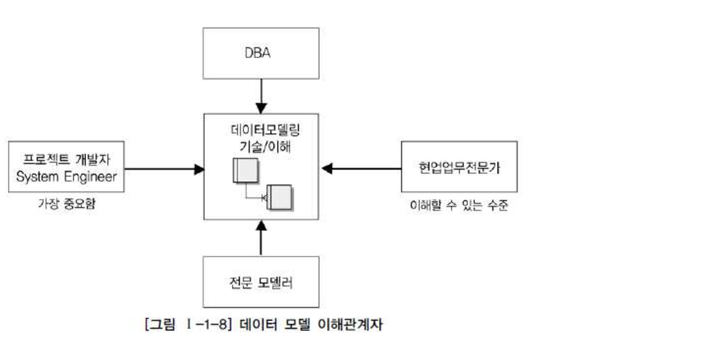

## 9) 데이터 모델링의 표기법인 ERD의 이해

### 가. 데이터 모델 표기법

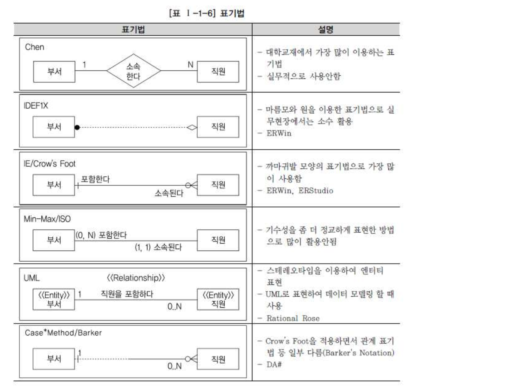

### 나. ERD(Entity Relationship Diagram) 표기법을 이용하여 모델링하는 방법

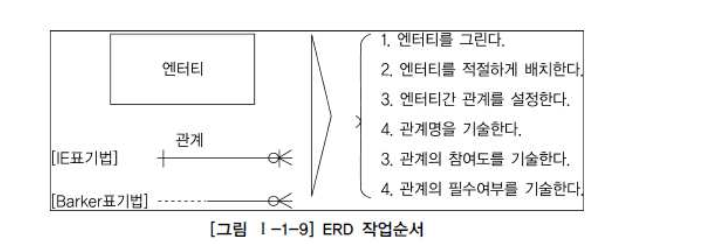

###### 1) ERD 작업순서

- 1. 엔터티를 그린다.
- 2. 엔터티를 적절하게 배치한다.
- 3. 엔터티간 관계를 설정한다.
- 4. 관계명을 기술한다.
- 5. 관계의 참여도를 기술한다.
- 6. 관계의 필수여부를 기술한다.

###### 2) 엔터티 배치

###### 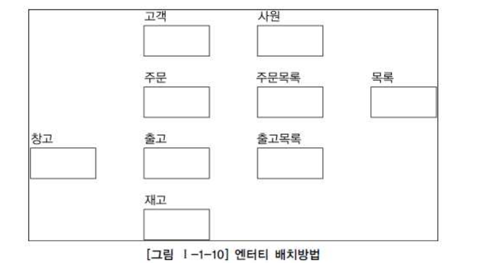

- 좌에서 우로, 위에서 아래로
- 가장 중요한 고객과 주문을 좌측 상단에 배치
- 주문에 따른 출고 및 재고 를 주문의 아래에 차례로 배치
- 업무 흐름의 중심이 되는 엔터티(주문, 출고, 주문목록, 출고목록)를 중앙에 배치
- 중심 엔터티와 관계있는 엔터티(창고, 고객, 사원, 재고)를 주위에 배치

###### 3) ERD 관계의 연결

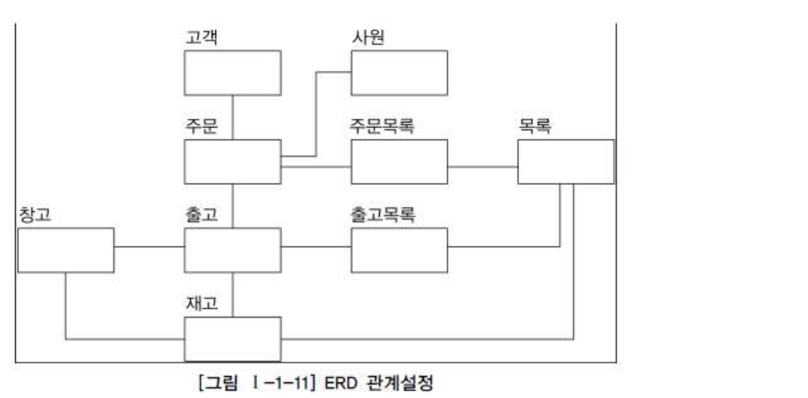

- 서로 관련있는 엔터티간의 관계를 설정
- 초기에는 모두 PK 로 속성이 상속되는 식별자 관계를 설정
- 중복관계, Cycle 관계 등을 유의

###### 4) ERD 관계명의 표시

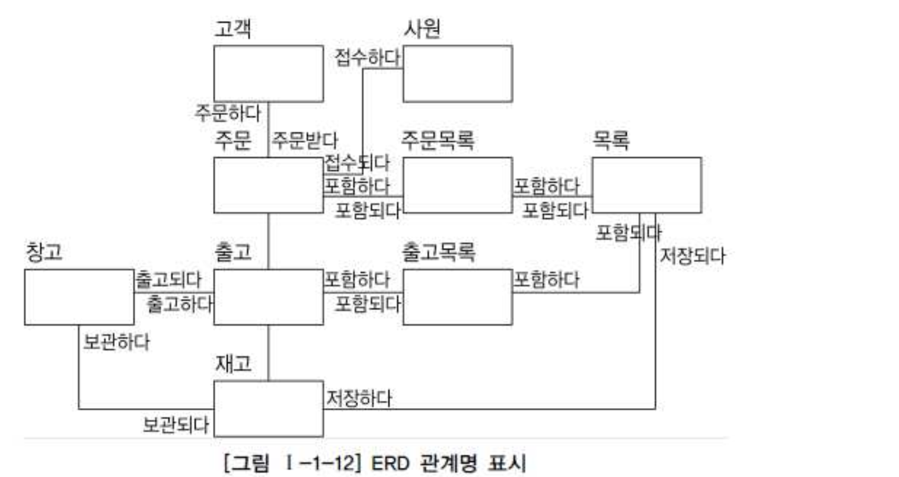

- 관계이름은 현재형을 사용
- 지나치게 포괄적인 용어(예, 이다, 가진다 등)은 사용하지 않도록
- 실무에서는 생략해도 무방 - 관계명이 없어도 ERD의 흐름을 알 수 있다.

###### 5) ERD 관계 관계차수와 선택성 표시

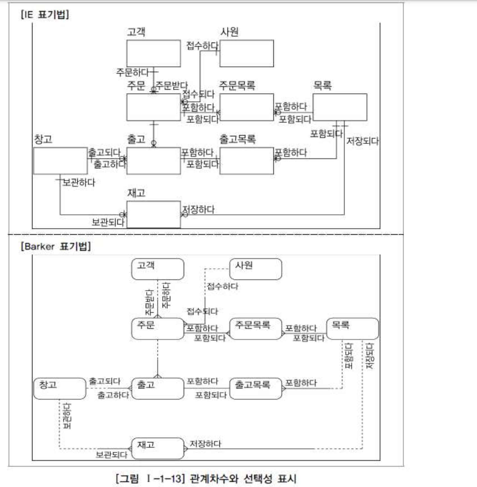

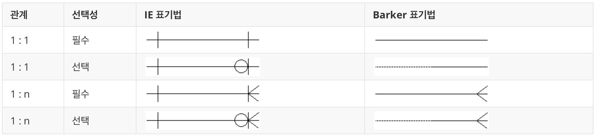

## 10) 좋은 데이터 모델의 요소

### 가. 완전성(Completeness)

- 업무에서 필요로 하는 모든 데이터가 모델에 정의되어 있어야 한다.

### 나. 중복배제(Non-Redundancy)

- 하나의 데이터베이스에 동일한 사실은 반드시 한번만 기록되어야 한다.
- 중복시 문제점
  - 저장공간의 낭비
  - 일관성 유지를 위한 추가 비용 발생

### 다. 업무규칙(Business Rules)

- 업무규칙(Business Rules)을 데이터 모델링에 표현하고, 모든 사용자가 공유한다.
- 모든 사용자(개발자, 관리자)가 해당 규칙에 대해 동일하게 판단하고 데이터를 조작할 수 있게 된다.
- 업무규칙이 명확하게 표현되지 않았다면
  - 각각의 사용자가 같은 업무를 다르게 판단 할 수 있다.

### 라. 데이터 재사용(Data Reusability)

###### 통합성

- 과거 시스템은 각각의 업무 영역별 데이터 별도 관리
- 전사적 관점에서 공통데이터를 도출하고 이를 전 영역에서 사용하기 적절한 형태로 설계하여야 한다.
- 이러한 통합 데이터 모델이어야 데이터 재사용성을 향상시킬 수 있다.

###### 독립성

- 과거 시스템은 데이터 모델이 별도로 없이 어플리케이션의 부속품 정도로 여겨졌다.
- 이경우 데이터는 각각의 업무 프로세스에 종속적일수밖에 없고
- 중복데이터 발생, 일관성 저하, 재사용성이 떨어지게 된다.
- 따라서 데이터가 어플리케이션에 독립적으로 설계되어야만 데이터 재사용성을 향상시킬 수 있다.

###### 확장성, 유연성

- 정보시스템은 비즈니스 변화에 대해 최적의 적응을 요구한다.
- 비즈니스 변화에 유연하게 대처하고 확장이 용이한 데이터 설계가 필요하다
- 확장성, 유연성이 떨어질 경우 작은 업무 변경에도 시스템 기반이 흔들리게 된다.

###### 합리적 균형이 있으면서도 단순하게 분류하는 것

- 예를 들면, 동일한 계약 업무를 수행하기 위한 테이블이 A보험사는 10개, B보험사는 100개라면?
- A사의 데이터 모델은 단순하지만 새로운 업무환경 변화에 대해서 확장성을 가지고 있다.
- B사는 업무환경 변화(신규상품출현 등)에 적응하지 못하고 데이터 모델의 한계로 테이블 갯수를 늘려왔다.
- 간결한 모델의 전제조건은 통합.

### 마. 의사소통(Communication)

- 데이터 모델은 대상 업무를 데이터 관점에서 분석하고 설계하여 나오는 최종 산출물이다.
- 분석과정에서 도출되는 수많은 업무 규칙들은 최대한 자세하게 표현되어야 한다.
- 모든 관련자들이 데이터 모델을 통해 의사소통을 할 수 있도록 자세하게 기술해야 한다.

### 바. 통합성(Integration)

- "라. 데이터 재사용" 부분 참조.