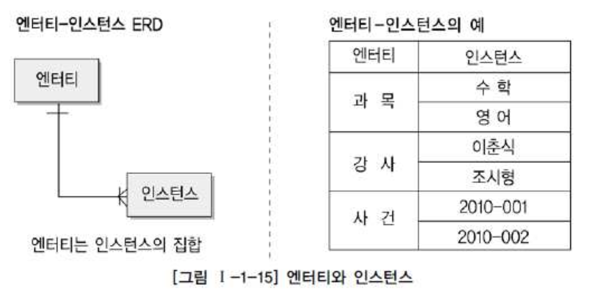
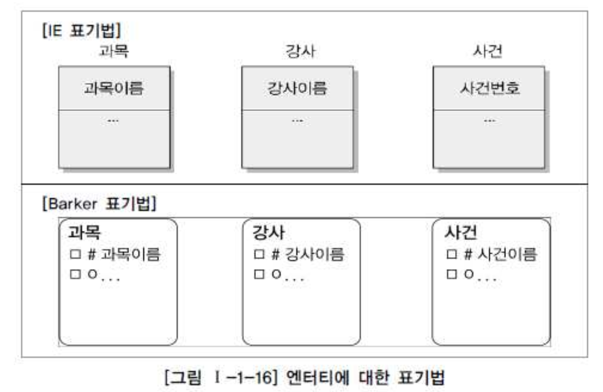
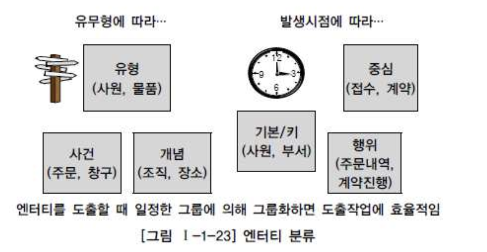

# 02. 엔터티

##  1. Entity 의 개념

- Entity : 실체, 객체

#### 예전에 정의된 Entity

- 변별할수 있는 사물 - Peter Chen (1976) -
- 데이터베이스 내에서 변별 가능한 객체 - C.J Date (1986) -
- 정보를 저장할 수 있는 어떤 것 - James Martin (1989) -
- 정보가 저장될 수 있는 사람, 장소, 물건, 사건 그리고 개념 등 - Thomas Bruce (1992) -

#### 위 정의들의 공통점

- 엔터티는 사람, 장소, 물건, 사건, 개념등의 명사에 해당한다.
- 엔터티는 엄무상 관리가 필요한 관심사에 해당한다.
- 엔터티는 저장이 되기 위한 어떤 것이다.

## 2. Entity 와 Instance 에 대한 내용과 표기법

- Entity(객체), Instance(사례, 경우)
- Entity 는 Instance 의 집합

## 3. Entity 의 특징

###### 가. 업무에서 필요로 하는 정보

- 반드시 해당 업무에서 필요하고, 관리하고자 하는 정보이어야 한다.

| 병원시스템 | Entity   | 인사시스템 |
| :--------- | :------- | :--------- |
| O          | 환자     | X          |
| X          | 토익점수 | O          |

###### 나. 식별이 가능해야 함

- 유일한 식별자에 의해 식별이 가능해야 한다.

###### 다. Instance 의 집합

- 영속적으로 존재하는 Instance 의 집합
- 2개 이상의 Instance 의 집합
- 1개의 Instance 로 이루어진 *집합*은 Entity 가 아니다.(?)

###### 라. 업무 프로세스에 의해 이용

- 업무 프로세스가 반드시 그 Entity 를 이용해야 한다.

###### 마. 속성을 포함

- Entity 에는 반드시 속성(Attributes)이 포함되어야 한다.
- 식별자만 존재하고 일반 속성이 전혀 없는 객체는 Entity 가 될 수 없다.
  단, 관계 Entity 의 경우엔 주 식별자 속성만으로도 Entity 로 인정

###### 바. 관계의 존재

- Entity 는 다른 Entity 와 최소 한개 이상의 관계가 존재하여야 한다.

- 데이터모델링에서 관계를 생략하여 표현하는 경우

  - 1) 통계를 위한 데이터 : 통계만을 위한 Read Only Table

  - 2) 코드성 Entity

    - 너무 많은 Entity 들과의 관계로 데이터 모델이 복잡해짐
    - 일반적으로 코드 테이블에 FK 를 설정하지 않는 경우가 대부분이다.

  - 3) 시스템 처리시 내부적으로 필요한 Entity : 로그 테이블

## 4. Entity 의 분류

###### 가. 유무(有無)형에 따른 분류

| 구분                           | 특징                                                         | 예시             |
| :----------------------------- | :----------------------------------------------------------- | :--------------- |
| 유형엔터티 (Tangible Entity)   | 물리적 형태가 있고 안정적이며 지속적으로 활용되는 Entity 업무로부터 Entity 를 구분하기가 가장 용이하다. | 사원, 물품, 강사 |
| 개념엔터티 (Conceptual Entity) | 물리적 형태는 존재하지 않고 관리해야할 개념적 정보로 구분이 되는 Entity | 조직, 보험상품   |
| 사건엔터티 (Event Entity)      | 업무를 수행함에 따라 발생되는 Entity 비교적 발생량이 많으며 각종 통계자료에 이용될 수 있다. | 주문, 청구, 미납 |

###### 나. 발생시점(發生時點)에 따른 분류

| 구분                                        | 특징                                                         | 예시                         |
| :------------------------------------------ | :----------------------------------------------------------- | :--------------------------- |
| 기본엔터티 (Fundamental Entity, Key Entity) | 그 업무에 원래 존재하는 정보로서 다른 Entity와 관계에 의해 생성되지 않고 독립적으로 생성 가능 다른 Entity로부터 주식별자를 상속받지 않고 자신의 고유 식별자를 가짐 | 사원, 부서, 고객, 상품, 자재 |
| 중심엔터티 (Main Entity)                    | 기본 Entity로부터 발생되고, 그 업무에 있어서 중요한 역할을 한다. 데이터량이 많이 발생되고 다른 Entity와의 관계를 통해 행위Entity를 생성한다. | 계약, 사고, 청구, 주문, 매출 |
| 행위엔터티 (Active Entity)                  | 두개 이상의 부모 Entity로부터 발생되고 자주 내용이 바뀌거나 데이터량이 증가된다. 분석초기단계에서는 잘 나타나지 않으며 상세설계나 프로세스와 상관모델링을 하면서 도출될 수 있다. | 주문목록, 사원변경이력       |

###### 다. Entity 분류 방법의 예

## 5. Entity 의 명명

- 가능하면 현업업무에서 사용하는 용어를 사용
- 가능하면 약어를 사용하지 않는다.
- 가능하면 단수명사를 사용한다.
- 모든 Entity 에서 유일하게 이름이 부여되어야 한다.
- Entity 생성의미대로 이름을 부여한다.
