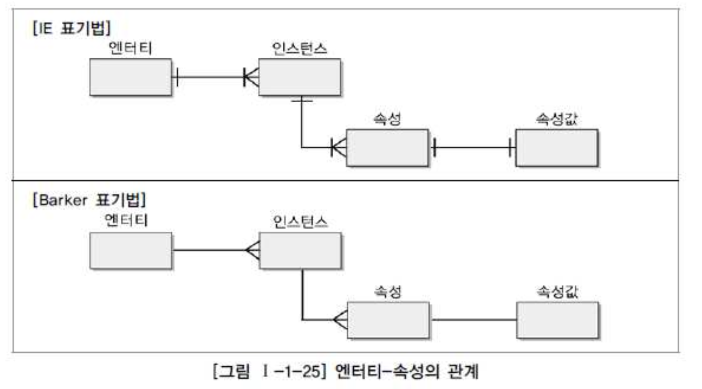
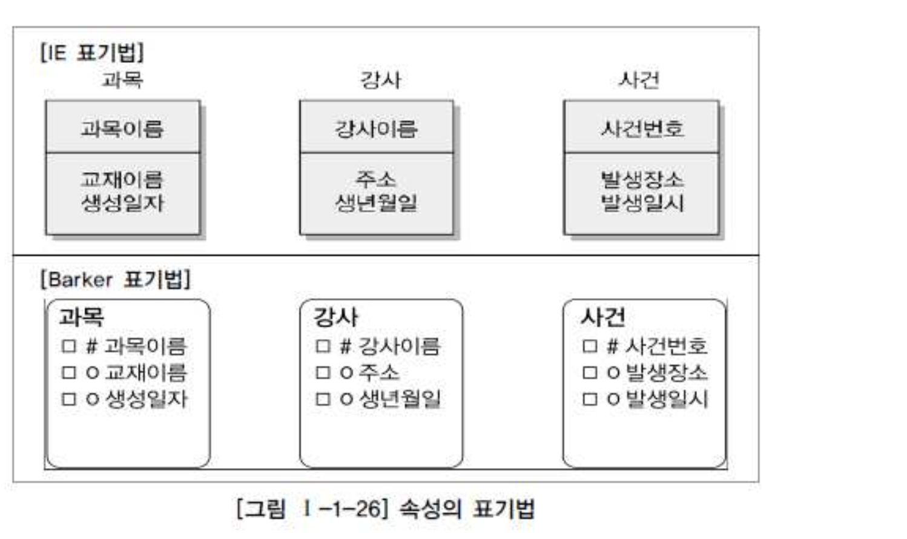
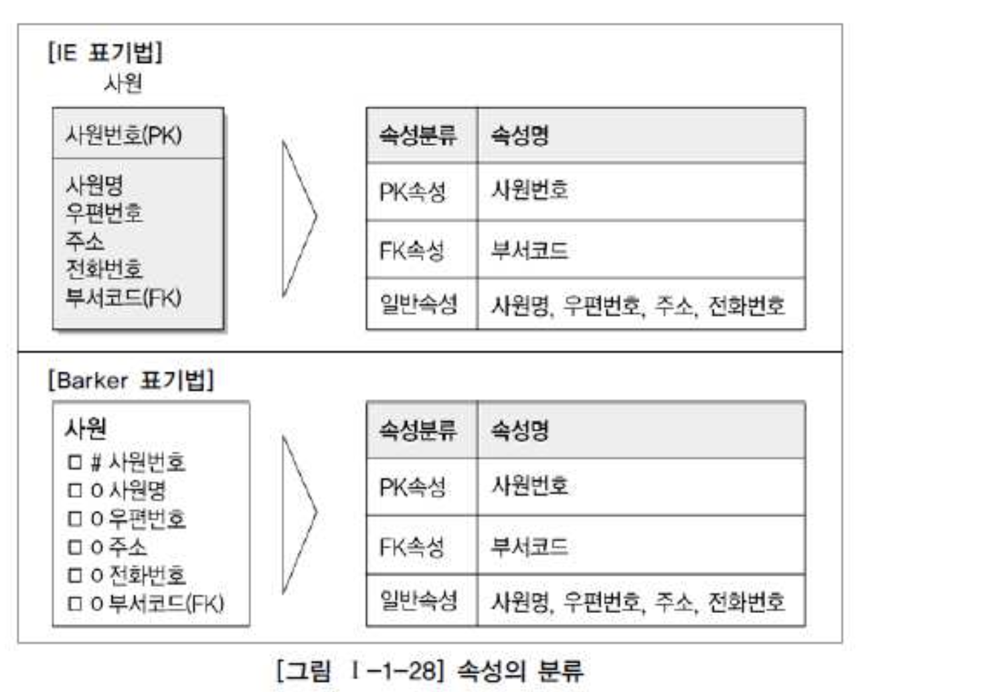

# 03. 속성

##  1. 속성(Attribute)의 개념

#### 속성(Attribute) 의 사전적 의미

- 사물의 성질, 특징, 또는 본질적인 성질, 그것이 없다면 실체를 생각할 수 없는 것
- 본질적 송석이란 어떤 사물 또는 개념에 없어서는 안될 징표의 전부이다.
- 징표는 사물이나 개념이 어떤것인지를 나타내고 그것을 다른 것과 구별하는 성질

#### 데이터 모델링 관점에서 속성(Attribute) 의 정의

- 업무에서 필요로 하는 인스턴스로 관리하고자 하는 의미상 더이상 분리되지 않는 최소의 데이터 단위
- 엄무상 관리하기 위한 최소의 의미 단위
- 속성은 엔터티를 성명하고
- 속성은 인스턴스의 구성요소

###### 예시

- 생년월일은 그 자체로 의미가 있으므로 속성이라 할 수 있다.
- 생년, 생월, 생일 로 분리가 가능하지만 이는 하나의 속성을 관리목적으로 분리한 것일 뿐 각각을 속성이라 할수는 없다.
- 이름과 주소는 각각 의미있는 속성이지만 '이름주소'로 묶는다면?
- 하나의 속성이 두가지 의미를 가지므로 기본 속성이라 할 수 없다.
- 차라리 '이름주소'가 아닌 '인적사항'정도로 관리한다면 속성으로 볼수도 있다.

## 2. 엔터티, 인스턴스와 속성, 속성값에 대한 내용과 표기법

###### 가. 엔터티, 인스턴스, 속성, 속성값의 관계

###### 나. 속성의 표기법

## 3. 속성의 특징

- Entity 와 마찬가지로 해당 업무에서 필요하고 관리하고자 하는 정보
- 정규화 이론에 근간하여 정해진 주식별자에 함수적 종속성을 가져야 한다.
- 하나의 속성은 하나의 값만 가진다.
- 하나의 속성에 여러개의 값이 있는 경우, 별도의 Entity 를 이용하여 분리한다.

## 4. 속성의 분류

#### 가. 속성의 특성에 따른 분류

- 기본속성 : 업무로부터 추출한 모든 속성
- 설계속성 : 코드성 데이터, Entity 식별용 일련번호
- 파생속성 : 다른 속성에 영향을 받아 발생하는 속성, 계산된 값, 합계, 재고, 잔액
  - 파생속성은 그속성이 가지고 있는 계산방법에 대해 반드시 어떤 엔터티에 어떤 속성에 의 해 영향을 받는지 정의가 되어야 한다.
  - 타 속성에 의해 지속적으로 영향을 받아 자신의 값이 변하는 성질을 가지고 있는 속성
  - 파생속성은 꼭 필요한 경우에만 정의하여 업무로직이 속성내부로 스며들지 못하도록 주의해야 한다.
  - 파생속성을 정의한 경우라면 그 값의 정합성을 유지할 수 있도록 해야 한다.
  - 통계관련 엔터티, 배치작업 수행 관련

#### 나. 엔터티 구성방식에 따른 분류

## 5. 도메인(Domain)

- 속성이 가질 수 있는 값의 범위

| Attribute | Domain        |
| :-------- | :------------ |
| 학점      | 0.0~4.0 실수  |
| 주소      | 20자리 문자열 |

## 6. 속성의 명명(Naming)

- 용어사전 : 속성 이름을 정확하게 부여하고, 용어의 혼란을 없애기 위함
- 도메인정의 : 각 속성이 가지는 값의 범위를 명확하게 하기 위해

#### 속성명 부여 원칙

- 해당 업무에서 사용하는 이름을 부여한다.
- 서술식 속성명은 사용하지 않는다.
-  약어사용은 가급적 제한한다.
- 전체 데이터 모델에서 유일성 확보하는 것이 좋다.
