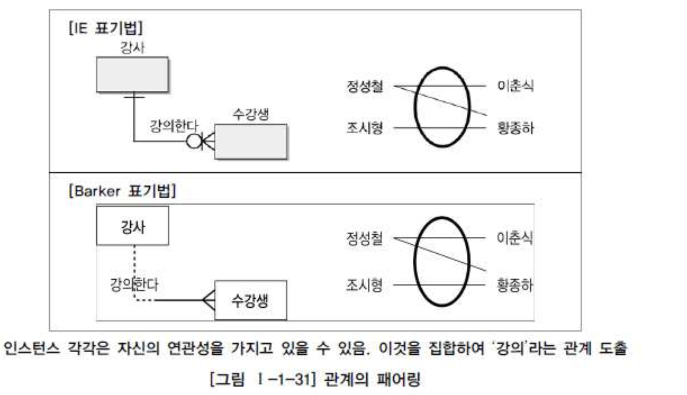
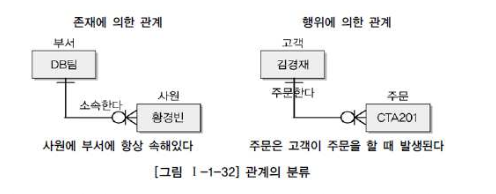
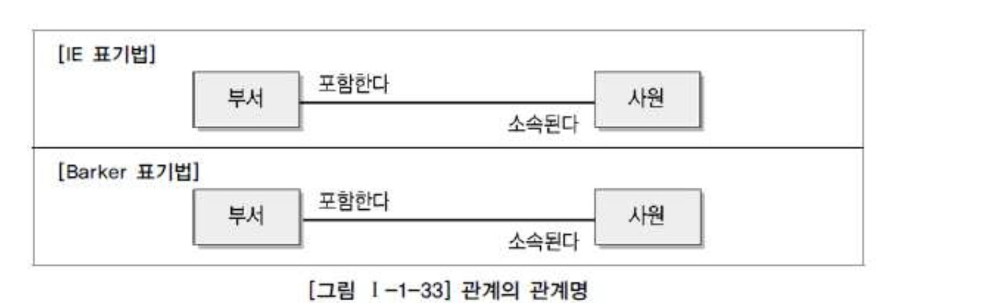
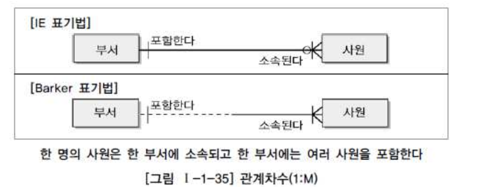
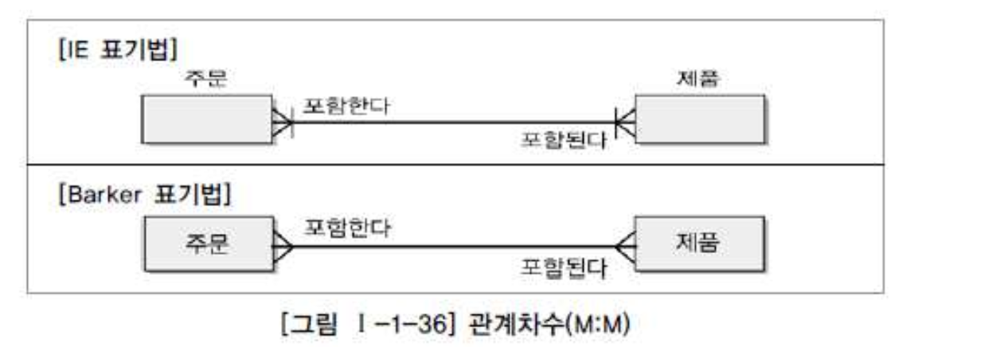
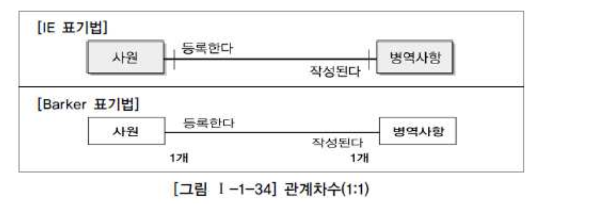
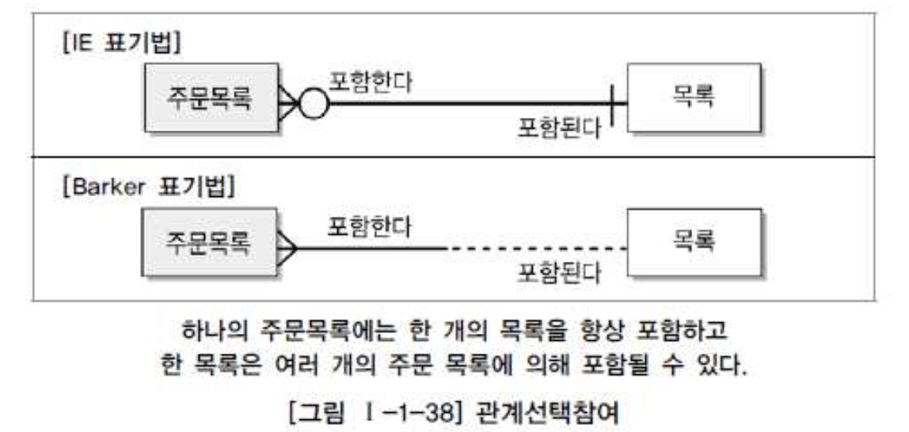
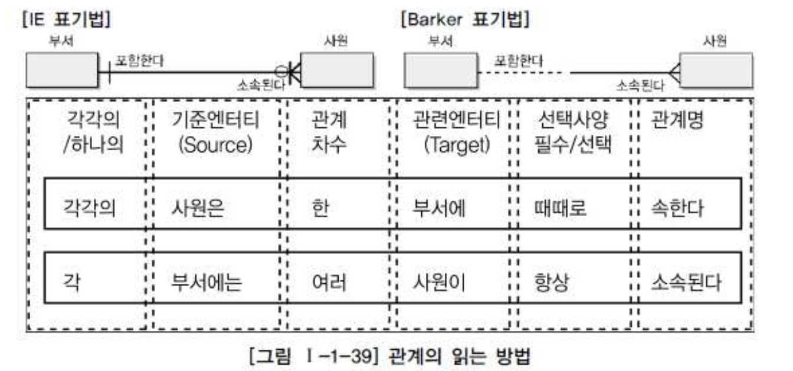

# 04. 관계

## 1. 관계의 개념

#### 가. 관계의 정의

- 인스턴스 사이의 논리적 연관성으로서 존재 또는 행위로서 서로에게 연관성이 부여된 상태

#### 나. 관계의 페어링(Relationship Paring)

- Relationship 은 Entity 안의 Instance 가 개별적으로 관계를 가지는 것(Paring)이고 이것의 집합을 관계로 표현한다는 것이다.
- 따라서 개별 인스턴스가 각각 다른 종류의 관계를 가지고 있다면 두 Entity 사이에 2개 이상의 관계가 형성 될 수 있다.

## 2. 관계의 분류

## 3. 관계의 표기법

#### 가. 관계명(Membership) : 관계의 이름

#### 나. 관계차수(Degree / Cardinality) : 1:1, 1:M, M:N

#### 다. 관계선택사양(Optionality) : 필수관계, 선택관계

## 4. 관계의 정의 및 읽는 방법

#### 가. 관계 체크사항

- 두개의 Entity 사이에 관심있는 연관규칙이 존재하는가?
- 두개의 Entity 사이에 정보조합이 발생되는가?
- 업무기술서, 장표에 관계연결에 대한 규칙이 서술되어 있는가?
- 업무기술서, 장표에 관계연결을 가능하게 하는 동사(Verb)가 있는가?

#### 나. 관계 읽기

