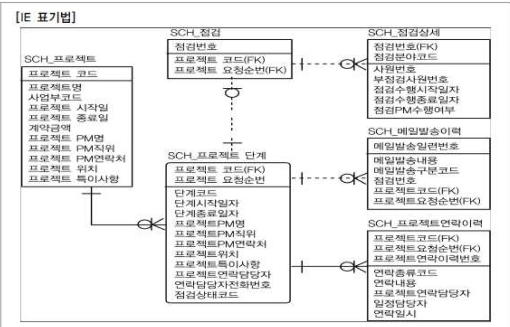

# 05. 식별자

## 1. 식별자의 개념

- Entity 내에서 Instance 들을 구분할 수 있는 구분자

## 2. 식별자의 특징

| 특징   | 내용                                                         | 비고                                                         |
| :----- | :----------------------------------------------------------- | :----------------------------------------------------------- |
| 유일성 | 주식별자에 의해 Enriry 내 모든 Instance 들을 유일하게 구분함 | 예) 사원번호가 주식별자가 모든 직원들에 대해 개인별로 고유번호 부여됨 |
| 최소성 | 주식별자를 구성하는 속성의 수는 유일성을 만족하는 최소의 수가 되어야 함 | 예) 사원번호만으로도 고유한 구조 사원분류코드+사원번허는 부적절함 |
| 불변성 | 주식별자가 한번 특정 Entity 에지정되면 그값은 변하지 말아야 함 | 예) 사원번호의 값이 변한다는 의미는 이기록이 말소되고 새로운 기록이 발생되는 개념임 |
| 존재성 | 주식별자가 지정되면 반드시 데이터값이 존재(Null 안됨)        | 사원번호 없는 회사직원은 있을 수 없음.                       |

## 3. 식별자 분류 및 표기법

##### 가. 식별자 분류

| 분류           | 식별자     | 설명                                                         |
| :------------- | :--------- | :----------------------------------------------------------- |
| 대표성여부     | 주식별자   | 엔터티 내에서 각 어커런스를 구분할 수 있는 구분자이며, 타 엔터티와 참조관계를 연결할 수 있는 식별자 |
|                | 보조식별자 | 엔터티 내에서 각 어커런스를 구분할 수 있는 구분자이나 대표성을 가지지 못해 참조관계 연결을 못함 |
| 스스로생성여부 | 내부식별자 | 엔터티 내부에서 스스로 만들어 지는 식별자                    |
|                | 외부식별자 | 타 엔터티와의 관계를 통해 타 엔터티로부터 받아오는 식별자    |
| 속성의 수      | 단일식별자 | 하나의 속성으로 구성된 식별자                                |
|                | 복합식별자 | 둘 이상의 속성으로 구성된 식별자                             |
| 대체성여부     | 본질식별자 | 업무에 의해 만들어 지는 식별자                               |
|                | 인조식별자 | 업무적으로 만들어지지는 않지만 원조식별자가 복잡하 구성을 가지고 있기 때문에인위적으로 만드는 식별자 |

##### 나. 식별자 표기법

### 4. 주식별자 도출 기준

#### 가. 해당 업무에서 자주 이용되는 속성을 주식별자로 지정하도록 함

#### 나. 명칭, 내역 등과 같이 이름으로 기술되는 것은 피함

#### 다. 속성의 수가 많아지지 않도록 함

## 5. 식별자관계와 비식별자관계에 따른 식별자

##### 가. 식별자관계와 비식별자관계의 결정

- 부모 자식간의 관계에 의해 외부식별자가 생성된다.

###### 이때 부모로부터 받은 외부식별자를

- 자신의 주식별자로 이용할 것인지? --> 식별자관계
- 부모와 연결이 되는 속성으로만 이용할 것인지? --> 비식별자관계 결정해야 한다.

##### 나. 식별자관계

##### 다. 비식별자관계

##### 라. 식별자관계로만 설정할 경우 문제점

##### 마. 비식별자관계로만 설정할 경우 문제점

##### 바. 식별자관계와 비식별자관계 모델링

###### 1) 비식별관계 선택 프로세스

###### 2) 식별자와 비식별자관계 비교

| 항목               | 식별자관계                                                   | 비식별자관계                                                 |
| :----------------- | :----------------------------------------------------------- | :----------------------------------------------------------- |
| 목적               | 강한 연결관계 표현                                           | 약한 연결관계 표현                                           |
| 자식 주식별자 영향 | 자식 주식별자의 구성에 포함                                  | 자식 일반속성에 포함                                         |
| 표기법             | 실선 표현                                                    | 점선 표현                                                    |
| 연결 고려사항      | \- 반드시 부모엔터티 종속 - 자식 주식별자 구성에 부모 주식별자 포함 필요 - 상속받은 주식별자속성을 타 엔터티에 이전 필요 | \- 약한 종속관계 - 자식 주식별자 구성을 독립적으로 구성 - 자식 주식별자 구성에 부모 주식별자 부분 필요 - 상속받은 주식별자속성을 타 엔터티에 차단 필요 - 부모쪽의 관계참여가 선택관계 |

###### 3) 식별자와 비식별자를 적용한 데이터 모델

