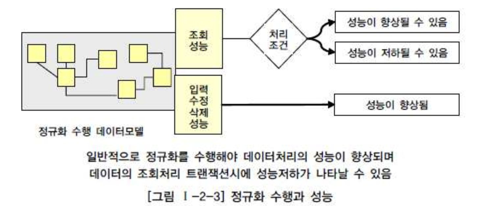
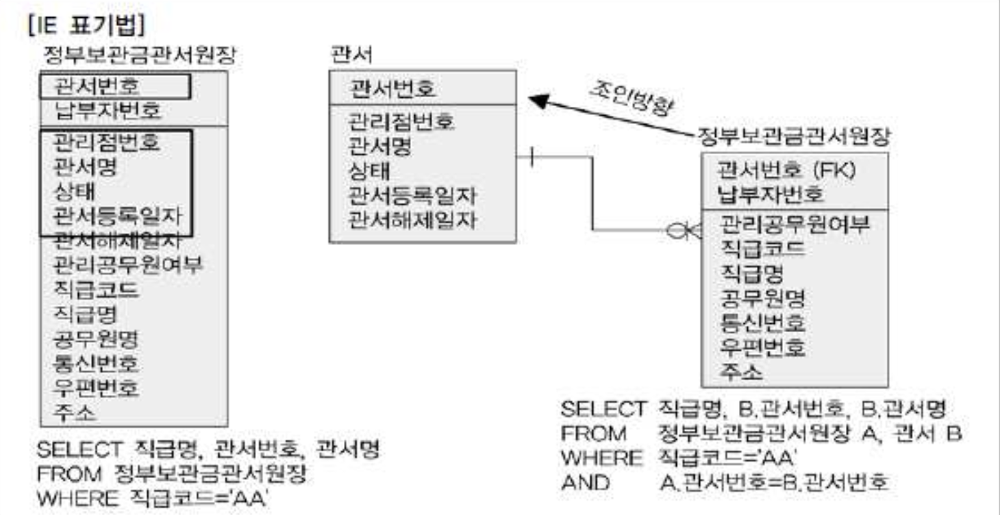

# 02. 정규화와 성능

### 정규화

- 정규화(Normalization)란 다양한 유형의 검사를 통해 데이터 모델을 좀 더 구조화하고 개선시켜 나가는 절차에 관련된 이론이다.

| 정규화종류         | 정규화내용                                                   |
| :----------------- | :----------------------------------------------------------- |
| 1차 정규화         | 복수의 속성값을 갖는 속성을 분리                             |
| 2차 정규화         | 주식별자에 종속적이지 않은 속성을 분리. 부분종속 속성을 분리 |
| 3차 정규화         | 속성에 종속적인 속성의 분리, 이전 종속(Transitive Dependency) 속성을 분리 |
| 보이스-코드 정규화 | 다수의 주식별자 분리                                         |
| 4차 정규화         | 다가 종속(Multi-Valued Dependency) 속성 분리                 |
| 5차 정규화         | 결합 종속(Join Dependency)일 경우는 두 개 이상의 N개로 분리  |

## 1. 정규화를 통한 성능 향상 전략

- 정규화를 하는 것은 기본적으로 데이터에 대한 중복성을 제거해주고, 데이터가 관심사별로 모여있게 되므로 성능이 향상된다.
- 물론, 엔티티가 계속 발생되고, 그에 따라 조인이 많이 발생하므로 이로 인해 성능이 저하되기도 하지만 이런 부분은 사례별로 유의하여 반정규화를 적용하는 전략이 필요하다.

###### 정규화를 수행하면 항상 조회시 성능이 저하되는가?

- 처리조건에 따라서 조회서능이 향상될 수도, 저하될 수도 있다.
- 정규화가 수행된 모델은 입력/수정/삭제할 때 일반적으로 반정규화된 테이블에 비해 처리성능이 향상 된다.

## 2. 반정규화된 테이블의 성능저하 사례1

###### 2차 정규화를 적용하여 성능이 향상된 사례

###### 직급명,관서번호,관서명 조회하기

- 정부보관금관서원장 테이블에서 주식별자를 구성하는 일부속성인 '관서번호'에만 종속적인 속성(관리점번호,관서명,상태,관서등록일자,관서해제일자)들을 별도의 테이블(관서)로 분리함
- 별도의 테이블로 분리되어 테이블간의 조인이 발생하더라도 PK Unique Index를 이용할 수 있었기 때문에, 성능저하는 아주 미미하다.

###### 관서등록일자가 2010년 이후 관서를 모두 조회하기

- 납부자번호만큼 누적된 데이터를 읽어서 결과를 구분해 보여주던 것을, 관서수만큼만 존재하는 데이터를 읽어 곧바로 보여주기 때문에, 정규화된 테이블이 훨씬 빠르다.

## 3. 반정규화된 테이블의 성능저하 사례2

###### 2차 정규화를 적용하여 성능이 향상된 사례

###### '서울 7호'에서 매각된 총매각금액, 총유찰금액을 산출하기

- 특정장소(서울7호)에 대해 매각일자를 찾아 매각내용을 조회하려면, 100만 건의 데이터를 읽어 매각일자를 DISTINCT하여 매각일자별매각내역이 조인된다.

- 일자별매각물건테이블에서 주식별자를 구성하는 일부속성인 '매각일자'에만 종속적인 속성(매각시간,매각장소)들을 별도의 테이블(매각기일)로 분리함.

  => 매각기일 테이블(5천건)과 매각일자별 매각내역과 조인하면 결과를 얻을 수 있으므로, 성능이 향상됨

## 4. 반정규화된 테이블의 성능저하 사례3

###### 1차 정규화를 적용하여 성능을 향상시킬 수 있는 사례

###### 유형분류코드에 따라 데이터를 조회

- 유형분류코드가 1~9까지의 속성으로 존재하며, 각 속성마다 인덱스를 생성해줘야 하는 문제가 발생
- 동일한 속성형식을 두개이상의 속성으로 나열해서 반정규화한 경우에 해당
- 로우 단위의 중복도 1차 정규화대상이 되지만, 컬럼단위의 중복도 1차 정규화의 대상이 된다.
- 유형을 관리하는 테이블(모델기능분류코드)을 별도로 만들고, 해당 테이블의 PK인덱스 하나만으로도 성능이 향상될 수 있다.

## 5. 반정규화된 테이블의 성능저하 사례4

###### 1차 정규화를 적용하여 성능젛를 예방할 수 있는 사례

- 동일한 속성형식(수량,주문수량,금액,주문금액)을 관리할 수 있는 테이블을 별도로 만들어, 일재고와 일재고상세를 구분함으로써 일재고에 발생되는 트랜잭션 성능저하를 예방할 수 있다.

## 6. 함수적 종속성(Functional Dependency)에 근거한 정규화 수행필요

- 함수의 종속성은 데이터들이 어떤 기준값에 의해 종속되는 현상을 지칭한다.
- 기준값을 결정자(Determinant), 종속되는 값을 종속자(Dependent)라고 한다.
- 예를 들어 주민등록번호가 신고되면 그 사람의 이름,출생지,주소가 생성되어 유일한 값을 갖게 되므로 '주민번호가 이름,출생지,주소를 함수적으로 결정한다'라고 말할 수 있다.
- 함수의 종속성은 데이터의 근본적인 속성으로, 정규화작업이나 각 오브젝트에 속성을 배치하는데 이 함수의 종속성을 이용한다.
