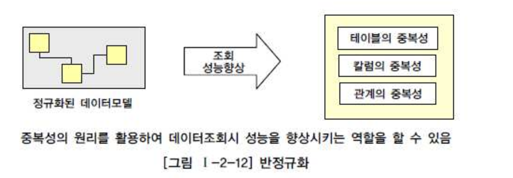
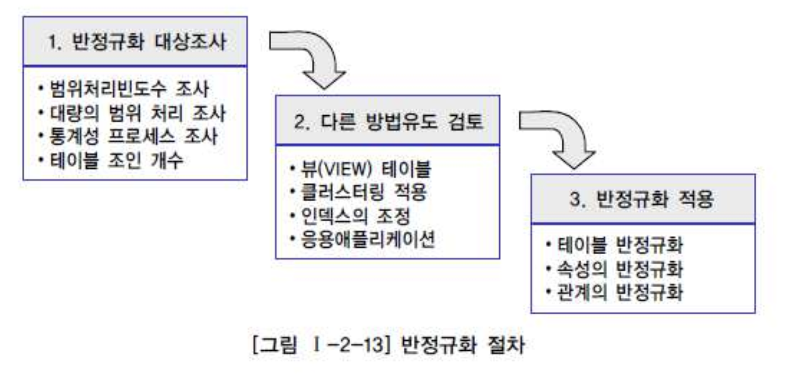
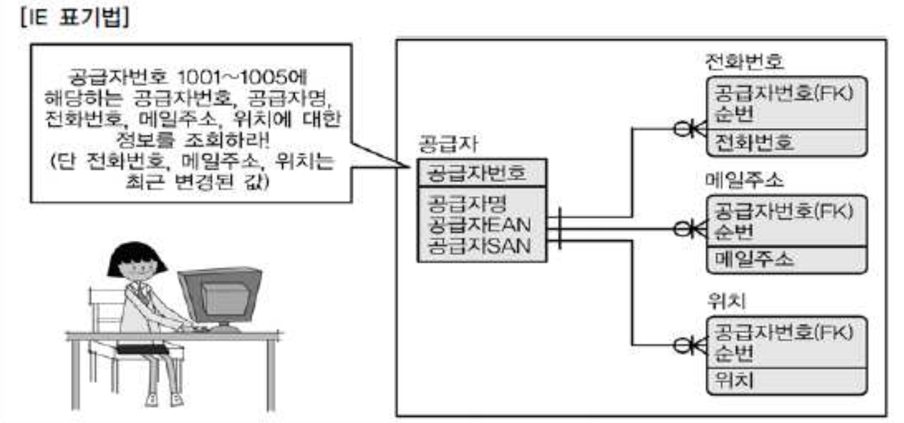
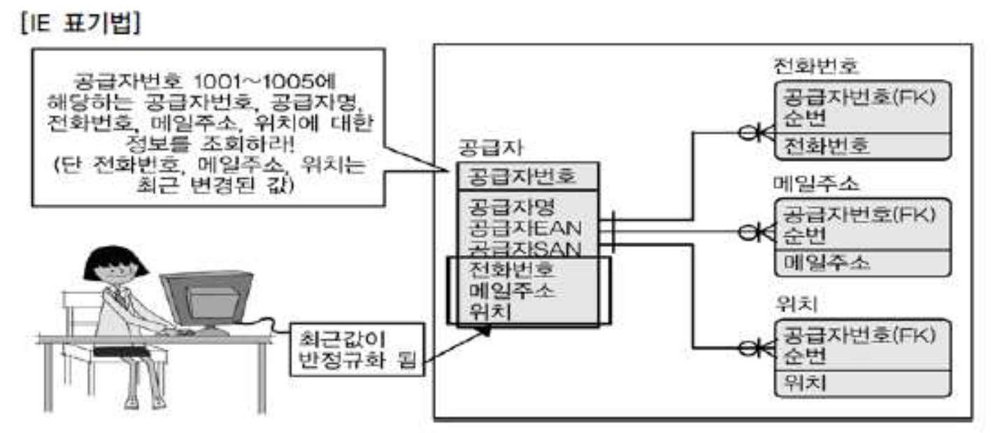
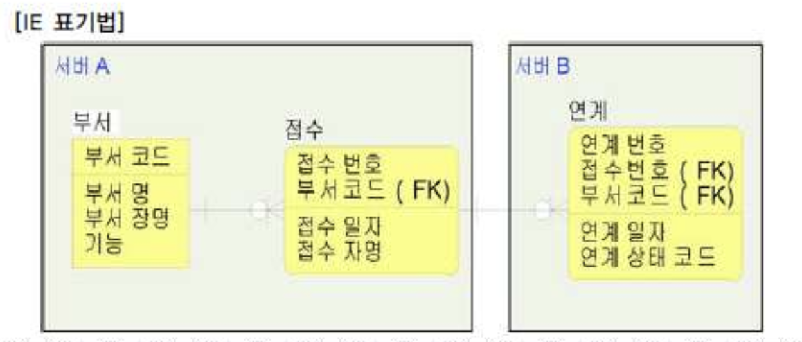
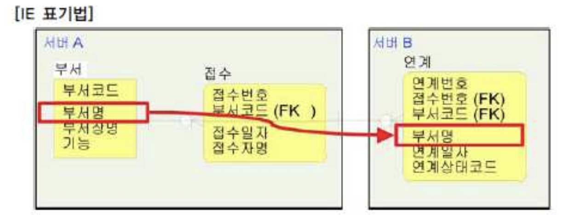

# 03. 반정규화와 성능

## 1. 반정규화를 통한 성능향상 전략

#### 가. 반정규화의 정의

- 반정규화는 정규화된 엔티티,속성,관계를 시스템의 성능향상 및 개발과 운영의 단순화를 위해 중복,통합,분리 등을 수행하는 데이터 모델링 기법이다.
- 디스크 I/O량이 많아서 조회시 성능이 저하되거나, 테이블끼리의 경로가 너무 멀어 조인으로 인한 성능저하가 예상되거나, 컬럼을 계산하여 읽을 때 성능이 저하될 것이 예상되는 경우 반정규화를 수행하게 된다.
- 업무적으로 조회에 대한 처리성능이 중요하다고 판단될때 부분적으로 반정규화를 고려하게 된다.

- 설계단계에서 반정규화를 적용하게 되며, 반정규화 미수행시에는 다음과 같은 현상이 발생된다.
  - 성능이 저하된 데이터베이스가 생성될 수 있다.
  - 구축단계나 시험단계에서 반정규화를 적용할 때 수정에 따른 노력비용이 많이 든다.

#### 나. 반정규화의 적용방법

- 반정규화에 대한 필요성이 결정되면 컬럼의 반정규화 뿐만 아니라, 테이블의 반정규화, 관계의 반정규화를 종합적으로 고려하여 적용해야 한다.
- 반정규화는 막연하게 중복을 유도하는 것만을 수행하기 보다는 성능을 향상시킬 수 있는 다른방법을 고려하고 그 이후에 반정규화를 적용하도록 해야 한다.

###### 반정규화의 대상을 조사한다.

- 자주 사용되는 테이블에 액세스하는 프로세스의 수가 가장 많고, 항상 일정한 범위만을 조회하는 경우에 반정규화를 검토한다.
- 테이블에 대량데이터가 있고 대량의 범위를 자주 처리하는 경우, 성능을 보장할 수 없는 경우에 반정규화를 검토한다.
- 통계성 프로세스에 의해 통계정보를 필요로 할 때, 별도의 통계테이블(반정규화)를 생성한다.
- 테이블에 지나치게 조인을 많이 하게 되어, 데이터를 조회하는 것이 기술적으로 어려울 경우 반정규화를 검토한다.

###### 반정규화의 대상에 대해 다른 방법으로 처리할 수 있는지 검토한다.

- 테이블에 많은 조인하여 데이터를 조회하는 것이 기술적으로 어려운 경우 VIew를 검토한다. 조회성능을 향상 시키지는 않지만, SQL작성의 미숙함으로 인하여 생기는 성능저하를 예방할 수 있다.
- 대량의 데이터처리나 부분처리에 의해 성능이 저하되는 경우 클러스터링을 적용하거나, 인덱스 조정을 통해 성능을 향상 시킬수 있다.
- 대량의 데이터는 PK의 성격에 따라 파티셔닝 기법을 적용하여 성능저하를 방지할 수 있다.
- 어플리케이션에서 로직을 구현하는 방법을 변경하므로써 성능을 향상 시킬수 있다.

###### 반정규화를 적용한다.

- 반정규화 대상으로는 테이블, 속성, 관계에 대해 적용할 수 있으며, 중복을 통한 방법만이 반정규화가 아니고, 테이블,속성,관계를 추가/분할/제거할 수도 있다.

## 2. 반정규화의 기법

#### 가. 테이블 반정규화

| 기법분류   | 기법                     | 내용                                                         |
| :--------- | :----------------------- | :----------------------------------------------------------- |
| 테이블병합 | 1:1 관계 테이블병합      | 1:1 관계를 통합하여 성능향상                                 |
|            | 1:M 관계 테이블병합      | 1:M 관계를 통합하여 성능향상                                 |
|            | 슈퍼/서브타입 테이블병합 | 슈퍼/서브 관계를 통합하여 성능향상                           |
| 테이블분할 | 수직분할                 | 컬럼단위의 테이블을 디스크 I/O를 분산처리하기 위해 테이블을 1:1로 분리하여 성능향상(트랜잭션의 처리되는 유형파악이 선행되어야 함) |
|            | 수평분할                 | 로우단위로 집중 발생되는 트랜잭션을 분석하여 디스크I/O 및 데이터 접근의 효율성을 높여 성능을 향상하기 위해 로우단위로 테이블을 쪼갬(관계가 없음) |
| 테이블추가 | 중복테이블 추가          | 다른 업무이거나 서버가 다른 경우 동일한 테이블구조를 중복하여 원격조인을 제거하여 성능을 향상 |
|            | 통계테이블 추가          | SUM,AVG 등을 미리 수행하여 계산해 둠으로써 조회시 성능을 향상 |
|            | 이력테이블 추가          | 이력테이블 중에서 마스터 테이블에 존재하는 레코드를 중복하여 이력테이블에 존재하는 방법 |
|            | 부분테이블 추가          | 하나의 테이블을 전체 칼럼 중 자주 이용하는 집중화된 컬럼이 있을 경우, 디스크I/O를 줄이기 위해 해당 컬럼들을 모아놓은 별도의 반정규화된 테이블을 생성 |

#### 나. 컬럼 반정규화

| 반정규화 기법                      | 내용                                                         |
| :--------------------------------- | :----------------------------------------------------------- |
| 중복컬럼 추가                      | 조인시 성능저하를 예방하기 위해,중복된 컬럼을 위치시킴       |
| 파생컬럼 추가                      | 트랜잭션이 처리되는 시점에 계산에 의해 발생되는 성능저하를 예방하기 위해, 미리 계산하여 컬럼에 보관 |
| 이력테이블 컬럼추가                | 대량의 이력데이터 처리시 불특정 일 조회나 최근 값을 조회할때 나타날 수 있는 성능저하를 예방하기 위해 기능성 컬럼(최근값여부, 시작일자,종료일자)을 추가함 |
| PK에 의한 컬럼추가                 | 복합의미를 갖는 PK를 단일속성으로 구성했을 때 발생되며, PK안에 데이터가 존재하지만 성능향상을 위해 일반속성으로 포함하는 방법 |
| 응용시스탬 오작동을 위한 컬럼 추가 | 업무적으로는 의미가 없으나, 데이터 처리시 오류로 인해 원래값으로 복구하길 원하는 경우 이전 데이터를 임시적으로 중복보관하는 방법 |

#### 다. 관계 반정규화

| 반정규화 기법 | 내용                                                         |
| :------------ | :----------------------------------------------------------- |
| 중복관계 추가 | 여러 경로를 거쳐 조인이 가능하지만, 성능저하를 예방하기 위해 추가적인 관계를 맺는 방법 |

- 테이블, 컬럼의 반정규화는 데이터 무결성에 영향을 미치나, 관계의 반정규화는 데이터 무결성을 깨뜨리지 않고도 성능을 향상시킬 수 있는 반정규화의 기법이다.

## 3. 정규화가 잘 정의된 데이터 모델에서 성능이 저하될 수 있는 경우

###### 전화번호,메일주소,위치정보가 이력형태로 관리되는 데이터모델

- 공급자정보를 가져올 때, 최근의 전화번호/메일/위치정보를 가져오기 위해서는 복잡한 조인을 거쳐야 함.
- 공급자 테이블에 최근 변경된 전화번호,메일주소,위치컬럼을 반정규화하면 간단하게 정보를 조회할 수 있음

## 4. 정규화가 잘 정의된 데이터 모델에서 성능이 저하된 경우

###### 분산환경에서 타서버의 테이블에서 정보를 가져올때

- 서버B에서 데이터를 조회할 때, 항상 부서명을 가져오기 위해서 서버A를 거쳐야 하므로 성능저하가 발생한다.
- 부서명을 서버B의 연계테이블에 반정규화함으로 써 성능을 개선 시킬 수 있다.

